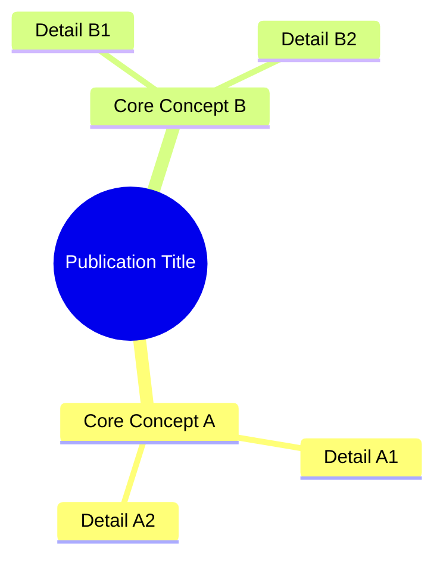

# Documentation Generation — Methodology

> Adapted from `packetqc/knowledge:knowledge/methodology/methodology-documentation-generation.md`

**The methodology for methodology** — Standards, conventions, and patterns for generating publications and documentation in the Knowledge system.

---

## Document Lifecycle

### When to Create a New Publication

A publication is born from a **real engineering need**, not speculation. Criteria:

| Trigger | Example |
|---------|---------|
| New capability demonstrated in practice | Web Page Visualization from diagnostic session |
| Pattern validated across 2+ projects | Session persistence from MPLIB + STM32 |
| Architectural discovery worth preserving | Distributed Minds from harvest protocol design |
| Process codified from repeated manual work | Normalize from repeated structure audits |
| Meta-analysis of accumulated knowledge | Architecture Analysis from system review |

### Maturation Path

```
idea → session memory (near_memory)
    → mindmap node (mind_memory)
    → convention (conventions.json)
    → methodology file (methodology/)
    → publication source (publications/)
    → web pages EN/FR (docs/)
```

**Decision points**: Promote from session memory when validated across 2+ sessions or when the insight is architecturally significant. Publish when the content serves an audience beyond the developer.

---

## Source Document Structure

Every publication source (`publications/<slug>/v1/README.md`) follows this section order:

### 1. Title Block

```markdown
# Title — Descriptive Subtitle

**Publication #N · v1 · Month YYYY**

---
```

### 2. Authors (always present)

Two authors, both with role descriptions explaining their contribution to *this specific* publication.

### 3. Abstract (200–400 words)

Three patterns depending on publication type:

| Pattern | Use when | Structure |
|---------|----------|-----------|
| **Problem-Solution** | Documenting a fix or capability | Problem → How it solves it → Context |
| **Mechanism-first** | Technical guides and protocols | What it does → Why it's distinctive → Where it came from |
| **Living artifact** | Self-referencing hubs | What it is → Its role in the system → Recursive nature |

### 4. Mind Map Diagram (standard — after abstract)

**Every publication includes a mind map or overview diagram immediately after the abstract.** This is the reader's first visual anchor — a summary of the document's scope in one glance.



**Placement rule**: After the abstract, before the first content section.

**Mind map conventions**:
- Root node: publication title or core concept
- First-level: 3–6 main topics covered
- Second-level: key details per topic (2–3 each)
- Keep it scannable — no more than ~25 total nodes

### 5. Content Sections

Standard progression:

| Section | Purpose | Typical position |
|---------|---------|-----------------|
| **Context / Problem** | Why this exists | After mind map |
| **Solution / Mechanism** | How it works | Middle |
| **Implementation** | Deep dives, code, workflows | Middle-to-end |
| **Results / Impact** | Measured outcomes, real data | Near end |
| **Design Principles** | What we learned | Near end |
| **Related Publications** | Cross-references | End |

### 6. Footer

```markdown
---

*Authors: Martin Paquet & Claude (Anthropic, Opus 4.6)*
*Knowledge: [packetqc/knowledge](https://github.com/packetqc/knowledge)*
```

---

## Diagram Integration

### When to Use Diagrams

| Position | Diagram type | Purpose |
|----------|-------------|---------|
| **After abstract** | Mind map | Visual summary of document scope |
| **Problem section** | Flowchart | Visualize the issue being solved |
| **Solution section** | Flowchart / architecture | Show the mechanism |
| **Process sections** | Sequence / state diagram | Step-by-step flow |
| **Data sections** | Gantt / xychart | Timeline or metrics |
| **Architecture sections** | Graph / flowchart | Component relationships |

### Mermaid Type Selection

| Type | Syntax | Best for |
|------|--------|----------|
| `mindmap` | `mindmap` | Document overview, topic summary |
| `flowchart TB` | `flowchart TB` | Top-down hierarchies, data flow |
| `flowchart LR` | `flowchart LR` | Left-to-right pipelines |
| `graph TB/LR` | `graph TB` | General DAG topology |
| `sequenceDiagram` | `sequenceDiagram` | Interaction sequences, API calls |
| `stateDiagram-v2` | `stateDiagram-v2` | State machines, lifecycle |
| `gantt` | `gantt` | Timelines, deployment phases |

### Diagram Styling

- Use `%%{init: {'theme': 'neutral'}}%%` for consistent rendering
- Use `classDef` for color-coding functional groups
- Descriptive node labels with `<br/>` for line breaks
- Clear directional arrows with labels on edges
- Subgraphs for logical grouping

### Source Preservation

When diagrams are pre-rendered to images (PNG for dual-theme support), the Mermaid source MUST be preserved in a `<details class="mermaid-source">` block. See `methodology/web-page-visualization.md` for the full convention.

---

## Table Conventions

### Standard Table Types

| Type | Columns | Use case |
|------|---------|----------|
| **Feature table** | Feature · Description · Impact | Documenting capabilities |
| **Key-value** | Property · Value | Configuration, metadata |
| **Comparison** | Item · Column A · Column B | Before/after, options |
| **Inventory** | Entity · Status · Version · Details | Tracking collections |
| **Timeline** | Date · Event · Impact | History, evolution |

### Table Styling Rules

- Headers are clear and concise (1–3 words)
- **Bold** for emphasis in category labels
- `Backticks` for literal strings (code, files, commands)
- Em-dashes (—) for absent values, not "N/A"
- Markdown pipe syntax exclusively — no HTML tables in source

---

## Writing Style

### Formatting Conventions

| Convention | When | Example |
|------------|------|---------|
| **Bold** | First mention of a key concept | **Distributed Minds** architecture |
| *Italics* | Analogy, metaphor, quality names | the *persistent* quality |
| `Backticks` | Code, files, commands, branches | `harvest --healthcheck` |
| Em-dash (—) | Parenthetical detail | the system — designed for autonomy — adapts |
| ALL CAPS | Critical constraints (rare) | MUST, NEVER, CRITICAL |

### Tone

- Technical but narrative-driven
- Frames "why" before "what"
- Avoids jargon without context
- Includes human elements and real use cases

---

## Three-Tier Publication Structure

### Tier Roles

| Tier | Location | Content | Audience |
|------|----------|---------|----------|
| **Source** | `publications/<slug>/v1/README.md` | Full canonical content | Developer, AI instances |
| **Summary** | `docs/publications/<slug>/index.md` | Abstract + key highlights + links | Quick reader, social sharing |
| **Full** | `docs/publications/<slug>/full/index.md` | Full documentation on web | Deep reader, reference |

### Sync Rules

- **Source → Full**: Full content, adapted for web (front matter, viewer classes)
- **Source → Summary**: Abstract, key table, link to full page. NOT a truncated copy — a curated overview
- **Mind map**: Present in ALL three tiers
- **Diagrams**: All diagrams in full page; key diagrams only in summary

### Bilingual Mirroring

Every page exists as an EN/FR pair:

```
docs/publications/<slug>/index.md          ↔ docs/fr/publications/<slug>/index.md
docs/publications/<slug>/full/index.md     ↔ docs/fr/publications/<slug>/full/index.md
```

**Content**: FR pages are full translations, not truncated versions. Tables, diagrams, and code stay in English. Narrative text is translated.

---

## Web Page Front Matter Contract

### Required Fields

| Field | Format | Example |
|-------|--------|---------|
| `title` | 40–80 characters | "Knowledge — Self-Evolving AI Engineering Intelligence" |
| `description` | One sentence, SEO-optimized | "Master publication for the knowledge system..." |
| `pub_id` | "Publication #N" or "Publication #N — Full" | "Publication #4a" |
| `version` | "vN" | "v2" |
| `pub_date` | "Month YYYY" | "March 2026" |
| `permalink` | `/publications/<slug>/` | `/publications/knowledge-system/` |
| `og_image` | `/assets/og/<slug>-<lang>-cayman.gif` | `/assets/og/knowledge-system-en-cayman.gif` |
| `keywords` | Comma-separated, 4–8 terms | "knowledge, bootstrap, methodology" |

Optional: `live_webcard: mindmap` — renders live MindElixir mindmap instead of static webcard.

**Note**: No `layout` field needed — the K_DOCS viewer IS the layout.

---

## Quality Checklist

Before publishing or delivering a publication:

- [ ] All front matter fields present and correct
- [ ] Abstract answers "why" + "what" + context (200–400 words)
- [ ] Mind map diagram present after abstract
- [ ] Diagrams support the narrative (not decorative)
- [ ] Tables use consistent format (markdown pipes, bold headers)
- [ ] Three tiers created: source + summary + full
- [ ] Bilingual mirrors exist (EN + FR) for all web pages
- [ ] Webcard generated (or placeholder) and `og_image` set
- [ ] Related publications linked
- [ ] Cross-references to sibling publications included

---

## Related

- Original: `packetqc/knowledge:knowledge/methodology/methodology-documentation-generation.md`
- `methodology/web-production-pipeline.md` — Viewer pipeline
- `methodology/webcard-generation.md` — Webcard specs and animation
- `methodology/interactive-documentation.md` — Interactive documentation sessions
- `methodology/documentation-audience.md` — 19-segment audience definition
