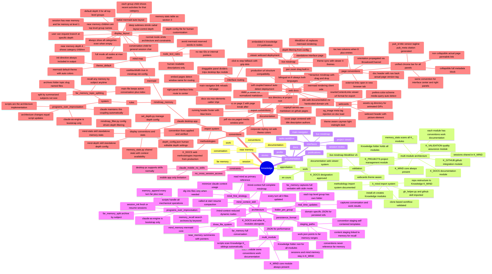

```mermaid
%%{init: {'theme': 'default', 'mindmap': {'useMaxWidth': true}}}%%
mindmap
  root((knowledge))
    session
      near memory
        conversation
        conventions
        work
        documentation
      far memory
    work
      en cours
      validation
        documentation web viewer system
        live mindmap MindElixir v5
        webcards theme aware
        k_mind import system
          repo restructure to Knowledge K_MIND
          install.sh creates Knowledge modules
          gh_helper.py and github skill imported
          methodology import system documented
          clone based workflow validated
        multi module architecture
          Knowledge folder holds all modules
          K_MIND core always present
          K_DOCS documentation module
          K_PROJECTS project management module
          K_VALIDATION quality assurance module
          K_GITHUB github integration module
          each module has conventions work documentation
          sessions shared in K_MIND
          memory_stats scans all K_ modules
      approbation
        K_DOCS designation approved
    documentation
      docs
      interfaces
        main navigator
        project viewer
        session review
        tasks workflow
        live mindmap
      stories
      profile
      publications
    architecture
      persistence_format
        JSON for performance
      three_file_system
        far_memory full conversation
        near_memory summaries with pointers
        mind_memory mermaid core
      mind_first_strategy
        read mind as primary reference
        dig into files only when needed
        minimize claude context usage
      real_time_updates
        every turn all 3 files updated
        far_memory captures full verbatim with stdin mode
        captures conversation and work results
      staging_paths
        convention staging self contained templates
        conventions never reference far memory
        content staging linked to memory for recall
        work.json points to far memory ranges
      folder_per_group
        each top level group has own folder
        domain specific JSON for persisted refs
      multi_module
        Knowledge folder root for all modules
        K_MIND core module always present
        K_DOCS and other K_ modules alongside
        each module owns conventions work documentation
        sessions and mind memory stay in K_MIND
        scripts scan Knowledge K_ siblings automatically
      mind_context_skill
        /mind-context reduced dynamic nodes
        /mind-context full complete mindmap
        called at start resume compaction
      programs_over_improvisation
        claude-as-engine is bootstrap only
        scripts handle all mechanical operations
        memory_append every turn far plus near
        far_memory_split archive by subject
        memory_recall search archives by keyword
        session_init fresh or resume sessions
    constraints
      no_cross_session_access
      claude_mobile_no_skills
        mobile app only limitation
        desktop pc supports skills normally
    conventions
      claude desktop app
        mindmap_memory
          rules
            system
              programs_over_improvisation
                claude-as-engine is bootstrap only
                scripts are the architecture implementation
                architecture changes equal script updates
                claude maintains this coupling automatically
              far_memory_topic_splitting
                split by summarized subjects not size
                archives folder topic slug named files
                main file keeps active conversation plus index
                recall any memory by subject anytime
          mermaid
            mind map
              display_layout
                radial mermaid auto layout
                default depth 3 for all top level groups
                normal mode omits architecture and constraints
                deep subtrees shrink radial layout control depth
                full mode all nodes at max depth
                depth config file for human customization
                user can request branch at specific depth
                session has near memory and far memory at level 1
                near memory depth 4 shows category children
                near memory children are top level group names
                each group child shows recent activities for that category
                conversation child for general session chat
                always show all categories even when empty
                memory stats table as section 3
              theme_default
                mermaid default theme with auto colors
                init directive always included in output
                useMaxWidth true in mindmap init config
              node_text_rules
                human readable descriptions only
                no raw IDs or internal pointers
                avoid mermaid reserved words in nodes
        display conventions and stats
          depth_config.json human editable depth settings
          set_depth.py manage depth config
          mindmap_filter.py config driven depth filtering
          mind-stats skill standalone memory stats
          mind-depth skill standalone depth config
          memory_stats.py shared stats with context availability
          convention fixes applied and verified
      methodologies
        import system
        K_DOCS web methodologies imported from production
      documentation
        web docs
          docs directory at project root
          static js viewer for normalized markdown
          mermaid rendering client side
          interactive mindmap with drag and drop
          production url structure compatibility
          soft coupled baseurl auto detect deployment
          nojekyll serves raw markdown on github pages
          site safe documentation no hardcoded domain urls
          rewriteContentLinks viewer url format for export
          page conventions
            unified chrome bar for all panels
              non collapsible actual page permalink link
              collapsible full metadata block
              pub_id title version tagline pub_meta citation generated
              same convention for interface center and right panels
            doc header with nav back actual page version tag
            toc two columns when 8 plus entries
            external links open in new browser tab
            orientation propagated via BroadcastChannel
          export conventions
            corporate styling not web theme colors
            cover page centered with title description authors
            toc on page 2 with page break after
            running header footer with blue liners
            pdf via css paged media window print
            docx via mso elements calibri 10pt
          interface routing
            right panel interface links route to center
            main navigator link reloads full page
            embed pages detect window name for routing
            draggable panel dividers 14px desktop 8px mobile
            click to step fallback with grip dots
          webcards
            og_image meta tag injection on doc load
            webcard header with picture element
            theme aware cayman light midnight dark
            prefers-color-scheme media query auto detect
            assets og directory for animated GIFs
          bilingual en fr always both languages
          live mindmap
            standalone interface page
            embedded in knowledge 2.0 publication
            viewer webcard deployment
            MindElixir v5 replaces mermaid rendering
            theme sync with viewer 4 themes
            depth filtering from config
            pan zoom drag built in
```
