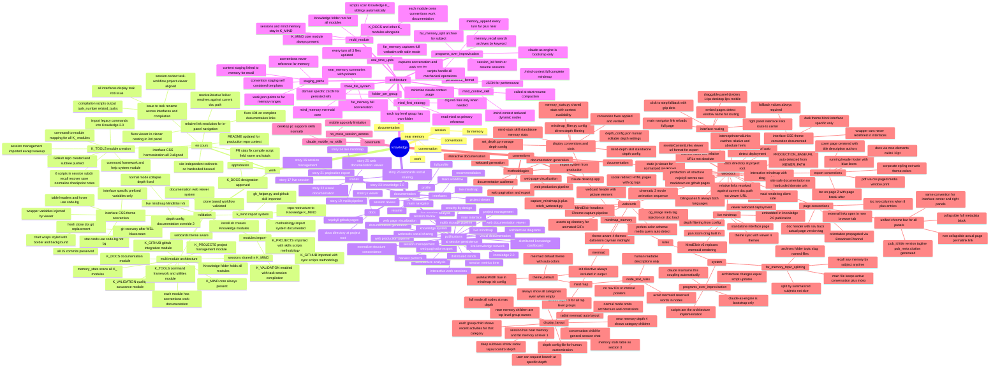

```mermaid
%%{init: {'theme': 'default', 'mindmap': {'useMaxWidth': true}}}%%
mindmap
  root((knowledge))
    session
      near memory
        conversation
        conventions
        work
        documentation
      far memory
    work
      en cours
        issue to task rename across interfaces and compilation
          all interfaces display task not issue
          compilation scripts output task_number related_tasks
          session-review task-workflow project-viewer aligned
        site independent redirects no hardcoded baseurl
        interface CSS harmonization all 3 aligned
        PR stats fix compile script field name and totals
        README updated for production repo context
        relative link resolution for in-panel navigation
          resolveRelativeToDoc resolves against current doc path
          fixes 404 on complete documentation links
          fixes viewer-in-viewer nesting in 3rd panel
        K_TOOLS module creation
          command framework and help system module
          import legacy commands into Knowledge 2.0
          command to module mapping for all K_ modules
          GitHub repo created and subtree pushed
          session management imported except wakeup
          6 scripts in session subdir recall recover save normalize checkpoint notes
      validation
        modules imports
          K_PROJECTS imported with skills scripts methodology
          K_VALIDATION enabled with task session compilation
          K_GITHUB imported with sync scripts methodology
        documentation web viewer system
        live mindmap MindElixir v5
          normal mode collapse depth fixed
          depth config documentation override 2
        webcards theme aware
        interface CSS theme convention
          wrapper variables injected by viewer
          interface specific prefixed variables only
          stat cards use code-bg not bg
          table headers and hover use code-bg
          chart wraps styled with border and background
        git recovery after WSL bluescreen
          fresh clone dot git replacement
          all 15 commits preserved
        k_mind import system
          repo restructure to Knowledge K_MIND
          install.sh creates Knowledge modules
          gh_helper.py and github skill imported
          methodology import system documented
          clone based workflow validated
        multi module architecture
          Knowledge folder holds all modules
          K_MIND core always present
          K_DOCS documentation module
          K_PROJECTS project management module
          K_VALIDATION quality assurance module
          K_GITHUB github integration module
          K_TOOLS command framework and utilities module
          each module has conventions work documentation
          sessions shared in K_MIND
          memory_stats scans all K_ modules
      approbation
        K_DOCS designation approved
    documentation
      docs
        docs directory at project root
        static js viewer
        nojekyll github pages
      interfaces
        main navigator
        project viewer
        session review
        tasks workflow
        live mindmap
      stories
        story 16 session management
        story 17 live session
        story 19 mplib pipeline
        story 21 pagination export
        story 22 visual documentation
        story 23 knowledge 2.0
        story 24 live mindmap
        story 25 web documentation viewer
        story 26 webcards social sharing
      profile
        resume
        recommendation
        full profile
      publications
        knowledge system
        knowledge 2.0
        session management
        live session analysis
        architecture analysis
        architecture diagrams
        documentation generation
        interactive work sessions
        session review
        session metrics time
        normalize structure concordance
        mplib storage pipeline
        harvest protocol
        project management
        distributed minds
        distributed knowledge dashboard
        visual documentation
        web production pipeline
        web pagination export
        web page visualization
        web documentation viewer
        live mindmap
        webcards social sharing
        security by design
        ai session persistence
        main interface
        live knowledge network
    architecture
      persistence_format
        JSON for performance
      three_file_system
        far_memory full conversation
        near_memory summaries with pointers
        mind_memory mermaid core
      mind_first_strategy
        read mind as primary reference
        dig into files only when needed
        minimize claude context usage
      real_time_updates
        every turn all 3 files updated
        far_memory captures full verbatim with stdin mode
        captures conversation and work results
      staging_paths
        convention staging self contained templates
        conventions never reference far memory
        content staging linked to memory for recall
        work.json points to far memory ranges
      folder_per_group
        each top level group has own folder
        domain specific JSON for persisted refs
      multi_module
        Knowledge folder root for all modules
        K_MIND core module always present
        K_DOCS and other K_ modules alongside
        each module owns conventions work documentation
        sessions and mind memory stay in K_MIND
        scripts scan Knowledge K_ siblings automatically
      mind_context_skill
        /mind-context reduced dynamic nodes
        /mind-context full complete mindmap
        called at start resume compaction
      programs_over_improvisation
        claude-as-engine is bootstrap only
        scripts handle all mechanical operations
        memory_append every turn far plus near
        far_memory_split archive by subject
        memory_recall search archives by keyword
        session_init fresh or resume sessions
    constraints
      no_cross_session_access
      claude_mobile_no_skills
        mobile app only limitation
        desktop pc supports skills normally
    conventions
      claude desktop app
        mindmap_memory
          rules
            system
              programs_over_improvisation
                claude-as-engine is bootstrap only
                scripts are the architecture implementation
                architecture changes equal script updates
                claude maintains this coupling automatically
              far_memory_topic_splitting
                split by summarized subjects not size
                archives folder topic slug named files
                main file keeps active conversation plus index
                recall any memory by subject anytime
          mermaid
            mind map
              display_layout
                radial mermaid auto layout
                default depth 3 for all top level groups
                normal mode omits architecture and constraints
                deep subtrees shrink radial layout control depth
                full mode all nodes at max depth
                depth config file for human customization
                user can request branch at specific depth
                session has near memory and far memory at level 1
                near memory depth 4 shows category children
                near memory children are top level group names
                each group child shows recent activities for that category
                conversation child for general session chat
                always show all categories even when empty
                memory stats table as section 3
              theme_default
                mermaid default theme with auto colors
                init directive always included in output
                useMaxWidth true in mindmap init config
              node_text_rules
                human readable descriptions only
                no raw IDs or internal pointers
                avoid mermaid reserved words in nodes
        display conventions and stats
          depth_config.json human editable depth settings
          set_depth.py manage depth config
          mindmap_filter.py config driven depth filtering
          mind-stats skill standalone memory stats
          mind-depth skill standalone depth config
          memory_stats.py shared stats with context availability
          convention fixes applied and verified
      methodologies
        import system from production
        web production pipeline
        web pagination and export
        web page visualization
        documentation generation
        webcard generation
        interactive documentation
        documentation audience
      documentation
        web docs
          docs directory at project root
          static js viewer for normalized markdown
          mermaid rendering client side
          interactive mindmap with drag and drop
          production url structure compatibility
          soft coupled baseurl auto detect deployment
          nojekyll serves raw markdown on github pages
          site safe documentation no hardcoded domain urls
          redirect stubs use relative URLs not absolute
          PRODUCTION_BASEURL auto detected from VIEWER_PATH
          rewriteContentLinks viewer url format for export
          relative links resolved against current doc path not viewer URL
          interceptInternalLinks catches relative and absolute hrefs
          page conventions
            unified chrome bar for all panels
              non collapsible actual page permalink link
              collapsible full metadata block
              pub_id title version tagline pub_meta citation generated
              same convention for interface center and right panels
            doc header with nav back actual page version tag
            toc two columns when 8 plus entries
            external links open in new browser tab
            orientation propagated via BroadcastChannel
          export conventions
            corporate styling not web theme colors
            cover page centered with title description authors
            toc on page 2 with page break after
            running header footer with blue liners
            pdf via css paged media window print
            docx via mso elements calibri 10pt
          interface routing
            right panel interface links route to center
            main navigator link reloads full page
            embed pages detect window name for routing
            draggable panel dividers 14px desktop 8px mobile
            click to step fallback with grip dots
          webcards
            og_image meta tag injection on doc load
            webcard header with picture element
            theme aware 4 themes daltonism cayman midnight
            prefers-color-scheme media query auto detect
            assets og directory for animated GIFs
            MindElixir headless Chrome capture pipeline
            cinematic 3 movie animation sequence
            capture_mindmap.js plus stitch_webcard.py
            social redirect HTML pages with og tags
          interface CSS theme convention documented
            wrapper vars never redefined in interfaces
            dark theme block interface specific only
            fallback values always required
          bilingual en fr always both languages
          live mindmap
            standalone interface page
            embedded in knowledge 2.0 publication
            viewer webcard deployment
            MindElixir v5 replaces mermaid rendering
            theme sync with viewer 4 themes
            depth filtering from config
            pan zoom drag built in
```
