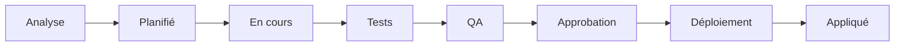

# Plan général

Feuille de route actuelle de Knowledge. Les éléments progressent à travers le cycle de conformité :

[Source : PLAN.md](https://github.com/packetqc/knowledge/blob/main/PLAN.md)

**Table des matières**

- [Tableau de bord GitHub](#tableau-de-bord-github)
- [Nouveautés](#nouveautés)
- [En cours](#en-cours)
- [Corrections](#corrections)
- [Planifié](#planifié)
- [Prévisions](#prévisions)
- [Rappels](#rappels)
- [Terminé](#terminé)

## Tableau de bord GitHub

---

## Nouveautés

| Date | Mise à jour |
|------|-------------|
| 2026-02-26 | **Publication #20 — Compilation métriques et temps de session** — deux méthodologies de compilation (métriques + temps), tableaux extensibles, convention de ligne résumé |
| 2026-02-26 | **Publication #19 — Sessions de travail interactives** — sessions multi-livraison résilientes : 5 types, persistance 3 canaux, commits progressifs |
| 2026-02-26 | **Publication #18 — Méthodologie de génération documentaire** — méta-méthodologie avec héritage universel et alignement 13 qualités |
| 2026-02-26 | **Publication #17 — Pipeline de production web** — chaîne de traitement Jekyll, structure trois niveaux, pièges kramdown |
| 2026-02-26 | **Publication #16 — Visualisation de pages web** — pipeline de rendu local : Playwright, Mermaid-vers-image, préservation des sources |
| 2026-02-26 | **Publication #14 — Analyse d'architecture** — couches de connaissances, architecture des composants, 13 qualités, topologie distribuée |
| 2026-02-26 | **Publication #15 — Diagrammes d'architecture** — 11 diagrammes Mermaid : vue C4, cycle de session, flux distribué |
| 2026-02-26 | **Histoires de succès #16, #17** — sessions de travail productives documentées |
| 2026-02-25 | **Publication #13 — Pagination web et export** — CSS Paged Media PDF, OOXML DOCX, 3 conventions de mise en page |
| 2026-02-25 | **v48 — Wakeup adapté au mode plan** — les satellites reçoivent les lunettes en mode lecture seule |
| 2026-02-24 | **Widgets de tableau en direct** — filtrage par section sur les pages plan, filtres déroulants de statut, diagramme Mermaid |
| 2026-02-24 | **Histoire de succès #12 — Pont humain-personne-machine** — Knowledge comme Jira+Confluence, zéro outil payant |
| 2026-02-23 | **v43–v46** — déduplication wakeup, affichage zéro jeton, convention entrée interactive, PAT classique uniquement |
| 2026-02-22 | **Publication #12 — Gestion de projet** publiée avec pages web 3 niveaux bilingues + webcards |
| 2026-02-22 | **v35–v42** — projets comme entités de premier ordre, auto-guérison satellites, tableaux GitHub Project |

---

## En cours

Éléments actifs — commencés mais pas encore complétés.

---

## Corrections

Problèmes connus à résoudre.

---

## Planifié

Éléments analysés et programmés.

---

## Prévisions

Capacités futures — direction connue, pas encore programmées.

---

## Rappels

Rappels et promotions en attente des renseignements récoltés lors des recherches autonomes profondes.

---

## Terminé

Éléments livrés et appliqués.

---

*Authors: Martin Paquet & Claude (Anthropic, Opus 4.6)*
*Knowledge: [packetqc/knowledge](https://github.com/packetqc/knowledge)*
