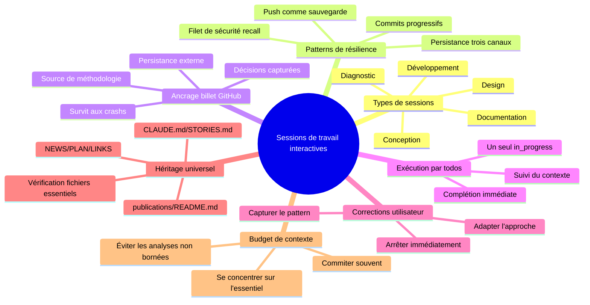

# Sessions de travail interactives
{: #pub-title}

> **Publication parente** : [#0 — Système de connaissances]({{ '/fr/publications/knowledge-system/' | relative_url }}) | **Compagnon session** : [#8 — Gestion de session]({{ '/fr/publications/session-management/' | relative_url }}) | **Compagnon standards** : [#18 — Génération de documentation]({{ '/fr/publications/documentation-generation/' | relative_url }})

**Sommaire**

| | |
|---|---|
| [Résumé](#résumé) | Sessions multi-livraison résilientes |
| [Cinq types de sessions](#cinq-types-de-sessions-interactives) | Diagnostic, documentation, conception, design, développement |
| [Persistance à trois canaux](#persistance-à-trois-canaux) | Git + Billets GitHub + Fichiers essentiels |
| [Commits progressifs](#protocole-de-commits-progressifs) | Points de sauvegarde qui survivent aux crashs |
| [Documentation complète](#documentation-complète) | Référence méthodologique complète |

## Résumé

Les sessions de travail interactives sont le **cœur opérationnel** du système Knowledge. Chaque publication, méthodologie, fonctionnalité et découverte architecturale a été produite lors d'une session interactive entre Martin et Claude. Pourtant, les patterns qui rendent ces sessions productives — commits progressifs, ancrage par billet GitHub, intégration des corrections utilisateur, gestion du budget de contexte — n'avaient jamais été formellement documentés.

Cette publication codifie la méthodologie pour des **sessions interactives résilientes à livraisons multiples**. L'idée clé est la **persistance à trois canaux** : le travail survit à travers les branches Git (commits + pushs), les billets GitHub (persistance externe) et les fichiers essentiels (NEWS.md, PLAN.md, etc.). Quand les trois canaux sont actifs, même un crash catastrophique ne perd au plus que le todo en cours — pas le travail de toute la session.

La méthodologie reconnaît **cinq types de sessions interactives**, chacun avec son propre pattern de phases et son fichier de méthodologie dédié : diagnostic (hypothèse → élimination → correctif), documentation (collecte → structure → miroir), conception (idéation → prototype → validation), design (exploration → proposition → construction) et développement de fonctionnalités (analyse → implémentation → intégration). Tous les types héritent des mêmes patterns de résilience.



## Cinq types de sessions interactives

| Type | Déclencheur | Pattern de phases | Méthodologie |
|------|-------------|-------------------|-------------|
| **Diagnostic** | Rapport de bug, problème de rendu | Hypothèse → élimination → isolation → correctif | `interactive-diagnostic.md` |
| **Documentation** | Nouvelle publication, méthodologie | Collecte → structure → expansion → pages web → livraison | `interactive-documentation.md` |
| **Conception** | Nouvelle idée, exploration d'architecture | Idéation → prototype → retour utilisateur → formalisation | `interactive-conception.md` |
| **Design** | Nouvelle fonctionnalité, architecture, UI | Exploration → proposition → validation → construction | (parapluie) |
| **Développement** | Nouvelle commande, script, pipeline | Analyse → implémentation → test → documentation → intégration | (parapluie) |

Tous les types héritent du même cadre de résilience : commits progressifs, push comme point de sauvegarde, exécution par todos et héritage universel des fichiers essentiels.

## Persistance à trois canaux

Le travail survit à travers trois canaux indépendants :

| Canal | Récupéré via | Survit à | À risque quand |
|-------|-------------|----------|----------------|
| **Branche Git** | `recover`, `resume`, PR manuelle | Crash de session, débordement de contexte | Jamais commité |
| **Billet GitHub** | URL du billet, référence du board | Tout | Billet supprimé (rare) |
| **Fichiers essentiels** | `wakeup` les lit | Fusion du PR sur la branche par défaut | Non commité ou PR non fusionné |

**Résilience maximale** : Les trois canaux actifs. Même un crash catastrophique ne perd au plus que le todo en cours.

## Protocole de commits progressifs

```
Todo 1 → travail → commit → push ✓  (sauvegarde 1)
Todo 2 → travail → commit → push ✓  (sauvegarde 2)
Todo 3 → travail → commit → [CRASH]
                               ↓
                        Nouvelle session :
                        recall → récupère todos 1 + 2 + 3 (si pushé)
                        billet → montre ce que faisait todo 3
                        resume → si checkpoint existe, reprend todo 3
```

## Impact

| Avant | Après |
|-------|-------|
| Un commit en fin de session | Commits progressifs à chaque todo |
| Aucun enregistrement externe | Billet GitHub ancre chaque session multi-livraison |
| Débordement de contexte par analyses exhaustives | Gestion du budget de contexte avec priorité aux fichiers essentiels |
| Corrections utilisateur perdues après compaction | Corrections capturées comme patterns dans la méthodologie |
| Récupération dépend du checkpoint seul | Persistance à trois canaux — branche + billet + fichiers |

## Documentation complète

Pour la méthodologie complète incluant la matrice de récupération, les anti-patterns, les règles de budget de contexte et les détails des cinq types de sessions :

→ [Publication #19 — Documentation complète]({{ '/fr/publications/interactive-work-sessions/full/' | relative_url }})

---

## Publications connexes

| # | Publication | Relation |
|---|-------------|---------|
| 3 | [Persistance de session IA]({{ '/fr/publications/ai-session-persistence/' | relative_url }}) | Méthodologie fondamentale de persistance |
| 8 | [Gestion de session]({{ '/fr/publications/session-management/' | relative_url }}) | Commandes de cycle de vie (wakeup, save, resume, recall) |
| 11 | [Histoires de succès]({{ '/fr/publications/success-stories/' | relative_url }}) | Résultats de sessions validés |
| 18 | [Génération de documentation]({{ '/fr/publications/documentation-generation/' | relative_url }}) | Principe d'héritage universel |

---

*Auteurs : Martin Paquet & Claude (Anthropic, Opus 4.6)*
*Knowledge : [packetqc/knowledge](https://github.com/packetqc/knowledge)*
