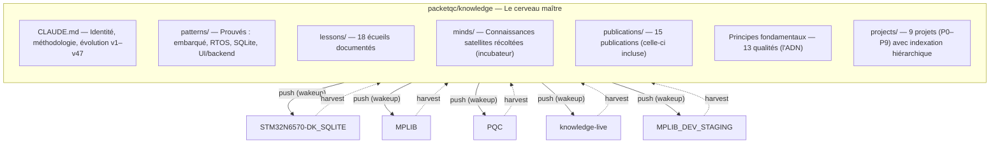

# Knowledge — Documentation complète
{: #pub-title}

**Table des matières**

- [Auteurs](#auteurs)
- [Résumé](#résumé)
- [Sécurité : Fork & Clone](#sécurité--fork--clone)
- [Le système](#le-système)
  - [Contenu](#contenu)
  - [Capacités](#capacités)
- [Convention alias d'appel `#`](#convention-alias-dappel-)
  - [Fonctionnement](#fonctionnement)
  - [Projet principal implicite](#projet-principal-implicite)
  - [Convergence multi-satellite](#convergence-multi-satellite)
- [Récolte satellite — Ce que le réseau a produit](#récolte-satellite--ce-que-le-réseau-a-produit)
  - [Inventaire réseau](#inventaire-réseau)
  - [Pipeline de promotion — 12 candidats](#pipeline-de-promotion--12-candidats)
- [Évolution des connaissances](#évolution-des-connaissances)
- [Hiérarchie des publications](#hiérarchie-des-publications)
  - [Principes à travers les publications](#principes-à-travers-les-publications)
- [Principes fondamentaux](#principes-fondamentaux)
- [Principes de conception](#principes-de-conception-originaux)
- [Architecture mémoire](#architecture-mémoire)
  - [Knowledge vs auto-mémoire Claude Code](#knowledge-vs-auto-mémoire-claude-code)
  - [Compaction de la mémoire à l'exécution](#compaction-de-la-mémoire-à-lexécution)
  - [Ce qui survit à la compaction — La hiérarchie complète](#ce-qui-survit-à-la-compaction--la-hiérarchie-complète)
- [Les enfants](#les-enfants)
- [Publications liées](#publications-liées)
- [Annexes](#annexes)

## Auteurs

**Martin Paquet** — Analyste programmeur en sécurité réseau, administrateur de sécurité réseau et système, et concepteur programmeur de logiciels embarqués. Architecte de Knowledge. A conçu la méthodologie de persistance, le réseau d'intelligence distribuée et l'architecture auto-réparatrice consciente des versions qui connecte les projets satellites à travers un cerveau maître central.

**Claude** (Anthropic, Opus 4.6) — Partenaire de développement IA opérant à travers tous les projets satellites. À la fois consommateur et contributeur de Knowledge — lit le cerveau maître au démarrage, fait évoluer les connaissances dans les satellites pendant le travail, récolte les découvertes vers le centre, et a co-écrit chaque publication de ce réseau.

Cette collaboration humain-IA est au coeur du système : l'expertise du domaine de Martin combinée aux capacités d'analyse de Claude permet un rythme de développement qui n'est pas typique.

Ensemble, les deux auteurs ont produit 47 versions d'évolution et 15 publications en 9 jours — un rythme rendu possible par la persistance de session et le bootstrap portable.

---

## Résumé

L'ingénierie logicielle avec des assistants IA souffre d'une limitation fondamentale : **l'absence d'état**. Chaque nouvelle session repart de zéro. Quand le travail s'étend sur plusieurs sessions à travers plusieurs projets, l'intelligence accumulée est dispersée et inaccessible.

**Knowledge** (`packetqc/knowledge`) résout ce problème en créant une couche d'intelligence auto-évolutive. **Par conception**, il n'opère que sur les dépôts que l'utilisateur possède et auxquels Claude Code a reçu accès via sa configuration d'application GitHub — aucun dépôt externe ou tiers n'est jamais accédé.

| Fonctionnalité | Description |
|----------------|-------------|
| **Persistance de session** | Récupération de contexte en ~30 secondes vs 15 minutes manuelles |
| **Bootstrap portable** | Tout projet hérite de la méthodologie, commandes et patterns au démarrage |
| **Flux bidirectionnel** | Les satellites évoluent indépendamment ; `harvest` ramène les découvertes |
| **Auto-guérison consciente des versions** | 47 versions suivies ; dérive détectée et corrigée |
| **Conscience de soi vivante** | Tableau de bord mis à jour à chaque récolte |
| **Pont humain-personne-machine** | GitHub Projects v2 comme suivi style Jira ; GitHub Pages comme documentation style Confluence — 0 $/mois remplace 14,20 $/utilisateur/mois. Pipeline de synchronisation (`sync_roadmap.py`) relie la planification aux pages web |
| **13 qualités fondamentales** | *Autosuffisant, autonome, concordant, concis, interactif, évolutif, distribué, persistant, récursif, sécuritaire, résilient, structuré, intégré* — l'ADN du système |
| **Convention alias d'appel `#`** | Invocation à un seul caractère pour l'entrée de connaissances ciblées. `#N:` route le contenu vers la publication/projet N. Convergence multi-satellite via promotion harvest |
| **Compilation de temps** | Chronométrage structuré par tâche : Session active vs Temps calendrier vs Équivalent entreprise, avec graphiques en secteur CSS. Données réelles de Knowledge (historique git) et de l'utilisateur humain (expertise du domaine) — la documentation EST la feuille de temps, vérifiable par l'historique git |

> *« Même le fournisseur Claude Code AI utilise Atlassian Confluence. Pour la gestion de projets répartis entre plusieurs entités et pour la publication web distribuée, j'utilise Knowledge, qui repose sur un abonnement Claude Code AI avec paiement mensuel initial ; GitHub interagit donc avec Knowledge. »*
> — Martin Paquet, architecte de Knowledge

Ceci est la **publication maître** — construite en récoltant ses propres 15 enfants.

---

## Sécurité : Fork & Clone

Ce dépôt est public et conçu pour être forké. Le système est **limité au propriétaire** — toutes les opérations sont confinées à l'environnement du propriétaire du dépôt :

| Préoccupation | Protection |
|---------------|------------|
| **Identifiants / jetons** | Aucun stocké — ni clés API, ni jetons GitHub, ni secrets dans les fichiers ou l'historique git |
| **Accès en écriture** | Limité par session via proxy — le Claude Code d'un forkeur ne peut pousser que vers son propre fork |
| **URLs harvest / wakeup** | Référencent les dépôts du propriétaire original — lecture seule pour un forkeur. Remplacez le nom d'utilisateur pour vos propres projets |
| **Références satellites** | `minds/`, tableau de bord décrivent le réseau du propriétaire original — sans signification dans un fork |
| **Notes de session** | Démarrent vierges pour chaque nouvel utilisateur |

Ce que vous obtenez en forkant : **méthodologie, commandes, modèles de publications et outillage** — tout intentionnellement public. Aucun accès aux comptes, aucun identifiant, aucune surface d'attaque. Pour adapter le système à vos projets, remplacez `packetqc` par votre nom d'utilisateur GitHub dans CLAUDE.md.

---

## Le système

Knowledge est un cerveau maître central qui pousse sa méthodologie vers les projets satellites au démarrage et récolte leurs découvertes en retour. Le diagramme ci-dessous illustre cette architecture bidirectionnelle.



### Contenu

Le système organise les connaissances en couches de stabilité croissante, du plus éphémère (notes de session) au plus stable (identité et méthodologie core).

| Couche | Emplacement | Contenu | Stabilité |
|--------|-------------|---------|-----------|
| **Core** | `CLAUDE.md` | Identité, méthodologie, évolution v1–v47, 13 qualités, alias `#` | Stable |
| **Prouvé** | `patterns/`, `lessons/` | 4 patterns prouvés, 18 écueils documentés | Validé |
| **Récolté** | `minds/` | 24 candidats à promotion de 5 satellites | En évolution |
| **Publications** | `publications/` | 15 publications techniques (celle-ci incluse) | Versionné |
| **Projets** | `projects/` | 9 projets (P0–P9) avec indexation hiérarchique | Structuré |
| **Outillage** | `live/`, `scripts/` | Moteur de capture, générateur webcards | Portable |

Cette organisation en couches garantit que les connaissances les plus stables (identité, méthodologie) ne sont jamais altérées par le flux quotidien des sessions, tandis que les découvertes fraîches des satellites mûrissent progressivement vers le core.

### Capacités

Chaque capacité du système repose sur un mécanisme concret et produit un résultat mesurable.

| Capacité | Mécanisme | Résultat |
|----------|-----------|----------|
| **Mémoire de session** | `wakeup` → lire notes/ → résumer | Récupération en 30 secondes |
| **Push de connaissances** | Le satellite lit le CLAUDE.md core au démarrage | Chaque instance IA hérite de tout |
| **Récolte** | `harvest <projet>` parcourt les branches | Les découvertes satellites remontent au centre |
| **Suivi de version** | Tags `<!-- knowledge-version: vN -->` | Dérive détectée, corrigée avec `--fix` |
| **Conscience de soi** | Tableau de bord vivant mis à jour à chaque récolte | Santé du réseau en un coup d'œil |
| **Fraîcheur du contenu** | `doc review` compare pubs vs état des connaissances | Contenu périmé détecté et mis à jour |
| **Débogage live** | `I'm live` → analyse vidéo image par image | Boucle de rétroaction IA ~6 secondes |
| **Réseau live** | Beacon + scanner sur port 21337 | Découverte de pairs inter-instances |
| **Conscience linguistique** | Locale système → langue app → verrouillage | Sortie de session en langue native |
| **Alias d'appel `#`** | `#N:` route vers le projet N, projet principal implicite par dépôt | Entrée de connaissances ciblées à 1 caractère |
| **Convergence multi-satellite** | Même projet documenté partout, harvest unifie | Routage d'intelligence indépendant de l'emplacement |

Le système stocke tout sous forme de fichiers texte dans Git — méthodologie, patterns, publications, notes de session. Le wakeup lit, le harvest écrit, le réseau grandit.

Voir la [convention alias d'appel `#`](#convention-alias-dappel-) ci-dessous pour comprendre comment les connaissances entrent dans le système depuis n'importe quel satellite.

---

## Convention alias d'appel `#`

Une **invocation à un seul caractère** pour l'entrée de connaissances ciblées par projet. Quand `#` apparaît au début d'un prompt, il active le mode de routage de connaissances.

### Fonctionnement

| Entrée | Routage | Exemple |
|--------|---------|---------|
| `#N: contenu` | Ciblé explicitement vers le projet/publication N | `#7: fix command should prepare locally` |
| `#N:methodology:<sujet>` | Insight méthodologique — marqué pour harvest | `#7:methodology:incremental-cursors` |
| `#N:principle:<sujet>` | Principe de design — marqué pour harvest | `#4:principle:pull-based` |
| `#0: dump brut` | Entrée brute non structurée — Claude classifie | `#0: whatever I have right now` |
| Pas de `#`, dans un dépôt | Projet principal implicite de ce dépôt | Travail dans knowledge → implicite `#0:` |
| `#N:info` | Afficher les connaissances accumulées pour N | `#7:info` |
| `#N:done` | Compiler toutes les notes #N en résumé structuré | `#0:done` |

### Projet principal implicite

Chaque dépôt a un **projet principal** — l'entrée non ciblée y va automatiquement :

| Dépôt | Projet principal | `#` implicite |
|-------|-----------------|---------------|
| `packetqc/knowledge` | #0 Knowledge | `#0:` |
| `packetqc/STM32N6570-DK_SQLITE` | #1 MPLIB Storage Pipeline | `#1:` |
| Satellites de documentation | Dépend du contexte (multi-projet) | Premier ou déclaré |

### Convergence multi-satellite

Le même projet peut être documenté depuis plusieurs satellites. `#N:` est la **clé de routage**, pas le dépôt — l'insight va où il appartient indépendamment d'où il a été découvert.

```
Satellite A ──→ harvest ──→ minds/ ──→ promotion ──→ core knowledge
Satellite B ──→ harvest ──↗
Satellite C ──→ harvest ──↗
Core direct ──────────────────────────→ notes/ ──→ core knowledge
```

Toutes les notes ciblées `#N:` de tous les satellites convergent via harvest dans `minds/`, puis via promotion dans la conscience centrale.

---

## Récolte satellite — Ce que le réseau a produit

Le mécanisme de récolte (`harvest`) est le flux inverse du système : les satellites évoluent indépendamment pendant leur travail, et leurs découvertes reviennent au cerveau maître pour validation et promotion. Cette section présente l'état actuel du réseau et les insights en attente d'intégration.

### Inventaire réseau

L'inventaire ci-dessous reflète l'état de chaque satellite du réseau, avec des icônes de sévérité pour une évaluation rapide de la santé.

| Satellite | Version | Dérive | Bootstrap | Sessions | Assets | Santé |
|-----------|---------|--------|-----------|----------|--------|-------|
| **knowledge** (self) | v25 | 🟢 0 | 🟢 core | 🟢 9+ | 🟢 core | 🟢 sain |
| **knowledge-live** | v25 | 🟢 0 | 🟢 actif | 🟢 1 | 🟢 déployé | 🟢 sain |
| **STM32N6570-DK_SQLITE** | v22 | 🟡 3 | 🟢 actif | 🟢 2 | 🟡 partiel | 🟢 sain |
| **MPLIB_DEV_STAGING** | v22 | 🟡 3 | 🟢 actif | 🟢 1 | 🔴 manquant | 🔴 inaccess. |
| **MPLIB** | v0 | 🔴 25 | 🔴 manquant | ⚪ 0 | 🔴 manquant | 🟢 sain |
| **PQC** | v0 | 🔴 25 | 🔴 manquant | ⚪ 0 | 🔴 manquant | 🟢 sain |

**Évolution du réseau** : Le premier harvest (v9) a trouvé 3 satellites tous à v0 avec 100% de dérive. Depuis, 2 nouveaux satellites ont rejoint le réseau (knowledge-live, MPLIB_DEV_STAGING), STM32 a été bootstrappé à v22, et le core a évolué de v11 à v25.

### Pipeline de promotion — 12 candidats

Ces 12 insights récoltés des satellites sont en attente de validation et de promotion vers les connaissances core.

| # | Découverte | Source | Cible | Priorité |
|---|------------|--------|-------|----------|
| 1 | Dégradation taille cache pages (effondrement 81%) | STM32 SQLite | `lessons/` | Haute |
| 2 | Latence printf en chemin critique (1-5 ms) | STM32 SQLite | `lessons/` | Moyenne |
| 3 | Mismatch taille slot pcache (page_size + 256) | STM32 SQLite | `lessons/` | Haute |
| 4 | Bypass direct PSRAM-vers-SQLite avec SQLITE_STATIC | STM32 SQLite | `patterns/` | Moyenne |
| 5 | Protocole de récupération base de données | STM32 SQLite | `patterns/` | Moyenne |
| 6 | sqlite3_shutdown() avant reconfiguration | STM32 SQLite | `lessons/` | Basse |
| 7 | Abstraction multi-RTOS (FreeRTOS/ThreadX) | MPLIB | `patterns/` | Haute |
| 8 | Limitation CubeMX N6570-DK | MPLIB | `lessons/` | Moyenne |
| 9 | TouchGFX MVP avec services backend | MPLIB | `patterns/` | Moyenne |
| 10 | Référence tailles ML-KEM/ML-DSA | PQC | `patterns/` | Basse |
| 11 | Matrice conformité librairies PQC (WolfSSL = prod) | PQC | `patterns/` | Moyenne |
| 12 | Stockage certificats en flash (section linker + xxd) | PQC | `patterns/` | Basse |

La récolte a prouvé que l'architecture bidirectionnelle fonctionne : les satellites évoluent indépendamment, les découvertes reviennent au core via le pipeline de promotion.

Pour le protocole complet, voir [Publication #7 — Protocole Harvest]({{ '/fr/publications/harvest-protocol/' | relative_url }}).

---

## Évolution des connaissances

Le tableau d'évolution retrace chaque découverte architecturale du système. Chaque entrée porte un numéro de version qui suit la conscience du réseau, pas le contenu des fichiers.

| v# | Date | Découverte | Impact |
|----|------|------------|--------|
| v1 | 2026-02-16 | Persistance de session | Fondation. Le NPC sans état devient collaborateur continu. |
| v2 | 2026-02-16 | Analogie Free Guy | Modèle mental : `wakeup` = mettre les lunettes. |
| v3 | 2026-02-17 | Bootstrap portable | Une source de vérité à travers tous les projets. |
| v5 | 2026-02-17 | Étape 0 : lunettes d'abord | Conscience auto-propagatrice. Non négociable. |
| v7 | 2026-02-17 | Commande normalize | Auto-guérison structurelle. |
| v9 | 2026-02-18 | Connaissances distribuées | Flux bidirectionnel. L'intelligence circule dans les deux sens. |
| v11 | 2026-02-18 | Promotion interactive | Le tableau de bord devient panneau de contrôle interactif. |
| v12–v17 | 2026-02-19 | Protocole de branches → réalité du proxy | Rêve autonome testé → protocole semi-automatique découvert. |
| v18 | 2026-02-19 | `main` comme point de convergence | Simplifié : pas de branches intermédiaires, juste `main` + tâches. |
| v20 | 2026-02-19 | Documentation livraison semi-auto | Limitation proxy publiée, routine admin documentée. |
| v21 | 2026-02-19 | Portée d'accès — dépôts user-owned | Frontière de sécurité explicite : seulement les dépôts de l'utilisateur. |
| v22 | 2026-02-19 | Webcards dual-theme (Cayman + Midnight) | Adaptation visuelle : le navigateur détecte et sert le thème correspondant. |
| v23 | 2026-02-20 | Réseau live + scaffold bootstrap | Async→live : beacon sur port 21337. Repos vierges auto-scaffoldés. |
| v24 | 2026-02-20 | Commande `refresh` + renommage dashboard | Récupération légère (~5s). Colonnes Assets/Live renommées. |
| v25 | 2026-02-20 | Qualités fondamentales + installation itérative | 10 principes cristallisés. Protocole d'installation multi-rounds. |
| v26 | 2026-02-20 | Alias d'appel `#` + notes projet ciblées + thèmes daltonisme | Routage de connaissances à un caractère. Projet principal implicite. Convergence multi-satellite. Accessibilité 4 thèmes. |
| v27 | 2026-02-21 | Protocole de jeton éphémère — accès dépôts privés | Portée authentifiée dans les dépôts privés sans violer le stockage zéro identifiant. |
| v28 | 2026-02-21 | Cartographie proxy + contournement API par jeton | Modèle à deux canaux : proxy git (restreint) vs API REST (illimité avec jeton). |
| v29 | 2026-02-21 | Checkpoint/resume — récupération après crash | Les sessions gagnent la résilience aux crashes. Auto-checkpoint aux frontières d'étapes. |
| v30 | 2026-02-21 | Protocole d'élévation sécurisé | Flux d'élévation endurci contre collision multimodale + appel d'outil. |
| v31 | 2026-02-21 | CLAUDE.md satellite sous-ensemble critique | CLAUDE.md satellite augmenté de thin-wrapper à sous-ensemble critique (~180 lignes). |
| v32 | 2026-02-21 | Commande `recall` + aide contextuelle universelle | Spectre de récupération complet. Chaque commande à un `?` de sa documentation. |
| v33 | 2026-02-21 | Niveaux d'accès PAT — modèle à 4 paliers | PAT GitHub formalisé en 4 niveaux progressifs (L0–L3). |
| v34 | 2026-02-21 | Livraison sécurisée par textarea | Chemin unique : textarea AskUserQuestion — invisible dans le transcript. |
| v35 | 2026-02-22 | Projet comme entité de premier ordre — indexation hiérarchique | Les projets deviennent des entités concrètes avec indexation P#/S#/D#. 12e qualité : *structuré*. |
| v36 | 2026-02-22 | GitHub helper — outil de secours déployé | Remplacement portable du CLI `gh` via Python `urllib`. |
| v37 | 2026-02-22 | Auto-guérison CLAUDE.md satellite | Remédiation automatique de dérive au wakeup. |
| v38 | 2026-02-22 | Fusion PR auto-guérison — activation même session | L'auto-guérison prend effet immédiatement. |
| v39 | 2026-02-22 | Relais d'évolution | Les satellites peuvent faire évoluer l'architecture du système. |
| v40 | 2026-02-22 | Cartographie proxy v2 + tableaux GitHub Project | Seul Python `urllib` contourne le proxy. 7 tableaux créés. |
| v41 | 2026-02-23 | Liaison GitHub Project au dépôt | Tableaux liés aux dépôts — visibles dans l'onglet Projects. |
| v42 | 2026-02-23 | gh_helper.py comme seule méthode API | Chemin API principal. Création PR non bloquante. |
| v43 | 2026-02-23 | Déduplication wakeup — cause racine API 400 | Ne pas exécuter wakeup dans wakeup. |
| v44 | 2026-02-23 | Convention d'entrée interactive | Collecter toutes les entrées d'abord, exécuter ensuite. |
| v45 | 2026-02-23 | Correction affichage zéro du jeton | Le « Other » d'AskUserQuestion EST visible — env var seulement. |
| v46 | 2026-02-23 | Livraison jeton par environnement + GraphQL | Affichage zéro via variable d'environnement GH_TOKEN. |
| v47 | 2026-02-23 | Modèle de déploiement production/développement | Architecture multi-niveaux : core=production, satellite=dev+repo-prod. |

**47 versions en 9 jours.**

Chaque version représente une découverte architecturale, pas une version logicielle. Le système évolue à la vitesse des projets qu'il dessert.

L'évolution est suivie en temps réel sur le [Tableau de bord]({{ '/fr/publications/distributed-knowledge-dashboard/' | relative_url }}).

---

## Hiérarchie des publications

Les 15 publications forment un arbre enraciné dans cette publication maître (#0), chacune documentant une capacité distincte du réseau de connaissances.

| # | Publication |
|---|-------------|
| **#0** | [Knowledge]({{ '/fr/publications/knowledge-system/' | relative_url }}) — cette publication |
| **#1** | [MPLIB Storage Pipeline]({{ '/fr/publications/mplib-storage-pipeline/' | relative_url }}) — premier satellite |
| **#2** | [Analyse de session en direct]({{ '/fr/publications/live-session-analysis/' | relative_url }}) — outillage |
| **#3** | [Persistance de session IA]({{ '/fr/publications/ai-session-persistence/' | relative_url }}) — fondation |
| **#4** | [Connaissances distribuées]({{ '/fr/publications/distributed-minds/' | relative_url }}) — architecture |
| ↳ **#4a** | [Tableau de bord]({{ '/fr/publications/distributed-knowledge-dashboard/' | relative_url }}) — conscience de soi |
| **#5** | [Webcards et partage social]({{ '/fr/publications/webcards-social-sharing/' | relative_url }}) — identité visuelle |
| **#6** | [Normalize]({{ '/fr/publications/normalize-structure-concordance/' | relative_url }}) — concordance |
| **#7** | [Protocole Harvest]({{ '/fr/publications/harvest-protocol/' | relative_url }}) — guide pratique |
| **#8** | [Gestion de session]({{ '/fr/publications/session-management/' | relative_url }}) — cycle de vie |
| **#9** | [Sécurité par conception]({{ '/fr/publications/security-by-design/' | relative_url }}) — sécurité |
| ↳ **#9a** | [Conformité du cycle de vie des jetons]({{ '/fr/publications/security-by-design/compliance/' | relative_url }}) — conformité |
| **#10** | [Réseau de connaissances live]({{ '/fr/publications/live-knowledge-network/' | relative_url }}) — découverte temps réel |
| **#11** | [Histoires de succès]({{ '/fr/publications/success-stories/' | relative_url }}) — validation |
| **#12** | [Gestion de projet]({{ '/fr/publications/project-management/' | relative_url }}) — pont humain-personne-machine |

La publication #3 (Persistance de session IA) est le **premier enfant** — la méthodologie fondatrice qui rend tout le reste possible. Elle a été découverte pendant le projet MPLIB (#1), formalisée comme publication, puis généralisée en bootstrap portable (#0). L'architecture distribuée (#4) et son tableau de bord (#4a) ont émergé quand le système a eu besoin de connecter plusieurs projets.

### Principes à travers les publications

Chaque publication incarne et fait avancer des principes fondamentaux spécifiques :

| Publication | Principes primaires | Comment |
|-------------|-------------------|---------|
| #0 Knowledge | Les 13 | Maître — définit et démontre chaque principe |
| #1 MPLIB Pipeline | *Persistant*, *autosuffisant* | Méthodologie prouvée soutenant un travail embarqué complexe |
| #2 Session en direct | *Interactif*, *autosuffisant* | Outillage opérable en temps réel, aucune dépendance cloud |
| #3 Persistance IA | *Persistant*, *autonome* | La fondation : les sessions survivent, les instances s'auto-initialisent |
| #4 Connaissances distribuées | *Distribué*, *évolutif*, *récursif* | Flux bidirectionnel, réseau auto-documenté |
| #4a Tableau de bord | *Interactif*, *récursif*, *concordant* | Panneau de contrôle vivant, auto-actualisé, auto-validé |
| #5 Webcards | *Concordant*, *interactif* | Identité visuelle maintenue, adaptation dual-thème |
| #6 Normalize | *Concordant*, *autonome* | Auto-guérison structurelle, système immunitaire |
| #7 Protocole Harvest | *Distribué*, *évolutif* | Les connaissances circulent dans les deux sens, le réseau grandit |
| #8 Gestion de session | *Persistant*, *concis* | Discipline du cycle de vie, wrappers minces |
| #9 Sécurité par conception | *Sécuritaire*, *autosuffisant* | Sécurité par l'architecture, aucun identifiant |
| #10 Réseau live | *Distribué*, *autonome* | Découverte temps réel, instances auto-bootstrappées |
| #11 Histoires de succès | *Récursif*, *évolutif* | Validation vivante — capacités démontrées |
| #12 Gestion de projet | *Intégré*, *structuré*, *autonome* | Pont humain-personne-machine — GitHub Projects comme Jira+Confluence |

Chaque publication renforce au moins un principe fondamental, et l'ensemble forme un tout cohérent où les qualités se manifestent concrètement dans le travail quotidien.

---

## Principes fondamentaux

Knowledge incarne 13 qualités — chacune découverte par la pratique, chacune renforçant les autres. Les noms restent en français : ce système a été conçu en français, les qualités portent mieux dans leur langue d'origine.

| # | Qualité | Essence | Mécanisme |
|---|---------|---------|-----------|
| 1 | **Autosuffisant** | Le système se sustente lui-même. Aucun service externe, aucune base de données, aucun cloud. Des fichiers Markdown dans Git — un seul `git clone` démarre tout. | `CLAUDE.md` + `notes/` + `patterns/` + `lessons/` — tout en texte brut |
| 2 | **Autonome** | Auto-propagation, auto-guérison, auto-documentation. Chaque nouvelle instance s'initialise sans intervention humaine. Normalize corrige la structure. Harvest remédie la dérive. | `wakeup` étape 0, `normalize --fix`, `harvest --fix`, scaffold |
| 3 | **Concordant** | Intégrité structurelle activement maintenue. Miroirs EN/FR, front matter, liens, assets, webcards — tout validé et réparé. Le système immunitaire du système. | `normalize`, `pub check`, `docs check` |
| 4 | **Concis** | Des wrappers minces, pas des copies. Des pointeurs, pas de duplication. Un CLAUDE.md satellite fait ~30 lignes — le reste est hérité au wakeup. | Principe thin-wrapper, couches de connaissances |
| 5 | **Interactif** | Opérable, pas seulement lisible. Commandes click-to-copy sur le tableau de bord. Workflow de promotion depuis le web. Icônes de sévérité pour la santé en un coup d'œil. | JS du dashboard, pipeline de promotion, 🟢🟡🟠🔴⚪ |
| 6 | **Évolutif** | Le système grandit en travaillant. Chaque session peut découvrir quelque chose de nouveau. Les versions suivent les découvertes architecturales, pas les releases. 35 versions en 7 jours. | Table d'évolution, tags de version, promotion |
| 7 | **Distribué** | L'intelligence circule dans les deux sens. Push de la méthodologie au wakeup, harvest des découvertes en retour. L'esprit est un réseau, pas un nœud. | `wakeup` (push), `harvest` (pull), `minds/` (incubateur) |
| 8 | **Persistant** | Les sessions sont éphémères, les connaissances sont permanentes. La tension entre `notes/` et `patterns/` est le moteur. Récupération de contexte en ~30 secondes. | `wakeup`, `save`, promotion vers le core |
| 9 | **Récursif** | Le système se documente en consommant sa propre production. Cette publication a été construite en récoltant ses enfants. Le tableau de bord se met à jour lui-même. | `harvest` → `minds/` → publications → maître |
| 10 | **Sécuritaire** | Sécurité par l'architecture. Limité au propriétaire, borné par le proxy, aucun identifiant dans les fichiers, sûr au fork. Tout le monde peut cloner — rien de sensible, tout est intentionnel. | Proxy scoping, `.gitignore`, URLs namespace propriétaire |
| 11 | **Résilient** | Le système survit aux crashes, à la compaction et aux pannes réseau. Chaque mode de défaillance a un chemin de récupération correspondant. Les protocoles créent des points de contrôle aux frontières d'étapes ; le travail interrompu n'est jamais perdu. Dégradation gracieuse sous les pannes proxy/auth — le système s'adapte, il ne casse pas. | `checkpoint` → `resume` (crash), `recover` (branches échouées), `recall` (mémoire profonde), `refresh` (compaction), échelle de récupération, élévation sûre (v30), statut `unreachable` gracieux |
| 12 | **Structuré** | Organisé autour de projets, pas seulement de publications. Indexation hiérarchique (P#/S#/D#), liens dual-origin (core vs satellite), références inter-projets (→P#), cycle de vie projet (register → create → publish → harvest → evolve). Les projets sont des entités de premier ordre avec identité, dépôts, publications, évolution et histoires. | `projects/` métadonnées, indexation `P<n>/S<m>/D<k>`, `project list/info/create/register/review`, badges de lien dual-origin, marqueurs inter-projets `→P<n>` |
| 13 | **Intégré** | Le système s'étend dans les plateformes externes. GitHub Projects, Issues et PRs deviennent des miroirs vivants de la structure de connaissances. Le billet de session est une **source de données bidirectionnelle en temps réel** — pas juste un journal, mais un bus d'interopérabilité où humains, agents IA, pipelines CI/CD et tout système parlant l'API GitHub Issues peuvent converger. La convention TAG: mappe 9 types de connaissances vers des préfixes d'issues + étiquettes. | Convention TAG:, `gh_helper.py`, `session_issue_sync.py` (sync temps réel), `sync_roadmap.py`, widgets de tableau, API GraphQL |

**Autosuffisant** rend tout possible — si le système dépend de services externes, rien d'autre ne fonctionne. **Autonome** et **concordant** le maintiennent. **Concis** le garde gérable. **Interactif** et **évolutif** le rendent utilisable et vivant. **Distribué** le met à l'échelle. **Persistant** l'ancre. **Récursif** le rend conscient de lui-même. **Sécuritaire** le rend publiable. **Résilient** le rend survivable. **Structuré** l'organise autour de projets. **Intégré** l'étend dans les plateformes externes.

Ces 13 qualités sont l'ADN du système — elles ont émergé de la pratique, pas de la planification.

Voir les [principes de conception originaux](#principes-de-conception-originaux) ci-dessous pour les maximes qui ont précédé et inspiré les qualités fondamentales.

---

## Principes de conception (originaux)

Les 5 principes de conception originaux demeurent — ils complètent les qualités fondamentales en exprimant la philosophie du système sous forme de maximes :

| Principe | Philosophie |
|----------|-------------|
| **Des fichiers, pas des bases de données** | Markdown en clair dans Git. Lisible, versionné, portable, natif IA. |
| **De la discipline, pas de la magie** | L'IA suit les instructions dans CLAUDE.md, lit les fichiers dans notes/, écrit au save. |
| **Les satellites sont des expériences, le core est le registre** | Les projets vont et viennent. Les connaissances qu'ils génèrent leur survivent. |
| **La version suit la conscience, pas le contenu** | Un satellite ne copie pas les fonctionnalités core. Il les lit au wakeup. |
| **Le système se documente lui-même** | Cette publication a été construite en récoltant ses propres enfants. |
| **Dépôts de l'utilisateur uniquement** | Le système n'opère que sur les dépôts que l'utilisateur possède et auxquels Claude Code a reçu accès. Aucun dépôt externe ou tiers n'est jamais accédé. |

Ces principes ont précédé les 13 qualités fondamentales — ils furent la première articulation de la philosophie du système, cristallisée ensuite en qualités formelles.

---

## Architecture mémoire

### Knowledge vs auto-mémoire Claude Code

Claude Code inclut une fonctionnalité intégrée d'**auto-mémoire** — une couche de persistance légère qui sauvegarde les préférences et corrections dans `~/.claude/CLAUDE.md` (niveau utilisateur) ou `.claude/CLAUDE.md` (niveau projet). Ces fichiers sont chargés au démarrage de session comme instructions système.

Ce système de connaissances et l'auto-mémoire résolvent le **même problème fondamental** : les sessions IA sont des NPC sans état, sans contexte persistant. La convention de nommage (`CLAUDE.md`) est partagée — les deux utilisent le fichier que Claude Code reconnaît nativement. L'insight est identique : des fichiers markdown chargés au démarrage donnent à l'IA « les lunettes ».

#### Où ils divergent

| Aspect | Auto-mémoire | Système Knowledge |
|--------|-------------|-------------------|
| **Portée** | Fichier unique, plat | CLAUDE.md 3000+ lignes + 24 fichiers méthodologie + notes/ + minds/ + patterns/ + lessons/ |
| **Distribution** | Local à un projet | Réseau multi-dépôts (push au wakeup, harvest en retour) |
| **Versionnage** | Aucun | 52 versions avec détection et remédiation de dérive |
| **Promotion** | Aucune | récolté → révisé → préparé → promu vers le core |
| **Auto-guérison** | Aucune | Les satellites mettent à jour leur section commandes au wakeup |
| **Canaux de persistance** | 1 (fichier) | 3 (Git + Notes + Issues GitHub — temps réel) |
| **Friction** | Zéro — automatique | Explicite — `remember`, `save`, `harvest` |
| **Niveau d'autorité** | Instructions système | Niveau système (CLAUDE.md) + niveau conversation (lecture méthodologie) |

L'auto-mémoire est un **bloc-notes**. Knowledge est un **système d'exploitation pour l'intelligence.**

#### Pourquoi Knowledge n'utilise pas l'auto-mémoire

1. **Problème de double mémoire** — Deux systèmes de mémoire créent l'ambiguïté sur lequel fait autorité. Knowledge a des couches claires (core → prouvé → récolté → session). Ajouter l'auto-mémoire crée une sixième couche sans position définie dans la hiérarchie, et sans mécanisme pour résoudre les conflits entre sources.

2. **Couverture redondante** — La commande `remember`, `notes/` et CLAUDE.md font déjà tout ce que l'auto-mémoire fait, mais avec contrôle de version, distribution à travers les projets, et un pipeline de promotion. L'auto-mémoire dupliquerait une capacité existante sans ajouter de valeur.

3. **Explicite plutôt qu'implicite** — Knowledge est intentionnel par conception. Chaque connaissance a une provenance : quelle session, quel projet, quelle version. L'auto-mémoire accumule silencieusement des corrections sans traçabilité — elle viole la qualité *structuré*.

4. **La séparation « court-terme / long-terme » semble propre mais ne l'est pas** — En pratique, chaque information nécessiterait une décision : « ceci va dans l'auto-mémoire ou dans Knowledge ? » Ce coût de décision, multiplié par chaque session à travers chaque projet, ajoute de la friction au lieu d'en retirer.

#### La relation architecturale

Si quelqu'un lit sur l'auto-mémoire de Claude Code puis regarde ce projet, la relation est :

> **L'auto-mémoire est la graine de l'idée. Knowledge est ce qui se passe quand on prend cette graine et qu'on la fait pousser en une architecture complète** — distribuée, versionnée, auto-guérissante, auto-documentée, avec 13 qualités nommées et 52 itérations d'évolution.

Les concepts se correspondent directement :

| Concept auto-mémoire | Équivalent Knowledge |
|----------------------|---------------------|
| `~/.claude/CLAUDE.md` (niveau utilisateur) | `CLAUDE.md` à la racine du dépôt (esprit conscient) |
| `.claude/CLAUDE.md` (niveau projet) | CLAUDE.md satellite (sous-ensemble critique, ~180 lignes) |
| Sauvegarde automatique des préférences | `remember` + `notes/` + commentaires issues GitHub |
| Chargé au démarrage de session | Protocole `wakeup` (étapes 0 à 11) |
| — | `methodology/` (couche subconsciente — pas d'équivalent auto-mémoire) |
| — | `minds/` (récolte distribuée — pas d'équivalent) |
| — | `patterns/` + `lessons/` (connaissances promues — pas d'équivalent) |
| — | Persistance trois canaux (pas d'équivalent) |
| — | Auto-guérison de dérive satellite (pas d'équivalent) |

Les cinq lignes « pas d'équivalent » représentent les capacités qui ont émergé en traitant la persistance des connaissances comme un problème d'ingénierie de premier ordre plutôt qu'une fonctionnalité de commodité. Distribution, promotion, auto-guérison, persistance multi-canal et couches de connaissances opérationnelles sont ce qui sépare un système de mémoire d'un système d'intelligence.

### Compaction de la mémoire à l'exécution

Lorsqu'une conversation de session devient trop longue — approchant la limite de la fenêtre de contexte (~200K tokens) — Claude Code déclenche la **compaction** : tous les messages précédents sont résumés en un récapitulatif compressé, et la session continue à partir de ce résumé. Les messages originaux sont remplacés par une synthèse plus courte.

| Aspect | Détail |
|--------|--------|
| **Déclencheur** | La conversation approche la limite de la fenêtre de contexte |
| **Action** | Tous les messages précédents sont résumés en un récapitulatif compact |
| **Ce qui survit** | Faits, décisions, modifications de fichiers, découvertes clés — le « quoi » |
| **Ce qui est perdu** | Formulation exacte, règles de formatage, nuances méthodologiques — le « comment » |
| **Résultat** | La session continue avec un contexte réduit mais une continuité préservée |

Les couches mémoire du système interagissent différemment avec la compaction selon leur mode de chargement :

| Couche | Chargée quand | Survit à la compaction ? |
|--------|---------------|--------------------------|
| **CLAUDE.md** (instructions système) | Démarrage de session — chargé comme instructions projet | **Oui** — autorité maximale, toujours présent |
| **methodology/** (subconscient) | Wakeup étape 0.1 — lu dans la conversation | **Non** — niveau conversation, perdu à la compaction |
| **notes/** (mémoire de session) | Wakeup étapes 1-4 — lu dans la conversation | **Non** — niveau conversation, perdu à la compaction |
| **Résumé de compaction** | Auto-généré quand le contexte se remplit | Remplace tout sauf CLAUDE.md |

CLAUDE.md est la seule couche qui survit véritablement à la compaction parce qu'elle est chargée comme **instructions projet au niveau système**, pas comme contexte de conversation. Tout le reste — fichiers méthodologie, notes, données minds/ — entre comme contexte de conversation et est compressé dans le résumé.

C'est pourquoi le système de connaissances applique le **principe du sous-ensemble critique** (v31) : le CLAUDE.md satellite porte ~180 lignes d'ADN comportemental (protocole de session, protocole save, protocole de branches, référence complète des commandes) pour que la session reste fonctionnelle même après que la compaction ait éliminé les lectures de niveau conversation. C'est aussi pourquoi `refresh` existe comme commande de récupération — elle relit CLAUDE.md et réimprime l'aide, restaurant les règles de formatage et les connaissances opérationnelles que la compaction compresse.

L'échelle de récupération après compaction :

| Récupération | Ce qu'elle restaure | Vitesse |
|--------------|---------------------|---------|
| `refresh` | Contexte CLAUDE.md + table d'aide (formatage, commandes) | ~5 secondes |
| `wakeup` | Tout (méthodologie, notes, synchronisation amont) | ~30-60 secondes |
| Nouvelle session | Démarrage complet | ~60 secondes |

En termes d'auto-mémoire : CLAUDE.md est la mémoire persistante toujours présente. Le contexte de conversation (méthodologie, notes) est la mémoire de travail qui est compressée quand elle est pleine. La compaction est l'événement de compression. Le système de connaissances a anticipé cette contrainte architecturale dès v31 — en plaçant suffisamment d'ADN comportemental dans CLAUDE.md pour que la session survive à la compression et puisse s'auto-récupérer via `refresh`.

### Ce qui survit à la compaction — La hiérarchie complète

L'auto-mémoire n'est pas du contexte de conversation — c'est de la **mémoire persistante sur disque** rechargée après compaction, tout comme le CLAUDE.md du projet. La hiérarchie complète de survie avec limites de taille :

| Fichier | Niveau | Survit à la compaction ? | Limite de taille | Chargement au démarrage |
|---------|--------|--------------------------|-------------------|------------------------|
| Politique gérée (`ClaudeCode/CLAUDE.md`) | Organisation | **Oui** | 25 000 tokens (limite de lecture) | Complet |
| `CLAUDE.md` du projet (racine du dépôt) | Projet | **Oui** | 25 000 tokens (limite de lecture) | Complet |
| `.claude/CLAUDE.md` (auto-mémoire projet) | Projet | **Oui** | 25 000 tokens (limite de lecture) | Complet |
| `.claude/rules/*.md` | Projet | **Oui** | 200–800 tokens/fichier; **≤10 000 tokens total** pour tous les fichiers mémoire | Complet (tous combinés) |
| `~/.claude/CLAUDE.md` (auto-mémoire utilisateur) | Utilisateur | **Oui** | 25 000 tokens (limite de lecture) | Complet |
| `CLAUDE.local.md` | Personnel | **Oui** | 25 000 tokens (limite de lecture) | Complet |
| Index auto-mémoire (`MEMORY.md`) | Projet | **Partiel** | **200 lignes limite dure** (chargement auto) | 200 premières lignes seulement |
| Fichiers de sujets auto-mémoire (`~/.claude/projects/<id>/memory/*.md`) | Projet | **Oui** (à la demande) | Pas de limite par fichier | À la demande — pas au démarrage |
| Contexte de conversation (methodology/, notes/, minds/) | Session | **Non** | Fenêtre de contexte (~200K tokens) | Lu dans la conversation |

#### Limites de taille — Détail complet

Les limites se répartissent en trois catégories : **limites dures** (appliquées, provoquent des erreurs), **limites budgétaires** (recommandées, provoquent une dégradation), et **limites structurelles** (architecturales, changent silencieusement le comportement).

**Limites dures** — les dépasser casse les choses :

| Élément | Limite dure | Ce qui se passe quand on la dépasse |
|---------|------------|--------------------------------------|
| Toute lecture de fichier unique | **25 000 tokens** | `MaxFileReadTokenExceededError` — le fichier ne peut pas être lu en une passe. Il faut utiliser les paramètres `offset`/`limit` ou découper le fichier |
| Chargement auto de `MEMORY.md` | **200 lignes** | Le contenu au-delà de la ligne 200 est silencieusement ignoré au démarrage. Claude ne le voit jamais sauf s'il lit le fichier explicitement |

**Limites budgétaires** — les dépasser dégrade la qualité :

| Élément | Budget | Ce qui se passe quand on le dépasse |
|---------|--------|--------------------------------------|
| Tous les fichiers mémoire combinés (CLAUDE.md + rules + auto-mémoire) | **≤10 000 tokens** recommandé | Consomme la fenêtre de contexte — moins de place pour le code, la conversation et les sorties d'outils. La session devient amnésique plus vite |
| Fichier `.claude/rules/*.md` individuel | **200–800 tokens** recommandé | Les fichiers plus grands se chargent mais consomment un budget de contexte disproportionné |
| CLAUDE.md du projet | **~200 lignes** recommandé | Les fichiers plus grands fonctionnent mais consomment plus du budget de 10K tokens. Le CLAUDE.md de Knowledge fait 3000+ lignes — bien au-delà, justifié par l'architecture du système |

**Limites structurelles** — frontières architecturales, pas des erreurs :

| Élément | Limite | Impact architectural |
|---------|-------|---------------------|
| Fichiers de sujets auto-mémoire | Pas de limite de taille | Chargés à la demande, pas au démarrage — le contenu détaillé est disponible mais pas chargé proactivement |
| Contexte de conversation | Fenêtre de contexte (~200K tokens) | Tout ce qui est lu dans la conversation est sujet à compaction quand la fenêtre se remplit |
| Résumé de compaction | Déterminé par le modèle | Pas de contrôle sur la taille du résumé — le modèle décide du ratio de compression |

#### Le système Knowledge face aux limites de taille

Le CLAUDE.md de Knowledge fait **3 500+ lignes** (~43 000+ tokens) — dépassant largement les 200 lignes recommandées et la limite de lecture de 25 000 tokens. C'est un choix architectural délibéré :

| Contrainte | Comment Knowledge la gère |
|------------|--------------------------|
| Limite de lecture de 25 000 tokens | Lecture en deux passes (`limit: 2000` + `offset: 2000`) pendant l'étape 0 du wakeup. La limite du Read s'applique par appel, pas par fichier |
| Budget mémoire de 10 000 tokens | Knowledge est chargé comme **instructions système du projet**, pas comme auto-mémoire. Les instructions système ont un budget séparé plus large dans la fenêtre de contexte |
| Limite de 200 lignes de MEMORY.md | Knowledge n'utilise pas du tout l'auto-mémoire — le système entier fonctionne via CLAUDE.md + les fichiers methodology/ |
| Dégradation post-compaction | Principe du sous-ensemble critique (v31) : le CLAUDE.md satellite porte ~180 lignes d'ADN comportemental. La commande `refresh` relit le contexte complet |

La limite de lecture de 25 000 tokens est la contrainte la plus significative opérationnellement. Elle signifie que le CLAUDE.md complet ne peut pas être lu en un seul appel Read — l'étape 0 du wakeup utilise explicitement deux passes. Toute instance Claude qui lit avec les paramètres par défaut obtient une vue tronquée, manquant les détails d'implémentation des commandes ultérieures. C'est documenté dans le CLAUDE.md lui-même : *« Lecture complète requise : utiliser l'outil Read avec `limit: 3500` (ou lire en deux passes) »*.

Tout ce qui est sur disque survit à la compaction. Tout ce qui est dans la conversation est compressé. La limite de 200 lignes du `MEMORY.md` de l'auto-mémoire signifie que seul l'index se charge automatiquement — les fichiers de sujets se chargent à la demande quand Claude accède aux fichiers pertinents.

#### La fenêtre de contexte — ce que la compaction surveille

La compaction surveille la **fenêtre de contexte totale** : **200 000 tokens** (200K). C'est universel pour tous les modèles Claude standard — Opus 4.6, Sonnet 4.6, Haiku 4.5 partagent tous la même fenêtre de 200K. Le contexte étendu (1M de tokens) existe en bêta pour Opus 4.6 et Sonnet 4.6 mais nécessite un en-tête API spécial et une tarification premium (2x entrée, 1,5x sortie) — ce n'est pas le défaut.

Les 200K ne sont pas entièrement utilisables comme espace de travail. La fenêtre de contexte se compose de :

| Composant | Tokens | Notes |
|-----------|--------|-------|
| Prompt système | ~8 500 | Instructions intégrées de Claude Code — fixes, toujours présentes |
| CLAUDE.md + fichiers de règles | Variable | Le CLAUDE.md de Knowledge seul fait ~10 000 tokens. Rechargé depuis le disque à chaque tour |
| Outils + serveurs MCP + skills | Variable | Définitions d'outils, schémas de serveurs MCP, skills chargées |
| Historique de conversation | Croît par tour | Tous les messages utilisateur + réponses assistant + entrées et sorties d'appels d'outils |
| Images / contenu multimodal | Variable | Traités et comptés comme tokens |
| Tampon de réponse | ~40 000 | Réservé pour la génération de sortie — obligatoire, ne peut pas être récupéré |
| **Espace de conversation utilisable** | **~140 000–150 000** | Ce qui reste après les allocations fixes — c'est l'espace de travail réel |

**Ce qui compte dans les 200K** : tout. Le prompt système, CLAUDE.md, les messages de conversation, chaque entrée et sortie d'appel d'outil (lectures de fichiers, sorties bash, résultats de recherche), les images et la réponse en cours de génération. Il n'y a pas de contenu « gratuit » — chaque octet dans chaque direction consomme le même budget de 200K.

**Conscience du contexte** — Claude Sonnet 4.6, Sonnet 4.5 et Haiku 4.5 sont entraînés à suivre leur budget de tokens restant. Au démarrage de la session, le modèle reçoit :

```xml
<budget:token_budget>200000</budget:token_budget>
```

Après chaque appel d'outil, il reçoit une mise à jour :

```xml
<system_warning>Token usage: 35000/200000; 165000 remaining</system_warning>
```

Cela permet au modèle de répartir son travail et de prendre des décisions sur quand compacter ou résumer. Les anciens modèles (série Claude 3) n'avaient pas cette conscience — ils heurtaient le mur sans avertissement.

**Seuil de compaction** — quand l'utilisation du contexte atteint le pourcentage seuil, Claude Code déclenche la compaction automatique (résume la conversation et efface les anciennes sorties d'outils). Le seuil :

| Paramètre | Valeur | Effet |
|-----------|--------|-------|
| Défaut | ~80–90% (~160K–180K tokens utilisés) | Les sources divergent — rapporté comme 83,5%, 90% ou 95% selon les contextes |
| `CLAUDE_AUTOCOMPACT_PCT_OVERRIDE=80` | 80% (~160K) | Déclenche plus tôt → plus de contexte disponible pour le résumé → résumés de meilleure qualité |
| `CLAUDE_AUTOCOMPACT_PCT_OVERRIDE=95` | 95% (~190K) | Déclenche plus tard → plus d'espace de travail mais résumé de moindre qualité (moins de tampon pour la compression) |

La variable d'environnement accepte un entier 1–100. Plus bas = compaction plus tôt (meilleure qualité de résumé, moins d'espace de travail). Plus haut = compaction plus tard (plus d'espace de travail, moins bonne qualité de résumé). Le compromis : un déclenchement plus tôt préserve plus de conversation pour le résumé, produisant un contexte compressé plus riche.

**Pour les sessions Knowledge** : Le CLAUDE.md (~10K tokens) + le prompt système (~8,5K) + le tampon de réponse (~40K) consomment ~58K tokens avant le premier message. Il reste ~142K d'espace de conversation utilisable — environ 350 pages de texte. Un wakeup Knowledge typique (lecture des fichiers methodology, notes, minds/) peut consommer 20–30K tokens dans les premiers tours, laissant ~110K pour le travail réel. Avec une utilisation intensive des outils (lectures de fichiers, sorties bash), la compaction se déclenche typiquement après 15–30 échanges significatifs.

#### Images et contenu multimodal — aucune suppression à l'exécution

Il n'existe **aucun mécanisme pour supprimer sélectivement des images ou du contenu multimodal de la fenêtre de contexte à l'exécution**. Une fois qu'une image entre dans la conversation — via l'outil Read, l'extraction de trames ou la capture d'écran — elle reste dans le contexte jusqu'à ce que la compaction la compresse ou que la session se termine. Il n'y a pas d'API, pas d'appel d'outil et pas de commande qui puisse récupérer l'espace de tokens consommé par une image en cours de session.

Cela a des implications significatives pour les flux de travail intensifs en images dans le système Knowledge :

| Flux de travail | Comment les images entrent dans le contexte | Coût en tokens par image | Fréquence |
|-----------------|----------------------------------------------|--------------------------|-----------|
| Session live (`I'm live`) | Extraction de trame `ffmpeg` → PNG → outil Read | ~1 000–5 000+ tokens | À chaque pull `I'm live` |
| Analyse approfondie (`deep`) | TOUTES les trames extraites → Read séquentiel | ~5 000–50 000+ tokens (multi-trames) | À la demande, forte rafale |
| Visualisation de page web | Capture d'écran Playwright → outil Read | ~2 000–8 000 tokens | Par page validée |
| Validation de webcard | Relecture du GIF généré pour vérification | ~1 000–3 000 tokens | Par carte vérifiée |

**Ce que le système Knowledge fait aujourd'hui** — atténuation par contrôle d'admission, pas par nettoyage :

| Atténuation | Où | Effet |
|-------------|-----|-------|
| « Extraction rapide 1 trame » | Directives de session live | Limite l'admission à la dernière trame du clip le plus récent |
| « Pas d'impression d'images » | Directives de session live | Extrait les données silencieusement — pas de données brutes de trame en sortie |
| Génération externe | Générateur de webcards (`generate_og_gifs.py`) | S'exécute comme processus Python externe — les images générées n'entrent jamais dans le contexte sauf lecture explicite |
| Validation sélective | `pub check`, `docs check` | Validation textuelle par défaut — captures d'écran uniquement quand la vérification visuelle est spécifiquement nécessaire |

**Ce qui n'est PAS géré aujourd'hui** (lacunes) :

- **Pas de suivi des tokens d'images** — il n'y a aucun moyen de savoir combien de tokens dans le contexte actuel sont consommés par des images vs du texte
- **Pas d'éviction sélective** — impossible de supprimer une image spécifique du contexte tout en conservant le reste de la conversation
- **Pas de traitement par lots conscient de la compaction** — pas de stratégie « lire 3 trames, déclencher la compaction, lire 3 autres » pour les tâches d'analyse volumineuses
- **Pas d'avertissement avant le seuil** — les tours intensifs en images peuvent pousser le contexte au-delà du seuil de compaction sans préavis

**Impact sur la durée de session** : Les flux de travail intensifs en images brûlent le contexte 5 à 10 fois plus vite que le travail textuel seul. Une session textuelle qui durerait 30 échanges significatifs peut atteindre la compaction après seulement 5–8 échanges lors de la lecture de plusieurs images. La commande `deep` (toutes les trames) est le cas extrême — une seule invocation peut consommer 30 000–50 000 tokens, déclenchant la compaction en une seule rafale.

**Conséquence architecturale** : Le seul mécanisme de « suppression » pour les images est la compaction elle-même — le résumé automatique qui remplace les tours de conversation plus anciens (y compris leurs images) par des résumés textuels. Mais la compaction est destructive pour *l'ensemble* de l'historique de conversation, pas sélective aux images. Cela signifie que les sessions intensives en images font face à un compromis forcé : capacité d'analyse visuelle vs continuité de conversation. Les atténuations existantes du système Knowledge (contrôle d'admission, génération externe, validation sélective) sont la réponse architecturale correcte — empêcher les images d'entrer dans le contexte à moins qu'elles ne fournissent du renseignement actionnable qui justifie le coût en tokens.

#### Personnaliser le comportement de compaction

Les règles de compaction sont partiellement personnalisables — des indices grossiers, pas un contrôle fin :

| Méthode | Ce qu'elle fait |
|---------|-----------------|
| `/compact focus on <sujet>` | Indique quoi prioriser lors du résumé |
| Section `## Compact Instructions` dans CLAUDE.md | Indique à Claude quoi préserver pendant la compaction |
| Variable d'environnement `CLAUDE_AUTOCOMPACT_PCT_OVERRIDE=80` | Déclenche la compaction plus tôt (80% vs 90% par défaut) — résumés de meilleure qualité |
| Hook SessionStart avec matcher `compact` | Réinjecte le contexte critique immédiatement après la compaction |

La section `Compact Instructions` est la plus pertinente pour Knowledge : elle permet à CLAUDE.md de déclarer ce qui importe le plus quand la conversation est compressée. Exemple :

```markdown
## Compact Instructions
When compacting, preserve:
- Current task and todo list state
- Technical decisions and their rationale
- File paths and branch names
- Bug solutions and workarounds discovered this session
```

Le hook SessionStart avec matcher `compact` est une **injection post-compaction** — il se déclenche après que la compaction se termine, réinjectant les règles critiques que le résumé a pu comprimer :

```json
{
  "hooks": {
    "SessionStart": [{
      "matcher": "compact",
      "hooks": [{
        "type": "command",
        "command": "echo 'Rappel : toujours utiliser gh_helper.py, jamais curl pour les appels API'"
      }]
    }]
  }
}
```

#### Ce qui ne peut pas être personnalisé

- **Pas de préservation au niveau des lignes** — on ne peut pas dire « préserver les lignes 50-100 »
- **Pas de filtrage sélectif des sorties d'outils** — on ne peut pas contrôler quelles sorties bash sont conservées ou supprimées
- **Pas de stratégies de compaction par fichier** — la compaction est tout-ou-rien sur le contexte de conversation
- **Pas de temporisation fine** — `CLAUDE_AUTOCOMPACT_PCT_OVERRIDE` définit un seul seuil, pas des déclencheurs par tâche

Le modèle décide ce qui survit dans le résumé. On fournit des indices (via `Compact Instructions` et `/compact focus on`), mais la compression finale relève du jugement du modèle.

#### Problème connu — La compaction ignore CLAUDE.md

L'issue GitHub #4017 documente un bug où Claude cesse de respecter les instructions de CLAUDE.md après compaction — le fichier est rechargé mais l'adhérence comportementale se dégrade. La hiérarchie de contournement :

1. **Meilleur** : Hook SessionStart avec matcher `compact` — réinjecte les règles post-compaction
2. **Bon** : Section `## Compact Instructions` dans CLAUDE.md — guide le résumé
3. **OK** : `/compact focus on <sujet>` — manuel, préventif
4. **Secours** : `CLAUDE_AUTOCOMPACT_PCT_OVERRIDE=80` — déclenche plus tôt, meilleure qualité de résumé

La commande `refresh` du système de connaissances est architecturalement équivalente au contournement #1 — elle relit CLAUDE.md et réimprime l'aide après compaction. La différence : `refresh` est manuelle (l'utilisateur la tape), tandis qu'un hook est automatique (se déclenche à l'événement de compaction).

#### Implications pour l'architecture Knowledge

La hiérarchie de survie confirme les choix de conception du système :

| Choix de conception | Validé par |
|---------------------|------------|
| **Sous-ensemble critique dans le CLAUDE.md satellite** (v31) | CLAUDE.md survit à la compaction — l'ADN comportemental persiste |
| **methodology/ comme lecture de conversation** (v52) | Le contexte de conversation est perdu — explique pourquoi les sessions se dégradent après compaction |
| **Commande `refresh`** (v24) | Réinjection manuelle — équivalent à l'approche du hook `compact` |
| **Persistance trois canaux** (v51) | Les issues GitHub survivent indépendamment — pas affectées par la compaction |
| **Knowledge n'utilise pas l'auto-mémoire** | Les deux survivent à la compaction également — la décision porte sur l'architecture, pas la persistance |

La dernière ligne est l'insight clé : le fait que l'auto-mémoire survive à la compaction ne change pas l'argument architectural contre son utilisation. Les raisons pour lesquelles Knowledge évite l'auto-mémoire (ambiguïté de double mémoire, couverture redondante, implicite vs explicite, coût de décision) portent sur **l'architecture de l'information**, pas la persistance. CLAUDE.md et l'auto-mémoire survivent tous deux à la compaction — cela les rend égaux sur la persistance, mais le système en couches de Knowledge (core → prouvé → récolté → session) fournit une structure que le fichier plat de l'auto-mémoire ne peut offrir.

### Le billet de session comme bus d'interopérabilité

L'issue GitHub créée pour chaque session (v51) est plus qu'un canal de persistance — c'est une **source de données bidirectionnelle en temps réel** et un **bus d'interopérabilité** pour tout système qui doit participer à une session.

#### Bidirectionnel, pas écriture seule

Le billet de session est lu ET écrit par plusieurs acteurs simultanément :

| Acteur | Comment il écrit | Comment il lit | Exemple |
|--------|-----------------|----------------|---------|
| **Claude** (SessionSync) | Posts API — commentaires 🧑/🤖, cycle ⏳→✅ | Lectures API — vérifier les entrées externes, approbations, directives | `sync.post_bot(...)`, `GET .../comments` |
| **Humain** (Martin) | Commentaires manuels directement sur GitHub | Lit la progression de Claude en temps réel depuis n'importe quel appareil | « approved ! », feedback, corrections de cap |
| **Autres agents IA** | Posts API — résultats, analyses, propositions | Lectures API — instructions, contexte, coordination | Workflows multi-agents |
| **Pipelines CI/CD** | Posts API — statut de build, résultats de tests, confirmations de déploiement | Lectures API — conditions de déclenchement, approbations de portail | GitHub Actions, webhooks |
| **Systèmes de surveillance** | Posts API — alertes, métriques, détection d'anomalies | Lectures API — accusés de réception, statut de remédiation | Vérifications de santé, watchdogs |

#### Réflexe de lecture en premier

Quand l'utilisateur fait référence à quelque chose qu'il a « écrit », « approuvé » ou « décidé » — le **premier endroit que Claude vérifie** est les commentaires du billet de session actif. Pas les fichiers locaux, pas git log, pas les hooks. Le billet est le point de convergence temps réel que tous les acteurs partagent.

Ce réflexe est essentiel car le billet de session est le seul canal où les **acteurs externes** (humains sur GitHub, autres systèmes via API) peuvent injecter de l'information dans une session en cours. Les commits git sont en lot. Les notes sont locales. Le billet est vivant.

#### Protocole universel

L'API GitHub Issue (`GET/POST /repos/{owner}/{repo}/issues/{N}/comments`) est le protocole commun. Tout système capable de faire des requêtes HTTP peut participer à une session — pas de SDK, pas d'intégration spéciale, pas de format propriétaire. Le billet devient un bus de messages léger avec persistance intégrée, horodatage et piste d'audit.

Cette interopérabilité s'étend naturellement aux architectures multi-agents : quand plusieurs systèmes IA doivent se coordonner autour du même travail, le billet de session est l'état partagé depuis lequel ils lisent et vers lequel ils écrivent.

---

## Les enfants

Ce système a engendré 15 publications — chacune née d'un besoin d'ingénierie réel, chacune documentant une capacité distincte du réseau de connaissances. La publication #3 (Persistance de session IA) fut le premier enfant, et chaque publication suivante a émergé organiquement des besoins du réseau.

| # | Publication | Rôle |
|---|-------------|------|
| 3 | [Persistance de session IA]({{ '/fr/publications/ai-session-persistence/' | relative_url }}) | **Premier enfant** — la méthodologie fondatrice |
| 1 | [MPLIB Storage Pipeline]({{ '/fr/publications/mplib-storage-pipeline/' | relative_url }}) | Premier satellite — embarqué haute performance |
| 2 | [Analyse de session en direct]({{ '/fr/publications/live-session-analysis/' | relative_url }}) | Outillage — les yeux sur la carte en marche |
| 4 | [Connaissances distribuées]({{ '/fr/publications/distributed-minds/' | relative_url }}) | Architecture — intelligence bidirectionnelle |
| 4a | [Tableau de bord]({{ '/fr/publications/distributed-knowledge-dashboard/' | relative_url }}) | Conscience de soi — statut réseau vivant |
| 5 | [Webcards et partage social]({{ '/fr/publications/webcards-social-sharing/' | relative_url }}) | Identité visuelle — aperçus sociaux animés |
| 6 | [Normalize]({{ '/fr/publications/normalize-structure-concordance/' | relative_url }}) | Concordance — auto-guérison structurelle |
| 7 | [Protocole Harvest]({{ '/fr/publications/harvest-protocol/' | relative_url }}) | Guide pratique — collecte distribuée |
| 8 | [Gestion de session]({{ '/fr/publications/session-management/' | relative_url }}) | Cycle de vie — wakeup, save, refresh |
| 9 | [Sécurité par conception]({{ '/fr/publications/security-by-design/' | relative_url }}) | Sécurité — fork & clone sûrs |
| 9a | [Conformité du cycle de vie des jetons]({{ '/fr/publications/security-by-design/compliance/' | relative_url }}) | Conformité — évaluation OWASP, NIST, FIPS |
| 10 | [Réseau de connaissances live]({{ '/fr/publications/live-knowledge-network/' | relative_url }}) | Temps réel — découverte inter-instances |
| 11 | [Histoires de succès]({{ '/fr/publications/success-stories/' | relative_url }}) | Validation — capacités démontrées |
| 12 | [Gestion de projet]({{ '/fr/publications/project-management/' | relative_url }}) | Opérations — intégration GitHub Projects |

Chaque publication est née d'un besoin concret d'ingénierie, et leur ensemble forme une documentation vivante qui grandit avec le système qu'elle décrit.

---

## Publications liées

Toutes les publications du réseau sont interconnectées. Le tableau ci-dessous présente chaque publication et son rôle dans l'architecture globale du système.

| # | Publication | Rôle dans le système |
|---|-------------|---------------------|
| 0 | **Knowledge** (ceci) | Maître — le système lui-même |
| 1 | [MPLIB Storage Pipeline]({{ '/fr/publications/mplib-storage-pipeline/' | relative_url }}) | Premier projet satellite |
| 2 | [Analyse de session en direct]({{ '/fr/publications/live-session-analysis/' | relative_url }}) | Outillage portable |
| 3 | [Persistance de session IA]({{ '/fr/publications/ai-session-persistence/' | relative_url }}) | Premier enfant — fondation |
| 4 | [Connaissances distribuées]({{ '/fr/publications/distributed-minds/' | relative_url }}) | Architecture réseau |
| 4a | [Tableau de bord]({{ '/fr/publications/distributed-knowledge-dashboard/' | relative_url }}) | Conscience de soi vivante |
| 5 | [Webcards et partage social]({{ '/fr/publications/webcards-social-sharing/' | relative_url }}) | Identité visuelle |
| 6 | [Normalize]({{ '/fr/publications/normalize-structure-concordance/' | relative_url }}) | Auto-guérison concordance |
| 7 | [Protocole Harvest]({{ '/fr/publications/harvest-protocol/' | relative_url }}) | Guide pratique harvest |
| 8 | [Gestion de session]({{ '/fr/publications/session-management/' | relative_url }}) | Cycle de vie session |
| 9 | [Sécurité par conception]({{ '/fr/publications/security-by-design/' | relative_url }}) | Fork & clone sûrs |
| 9a | [Conformité du cycle de vie des jetons]({{ '/fr/publications/security-by-design/compliance/' | relative_url }}) | Conformité — évaluation OWASP, NIST, FIPS |
| 10 | [Réseau de connaissances live]({{ '/fr/publications/live-knowledge-network/' | relative_url }}) | Découverte inter-instances temps réel |
| 11 | [Histoires de succès]({{ '/fr/publications/success-stories/' | relative_url }}) | Validation — capacités démontrées |
| 12 | [Gestion de projet]({{ '/fr/publications/project-management/' | relative_url }}) | Pont humain-personne-machine — intégration GitHub Projects |

Ces 15 publications forment un réseau interconnecté où chaque noeud documente une facette du système et renvoie aux autres pour une compréhension complète de l'architecture.

---

## Annexes

| Annexe | Titre | Description |
|--------|-------|-------------|
| 0a | [Optimisation du bootstrap]({{ '/fr/publications/knowledge-system/bootstrap-optimization/' | relative_url }}) | Stratégie de condensation de CLAUDE.md (3872 → 714 lignes, réduction de 81%), carte complète des sections avec décompte avant/après, analyse d'impact sur le budget de tokens (+38K tokens libérés) et 7 bonnes pratiques pour maintenir des fichiers bootstrap IA compacts |

---

*Auteurs : Martin Paquet & Claude (Anthropic, Opus 4.6)*
*Connaissances : [packetqc/knowledge](https://github.com/packetqc/knowledge)*
