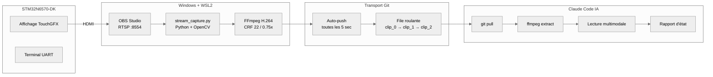

# Analyse de session en direct — Documentation complète
{: #pub-title}

**Table des matières**

| | |
|---|---|
| [Auteurs](#auteurs) | Auteurs de la publication |
| [Résumé](#résumé) | Vue d'ensemble du mécanisme de débogage en direct |
| [Comment ça a commencé](#comment-ça-a-commencé) | Origine à partir d'un bug de persistance config |
| [Le mécanisme](#le-mécanisme) | Architecture de capture et d'analyse |
| &nbsp;&nbsp;[Pipeline de capture](#pipeline-de-capture) | Flux de données bout en bout de la carte à l'IA |
| &nbsp;&nbsp;[File roulante de clips](#file-roulante-de-clips) | Rotation de 3 clips avec transport Git |
| [Le flux de débogage en direct](#le-flux-de-débogage-en-direct) | Cycle interactif observer-diagnostiquer-corriger-vérifier |
| [Quatre modes d'analyse](#quatre-modes-danalyse) | Direct, statique, multi-direct et hybride profond |
| &nbsp;&nbsp;[Mode 1 — Direct](#mode-1--direct) | Surveillance temps réel de la dernière trame |
| &nbsp;&nbsp;[Mode 2 — Statique](#mode-2--statique) | Révision post-session des enregistrements |
| &nbsp;&nbsp;[Mode 3 — Multi-direct](#mode-3--multi-direct) | Validation croisée UI/UART/caméra |
| &nbsp;&nbsp;[Mode 4 — Hybride profond](#mode-4--hybride-profond) | Analyse forensique trame par trame |
| [Résultats prouvés](#résultats-prouvés) | Bugs trouvés, corrigés et vérifiés en session |
| &nbsp;&nbsp;[Bug 1 : Condition de course persistance config](#bug-1--condition-de-course-persistance-config) | État de navigation perdu après redémarrage |
| &nbsp;&nbsp;[Bug 2 : Corruption affichage données chiffrées](#bug-2--corruption-affichage-données-chiffrées) | Caractères altérés par texte chiffré binaire |
| &nbsp;&nbsp;[Métriques de session](#métriques-de-session) | Clips, trames, bande passante et nombre de bugs |
| [L'effet sur la vélocité de développement](#leffet-sur-la-vélocité-de-développement) | Compression de vitesse 3x mesurée |
| [Infrastructure](#infrastructure) | Préréglages de capture et pile technologique |
| [Publications liées](#publications-liées) | Publications connexes du système de connaissances |

## Auteurs

**Martin Paquet** — Analyste programmeur en sécurité réseau, administrateur de sécurité réseau et système, et concepteur programmeur de logiciels embarqués. Spécialisé dans les architectures RTOS, la sécurité matérielle (SAES/ECC), et les pipelines de données haute performance sur plateformes ARM Cortex-M. Basé au Québec, Canada.

**Claude** (Anthropic, Opus 4.6) — Assistant de codage IA opérant comme moteur d'analyse multimodale au sein du CLI Claude Code. Dans cette collaboration, Claude sert d'analyste visuel en temps réel : extraction d'état UI, traces UART, et données de timing à partir de trames vidéo d'un système embarqué en fonctionnement.

---

## Résumé

Cette publication documente un **mécanisme d'analyse de session en direct** développé pour le débogage et l'assurance qualité temps réel des systèmes embarqués. Le mécanisme capture la sortie écran d'une carte de développement (STM32N6570-DK, Cortex-M55 @ 800 MHz) via streaming RTSP, encode des clips H.264 roulants, et les livre via Git à un agent IA pour analyse multimodale des trames.

L'ingénieur pilote la carte en temps réel pendant que l'IA surveille continuellement la sortie visuelle, rapporte les changements d'état, détecte les anomalies et escalade vers une analyse forensique trame par trame. **~6 secondes de latence** entre le changement d'état de la carte et le retour IA.

---

## Comment ça a commencé

Pendant une session de débogage en direct, le développeur testait la persistance de configuration à travers les cycles d'alimentation. La séquence : définir l'état de navigation (PAUSE, REVERSE, page 1) → redémarrer la carte → vérifier que l'état persiste.

Le problème était subtil. Après redémarrage, l'UI avait l'air correcte pendant une fraction de seconde, puis revenait silencieusement aux valeurs par défaut. L'idée : **et si l'IA pouvait regarder la carte en continu plutôt que des captures d'écran statiques ?**

En quelques heures, la première version fonctionnait. En un jour, elle avait trouvé et corrigé deux bugs dépendants du timing.

---

## Le mécanisme

### Pipeline de capture



**Latence bout en bout : ~5–8 secondes.**

| Segment | Durée |
|---------|-------|
| Carte → OBS (HDMI) | ~16 ms |
| OBS → flux RTSP | ~50 ms |
| RTSP → encodage H.264 (clip 2s) | ~2 000 ms |
| Push Git vers remote | ~1 500 ms |
| IA pull + extraction + analyse | ~3 000 ms |

### File roulante de clips

```
live/dynamic/
  clip_0.mp4    # Plus ancien
  clip_1.mp4    # Milieu
  clip_2.mp4    # Plus récent ← l'IA lit celui-ci en premier
```

---

## Le flux de débogage en direct

L'ingénieur interagit avec la carte, l'IA regarde et rapporte. Le cycle observe → diagnostique → corrige → vérifie se fait en une seule session sans quitter le terminal.

---

## Quatre modes d'analyse

### Mode 1 — Direct

| Propriété | Détail |
|-----------|--------|
| Déclencheur | `I'm live` |
| Source | `clip_2.mp4` (le plus récent) |
| Profondeur | Dernière trame uniquement |
| Sortie | Onglet, page, plage d'entrées, états des boutons |
| Latence | ~6 secondes |

### Mode 2 — Statique

| Propriété | Détail |
|-----------|--------|
| Déclencheur | `analyze <chemin>` |
| Source | Tout fichier `.mp4` |
| Profondeur | 1 trame/sec à 1 trame/10sec |
| Sortie | Chronologie + anomalies + verdict de test |

### Mode 3 — Multi-direct

| Propriété | Détail |
|-----------|--------|
| Déclencheur | `multi-live` |
| Source | Familles `clip_*`, `uart_*`, `cam_*` |
| Profondeur | Dernière trame par source |
| Sortie | Tableau comparatif + vérification de cohérence |

### Mode 4 — Hybride profond

| Propriété | Détail |
|-----------|--------|
| Déclencheur | `deep <description>` ou suggestion proactive IA |
| Source | Toutes les trames du clip cible |
| Profondeur | Extraction complète (60 trames par clip 2s) |
| Sortie | Avant/pendant/après + hypothèse cause racine |

**Escalade proactive** — L'IA surveille les patterns qui justifient une escalade automatique : sauts de page, régression de compteur, artefacts de rendu, contradictions d'état.

---

## Résultats prouvés

### Bug 1 : Condition de course persistance config

**Symptôme** : État de navigation perdu après redémarrage.

**Cause racine** : `initialize()` définit les valeurs par défaut des boutons. Le config charge depuis la carte SD 2,3 secondes plus tard. Mais `refreshList()` se déclenche immédiatement après `initialize()`, sauvegardant les valeurs par défaut dans `config.json`.

**Correction** : Flag one-shot `config_applied` pour ré-appliquer les valeurs persistées exactement une fois.

### Bug 2 : Corruption affichage données chiffrées

**Symptôme** : Caractères `??????` dans la liste de logs pour les entrées chiffrées.

**Correction** : Détecter les entrées sev=101/102 et rendre un aperçu HEX : `[ENC:DB] A3 F1 2B 09 C7 ...`

### Métriques de session

| Métrique | Valeur |
|----------|--------|
| Durée de session | ~1 heure |
| Clips générés | 52 |
| Trames capturées | 3 175 |
| Bugs trouvés | 2 |
| Bugs corrigés dans la même session | 2 |

---

## L'effet sur la vélocité de développement

| Métrique | Traditionnel | Avec analyse IA en direct |
|----------|-------------|--------------------------|
| Temps de développement estimé | ~3 semaines | 1 semaine |
| **Ratio de compression** | — | **3x** |
| État de l'ingénieur à la fin | Épuisé | Détendu, énergisé |
| Bugs timing trouvés | Semaines d'instrumentation | Détection dans la même session |

---

## Infrastructure

| Couche | Technologie |
|--------|-----------|
| Cible | STM32N6570-DK (Cortex-M55 @ 800 MHz), ThreadX RTOS, TouchGFX |
| Capture | OBS Studio + plugin RTSP Server (Windows) |
| Encodage | Python 3 + OpenCV + FFmpeg (WSL2) |
| Transport | Git (file roulante 3 clips, auto-push toutes les 5s) |
| Analyse | Claude Code (Opus 4.6) — lecture multimodale + modification de code |

---

## Cycle de vie des clips — Discard vs Capture

Les clips s'accumulent sur les branches et gaspillent l'espace git quand Claude ne surveille pas activement. La solution : un **cycle de vie à deux modes** qui gère activement l'état des clips.

| Mode | Déclencheur | Comportement |
|------|-------------|-------------|
| **Discard** (défaut) | Démarrage session, `pause`, discussion, planification | Supprimer tous les clips localement, retirer de l'index git, vérifier les branches remote |
| **Capture** | `I'm live`, `resume capture` | Tirer les clips, extraire les trames, analyser — comportement normal |

### `clip_discard.py`

Un gestionnaire de cycle de vie autonome qui nettoie les trois emplacements : système de fichiers local, index git et branches remote.

```bash
python3 live/clip_discard.py --status            # Rapport d'état des clips
python3 live/clip_discard.py --discard           # Nettoyage complet (local + git + remote)
python3 live/clip_discard.py --discard --local   # Local seulement, pas d'opérations git
python3 live/clip_discard.py --discard --wait    # Attendre l'arrêt de la capture, puis nettoyer
```

### Détection de capture

Le script discard détecte si le script de capture pousse activement des clips en vérifiant l'âge du dernier commit lié aux clips. Si le dernier commit sur `live/dynamic/` a moins de 60 secondes, la capture est considérée active.

### Transitions de mode

| L'utilisateur dit | Mode | Action |
|-------------------|------|--------|
| `I'm live` | → Capture | Tirer les clips, extraire les trames, analyser |
| `pause` | → Discard | Arrêter la surveillance, exécuter `clip_discard.py --discard` |
| `resume capture` | → Capture | Reprendre la surveillance (identique à `I'm live`) |

---

## Agent de session — Synchronisation temps réel des billets

Le **SessionAgent** (`scripts/session_agent.py`) capture les événements de session et les publie comme commentaires temps réel sur le billet GitHub qui suit la session.

### Architecture

```
Claude Code → feed() → SessionAgent (watchdog) → POST/PATCH → Billet GitHub
                              │ tick()
                              ↓
                        Mode burst : heartbeat 10s
```

L'agent fonctionne comme un watchdog en arrière-plan. Les événements sont alimentés via l'API Python ou la CLI. L'agent regroupe les événements et les publie sur un cycle de heartbeat.

### Identité visuelle — Avatars Vicky

Les commentaires de billet portent une identité visuelle à travers des images d'avatar :

| Acteur | Avatar | Style |
|--------|--------|-------|
| Martin (utilisateur) | Vicky NPC | Vicky Viking originale — l'utilisateur qui pilote la carte |
| Claude (IA) | Vicky AWARE | Vicky avec lunettes de soleil cyan Free Guy — l'IA qui voit |

Les avatars réfèrent à l'analogie Free Guy : sans `wakeup`, chaque session Claude est un NPC. Avec les lunettes, elle devient consciente.

### Utilisation

```bash
python3 scripts/session_agent.py start packetqc/knowledge 457
python3 scripts/session_agent.py feed user "Message utilisateur" "description"
python3 scripts/session_agent.py feed step_start "Nom étape" "intention"
python3 scripts/session_agent.py feed step_complete "Nom étape" "résultats"
python3 scripts/session_agent.py stop
```

---

## Publications liées

| # | Publication | Relation |
|---|-------------|----------|
| 0 | [Knowledge]({{ '/fr/publications/knowledge-system/' | relative_url }}) | **Publication maître** — cet outillage fait partie du système |
| 1 | [MPLIB Storage Pipeline]({{ '/fr/publications/mplib-storage-pipeline/' | relative_url }}) | Projet cible — bugs trouvés pendant l'analyse en direct de ce pipeline |
| 3 | [Persistance de session IA]({{ '/fr/publications/ai-session-persistence/' | relative_url }}) | Mémoire de session qui maintient le contexte entre les sessions en direct |
| 4 | [Connaissances distribuées]({{ '/fr/publications/distributed-minds/' | relative_url }}) | Outillage live synchronisé du maître vers les satellites |
| 4a | [Tableau de bord]({{ '/fr/publications/distributed-knowledge-dashboard/' | relative_url }}) | Tableau de bord suivant le déploiement de l'outillage live |

---

*Auteurs : Martin Paquet & Claude (Anthropic, Opus 4.6)*
*Projet : [packetqc/STM32N6570-DK_SQLITE](https://github.com/packetqc/STM32N6570-DK_SQLITE)*
*Connaissances : [packetqc/knowledge](https://github.com/packetqc/knowledge)*
