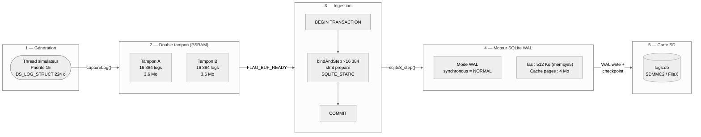

# MPLIB Storage — Documentation complète
{: #pub-title}

**Table des matières**

| | |
|---|---|
| [Auteurs](#auteurs) | Auteurs de la publication |
| [Résumé](#résumé) | Vue d'ensemble et chiffres de performance clés |
| [Plateforme cible](#plateforme-cible) | MCU, RTOS et spécifications matérielles |
| [Architecture pipeline 5 étapes](#architecture-pipeline-5-étapes) | Flux de données de la génération à la carte SD |
| [Séparation frontend / backend](#séparation-frontend--backend) | GUI zéro-SQL avec pont PSRAM |
| [Performance](#performance) | Débit mesuré et utilisation des ressources |
| [Décisions de conception](#décisions-de-conception) | Justification de chaque choix architectural |
| [Structure du code](#structure-du-code) | Organisation des fichiers source |
| [Publications liées](#publications-liées) | Publications connexes du système de connaissances |

## Auteurs

**Martin Paquet** — Analyste programmeur en sécurité réseau, administrateur de sécurité réseau et système, et concepteur programmeur de logiciels embarqués. Architecte de la librairie de modules MPLIB et du pipeline de stockage 5 étapes.

**Claude** (Anthropic, Opus 4.6) — Partenaire de développement IA. A co-implémenté les étapes du pipeline, diagnostiqué les patterns de dégradation de performance, et fourni une analyse continue du code à travers 10+ sessions via la méthodologie de persistance de session.

---

## Résumé

MPLIB Storage est un pipeline d'ingestion de logs SQLite haute performance conçu pour les systèmes ARM Cortex-M55 bare-metal. Fonctionnant sur le STM32N6570-DK (800 MHz), il atteint **~2 650 logs/sec soutenus** sur plus de 400 000 lignes grâce à une architecture pipeline 5 étapes avec double tampon PSRAM, SQLite en mode WAL, et une interface GUI zéro-SQL.

---

## Plateforme cible

| Spécification | Valeur |
|---------------|--------|
| MCU | STM32N6570-DK |
| Cœur | ARM Cortex-M55 @ 800 MHz |
| RTOS | ThreadX |
| Interface | TouchGFX |
| RAM externe | PSRAM (stockage double tampon) |
| Stockage | Carte SD via SDMMC2 / FileX |
| Base de données | SQLite 3 (amalgamation, mode WAL) |

---

## Architecture pipeline 5 étapes



**Étape 1 — Génération** : Thread simulateur à priorité 15, produit des `DS_LOG_STRUCT` de 224 octets alignés 32 octets.

**Étape 2 — Double tampon (PSRAM)** : 2 × 16 384 logs en section linker `.psram_buffers`. Le producteur remplit A pendant que le consommateur draine B. Zéro contention.

**Étape 3 — Ingestion** : Une seule `BEGIN TRANSACTION` enveloppant 16 384 appels `bindAndStep()`. Statements préparés réutilisés. Binding `SQLITE_STATIC` — zéro-copie depuis le tampon PSRAM.

**Étape 4 — Moteur SQLite WAL** : Mode WAL pour lecture/écriture concurrentes. Tas 512 Ko via memsys5. Cache de pages 4 Mo.

**Étape 5 — Carte SD** : Interface SDMMC2 via FileX. Checkpoint automatique WAL → base principale.

---

## Séparation frontend / backend

**Principe clé** : Le thread GUI **n'exécute jamais de SQL**. Il lit depuis un tampon PSRAM peuplé par le thread backend. Ceci élimine les saccades UI pendant les opérations base de données.

**Cache de prélecture** à 4 emplacements :

| Emplacement | Contenu | Objectif |
|-------------|---------|----------|
| `next` | Page N+1 | Navigation avant instantanée |
| `prev` | Page N-1 | Navigation arrière instantanée |
| `first` | Page 1 | Saut au début |
| `last` | Dernière page | Saut à la fin / auto-suivi |

---

## Performance

| Métrique | Valeur mesurée |
|----------|---------------|
| Débit d'écriture soutenu | ~2 650 logs/sec |
| Total de lignes testées | 400 000+ |
| Temps de flush tampon | ~6,2 sec (16 384 lignes) |
| Taille struct log | 224 octets |
| Mémoire paire de tampons | 7,2 Mo (PSRAM) |
| Tas SQLite | 512 Ko (memsys5) |
| Cache de pages | 4 Mo |

---

## Décisions de conception

| Décision | Justification |
|----------|--------------|
| SQLite plutôt que format personnalisé | Standard industriel, requêtable, portable, éprouvé |
| Mode WAL plutôt que journal | Lecture/écriture concurrentes, pas de blocage lecteur |
| Double tampon PSRAM | Producteur/consommateur sans contention ; binding zéro-copie |
| Allocateur memsys5 | Déterministe, sans fragmentation, sûr pour RTOS |
| Statements préparés | Évite le surcoût de re-parsing — amorti à zéro |
| Binding `SQLITE_STATIC` | Zéro-copie depuis PSRAM — les données struct restent en place |
| Séparation frontend/backend | Framerate GUI découplé de la latence SQL |
| Cache de prélecture | Masque la latence requête derrière la prédiction de navigation |

---

## Structure du code

```
MPLIB-CODE/
  MPLIB_STORAGE.h              API : captureLog, queryLogBatch, getLogCount
  MPLIB_STORAGE.cpp            Ingestion double-tampon, WAL, checkpoints

Appli/TouchGFX/gui/containers/
  CC_MPLIB_STORAGE.*           Pattern médiateur (conteneur parent)
  LogDBUpdaterThread.*         Sync PSRAM + cache prélecture
  ListViewLogsStored.*         Rendu liste (zéro SQL)
  LogItem.*                    Affichage entrée unique

SQLite/                        SQLite 3 amalgamation + VFS FileX
```

---

## Publications liées

| # | Publication | Relation |
|---|-------------|----------|
| 0 | [Knowledge]({{ '/fr/publications/knowledge-system/' | relative_url }}) | **Publication maître** — ce pipeline est le premier satellite |
| 2 | [Analyse de session en direct]({{ '/fr/publications/live-session-analysis/' | relative_url }}) | Outillage de débogage utilisé pendant le développement |
| 3 | [Persistance de session IA]({{ '/fr/publications/ai-session-persistence/' | relative_url }}) | Méthodologie qui a permis 10+ sessions de développement continu |
| 4 | [Connaissances distribuées]({{ '/fr/publications/distributed-minds/' | relative_url }}) | Architecture réseau — les patterns de ce projet ont été récoltés |
| 4a | [Tableau de bord]({{ '/fr/publications/distributed-knowledge-dashboard/' | relative_url }}) | Tableau de bord suivant le statut de ce satellite |

---

*Auteurs : Martin Paquet & Claude (Anthropic, Opus 4.6)*
*Projet : [packetqc/STM32N6570-DK_SQLITE](https://github.com/packetqc/STM32N6570-DK_SQLITE)*
*Connaissances : [packetqc/knowledge](https://github.com/packetqc/knowledge)*
