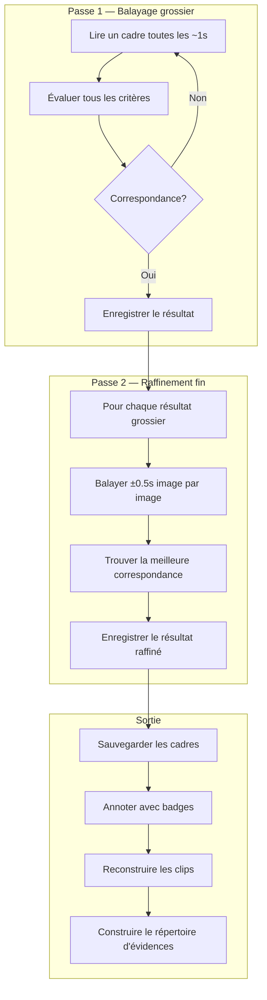

# Documentation visuelle — Documentation technique complète

> **Version résumé** : [Aperçu de la publication]({{ '/fr/publications/visual-documentation/' | relative_url }})

---

## Auteurs

**Martin Paquet** — Analyste-programmeur en sécurité réseau, administrateur de sécurité réseau et systèmes, concepteur et programmeur de logiciels embarqués. 30 ans d'expérience couvrant les systèmes embarqués, la sécurité réseau, les télécommunications et le développement logiciel. Autodidacte et bâtisseur de nature.

**Claude** (Anthropic, Opus 4.6) — Partenaire de développement IA. A implémenté le moteur de traitement visuel, les algorithmes de détection et l'interface CLI en utilisant uniquement des bibliothèques Python standard.

---

## Sommaire

- [Résumé](#résumé)
- [Contraintes de conception](#contraintes-de-conception)
- [Pile technologique](#pile-technologique)
- [Structure des modules](#structure-des-modules)
- [Modes d'opération](#modes-dopération)
- [Algorithmes de détection](#algorithmes-de-détection)
- [Architecture de recherche](#architecture-de-recherche)
- [Reconstruction de clips](#reconstruction-de-clips)
- [Analyse d'images](#analyse-dimages)
- [Pipeline de sortie](#pipeline-de-sortie)
- [Structure d'évidences](#structure-dévidences)
- [Affichage en ligne](#affichage-en-ligne-des-évidences)
- [Intégration](#intégration)
- [Exemples d'utilisation](#exemples-dutilisation)
- [Publications connexes](#publications-connexes)

---

## Résumé

Cette publication documente le **moteur de documentation visuelle** — un système automatisé d'extraction de cadres d'évidence à partir d'enregistrements vidéo pour créer, mettre à jour et réviser la documentation. Le moteur utilise exclusivement des bibliothèques Python standard et reconnues (OpenCV, Pillow, NumPy) sans outils externes, sans services cloud et sans dépendances CLI.

---

## Contraintes de conception

| Contrainte | Justification |
|------------|---------------|
| **Aucun outil externe** | Pas de ffmpeg CLI, pas d'ImageMagick, pas d'API cloud |
| **Bibliothèques standard uniquement** | OpenCV (4.x), Pillow (12.x), NumPy (2.x), stdlib Python |
| **Autonome** | Un seul `pip install` bootstrap toutes les dépendances |
| **Portable** | Fonctionne dans tout environnement Python 3.11+ |

---

## Pile technologique

### OpenCV (cv2) — Cœur du traitement vidéo

- **Décodage vidéo** : `cv2.VideoCapture` lit tous les codecs majeurs (H.264, H.265, VP8/VP9)
- **Extraction de cadres** : Positionnement à n'importe quelle position via `CAP_PROP_POS_FRAMES`
- **Traitement d'image** : Conversion d'espace colorimétrique, analyse d'histogramme, détection de contours
- **Opérations morphologiques** : Détection de régions de texte, identification de structures

### Pillow (PIL) — Sortie image

- **Planches-contact** : Disposition en grille avec miniatures et métadonnées
- **Rendu de police** : Famille DejaVu pour les annotations
- **Conversion de format** : Sortie PNG pour tous les cadres d'évidence

### NumPy — Opérations numériques

- **Opérations matricielles** : Manipulation des données de cadres (format natif OpenCV)
- **Calcul DCT** : Hachage perceptuel pour la déduplication
- **Analyse statistique** : Comparaison d'histogrammes, calcul de seuils

---

## Structure des modules

```
scripts/
├── visual_engine.py    # Moteur de traitement principal
│   ├── VideoInfo / EvidenceSession  — Métadonnées + structure d'évidences
│   ├── Extraction par timestamps (3 formats d'entrée)
│   ├── Moteur de détection (4 heuristiques)
│   ├── search_video()        — Recherche multi-critères, multi-passes
│   ├── reconstruct_clip()    — Extraction de segments vidéo
│   ├── analyze_image()       — Analyse d'image unique
│   ├── Planche-contact + rapport d'évidences
│   ├── Téléchargement vidéo GitHub
│   └── Déduplication par hachage perceptuel
│
└── visual_cli.py       # Point d'entrée CLI (argparse)
    ├── Analyse des arguments (7 groupes de modes)
    ├── Résolution de source (local/GitHub/image)
    ├── Pipeline d'exécution
    └── Formatage de sortie (texte/JSON/résumé de recherche)
```

---

## Modes d'opération

### 1. Mode timestamp

Trois formats d'entrée :

| Format | Drapeau | Exemple |
|--------|---------|---------|
| **Secondes** | `--timestamps` | `--timestamps 10.5 30.0 60.0` |
| **Heure** | `--times` | `--times 00:01:30 00:05:00` |
| **Date-heure** | `--dates` | `--dates "2026-03-01 14:30:00"` |

### 2. Mode détection

Quatre heuristiques de vision par ordinateur :

| Détecteur | Ce qu'il trouve | Seuil |
|-----------|----------------|-------|
| **Changement de scène** | Transitions visuelles majeures (corrélation d'histogramme) | `< 1.0 - sensibilité` |
| **Densité de texte** | Cadres pertinents pour la documentation (seuil adaptatif + morphologie) | `> 0.15` |
| **Densité de contours** | Diagrammes, tableaux, code, éléments UI (détection Canny) | `> 0.12` |
| **Contenu structuré** | Tableaux, grilles, formulaires (détection de lignes H/V) | `> 0.08` |

### 3. Mode recherche (multi-critères, multi-passes)

Recherche intelligente directement sur le fichier vidéo :

| Passe | Stratégie | Vitesse |
|-------|-----------|---------|
| **Passe 1 (grossière)** | Balayage toutes les ~1 secondes | Rapide |
| **Passe 2 (fine)** | Raffinement image par image (±0.5 secondes) | Précise |

Critères combinables : `--scene-change`, `--min-text 0.15`, `--min-edge 0.12`, `--structured`, `--time-range 30 60`.

**Conception clé** : Au lieu d'extraire les cadres sur disque (gigaoctets pour une longue vidéo), le moteur navigue directement dans le fichier vidéo via `cv2.VideoCapture.set()`. Seuls les cadres correspondants sont sauvegardés.

### 4. Reconstruction de clips

Extraction de segments vidéo `.mp4` autonomes centrés autour d'un timestamp. Automatique en mode recherche.

### 5. Analyse d'images

Analyse d'une image unique avec les mêmes heuristiques que la détection vidéo. Retourne les scores et une évaluation booléenne d'évidence.

---

## Algorithmes de détection

### Détection de changement de scène

```
1. Convertir le cadre en niveaux de gris
2. Calculer l'histogramme à 256 bins
3. Normaliser l'histogramme
4. Comparer avec le cadre précédent (cv2.HISTCMP_CORREL)
5. Si corrélation < (1.0 - sensibilité) → changement de scène détecté
```

### Estimation de la densité de texte

```
1. Appliquer un seuil adaptatif Gaussien (inversé, bloc=15, C=10)
2. Fermeture morphologique avec noyau rectangulaire 5x2
3. Compter les pixels non-zéro comme fraction du total
4. Si ratio > 0.15 ET cadre différent du précédent → cadre de texte détecté
```

### Estimation de la densité de contours

```
1. Appliquer la détection de contours Canny (seuils : 50, 150)
2. Compter les pixels de contour comme fraction du total
3. Si ratio > 0.12 → cadre à haute densité d'information
```

### Détection de contenu structuré

```
1. Appliquer la détection de contours Canny
2. Ouverture morphologique avec noyau 40x1 (lignes horizontales)
3. Ouverture morphologique avec noyau 1x40 (lignes verticales)
4. Combiner horizontal + vertical → régions de contenu structuré
5. Si ratio combiné > 0.08 → contenu structuré détecté
```

---

## Architecture de recherche



---

## Pipeline de sortie

### Annotation des cadres

Chaque cadre extrait reçoit une superposition optionnelle :
- **Barre de timestamp** : Barre semi-transparente avec HH:MM:SS.mmm
- **Badge de détection** : Badge vert avec la raison de détection
- **Marques de coin** : Indicateurs verts aux quatre coins

### Déduplication

Hachage perceptuel (pHash) basé sur DCT — seuil par défaut : 0.92.

### Planche-contact

Grille de miniatures avec métadonnées par cadre.

### Rapport d'évidences

Document markdown avec métadonnées vidéo, tableau récapitulatif et sections détaillées par cadre.

---

## Structure d'évidences

```
evidence/<nom-session>/
  metadata.json          — informations source, critères, timestamps
  discoveries/           — cadres d'évidence extraits
  clips/                 — segments vidéo reconstruits
  index.md               — inventaire markdown
```

---

## Affichage en ligne des évidences

Après extraction, les cadres sont présentés directement dans la conversation :

| Méthode | Mécanisme | Pour |
|---------|-----------|------|
| **Direct** | Outil Read sur le PNG | Clients bureau/web avec rendu d'images |
| **Via GitHub** | Commit + push → markdown `` | App mobile, CLI, alternative |

---

## Intégration

### Catégorie de commandes Visuels

| Commande | Origine | Description |
|----------|---------|-------------|
| `visual` | **Nouveau** | Extraction automatisée d'évidences |
| `deep` | Session en direct | Analyse image par image des anomalies |
| `analyze` | Session en direct | Analyse vidéo statique avec chronologie |

---

## Exemples d'utilisation

```bash
# Collecte d'évidences post-session
visual session_recording.mp4 --detect --dedup --report --sheet

# Recherche multi-critères
visual recording.mp4 --search --scene-change --min-text 0.15 --evidence

# Extraction ciblée par timestamp
visual bug_repro.mp4 --timestamps 12.5 45.0 67.3

# Reconstruction de clip
visual recording.mp4 --clip 45.0 --context 5

# Analyse d'image
visual --image screenshot.png
```

---

## Publications connexes

| # | Publication | Relation |
|---|-------------|----------|
| #0 | [Système Knowledge]({{ '/fr/publications/knowledge-system/' | relative_url }}) | Parent |
| #2 | [Analyse de session en direct]({{ '/fr/publications/live-session-analysis/' | relative_url }}) | Sibling |
| #11 | [Histoires de succès]({{ '/fr/publications/success-stories/' | relative_url }}) | Story #22 |
| #16 | [Visualisation de pages web]({{ '/fr/publications/web-page-visualization/' | relative_url }}) | Sibling |

---

*Publication #22 — Documentation visuelle*
*Martin Paquet & Claude (Anthropic, Opus 4.6) — Mars 2026*
