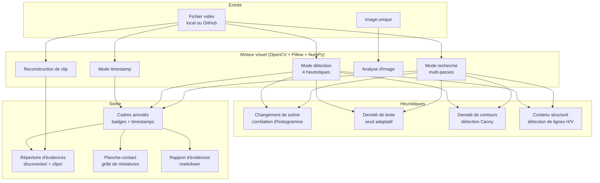

# Documentation visuelle — Extraction automatisée d'évidences vidéo

> **Version complète** : [Documentation technique complète]({{ '/fr/publications/visual-documentation/full/' | relative_url }})

---

## Sommaire

- [Résumé](#résumé)
- [Public cible](#public-cible)
- [Le problème](#le-problème)
- [Architecture](#architecture)
- [Modes d'opération](#modes-dopération)
- [Structure d'évidences](#structure-dévidences)
- [Affichage en ligne](#affichage-en-ligne)
- [Publications connexes](#publications-connexes)

---

## Résumé

Le **moteur de documentation visuelle** automatise l'extraction d'évidences à partir d'enregistrements vidéo pour la création, la mise à jour et la révision de documentation. Au lieu de parcourir manuellement les vidéos pour capturer des captures d'écran, la commande `visual` traite les fichiers vidéo par vision par ordinateur pour extraire automatiquement les cadres significatifs.

**Contraintes de conception** : Aucun outil externe (pas de ffmpeg CLI), aucune API cloud, aucun service OCR. Uniquement des bibliothèques Python standard : **OpenCV** (décodage vidéo, traitement d'image), **Pillow** (annotation, planches-contact), **NumPy** (opérations matricielles, hachage perceptuel).

---

## Public cible

| Public | Valeur |
|--------|--------|
| **Développeurs** | Capture automatisée d'évidences à partir d'enregistrements de sessions |
| **Ingénieurs QA** | Détection de régressions visuelles dans les enregistrements de tests |
| **Rédacteurs techniques** | Extraction automatisée de captures d'écran pour la documentation |
| **Flux AI-assistés** | Sessions Claude traitant des évidences vidéo de façon programmatique |

---

## Le problème

Les flux de développement génèrent des enregistrements vidéo : captures d'écran, sessions UART, démos, artefacts CI/CD. Extraire des cadres utiles de ces enregistrements est manuel, fastidieux et inconsistant. Un enregistrement de 2 heures peut contenir 5 moments clés — les trouver nécessite de parcourir toute la vidéo.

Le moteur de documentation visuelle résout ce problème avec trois approches :
1. **Vous savez quand** → Le mode timestamp extrait aux moments précis
2. **Vous ne savez pas quand** → Le mode détection trouve automatiquement les cadres significatifs
3. **Vous savez quoi** → Le mode recherche combine des critères pour trouver exactement ce dont vous avez besoin

---

## Architecture



---

## Modes d'opération

### Mode timestamp

Trois formats d'entrée quand vous savez quand l'évidence s'est produite :

| Format | Drapeau | Exemple |
|--------|---------|---------|
| Secondes | `--timestamps` | `10.5 30.0 60.0` |
| Heure | `--times` | `00:01:30 00:05:00` |
| Date-heure | `--dates` | `"2026-03-01 14:30:00"` |

### Mode détection

Quatre heuristiques de vision par ordinateur :

| Heuristique | Signal | Seuil |
|-------------|--------|-------|
| **Changement de scène** | Transitions visuelles majeures | corrélation `< 0.65` |
| **Densité de texte** | Contenu documentaire | `> 0.15` |
| **Densité de contours** | Diagrammes, UI, code | `> 0.12` |
| **Contenu structuré** | Tableaux, grilles, formulaires | `> 0.08` |

### Mode recherche (multi-critères, multi-passes)

Recherche intelligente directement sur la vidéo — aucune extraction en masse :

| Passe | Stratégie | Vitesse |
|-------|-----------|---------|
| **Grossière** | Balayage toutes les ~1 secondes | Rapide |
| **Fine** | Raffinement image par image (±0.5s) | Précise |

### Reconstruction de clips

Extraction de segments vidéo `.mp4` autonomes centrés autour des évidences.

### Analyse d'images

Analyse d'images individuelles avec les mêmes heuristiques que la détection vidéo.

---

## Structure d'évidences

```
evidence/<nom-session>/
  metadata.json          — source, critères, timestamps
  discoveries/           — cadres d'évidence (seulement les résultats)
  clips/                 — segments vidéo reconstruits
  index.md               — inventaire markdown
```

---

## Affichage en ligne

Après extraction, les cadres d'évidence sont présentés directement dans la conversation :

| Méthode | Mécanisme | Client |
|---------|-----------|--------|
| **Direct** | Outil Read affiche le PNG en ligne | Bureau/web avec support d'images |
| **Via GitHub** | Push + URL brute markdown | App mobile, CLI, alternative |

---

## Publications connexes

| # | Publication | Relation |
|---|-------------|----------|
| #0 | [Système Knowledge]({{ '/fr/publications/knowledge-system/' | relative_url }}) | Parent — Visuels est une catégorie de commandes |
| #2 | [Analyse de session en direct]({{ '/fr/publications/live-session-analysis/' | relative_url }}) | Sibling — capture en temps réel vs analyse post-hoc |
| #11 | [Histoires de succès]({{ '/fr/publications/success-stories/' | relative_url }}) | Story #22 — Moteur de documentation visuelle |
| #16 | [Visualisation de pages web]({{ '/fr/publications/web-page-visualization/' | relative_url }}) | Sibling — pipeline de rendu web (Playwright) |

---

*Publication #22 — Documentation visuelle*
*Martin Paquet & Claude (Anthropic, Opus 4.6) — Mars 2026*
