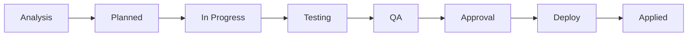

# General Plan

Current roadmap for Knowledge. Items advance through the compliance lifecycle:

[Source: PLAN.md](https://github.com/{{ site.github_repo }}/blob/main/PLAN.md)

**Contents**

- [GitHub Project Board](#github-project-board)
- [What's New](#whats-new)
- [Ongoing](#ongoing)
- [Fixes](#fixes)
- [Planned](#planned)
- [Forecast](#forecast)
- [Recalls](#recalls)
- [Completed](#completed)

## GitHub Project Board

---

## What's New

| Date | Update |
|------|--------|
| 2026-03-08 | **Knowledge 2.0** — Interactive Intelligence Framework. Session questionnaire, command routing, skill architecture, methodology deduplication. Migration from v1.10x. |
| 2026-02-26 | **Publication #20 — Session Metrics & Time Compilation** — two compilation methodologies (metrics + time), appendable tables, summary line convention |
| 2026-02-26 | **Publication #19 — Interactive Work Sessions** — resilient multi-delivery sessions: 5 types, 3-channel persistence, progressive commits |
| 2026-02-26 | **Publication #18 — Documentation Generation Methodology** — meta-methodology with universal inheritance and 13 qualities alignment |
| 2026-02-26 | **Publication #17 — Web Production Pipeline** — Jekyll processing chain, three-tier structure, kramdown gotchas |
| 2026-02-26 | **Publication #16 — Web Page Visualization** — local rendering pipeline: Playwright, Mermaid-to-image, source preservation |
| 2026-02-26 | **Publication #14 — Architecture Analysis** — knowledge layers, component architecture, 13 qualities, distributed topology |
| 2026-02-26 | **Publication #15 — Architecture Diagrams** — 11 Mermaid diagrams: C4 overview, session lifecycle, distributed flow |
| 2026-02-26 | **Success Stories #16, #17** — productive work sessions documented |
| 2026-02-25 | **Publication #13 — Web Pagination & Export** — CSS Paged Media PDF, OOXML DOCX, 3 convention layouts |
| 2026-02-25 | **v48 — Plan-mode-aware wakeup** — satellites get sunglasses in read-only mode |
| 2026-02-24 | **Live board widgets** — per-section filtering on plan pages, dropdown status filters, Mermaid lifecycle diagram |
| 2026-02-24 | **Success Story #12 — Human Person Machine Bridge** — Knowledge as Jira+Confluence, zero paid tools |
| 2026-02-23 | **v43–v46** — wakeup deduplication, token zero-display, interactive input convention, classic PAT only |
| 2026-02-22 | **Publication #12 — Project Management** published with full 3-tier bilingual web pages + webcards |
| 2026-02-22 | **v35–v42** — projects as first-class entities, self-healing satellites, GitHub Project boards |

---

## Ongoing

Active work items — started but not yet completed.

---

## Fixes

Known issues to address.

---

## Planned

Items analyzed and scheduled but not yet started.

---

## Forecast

Future capabilities — known direction, not yet scheduled.

---

## Recalls

Pending recall and promotion from intelligence gathered during deep autonomous searches.

---

## Completed

Items that have been delivered and applied.

---

*Authors: Martin Paquet & Claude (Anthropic, Opus 4.6)*
*Repository: [{{ site.github_repo }}](https://github.com/{{ site.github_repo }})*
