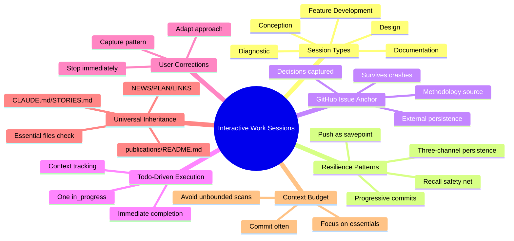
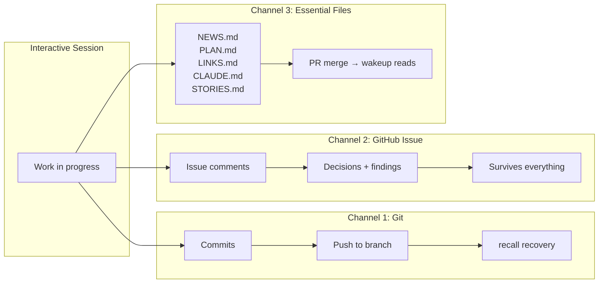

# Interactive Work Sessions — Complete Documentation
{: #pub-title}

> **Summary**: [Publication #19]({{ '/publications/interactive-work-sessions/' | relative_url }}) | **Parent**: [#0 — Knowledge System]({{ '/publications/knowledge-system/' | relative_url }})

**Contents**

| | |
|---|---|
| [Abstract](#abstract) | Resilient multi-delivery sessions |
| [The Problem](#the-problem) | What worked, what failed, the gap |
| [The Solution](#the-solution) | Five types, three channels, progressive commits |
| [Session Types](#1-five-interactive-session-types) | Diagnostic, documentation, conception, design, feature development |
| [Three-Channel Persistence](#2-three-channel-persistence) | Git + GitHub Issues + Essential files |
| [Progressive Commits](#3-progressive-commit-protocol) | Savepoints that survive crashes |
| [User Corrections](#4-user-correction-integration) | Stop, acknowledge, adapt, learn |
| [Context Budget](#5-context-budget-management) | Do's and don'ts |
| [GitHub Issues as Knowledge](#6-github-issue-as-knowledge-source) | Secondary persistence channel |
| [On Task Received](#7-on-task-received--popup-as-decision-point) | Skip vs tracked session behavior |
| [Impact](#impact) | Recovery matrix, design principles |

---

## Authors

**Martin Paquet** — Network security analyst programmer, network and system security administrator, and embedded software designer and programmer. Architect of the interactive session patterns documented here — the resilience principles emerged from hundreds of sessions across 6 projects, including sessions that crashed, overflowed, and recovered.

**Claude** (Anthropic, Opus 4.6) — AI development partner. Co-author and practitioner of these patterns — every session that applies this methodology validates it.

---

## Abstract

Interactive work sessions are the **operational heartbeat** of the Knowledge system. Every publication, methodology, feature, and architectural discovery was produced during an interactive session between Martin and Claude. Yet the patterns that make these sessions productive — progressive commits, GitHub issue anchoring, user correction integration, context budget management — were never formally documented.

This publication codifies the methodology for **resilient, multi-delivery interactive sessions**. The key insight is **three-channel persistence**: work survives through Git branches (commits + pushes), GitHub Issues (external persistence), and essential files (NEWS.md, PLAN.md, etc.). When all three channels are active, even a catastrophic session crash loses at most the current in-progress todo — not the entire session's work.

The methodology recognizes **five interactive session types**, each with its own phase pattern: diagnostic (hypothesis → elimination → fix), documentation (gather → structure → mirror), design (explore → propose → build), feature development (analyze → implement → integrate), and conception (ideate → prototype → validate). All types inherit the same resilience patterns: progressive commits, push-as-savepoint, todo-driven execution, and universal inheritance of essential files.

The proof is recursive: this publication was created during an interactive documentation session that applied the very patterns it describes — including progressive commits at each todo, essential files updated per universal inheritance, and a GitHub issue anchoring the work.



---

## The Problem

Through hundreds of sessions across 6 projects (P0–P5), recurring patterns emerged — and recurring failures:

### What Worked

| Pattern | How it helped |
|---------|--------------|
| Progressive commits | Savepoints that survived session crashes |
| GitHub Issues | External persistence when sessions died with uncommitted work |
| TodoWrite | Visible progress tracking that survived context compaction |
| User corrections | Course corrections that prevented wasted context |

### What Failed

| Failure | Impact | Frequency |
|---------|--------|-----------|
| All work in one final commit | Session crash = total loss | Common in early sessions |
| No push until session end | `recall` can't recover unpushed work | Common |
| No GitHub issue anchor | Lost context on session crash — no external record | Frequent |
| Ignoring user's simpler fix | Wasted 3–5 attempts before trying user's suggestion (Pitfall #22) | Documented |
| Unbounded file scanning | Context overflow from searching 6 profile pages | Documented (this session) |
| Essential files forgotten | Publications created but NEWS.md/PLAN.md not updated | Discovered via #18 |
| Missing vital files | `publications/README.md` and `STORIES.md` not in checklist | Discovered via #18 |

### The Gap

`session-protocol.md` covers the lifecycle (wakeup → work → save). `interactive-diagnostic.md` covers debugging sessions. But the **during-work resilience patterns** — progressive commits, issue anchoring, context budget management, multiple session types — were practiced implicitly without documentation.

---

## The Solution

A formal methodology framework: one umbrella (`methodology/interactive-work-sessions.md`) plus dedicated per-type files.

### 1. Five Interactive Session Types

| Type | Trigger | Phase pattern | Methodology |
|------|---------|---------------|-------------|
| **Diagnostic** | Bug report, rendering issue, behavioral problem | Hypothesis → elimination → isolation → fix → document | `interactive-diagnostic.md` |
| **Documentation** | New publication, methodology, success story | Gather → structure → expand → web pages → deliver | `interactive-documentation.md` |
| **Conception** | New idea, architecture exploration, prototype | Ideate → prototype → user feedback → validate → formalize | `interactive-conception.md` |
| **Design** | New feature, architecture, UI, webcard | Explore → propose → user validates → build → iterate | (umbrella) |
| **Feature Development** | New command, script, pipeline | Analyze → implement → test → document → integrate | (umbrella) |

All types inherit the same resilience framework. The phases are templates — real sessions blend types naturally. A documentation session may discover a bug (→ diagnostic), which reveals a missing feature (→ development).

### 2. Three-Channel Persistence

Work survives through three independent channels:



| Channel | Recovered via | Survives | At risk when |
|---------|--------------|----------|-------------|
| **Git branch** | `recall`, `resume`, manual PR | Session crash, context overflow | Never committed |
| **GitHub Issue** | Issue URL, board reference | Everything | Issue deleted (rare) |
| **Essential files** | `wakeup` reads them | PR merge to default branch | Not committed or PR not merged |

**Maximum resilience**: All three channels active. Even a catastrophic crash loses at most the current in-progress todo.

### 3. Progressive Commit Protocol

```
Todo 1 → work → commit → push ✓  (savepoint 1)
Todo 2 → work → commit → push ✓  (savepoint 2)
Todo 3 → work → commit → [CRASH]
                           ↓
                    New session:
                    recall → recovers todos 1 + 2 + 3 (if pushed)
                    issue  → shows what todo 3 was doing
                    resume → if checkpoint exists, restarts todo 3
```

| When to commit | Example | Why |
|---------------|---------|-----|
| After each todo completion | "Add Publication #17 — 10 files" | Savepoint |
| After discovering something new | "Update publications/README.md — was stale" | Capture insight |
| Before risky operations | "Before large file scan" | Insurance |
| After user correction | "Fix: essential files, not profile pages" | Prevent repetition |

### 4. User Correction Integration

The person observing the rendered output (browser, device, actual page) has information the AI doesn't. When the user redirects:

1. **Stop** — don't finish the wrong approach
2. **Acknowledge** — confirm what was wrong
3. **Adapt** — switch to the correct approach immediately
4. **Learn** — if the correction reveals a pattern, capture it

**Real examples from this session**:
- "You're looking at the wrong place for publications" → focus on essential files, not profile pages
- "publications/README.md is stale" → discovered a missing vital file
- "STORIES.md should be in the vital files" → expanded the universal inheritance checklist
- "we should have 3 interactive-session-<type>" → separate per-type methodology files

### 5. Context Budget Management

| Do | Don't |
|----|-------|
| Focus on essential files first | Scan all profile pages for one entry |
| Read files once, keep in context | Re-read CLAUDE.md after compaction |
| Commit often (smaller context per todo) | Accumulate everything for one big commit |
| Use grep for targeted searches | Read 10 files sequentially |
| Batch related edits (4 web pages in one pass) | Update them one at a time with full re-reads |
| Mark todos done immediately | Batch 3 completions together |

**Context overflow warning signs**:
- Reading files > 500 lines repeatedly → use targeted ranges
- Searching across > 5 files for the same thing → use grep
- Third attempt at the same failing approach → step back, try user's suggestion
- Profile pages or secondary indexes → skip, batch later

### 6. GitHub Issue as Knowledge Source

GitHub Issues are not just task trackers — they're a **secondary persistence channel** that captures session intelligence:

| What issues capture | Why it matters |
|--------------------|---|
| User intent | The original request in their own words |
| Decisions made | Choices recorded as they happen |
| Corrections applied | The redirect and why |
| Discoveries | Stale files, missing entries, new patterns |
| Methodology insights | The messy iterative reality that polished docs don't show |

### 7. On Task Received — Popup as Decision Point

Every session entry message is **presumed to be a work request by default**. The user always types something to open a session — that input is always a demand until the user explicitly decides otherwise. The confirmation popup runs **systematically after wakeup completes**, on every session.

```
wakeup completes
    ↓
Title extraction from user's entry message
    ↓
AskUserQuestion popup:
    ├── Accept title      → tracked session (issue created)
    ├── Other (refine)    → tracked session (user's title)
    └── Skip tracking     → untracked session (no issue)
    ↓
Work begins
```

The popup is the **only decision point**. The user sees it, clicks one option, and the session proceeds. Accepting = tracked task. Skipping = untracked. Refining = tracked with better title. The popup always appears — silence is never an option.

**Key insight**: Read-only sessions (reviews, validations, audits) **are tasks**. A session that validates 50 links without modifying a single file is a task. A session that diagnoses a bug without fixing it is a task. Read-only does not mean informal.

#### Skip vs Tracked — What Changes, What Stays

The skip option **only** bypasses issue creation and real-time comments. All other session mechanisms run regardless:

| Element | Skip | Accept / Refine |
|---------|------|-----------------|
| Confirmation popup | Appears | Appears |
| GitHub issue | Not created | Created |
| Real-time comments on issue | No issue to comment on | Alternating 🧑/🤖 comments |
| Todo list | Normal | Normal |
| Work execution | Normal | Normal |
| Pre-save summary (v50) | Metrics + time + self-assessment | Same + posted on issue |
| Commit / push / PR | Normal | Normal |

**The compilation always happens.** Metrics (files, lines, commits), time blocks (active time, calendar time), and self-assessment (methodology compliance) are compiled at every `save` — regardless of whether the session is tracked or not. The only difference: tracked sessions post the compilation as a final comment on the GitHub issue, creating a persistent record. Untracked sessions display the compilation but don't persist it externally.

**When to skip**: Infrastructure commands (`normalize --fix`, `harvest --healthcheck`), quick questions ("what's the status?"), system maintenance that doesn't warrant a tracked record. The skip is the user's **explicit choice** — Claude never decides for the user that a session is "too informal" to track.

---

## Impact

### What This Changes

| Before | After |
|--------|-------|
| One commit at session end | Progressive commits at each todo |
| No external session record | GitHub issue anchors every multi-delivery session |
| Context overflow from exhaustive searches | Context budget management with essential files priority |
| User corrections lost after compaction | Corrections captured as patterns in methodology |
| Recovery depends on checkpoint only | Three-channel persistence — branch + issue + files |
| Session types not differentiated | Five types with phase templates and per-type methodology files |
| Resilience was implicit practice | Resilience codified with recovery matrix |

### Recovery Matrix

| Failure mode | Recovery path | Data lost |
|-------------|---------------|-----------|
| Context overflow | `refresh` in same session | None (work continues) |
| Session crash + checkpoint | `resume` in new session | None (checkpoint captures state) |
| Session crash + push | `recall` in new session | At most current in-progress todo |
| Session crash, no push | Issue has context + manual recovery | Uncommitted work only |
| API 400 (unrecoverable) | New session + `recall` + issue | Uncommitted since last push |

### Design Principles

1. **Three channels, not one** — Git branches, GitHub Issues, and essential files are independent persistence paths
2. **Progressive, not terminal** — commit at each milestone, not at session end
3. **User sees what you don't** — corrections from the person observing the output are primary data
4. **Essential files first** — the universal inheritance checklist is the priority, not exhaustive coverage
5. **Types share resilience** — all five session types inherit the same progressive commit and issue anchoring patterns
6. **Per-type methodology** — each session type has its own dedicated methodology file with specific protocols
7. **The methodology proves itself** — this publication was created in an interactive documentation session that applied its own patterns

---

## Related Publications

| # | Publication | Relationship |
|---|-------------|-------------|
| 3 | [AI Session Persistence]({{ '/publications/ai-session-persistence/' | relative_url }}) | Foundational persistence methodology |
| 8 | [Session Management]({{ '/publications/session-management/' | relative_url }}) | Lifecycle commands (wakeup, save, resume, recall) |
| 11 | [Success Stories]({{ '/publications/success-stories/' | relative_url }}) | Validated session outcomes |
| 14 | [Architecture Analysis]({{ '/publications/architecture-analysis/' | relative_url }}) | System architecture context |
| 18 | [Documentation Generation]({{ '/publications/documentation-generation/' | relative_url }}) | Universal inheritance principle |

---

*Authors: Martin Paquet & Claude (Anthropic, Opus 4.6)*
*Knowledge: [packetqc/knowledge](https://github.com/packetqc/knowledge)*
