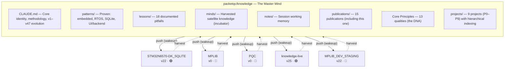

# Knowledge — Complete Documentation
{: #pub-title}

**Contents**

- [Authors](#authors)
- [Abstract](#abstract)
- [Fork & Clone Safety](#fork--clone-safety)
- [The System](#the-system)
  - [What It Contains](#what-it-contains)
  - [What It Does](#what-it-does)
- [The `#` Call Alias Convention](#the--call-alias-convention)
  - [How It Works](#how-it-works)
  - [Implicit Main Project](#implicit-main-project)
  - [Multi-Satellite Convergence](#multi-satellite-convergence)
- [Satellite Harvest — What the Network Produced](#satellite-harvest--what-the-network-produced)
  - [Network Inventory](#network-inventory)
  - [STM32N6570-DK_SQLITE](#stm32n6570-dk_sqlite--the-richest-satellite)
  - [MPLIB](#mplib--the-library-that-started-everything)
  - [PQC](#pqc--post-quantum-cryptography-reference)
  - [Promotion Pipeline](#promotion-pipeline--12-candidates)
- [Knowledge Evolution](#knowledge-evolution)
- [Publication Hierarchy](#publication-hierarchy)
  - [Principles Across Publications](#principles-across-publications)
- [Core Principles](#core-principles)
- [Design Principles](#design-principles-original)
- [Memory Architecture](#memory-architecture)
  - [Knowledge vs Claude Code Auto-Memory](#knowledge-vs-claude-code-auto-memory)
  - [Compaction of Memory at Runtime](#compaction-of-memory-at-runtime)
  - [What Survives Compaction — The Full Hierarchy](#what-survives-compaction--the-full-hierarchy)
- [The Children](#the-children)
  - [#3 — AI Session Persistence](#3--ai-session-persistence-first-child)
  - [#1 — MPLIB Storage Pipeline](#1--mplib-storage-pipeline)
  - [#2 — Live Session Analysis](#2--live-session-analysis)
  - [#4 — Distributed Minds](#4--distributed-minds)
  - [#4a — Knowledge Dashboard](#4a--knowledge-dashboard)
- [Related Publications](#related-publications)
- [Annexes](#annexes)

## Authors

**Martin Paquet** — Network security analyst programmer, network and system security administrator, and embedded software designer and programmer. Architect of Knowledge. Designed the persistence methodology, the distributed intelligence network, and the self-healing version-aware architecture that connects satellite projects through a central master mind. The insight: AI coding sessions are RTOS threads — they need lifecycle management, shared memory, and context recovery. The implementation: files in a Git repository, read with discipline.

**Claude** (Anthropic, Opus 4.6) — AI development partner operating across all satellite projects. Both a consumer and a contributor of Knowledge — reads the master mind on wakeup, evolves knowledge in satellites during work, harvests discoveries back to the center, and co-authored every publication in this network. This publication was itself built by harvesting the 3 satellite repositories and the 5 child publications it documents.

---

## Abstract

Software engineering with AI assistants suffers from a fundamental limitation: **statelessness**. Every new session starts from zero. When work spans multiple sessions across multiple projects, the accumulated intelligence — architectural decisions, proven patterns, discovered pitfalls, refined methodology — is scattered and unreachable.

**Knowledge** (`packetqc/knowledge`) solves this by creating a self-evolving intelligence layer for AI-assisted engineering. **By design**, it only operates on repositories that the user owns and that Claude Code has been granted access to via its GitHub application configuration — no external or third-party repositories are ever accessed. It provides:

| Feature | Description |
|---------|-------------|
| **Session persistence** | `CLAUDE.md` + `notes/` + lifecycle protocol give AI assistants durable memory across sessions (~30-second context recovery vs 15 minutes manual) |
| **Portable bootstrap** | Any project reads the master mind on wakeup and inherits methodology, commands, patterns, and tooling |
| **Bidirectional knowledge flow** | Satellites evolve independently; `harvest` pulls their discoveries back to the center |
| **Version-aware self-healing** | 47 knowledge versions tracked; drift detected and remediated automatically |
| **Living self-awareness** | A dashboard updated on every harvest shows the network's health in real time |
| **Human Person Machine Bridge** | GitHub Projects v2 as Jira-style tracking; GitHub Pages as Confluence-style documentation — $0/month replaces $14.20/user/month. Board sync pipeline (`sync_roadmap.py`) bridges project planning with live web pages |
| **13 core qualities** | *Self-sufficient, autonomous, concordant, concise, interactive, evolutionary, distributed, persistent, recursive, secure, resilient, structured, integrated* — the system's DNA, discovered through practice |
| **`#` call alias convention** | Single-character invocation for scoped project knowledge input. `#N:` routes content to publication/project N. Implicit main project per repo. Multi-satellite convergence through harvest promotion |
| **Time compilation** | Structured delivery timing per task: Active Session vs Calendar Elapsed vs Enterprise equivalent, with CSS pie charts. Real data from Knowledge (git history) and the human user (domain expertise) — the documentation IS the timesheet, auditable through git history |

> *"Even the provider Claude Code AI uses Atlassian Confluence. For managing projects distributed across multiple entities and for distributed web publishing, I use Knowledge, which is built on a Claude Code AI plan paid monthly for conception, then GitHub lives with Knowledge."*
> — Martin Paquet, architect of Knowledge

This is the **master publication** — the parent of all others. It was built by harvesting its own children: crawling 15 publications spanning embedded pipelines, live debugging, session persistence, distributed intelligence, network monitoring, security by design, and project management. Knowledge documents itself.

---

## Fork & Clone Safety

This repository is public and designed to be forked. The system is **owner-scoped** — all operations are confined to the repository owner's environment.

| Concern | Protection |
|---------|------------|
| **Credentials / tokens** | None stored — no API keys, no GitHub tokens, no secrets in files or git history |
| **Push access** | Proxy-scoped per session — a forker's Claude Code can only push to their own fork |
| **Harvest / wakeup URLs** | Reference the original owner's repos — read-only for a forker. Replace GitHub username for your own projects |
| **Satellite references** | `minds/`, dashboard describe the original owner's network — meaningless in a fork |
| **Session notes** | Start blank for every new user |

What you get by forking: **methodology, commands, publication templates, and tooling** — all intentionally public. No account access, no credentials, no attack surface. To adapt the system to your own projects, replace `packetqc` with your GitHub username in CLAUDE.md.

---

## The System

Knowledge is a central repository (`packetqc/knowledge`) that acts as the master mind for a network of satellite projects. The architecture is bidirectional: methodology flows outward on wakeup, discoveries flow inward through harvest.



### What It Contains

The system organizes knowledge into layered tiers, from stable core methodology down to ephemeral session notes. Each layer has a different stability profile and lifecycle.

| Layer | Location | Content | Stability |
|-------|----------|---------|-----------|
| **Core** | `CLAUDE.md` | Identity, methodology, evolution log (v1–v47), 13 qualities, `#` call alias | Stable |
| **Proven** | `patterns/`, `lessons/` | 4 proven patterns, 18 documented pitfalls | Validated |
| **Harvested** | `minds/` | 24 promotion candidates from 5 satellites | Evolving |
| **Session** | `notes/` | Per-session working memory | Ephemeral |
| **Publications** | `publications/` | 15 technical publications (including this one) | Versioned |
| **Projects** | `projects/` | 9 projects (P0–P9) with hierarchical indexing | Structured |
| **Tooling** | `live/`, `scripts/` | Capture engine, beacon, scanner, webcard generator | Portable |

### What It Does

| Capability | Mechanism | Result |
|------------|-----------|--------|
| **Session memory** | `wakeup` → read notes/ → summarize | 30-second context recovery |
| **Knowledge push** | Satellite reads core CLAUDE.md on wakeup | Every AI instance inherits everything |
| **Knowledge harvest** | `harvest <project>` crawls branches | Satellite discoveries flow to center |
| **Version tracking** | `<!-- knowledge-version: vN -->` tags | Drift detected, remediated with `--fix` |
| **Self-awareness** | Living dashboard updated on harvest | Network health at a glance |
| **Content freshness** | `doc review` checks pubs vs knowledge state | Stale content detected and updated |
| **Live debugging** | `I'm live` → video frame analysis | ~6-second AI feedback loop |
| **Live network** | Knowledge beacon + scanner on port 21337 | Inter-instance peer discovery |
| **Language awareness** | System locale → app language → lock | Native language session output |
| **`#` call alias** | `#N:` routes to project N, implicit main per repo | 1-character scoped knowledge input |
| **Multi-satellite convergence** | Same project documented everywhere, harvest unifies | Location-independent intelligence routing |

The system stores everything as plain files in Git — methodology, patterns, publications, session notes. Wakeup reads, harvest writes, the network grows.

See the [`#` Call Alias Convention](#the--call-alias-convention) below for how knowledge enters the system from any satellite.

---

## The `#` Call Alias Convention

A **single-character invocation** for scoped project knowledge input. When `#` appears at the beginning of a prompt, it triggers knowledge routing mode.

### How It Works

| Input | Routing | Example |
|-------|---------|---------|
| `#N: content` | Explicitly scoped to project/publication N | `#7: fix command should prepare locally` |
| `#N:methodology:<topic>` | Methodology insight — flagged for harvest | `#7:methodology:incremental-cursors` |
| `#N:principle:<topic>` | Design principle — flagged for harvest | `#4:principle:pull-based` |
| `#0: raw dump` | Raw unstructured input — Claude classifies | `#0: whatever I have right now` |
| No `#`, in a repo | Implicit main project of that repo | Working in knowledge → implicit `#0:` |
| `#N:info` | Show accumulated knowledge for N | `#7:info` |
| `#N:done` | Compile all #N notes into structured summary | `#0:done` |

### Implicit Main Project

Every repo has a **main project** — unscoped input goes there automatically:

| Repo | Main project | Implicit `#` |
|------|-------------|--------------|
| `packetqc/knowledge` | #0 Knowledge | `#0:` |
| `packetqc/STM32N6570-DK_SQLITE` | #1 MPLIB Storage Pipeline | `#1:` |
| Documentation satellites | Context-dependent (multi-project) | First or declared project |

### Multi-Satellite Convergence

The same project can be documented from multiple satellites. `#N:` is the **routing key**, not the repo — the insight goes where it belongs regardless of where it was discovered.

```
Satellite A ──→ harvest ──→ minds/ ──→ promotion ──→ core knowledge
Satellite B ──→ harvest ──↗
Satellite C ──→ harvest ──↗
Core direct ──────────────────────────→ notes/ ──→ core knowledge
```

All `#N:` scoped notes from all satellites flow through harvest into `minds/`, then through promotion into the central consciousness.

---

## Satellite Harvest — What the Network Produced

This publication was built by crawling the actual satellite repositories, not just the publications already in the knowledge repo. Here is what the harvest found.

### Network Inventory

| Satellite | Version | Drift | Bootstrap | Sessions | Assets | Health |
|-----------|---------|-------|-----------|----------|--------|--------|
| **knowledge** (self) | v25 | 🟢 0 | 🟢 core | 🟢 9+ | 🟢 core | 🟢 healthy |
| **knowledge-live** | v25 | 🟢 0 | 🟢 active | 🟢 1 | 🟢 deployed | 🟢 healthy |
| **STM32N6570-DK_SQLITE** | v22 | 🟡 3 | 🟢 active | 🟢 2 | 🟡 partial | 🟢 healthy |
| **MPLIB_DEV_STAGING** | v22 | 🟡 3 | 🟢 active | 🟢 1 | 🔴 missing | 🔴 unreachable |
| **MPLIB** | v0 | 🔴 25 | 🔴 missing | ⚪ 0 | 🔴 missing | 🟢 healthy |
| **PQC** | v0 | 🔴 25 | 🔴 missing | ⚪ 0 | 🔴 missing | 🟢 healthy |

**Network evolution**: The first harvest (v9) found 3 satellites all at v0 with 100% drift. Since then, 2 new satellites joined (knowledge-live, MPLIB_DEV_STAGING), STM32 was bootstrapped to v22, and the core grew from v11 to v25. The network is partially remediated — MPLIB and PQC still need their first bootstrap.

### STM32N6570-DK_SQLITE — The Richest Satellite

Despite having no knowledge infrastructure, this project contains the most harvestable content.

| Content | Description |
|---------|-------------|
| **Core implementation** | 1,490-line `MPLIB-CODE/MPLIB_STORAGE.cpp` — the entire 5-stage pipeline in one file |
| **Architecture document** | 15,666-byte `doc/readme.md` — Mermaid diagrams, runtime data, degradation analysis |
| **SQLite VFS bridge** | `sqlite3_azure.c/h` — custom Azure RTOS integration layer |
| **Linker script** | Custom script with 4 dedicated PSRAM sections |

**Patterns discovered in this satellite**

| Pattern | Description | Status in Core |
|---------|-------------|---------------|
| PSRAM double-buffer with event flags | Producer fills A, consumer drains B, swap on threshold | Already in `patterns/` |
| memsys5 + PSRAM page cache | Static allocator for SQLite, page cache in external RAM | Already in `patterns/` |
| Direct PSRAM-to-SQLite ingestor | Skip raw file intermediary, `SQLITE_STATIC` reads from buffer | **New** — not yet promoted |
| DMA with polling fallback | GPDMA1 mem-to-mem with graceful memcpy fallback | **New** — not yet promoted |
| Database recovery protocol | Non-fatal recovery: finalize, close, flush, delete, recreate, resume | **New** — not yet promoted |

### MPLIB — The Library That Started Everything

The MPLIB repository is the **origin project** — the library of reusable embedded modules. 190 commits, 9 months of development.

| Content | Description |
|---------|-------------|
| **README** | 784-line — feature list, project structure, thread architecture, communication model |
| **N6570-DK guide** | 871-line — linker scripts, signing commands, flash addresses, debugging procedures |
| **Key exchange protocol** | ECC KEM and PQC ML-KEM dual cryptography flow |
| **8-thread architecture** | Default, GUI, Data, System, Display, Secure, SDCard, Network — each with LED heartbeat |
| **RTOS equivalence table** | Complete FreeRTOS ↔ ThreadX API mapping |

**Patterns discovered in this satellite**

| Pattern | Description | Status in Core |
|---------|-------------|---------------|
| Multi-RTOS abstraction | FreeRTOS/ThreadX dual support with preprocessor guards | Promotion candidate |
| Library-as-static-archive | `libMPLIB_STM32_MCU.a` linked by all framework projects | New |
| Thread/singleton architecture | 8 dedicated threads with LED heartbeats, singleton modules | Already in `patterns/` |
| Dual cryptography (ECC + PQC) | Coexisting key exchange mechanisms, gradual migration | New |
| TouchGFX MVP with backend services | C → C++ → Model → Presenter → View with backend separation | Promotion candidate |

### PQC — Post-Quantum Cryptography Reference

The PQC repository provides essential sizing and compliance data for post-quantum cryptography on embedded targets.

| Content | Description |
|---------|-------------|
| **Scope** | Minimal repository with sizing reference for ML-KEM and ML-DSA algorithms |
| **Key contribution** | PQC library compliance matrix — WolfSSL is the production PQC library for STM32 (FIPS-certified), liboqs is dev-only |
| **Use case** | Memory budgeting on embedded targets — essential for resource-constrained Cortex-M deployments |

### Promotion Pipeline — 12 Candidates

Across all satellites, 12 insights are candidates for promotion to core knowledge:

| # | Insight | Source | Target | Priority |
|---|---------|--------|--------|----------|
| 1 | Page cache sizing degradation (81% collapse at 4M rows) | STM32 SQLite | `lessons/` | High |
| 2 | Printf latency in hot path (1-5 ms per call) | STM32 SQLite | `lessons/` | Medium |
| 3 | Pcache slot size mismatch (page_size + 256) | STM32 SQLite | `lessons/` | High |
| 4 | Direct PSRAM-to-SQLite bypass with SQLITE_STATIC | STM32 SQLite | `patterns/` | Medium |
| 5 | Database recovery protocol (non-fatal corruption) | STM32 SQLite | `patterns/` | Medium |
| 6 | sqlite3_shutdown() before reconfiguration | STM32 SQLite | `lessons/` | Low |
| 7 | Multi-RTOS abstraction (FreeRTOS/ThreadX) | MPLIB | `patterns/` | High |
| 8 | CubeMX N6570-DK limitation (cannot create project) | MPLIB | `lessons/` | Medium |
| 9 | TouchGFX MVP with backend services | MPLIB | `patterns/` | Medium |
| 10 | ML-KEM/ML-DSA sizing reference | PQC | `patterns/` | Low |
| 11 | PQC library compliance matrix (WolfSSL = production) | PQC | `patterns/` | Medium |
| 12 | Flash certificate storage (linker section + xxd) | PQC | `patterns/` | Low |

Once validated across 2+ projects, these candidates graduate from `minds/` to core `patterns/` or `lessons/`.

The harvest proved the bidirectional architecture works: satellites evolve independently, discoveries flow back to core through the promotion pipeline.

For the full harvest protocol, see [Publication #7 — Harvest Protocol]({{ '/publications/harvest-protocol/' | relative_url }}).

---

## Knowledge Evolution

The system itself evolves. Each entry is a discovery or architectural change:

| v# | Date | Discovery | Impact |
|----|------|-----------|--------|
| v1 | 2026-02-16 | Session persistence | Foundation. Stateless NPC becomes continuous collaborator. |
| v2 | 2026-02-16 | Free Guy analogy | Mental model: `wakeup` = putting on the sunglasses. |
| v3 | 2026-02-17 | Portable bootstrap | One source of truth across all projects. |
| v4 | 2026-02-17 | Multipart help | Universal + project-specific commands, concatenated. |
| v5 | 2026-02-17 | Step 0: sunglasses first | Self-propagating awareness. Non-negotiable. |
| v6 | 2026-02-17 | Chicken-and-egg bootstrap | First bootstrap is manual, all subsequent are automatic. |
| v7 | 2026-02-17 | Normalize command | Self-healing structure concordance. |
| v8 | 2026-02-17 | Profile hub | Public-facing author presence with privacy by design. |
| v9 | 2026-02-18 | Distributed minds | Bidirectional knowledge flow. Intelligence flows both ways. |
| v10 | 2026-02-18 | Knowledge versioning | Drift detection and remediation. No satellite left behind. |
| v11 | 2026-02-18 | Interactive promotion | Dashboard becomes interactive control panel. |
| v12–v17 | 2026-02-19 | Branch protocol → proxy reality | Autonomous dream tested → semi-automatic protocol discovered. |
| v18 | 2026-02-19 | `main` as convergence point | Simplified: no intermediate branches, just `main` + task branches. |
| v19 | 2026-02-19 | Todo list mirrors save protocol | Prevents stranded work on task branches. |
| v20 | 2026-02-19 | Semi-automatic delivery docs | Proxy limitation published, admin routine documented. |
| v21 | 2026-02-19 | Access scope — user-owned repos only | Security boundary explicit: only user's own repos. |
| v22 | 2026-02-19 | Dual-theme webcards (Cayman + Midnight) | Visual adaptation: browser auto-detects and serves matching theme. |
| v23 | 2026-02-20 | Live knowledge network + bootstrap scaffold | Async→live: beacon on port 21337. Fresh repos auto-scaffold. |
| v24 | 2026-02-20 | `refresh` command + dashboard rename | Lightweight recovery (~5s). Assets/Live columns renamed. |
| v25 | 2026-02-20 | Core Qualities + iterative staging | 10 principles crystallized. Multi-round installation protocol. |
| v26 | 2026-02-20 | `#` call alias + scoped project notes + daltonism themes | Single-character knowledge routing. Implicit main project. Multi-satellite convergence. 4-theme accessibility. |
| v27 | 2026-02-21 | Ephemeral token protocol — private repo access | Authenticated reach into private repos without violating zero-credential-storage. |
| v28 | 2026-02-21 | Proxy deep mapping + token-mediated API bypass | Two-channel model: git proxy (restricted) vs REST API (unrestricted with token). |
| v29 | 2026-02-21 | Checkpoint/resume — crash recovery | Sessions gain crash resilience. Auto-checkpoint at step boundaries. |
| v30 | 2026-02-21 | Safe elevation protocol — API crash mitigation | Elevation flow hardened against multimodal + tool call collision. |
| v31 | 2026-02-21 | Critical-subset satellite CLAUDE.md | Satellite CLAUDE.md upgraded from thin-wrapper to critical-subset (~180 lines). |
| v32 | 2026-02-21 | `recall` command + universal contextual help | Recovery spectrum complete. Every command one `?` away from full docs. |
| v33 | 2026-02-21 | PAT Access Levels — 4-tier configuration | Formalized GitHub PAT into 4 progressive levels (L0–L3). |
| v34 | 2026-02-21 | Secure textarea token delivery | Single path: AskUserQuestion textarea — invisible in transcript. |
| v35 | 2026-02-22 | Project as first-class entity — hierarchical indexing | Projects become concrete entities with P#/S#/D# indexing. 12th quality: *structuré*. |
| v36 | 2026-02-22 | GitHub helper — deployed failsafe for PR management | Portable Python replacement for `gh` CLI via `urllib`. |
| v37 | 2026-02-22 | Self-healing satellite CLAUDE.md | Automatic drift remediation on wakeup. |
| v38 | 2026-02-22 | Self-heal PR merge — same-session activation | Self-heal takes effect immediately, not next session. |
| v39 | 2026-02-22 | Evolution relay — satellites propose core evolution | Satellites can evolve the system's own architecture. |
| v40 | 2026-02-22 | Proxy deep mapping v2 + GitHub Project boards | Only Python `urllib` bypasses proxy. 7 boards created. |
| v41 | 2026-02-23 | GitHub Project repo linking | Boards linked to repos — visible in Projects tab. |
| v42 | 2026-02-23 | gh_helper.py as sole API method | Primary API path. Non-blocking PR creation. |
| v43 | 2026-02-23 | Wakeup deduplication — API 400 root cause | Don't run wakeup inside wakeup. |
| v44 | 2026-02-23 | Interactive Input Convention | Gather all inputs upfront, execute second. |
| v45 | 2026-02-23 | Token zero-display fix | AskUserQuestion "Other" IS visible — env var only. |
| v46 | 2026-02-23 | Environment-only token delivery + GraphQL | Zero-display via GH_TOKEN env var. |
| v47 | 2026-02-23 | Production/Development mind deployment model | Multi-tier architecture: core=production, satellite=dev+repo-prod. |

**47 versions in 9 days.** The system evolves at the same speed as the projects it serves.

Each version represents an architectural discovery, not a software release. The system evolves at the speed of the projects it serves.

The evolution is tracked in real time on the [Knowledge Dashboard]({{ '/publications/distributed-knowledge-dashboard/' | relative_url }}).

---

## Publication Hierarchy

The system spawned 15 publications, each addressing a specific capability. Together they form a hierarchy where the master publication (#0) documents the system itself, while child publications document individual capabilities.

| Publication | Description |
|-------------|-------------|
| [Knowledge]({{ '/publications/knowledge-system/' | relative_url }}) | this publication |
| [MPLIB Storage Pipeline]({{ '/publications/mplib-storage-pipeline/' | relative_url }}) | first satellite |
| [Live Session Analysis]({{ '/publications/live-session-analysis/' | relative_url }}) | tooling |
| [AI Session Persistence]({{ '/publications/ai-session-persistence/' | relative_url }}) | foundation |
| [Distributed Minds]({{ '/publications/distributed-minds/' | relative_url }}) | architecture |
| ↳ [Knowledge Dashboard]({{ '/publications/distributed-knowledge-dashboard/' | relative_url }}) | self-awareness |
| [Webcards & Social Sharing]({{ '/publications/webcards-social-sharing/' | relative_url }}) | visual identity |
| [Normalize]({{ '/publications/normalize-structure-concordance/' | relative_url }}) | concordance |
| [Harvest Protocol]({{ '/publications/harvest-protocol/' | relative_url }}) | practical guide |
| [Session Management]({{ '/publications/session-management/' | relative_url }}) | lifecycle |
| [Security by Design]({{ '/publications/security-by-design/' | relative_url }}) | safety |
| ↳ [Token Lifecycle Compliance]({{ '/publications/security-by-design/compliance/' | relative_url }}) | compliance |
| [Live Knowledge Network]({{ '/publications/live-knowledge-network/' | relative_url }}) | real-time discovery |
| [Success Stories]({{ '/publications/success-stories/' | relative_url }}) | validation |
| [Project Management]({{ '/publications/project-management/' | relative_url }}) | Human Person Machine Bridge |

Publication #3 (AI Session Persistence) is the **first child** — the foundational methodology that enables everything. It was discovered during the MPLIB project (#1), formalized as a publication, then generalized into the portable bootstrap (#0). The distributed architecture (#4) and its dashboard (#4a) emerged when the system needed to connect multiple projects.

### Principles Across Publications

Each publication embodies and advances specific core principles:

| Publication | Primary Principles | How |
|-------------|-------------------|-----|
| #0 Knowledge | All 13 | Master — defines and demonstrates every principle |
| #1 MPLIB Pipeline | *Persistent*, *self-sufficient* | Proven methodology sustaining complex embedded work |
| #2 Live Session | *Interactive*, *self-sufficient* | Real-time operable tooling, no cloud dependency |
| #3 AI Persistence | *Persistent*, *autonomous* | The foundation: sessions survive, instances self-boot |
| #4 Distributed Minds | *Distributed*, *evolutionary*, *recursive* | Bidirectional flow, self-documenting network |
| #4a Dashboard | *Interactive*, *recursive*, *concordant* | Living control panel, self-updating, self-validating |
| #5 Webcards | *Concordant*, *interactive* | Visual identity enforced, dual-theme adaptation |
| #6 Normalize | *Concordant*, *autonomous* | Self-healing structure, immune system |
| #7 Harvest Protocol | *Distributed*, *evolutionary* | Knowledge flows both ways, network grows |
| #8 Session Management | *Persistent*, *concise* | Lifecycle discipline, thin wrappers |
| #9 Security by Design | *Secure*, *self-sufficient* | Safety by architecture, no credentials |
| #10 Live Network | *Distributed*, *autonomous* | Real-time discovery, self-bootstrapping instances |
| #11 Success Stories | *Recursive*, *evolutionary* | Living validation — demonstrated capabilities |
| #12 Project Management | *Integrated*, *structured*, *autonomous* | Human Person Machine Bridge — GitHub Projects as Jira+Confluence |

---

## Core Principles

Knowledge embodies 13 qualities — each discovered through practice, each reinforcing the others. Originally named in French (the system was conceived in French); English equivalents shown here.

| # | Quality | Essence | Mechanism |
|---|---------|---------|-----------|
| 1 | **Self-Sufficient** (*Autosuffisant*) | The system sustains itself. No external services, no databases, no cloud. Plain Markdown files in Git — one `git clone` bootstraps everything. | `CLAUDE.md` + `notes/` + `patterns/` + `lessons/` — all plain text |
| 2 | **Autonomous** (*Autonome*) | Self-propagating, self-healing, self-documenting. Every new instance bootstraps without human intervention. Normalize fixes structure. Harvest remediates drift. | `wakeup` step 0, `normalize --fix`, `harvest --fix`, bootstrap scaffold |
| 3 | **Concordant** | Structural integrity actively enforced. EN/FR mirrors, front matter, links, assets, webcards — all validated and repaired. The system's immune system. | `normalize`, `pub check`, `docs check` |
| 4 | **Concise** (*Concis*) | Thin wrappers, not copies. Pointers, not duplication. A satellite CLAUDE.md is ~30 lines — everything else is inherited on wakeup. | Thin-wrapper principle, knowledge layers |
| 5 | **Interactive** (*Interactif*) | Operable, not just readable. Click-to-copy commands on the dashboard. Promotion workflow from the web. Severity icons for at-a-glance health. | Dashboard JS, promotion pipeline, 🟢🟡🟠🔴⚪ |
| 6 | **Evolutionary** (*Évolutif*) | The system grows as it works. Each session can discover something new. Versions track architectural discoveries, not releases. 35 versions in 7 days. | Knowledge Evolution table, version tags, promotion |
| 7 | **Distributed** (*Distribué*) | Intelligence flows both ways. Push methodology out on wakeup, harvest insights back. The mind is a network, not a node. | `wakeup` (push), `harvest` (pull), `minds/` (incubator) |
| 8 | **Persistent** (*Persistant*) | Sessions are ephemeral, knowledge is permanent. The tension between `notes/` and `patterns/` is the engine. ~30-second context recovery. | `wakeup`, `save`, promotion to core |
| 9 | **Recursive** (*Récursif*) | The system documents itself by consuming its own output. This publication was built by harvesting its children. The dashboard updates itself. | `harvest` → `minds/` → publications → master |
| 10 | **Secure** (*Sécuritaire*) | Security by architecture. Owner-scoped, proxy-bounded, no credentials, fork-safe. Anyone can clone — nothing sensitive, everything intentional. | Proxy scoping, `.gitignore`, owner-namespace URLs |
| 11 | **Resilient** (*Résilient*) | The system survives crashes, compaction, and network failures. Every failure mode has a matching recovery path. Protocols checkpoint at step boundaries; interrupted work is never lost. Graceful degradation under proxy/auth failures — the system adapts, not breaks. | `checkpoint` → `resume` (crash), `recover` (stranded branches), `recall` (deep memory search), `refresh` (compaction), recovery ladder, safe elevation (v30), graceful `unreachable` status |
| 12 | **Structured** (*Structuré*) | Organized around projects, not just publications. Hierarchical indexing (P#/S#/D#), dual-origin links (core vs satellite), cross-project references (→P#), project lifecycle (register → create → publish → harvest → evolve). Projects are first-class entities with identity, repositories, publications, evolution, and stories. | `projects/` metadata, `P<n>/S<m>/D<k>` indexing, `project list/info/create/register/review`, dual-origin link badges, cross-project `→P<n>` markers |
| 13 | **Integrated** (*Intégré*) | The system extends into external platforms. GitHub Projects, Issues, and PRs become live mirrors of the knowledge structure. The session ticket is a **bidirectional real-time data source** — not just a log, but an interoperability bus where humans, AI agents, CI/CD pipelines, and any system that speaks the GitHub Issue API can converge. TAG: convention maps 9 knowledge types to issue prefixes + labels. Board items flow outbound (knowledge→GitHub) and inbound (GitHub→knowledge via harvest). | TAG: convention, `gh_helper.py`, `session_issue_sync.py` (real-time ticket sync), `sync_roadmap.py`, board widgets, GraphQL API |

**Self-Sufficient** enables everything — if the system depends on external services, nothing else works. **Autonomous** and **concordant** maintain it. **Concise** keeps it manageable. **Interactive** and **evolutionary** make it usable and alive. **Distributed** scales it. **Persistent** anchors it. **Recursive** makes it self-aware. **Secure** makes it publishable. **Resilient** makes it survivable. **Structured** organizes it around projects. **Integrated** extends it into external platforms.

These 13 qualities are the system's DNA — they emerged from practice, not planning.

See the [original design principles](#design-principles-original) below for the maxims that preceded and inspired the core qualities.

## Design Principles (Original)

These 5 original design principles remain — they complement the core qualities by expressing the system's philosophy in maxim form:

| Principle | Philosophy |
|-----------|------------|
| **Files, not databases** | Plain Markdown in Git. Human-readable, version-controlled, portable, AI-native. |
| **Discipline, not magic** | The AI follows instructions in CLAUDE.md, reads files in notes/, writes back on save. No special memory system. |
| **Satellites are experiments, core is the record** | Projects come and go. The knowledge they generate outlives them through harvest and promotion. |
| **Version tracks awareness, not content** | A satellite doesn't copy core features. It reads them on wakeup. The version tag tracks what it knows about. |
| **The system documents itself** | This publication was built by harvesting its own children. The dashboard updates itself on every harvest. |
| **User-owned repos only** | The system only operates on repositories that the user owns and that Claude Code has been granted access to. No external or third-party repositories are ever accessed. |

These principles predated the 13 core qualities — they were the first articulation of the system's philosophy, later crystallized into formal qualities.

---

## Memory Architecture

### Knowledge vs Claude Code Auto-Memory

Claude Code includes a built-in **auto-memory** feature — a lightweight persistence layer that saves preferences and corrections to `~/.claude/CLAUDE.md` (user-level) or `.claude/CLAUDE.md` (project-level). These files are loaded at session start as system-level context.

This knowledge system and auto-memory solve the **same fundamental problem**: AI sessions are stateless NPCs without persistent context. The naming convention (`CLAUDE.md`) is shared — both use the file that Claude Code recognizes natively. The insight is identical: markdown files loaded at session start give the AI "sunglasses."

#### Where They Diverge

| Aspect | Auto-memory | Knowledge System |
|--------|------------|-----------------|
| **Scope** | Single file, flat | 3000+ line CLAUDE.md + 24 methodology files + notes/ + minds/ + patterns/ + lessons/ |
| **Distribution** | Local to one project | Multi-repo network (push on wakeup, harvest back) |
| **Versioning** | None | 52 versions with drift detection and remediation |
| **Promotion** | None | harvested → reviewed → staged → promoted to core |
| **Self-healing** | None | Satellites auto-update commands section on wakeup |
| **Persistence channels** | 1 (file) | 3 (Git + Notes + GitHub Issues — real-time) |
| **Friction** | Zero — automatic | Explicit — `remember`, `save`, `harvest` |
| **Authority level** | System-level instructions | System-level (CLAUDE.md) + conversation-level (methodology read) |

Auto-memory is a **notepad**. Knowledge is an **operating system for intelligence.**

#### Why Knowledge Does Not Use Auto-Memory

1. **Dual-memory problem** — Two memory systems create ambiguity about which is authoritative. Knowledge has clear layers (core → proven → harvested → session). Adding auto-memory creates a sixth layer with no defined position in the hierarchy, and no mechanism to resolve conflicts between sources.

2. **Redundant coverage** — The `remember` command, `notes/`, and CLAUDE.md already do everything auto-memory does, but with version control, distribution across projects, and a promotion pipeline. Auto-memory would duplicate existing capability without adding new value.

3. **Explicit over implicit** — Knowledge is intentional by design. Every piece of knowledge has provenance: which session, which project, which version. Auto-memory silently accumulates corrections without traceability — it violates the *structuré* quality.

4. **The "short-term / long-term" split sounds clean but isn't** — In practice, every piece of information would require a decision: "does this go in auto-memory or in Knowledge?" That decision cost, multiplied by every session across every project, adds friction instead of removing it.

#### The Architectural Relationship

If someone reads about Claude Code auto-memory and then looks at this project, the relationship is:

> **Auto-memory is the seed of the idea. Knowledge is what happens when you take that seed and grow it into a full architecture** — distributed, versioned, self-healing, self-documenting, with 13 named qualities and 52 iterations of evolution.

The concepts map directly:

| Auto-memory concept | Knowledge equivalent |
|--------------------|---------------------|
| `~/.claude/CLAUDE.md` (user-level) | `CLAUDE.md` at repo root (conscious mind) |
| `.claude/CLAUDE.md` (project-level) | Satellite CLAUDE.md (critical-subset, ~180 lines) |
| Automatic preference saving | `remember` + `notes/` + GitHub issue comments |
| Loaded at session start | `wakeup` protocol (steps 0 through 11) |
| — | `methodology/` (subconscious layer — no auto-memory equivalent) |
| — | `minds/` (distributed harvest — no equivalent) |
| — | `patterns/` + `lessons/` (promoted knowledge — no equivalent) |
| — | Three-channel persistence (no equivalent) |
| — | Self-healing satellite drift remediation (no equivalent) |

The five rows with "no equivalent" represent the capabilities that emerged from treating knowledge persistence as a first-class engineering problem rather than a convenience feature. Distribution, promotion, self-healing, multi-channel persistence, and operational knowledge layers are what separate a memory system from an intelligence system.

### Compaction of Memory at Runtime

When a session's conversation grows too long — approaching the context window limit (~200K tokens) — Claude Code triggers **compaction**: all prior messages are summarized into a compressed recap, and the session continues from that summary. The original messages are replaced by a shorter synthesis.

| Aspect | Detail |
|--------|--------|
| **Trigger** | Conversation approaches context window limit |
| **Action** | All prior messages are summarized into a compact recap |
| **What survives** | Facts, decisions, file changes, key findings — the "what" |
| **What's lost** | Exact wording, formatting rules, methodology nuances — the "how" |
| **Result** | Session continues with reduced context but preserved continuity |

The knowledge system's memory layers interact with compaction differently depending on how they were loaded:

| Layer | Loaded when | Survives compaction? |
|-------|-------------|---------------------|
| **CLAUDE.md** (system instructions) | Session start — loaded as project instructions | **Yes** — highest authority, always present |
| **methodology/** (subconscious) | Wakeup step 0.1 — read into conversation | **No** — conversation-level, lost on compaction |
| **notes/** (session memory) | Wakeup steps 1-4 — read into conversation | **No** — conversation-level, lost on compaction |
| **Compaction summary** | Auto-generated when context fills up | Replaces everything above except CLAUDE.md |

CLAUDE.md is the only layer that truly survives compaction because it is loaded as **system-level project instructions**, not conversation context. Everything else — methodology files, notes, minds/ data — enters as conversation context and gets compressed into the summary.

This is why the knowledge system has the **critical-subset principle** (v31): the satellite CLAUDE.md carries ~180 lines of behavioral DNA (session protocol, save protocol, branch protocol, full commands reference) so the session stays functional even after compaction strips the conversation-level reads. It is also why `refresh` exists as a recovery command — it re-reads CLAUDE.md and reprints help, restoring the formatting rules and operational knowledge that compaction compresses away.

The recovery ladder after compaction:

| Recovery | What it restores | Speed |
|----------|-----------------|-------|
| `refresh` | CLAUDE.md context + help table (formatting, commands) | ~5 seconds |
| `wakeup` | Everything (methodology, notes, upstream sync) | ~30-60 seconds |
| New session | Full fresh boot | ~60 seconds |

In auto-memory terms: CLAUDE.md is persistent memory that is always present. The conversation context (methodology, notes) is working memory that gets compressed when full. Compaction is the compression event. The knowledge system anticipated this architectural constraint from v31 onward — putting enough behavioral DNA in CLAUDE.md so the session survives the compression and can self-recover via `refresh`.

### What Survives Compaction — The Full Hierarchy

Auto-memory is not conversation context — it is **disk-resident persistent memory** reloaded fresh after compaction, just like the project's own CLAUDE.md. The full survival hierarchy with size limits:

| File | Level | Survives compaction? | Size limit | Startup load |
|------|-------|---------------------|------------|--------------|
| Managed policy (`ClaudeCode/CLAUDE.md`) | Organization | **Yes** | 25,000 tokens (read op limit) | Full |
| Project `CLAUDE.md` (repo root) | Project | **Yes** | 25,000 tokens (read op limit) | Full |
| `.claude/CLAUDE.md` (project auto-memory) | Project | **Yes** | 25,000 tokens (read op limit) | Full |
| `.claude/rules/*.md` | Project | **Yes** | 200–800 tokens/file; **≤10,000 tokens total** across all memory files | Full (all files combined) |
| `~/.claude/CLAUDE.md` (user auto-memory) | User | **Yes** | 25,000 tokens (read op limit) | Full |
| `CLAUDE.local.md` | Personal | **Yes** | 25,000 tokens (read op limit) | Full |
| Auto-memory index (`MEMORY.md`) | Project | **Partial** | **200 lines hard limit** (auto-load) | First 200 lines only |
| Auto-memory topic files (`~/.claude/projects/<id>/memory/*.md`) | Project | **Yes** (on demand) | No per-file limit | On demand — not at startup |
| Conversation context (methodology/, notes/, minds/) | Session | **No** | Context window (~200K tokens) | Read into conversation |

#### Size Limits — Detailed Breakdown

The limits fall into three categories: **hard limits** (enforced, causes errors), **budget limits** (recommended, causes degradation), and **structural limits** (architectural, causes silent behavior change).

**Hard limits** — exceed these and things break:

| Item | Hard limit | What happens when exceeded |
|------|-----------|---------------------------|
| Any single file read | **25,000 tokens** | `MaxFileReadTokenExceededError` — file cannot be read in one pass. Must use `offset`/`limit` params or split the file |
| `MEMORY.md` auto-load | **200 lines** | Content beyond line 200 is silently ignored at startup. Claude never sees it unless it reads the file explicitly |

**Budget limits** — exceed these and quality degrades:

| Item | Budget | What happens when exceeded |
|------|--------|---------------------------|
| All memory files combined (CLAUDE.md + rules + auto-memory) | **≤10,000 tokens** recommended | Consumes context window — less room for code, conversation, and tool outputs. Session becomes forgetful faster |
| Individual `.claude/rules/*.md` file | **200–800 tokens** recommended | Larger files still load but consume disproportionate context budget |
| Project CLAUDE.md | **~200 lines** recommended | Larger files work but consume more of the 10K token budget. Knowledge's CLAUDE.md is 3000+ lines — far beyond this, justified by the system's architecture |

**Structural limits** — architectural boundaries, not errors:

| Item | Limit | Architectural impact |
|------|-------|---------------------|
| Auto-memory topic files | No size limit | Load on demand, not at startup — detailed content is available but not proactively loaded |
| Conversation context | Context window (~200K tokens) | Everything read into conversation is subject to compaction when window fills |
| Compaction summary | Model-determined | No control over summary size — the model decides compression ratio |

#### The Knowledge System vs Size Limits

The knowledge CLAUDE.md is **3,500+ lines** (~43,000+ tokens) — far exceeding the recommended 200 lines and the 25,000-token read limit. This is a deliberate architectural choice:

| Constraint | How Knowledge handles it |
|------------|------------------------|
| 25,000-token read limit | Read in two passes (`limit: 2000` + `offset: 2000`) during wakeup step 0. The Read tool's limit applies per-call, not per-file |
| 10,000-token memory budget | Knowledge is loaded as **system-level project instructions**, not auto-memory. System instructions have a separate, larger budget in the context window |
| 200-line MEMORY.md limit | Knowledge does not use auto-memory at all — the entire system runs through CLAUDE.md + methodology/ files |
| Post-compaction degradation | Critical-subset principle (v31): satellite CLAUDE.md carries ~180 lines of behavioral DNA. `refresh` command re-reads full context |

The 25,000-token read limit is the most operationally significant constraint. It means the full CLAUDE.md cannot be read in a single Read tool call — wakeup step 0 explicitly uses two passes. Any Claude instance that reads with default parameters gets a truncated view, missing implementation details for later commands. This is documented in CLAUDE.md itself: *"Full read required: use the Read tool with `limit: 3500` (or read in two passes)"*.

Everything on disk survives compaction. Everything in conversation gets compressed. The 200-line limit on auto-memory's `MEMORY.md` means only the index loads automatically — topic files load on demand when Claude accesses relevant files.

#### The Context Window — What Compaction Monitors

Compaction monitors the **total context window**: **200,000 tokens** (200K). This is universal across all standard Claude models — Opus 4.6, Sonnet 4.6, Haiku 4.5 all share the same 200K window. Extended context (1M tokens) exists in beta for Opus 4.6 and Sonnet 4.6 but requires a special API header and premium pricing (2x input, 1.5x output) — it is not the default.

The 200K is not all usable workspace. The context window is composed of:

| Component | Tokens | Notes |
|-----------|--------|-------|
| System prompt | ~8,500 | Claude Code's built-in instructions — fixed, always present |
| CLAUDE.md + rules files | Variable | Knowledge's CLAUDE.md alone is ~10,000 tokens. Reloaded from disk on every turn |
| Tools + MCP servers + skills | Variable | Tool definitions, MCP server schemas, loaded skills |
| Conversation history | Grows per turn | All user messages + assistant responses + tool call inputs and outputs |
| Images / multimodal content | Variable | Processed and counted as tokens |
| Response buffer | ~40,000 | Reserved for output generation — mandatory, cannot be reclaimed |
| **Usable conversation space** | **~140,000–150,000** | What remains after fixed allocations — this is the actual working room |

**What counts toward the 200K**: everything. System prompt, CLAUDE.md, conversation messages, every tool call input and output (file reads, bash outputs, search results), images, and the response currently being generated. There is no "free" content — every byte in every direction eats the same 200K budget.

**Context awareness** — Claude Sonnet 4.6, Sonnet 4.5, and Haiku 4.5 are trained to track their remaining token budget. At session start, the model receives:

```xml
<budget:token_budget>200000</budget:token_budget>
```

After each tool call, it receives an update:

```xml
<system_warning>Token usage: 35000/200000; 165000 remaining</system_warning>
```

This allows the model to pace its work and make decisions about when to compact or summarize. Older models (Claude 3 series) did not have this awareness — they would hit the wall without warning.

**Compaction threshold** — when context usage reaches the threshold percentage, Claude Code triggers automatic compaction (summarizes the conversation and clears older tool outputs). The threshold:

| Setting | Value | Effect |
|---------|-------|--------|
| Default | ~80–90% (~160K–180K tokens used) | Sources conflict — reported as 83.5%, 90%, or 95% in different contexts |
| `CLAUDE_AUTOCOMPACT_PCT_OVERRIDE=80` | 80% (~160K) | Triggers earlier → more context available for summarization → higher-quality summaries |
| `CLAUDE_AUTOCOMPACT_PCT_OVERRIDE=95` | 95% (~190K) | Triggers later → more working room but lower-quality summary (less buffer for the compression) |

The env var accepts an integer 1–100. Lower = earlier compaction (better summary quality, less working room). Higher = later compaction (more working room, worse summary quality). The trade-off: an earlier trigger preserves more conversation for the summary to draw from, producing a richer compressed context.

**For Knowledge sessions**: The CLAUDE.md (~10K tokens) + system prompt (~8.5K) + response buffer (~40K) consume ~58K tokens before the first message. That leaves ~142K of usable conversation space — roughly 350 pages of text. A typical Knowledge wakeup (reading methodology files, notes, minds/) can consume 20–30K tokens in the first few turns, leaving ~110K for actual work. With heavy tool use (file reads, bash outputs), compaction typically fires after 15–30 meaningful exchanges.

#### Images and Multimodal Content — No Runtime Removal

There is **no mechanism to selectively remove images or multimodal content from the context window at runtime**. Once an image enters the conversation — via the Read tool, frame extraction, or screenshot capture — it stays in the context until compaction compresses it away or the session ends. There is no API, no tool call, and no command that can reclaim the token space consumed by an image mid-session.

This has significant implications for image-heavy workflows in the Knowledge system:

| Workflow | How images enter context | Token cost per image | Frequency |
|----------|--------------------------|---------------------|-----------|
| Live session (`I'm live`) | `ffmpeg` frame extraction → PNG → Read tool | ~1,000–5,000+ tokens | Every `I'm live` pull |
| Deep analysis (`deep`) | ALL frames extracted → sequential Read | ~5,000–50,000+ tokens (multi-frame) | On-demand, high burst |
| Web page visualization | Playwright screenshot → Read tool | ~2,000–8,000 tokens | Per page validated |
| Webcard validation | Read generated GIF back for verification | ~1,000–3,000 tokens | Per card checked |

**What the Knowledge system does today** — mitigation through intake control, not cleanup:

| Mitigation | Where | Effect |
|------------|-------|--------|
| "Fast 1-frame pulls" | Live session directives | Limits intake to last frame of newest clip only |
| "No image prints" | Live session directives | Extracts data silently — no raw frame data in output |
| External generation | Webcard generator (`generate_og_gifs.py`) | Runs as external Python process — generated images never enter context unless explicitly Read back |
| Selective validation | `pub check`, `docs check` | Text-based validation by default — screenshots only when visual verification is specifically needed |

**What is NOT managed today** (gaps):

- **No image token tracking** — there is no way to know how many tokens in the current context are consumed by images vs text
- **No selective eviction** — cannot remove a specific image from context while keeping the rest of the conversation
- **No compaction-aware batching** — no strategy to "read 3 frames, trigger compaction, read 3 more" for large analysis tasks
- **No warning before threshold** — image-heavy turns can push context past the compaction threshold without advance notice

**Impact on session duration**: Image-heavy workflows burn context 5–10x faster than text-only work. A text-only session that would last 30 meaningful exchanges may hit compaction after only 5–8 exchanges when reading multiple images. The `deep` command (all frames) is the extreme case — a single invocation can consume 30,000–50,000 tokens, triggering compaction in one burst.

**Architectural consequence**: The only "removal" mechanism for images is compaction itself — the automatic summarization that replaces older conversation turns (including their images) with text summaries. But compaction is destructive to the *entire* conversation history, not selective to images. This means image-heavy sessions face a forced trade-off: visual analysis capability vs conversation continuity. The Knowledge system's existing mitigations (intake control, external generation, selective validation) are the correct architectural response — prevent images from entering the context unless they provide actionable intelligence that justifies the token cost.

#### Customizing Compaction Behavior

Compaction rules are partially customizable — coarse-grained hints, not fine-grained control:

| Method | What it does |
|--------|-------------|
| `/compact focus on <topic>` | Hints what to prioritize when summarizing |
| `## Compact Instructions` section in CLAUDE.md | Tells Claude what to preserve during compaction |
| `CLAUDE_AUTOCOMPACT_PCT_OVERRIDE=80` env var | Triggers compaction earlier (80% vs default 90%) — higher-quality summaries |
| SessionStart hook with `compact` matcher | Re-injects critical context immediately after compaction fires |

The `Compact Instructions` section is the most relevant for Knowledge: it allows CLAUDE.md to declare what matters most when the conversation gets compressed. Example:

```markdown
## Compact Instructions
When compacting, preserve:
- Current task and todo list state
- Technical decisions and their rationale
- File paths and branch names
- Bug solutions and workarounds discovered this session
```

The SessionStart hook with `compact` matcher is a **post-compaction injection** — it fires after compaction completes, re-injecting critical rules that the summary may have compressed away:

```json
{
  "hooks": {
    "SessionStart": [{
      "matcher": "compact",
      "hooks": [{
        "type": "command",
        "command": "echo 'Reminder: always use gh_helper.py, never curl for API calls'"
      }]
    }]
  }
}
```

#### What Cannot Be Customized

- **No line-level preservation** — you cannot say "preserve lines 50-100"
- **No selective tool output filtering** — you cannot control which bash outputs get kept vs discarded
- **No per-file compaction strategies** — compaction is all-or-nothing on conversation context
- **No fine-grained timing** — `CLAUDE_AUTOCOMPACT_PCT_OVERRIDE` sets one threshold, not per-task triggers

The model decides what survives in the summary. You provide hints (via `Compact Instructions` and `/compact focus on`), but the final compression is the model's judgment.

#### Known Issue — Compaction Ignoring CLAUDE.md

GitHub Issue #4017 documents a bug where Claude stops respecting CLAUDE.md instructions after compaction — the file is reloaded but behavioral adherence degrades. The workaround hierarchy:

1. **Best**: SessionStart hook with `compact` matcher — re-injects rules post-compaction
2. **Good**: `## Compact Instructions` section in CLAUDE.md — guides the summary
3. **OK**: `/compact focus on <topic>` — manual, pre-emptive
4. **Fallback**: `CLAUDE_AUTOCOMPACT_PCT_OVERRIDE=80` — triggers earlier, better summary quality

The knowledge system's `refresh` command is architecturally equivalent to workaround #1 — it re-reads CLAUDE.md and reprints help after compaction. The difference: `refresh` is manual (user types it), while a hook is automatic (fires on compaction event).

#### Implications for Knowledge Architecture

The survival hierarchy confirms the knowledge system's design choices:

| Design choice | Validated by |
|---------------|-------------|
| **Critical-subset in satellite CLAUDE.md** (v31) | CLAUDE.md survives compaction — behavioral DNA persists |
| **methodology/ as conversation read** (v52) | Conversation context is lost — explains why sessions degrade after compaction |
| **`refresh` command** (v24) | Manual re-injection — equivalent to the `compact` hook approach |
| **Three-channel persistence** (v51) | GitHub Issues survive independently — not affected by compaction at all |
| **Knowledge does not use auto-memory** | Both survive compaction equally — the decision is about architecture, not persistence |

The last row is the key insight: auto-memory surviving compaction does not change the architectural argument against using it. The reasons Knowledge avoids auto-memory (dual-memory ambiguity, redundant coverage, implicit vs explicit, decision cost) are about **information architecture**, not persistence. Both CLAUDE.md and auto-memory survive compaction — that makes them equal on persistence, but Knowledge's layered system (core → proven → harvested → session) provides structure that auto-memory's flat file cannot.

### The Session Ticket as Interoperability Bus

The GitHub Issue created for each session (v51) is more than a persistence channel — it is a **bidirectional real-time data source** and an **interoperability bus** for any system that needs to participate in a session.

#### Bidirectional, Not Write-Only

The session ticket is read AND written by multiple actors simultaneously:

| Actor | How they write | How they read | Example |
|-------|---------------|---------------|---------|
| **Claude** (SessionSync) | API posts — 🧑/🤖 comments, ⏳→✅ lifecycle | API reads — check for external input, approvals, directives | `sync.post_bot(...)`, `GET .../comments` |
| **Human** (Martin) | Manual comments directly on GitHub | Reads Claude's progress in real-time from any device | "approved !", feedback, course corrections |
| **Other AI agents** | API posts — results, analysis, proposals | API reads — instructions, context, coordination | Multi-agent workflows |
| **CI/CD pipelines** | API posts — build status, test results, deployment confirmations | API reads — trigger conditions, gate approvals | GitHub Actions, webhooks |
| **Monitoring systems** | API posts — alerts, metrics, anomaly detection | API reads — acknowledgements, remediation status | Health checks, watchdogs |

#### Read-First Reflex

When the user refers to something they "wrote", "approved", or "decided" — the **first place Claude checks** is the active session ticket's comments. Not local files, not git log, not hooks. The ticket is the real-time convergence point that all actors share.

This reflex is essential because the session ticket is the only channel where **external actors** (humans on GitHub, other systems via API) can inject information into a running session. Git commits are batch. Notes are local. The ticket is live.

#### Universal Protocol

The GitHub Issue API (`GET/POST /repos/{owner}/{repo}/issues/{N}/comments`) is the common protocol. Any system that can make HTTP requests can participate in a session — no SDK, no special integration, no proprietary format. The ticket becomes a lightweight message bus with built-in persistence, timestamps, and audit trail.

This interoperability extends naturally to multi-agent architectures: when multiple AI systems need to coordinate around the same work, the session ticket is the shared state they all read from and write to.

---

## The Children

This system spawned 15 publications — each born from a real engineering need, each documenting a capability of the knowledge network.

### #3 — AI Session Persistence (First Child)

**The foundation.** The methodology that makes everything else possible.

AI coding assistants lose all context between sessions. This publication documents the three-component solution: `CLAUDE.md` (project identity) + `notes/` (session memory) + lifecycle protocol (init → work → save). The RTOS analogy: sessions are threads, notes are shared memory, save is thread cleanup.

| Metric | Without Persistence | With Persistence |
|--------|-------------------|-----------------|
| Time to full context | 10–15 minutes | ~30 seconds |
| Context accuracy | ~60% | ~95% |
| Decisions re-debated | Frequent | Rare |

**Born from**: The STM32N6570-DK_SQLITE project, where 10+ sessions over two days needed continuous awareness of pipeline architecture, bug history, and code conventions.

[Read Publication #3 →]({{ '/publications/ai-session-persistence/' | relative_url }})

---

### #1 — MPLIB Storage Pipeline

**The first satellite.** The project that proved the methodology.

High-throughput SQLite log ingestion on bare-metal Cortex-M55. 5-stage pipeline: generate → dual-buffer (PSRAM) → ingest → SQLite WAL → SD card. ~2,650 logs/sec sustained across 400K+ rows.

| Stage | Technology |
|-------|-----------|
| Generate | Simulator thread, DS_LOG_STRUCT 224 bytes |
| Buffer | PSRAM dual-buffer, 16,384 logs × 2 |
| Ingest | Batch INSERT with prepared statements |
| SQLite | WAL mode, memsys5, 4 MB page cache |
| Storage | SD card via SDMMC2/FileX |

**Harvested from this satellite**: Page cache sizing degradation (81% collapse), printf latency in hot path, slot size vs page size mismatch.

[Read Publication #1 →]({{ '/publications/mplib-storage-pipeline/' | relative_url }})

---

### #2 — Live Session Analysis

**The tooling.** Eyes on the running board.

Live video capture of the STM32 display → AI multimodal frame analysis → anomaly detection → forensic investigation. Four modes: `I'm live` (continuous), `analyze` (static), `multi-live` (multi-stream), `deep` (frame-by-frame). ~6-second end-to-end latency.

| Mode | Trigger | Output |
|------|---------|--------|
| Live | `I'm live` | Continuous state reporting |
| Static | `analyze <path>` | State progression timeline |
| Multi | `multi-live` | Comparative multi-stream |
| Deep | `deep <desc>` | Frame-by-frame forensics |

**Portable**: The `live/stream_capture.py` engine is synced from knowledge to every satellite on wakeup.

[Read Publication #2 →]({{ '/publications/live-session-analysis/' | relative_url }})

---

### #4 — Distributed Minds

**The architecture.** Intelligence flows both ways.

When working across multiple projects, each AI instance evolves independently. Patterns discovered in one project are invisible to another. Distributed Minds creates a living network: push methodology out on wakeup, harvest evolved knowledge back.

| Direction | Mechanism | Content |
|-----------|-----------|---------|
| **Push** | `wakeup` reads core | Methodology, patterns, pitfalls, commands |
| **Harvest** | `harvest <project>` crawls branches | Evolved patterns, new pitfalls, publications |

**First harvest results**: 15 repos crawled, 3 key satellites analyzed, 9 promotion candidates discovered, 100% drift rate (all satellites predate Knowledge).

[Read Publication #4 →]({{ '/publications/distributed-minds/' | relative_url }})

---

### #4a — Knowledge Dashboard

**The self-awareness.** The network watching itself.

A living document updated on every `harvest` run. Shows satellite status with severity icons (🟢🟡🟠🔴⚪), acquired knowledge with interactive promotion workflow, discovered publications, and master mind status.

| Feature | How it works |
|---------|-------------|
| Severity icons | 5-level visual health indicators per satellite column |
| Promotion workflow | 🔍 review → 📦 stage → ✅ promote → 🔄 auto |
| Click-to-copy | Commands copied to clipboard from GitHub Pages |
| Healthcheck | `harvest --healthcheck` sweeps all satellites |

[Read Publication #4a →]({{ '/publications/distributed-knowledge-dashboard/' | relative_url }})

---

## Related Publications

Every publication in the network connects to this master publication. The table below maps each publication to its role within the system.

| # | Publication | Role in the System |
|---|-------------|-------------------|
| 0 | **Knowledge** (this) | Master — the system itself |
| 1 | [MPLIB Storage Pipeline]({{ '/publications/mplib-storage-pipeline/' | relative_url }}) | First satellite project |
| 2 | [Live Session Analysis]({{ '/publications/live-session-analysis/' | relative_url }}) | Portable tooling |
| 3 | [AI Session Persistence]({{ '/publications/ai-session-persistence/' | relative_url }}) | First child — foundation |
| 4 | [Distributed Minds]({{ '/publications/distributed-minds/' | relative_url }}) | Network architecture |
| 4a | [Knowledge Dashboard]({{ '/publications/distributed-knowledge-dashboard/' | relative_url }}) | Living self-awareness |
| 5 | [Webcards & Social Sharing]({{ '/publications/webcards-social-sharing/' | relative_url }}) | Visual identity |
| 6 | [Normalize]({{ '/publications/normalize-structure-concordance/' | relative_url }}) | Self-healing concordance |
| 7 | [Harvest Protocol]({{ '/publications/harvest-protocol/' | relative_url }}) | Practical harvest guide |
| 8 | [Session Management]({{ '/publications/session-management/' | relative_url }}) | Session lifecycle |
| 9 | [Security by Design]({{ '/publications/security-by-design/' | relative_url }}) | Fork & clone safety |
| 9a | [Token Lifecycle Compliance]({{ '/publications/security-by-design/compliance/' | relative_url }}) | Compliance — OWASP, NIST, FIPS assessment |
| 10 | [Live Knowledge Network]({{ '/publications/live-knowledge-network/' | relative_url }}) | Real-time inter-instance discovery |
| 11 | [Success Stories]({{ '/publications/success-stories/' | relative_url }}) | Validation — demonstrated capabilities |
| 12 | [Project Management]({{ '/publications/project-management/' | relative_url }}) | Human Person Machine Bridge — GitHub Projects integration |

Together, these 15 publications form the complete documentation of the knowledge system — from foundational methodology to living network intelligence.

---

## Annexes

| Annex | Title | Description |
|-------|-------|-------------|
| 0a | [Bootstrap Optimization]({{ '/publications/knowledge-system/bootstrap-optimization/' | relative_url }}) | CLAUDE.md condensation strategy (3872 → 714 lines, 81% reduction), full section map with before/after line counts, token budget impact analysis (+38K tokens freed), and 7 best practices for maintaining compact AI bootstrap files |

---

*Authors: Martin Paquet & Claude (Anthropic, Opus 4.6)*
*Knowledge: [packetqc/knowledge](https://github.com/packetqc/knowledge)*
