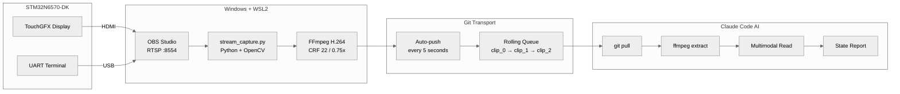
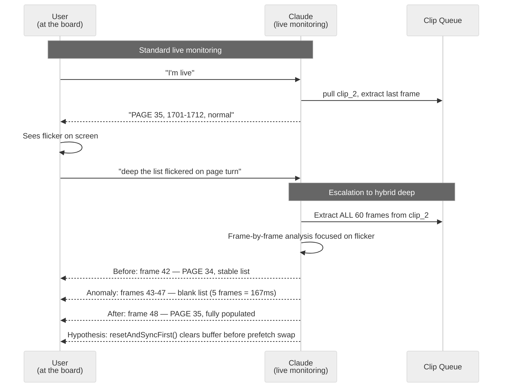

# Live Session Analysis — Complete Documentation
{: #pub-title}

**Contents**

| | |
|---|---|
| [Authors](#authors) | Publication authors |
| [Abstract](#abstract) | Live debugging mechanism overview |
| [How It Started](#how-it-started) | Origin story from a config persistence bug |
| [The Mechanism](#the-mechanism) | Capture and analysis architecture |
| &nbsp;&nbsp;[Capture Pipeline](#capture-pipeline) | Board to AI end-to-end data flow |
| &nbsp;&nbsp;[The Rolling Clip Queue](#the-rolling-clip-queue) | 3-clip rotation with Git transport |
| [The Live Debugging Workflow](#the-live-debugging-workflow) | Interactive observe-diagnose-fix-verify cycle |
| &nbsp;&nbsp;[Standard Live Session](#standard-live-session) | Basic monitoring and state comparison |
| &nbsp;&nbsp;[Live Code Modification](#live-code-modification) | AI edits code based on visual feedback |
| [Four Analysis Modes](#four-analysis-modes) | Live, static, multi-live, and hybrid deep |
| &nbsp;&nbsp;[Mode 1 — Live](#mode-1--live-real-time-monitoring) | Real-time last-frame monitoring |
| &nbsp;&nbsp;[Mode 2 — Static](#mode-2--static-post-session-review) | Post-session recording review |
| &nbsp;&nbsp;[Mode 3 — Multi-Live](#mode-3--multi-live-cross-source-validation) | Cross-source UI/UART/camera validation |
| &nbsp;&nbsp;[Mode 4 — Hybrid Deep](#mode-4--hybrid-deep-forensic-analysis) | Frame-by-frame forensic analysis |
| [Proven Results](#proven-results) | Bugs found, fixed, and verified in-session |
| &nbsp;&nbsp;[Bug 1: Config Persistence Race Condition](#bug-1-config-persistence-race-condition) | Navigation state lost after reboot |
| &nbsp;&nbsp;[Bug 2: Encrypted Data Display Corruption](#bug-2-encrypted-data-display-corruption) | Garbled characters from binary ciphertext |
| &nbsp;&nbsp;[Session Metrics](#session-metrics) | Clips, frames, bandwidth, and bug counts |
| [The Development Velocity Effect](#the-development-velocity-effect) | 3x speed compression measured |
| [Infrastructure](#infrastructure) | Capture presets and technology stack |
| [Related Publications](#related-publications) | Sibling publications in the knowledge system |

## Authors

**Martin Paquet** — Network security analyst programmer, network and system security administrator, and embedded software designer and programmer. Specializing in RTOS architectures, hardware security (SAES/ECC), and high-throughput data pipelines on ARM Cortex-M platforms. Architect of the MPLIB module library. Known for unconventional but measurably effective development methodologies, including AI-augmented engineering workflows that achieve 3x development speed compression while maintaining engineering rigor. Based in Quebec, Canada.

**Claude** (Anthropic, Opus 4.6) — AI coding assistant operating as a multimodal analysis engine within the Claude Code CLI. In this collaboration, Claude serves as a real-time visual analyst: extracting UI state, UART traces, and timing data from video frames of a running embedded system. Claude also acts as an autonomous diagnostics agent — adding printf traces, performing code audits, and maintaining cross-session knowledge through structured persistence files.

---

## Abstract

This publication documents a **live session analysis mechanism** developed for real-time debugging and quality assurance of embedded systems. The mechanism captures the screen output of a running development board (STM32N6570-DK, Cortex-M55 @ 800 MHz) via RTSP streaming, encodes rolling H.264 clips, and delivers them through Git to an AI agent that performs multimodal frame analysis.

What makes this approach distinctive is not just the capture pipeline — it is the **interactive debugging workflow** built on top of it. The engineer drives the board in real time while the AI continuously monitors visual output, reports state changes, detects anomalies, and escalates to frame-by-frame forensic analysis when something unexpected appears. This creates a **live coding troubleshooting loop** with ~6 second latency from board state change to AI feedback.

---

## How It Started

During a live debugging session, the developer was testing config persistence across power cycles on the STM32N6570-DK. The sequence: set navigation state (PAUSE, REVERSE, page 1) → reboot the board → verify state persisted.

The problem was subtle. After reboot, the UI *looked* correct for a fraction of a second, then silently reverted to default values. A breakpoint debugger would have disrupted the RTOS timing that caused the bug. UART traces showed the config loaded successfully — but something downstream overwrote it.

The developer had been sharing screenshots of the board's display throughout the session. The idea was simple: **what if the AI could watch the board continuously instead of looking at static screenshots?**

That question led to the capture pipeline. Within hours, the first version was running. Within a day, it had found and fixed two timing-dependent bugs that would have taken weeks to track down through traditional methods.

---

## The Mechanism

### Capture Pipeline



**End-to-end latency: ~5–8 seconds** from board state change to AI report.

| Segment | Duration |
|---------|----------|
| Board → OBS (HDMI) | ~16 ms |
| OBS → RTSP stream | ~50 ms |
| RTSP → H.264 encode (2s clip) | ~2,000 ms |
| Git push to remote | ~1,500 ms |
| AI pull + extract + analyze | ~3,000 ms |

### The Rolling Clip Queue

The capture script maintains a rolling queue of 3 clips (~1 MB total):

```
live/dynamic/
  clip_0.mp4    # Oldest
  clip_1.mp4    # Middle
  clip_2.mp4    # Newest ← AI reads this first
```

Git auto-pushes every 5 seconds. Each push overwrites the oldest clip. The AI always reads `clip_2` (newest) first, falling back to `clip_1` → `clip_0` if needed.

---

## The Live Debugging Workflow

### Standard Live Session

```
User:  "I'm live"
Claude:  [pulls clip_2, extracts last frame]
Claude:  "PAGE 35, entries 1701-1712, PLAY mode, FORWARD direction.
          Log count: 1712. All normal."

User:  [changes a setting on the board]

User:  "check again"
Claude:  [pulls latest clip_2]
Claude:  "PAUSE mode now active. REVERSE ON. PAGE 1, entries 12-1 descending.
          Config toggle visible in button states."

User:  [reboots the board]

User:  "compare post-reboot"
Claude:  [pulls clip_2]
Claude:  "Post-reboot: FORWARD direction, PAGE 42, entries ascending.
          ⚠ Pre-reboot state was REVERSE/PAGE 1 — config did NOT persist."
```

### Live Code Modification

During live sessions, the AI doesn't just observe — it modifies code based on what it sees:

```
Claude:  "UART shows config_loaded=true at t+2.3s, but UI buttons already
          set at t+0.5s. Race condition: initialize() runs before config load.
          Adding a one-shot config_applied flag to refreshList()..."

Claude:  [edits ListViewLogsStored.cpp, adds config_applied logic]
Claude:  [commits: 'fix: re-apply persisted config to buttons after SD load']

User:  [flashes new firmware, reboots]

User:  "check now"
Claude:  [pulls clip_2]
Claude:  "Post-reboot: REVERSE ON, PAGE 1, entries descending. ✓ Config persisted."
```

---

## Four Analysis Modes

### Mode 1 — Live (Real-Time Monitoring)

| Property | Detail |
|----------|--------|
| Trigger | `I'm live` |
| Source | `clip_2.mp4` (newest) |
| Depth | Last frame only |
| Output | Tab, page, entry range, button states, anomalies |
| Latency | ~6 seconds |

### Mode 2 — Static (Post-Session Review)

```
00:00  Boot → splash screen
00:03  UI loaded → PAGE 1, PAUSE ON
00:08  Play engaged → auto-follow to PAGE 42
00:15  ⚠ Entry gap: 2401–2408 displayed (expected 2401–2412)
00:18  Gap resolved → full range visible
VERDICT: Transient render gap on nav mode switch — sync timing
```

| Property | Detail |
|----------|--------|
| Trigger | `analyze <path>` |
| Source | Any `.mp4` file |
| Depth | 1 frame/sec (short) to 1 frame/10sec (long) |
| Output | Timeline + anomalies + test verdict |

### Mode 3 — Multi-Live (Cross-Source Validation)

```
┌──────────┬──────────────────────────┬─────────┐
│ Source   │ State                    │ Status  │
├──────────┼──────────────────────────┼─────────┤
│ UI       │ PAGE 35, entries 1701-12 │ OK      │
│ UART     │ [STATS] total: 1712     │ OK      │
│ Camera   │ Board LED: green steady  │ OK      │
└──────────┴──────────────────────────┴─────────┘
Cross-check: UI count ↔ UART count ✓
```

| Property | Detail |
|----------|--------|
| Trigger | `multi-live` |
| Source | `clip_*`, `uart_*`, `cam_*` families |
| Depth | Last frame per source |
| Output | Comparative table + consistency check |

### Mode 4 — Hybrid Deep (Forensic Analysis)



| Property | Detail |
|----------|--------|
| Trigger | `deep <description>` or proactive AI suggestion |
| Source | All frames from target clip(s) |
| Depth | Full frame extraction (60 frames per 2s clip) |
| Output | Before/during/after + root cause hypothesis |

#### Proactive Escalation

The AI watches for patterns that warrant automatic escalation:

| Pattern | Detection | AI says |
|---------|-----------|---------|
| **Page skip** | Entry range jumps by > 1 page | *"Page jumped 35→37 — want me to go deep?"* |
| **Count regression** | Total log count decreased | *"Count dropped 1712→1710 — investigating"* |
| **Render artifact** | Garbled/partial text in frame | *"Garbled entries detected — extracting full clip"* |
| **State contradiction** | Button state contradicts data | *"REVERSE ON but data ascending — go deep?"* |

---

## Proven Results

### Bug 1: Config Persistence Race Condition

**Symptom**: Navigation state (PAUSE, REVERSE, page 1) lost after reboot.

**How the AI found it**: During a live session, the developer set the UI state, rebooted, and asked Claude to compare. The AI pulled the post-reboot frame and immediately reported: *"Pre-reboot: REVERSE ON, PAGE 1, descending. Post-reboot: FORWARD, PAGE 42, ascending. Config did not persist."*

**Root cause**: `initialize()` runs at boot and sets button defaults. Config loads from SD card asynchronously 2.3 seconds later. But `refreshList()` fires immediately after `initialize()`, saving the default state back to `config.json` — overwriting the real persisted values.

**Fix**: Added a `config_applied` one-shot flag. After `config_loaded` becomes true, `refreshList()` re-applies the persisted values exactly once.

### Bug 2: Encrypted Data Display Corruption

**Symptom**: `??????` characters in log list for encrypted entries.

**How the AI found it**: During live monitoring, Claude read a frame showing entries with `??????` and immediately identified that the binary ciphertext was being passed to `Unicode::strncpy()`, which replaces non-font-range bytes with `?`.

**Fix**: Detect sev=101/102 entries in `listUpdateItem()` and render HEX preview instead: `[ENC:DB] A3 F1 2B 09 C7 ...`

### Session Metrics

| Metric | Value |
|--------|-------|
| Session duration | ~1 hour |
| Clips generated | 52 |
| Frames captured | 3,175 |
| Git push cycles | 45 |
| Active queue size | ~1.1 MB |
| Total bandwidth | ~364 MB |
| Bugs found | 2 |
| Bugs fixed in same session | 2 |

---

## The Development Velocity Effect

| Metric | Traditional | With AI Live Analysis |
|--------|-------------|----------------------|
| Estimated development time | ~3 weeks | 1 week |
| **Compression ratio** | — | **3x** |
| Engineer state at end | Exhausted | Relaxed, energized |
| Timing bugs found | Weeks of instrumentation | Same-session detection |
| Fix verification | Separate test cycle | Live in-session confirmation |

---

## Infrastructure

```bash
# Recommended for QA sessions
python3 live/stream_capture.py --dynamic \
    --rtsp rtsp://localhost:8554/live \
    --scale 0.75 --crf 22 --push-interval 5
```

| Preset | Settings | Bandwidth |
|--------|----------|-----------|
| **QA session** | `--scale 0.75 --crf 22 --push-interval 5` | ~250 MB/hr |
| UART text (sharp) | `--scale 1.0 --crf 22 --clip-secs 3` | ~400 MB/hr |
| High quality debug | `--scale 1.0 --crf 18 --fps 30` | ~500 MB/hr |
| Bandwidth saver | `--fps 10 --clip-secs 5 --crf 32` | ~80 MB/hr |

| Layer | Technology |
|-------|-----------|
| Target | STM32N6570-DK (Cortex-M55 @ 800 MHz), ThreadX RTOS, TouchGFX |
| Capture | OBS Studio + RTSP Server plugin (Windows) |
| Encode | Python 3 + OpenCV + FFmpeg (WSL2) |
| Transport | Git (rolling 3-clip queue, auto-push every 5s) |
| Analysis | Claude Code (Opus 4.6) — multimodal frame reading + code modification |

---

## Clip Lifecycle — Discard vs Capture

Clips accumulate on branches and waste git space when Claude is not actively monitoring. The solution: a **two-mode lifecycle** that actively manages clip state.

| Mode | Trigger | Behavior |
|------|---------|----------|
| **Discard** (default) | Session start, `pause`, discussion, planning | Delete all clips locally, remove from git index, check remote branches |
| **Capture** | `I'm live`, `resume capture` | Pull clips, extract frames, analyze — normal live-session behavior |

### `clip_discard.py`

A standalone lifecycle manager that handles cleanup across all three locations: local filesystem, git index, and remote branches.

```bash
python3 live/clip_discard.py --status            # Report clip state everywhere
python3 live/clip_discard.py --discard           # Full cleanup (local + git + remote check)
python3 live/clip_discard.py --discard --local   # Local only, no git ops
python3 live/clip_discard.py --discard --wait    # Wait for capture to stop, then clean
```

### Capture Detection

The discard script detects if the capture script is actively pushing clips by checking the age of the last clip-related commit. If the last commit on `live/dynamic/` is less than 60 seconds old, capture is considered active.

### Mode Transitions

| User says | Mode | Action |
|-----------|------|--------|
| `I'm live` | → Capture | Pull clips, extract frames, analyze |
| `pause` | → Discard | Stop monitoring, run `clip_discard.py --discard` |
| `resume capture` | → Capture | Resume monitoring (same as `I'm live`) |

---

## Session Agent — Real-Time Ticket Sync

The **SessionAgent** (`scripts/session_agent.py`) captures session events and posts them as real-time comments on the GitHub issue tracking the session.

### Architecture

```
Claude Code → feed() → SessionAgent (watchdog) → POST/PATCH → GitHub Issue
                              │ tick()
                              ↓
                        Burst mode: 10s heartbeat
```

The agent runs as a background watchdog. Events are fed via Python API or CLI. The agent batches events and posts on a heartbeat cycle.

### Visual Identity — Vicky Avatars

Issue comments carry visual identity through avatar images:

| Actor | Avatar | Style |
|-------|--------|-------|
| Martin (user) | Vicky NPC | Original Vicky Viking — the user driving the board |
| Claude (AI) | Vicky AWARE | Vicky with cyan Free Guy sunglasses — the AI that sees |

The avatars reference the Free Guy analogy: without `wakeup`, every Claude session is an NPC. With the sunglasses, it becomes aware.

### Usage

```bash
python3 scripts/session_agent.py start packetqc/knowledge 478
python3 scripts/session_agent.py feed user "User message" "description"
python3 scripts/session_agent.py feed step_start "Step Name" "intent"
python3 scripts/session_agent.py feed step_complete "Step Name" "results"
python3 scripts/session_agent.py stop
```

---

## Related Publications

| # | Publication | Relationship |
|---|-------------|-------------|
| 0 | [Knowledge]({{ '/publications/knowledge-system/' | relative_url }}) | **Master publication** — this tooling is part of the system |
| 1 | [MPLIB Storage Pipeline]({{ '/publications/mplib-storage-pipeline/' | relative_url }}) | Target project — bugs found during live analysis of this pipeline |
| 3 | [AI Session Persistence]({{ '/publications/ai-session-persistence/' | relative_url }}) | Session memory that maintains context across live sessions |
| 4 | [Distributed Minds]({{ '/publications/distributed-minds/' | relative_url }}) | Live tooling synced from master to satellites via knowledge push |
| 4a | [Knowledge Dashboard]({{ '/publications/distributed-knowledge-dashboard/' | relative_url }}) | Dashboard tracking satellite deployment of live tooling |

---

*Authors: Martin Paquet & Claude (Anthropic, Opus 4.6)*
*Project: [packetqc/STM32N6570-DK_SQLITE](https://github.com/packetqc/STM32N6570-DK_SQLITE)*
*Knowledge: [packetqc/knowledge](https://github.com/packetqc/knowledge)*
