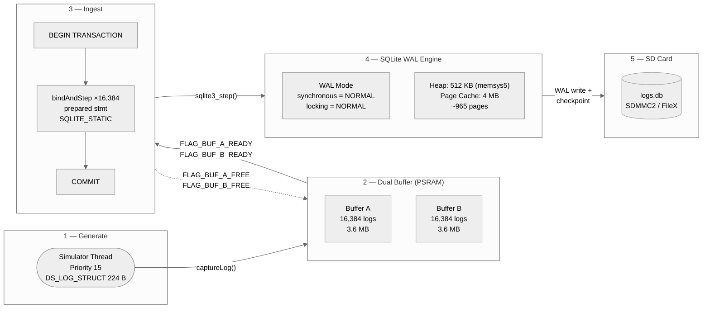
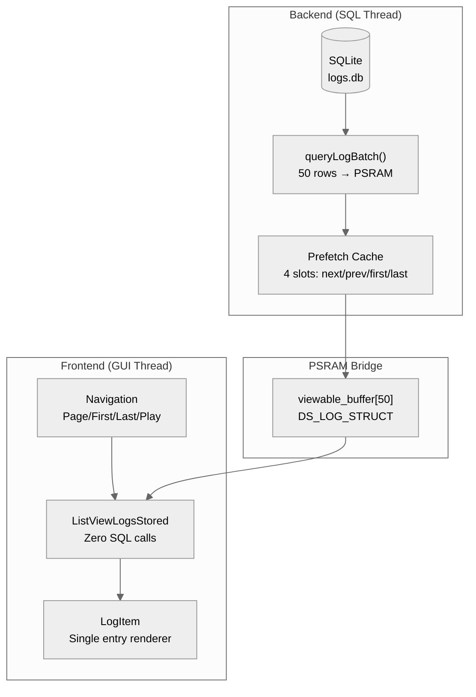

# MPLIB Storage — Complete Documentation
{: #pub-title}

**Contents**

| | |
|---|---|
| [Authors](#authors) | Publication authors |
| [Abstract](#abstract) | System overview and key performance figures |
| [Target Platform](#target-platform) | MCU, RTOS, and hardware specifications |
| [5-Stage Pipeline Architecture](#5-stage-pipeline-architecture) | End-to-end data flow from generation to SD card |
| &nbsp;&nbsp;[Stage 1 — Generate](#stage-1--generate) | Simulator thread producing log structs |
| &nbsp;&nbsp;[Stage 2 — Dual Buffer (PSRAM)](#stage-2--dual-buffer-psram) | Producer/consumer zero-contention buffers |
| &nbsp;&nbsp;[Stage 3 — Ingest](#stage-3--ingest) | Batch transaction with prepared statements |
| &nbsp;&nbsp;[Stage 4 — SQLite WAL Engine](#stage-4--sqlite-wal-engine) | WAL mode, memsys5, and page cache configuration |
| &nbsp;&nbsp;[Stage 5 — SD Card Persistence](#stage-5--sd-card-persistence) | SDMMC2/FileX checkpoint to storage |
| [Frontend / Backend Separation](#frontend--backend-separation) | Zero-SQL GUI with PSRAM bridge |
| &nbsp;&nbsp;[Prefetch Cache](#prefetch-cache) | 4-slot neighbor page prediction |
| [Performance](#performance) | Measured throughput and resource usage |
| [Design Decisions](#design-decisions) | Rationale for each architectural choice |
| [Code Structure](#code-structure) | Source file organization |
| [Related Publications](#related-publications) | Sibling publications in the knowledge system |

## Authors

**Martin Paquet** — Network security analyst programmer, network and system security administrator, and embedded software designer and programmer. Architect of the MPLIB module library and the 5-stage storage pipeline. Designed the dual-buffer PSRAM architecture, the zero-SQL GUI frontend, and the prefetch cache that enables instant page navigation on embedded targets.

**Claude** (Anthropic, Opus 4.6) — AI development partner. Co-implemented the pipeline stages, diagnosed performance degradation patterns, and provided continuous code analysis across 10+ sessions through the session persistence methodology.

---

## Abstract

MPLIB Storage is a high-throughput SQLite log ingestion pipeline designed for bare-metal ARM Cortex-M55 systems. Running on the STM32N6570-DK (800 MHz), it achieves **~2,650 logs/sec sustained** across 400K+ rows using a 5-stage pipeline architecture with PSRAM-backed dual buffers, WAL-mode SQLite, and a zero-SQL GUI frontend. The system runs on ThreadX RTOS with TouchGFX for the display layer.

---

## Target Platform

| Specification | Value |
|---------------|-------|
| MCU | STM32N6570-DK |
| Core | ARM Cortex-M55 @ 800 MHz |
| RTOS | ThreadX |
| UI Framework | TouchGFX |
| External RAM | PSRAM (dual-buffer storage) |
| Storage | SD Card via SDMMC2 / FileX |
| Database | SQLite 3 (amalgamation, WAL mode) |

---

## 5-Stage Pipeline Architecture



### Stage 1 — Generate

| Property | Detail |
|----------|--------|
| Thread | Simulator at priority 15 (ThreadX) |
| Output | `DS_LOG_STRUCT` — 224 bytes, 32-byte aligned, packed |
| Rate | Configured burst rate, writes to whichever buffer is free |

### Stage 2 — Dual Buffer (PSRAM)

| Property | Detail |
|----------|--------|
| Location | `.psram_buffers` linker section (external PSRAM) |
| Capacity | 2 × 16,384 logs = 2 × 3.6 MB |
| Synchronization | Event flags — `FLAG_BUF_A_READY (0x01)`, `FLAG_BUF_B_READY (0x02)` |
| Design | Producer fills A while consumer drains B, then swap. Zero contention |

### Stage 3 — Ingest

| Property | Detail |
|----------|--------|
| Strategy | Single `BEGIN TRANSACTION` wrapping 16,384 `bindAndStep()` calls |
| Prepared statements | Reused — never re-prepared during runtime |
| Binding | `SQLITE_STATIC` — zero-copy from PSRAM buffer |
| Commit | One `COMMIT` per buffer flush |

### Stage 4 — SQLite WAL Engine

| Property | Detail |
|----------|--------|
| Mode | WAL (Write-Ahead Logging) for concurrent read/write |
| Synchronous | `NORMAL` — fsync on checkpoint only |
| Heap | 512 KB via `memsys5` (deterministic allocator) |
| Page cache | 4 MB (~965 pages in memory) |

### Stage 5 — SD Card Persistence

| Property | Detail |
|----------|--------|
| Interface | SDMMC2 via FileX (ThreadX file system) |
| Checkpoint | Automatic WAL → main DB transfer |
| File | `logs.db` on SD card root |

---

## Frontend / Backend Separation



**Key principle**: The GUI thread **never executes SQL**. It reads from a PSRAM buffer that the backend thread populates. This eliminates UI stalls during database operations and keeps the TouchGFX render loop deterministic.

### Prefetch Cache

The backend maintains a 4-slot prefetch cache in PSRAM:

| Slot | Content | Purpose |
|------|---------|---------|
| `next` | Page N+1 | Instant forward navigation |
| `prev` | Page N-1 | Instant backward navigation |
| `first` | Page 1 | Jump-to-start |
| `last` | Last page | Jump-to-end / auto-follow |

When the user navigates, the active slot is swapped into `viewable_buffer` and the evicted slot is re-queried asynchronously.

---

## Performance

| Metric | Measured Value |
|--------|---------------|
| Sustained write rate | ~2,650 logs/sec |
| Total rows tested | 400,000+ |
| Buffer flush time | ~6.2 sec (16,384 rows) |
| Log struct size | 224 bytes |
| Buffer pair memory | 7.2 MB (PSRAM) |
| SQLite heap | 512 KB (memsys5) |
| Page cache | 4 MB |
| Checkpoint overhead | Minimal (WAL mode, async) |

---

## Design Decisions

| Decision | Rationale |
|----------|-----------|
| SQLite over custom format | Industry-standard, queryable, portable, battle-tested |
| WAL mode over journal | Concurrent read/write, no reader blocking during writes |
| PSRAM dual buffers | Producer/consumer never contend; zero-copy binding |
| memsys5 allocator | Deterministic, no fragmentation, RTOS-safe |
| Prepared statements | Avoid re-parse overhead on every insert — amortized to zero |
| `SQLITE_STATIC` binding | Zero-copy from PSRAM — struct data stays in place |
| Frontend/backend split | GUI frame rate decoupled from SQL latency |
| Prefetch cache | Hide query latency behind navigation prediction |

---

## Code Structure

```
MPLIB-CODE/
  MPLIB_STORAGE.h              API: captureLog, queryLogBatch, getLogCount
  MPLIB_STORAGE.cpp            Dual-buffer ingestion, WAL, checkpoints

Appli/TouchGFX/gui/containers/
  CC_MPLIB_STORAGE.*           Mediator pattern (parent container)
  LogDBUpdaterThread.*         PSRAM sync + prefetch cache
  ListViewLogsStored.*         List renderer (zero SQL)
  LogItem.*                    Single log item display

SQLite/                        SQLite 3 amalgamation + FileX VFS
```

---

## Related Publications

| # | Publication | Relationship |
|---|-------------|-------------|
| 0 | [Knowledge]({{ '/publications/knowledge-system/' | relative_url }}) | **Master publication** — this pipeline is the first satellite |
| 2 | [Live Session Analysis]({{ '/publications/live-session-analysis/' | relative_url }}) | Debugging tooling used during pipeline development |
| 3 | [AI Session Persistence]({{ '/publications/ai-session-persistence/' | relative_url }}) | Methodology that enabled 10+ sessions of continuous development |
| 4 | [Distributed Minds]({{ '/publications/distributed-minds/' | relative_url }}) | Network architecture — this project's patterns were harvested |
| 4a | [Knowledge Dashboard]({{ '/publications/distributed-knowledge-dashboard/' | relative_url }}) | Dashboard tracking this satellite's status |

---

*Authors: Martin Paquet & Claude (Anthropic, Opus 4.6)*
*Project: [packetqc/STM32N6570-DK_SQLITE](https://github.com/packetqc/STM32N6570-DK_SQLITE)*
*Knowledge: [packetqc/knowledge](https://github.com/packetqc/knowledge)*
