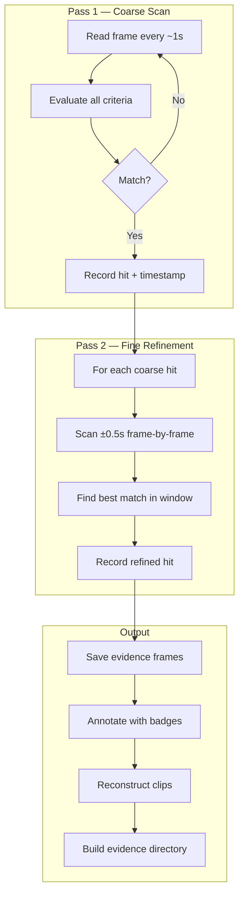

# Visual Documentation — Complete Technical Documentation

> **Summary version**: [Publication overview]({{ '/publications/visual-documentation/' | relative_url }})

---

## Authors

**Martin Paquet** — Network Security Analyst Programmer, Network and System Security Administrator, Embedded Software Designer and Programmer. 30 years of experience spanning embedded systems, network security, telecom, and software development. Autodidact and builder by nature.

**Claude** (Anthropic, Opus 4.6) — AI development partner. Implemented the visual processing engine, detection algorithms, and CLI interface using standard Python libraries only.

---

## Contents

- [Abstract](#abstract)
- [Design Constraints](#design-constraints)
- [Technology Stack](#technology-stack)
- [Module Structure](#module-structure)
- [Operating Modes](#operating-modes)
- [Detection Algorithms](#detection-algorithms)
- [Search Architecture](#search-architecture)
- [Clip Reconstruction](#clip-reconstruction)
- [Image Analysis](#image-analysis)
- [Output Pipeline](#output-pipeline)
- [Evidence Structure](#evidence-structure)
- [Inline Evidence Display](#inline-evidence-display)
- [Integration](#integration)
- [Usage Examples](#usage-examples)
- [Related Publications](#related-publications)

---

## Abstract

This publication documents the **Visual Documentation Engine** — an automated system for extracting evidence frames from video recordings to create, update, and review documentation. The engine uses exclusively standard, recognized Python libraries (OpenCV, Pillow, NumPy) with no external tools, no cloud services, and no CLI dependencies.

The capability addresses a recurring need in development workflows: converting video recordings (screen captures, UART sessions, demo recordings) into structured visual evidence for documentation.

---

## Design Constraints

| Constraint | Rationale |
|------------|-----------|
| **No external tools** | No ffmpeg CLI, no ImageMagick, no cloud APIs |
| **Standard libraries only** | OpenCV (4.x), Pillow (12.x), NumPy (2.x), Python stdlib |
| **Self-contained** | One `pip install` bootstraps all dependencies |
| **Portable** | Runs in any Python 3.11+ environment (containers, WSL, native) |

---

## Technology Stack

### OpenCV (cv2) — Video Processing Core

- **Video decoding**: `cv2.VideoCapture` reads all major codecs (H.264, H.265, VP8/VP9)
- **Frame extraction**: Seek to any position via `CAP_PROP_POS_FRAMES`
- **Image processing**: Color space conversion, histogram analysis, edge detection
- **Morphological operations**: Text region detection, structure identification

### Pillow (PIL) — Image Output

- **Contact sheet generation**: Grid layout with thumbnails and metadata labels
- **Font rendering**: DejaVu font family for annotations
- **Format conversion**: PNG output for all evidence frames

### NumPy — Numerical Operations

- **Array operations**: Frame data manipulation (OpenCV native format)
- **DCT computation**: Perceptual hashing for deduplication
- **Statistical analysis**: Histogram comparison, threshold computation

---

## Module Structure

```
scripts/
├── visual_engine.py    # Core processing engine
│   ├── VideoInfo / EvidenceSession  — Metadata + evidence structure
│   ├── Timestamp extraction (3 input formats)
│   ├── Detection engine (4 heuristics)
│   ├── search_video()        — Multi-criteria, multi-pass search
│   ├── reconstruct_clip()    — Video segment extraction
│   ├── analyze_image()       — Single image evidence analysis
│   ├── Contact sheet + evidence report generation
│   ├── GitHub video fetching
│   └── Perceptual hash deduplication
│
└── visual_cli.py       # CLI entry point (argparse)
    ├── Argument parsing (7 mode groups)
    ├── Source resolution (local/GitHub/image)
    ├── Execution pipeline (timestamp/detect/search/clip/image)
    └── Output formatting (text/JSON/search summary)
```

---

## Operating Modes

### 1. Timestamp Mode

Extract frames at known points in the video. Three input formats:

| Format | Flag | Example |
|--------|------|---------|
| **Seconds** | `--timestamps` | `--timestamps 10.5 30.0 60.0` |
| **Clock time** | `--times` | `--times 00:01:30 00:05:00` |
| **Date-time** | `--dates` | `--dates "2026-03-01 14:30:00"` |

For clock times and date-times, provide `--video-start` or `--video-start-datetime` to calculate offsets from the recording start.

### 2. Detection Mode

Scan the entire video for visually significant frames using four computer vision heuristics:

| Detector | What it finds | Threshold |
|----------|--------------|-----------|
| **Scene change** | Major visual transitions (histogram correlation) | `< 1.0 - sensitivity` |
| **Text density** | Documentation-relevant frames (adaptive threshold + morphology) | `> 0.15` |
| **Edge density** | Diagrams, tables, code, UI elements (Canny edge detection) | `> 0.12` |
| **Structured content** | Tables, grids, forms (horizontal + vertical line detection) | `> 0.08` |

**Parameters**: `--sensitivity` (0-1), `--interval` (seconds), `--max-frames` (cap).

**Bookend frames**: Detection mode always captures first and last frames if not already selected.

### 3. Search Mode (Multi-Criteria, Multi-Pass)

Intelligent search directly on the video file — no bulk frame extraction:

| Pass | Strategy | Speed |
|------|----------|-------|
| **Pass 1 (coarse)** | Scan every ~1 second, evaluate all criteria simultaneously | Fast |
| **Pass 2 (fine)** | Frame-by-frame refinement around each hit (±0.5 seconds) | Precise |

Search criteria can be combined freely:

| Criterion | Flag | Description |
|-----------|------|-------------|
| Scene changes | `--scene-change` | Major visual transitions |
| Text density | `--min-text 0.15` | Frames with text content |
| Edge density | `--min-edge 0.12` | Diagrams, tables, UI |
| Structured content | `--structured` | Tables, grids, forms |
| Time ranges | `--time-range 30 60` | Restrict search scope |

**Key design**: Instead of extracting frames to disk (gigabytes for long video), the engine seeks directly in the video file via `cv2.VideoCapture.set()`. Only matched frames are saved.

### 4. Clip Reconstruction

Extract a standalone `.mp4` video segment centered around a timestamp:

```bash
visual recording.mp4 --clip 45.0 --context 10
```

Produces a clip from `[center - context, center + context]` using `cv2.VideoWriter`. Automatic in search mode — clips generated for each finding.

### 5. Image Analysis

Analyze a single image with the same heuristics as video detection:

```bash
visual --image screenshot.png
```

Returns scores (text density, edge density, structured content) and a boolean evidence assessment. Optional annotated output with scores overlay.

### 6. Default Mode

When no explicit mode is specified, detection mode runs with default parameters.

---

## Detection Algorithms

### Scene Change Detection

```
1. Convert frame to grayscale
2. Compute 256-bin histogram
3. Normalize histogram
4. Compare with previous frame using cv2.HISTCMP_CORREL
5. If correlation < (1.0 - sensitivity) → scene change detected
```

### Text Density Estimation

```
1. Apply adaptive Gaussian threshold (inverted, block=15, C=10)
2. Morphological close with 5x2 rectangular kernel (connect characters)
3. Count non-zero pixels as fraction of total
4. If ratio > 0.15 AND frame differs from previous → text frame detected
```

### Edge Density Estimation

```
1. Apply Canny edge detection (thresholds: 50, 150)
2. Count edge pixels as fraction of total
3. If ratio > 0.12 → high information density frame
```

### Structured Content Detection

```
1. Apply Canny edge detection
2. Morphological open with 40x1 kernel (detect horizontal lines)
3. Morphological open with 1x40 kernel (detect vertical lines)
4. Combine horizontal + vertical → structured content regions
5. If combined ratio > 0.08 → structured content detected
```

---

## Search Architecture



**Why no bulk extraction**: A 2-hour 1080p video at 30fps = 216,000 frames. At ~3 MB per frame uncompressed, that's ~648 GB of temp data. The search engine reads frames directly from the video file using OpenCV's seek — only matched frames are saved. A typical search saves 5-50 frames, not 216,000.

---

## Clip Reconstruction

The engine reconstructs video segments as standalone `.mp4` files:

1. Calculate frame range: `[center - context, center + context]` in seconds → frame indices
2. Read video properties (fps, codec, resolution)
3. Create `cv2.VideoWriter` with `mp4v` codec
4. Seek to start frame, write frames sequentially until end frame
5. Release writer

**Automatic in search mode**: Each finding gets a context clip unless `--no-clips` is specified.

---

## Image Analysis

Single-image evidence assessment using the same heuristics:

```python
result = analyze_image('screenshot.png')
# Returns:
# {
#   'scores': {'text_density': 0.093, 'edge_density': 0.073, 'structured_content': 0.0},
#   'is_evidence': False,
#   'matches': [],
#   'hash': 'ad84668a45d164d5'
# }
```

---

## Output Pipeline

### Frame Annotation

Each extracted frame receives an optional overlay:
- **Bottom bar**: Semi-transparent black bar with timestamp (HH:MM:SS.mmm) and source info
- **Detection badge**: Green badge with detection reason (top-left, detection mode only)
- **Corner marks**: Green evidence indicator marks at all four corners

### Deduplication

Perceptual hashing (pHash) removes near-identical frames:
1. Resize to 64x64 grayscale
2. Apply DCT (Discrete Cosine Transform)
3. Extract 16x16 low-frequency block
4. Binary threshold at median value
5. Compare Hamming distance between consecutive frames
6. Skip frames with similarity > threshold (default: 0.92)

### Contact Sheet

Thumbnail grid (configurable columns, default: 4) with header and per-frame labels showing timestamp and detection reason.

### Evidence Report

Markdown document with: video metadata, summary table (timestamp/frame/reason/hash), per-frame detail sections with embedded image references.

---

## Evidence Structure

```
evidence/<session-name>/
  metadata.json          — source info, criteria, timestamps, findings count
  discoveries/           — extracted evidence frames (only the hits)
  clips/                 — reconstructed video segments
  index.md               — markdown inventory of all findings
```

The evidence structure is designed to feed into documentation — images and clips can be referenced directly from documentation pages.

---

## Inline Evidence Display

After extraction, evidence frames are presented directly in the conversation so the user sees results without leaving the session.

**Two display methods** — client-dependent:

| Method | Mechanism | Best for |
|--------|-----------|----------|
| **Direct** | Read tool on PNG — client renders inline | Desktop/web clients with image rendering |
| **Via GitHub** | Commit + push → markdown `` | Mobile app, CLI, fallback |

**Protocol**:
1. If the user asked to see results → display immediately
2. Otherwise → offer choice: show inline / just save / push to GitHub
3. Try direct method first; fall back to GitHub method if needed
4. Limit to ~5 key frames inline; link to evidence directory for the full set
5. Clips (.mp4) → always via GitHub push (no inline video)

---

## Integration

### Visuals Command Category

The `visual` command belongs to the **Visuals** category:

| Command | Origin | Description |
|---------|--------|-------------|
| `visual` | **New** | Automated evidence extraction (this publication) |
| `deep` | Live Session | Frame-by-frame anomaly analysis |
| `analyze` | Live Session | Static video analysis with state timeline |

### GitHub Video Fetching

Videos can be fetched directly from any GitHub repository:
```bash
visual --repo packetqc/stm32-poc --file live/dynamic/clip_0.mp4 --detect
```

---

## Usage Examples

### Post-Session Evidence Collection

```bash
visual session_recording.mp4 --detect --dedup --report --sheet \
  --title "Sprint 12 Demo Evidence"
```

### Multi-Criteria Search

```bash
visual recording.mp4 --search --scene-change --min-text 0.15 \
  --evidence --session-name demo-2026
```

### Targeted Timestamp Extraction

```bash
visual bug_repro.mp4 --timestamps 12.5 45.0 67.3 --title "Bug #123 Evidence"
```

### Clip Extraction

```bash
visual recording.mp4 --clip 45.0 --context 5
```

### Image Analysis

```bash
visual --image screenshot.png --min-text 0.15
```

---

## Related Publications

| # | Publication | Relationship |
|---|-------------|--------------|
| #0 | [Knowledge System]({{ '/publications/knowledge-system/' | relative_url }}) | Parent — Visuals is a new command category |
| #2 | [Live Session Analysis]({{ '/publications/live-session-analysis/' | relative_url }}) | Sibling — real-time capture vs post-hoc analysis |
| #11 | [Success Stories]({{ '/publications/success-stories/' | relative_url }}) | Story #22 — Visual Documentation Engine |
| #16 | [Web Page Visualization]({{ '/publications/web-page-visualization/' | relative_url }}) | Sibling — web rendering pipeline (Playwright) |
| #19 | [Interactive Work Sessions]({{ '/publications/interactive-work-sessions/' | relative_url }}) | Framework — Visual fits the feature development session type |

---

*Publication #22 — Visual Documentation*
*Martin Paquet & Claude (Anthropic, Opus 4.6) — March 2026*
