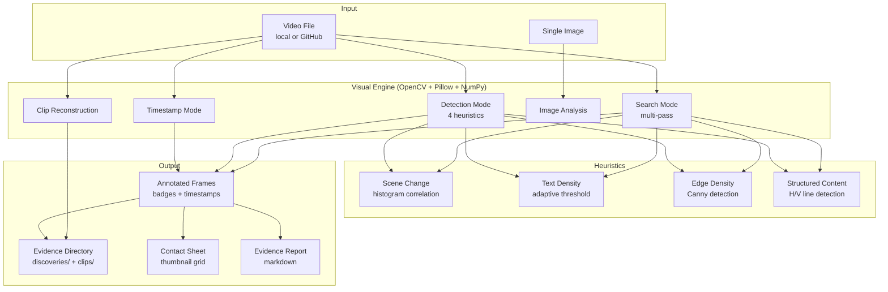

# Visual Documentation — Automated Evidence from Video Recordings

> **Full version**: [Complete technical documentation]({{ '/publications/visual-documentation/full/' | relative_url }})

---

## Contents

- [Abstract](#abstract)
- [Target Audience](#target-audience)
- [The Problem](#the-problem)
- [Architecture](#architecture)
- [Operating Modes](#operating-modes)
- [Evidence Structure](#evidence-structure)
- [Inline Display](#inline-display)
- [Related Publications](#related-publications)

---

## Abstract

The **Visual Documentation Engine** automates evidence extraction from video recordings for documentation creation, update, and review. Instead of manually scrubbing through video and taking screenshots, the `visual` command processes video files using computer vision to extract significant frames automatically.

**Design constraints**: No external tools (no ffmpeg CLI), no cloud APIs, no OCR services. Only standard Python libraries: **OpenCV** (video decoding, image processing), **Pillow** (annotation, contact sheets), **NumPy** (array operations, perceptual hashing).

---

## Target Audience

| Audience | Value |
|----------|-------|
| **Developers** | Automated evidence capture from session recordings |
| **QA Engineers** | Visual regression detection across test recordings |
| **Technical Writers** | Automated screenshot extraction for documentation |
| **AI-assisted workflows** | Claude sessions processing video evidence programmatically |

---

## The Problem

Development workflows generate video recordings: screen captures, UART sessions, demo recordings, CI/CD artifacts. Extracting useful frames from these recordings is manual, tedious, and inconsistent. A 2-hour recording might contain 5 key moments — finding them requires scrubbing through the entire video.

The Visual Documentation Engine solves this with three approaches:
1. **You know when** → Timestamp mode extracts at specific times
2. **You don't know when** → Detection mode finds significant frames automatically
3. **You know what** → Search mode combines criteria to find exactly what you need

---

## Architecture



---

## Operating Modes

### Timestamp Mode

Three input formats for when you know when the evidence occurred:

| Format | Flag | Example |
|--------|------|---------|
| Seconds | `--timestamps` | `10.5 30.0 60.0` |
| Clock time | `--times` | `00:01:30 00:05:00` |
| Date-time | `--dates` | `"2026-03-01 14:30:00"` |

### Detection Mode

Four computer vision heuristics scan the video for significant frames:

| Heuristic | Signal | Threshold |
|-----------|--------|-----------|
| **Scene change** | Major visual transitions | correlation `< 0.65` |
| **Text density** | Documentation content | `> 0.15` |
| **Edge density** | Diagrams, UI, code | `> 0.12` |
| **Structured content** | Tables, grids, forms | `> 0.08` |

### Search Mode (Multi-Criteria, Multi-Pass)

Intelligent search directly on the video — no bulk frame extraction. Two-pass architecture:

| Pass | Strategy | Speed |
|------|----------|-------|
| **Coarse** | Scan every ~1 second, evaluate all criteria | Fast |
| **Fine** | Frame-by-frame refinement around each hit (±0.5s) | Precise |

Criteria are combinable: `--scene-change`, `--min-text 0.15`, `--min-edge 0.12`, `--structured`, `--time-range 30 60`.

### Clip Reconstruction

Extract standalone `.mp4` video segments centered around evidence timestamps. Automatic in search mode — each finding gets a context clip.

### Image Analysis

Analyze single images with the same heuristics as video detection. Returns scores and a boolean evidence assessment.

---

## Evidence Structure

```
evidence/<session-name>/
  metadata.json          — source, criteria, timestamps
  discoveries/           — evidence frames (only the hits)
  clips/                 — reconstructed video segments
  index.md               — markdown inventory
```

---

## Inline Display

After extraction, evidence frames are presented directly in the conversation:

| Method | Mechanism | Client |
|--------|-----------|--------|
| **Direct** | Read tool renders PNG inline | Desktop/web with image support |
| **Via GitHub** | Push + raw URL markdown images | Mobile app, CLI, fallback |

---

## Related Publications

| # | Publication | Relationship |
|---|-------------|--------------|
| #0 | [Knowledge System]({{ '/publications/knowledge-system/' | relative_url }}) | Parent — Visuals is a command category |
| #2 | [Live Session Analysis]({{ '/publications/live-session-analysis/' | relative_url }}) | Sibling — real-time capture vs post-hoc analysis |
| #11 | [Success Stories]({{ '/publications/success-stories/' | relative_url }}) | Story #22 — Visual Documentation Engine |
| #16 | [Web Page Visualization]({{ '/publications/web-page-visualization/' | relative_url }}) | Sibling — web rendering pipeline (Playwright) |

---

*Publication #22 — Visual Documentation*
*Martin Paquet & Claude (Anthropic, Opus 4.6) — March 2026*
