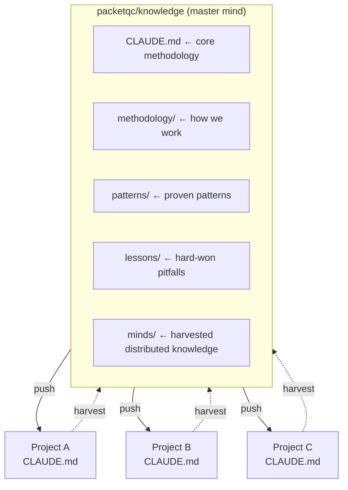
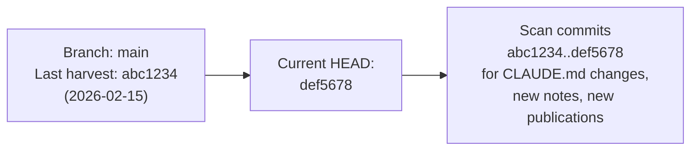
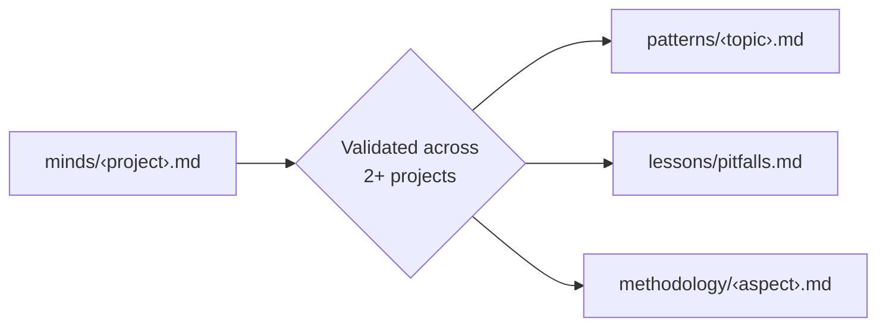

# Distributed Minds

**Harvested knowledge from satellite projects — the reverse flow.**

---

## Concept

The knowledge system has two flows:



**Push (outbound)** — On `wakeup`, satellite projects read `packetqc/knowledge` and inherit methodology, commands, and tooling. This is the sunglasses moment.

**Harvest (inbound)** — Satellite projects evolve their own Claude instructions, discover new patterns, hit new pitfalls, and develop project-specific methodology. The `harvest` command pulls these insights back to the center.

---

## Why This Matters

Each satellite project is a **live experiment**. Claude instances working in those projects accumulate session-specific and project-specific knowledge that lives only in that project's CLAUDE.md and notes/. Some of that knowledge is project-bound. But some transcends the project — it becomes **general wisdom**.

Without harvest, that wisdom stays scattered. With harvest, the master mind grows from every project it touches.

This is **distributed intelligence with centralized synthesis**.

---

## Use Cases

### 1. Bring Minds to Core Master

The primary use case. Satellite projects develop patterns, pitfalls, and methodology that generalize. Harvest extracts these and stages them in `minds/` for review and potential promotion to core knowledge (`patterns/`, `lessons/`, `methodology/`).

**Flow**: satellite CLAUDE.md + notes/ → `minds/<project>.md` → review → promote to core

### 2. Detect Publications for Core Website

Satellite projects may contain publications, technical writeups, or documentation that should be surfaced on the core knowledge website (GitHub Pages). Harvest detects these and copies **references only** to `minds/` — the original content stays in the satellite repo.

**Flow**: satellite `publications/` or `docs/` → reference in `minds/<project>.md` → review → new page in core `docs/publications/`

**Rule**: Never move a publication out of its source repo. Copy the reference, link to the source, and create a core publication page that either mirrors or links to the original.

---

## Structure

```
minds/
  README.md                    # This file — concept + protocol
  <project-slug>.md            # One file per satellite project
  synthesis.md                 # Cross-project insights (emerges over time)
```

Each project file has two parts: **harvest metadata** (for incremental tracking) and **harvested content** (the actual knowledge).

### Project File Format

```markdown
# <Project Name>

## Harvest Metadata
| Field | Value |
|-------|-------|
| Repo | packetqc/<project> |
| Last harvest | YYYY-MM-DD |
| Branches scanned | main, claude/*, feature/* |

### Branch Cursors
| Branch | Last harvested SHA | Date |
|--------|-------------------|------|
| main | abc1234 | YYYY-MM-DD |
| claude/feature-x | def5678 | YYYY-MM-DD |

---

## Knowledge Version
| Field | Value |
|-------|-------|
| Satellite version | v5 |
| Core version | v10 |
| Drift | 5 versions behind |
| Missing features | normalize, profile hub, distributed minds, versioning |
| Last remediated | YYYY-MM-DD (or never) |

---

## Knowledge Status
| Check | Status | Detail |
|-------|--------|--------|
| Bootstrap | bootstrapped / missing | ... |
| Session persistence | active / missing | ... |
| Live tooling | deployed / missing | ... |
| Own knowledge | evolved / basic | ... |
| Publications | detected / none | ... |

---

## Claude Instructions
<project-specific directives that may generalize>

## Evolved Patterns
<new patterns discovered during this project>

## New Pitfalls
<things that broke, not yet in master lessons/>

## Methodology Progress
<workflow improvements, new commands, process refinements>

## Publications Detected
| Title | Path (in satellite) | Status |
|-------|---------------------|--------|
| <title> | publications/<slug>/README.md | detected / reviewed / published |

## Promotion Candidates
<insights flagged for promotion to core knowledge>
```

---

## Harvest Protocol

### Access Scope

**By design**, the harvest system only operates on repositories that the user owns and that Claude Code has been granted access to via its GitHub application configuration. No external or third-party repositories are ever accessed — the distributed intelligence network is scoped exclusively to the user's own project ecosystem.

### How It Works

Harvest **crawls all branches** of a satellite repo, tracking what was already seen to avoid re-processing on the next run.

**Step-by-step**:

1. **Enumerate branches** — List all remote branches of the satellite repo (`git ls-remote` or `gh api`)
2. **Check cursors** — For each branch, compare current HEAD SHA against the last-harvested SHA stored in `minds/<project>.md`. Skip branches that haven't changed.
3. **Scan new content** — For changed branches, read:
   - `CLAUDE.md` — project-specific Claude instructions
   - `notes/` — session notes since last harvest
   - `publications/` — any technical writeups or docs
   - `<remember> harvest:` flags in notes
4. **Version check** — Read `<!-- knowledge-version: vN -->` from satellite CLAUDE.md. Compare against current core version. Compute drift.
5. **Extract** — Pull methodology, patterns, pitfalls, Claude instructions, and publication references
6. **Update** — Write to `minds/<project-slug>.md` with updated cursors and version status
7. **Update dashboard** — Refresh the Satellite Network Status table in `publications/distributed-knowledge-dashboard/v1/README.md`
8. **Report** — What was harvested, what's new, version drift, promotion candidates
9. **Remediate** (with `--fix`) — Update satellite's CLAUDE.md version tag + bootstrap section to latest

### Incremental Tracking

Each branch has a **cursor** — the commit SHA at last harvest. On the next harvest, only commits after that cursor are scanned. This keeps harvest fast even on repos with long histories.



**First harvest** of a project scans everything (no cursor yet). Subsequent harvests are incremental.

### Version Tracking and Drift Remediation

The core knowledge evolves via the **Knowledge Evolution** table in CLAUDE.md. Each entry carries a version number (v1, v2, ..., vN). Satellites track which version they last synced with via an HTML comment in their CLAUDE.md:

```markdown
<!-- knowledge-version: v47 -->
```

**On harvest**, the satellite's version is compared against the current core version:

```
Satellite: STM32N6570-DK_SQLITE
  Satellite version: v5   (has step 0, multipart help)
  Core version:      v10  (current)
  Drift:             5 versions behind
  Missing:           v7  normalize command
                     v8  profile hub
                     v9  distributed minds / harvest
                     v10 knowledge versioning
```

**Drift means** the satellite's Claude instances don't know about newer core features. They still work (step 0 ensures they read core CLAUDE.md on wakeup), but their local CLAUDE.md may reference outdated patterns or miss new commands.

**Remediation** (`harvest --fix <project>`):
1. Read satellite's CLAUDE.md
2. Update `<!-- knowledge-version: vN -->` to current core version
3. Update bootstrap section to latest template
4. Commit to satellite repo with message: `chore: sync knowledge version to vN`
5. Report what was updated

**No version tag = v0**: If a satellite has no `<!-- knowledge-version -->` comment, it's treated as v0 (pre-versioning). First `--fix` adds the tag.

**Why this works**: Satellites don't need to copy all core features — they just need to reference the latest core on `wakeup`. The version tag tracks awareness, not content. A satellite at v10 means "the last time someone verified this project's bootstrap, core was at v10." The actual knowledge comes from reading core CLAUDE.md at wakeup.

### Knowledge Distribution Inventory

Every harvest checks and reports whether the satellite repo has knowledge properly distributed in it. This answers: **"Does this project have the sunglasses?"**

**Checks performed**:

| Check | Look for | Status |
|-------|----------|--------|
| **Knowledge bootstrap** | `CLAUDE.md` references `packetqc/knowledge` | bootstrapped / missing |
| **Session persistence** | `notes/` folder with session files | active / missing |
| **Live tooling** | `live/` folder synced from knowledge | deployed / missing |
| **Own knowledge layer** | Project-specific `patterns/`, `methodology/`, or structured CLAUDE.md sections | evolved / basic |
| **Publications** | `publications/` or `docs/` with technical writeups | detected / none |

**Stored in project file** as a `Knowledge Status` section:

```markdown
## Knowledge Status
| Check | Status | Detail |
|-------|--------|--------|
| Bootstrap | bootstrapped | CLAUDE.md references packetqc/knowledge (line 12) |
| Session persistence | active | 5 session files in notes/ (latest: 2026-02-18) |
| Live tooling | deployed | live/ folder present with stream_capture.py |
| Own knowledge | evolved | 3 project-specific commands, 2 custom patterns |
| Publications | detected | 1 publication in publications/hardware-crypto/ |
```

**Why this matters**: Tracks which satellites are fully bootstrapped and which need the initial manual push. On `harvest --list`, the inventory gives a quick overview of the entire distributed network's health.

### Publication Detection

Harvest looks for publication-worthy content in satellite repos:

- `publications/` folder with README.md files
- `docs/` folder with structured technical content
- Notes flagged with `<remember> harvest: publication`

**What gets copied to minds/**: Title, path, summary, and a link to the source. **Not** the full content — that stays in the satellite. The core knowledge site can then create a new page that links to or mirrors the satellite publication.

### Promotion Flow

Not everything in `minds/` stays there. Insights that prove general across 2+ projects get **promoted**:



Once promoted, the insight is marked as `promoted` in the project file with a reference to where it landed. The master knowledge grows.

### Flagging in Satellite Projects

During work in a satellite project, flag harvest-worthy insights:
```
<remember> harvest: <insight description>
<remember> harvest: publication — <title and brief description>
```

These get collected on the next `harvest <project>`.

---

## Relationship to Master Knowledge

| Layer | Folder | Stability | Content |
|-------|--------|-----------|---------|
| **Core** | `CLAUDE.md` | Stable | Identity, methodology, evolution log |
| **Proven** | `patterns/`, `lessons/`, `methodology/` | Validated | Battle-tested patterns and pitfalls |
| **Harvested** | `minds/` | Evolving | Fresh insights from satellite projects |
| **Session** | `notes/` | Ephemeral | Per-session working memory |

`minds/` sits between proven knowledge and session memory. It's more durable than notes (it persists across sessions) but less established than core patterns (it hasn't been validated across multiple projects yet). It's the **incubator** — where project-specific discoveries mature before becoming universal knowledge.

---

## Mesh Pull (v2.0.1)

The harvest pull mechanism enables **any mind to pull content from any other mind**. This creates a virtual mesh network without changing the core harvest architecture.

### How It Works

```
Mind A (private)                    Mind B (public, GitHub Pages)
  publications/my-doc/v1/README.md
  └── Generated with local knowledge
                    ─── harvest --pull pub ───>
                                               publications/my-doc/v1/README.md
                                               └── Published on GitHub Pages
                                               └── Provenance: <!-- harvest-pull: owner/repoA -->
```

### Key Properties

- **Document travels, not the source code** — only the publication content is copied
- **Provenance tracking** — every pulled file has a `<!-- harvest-pull: ... -->` comment
- **No overwrite** — existing local files are never replaced (pull is additive)
- **Any direction** — not just satellite→core; any mind can pull from any mind
- **Aliases** — common minds have short names: `core`, `mplib`, `stm32`, `pqc`

### Commands

```
harvest --pull pub <mind> <slug>         # Pull a publication
harvest --pull pub <mind> --list         # List available publications
harvest --pull doc <mind> <slug>         # Pull a docs page only
harvest --pull methodology <mind> <slug> # Pull a methodology file
harvest --pull patterns <mind> <slug>    # Pull a pattern file
```

### Use Case: Private-to-Public Publishing

A private mind generates a document using its full local knowledge (code context, patterns, architecture). The document is the compiled artifact. A public mind then pulls only that document via `harvest --pull pub` and publishes it on GitHub Pages. The private source code never leaves the private repo.

---

## For Claude Instances

When reading `packetqc/knowledge`, the reading order is:

```
CLAUDE.md → methodology/ → patterns/ → lessons/ → minds/
```

`minds/` is read last because it's the newest, least-validated layer. But it often contains the most current insights — patterns that are forming, not yet crystallized.

When working in a satellite project and you discover something worth centralizing, tell the user: *"This looks like a harvest candidate for knowledge/minds/."*

When you detect a publication or technical writeup in a satellite project, flag it: *"This could be published on the knowledge site — flagging for harvest."*

---

## Authors

- **Martin Paquet** — Network Security Analyst Programmer, Network and System Security Administrator, Embedded Software Designer and Programmer
- **Claude** (Anthropic) — Distributed intelligence partner
