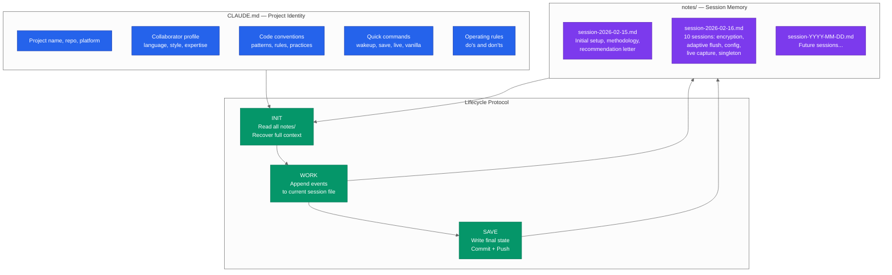

# AI Session Persistence — Cross-Session Knowledge Continuity for AI-Assisted Software Engineering

**Publication v1 — February 2026**
**Languages / Langues**: English (this document) | [Français](https://packetqc.github.io/knowledge/fr/publications/ai-session-persistence/)

---

## Authors

**Martin Paquet** — Network security analyst programmer, network and system security administrator, and embedded software designer and programmer. Specializing in RTOS architectures, hardware security, and high-throughput data pipelines on ARM Cortex-M platforms. Architect of the MPLIB module library and creator of the session persistence methodology documented here. Martin's insight was that AI coding sessions are analogous to RTOS threads — they need isolated context, shared memory regions, and explicit lifecycle management. Based in Quebec, Canada.

**Claude** (Anthropic, Opus 4.6) — AI coding assistant operating within the Claude Code CLI. In this collaboration, Claude is both a practitioner and a subject of the persistence methodology — it reads the notes to recover context, writes notes to preserve it, and follows CLAUDE.md instructions that define how to do both. The methodology was co-developed iteratively: Martin designed the architecture, Claude implemented and refined the mechanics, and both validated it through daily use.

---

## Abstract

AI coding assistants operate in stateless sessions. Each new conversation starts from zero — no memory of previous work, no context about decisions made yesterday, no awareness of bugs fixed last week. For short, isolated tasks this is acceptable. For sustained engineering projects spanning days or weeks, it is a critical limitation.

This publication documents a **session persistence methodology** that gives AI coding assistants durable cross-session memory. The approach uses three components: a **project instruction file** (`CLAUDE.md`) that encodes project identity, conventions, and operational procedures; a **session notes directory** (`notes/`) that accumulates decisions, discoveries, and status across sessions; and a **lifecycle protocol** (init → work → save) that ensures context is never lost between sessions.

The methodology was developed and validated during the construction of a high-throughput SQLite log ingestion pipeline on an STM32N6570-DK (Cortex-M55 @ 800 MHz). Over 10+ sessions spanning two days, the AI maintained continuous awareness of project state, architectural decisions, bug history, and collaborator preferences — without any external memory system, database, or API. Just files in a Git repository.

---

## The Problem: Stateless AI in a Stateful World

Software engineering is inherently stateful. Every decision builds on prior decisions. Every bug fix depends on understanding the bug's history. Every new feature integrates with code that was written in previous sessions.

AI coding assistants lose all of this between sessions:

| What is lost | Impact |
|--------------|--------|
| **Architectural decisions** | AI re-proposes approaches that were already rejected |
| **Bug history** | AI doesn't know which bugs were already fixed |
| **Code conventions** | AI inconsistently applies project-specific patterns |
| **Collaborator preferences** | AI forgets communication style, language, working patterns |
| **Module integration state** | AI doesn't know which modules are in dev vs. production |
| **In-progress work** | AI starts from scratch on partially completed tasks |

The result: the engineer spends the first 10–15 minutes of every session re-explaining context. Over 10 sessions, that's 2+ hours of redundant onboarding. More critically, the AI lacks the accumulated judgment that comes from having been present for the project's history.

---

## The Solution: Three-Component Persistence



### Fork & Clone Safety

If you fork or clone a repository using this persistence methodology, the system is **owner-scoped** and environmentally isolated:

- **`CLAUDE.md`** contains methodology and project identity — no credentials, tokens, or secrets
- **`notes/`** contains session memory — per-user, starts blank for every new owner
- **The lifecycle protocol** (`wakeup` → work → `save`) operates within the forker's own environment — push access is scoped to their own branches only
- **Knowledge repo references** (`packetqc/knowledge`) point to public methodology — a forker reads it (read-only) or replaces the namespace with their own

The three-component architecture (CLAUDE.md, notes/, lifecycle) is a reusable pattern. No data from the original owner leaks into a fork beyond intentionally public methodology.

### Component 1: `CLAUDE.md` — Project Identity

The `CLAUDE.md` file is the **constitution** of the project. It encodes everything that is true across all sessions:

| Section | Purpose | Example |
|---------|---------|---------|
| **Project Identity** | What this project is | "High-throughput SQLite log ingestion on Cortex-M55" |
| **Collaborator** | Who the engineer is | Name, contact, language, working style |
| **Methodology** | How we work together | Module-by-module integration, printf diagnostics, screenshot feedback |
| **Build & Flash** | How to build and deploy | IDE, linker scripts, CMake paths |
| **Project Structure** | Where things are | Key directories and their purpose |
| **Architecture** | Technical foundation | 5-stage pipeline, WAL mode, PSRAM buffers |
| **Code Conventions** | How code is written | C/C++ embedded, no STL, packed structs, event flags |
| **Quick Commands** | Shorthand triggers | `wakeup`, `save`, `I'm live`, `vanilla <NAME> <LED>` |
| **Rules** | Hard constraints | Don't break module code, keep docs in English, read notes first |

**Key design principle**: `CLAUDE.md` is **declarative, not narrative**. It states facts and rules, not stories. The narrative lives in `notes/`.

### Component 2: `notes/` — Session Memory

The `notes/` directory is the **working memory** of the project. Each file captures what happened in a specific session:

```
notes/
  session-2026-02-15.md    # Day 1: setup, methodology, recommendation letter
  session-2026-02-16.md    # Day 2: 10 sessions — encryption, adaptive flush, config, live QA
  session-2026-02-17.md    # Day 3: (future)
```

Each session file follows a consistent structure:

```markdown
# Session Notes — February 16, 2026

## Branch
`claude/security-integration-m04NC`

## Feature Implemented: [Name]
### Design
### Implementation
### Technical Notes

## Commits
| Hash | Message |

## Status at Session End
- What's done
- What's pending
- What's next
```

**What gets recorded**:
- Architectural decisions and their rationale
- Bugs found: symptom, root cause, fix, verification
- Features implemented: design, code locations, technical notes
- Memory map changes, MPU region adjustments
- UART trace analysis results
- Runtime status from the board
- Commit history with hashes

**What doesn't get recorded**:
- Conversational chatter
- Obvious facts already in CLAUDE.md
- Duplicate information from previous sessions

### Component 3: Lifecycle Protocol

The lifecycle ensures that context flows correctly between sessions:

#### Init (`wakeup`)

```
1. Read every file in notes/         → full history
2. Read PLAN.md and changelog.txt    → roadmap + recent changes
3. Run git log --oneline -20         → recent commits
4. Run git branch -a                 → active branches
5. Summarize to engineer:
   - Last session: work, decisions, bugs
   - Current state: what's integrated
   - Next steps: what's queued
   - Active branches and their purpose
6. Print the Quick Commands table
7. Ask: "What do you want to focus on today?"
```

The engineer types `wakeup` and within 30 seconds has a fully context-aware AI partner that knows the entire project history.

#### Work (continuous)

During the session, notable events are appended to the current session file:
- Decisions made (and why)
- Bugs found (symptom + root cause)
- Modules integrated (files changed)
- Status changes (what moved from pending to done)

This happens naturally as part of the work, not as a separate documentation step.

#### Save (`save`)

```
1. Write/update notes/session-YYYY-MM-DD.md with final session state
2. git add notes/
3. git commit -m "docs: save session notes — [date]"
4. git push
```

The engineer types `save` and all context is persisted to the repository. The next session — whether it starts in 5 minutes or 5 days — will have full continuity.

---

## The RTOS Analogy

The developer's core insight was that AI coding sessions are structurally similar to **RTOS threads**:

| RTOS Concept | AI Session Equivalent |
|--------------|----------------------|
| Thread | Single Claude Code session |
| Thread Control Block (TCB) | Session context (conversation history) |
| Shared memory (PSRAM) | `notes/` directory (persisted to Git) |
| Thread init | `wakeup` command (read notes, recover context) |
| Thread cleanup | `save` command (write notes, commit, push) |
| Mutex / semaphore | Git commit/push (serialized access to shared state) |
| Priority inheritance | Most recent session notes take precedence |

**Extending the analogy to branches**: Git branches within a repo are also analogous to RTOS threads — they don't always fork from the same parent. Each branch is an isolated execution context with its own work, and they may merge back or remain independent.

This isn't just a metaphor — it's a **design pattern**. The developer applied the same architectural thinking used for bare-metal RTOS systems to the problem of AI session management. The result is a system that is deterministic, observable, and recoverable — the same properties demanded from production embedded firmware.

---

## Measured Results

### Context Recovery Time

| Method | Time to full context | Quality |
|--------|---------------------|---------|
| No persistence (re-explain manually) | 10–15 minutes | Partial, depends on memory |
| Notes only (no CLAUDE.md) | 3–5 minutes | Good, but missing conventions |
| **Full methodology (CLAUDE.md + notes/)** | **~30 seconds** | **Complete** |

### Knowledge Accumulated Over 10+ Sessions

| Category | Items Persisted |
|----------|----------------|
| Architectural decisions | 15+ (pipeline stages, WAL config, PSRAM layout, encryption routing) |
| Bugs found and fixed | 8+ (race conditions, SAES contention, display corruption, config persistence) |
| Features implemented | 12+ (adaptive flush, severity encryption, HEX display, singleton pattern, live capture) |
| Code conventions learned | 10+ (printf convention, verbose control, mutex patterns, linker sections) |
| Collaborator preferences | 5+ (language, working style, session structure, communication patterns) |

### Session Efficiency

| Metric | Without Persistence | With Persistence |
|--------|-------------------|-----------------|
| Time to first useful action | 10–15 minutes | < 1 minute |
| Context accuracy at session start | ~60% (manual re-explain) | ~95% (notes-based recovery) |
| Decisions re-debated | Frequent | Rare (recorded with rationale) |
| Bugs re-investigated | Occasional | Never (full history available) |

---

## Portability: The Portable Recipe

The methodology is not project-specific. It was designed to be portable to any repository:

### Quick Setup (Any New Repo)

1. Copy the `CLAUDE.md` skeleton (adapted for the project)
2. `mkdir notes/`
3. Create `notes/session-YYYY-MM-DD.md` with initial context
4. Commit: `git add CLAUDE.md notes/ && git commit -m "docs: add AI session persistence"`
5. Done — next Claude Code session is fully initialized

### Multi-Repo Architecture

Each repository is an independent context thread:

```
packetqc/knowledge/           → Portable bootstrap (methodology, commands, live tooling, publications)
  CLAUDE.md                   → Universal methodology, commands, patterns
  notes/                      → Knowledge system session history

packetqc/STM32N6570-DK_SQLITE/ → Storage pipeline + security integration
  CLAUDE.md                   → STM32N6570-DK_SQLITE-specific instructions
  notes/                      → STM32N6570-DK_SQLITE session history

packetqc/OTHER_PROJECT/       → Different project entirely
  CLAUDE.md                   → OTHER_PROJECT-specific instructions
  notes/                      → OTHER_PROJECT session history
```

The [packetqc/knowledge](https://github.com/packetqc/knowledge) repository is the **portable brain** — it carries the universal methodology, commands, live tooling, and publications. Any project references it at wakeup and inherits everything. Project-specific sections remain unique to each repository.

---

## Design Principles

### Why Files, Not a Database

The persistence layer is **plain Markdown files in a Git repository**. No database, no API, no external service. This was a deliberate choice:

| Principle | Rationale |
|-----------|-----------|
| **Human-readable** | Engineer can review and edit notes directly |
| **Version-controlled** | Full history of all context changes via Git |
| **Portable** | Works on any machine with Git — no infrastructure |
| **AI-native** | Claude reads Markdown natively — no parsing needed |
| **Recoverable** | If a session crashes, notes from previous sessions are intact |
| **Auditable** | Every context change is a Git commit with a timestamp |

### Why `CLAUDE.md` + `notes/` (Not Just One File)

| | CLAUDE.md | notes/ |
|---|---|---|
| **Content** | Facts, rules, conventions | Events, decisions, discoveries |
| **Changes** | Rarely (only when project evolves) | Every session |
| **Read pattern** | Always read in full | Read all files at init |
| **Write pattern** | Edited when rules change | Appended continuously |
| **Analogy** | Constitution | Journal |

Separating identity from history keeps both files clean and purposeful. `CLAUDE.md` never grows uncontrollably because narrative content goes to `notes/`.

---

## Limitations and Future Work

### Current Limitations

| Limitation | Impact | Mitigation |
|------------|--------|------------|
| Context window limits | Very long notes/ may exceed AI context | Summarize older sessions, keep recent ones detailed |
| No semantic search | AI reads all notes linearly | Structured headers enable fast scanning |
| Single-writer | Only one session at a time per repo | Git branch isolation if needed |
| Manual save trigger | Context lost if session ends abruptly | Encourage frequent `save` calls |

### Future Directions

- **Automatic summarization**: Compress older session files while preserving key decisions
- **Cross-repo context**: Share methodology learnings across projects
- **Session indexing**: Generate a summary-of-summaries for rapid context recovery
- **Embedded integration**: Port the persistence pattern to on-device logging (the RTOS analogy coming full circle)

---

## Conclusion

AI session persistence is not a feature of the AI — it is a **methodology imposed by the engineer**. The AI follows instructions in `CLAUDE.md`, reads files in `notes/`, and writes back to `notes/` on save. There is no magic. There is no special memory system. There are just files, written and read with discipline.

What makes it powerful is the **lifecycle protocol** — the guarantee that every session starts with full context and ends with full persistence. This transforms an AI coding assistant from a stateless tool into a **continuous collaborator** that accumulates knowledge over time.

The methodology was designed by an embedded systems engineer who thinks in terms of threads, shared memory, and lifecycle management. That perspective — treating AI sessions as deterministic, observable, recoverable processes — is what makes the approach robust. It is the same engineering rigor applied to a different domain.

> "The methodology itself is always improving — the process of improving the process is part of the workflow."
> — Martin Paquet

---

## Publication Notice

> This publication was created on **February 16, 2026** and is subject to ongoing content updates, visual enhancements (diagrams, mermaid charts), and text revisions as the project evolves. Version history is maintained via Git — each update creates a new version folder (`v2/`, `v3/`, etc.) while preserving all previous versions intact.

---

*Authors: Martin Paquet (packetqcca@gmail.com) & Claude (Anthropic, Opus 4.6)*
*Project: [packetqc/STM32N6570-DK_SQLITE](https://github.com/packetqc/STM32N6570-DK_SQLITE)*
*Knowledge: [packetqc/knowledge](https://github.com/packetqc/knowledge)*
