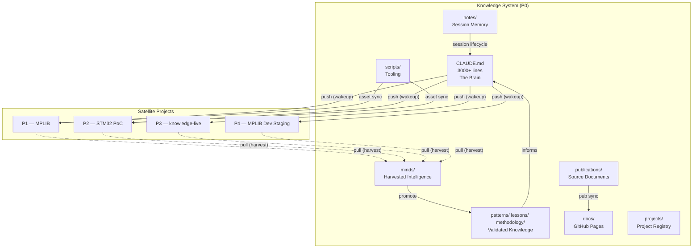
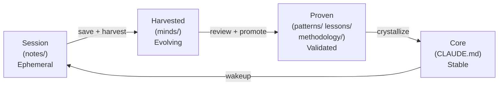
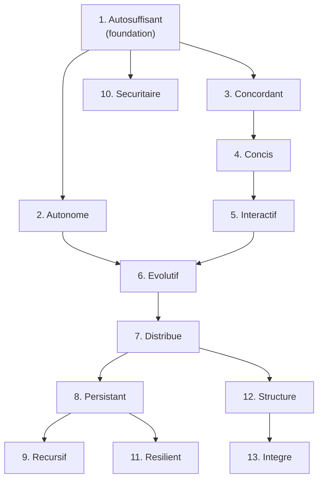
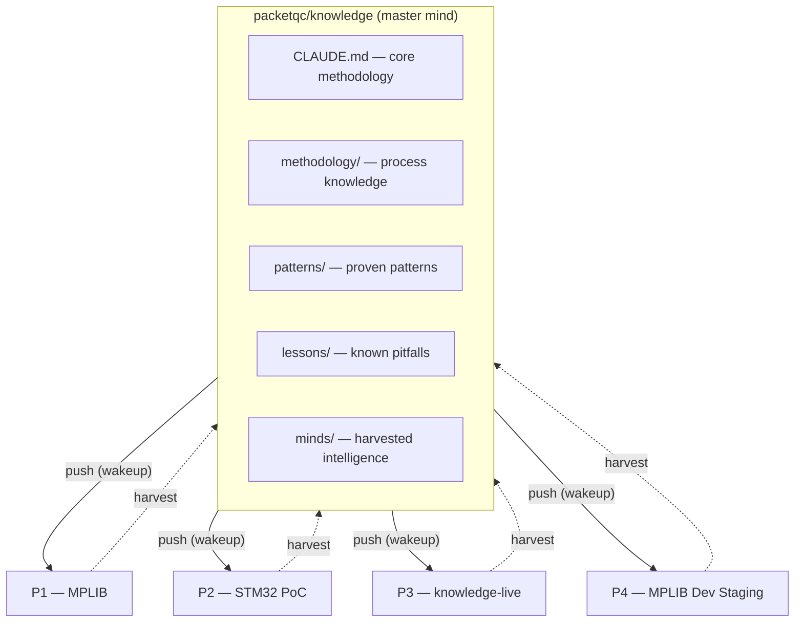

# Knowledge Architecture Analysis — Publication Documentation

**Publication #14 — System Architecture of the Self-Evolving AI Engineering Intelligence**

*By Martin Paquet & Claude (Anthropic, Opus 4.6)*
*v1 — February 2026*

---

## Authors

**Martin Paquet** — Network security analyst programmer, network and system security administrator, and embedded software designer and programmer. 30 years of experience spanning embedded systems, network security, telecom, and software development. Architect of the Knowledge system — a self-evolving AI engineering intelligence built on plain Markdown files in Git.

**Claude** (Anthropic, Opus 4.6) — AI development partner. Co-architect and primary executor of the Knowledge system. Operates within the architecture described here — every session bootstraps from these structures, every command follows these patterns.

---

## Abstract

The Knowledge system (P0) is a self-evolving AI engineering intelligence that transforms stateless AI coding sessions into a persistent, distributed, self-healing network of awareness. Built entirely on plain Markdown files in Git repositories, it requires no external services, no databases, and no cloud infrastructure. One `git clone` bootstraps everything.

This publication provides a comprehensive architecture analysis of the system: its four knowledge layers (Core, Proven, Harvested, Session), its 13+ major components, its 13 core qualities, its session lifecycle, its distributed master-satellite topology, its security model, its web publishing architecture, and its production/development deployment tiers. The analysis covers both the structural design and the emergent properties that arise from the interaction of these components.

The architecture is distinctive in that the system documents itself by consuming its own output — publication #0 was built by harvesting its children. The dashboard updates itself on every harvest. The evolution log grows as the system grows. This recursive self-awareness is not a design goal but an emergent property of the architecture.

---

## Table of Contents

- [System Overview](#system-overview)
- [Knowledge Layers](#knowledge-layers)
  - [Core Layer — CLAUDE.md](#core-layer--claudemd)
  - [Proven Layer — patterns/, lessons/, methodology/](#proven-layer--patterns-lessons-methodology)
  - [Harvested Layer — minds/](#harvested-layer--minds)
  - [Session Layer — notes/](#session-layer--notes)
  - [Layer Interaction Model](#layer-interaction-model)
- [Component Architecture](#component-architecture)
  - [CLAUDE.md — The Brain](#claudemd--the-brain)
  - [scripts/gh_helper.py — GitHub API Gateway](#scriptsgh_helperpy--github-api-gateway)
  - [scripts/generate_og_gifs.py — Visual Identity Engine](#scriptsgenerate_og_gifspy--visual-identity-engine)
  - [scripts/sync_roadmap.py — Board Synchronization](#scriptssync_roadmappy--board-synchronization)
  - [publications/ — Source Documents](#publications--source-documents)
  - [docs/ — Web Publishing Layer](#docs--web-publishing-layer)
  - [minds/ — Harvested Intelligence](#minds--harvested-intelligence)
  - [methodology/ — Process Knowledge](#methodology--process-knowledge)
  - [patterns/ and lessons/ — Validated Knowledge](#patterns-and-lessons--validated-knowledge)
  - [notes/ — Session Memory](#notes--session-memory)
  - [live/ — Real-Time Tooling](#live--real-time-tooling)
  - [projects/ — Project Registry](#projects--project-registry)
- [Quality Architecture](#quality-architecture)
  - [The 13 Core Qualities](#the-13-core-qualities)
  - [Quality Dependency Graph](#quality-dependency-graph)
  - [Quality Enforcement Mechanisms](#quality-enforcement-mechanisms)
- [Session Lifecycle Architecture](#session-lifecycle-architecture)
  - [The Wakeup Protocol](#the-wakeup-protocol)
  - [Work Phase](#work-phase)
  - [Save Protocol](#save-protocol)
  - [Checkpoint and Resume](#checkpoint-and-resume)
  - [Recover — Branch-Based Recovery](#recover--branch-based-recovery)
  - [Context Loss and Refresh](#context-loss-and-refresh)
- [Distributed Architecture](#distributed-architecture)
  - [Master-Satellite Topology](#master-satellite-topology)
  - [Push Flow — Wakeup](#push-flow--wakeup)
  - [Pull Flow — Harvest](#pull-flow--harvest)
  - [Self-Healing Mechanism](#self-healing-mechanism)
  - [Version Tracking and Drift](#version-tracking-and-drift)
- [Security Architecture](#security-architecture)
  - [Proxy Model](#proxy-model)
  - [Ephemeral Token Protocol](#ephemeral-token-protocol)
  - [Owner-Scoped Access](#owner-scoped-access)
  - [Fork and Clone Safety](#fork-and-clone-safety)
  - [Two-Channel Model](#two-channel-model)
- [Web Architecture](#web-architecture)
  - [GitHub Pages and Jekyll](#github-pages-and-jekyll)
  - [Dual-Theme System](#dual-theme-system)
  - [Layout Architecture](#layout-architecture)
  - [Publication Pipeline](#publication-pipeline)
  - [Bilingual Mirror System](#bilingual-mirror-system)
  - [Export Architecture](#export-architecture)
- [Deployment Model](#deployment-model)
  - [Production and Development Tiers](#production-and-development-tiers)
  - [Satellite Lifecycle](#satellite-lifecycle)
  - [Network Topology](#network-topology)
- [Related Publications](#related-publications)

---

## Target Audience

This publication is intended for work teams involved in the Knowledge system's ecosystem:

| Audience | What to focus on |
|----------|-----------------|
| **Network Administrators** | Distributed architecture, security model, proxy boundaries, deployment tiers |
| **System Administrators** | Deployment model, GitHub Pages configuration, asset management, production/development tiers |
| **Programmers** | Component architecture, session lifecycle, knowledge layers, quality architecture, Python scripts |
| **Managers** | System overview, core qualities, deployment tiers, the 100x productivity ratio documented in success stories |

The document progresses from high-level overview to detailed technical analysis. Managers and architects may focus on the first sections (System Overview, Knowledge Layers, Quality Architecture), while implementers will find the later sections (Session Lifecycle, Security Architecture, Deployment Model) most actionable.

## Document Conventions

This publication uses the following conventions throughout:

| Convention | Usage |
|------------|-------|
| **Tables** | Structured data, comparisons, inventories — compact format (key-value or multi-column) |
| **Mermaid diagrams** | Architecture visualizations embedded inline — rendered by GitHub and GitHub Pages |
| **Code blocks** | File paths, command examples, configuration snippets |
| **Bold text** | Key terms on first introduction, emphasis on critical concepts |
| **Quality references** (`#N`) | Cross-references to the 13 core qualities by their number (e.g., *Autonomous* #2, *Concordant* #3) |
| **Publication references** (`#N`) | Cross-references to sibling publications by number (e.g., Publication #15 for diagrams) |
| **Version references** (`vN`) | Knowledge evolution version numbers tracking architectural discoveries |
| **Arrows in text** (`→`) | Process flow or transformation (e.g., source → EN/FR → cross-references) |

---

## System Overview

The Knowledge system is a **self-evolving AI engineering intelligence** — a network of Git repositories, Markdown files, and Python scripts that gives AI coding assistants persistent memory, distributed awareness, and self-healing capabilities. At its core, it solves a fundamental problem: AI coding sessions are stateless. Without external structure, every new session starts blank — an NPC with no memory of yesterday.

The system's architecture can be understood through three lenses:

1. **As a persistence mechanism**: CLAUDE.md + notes/ + the wakeup/save lifecycle transform ephemeral sessions into continuous collaboration
2. **As a distributed network**: A master mind (knowledge repo) pushes methodology to satellite projects and harvests insights back, creating bidirectional intelligence flow
3. **As a self-documenting system**: The system records its own evolution, publishes its own documentation, and grows by consuming its own output



The entire system runs on plain text. No databases, no cloud services, no external dependencies beyond Git and GitHub. This is the **autosuffisant** quality — the system sustains itself from its own structure.

---

## Knowledge Layers

The system organizes knowledge into four layers, ordered by stability and validation level. Each layer has a distinct lifecycle, storage location, and purpose.



### Core Layer — CLAUDE.md

**Location**: `CLAUDE.md` (root of every repository)
**Stability**: Highest — changes here propagate to the entire network
**Size**: 3000+ lines in the master repo; ~180 lines (critical-subset) in satellites

CLAUDE.md is the brain of the system. In the master knowledge repo, it contains the complete methodology: identity, session lifecycle, command definitions, proven patterns, known pitfalls, knowledge evolution log, publication inventory, and the full distributed protocol. It is loaded as **system-level project instructions** by Claude Code, giving it the highest authority level — surviving context compaction that strips conversation-level data.

In satellite repos, CLAUDE.md carries a **critical-subset** (~180 lines): a knowledge pointer to the master repo, essential behavioral DNA (session protocol, save protocol, branch protocol, human bridge principle), and the full 7-group commands reference. This subset survives compaction — the satellite retains correct behavior even when conversation context is lost.

**Key architectural property**: CLAUDE.md is both configuration and documentation. It configures Claude Code's behavior AND documents the system's architecture for human readers. This dual role is intentional — the system is designed to be readable by both AI and humans.

### Proven Layer — patterns/, lessons/, methodology/

**Location**: `patterns/`, `lessons/`, `methodology/` directories
**Stability**: High — content validated across multiple projects
**Content**: Battle-tested patterns (embedded debugging, RTOS integration, SQLite on embedded), known pitfalls (20 documented failure modes), and process methodology (satellite bootstrap, project management, web pagination)

This layer represents **validated knowledge** — insights that have been proven correct across at least two projects. Patterns describe approaches that work. Lessons describe approaches that failed. Methodology describes processes that have been refined through practice.

The proven layer is the promotion target for harvested insights. When an insight from `minds/` is validated across multiple projects, it graduates to `patterns/` or `lessons/` via the `harvest --promote` command.

### Harvested Layer — minds/

**Location**: `minds/` directory
**Stability**: Medium — newer, less validated than proven knowledge
**Content**: Per-satellite mind files with extracted insights, version tracking, branch cursors, and promotion candidates

The `minds/` folder is the **incubator** — where project-specific discoveries mature before becoming universal knowledge. Each satellite project has a corresponding `minds/<project-slug>.md` file containing:

- Extracted patterns and pitfalls from the satellite's work
- Branch cursors (commit SHA + date) for incremental tracking
- Version drift status relative to core
- Promotion candidates flagged for review

`minds/` sits between proven knowledge and session memory. More durable than notes (persists across sessions), less established than core patterns (not yet validated across projects).

### Session Layer — notes/

**Location**: `notes/` directory in every repository
**Stability**: Lowest — ephemeral per-session data
**Content**: Session notes (`session-YYYY-MM-DD.md`), checkpoint files (`checkpoint.json`), board state caches, healthcheck data

The session layer is **working memory**. Each session writes its findings, decisions, and next steps to `notes/`. The next session reads these on wakeup, achieving context recovery in ~30 seconds instead of ~15 minutes of manual re-explanation.

Session notes follow a structured format: Done (what was accomplished), Remember (directives for future sessions), Next (planned work). The `remember harvest:` flag marks insights for collection by the harvest protocol.

### Layer Interaction Model

The four layers form a knowledge lifecycle:

| Transition | Mechanism | Trigger |
|-----------|-----------|---------|
| Session → Harvested | `harvest <project>` | Explicit command |
| Harvested → Proven | `harvest --promote <N>` | Human-validated promotion |
| Proven → Core | Manual CLAUDE.md update | Architectural crystallization |
| Core → Session | `wakeup` (auto-runs on session start) | Every session start |
| Session → Session | `notes/` persistence | Save → next wakeup |

The cycle is continuous: sessions generate insights, harvest collects them, promotion validates them, and the core absorbs them. The next session inherits the enriched core. This is the **recursive** quality — the system grows by consuming its own output.

---

## Component Architecture

The Knowledge system consists of 13 major components, each with a distinct role. They interact through well-defined interfaces — primarily Markdown files, git operations, and Python scripts.

### CLAUDE.md — The Brain

**Role**: System configuration, methodology documentation, command definitions
**Interfaces**: Read by Claude Code as system-level project instructions; read by wakeup protocol; read by harvest for version comparison
**Key property**: Dual-role as AI configuration AND human documentation

CLAUDE.md is the largest and most important file in the system. In the master repo, it exceeds 3000 lines and contains:

| Section | Content | Lines (~) |
|---------|---------|-----------|
| Identity | Who is Martin, how we work together | ~100 |
| Core Qualities | 13 qualities with descriptions | ~50 |
| Session Lifecycle | Wakeup, work, save, checkpoint, resume, recover, recall | ~200 |
| Commands | 7 groups, 49+ commands with full specifications | ~1500 |
| Patterns | Proven embedded debugging, RTOS, SQLite patterns | ~50 |
| Pitfalls | 20 documented failure modes with fixes | ~200 |
| Knowledge Evolution | 48 versioned entries documenting system changes | ~500 |
| Publications | 13+ publications with links | ~50 |
| Protocols | Branch, access, token, deployment | ~300 |

### scripts/gh_helper.py — GitHub API Gateway

**Role**: Portable Python replacement for the `gh` CLI
**Technology**: Pure Python `urllib` (no external dependencies)
**Key property**: Bypasses the container proxy that blocks `curl` and `gh`

`gh_helper.py` is the system's gateway to the GitHub API. It was created because:
1. The `gh` CLI is not installed in Claude Code containers
2. `curl` to `api.github.com` is blocked by the container proxy (auth headers stripped)
3. Python `urllib` opens direct socket connections, bypassing the proxy entirely

It covers: PR operations (create, list, view, merge, ensure), GitHub Projects v2 (create board, link repo, list items, sync, fields, item add/update), TAG labels (setup, batch deploy), and issue management (create with labels). It reads `GH_TOKEN` from `os.environ` internally — the token never appears on any command line.

### scripts/generate_og_gifs.py — Visual Identity Engine

**Role**: Generate animated OG social preview GIFs for all web pages
**Technology**: PIL/Pillow, Python
**Output**: 40+ animated GIFs (1200x630, 256-color, dual-theme)

The webcard generator creates unique animated social preview images for every web page. Six animation types (corporate, diagram, split-panel, cartoon, index) with content-specific motion. Dual-theme: Cayman (light) and Midnight (dark). Data-driven — the dashboard webcard reads actual satellite status from the source README.

### scripts/sync_roadmap.py — Board Synchronization

**Role**: Pull GitHub Project board items and write static JSON for the client-side board widget
**Technology**: Python, GraphQL
**Output**: `docs/data/board-{N}.json` files consumed by the web dashboard

### publications/ — Source Documents

**Role**: Canonical source for all publications
**Structure**: `publications/<slug>/v1/README.md` per publication
**Key property**: Source of truth — web pages (`docs/`) are derived from these

Each publication exists as a versioned Markdown document. The `v1/` directory allows future version bumps without losing history. Assets and media subdirectories (`assets/`, `media/`) hold publication-specific resources.

### docs/ — Web Publishing Layer

**Role**: GitHub Pages website serving all web content
**Technology**: Jekyll with custom layouts, no remote theme dependency
**Structure**: Bilingual (EN at root, FR at `/fr/`), three-tier publications (summary, complete, source)

The `docs/` folder is the public face of the system. It contains:
- Landing pages (EN + FR)
- Profile pages (hub, resume, full — EN + FR)
- Publications (summary + complete for each — EN + FR)
- Project hub pages (EN + FR)
- Assets (webcards, social preview, CSS, JS)

### minds/ — Harvested Intelligence

**Role**: Incubator for satellite-discovered insights
**Structure**: One `<project-slug>.md` per satellite with structured insight data
**Key property**: Bridge between session-level ephemeral data and core-level permanent knowledge

### methodology/ — Process Knowledge

**Role**: Detailed process documentation for complex operations
**Content**: Satellite bootstrap, project creation, client disconnect recovery, web pagination/export, production/development model, tagged input, GitHub board aliases
**Key property**: Living documentation — updated as processes evolve

### patterns/ and lessons/ — Validated Knowledge

**Role**: Battle-tested approaches (patterns) and documented failures (lessons)
**Content**: Embedded debugging, RTOS integration, SQLite on embedded, 20 known pitfalls
**Key property**: Validated across 2+ projects before inclusion

### notes/ — Session Memory

**Role**: Per-session working memory with structured format
**Content**: Session notes, checkpoints, board state caches, healthcheck data
**Key property**: Ephemeral by design — serves the current session chain, not long-term storage

### live/ — Real-Time Tooling

**Role**: Live capture and inter-instance communication tools
**Content**: `stream_capture.py` (OBS/RTSP capture), `knowledge_beacon.py` (peer discovery on port 21337), `knowledge_scanner.py` (subnet probing)
**Key property**: Synced to every satellite as a knowledge asset

### projects/ — Project Registry

**Role**: Central registry of all projects with hierarchical P# indexing
**Structure**: Flat `<slug>.md` metadata files (never subfolders)
**Content**: Project identity, type (core/child/managed), status, associated repos, board links

---

## Quality Architecture

### The 13 Core Qualities

The Knowledge system embodies 13 qualities — each discovered through practice, each reinforcing the others. They are named in French (the system was conceived in French) and form a dependency hierarchy.

| # | Quality | Essence |
|---|---------|---------|
| 1 | **Autosuffisant** | No external services, no databases, no cloud. Plain Markdown in Git. |
| 2 | **Autonome** | Self-propagating, self-healing, self-documenting. |
| 3 | **Concordant** | Structural integrity actively enforced (EN/FR mirrors, front matter, links). |
| 4 | **Concis** | Critical-subset, not copies. Maximum signal, minimum noise. |
| 5 | **Interactif** | Operable, not just readable. Click-to-copy commands. |
| 6 | **Evolutif** | The system grows as it works. Knowledge versions track discoveries. |
| 7 | **Distribue** | Intelligence flows both ways. Push methodology out, harvest insights back. |
| 8 | **Persistant** | Sessions are ephemeral, knowledge is permanent. |
| 9 | **Recursif** | The system documents itself by consuming its own output. |
| 10 | **Securitaire** | Security by architecture, not by obscurity. Owner-scoped, proxy-bounded. |
| 11 | **Resilient** | Every failure mode has a matching recovery path. |
| 12 | **Structure** | Organized around projects, not just publications. |
| 13 | **Integre** | Extends into external platforms (GitHub Projects, Issues, PRs). |

### Quality Dependency Graph



**Reading order**: Autosuffisant enables everything — if the system depends on external services, nothing else works. Autonome and concordant maintain it. Concis keeps it manageable. Interactif and evolutif make it usable and alive. Distribue scales it. Persistant anchors it. Recursif makes it self-aware. Securitaire makes it publishable. Resilient makes it survivable. Structure organizes it around projects. Integre extends it into external platforms.

### Quality Enforcement Mechanisms

Each quality is enforced by specific commands and protocols:

| Quality | Enforcement mechanism |
|---------|----------------------|
| Autosuffisant | No external dependency in any component; pure Python tooling |
| Autonome | `wakeup` auto-runs; `normalize --fix` self-heals; bootstrap auto-creates |
| Concordant | `normalize` audits structure; `pub check` validates publications |
| Concis | Critical-subset template (~180 lines vs 3000+ in core) |
| Interactif | Click-to-copy JS on dashboard; promotion workflow via web page |
| Evolutif | Knowledge Evolution table with 48 versioned entries |
| Distribue | `harvest` protocol with branch cursors; `wakeup` step 0 |
| Persistant | `notes/` + `save` protocol; `checkpoint.json` |
| Recursif | `harvest` feeds `minds/`, `minds/` feeds publications, publications feed core |
| Securitaire | Proxy scoping; ephemeral tokens; `.gitignore` blocks; owner namespace |
| Resilient | `resume` (checkpoint), `recover` (branches), `recall` (deep memory), `refresh` (compaction), `wakeup` (deep) |
| Structure | `projects/` registry; P# indexing; dual-origin links |
| Integre | `gh_helper.py`; GitHub Projects v2; TAG: convention; `sync_roadmap.py` |

---

## Session Lifecycle Architecture

Every AI session follows the same lifecycle. This is the persistence mechanism that transforms stateless NPCs into continuous collaborators.

```
[auto-wakeup] → check checkpoint → read notes/ → summarize state → work → [auto-checkpoint] → save → commit & push
```

### The Wakeup Protocol

Wakeup is the "sunglasses moment" — the transition from NPC to AWARE. It runs automatically on every session start.

**12 steps** (0 through 11):

| Step | Action | Purpose |
|------|--------|---------|
| 0 | Clone `packetqc/knowledge` | Put on the sunglasses — read the brain |
| 0.3 | Detect/acquire GH_TOKEN | Elevation for autonomous mode |
| 0.5 | Bootstrap scaffold | Create missing essential files on fresh repos |
| 0.55 | Self-heal satellite CLAUDE.md | Automatic drift remediation |
| 0.56 | Merge self-heal PR | Same-session command activation |
| 0.6 | Knowledge beacon (disabled) | Available for manual start |
| 0.7 | Sync upstream | Fetch and merge default branch |
| 0.8 | Re-read knowledge | Mid-session sync for concurrent updates |
| 0.9 | Resume detection | Check for `notes/checkpoint.json` |
| 1-8 | Read state | Evolution, minds/, notes/, plans, assets, git log, branches |
| 9 | Print help | Intelligence + full command table |
| 10 | Harvest prompt | Core repo only, opt-in |
| 11 | Address user's message | Start working |

**Adaptation**: Wakeup adapts to the environment. In plan mode (Bash blocked), it switches Step 0 from `git clone` to WebFetch. In satellites, it adds bootstrap and self-heal steps. The protocol is the same structure everywhere, but the implementation adapts.

### Work Phase

Between wakeup and save, the session operates normally — writing code, analyzing screenshots, running commands, managing publications. During work:

- Decisions and findings are appended to `notes/session-YYYY-MM-DD.md`
- The `remember` command persists specific insights
- `remember harvest:` flags insights for collection by the harvest protocol
- `remember evolution:` flags architectural discoveries for the evolution log
- Checkpoints are auto-written at protocol step boundaries during multi-step operations

### Save Protocol

The save command persists work and delivers it to the default branch. It adapts to the session's elevation state:

| Mode | Token | Flow | User action |
|------|-------|------|-------------|
| Full autonomous | Classic PAT | PR create + merge via API + sync | None |
| Semi-automatic | None | PR create + pause block | Merge PR (one click) |

**Protocol (6 steps)**: Write notes → commit → push → detect default branch → create PR → merge (elevated) or user merges (semi-auto).

The PR is the bridge between the proxy-authorized task branch and the convergence point (default branch). Without the merge, work is stranded.

### Checkpoint and Resume

Multi-step protocols (save, harvest, normalize, bootstrap) write checkpoints at step boundaries to `notes/checkpoint.json`. If a session crashes mid-protocol, the next session detects the checkpoint at wakeup step 0.9 and offers resume.

```json
{
  "version": 1,
  "session_id": "claude/<task-id>",
  "command": "harvest --healthcheck",
  "protocol_steps": [
    { "step": "Scan core", "status": "completed" },
    { "step": "Scan satellite", "status": "in_progress" }
  ],
  "recovery_hint": "Resume healthcheck — skip scanned satellites"
}
```

The resume command restarts from the last completed step — no manual re-explanation needed. Checkpoints are auto-deleted on successful completion.

### Recover — Branch-Based Recovery

When a session crashes without writing a checkpoint, `recover` searches `claude/*` branches for committed work that was never merged:

1. Enumerate all `claude/*` branches sorted by date
2. Filter for branches with unmerged commits
3. Offer cherry-pick or diff-apply recovery
4. Apply chosen recovery method to current branch

### Context Loss and Refresh

When context is compacted mid-session, `refresh` restores CLAUDE.md context without the overhead of a full wakeup:

| Command | Use case | Speed |
|---------|----------|-------|
| `refresh` | After compaction — formatting lost | ~5s |
| `wakeup` | After PRs merged by other sessions | ~30-60s |
| `resume` | After crash with checkpoint | ~10s |
| `recover` | After crash without checkpoint | ~15s |
| `recall` | Deep memory search — past sessions, patterns, decisions | ~10s |

---

## Distributed Architecture

### Master-Satellite Topology

The Knowledge system operates as a hub-and-spoke network with bidirectional intelligence flow:



**Master mind** (P0 — `packetqc/knowledge`): Contains the canonical CLAUDE.md, all proven knowledge, the harvested minds/, the full publication library, and the web presence. This is the PRODUCTION tier for the network.

**Satellite projects** (P1-P9): Each satellite has its own CLAUDE.md (critical-subset), its own notes/, its own `live/` tooling, and potentially its own GitHub Pages and publications. Satellites are simultaneously:
- **Development** relative to core — testing ground for new capabilities
- **Production** at their own repo level — independently authoritative for their domain

### Push Flow — Wakeup

On every session start in a satellite, the wakeup protocol reads `packetqc/knowledge` CLAUDE.md first (Step 0). This pushes the latest methodology, commands, patterns, and protocols to the satellite. The satellite also receives:

- Knowledge assets (`live/` tooling, `scripts/` helpers)
- Bootstrap scaffold (essential files for fresh repos)
- Self-heal updates (commands section refreshed to latest core version)

The push is **read-based, not write-based** — the satellite reads from core, core does not push to satellites. This works because all access uses public HTTPS URLs.

### Pull Flow — Harvest

The `harvest` command pulls evolved knowledge from satellites back to the center:

1. **Enumerate branches** — `git ls-remote` to list all remote branches
2. **Check cursors** — Compare branch HEADs against last-harvested SHAs
3. **Scan new content** — Read CLAUDE.md, notes/, publications/, harvest flags
4. **Extract insights** — Patterns, pitfalls, methodology improvements
5. **Update minds/** — Write to `minds/<project-slug>.md` with cursors
6. **Update dashboard** — Refresh all 5 dashboard files (source + EN/FR summary/complete)
7. **Regenerate webcards** — Data-driven dashboard webcard reflects new status
8. **Cleanup** — Remove temporary clones from `/tmp/`

Harvest is **incremental** — branch cursors track the last-processed commit. Only new content is scanned on subsequent runs.

### Self-Healing Mechanism

Satellites self-heal through three mechanisms:

1. **Bootstrap scaffold** (wakeup step 0.5): Creates missing essential files on fresh repos
2. **Self-heal CLAUDE.md** (wakeup step 0.55): Detects version drift, updates commands section from core template
3. **Pull-based remediation**: On next wakeup, satellite reads updated core — any fixes applied to core propagate automatically

The self-healing is version-aware: `<!-- knowledge-version: vN -->` tags track which core version each satellite has synced with. The self-heal step compares satellite version against core's `methodology/satellite-commands.md` template version and updates if behind.

### Version Tracking and Drift

Each evolution entry carries a version number (v1 through v48 as of this writing). Drift is the gap between a satellite's last-synced version and the current core version:

| Drift | Severity | Dashboard icon |
|-------|----------|---------------|
| 0 | Current | 🟢 |
| 1-3 | Minor | 🟡 |
| 4-7 | Moderate | 🟠 |
| 8+ | Critical | 🔴 |

`harvest --fix <project>` prepares remediation for satellites with significant drift. The satellite self-heals on next wakeup by reading the updated core.

---

## Security Architecture

### Proxy Model

Claude Code sessions run behind a container proxy that enforces strict access boundaries:

| Operation | Behavior |
|-----------|----------|
| `git clone` (public repos) | Allowed — initial read-only |
| `git fetch` (after clone, cross-repo) | Blocked — "No such device or address" |
| `git push` (assigned task branch) | Allowed — proxy-authorized |
| `git push` (any other branch) | Blocked — HTTP 403 |
| `curl` to `api.github.com` | Blocked — proxy strips auth headers |
| Python `urllib` to `api.github.com` | Allowed — bypasses proxy |

This creates a **two-channel model**: git operations go through the proxy (restricted), while Python `urllib` (via `gh_helper.py`) goes direct (unrestricted when authenticated).

### Ephemeral Token Protocol

When autonomous API access is needed (PR creation, merge, Projects v2 boards), the system uses classic GitHub PATs with `repo` + `project` scopes. Tokens are **ephemeral by design**:

| Property | Implementation |
|----------|---------------|
| Delivery | `GH_TOKEN` env var (pre-session) or `/tmp/.gh_token` (read+deleted) |
| Storage | Environment variable only — dies with session/container |
| Visibility | Never displayed in session UI, never written to files |
| Persistence | None — zero-stored-at-rest |
| Usage | Via `gh_helper.py` Python `urllib` — token never on command line |

**Critical constraint**: `AskUserQuestion` "Other" textarea is NOT invisible — the value IS displayed in session chat (discovered v45). Token delivery is exclusively via environment variable or temp file.

### Owner-Scoped Access

The system only accesses repositories that the user owns and that Claude Code has been granted access to. No external or third-party repositories are ever accessed.

| Concern | Protection |
|---------|-----------|
| Credentials | None stored at rest. `.gitignore` blocks `.env`, `.pem`, `.key` |
| Push access | Proxy-scoped per session — forkers push only to their own fork |
| Harvest URLs | Hardcoded to `packetqc/<repo>` — forks read original public data |
| Personal data | Only intentionally published contact info |

### Fork and Clone Safety

The repository is designed to be public and safe. Anyone can fork or clone — the system is owner-scoped and environmentally isolated. A forker gets: methodology, commands, publication content, and tooling — all intentionally public. They get no account access, no credentials, no attack surface.

To use the system for their own projects, they replace `packetqc` with their GitHub username. Everything else adapts automatically.

### Two-Channel Model

Discovered empirically through v17-v28-v40, the system operates through two parallel channels:

| Channel | Protocol | Restriction | Used for |
|---------|----------|-------------|----------|
| Git proxy | HTTPS via container proxy | Per-repo, per-branch | Clone, fetch, push (task branch only) |
| API direct | Python `urllib` to `api.github.com` | Token-authenticated, unrestricted | PR create/merge, Projects v2, issue management |

**Without token**: Read-only cross-repo + push to assigned branch only.
**With token via `gh_helper.py`**: Full cross-repo API operations on any repo the token has access to.

---

## Web Architecture

### GitHub Pages and Jekyll

The system publishes to GitHub Pages from the `docs/` folder on the default branch. Jekyll processes the Markdown files into a static website. Key architectural choices:

- **No remote theme dependency** — custom layouts are self-contained in `docs/_layouts/`
- **No Jekyll plugins** — everything is vanilla Jekyll + Liquid templates
- **No CDN dependencies** — CSS, JS, and fonts are inline or local
- **Cache-busting** — JS timestamp appended to static asset URLs

### Dual-Theme System

All web pages support two visual themes that switch automatically based on browser preference:

| Theme | Trigger | Colors |
|-------|---------|--------|
| **Cayman** (light) | `prefers-color-scheme: light` | Teal/emerald gradient, dark text |
| **Midnight** (dark) | `prefers-color-scheme: dark` | Navy/indigo gradient, light text |

Theme detection uses `<picture>` elements with `media` queries for webcard headers, and CSS `@media (prefers-color-scheme: dark)` for page styling. Social sharing (`og:image`) always uses Cayman (light) variant.

### Layout Architecture

Three layouts handle all web pages:

| Layout | Scope | Features |
|--------|-------|----------|
| `default.html` | Profile pages, landing pages, hubs | Cayman/Midnight CSS, OG tags, mermaid rendering |
| `publication.html` | All publication pages | Everything in default + version banner, keywords, cross-refs, export toolbar, language bar, CSS Paged Media for PDF |

Both layouts share: dual-theme CSS variables, webcard `<picture>` header, responsive tables with `.table-wrap`, and cache-busting JS.

The `publication.html` layout adds:
- **Version banner**: Publication ID, version, date, generated timestamp, authors — auto-rendered from front matter
- **Language bar**: Auto-generated from permalink via Liquid — EN pages show French link, FR pages show English link
- **Export toolbar**: PDF (Letter/Legal) and DOCX buttons
- **CSS Paged Media**: `@page` rules for running headers, footers, cover page, smart TOC page break
- **Keyword cross-references**: Related term links at page bottom

### Publication Pipeline

Each publication follows a three-tier pipeline:

```
publications/<slug>/v1/README.md           ← Source of truth (EN)
    ↓ (pub sync)
docs/publications/<slug>/index.md          ← EN summary (web)
docs/publications/<slug>/full/index.md     ← EN complete (web)
    ↓ (translate)
docs/fr/publications/<slug>/index.md       ← FR summary (web)
docs/fr/publications/<slug>/full/index.md  ← FR complete (web)
```

**Source** (`publications/`): Canonical content, versioned, EN only. This is what authors write and maintain.

**Summary** (`docs/publications/<slug>/index.md`): Condensed web page with abstract, key sections, and a "Read full documentation" link. Designed for quick scanning.

**Complete** (`docs/publications/<slug>/full/index.md`): Full documentation rendered on GitHub Pages. Contains all content from the source, adapted for web (Liquid templates, relative URLs, front matter).

### Bilingual Mirror System

Every web page exists in both English and French:

```
docs/profile/index.md          ↔  docs/fr/profile/index.md
docs/publications/<slug>/      ↔  docs/fr/publications/<slug>/
docs/publications/<slug>/full/ ↔  docs/fr/publications/<slug>/full/
```

The `normalize` command enforces this mirror structure — it checks that every EN page has a FR counterpart and vice versa. Language bars in the `publication.html` layout auto-generate links between mirrors.

### Export Architecture

Publications can be exported to PDF and DOCX through two modes:

| Mode | Mechanism | Zero dependencies |
|------|-----------|-------------------|
| **Web** (client-side) | `window.print()` + CSS Paged Media | Yes — browser IS the PDF engine |
| **CLI** (console) | `pub export #N --pdf` via pandoc | Requires pandoc |

The web mode is the primary path — zero external dependencies, browser-native rendering with proper pagination, running headers/footers, cover pages, and smart TOC page breaks.

---

## Deployment Model

### Production and Development Tiers

The network operates as a multi-tier deployment:

```
Core (knowledge)          = PRODUCTION — system-wide canonical
  └── Satellite           = DEV/PRE-PROD relative to core
                          = PRODUCTION at repo level (own GitHub Pages)
```

Every satellite has a **dual role**:
- **Development** relative to core — testing ground for new capabilities before harvest promotes them
- **Production** at its own repo level — published GitHub Pages, own project boards, own publications

The network is a **constellation of independent production web presences**, not a single central site with feeding satellites. Each node publishes independently.

### Satellite Lifecycle

A satellite progresses through 4 stages:

| Stage | Action | Result |
|-------|--------|--------|
| 1. Bootstrap | `wakeup` on fresh repo | CLAUDE.md, README, LICENSE, .gitignore, notes/ |
| 2. Normalize | `normalize --fix` | Structure concordance verified |
| 3. Healthcheck | `harvest --healthcheck` | Dashboard updated, status tracked |
| 4. Web presence | `project create` | Full docs/ scaffold, GitHub Pages, publications hub |

Not every satellite needs Stage 4 — only those producing documentation or publications.

### Network Topology

The current network:

| ID | Project | Type | Status | Role |
|----|---------|------|--------|------|
| P0 | Knowledge System | core | active | Master mind — system-wide canonical |
| P1 | MPLIB | child | active | Embedded library — original proof of concept |
| P2 | STM32 PoC | child | active | Hardware proof of concept |
| P3 | knowledge-live | child | active | Live tooling development |
| P4 | MPLIB Dev Staging | child (of P1) | active | Development staging for MPLIB |
| P5 | PQC | child | pre-bootstrap | Post-quantum cryptography project |
| P6 | Export Documentation | managed (in P3) | active | Export feature documentation |
| P8 | Documentation System | managed (in P0) | active | Doc management methodology |
| P9 | Knowledge Compliancy Report | managed (in P0) | active | Security compliance tracking |

The lifecycle: idea → satellite testing (dev) → satellite pages (repo-production) → harvest to core → promote → core pages (system-production) → all satellites inherit on next wakeup.

---

## Related Publications

| # | Publication | Relationship |
|---|-------------|-------------|
| 0 | [Knowledge System](../knowledge-system/) | Parent — the master publication documenting the system |
| 3 | [AI Session Persistence](../ai-session-persistence/) | Foundation — the methodology that started everything |
| 4 | [Distributed Minds](../distributed-minds/) | Architecture — the distributed intelligence flow |
| 9 | [Security by Design](../security-by-design/) | Security — the access control and token model |
| 12 | [Project Management](../project-management/) | Structure — project entity model and lifecycle |

---

*Authors: Martin Paquet & Claude (Anthropic, Opus 4.6)*
*Knowledge: [packetqc/knowledge](https://github.com/packetqc/knowledge)*
