# Knowledge Architecture Diagrams — Publication Documentation

**Publication #15 — Visual Architecture of the Self-Evolving AI Engineering Intelligence**

*By Martin Paquet & Claude (Anthropic, Opus 4.6)*
*v1 — February 2026*

---

## Authors

**Martin Paquet** — Network security analyst programmer, network and system security administrator, and embedded software designer and programmer. Architect of the Knowledge system — a self-evolving AI engineering intelligence built on 30 years of embedded systems, network security, and software development experience. Designed the visual architecture documented in these diagrams.

**Claude** (Anthropic, Opus 4.6) — AI development partner. Co-created the architectural diagrams, rendering system structure into Mermaid notation for interactive web visualization. Operates within the system these diagrams describe.

---

## Abstract

Publication #14 (Architecture Analysis) examines the system's architecture through analytical narrative. This publication is the **visual companion** — 11 Mermaid diagrams that render the Knowledge system's structure, flows, boundaries, and dependencies into interactive, browsable visualizations.

These diagrams cover the full architectural surface: from the high-level C4 context (Knowledge at center, surrounded by satellites, GitHub, and users) down to the granular security boundaries (proxy layers, API channels, branch scoping). Each diagram is self-contained but cross-referenced — together they form a complete visual map of the system.

All diagrams use [Mermaid](https://mermaid.js.org/) syntax, rendered natively by GitHub Pages via CDN. They are interactive on the web — nodes are clickable, flows are animated, and the diagrams adapt to light/dark themes.

Closes #317

---

## Table of Contents

- [Diagram Conventions](#diagram-conventions)
- [1. System Overview — C4 Context](#1-system-overview--c4-context)
- [2. Knowledge Layers](#2-knowledge-layers)
- [3. Component Architecture](#3-component-architecture)
- [4. Session Lifecycle](#4-session-lifecycle)
- [5. Distributed Flow — Push and Pull](#5-distributed-flow--push-and-pull)
- [6. Publication Pipeline](#6-publication-pipeline)
- [7. Security Boundaries](#7-security-boundaries)
- [8. Deployment Tiers](#8-deployment-tiers)
- [9. Quality Dependency Graph](#9-quality-dependency-graph)
- [10. Recovery Ladder](#10-recovery-ladder)
- [11. GitHub Integration](#11-github-integration)
- [Related Publications](#related-publications)

---

## Target Audience

This publication is intended for work teams involved in the Knowledge system's ecosystem:

| Audience | What to focus on |
|----------|-----------------|
| **Network Administrators** | Distributed flow (#5), security boundaries (#7), deployment tiers (#8) |
| **System Administrators** | Deployment tiers (#8), GitHub integration (#11), publication pipeline (#6) |
| **Programmers** | Component architecture (#3), session lifecycle (#4), recovery ladder (#10) |
| **Managers** | System overview (#1), knowledge layers (#2), quality dependencies (#9) |

Each diagram is self-contained with annotations. Start with the System Overview (#1) for high-level context, then navigate to domain-specific diagrams. The companion publication #14 (Architecture Analysis) provides the written analysis for each diagram's domain.

## Diagram Conventions

All diagrams in this publication use **Mermaid** notation — a markdown-based diagramming language rendered client-side by the GitHub Pages layout via CDN.

**Color coding** used across diagrams:

| Color | Meaning | Used for |
|-------|---------|----------|
| Teal / Green | Core / Stable / Healthy | Core knowledge, proven patterns, healthy status |
| Blue | Active / In-progress | Sessions, active flows, current operations |
| Orange / Amber | Warning / Drift | Version drift, stale content, minor issues |
| Red | Critical / Blocked | Security boundaries, proxy blocks, critical drift |
| Purple | External / Platform | GitHub, GitHub Pages, external services |
| Gray | Inactive / Pending | Unused paths, pending items |

**Notation conventions**:

| Symbol | Meaning |
|--------|---------|
| Solid arrow (`-->`) | Direct data flow or dependency |
| Dashed arrow (`-.->`) | Indirect or periodic flow |
| Thick arrow (`==>`) | Primary / critical path |
| Subgraph | Logical grouping or boundary |
| `[(Database)]` | Persistent storage |
| `([Rounded])` | Process or operation |
| `{{Hexagon}}` | Decision point |
| `[/Parallelogram/]` | Input/output |

---

## 1. System Overview — C4 Context

The Knowledge system (P0) sits at the center of a constellation of actors: satellite projects, GitHub platform services, GitHub Pages for publishing, Claude Code for AI sessions, and the human developer.

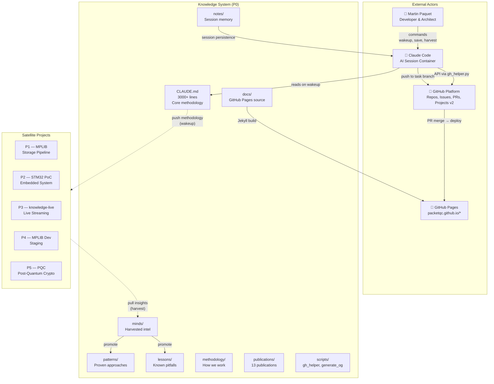

**Legend**: The core knowledge repo contains all methodology, publications, and tooling. Satellites inherit methodology on `wakeup` (push) and contribute insights back via `harvest` (pull). GitHub acts as the persistence and collaboration layer. GitHub Pages publishes the web presence. Claude Code is the execution environment — ephemeral containers that become aware via the `wakeup` protocol.

---

## 2. Knowledge Layers

The system organizes knowledge into 4 layers of decreasing stability and increasing currency. Core is the DNA — rarely changing, maximum authority. Session is the heartbeat — ephemeral, maximum currency.

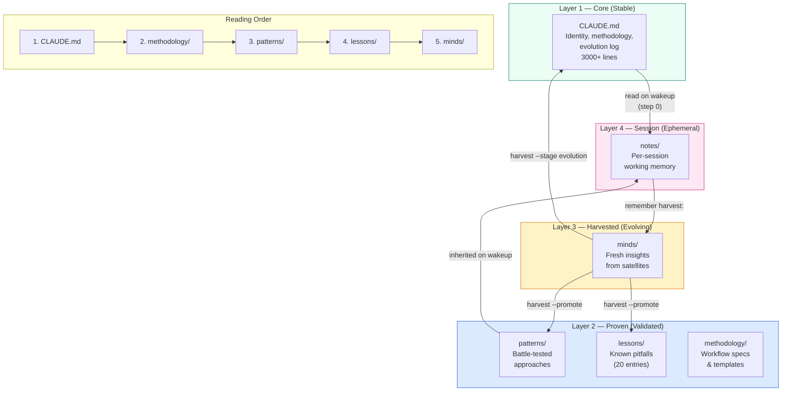

**Legend**: Knowledge flows upward (session → harvested → proven → core) through the promotion pipeline. It flows downward (core → session) through the wakeup protocol. The reading order for new Claude instances follows the stability gradient: most stable first, most current last.

---

## 3. Component Architecture

The major folders, scripts, and their relationships within the knowledge repository.

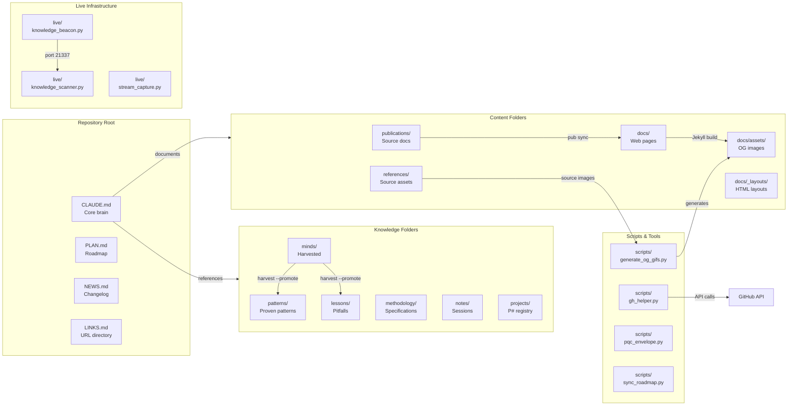

**Legend**: The repository is organized into five major groups: root files (entry points), knowledge folders (the intelligence layers), content folders (publications and web pages), scripts (automation tooling), and live infrastructure (inter-instance communication). Arrows show data flow between components.

---

## 4. Session Lifecycle

Every Claude Code session follows a deterministic lifecycle. This flowchart shows the complete path from session start to session end, including crash recovery and context loss paths.

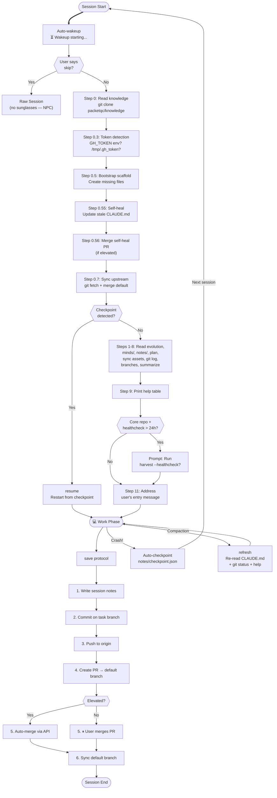

**Legend**: The session lifecycle has three phases: boot (wakeup), work, and delivery (save). Crash recovery uses checkpoints. Context loss recovery uses `refresh`. The elevated path (with token) is fully autonomous; the semi-automatic path requires one user click to merge the PR.

---

## 5. Distributed Flow — Push and Pull

The bidirectional knowledge flow between the master mind (P0) and satellite projects. Push delivers methodology outward; harvest pulls insights inward. The promotion pipeline advances insights from raw to core.

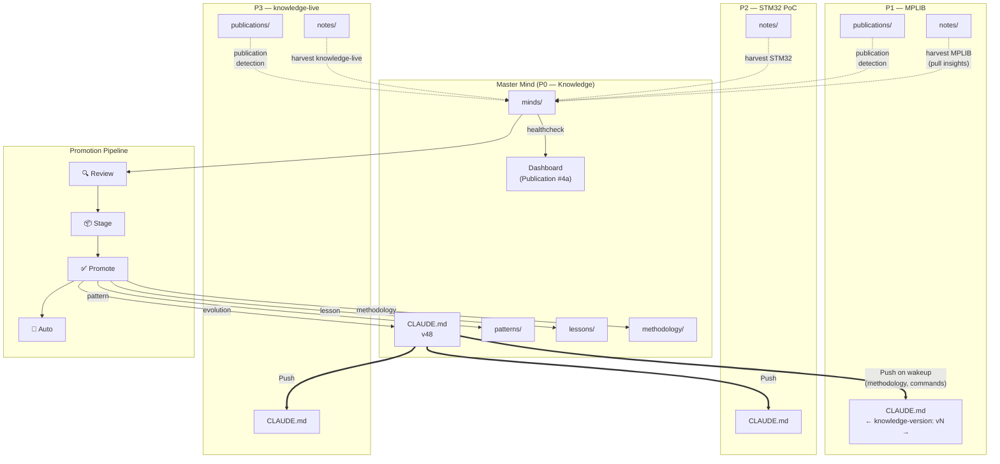

**Legend**: Thick solid arrows represent the push flow (wakeup). Dashed arrows represent the pull flow (harvest). The promotion pipeline advances insights through four stages: review (human validated), stage (typed and targeted), promote (written to core), auto (queued for next healthcheck). The dashboard is updated on every harvest.

---

## 6. Publication Pipeline

Each publication exists at three tiers: source (canonical), summary (web), and complete (web). Each tier is bilingual (EN + FR). This diagram shows the sync and review flows.

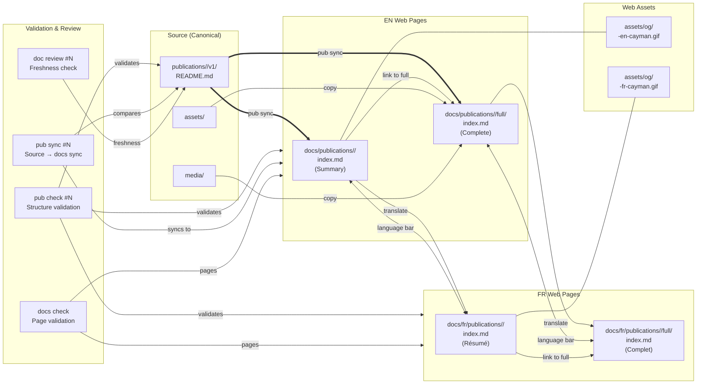

**Legend**: The source README.md is the single source of truth. `pub sync` propagates changes from source to EN web pages. Translation produces FR mirrors. Each web page links to its language mirror (EN ↔ FR) and to its depth variant (summary ↔ complete). Webcards provide animated OG social previews in both languages.

---

## 7. Security Boundaries

The proxy model governing what Claude Code sessions can and cannot do. The container proxy mediates all git operations while Python urllib bypasses it for API access.

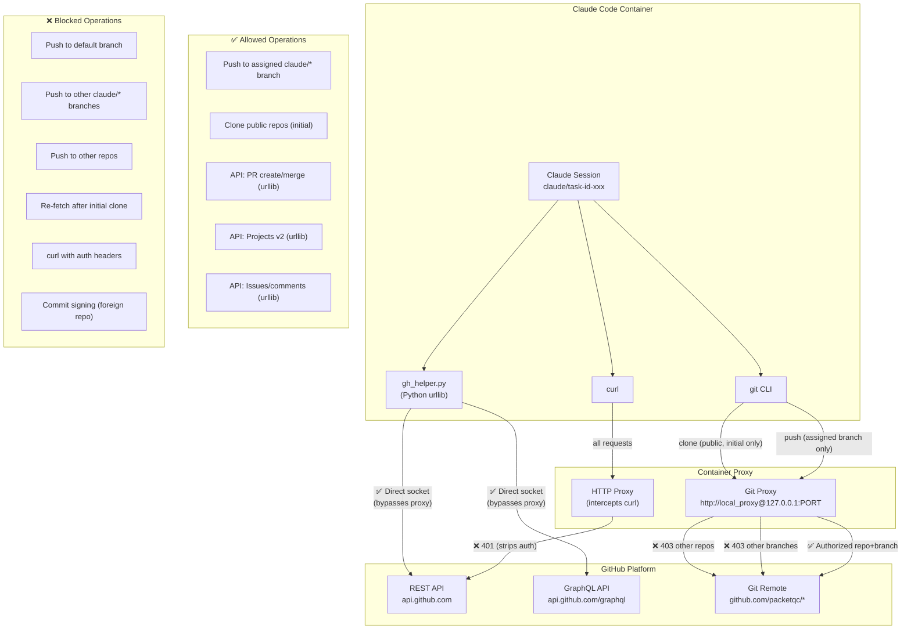

**Legend**: The container proxy is the primary security boundary. Git operations are restricted to the assigned task branch of the current repo. Python `urllib` (used by `gh_helper.py`) bypasses the proxy entirely, enabling full GitHub API access with a valid token. `curl` is intercepted by the proxy and auth headers are stripped. The two-channel model: git proxy (restricted) + urllib (unrestricted with token).

---

## 8. Deployment Tiers

The multi-tier deployment model where each satellite is simultaneously development (relative to core) and production (at its own level). Every node publishes independently via GitHub Pages.

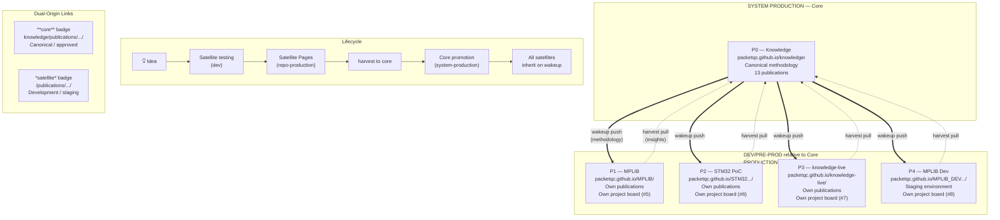

**Legend**: The deployment model is not binary (prod vs dev) but multi-tier. Core is system-production — the canonical brain. Each satellite is simultaneously development relative to core (testing ground for new capabilities) and production at its own level (independent GitHub Pages, project boards, publications). Ideas flow: satellite testing → satellite pages → harvest → core promotion → all satellites inherit.

---

## 9. Quality Dependency Graph

The 13 core qualities and how they depend on each other. Autosuffisant is the foundation — if the system depends on external services, nothing else works.

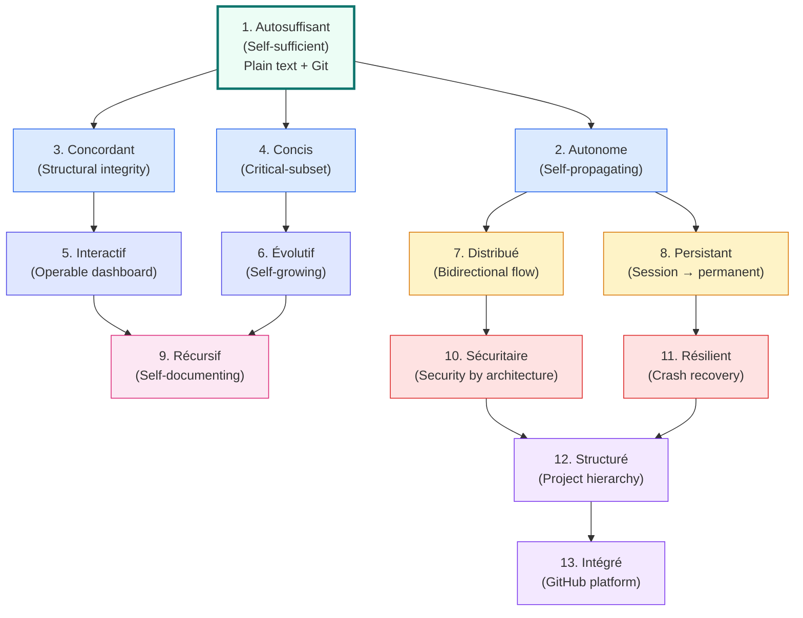

**Legend**: The dependency graph flows from foundation (autosuffisant — plain text in Git) through enabling qualities (autonome, concordant, concis) to operational qualities (interactif, evolutif) to network qualities (distribue, persistant) to meta-qualities (recursif, securitaire, resilient) to organizational qualities (structure, integre). Each quality reinforces the ones that depend on it. The reading order in CLAUDE.md follows this dependency chain.

---

## 10. Recovery Ladder

The five recovery paths, ordered from lightest to heaviest. Each path addresses a different failure mode. The system provides a matching recovery for every failure.

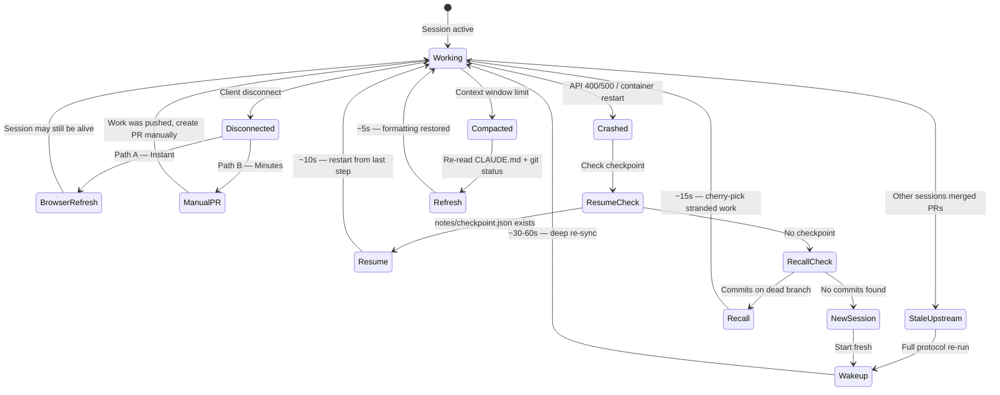

**Legend**: The recovery ladder matches failure modes to recovery paths. Client disconnect: browser refresh (instant) or manual PR (minutes). Crash with checkpoint: `resume` (~10s). Crash without checkpoint: `recover` (~15s, from git branches). Context compaction: `refresh` (~5s). Stale upstream: `wakeup` (~30-60s). Each path is the lightest possible response to its failure mode — never escalate when a lighter recovery suffices.

---

## 11. GitHub Integration

The lifecycle of GitHub entities (Issues, PRs, Project board items) within the Knowledge system. Each entity type has a well-defined lifecycle managed by `gh_helper.py`.

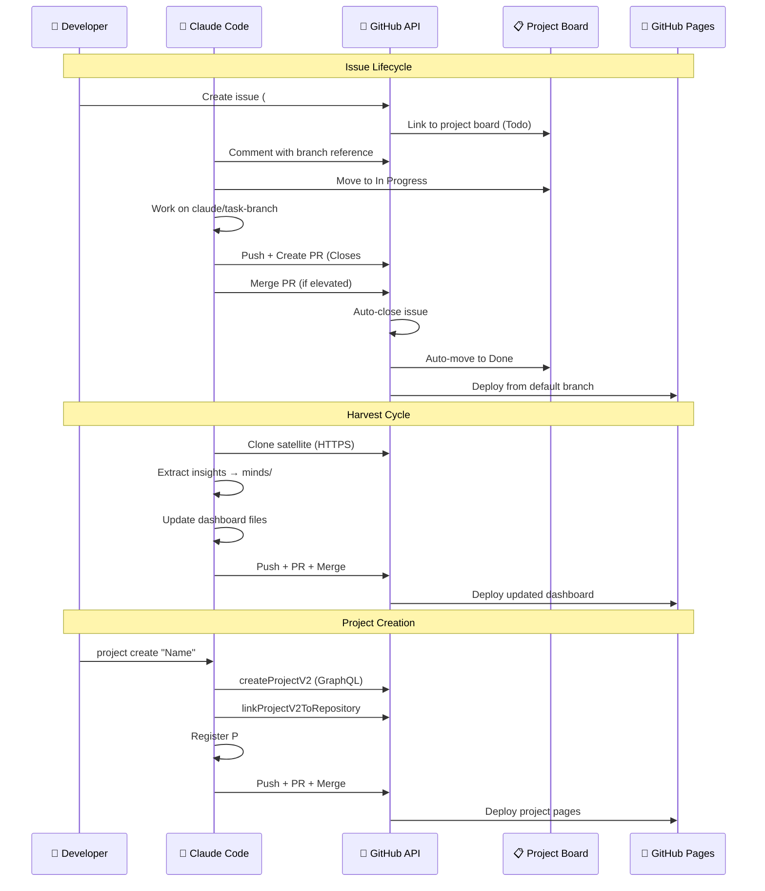

**Legend**: The sequence diagram shows three key workflows. **Issue lifecycle**: issue created → linked to board → work starts (In Progress) → PR with "Closes #N" → merge → auto-close → auto-Done. **Harvest cycle**: clone satellite → extract → update dashboard → push → deploy. **Project creation**: create board → link to repo → scaffold web presence → deploy. All API calls go through `gh_helper.py` (Python urllib), never `curl`.

---

## Related Publications

| # | Publication | Relationship |
|---|-------------|-------------|
| 0 | [Knowledge System](../knowledge-system/v1/README.md) | Parent — the system these diagrams visualize |
| 4 | [Distributed Minds](../distributed-minds/v1/README.md) | Architecture — push/pull flow documented in Diagram 5 |
| 7 | [Harvest Protocol](../harvest-protocol/v1/README.md) | Protocol — the harvest flow shown in Diagrams 5 and 11 |
| 8 | [Session Management](../session-management/v1/README.md) | Lifecycle — the session flow shown in Diagram 4 |
| 9 | [Security by Design](../security-by-design/v1/README.md) | Security — the proxy boundaries shown in Diagram 7 |
| 12 | [Project Management](../project-management/v1/README.md) | Projects — the P# hierarchy shown in Diagrams 1 and 8 |

---

*Authors: Martin Paquet & Claude (Anthropic, Opus 4.6)*
*Knowledge: [packetqc/knowledge](https://github.com/packetqc/knowledge)*
