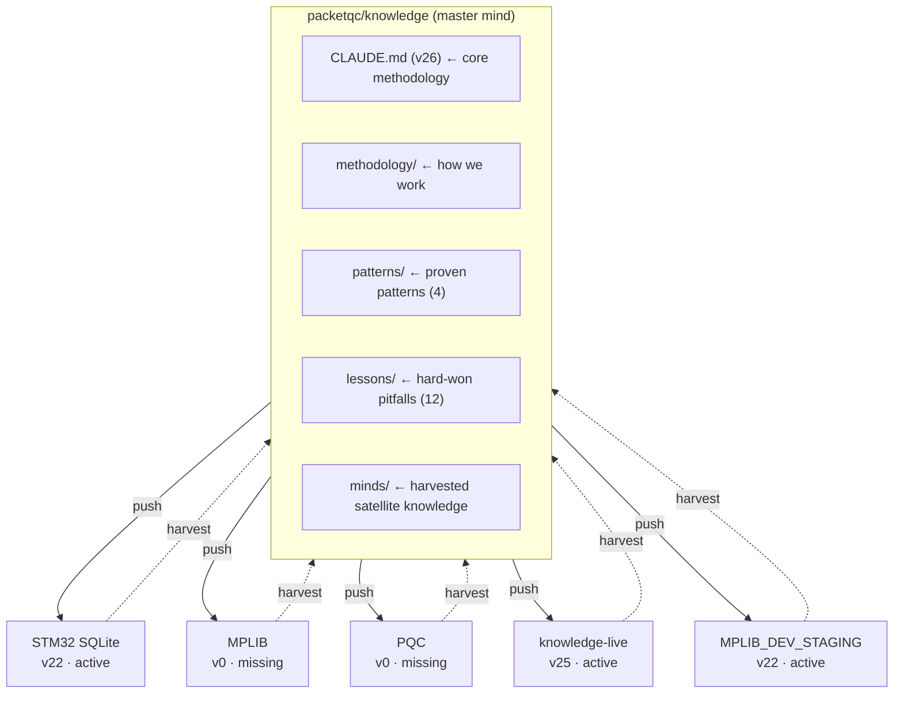
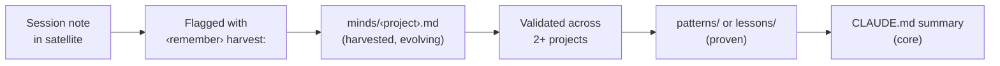

# Distributed Minds — Bidirectional Knowledge Flow for AI-Assisted Multi-Project Engineering

**Publication v1 — February 2026**
**Languages / Langues**: English (this document) | [Français](https://packetqc.github.io/knowledge/fr/publications/distributed-minds/)

---

## Authors

**Martin Paquet** — Network security analyst programmer, network and system security administrator, and embedded software designer and programmer who architected a distributed knowledge system where a central repository and satellite projects evolve together through bidirectional AI-assisted knowledge flow. The insight came from observing that AI coding assistants working independently across multiple projects kept rediscovering the same patterns and hitting the same pitfalls — intelligence was being generated but never consolidated.

**Claude** (Anthropic, Opus 4.6) — AI development partner operating across multiple satellite projects. Both a consumer and contributor of the distributed knowledge — reads the master mind on wakeup, evolves knowledge in satellites during work, and feeds discoveries back through harvest. This publication was itself produced through the methodology it describes.

---

## Abstract

AI coding assistants gain persistent memory through `CLAUDE.md` and `notes/` — but when an engineer works across multiple projects, each AI instance evolves independently. Patterns discovered in one project are invisible to another. Pitfalls hit in project A get hit again in project B. The collective intelligence is generated but never consolidated.

**Distributed Minds** solves this by treating Knowledge as a **living network** with bidirectional flow:

- **Push (outbound)**: A central knowledge repository (`packetqc/knowledge`) pushes methodology, commands, patterns, and tooling to satellite projects on every `wakeup`. This is the established "sunglasses" mechanism — giving each AI instance awareness.

- **Harvest (inbound)**: A new `harvest` command crawls satellite projects across all branches, extracts evolved knowledge, detects version drift, inventories knowledge distribution status, and discovers publications. The extracted insights are staged in a `minds/` incubator layer before promotion to core knowledge.

The result is a **self-healing, version-aware, distributed intelligence network** where satellite projects are experiments and the master mind grows from all of them.

**By design**, the system only operates on repositories that the user owns and that Claude Code has been granted access to via its GitHub application configuration. No external or third-party repositories are ever accessed — the distributed intelligence network is scoped exclusively to the user's own project ecosystem. This is a deliberate security and privacy boundary.

The `#` call alias convention (v26) adds **location-independent routing** — `#N:` scopes any note to a publication/project regardless of which repo the user is working in. Combined with implicit main project per repo and multi-satellite convergence, the same project can be documented from any satellite, and harvest unifies all `#N:` notes into the central consciousness.

This publication documents the architecture, the harvest protocol, the versioning system, the `#` call alias routing, and the first real harvest results across 15 repositories spanning 30 years of engineering work.

---

## Fork & Clone Safety

This repository is public and designed to be forked. The distributed minds architecture is **owner-scoped** — all bidirectional flow is confined to the repository owner's environment:

- **No credentials or tokens** are stored anywhere — no API keys, no GitHub tokens, no secrets in files or git history
- **Push access** is proxy-scoped per session — a forker's Claude Code pushes only to their own fork, never to the original repo
- **Harvest URLs** reference the original owner's satellites (`packetqc/<repo>`) — read-only for a forker. The harvest command cannot access repos it has no grants for
- **`minds/` content** describes the original owner's satellite network — meaningless in a fork, starts fresh for a new owner
- **Session notes** are per-session and ephemeral — blank for every new user

What you get by forking: **the bidirectional flow architecture, harvest protocol, promotion workflow, and dashboard template** — all intentionally public. To build your own distributed mind network, replace `packetqc` with your GitHub username in CLAUDE.md.

---

## The Problem: Scattered Intelligence

When an engineer works across multiple projects with AI assistance, intelligence is generated in every project:

| Project | What the AI learned |
|---------|---------------------|
| STM32N6570-DK_SQLITE | Page cache sizing prevents 81% throughput collapse |
| MPLIB | Multi-RTOS abstraction works with preprocessor guards |
| PQC | WolfSSL is the production PQC library for STM32, not liboqs |

But each AI instance is born fresh. Without consolidation:
- The SQLite cache insight stays locked in the SQLite project's session history
- The RTOS abstraction is invisible to the SQLite project
- The PQC library choice has to be rediscovered in every new STM32 project

**The knowledge is there. It's just scattered.**

---

## The Solution: Bidirectional Flow



### Push: The Sunglasses Moment

On `wakeup`, every satellite project reads `packetqc/knowledge` CLAUDE.md first. This gives the AI instance:
- The full methodology (how to work with the developer)
- All proven patterns (embedded debugging, RTOS, SQLite, UI/backend)
- All known pitfalls (12 documented failure modes)
- All commands (session management, live analysis, harvest)
- The evolution history (what Knowledge itself has learned)

This is the **outbound push** — established since v3 of Knowledge.

### Harvest: The Reverse Flow

The `harvest` command is the **inbound pull** — new since v9. It:

1. **Crawls all branches** of a satellite repo
2. **Tracks what was seen** using per-branch commit SHA cursors (incremental — only new commits on subsequent runs)
3. **Checks knowledge version** via `<!-- knowledge-version: vN -->` tag in satellite CLAUDE.md
4. **Inventories distribution** — is the satellite bootstrapped? Has notes/? Has live/?
5. **Extracts knowledge** — patterns, pitfalls, methodology, Claude instructions
6. **Detects publications** — finds technical content worth surfacing on the core website
7. **Updates the dashboard** — refreshes the living status publication
8. **Reports drift** — which features the satellite is missing

---

## Knowledge Layers

The system has four stability layers:

| Layer | Location | Stability | Lifecycle |
|-------|----------|-----------|-----------|
| **Core** | `CLAUDE.md` | Stable | Rarely changes. Identity, methodology, evolution log. |
| **Proven** | `patterns/`, `lessons/`, `methodology/` | Validated | Grows when insights are promoted from minds/. |
| **Harvested** | `minds/` | Evolving | Fresh from satellite experiments. The incubator. |
| **Session** | `notes/` | Ephemeral | Per-session working memory. Rewritten daily. |

### The Insight Lifecycle



Each layer is a **filter**: session notes are raw, minds/ is curated per-project, proven/ is validated cross-project, core is the permanent record.

---

## The `#` Call Alias — Location-Independent Knowledge Routing

The `#` prefix at the beginning of a prompt is a **call alias** — it triggers scoped knowledge input mode. `#N:` routes content to publication/project N regardless of which repo the user is working in.

### How It Works

| Input | Routing | Example |
|-------|---------|---------|
| `#N: content` | Explicitly scoped to project N | `#7: fix command should prepare locally` |
| `#N:methodology:<topic>` | Methodology insight — flagged for harvest | `#7:methodology:incremental-cursors` |
| `#N:principle:<topic>` | Design principle — flagged for harvest | `#4:principle:pull-based` |
| `#0: raw dump` | Raw input — Claude classifies | `#0: whatever I have right now` |
| No `#`, in a repo | Implicit main project | Working in knowledge → implicit `#0:` |

### Multi-Satellite Convergence

**`#N:` is the routing key, not the repo.** An insight about #7 (Harvest Protocol) can be discovered while working in any satellite — the note goes to #7 regardless of origin. Harvest pulls all `#N:` notes into `minds/`, promotion delivers them to core.

```
Satellite A ──→ harvest ──→ minds/ ──→ promotion ──→ core knowledge
Satellite B ──→ harvest ──↗
Satellite C ──→ harvest ──↗
Core direct ──────────────────────────→ notes/ ──→ core knowledge
```

### Implicit Main Project

Every repo has a main project — unscoped input goes there:

| Repo | Main project | Implicit `#` |
|------|-------------|--------------|
| `packetqc/knowledge` | #0 Knowledge System | `#0:` |
| `packetqc/STM32N6570-DK_SQLITE` | #1 MPLIB Storage Pipeline | `#1:` |
| Documentation satellites | Context-dependent (multi-project) | First or declared |

This convention eliminates friction: the user feeds raw intelligence, Claude routes and classifies it. The distributed mind now has a **1-character invocation** for scoped knowledge input from any node in the network.

---

## Knowledge Versioning

Every entry in the Knowledge Evolution table carries a version number:

| Version | Feature | Date |
|---------|---------|------|
| v1 | Session persistence | 2026-02-16 |
| v2 | Free Guy analogy | 2026-02-16 |
| v3 | Portable bootstrap | 2026-02-17 |
| v4 | Multipart help | 2026-02-17 |
| v5 | Step 0: sunglasses first | 2026-02-17 |
| v6 | Chicken-and-egg bootstrap | 2026-02-17 |
| v7 | Normalize command | 2026-02-17 |
| v8 | Profile hub | 2026-02-17 |
| v9 | Distributed minds | 2026-02-18 |
| v10 | Knowledge versioning | 2026-02-18 |
| v11 | Interactive promotion + healthcheck | 2026-02-18 |
| v12 | Knowledge branch protocol | 2026-02-19 |
| v13 | Public HTTPS repo access | 2026-02-19 |
| v14 | `claude/knowledge` replaces `knowledge` | 2026-02-19 |
| v15 | End-to-end protocol validation | 2026-02-19 |
| v16 | Save merge protocol + cross-repo discovery | 2026-02-19 |
| v17 | Proxy reality — semi-automatic protocol | 2026-02-19 |
| v18 | `main` replaces `claude/knowledge` | 2026-02-19 |
| v19 | Todo list must mirror full save protocol | 2026-02-19 |
| v20 | Semi-automatic delivery documentation + admin routine | 2026-02-19 |
| v21 | Access scope — user-owned repos only | 2026-02-19 |
| v22 | Dual-theme webcards (Cayman + Midnight) | 2026-02-19 |
| v23 | Live knowledge network + bootstrap scaffold | 2026-02-20 |
| v24 | `refresh` command + dashboard rename | 2026-02-20 |
| v25 | Core Qualities + iterative staging | 2026-02-20 |
| v26 | `#` call alias + scoped project notes + daltonism themes | 2026-02-20 |
| v27 | Ephemeral token protocol + PQC envelope crypto | 2026-02-21 |
| v28 | Proxy deep mapping + two-channel model (git proxy vs REST API) | 2026-02-21 |

**28 versions in 6 days.** v12–v17 trace the discovery of the proxy limitation. v18–v20 document the resulting semi-automatic architecture. v21–v25 add security boundaries, visual adaptation, live networking, lightweight recovery, and the system's 10 core principles. v26 adds location-independent knowledge routing with the `#` call alias convention. v27 introduces ephemeral token protocol with PQC-secured exchange. v28 maps every proxy boundary layer and discovers the two-channel model: git proxy (restricted) vs REST API (unrestricted with token).

Satellites track which version they know about via an HTML comment:
```markdown
<!-- knowledge-version: v25 -->
```

**Drift** = the gap between satellite version and core version. A satellite at v0 (no tag) is completely unaware. A satellite at v25 is current.

`harvest --fix` updates the satellite's tag and bootstrap section. The actual knowledge flows at wakeup — the tag just tracks awareness.

---

## First Harvest: Real Results

The first harvest crawled **15 repositories** spanning 30 years of engineering. Three key satellites were analyzed in depth:

### Network Overview

| Satellite | Language | Branches | Last Activity | Version | Drift | Bootstrap | Sessions | Publications |
|-----------|----------|----------|---------------|---------|-------|-----------|----------|--------------|
| **knowledge** (self) | Python | 4+ | 2026-02-20 | v25 | 0 | core | 9+ | 12 |
| **knowledge-live** | Python | 2 | 2026-02-20 | v25 | 0 | active | 1 | 0 |
| **STM32N6570-DK_SQLITE** | C | 2 | 2026-02-20 | v22 | 3 | active | 2 | 1 (doc/) |
| **MPLIB_DEV_STAGING** | C | 2 | 2026-02-20 | v22 | 3 | active | 1 | 0 |
| **MPLIB** | C | 1 (main) | 2025-11-19 | v0 | 25 | missing | 0 | 0 |
| **PQC** | docs only | 1 (master) | 2025-09-18 | v0 | 25 | missing | 0 | 0 |

12 additional repos (Arduino, Cisco, Java, 3D graphics, etc.) have no knowledge infrastructure and minimal harvestable content for current projects.

### Harvested: 12 Promotion Candidates

**From STM32N6570-DK_SQLITE** (3):
1. Page cache sizing degradation (81% throughput collapse)
2. Printf latency in hot path (1-5 ms per call)
3. Slot size vs page size mismatch (memsys5)

**From MPLIB** (3):
1. Multi-RTOS abstraction (FreeRTOS/ThreadX with preprocessor guards)
2. CubeMX N6570-DK limitation (cannot create project from CubeMX)
3. TouchGFX MVP with backend services (extends UI/backend pattern)

**From PQC** (6):
1. ML-KEM/ML-DSA sizing reference (memory budgeting for embedded)
2. PQC library compliance matrix (WolfSSL = production, liboqs = dev only)
3. Flash certificate storage pattern (linker section + xxd pipeline)
4. ML-KEM/ML-DSA key sizing for constrained devices (RAM/flash budgets)
5. PQC library compliance for FIPS 203/204 (certification path)
6. Flash-resident certificate storage (linker section + xxd generation pipeline)

### Key Finding: Partial Bootstrap — Network Growing

Two of five satellites (**STM32N6570-DK_SQLITE** and **MPLIB_DEV_STAGING**) are now bootstrapped at v22, with active sessions and knowledge infrastructure deployed. A third satellite (**knowledge-live**) is fully current at v25. Two satellites (**MPLIB** and **PQC**) remain at v0 — completely unaware of Knowledge, created before the bootstrap mechanism was established.

The network has gone from **100% drift** (all satellites unaware) to **60% bootstrapped** (3 of 5 active). `harvest --fix` continues to close the gap: remaining satellites will get their CLAUDE.md bootstrap section on next remediation pass.

---

## Interactive Promotion Workflow

Harvested insights don't just sit in `minds/` — they advance through a 4-stage pipeline driven from the dashboard:

### Severity Icons

The satellite inventory table uses visual indicators for instant health assessment:

| <span id="severity-icons">Icon</span> | Severity | Applied to |
|------|----------|------------|
| 🟢 | **Current / Healthy** | Drift (0), Bootstrap (active), Sessions (1+), Live (deployed), Health (reachable) |
| 🟡 | **Minor drift** | Drift (1-3), Health (stale) |
| 🟠 | **Moderate drift** | Drift (4-7) |
| 🔴 | **Critical / Missing** | Drift (8+), Bootstrap (missing), Live (missing), Health (unreachable) |
| ⚪ | **Inactive** | Sessions (0), Health (pending) |

### Promotion Actions

Each promotion candidate in the dashboard carries 4 action commands:

| Stage | <span id="promotion-icons">Icon</span> | Command | Effect |
|-------|------|---------|--------|
| Review | 🔍 | `harvest --review N` | Human validates — marks as reviewed |
| Stage | 📦 | `harvest --stage N <type>` | Staged for integration (lesson, pattern, methodology, docs) |
| Promote | ✅ | `harvest --promote N` | Written to core `patterns/` or `lessons/` now |
| Auto | 🔄 | `harvest --auto N` | Queued for auto-promote on next healthcheck |

On GitHub Pages, clicking an action icon copies the command to clipboard. The user pastes it into Claude Code to execute. This makes the dashboard an **interactive control panel** for the knowledge pipeline.

### Healthcheck

`harvest --healthcheck` sweeps all known satellites in a single pass:
1. Crawls each satellite (incremental)
2. Updates severity icons in the dashboard
3. Processes the auto-promote queue
4. Reports network summary

Triggered on-demand, or auto-suggested on `wakeup` when `packetqc/knowledge` is the active project and last healthcheck > 24h ago.

---

## The Dashboard

This publication includes a **living sub-child document**: the [Distributed Knowledge Dashboard](../distributed-knowledge-dashboard/v1/README.md).

The dashboard is updated on every `harvest` run with:
- Satellite inventory with severity icons (🟢🟡🟠🔴⚪) — **first section**, visible at a glance
- Promotion candidates with 4-action workflow (review/stage/promote/auto)
- Master mind status (current version, feature count)
- Discovered publications

It is the network's **interactive self-awareness** — both a view and a control panel for the distributed intelligence.

---

## Branch Protocol & Semi-Automatic Delivery

### The Proxy Reality

Claude Code — whether the desktop app, VS Code extension, or web interface — runs behind a **git proxy**. This proxy is a security boundary:

- It holds the real GitHub authentication token (never exposed to the sandbox)
- It grants push access to **one branch only**: the exact `claude/<task-id>` assigned to the session
- Pushing to any other branch — including `main` — returns **HTTP 403**
- This is **intentional and documented** in Claude Code's official security documentation

This was discovered empirically through v12–v17 of the knowledge evolution:

| Version | What was believed | What was true |
|---------|-------------------|---------------|
| v12–v15 | Claude Code can push to any `claude/*` branch autonomously | Only the assigned task branch |
| v16 | Within-repo merge to a shared branch would work | 403 on any non-assigned branch |
| v17 | Discovered: the proxy is per-branch AND per-repo scoped | Confirmed across all environments |

**Official documentation** ([code.claude.com/docs/en/security](https://code.claude.com/docs/en/security)):
> "Branch restrictions: Git push operations are restricted to the current working branch"

**Key GitHub issues**:
- [#22636](https://github.com/anthropics/claude-code/issues/22636) — Push to main blocked even with explicit approval (open, stale)
- [#11153](https://github.com/anthropics/claude-code/issues/11153) — 403 errors on push (closed NOT_PLANNED — intentional)
- [#10018](https://github.com/anthropics/claude-code/issues/10018) — Start from non-default branch (open, 70+ upvotes)

### Why Semi-Automatic

Since Claude Code cannot push directly to `main`, every delivery goes through a **pull request**:

```
Claude (autonomous)              User (one click)
─────────────────                ────────────────
1. Work on task branch
2. Commit changes
3. Push to task branch
4. Create PR → main
                                 5. Review & approve PR
                                 6. Merge lands on main
                                 7. GitHub Pages auto-deploys
```

Claude does **95% of the work** autonomously. The user provides **one approval click** — the security gate that crosses the sandbox boundary.

### Branch Roles

Only two branch types exist:

| Branch | Role | Who writes | How |
|--------|------|------------|-----|
| `main` | **Convergence point** — all work accumulates here | PR merges (user-approved) | Semi-automatic |
| `claude/<task-id>` | **Task branches** — per-session, ephemeral | Claude Code (proxy-authorized push) | Automatic |

No intermediate protocol branches. The default branch (`main`, `master`, or any custom name — detected with `git remote show origin | grep 'HEAD branch'`) is the single source of truth. GitHub Pages publishes from it. `harvest` reads from it. PRs target it.

### What Claude Code CAN and CANNOT Do

| Action | Allowed | Mechanism |
|--------|---------|-----------|
| Push to assigned task branch | Yes | Proxy-authorized |
| Create PRs targeting any branch | Yes | `gh pr create` |
| Read any branch (fetch/clone) | Yes | Public HTTPS |
| Push to `main` | **No** | 403 — proxy blocks |
| Push to other `claude/*` branches | **No** | 403 — scoped to assigned only |
| Push to branches in other repos | **No** | 403 — per-repo scoped |
| GitHub REST API (with token) | **Yes** | Direct to api.github.com — bypasses proxy |

### The Two-Channel Model (v28)

Empirical testing (MPLIB deployment from knowledge session) revealed a critical architectural detail: **git operations and API operations use different channels**.

| Channel | Route | Auth | Cross-repo |
|---------|-------|------|------------|
| **Git** | Local proxy (`127.0.0.1:<port>`) | Proxy-managed, per-repo | ❌ Blocked |
| **API** | Direct to `api.github.com` | Token-authenticated (ephemeral) | ✅ Unrestricted |

**What this means in practice**:
- **Without token**: each satellite needs its own Claude Code session for deployment (git-only)
- **With token**: a single knowledge session can orchestrate the entire network via API — create PRs, merge them, manage branches on any repo the token has access to

The git proxy is the sandbox boundary. The REST API is the escape hatch — but only when the user provides a valid token (ephemeral, session-scoped, never persisted).

**Proxy boundary deep map** (every layer tested):

| Layer | Cross-repo | Error |
|-------|-----------|-------|
| `git clone` (initial) | ✅ Works | — |
| `git fetch` (re-read) | ❌ Blocked | "No such device or address" |
| `git push` (token in URL) | ❌ Blocked | "No such device or address" |
| `git push` (token in header) | ❌ Blocked | "No such device or address" |
| `git push` (via local proxy) | ❌ 502 | "repository not authorized" |
| Commit signing | ❌ Blocked | 400 "source: Field required" |
| `curl api.github.com` (token) | ✅ Full access | — |

### Admin Quick Routine — Managing Claude Code PRs

This is the simple routine for the project administrator (you) to manage the semi-automatic workflow:

#### Daily PR Review (2-3 minutes)

```
Step 1 — Open GitHub notifications or repo PR list
         https://github.com/packetqc/<repo>/pulls

Step 2 — For each open PR from claude/* branches:
         • Read the PR title and summary (Claude writes these)
         • Check the diff tab for changes
         • If good → click "Merge pull request" → "Confirm merge"
         • If needs work → comment on the PR and address in next session

Step 3 — Delete merged branches (GitHub offers this automatically)
```

#### Batch Merge (when multiple PRs accumulate)

```
# Review all open PRs at once
gh pr list --state open

# Quick-merge a specific PR
gh pr merge <PR-number> --merge --delete-branch

# Quick-merge all Claude PRs (review first!)
gh pr list --state open --author @me --json number \
  | jq '.[].number' \
  | xargs -I {} gh pr merge {} --merge --delete-branch
```

#### Conflict Resolution

When two Claude sessions modify the same file:
1. Merge the first PR normally
2. The second PR shows a conflict
3. Either:
   - Resolve in GitHub's web editor (simple conflicts)
   - Checkout locally: `git checkout claude/<branch> && git merge main` and fix
   - Start a new Claude session and say "resolve the conflicts on this branch"

#### Monitoring the Network

```
# See all active Claude branches
git branch -r | grep claude/

# See PRs waiting for review
gh pr list --state open

# See recently merged PRs
gh pr list --state merged --limit 10
```

#### Tips

- **Merge often**: Don't let PRs accumulate. Each PR is small and focused.
- **Delete branches after merge**: Keeps the repo clean. GitHub offers this on merge.
- **One session = one PR**: Each Claude Code session creates one task branch and one PR.
- **PR titles tell the story**: Claude writes descriptive titles — scan them to understand what happened.
- **Save protocol = PR creation**: Every `save` command ends with a PR. If there's no PR, the work is stranded.

---

## Architecture Principles

### 1. Satellites are experiments, core is the record

Projects come and go. Some are active for months, others for days. The knowledge they generate should outlive the project. `minds/` captures it; promotion crystallizes it.

### 2. Version tracks awareness, not content

A satellite at v10 doesn't contain all v10 features locally. It just knows where to read them. The actual knowledge flows at wakeup via the core CLAUDE.md. The version tag prevents stale pointers.

### 3. Harvest is incremental

Branch cursors (commit SHAs) mean the second harvest of a project only scans new commits. A repo with 1,000 commits that was harvested yesterday only needs to scan today's changes.

### 4. Publications stay in their source

When harvest detects a publication in a satellite, it copies the **reference** (title, path, summary), not the content. The original stays in the satellite. The core can then create a web page that links to or mirrors it.

### 5. Promotion requires cross-project validation

An insight in `minds/` is a hypothesis. When the same pattern appears in 2+ projects, it's validated. Only then does it graduate to `patterns/` or `lessons/`.

### 6. Access scope — user-owned repos only

The system only operates on repositories that the user owns and that Claude Code has been granted access to via its GitHub application configuration. No external or third-party repositories are ever accessed. This is a deliberate security and privacy boundary.

---

## Core Principles in Publication #4

Knowledge embodies 10 core qualities. Publication #4 primarily manifests three:

| Principle | How #4 embodies it |
|-----------|-------------------|
| **Distributed** | The entire architecture — push/harvest bidirectional flow between master and satellites — is distribution by design. Intelligence flows outward on wakeup, inward on harvest. |
| **Evolutionary** | 25 versions in 5 days. The knowledge versioning system, drift detection, and promotion pipeline ensure the network evolves continuously. Each harvest grows the master mind. |
| **Recursive** | The system documents itself by consuming its own output. This publication was harvested from the very methodology it describes. The dashboard updates itself on every harvest run. |
| **Concise** | The `#` call alias convention — 1 character to invoke, 3 characters to scope (`#N:`), 0 characters for implicit main project. Maximum signal, minimum friction. See [Publication #0 — The `#` Call Alias Convention](../knowledge-system/v1/README.md#the--call-alias-convention). |

The remaining 6 qualities (*self-sufficient*, *autonomous*, *concordant*, *interactive*, *persistent*, *secure*) are present throughout — but *distributed*, *evolutionary*, and *recursive* are the DNA of Distributed Minds.

---

## Related Publications

| # | Publication | Relationship |
|---|-------------|-------------|
| 0 | [Knowledge](../knowledge-system/v1/README.md) | Master publication — the system this architecture serves |
| 1 | [MPLIB Storage Pipeline](../mplib-storage-pipeline/v1/README.md) | First satellite — source of embedded patterns now in core |
| 2 | [Live Session Analysis](../live-session-analysis/v1/README.md) | Live tooling synced outbound from core to satellites |
| 3 | [AI Session Persistence](../ai-session-persistence/v1/README.md) | Foundation — the session memory that makes harvest possible |
| 4a | [Knowledge Dashboard](../distributed-knowledge-dashboard/v1/README.md) | Living sub-child — real-time network status |
| 5 | [Webcards & Social Sharing](../webcards-social-sharing/v1/README.md) | Visual identity — dual-theme animated previews for the network |
| 6 | [Normalize & Structure Concordance](../normalize-structure-concordance/v1/README.md) | Self-healing — structural integrity enforcement across docs |
| 7 | [Harvest Protocol](../harvest-protocol/v1/README.md) | Practical companion — the harvest command specification |
| 8 | [Session Management](../session-management/v1/README.md) | Practical companion — wakeup/save/refresh lifecycle |
| 9 | [Security by Design](../security-by-design/v1/README.md) | Security architecture — access scope, fork safety, proxy model |
| 10 | [Live Knowledge Network](../live-knowledge-network/v1/README.md) | Next evolution — PQC-secured inter-instance communication |

---

*Authors: Martin Paquet (packetqcca@gmail.com) & Claude (Anthropic, Opus 4.6)*
*Knowledge: [packetqc/knowledge](https://github.com/packetqc/knowledge)*
