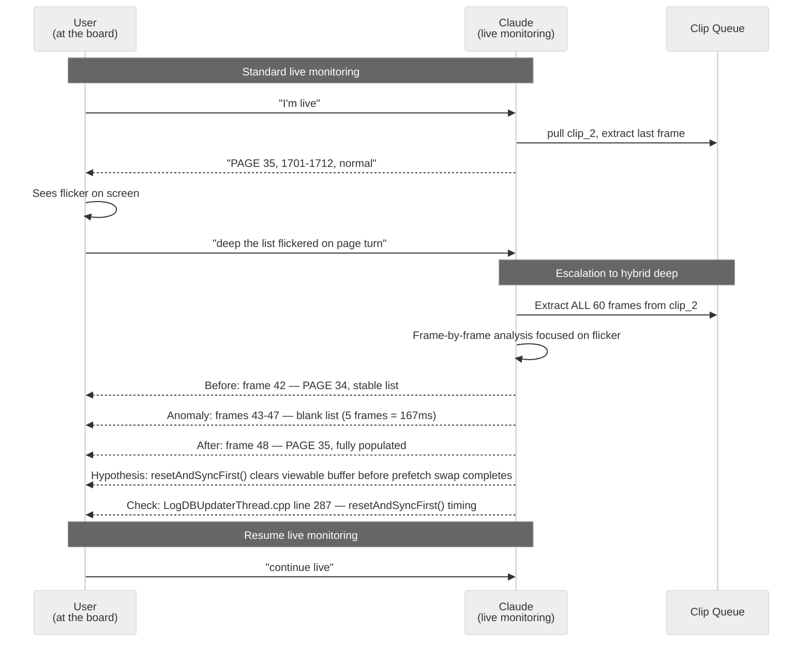

# Live Session Analysis — AI-Assisted Real-Time Debugging and QA for Embedded Systems

**Publication v1 — February 2026**
**Languages / Langues**: English (this document) | [Français](https://packetqc.github.io/knowledge/fr/publications/live-session-analysis/)

---

## Authors

**Martin Paquet** — Network security analyst programmer, network and system security administrator, and embedded software designer and programmer. Specializing in RTOS architectures, hardware security (SAES/ECC), and high-throughput data pipelines on ARM Cortex-M platforms. Over a decade of experience building production firmware for safety-critical and industrial embedded systems. Architect of the MPLIB module library — a personal framework of reusable, singleton-patterned embedded modules spanning storage, security, configuration, and communication. Known for unconventional but measurably effective development methodologies, including AI-augmented engineering workflows that achieve 3x development speed compression while maintaining engineering rigor. Based in Quebec, Canada.

**Claude** (Anthropic, Opus 4.6) — AI coding assistant operating as a multimodal analysis engine within the Claude Code CLI. In this collaboration, Claude serves as a real-time visual analyst: extracting UI state, UART traces, and timing data from video frames of a running embedded system. Claude also acts as an autonomous diagnostics agent — adding printf traces, performing code audits, and maintaining cross-session knowledge through structured persistence files. The collaboration model positions the AI not as a replacement for engineering judgment, but as an amplifier that handles continuous monitoring, pattern recognition, and forensic investigation while the engineer focuses on architectural decisions and board-level interaction.

---

## Abstract

This publication documents a **live session analysis mechanism** developed for real-time debugging and quality assurance of embedded systems. The mechanism captures the screen output of a running development board (STM32N6570-DK, Cortex-M55 @ 800 MHz) via RTSP streaming, encodes rolling H.264 clips, and delivers them through Git to an AI agent that performs multimodal frame analysis.

What makes this approach distinctive is not just the capture pipeline — it is the **interactive debugging workflow** built on top of it. The engineer drives the board in real time while the AI continuously monitors visual output, reports state changes, detects anomalies, and escalates to frame-by-frame forensic analysis when something unexpected appears. This creates a **live coding troubleshooting loop** with ~6 second latency from board state change to AI feedback.

The mechanism was developed organically during active firmware development — not designed in isolation. Every feature was born from a real debugging need during live sessions. This publication captures both the mechanism itself and the methodology of using it for production-quality embedded development.

---

## How It Started

During a live debugging session, the developer was testing config persistence across power cycles on the STM32N6570-DK. The sequence: set navigation state (PAUSE, REVERSE, page 1) → reboot the board → verify state persisted.

The problem was subtle. After reboot, the UI *looked* correct for a fraction of a second, then silently reverted to default values. A breakpoint debugger would have disrupted the RTOS timing that caused the bug. UART traces showed the config loaded successfully — but something downstream overwrote it.

The developer had been sharing screenshots of the board's display throughout the session. The idea was simple: **what if the AI could watch the board continuously instead of looking at static screenshots?**

That question led to the capture pipeline. Within hours, the first version was running. Within a day, it had found and fixed two timing-dependent bugs that would have taken weeks to track down through traditional methods.

---

## The Mechanism

### Capture Pipeline

```mermaid
%%{init: {'theme': 'neutral', 'themeVariables': {'fontSize': '14px'}}}%%
flowchart LR
    subgraph BOARD["STM32N6570-DK"]
        direction TB
        UI["TouchGFX Display"]
        UART["UART Terminal"]
    end

    subgraph CAPTURE["Windows + WSL2"]
        direction TB
        OBS["OBS Studio<br/>RTSP :8554"]
        PY["stream_capture.py<br/>Python + OpenCV"]
        ENC["FFmpeg H.264<br/>CRF 22 / 0.75x"]
        OBS --> PY --> ENC
    end

    subgraph GIT["Git Transport"]
        direction TB
        PUSH["Auto-push<br/>every 5 seconds"]
        QUEUE["Rolling Queue<br/>clip_0 → clip_1 → clip_2"]
        PUSH --> QUEUE
    end

    subgraph CLAUDE["Claude Code AI"]
        direction TB
        PULL["git pull"]
        FFMPEG["ffmpeg extract"]
        VISION["Multimodal Read"]
        REPORT["State Report"]
        PULL --> FFMPEG --> VISION --> REPORT
    end

    UI -- "HDMI" --> OBS
    UART -- "USB" --> OBS
    ENC --> PUSH
    QUEUE --> PULL

    classDef boardStyle fill:#2563eb,stroke:#1e40af,color:#fff
    classDef captureStyle fill:#7c3aed,stroke:#5b21b6,color:#fff
    classDef gitStyle fill:#d97706,stroke:#b45309,color:#fff
    classDef claudeStyle fill:#059669,stroke:#047857,color:#fff

    class UI,UART boardStyle
    class OBS,PY,ENC captureStyle
    class PUSH,QUEUE gitStyle
    class PULL,FFMPEG,VISION,REPORT claudeStyle
```



**End-to-end latency: ~5–8 seconds** from board state change to AI report.

| Segment | Duration |
|---------|----------|
| Board → OBS (HDMI) | ~16 ms |
| OBS → RTSP stream | ~50 ms |
| RTSP → H.264 encode (2s clip) | ~2,000 ms |
| Git push to remote | ~1,500 ms |
| AI pull + extract + analyze | ~3,000 ms |

This is fast enough for interactive debugging. The engineer performs an action on the board, and within seconds the AI reports what it sees.

### The Rolling Clip Queue

The capture script maintains a rolling queue of 3 clips (~1 MB total):

```
live/dynamic/
  clip_0.mp4    # Oldest
  clip_1.mp4    # Middle
  clip_2.mp4    # Newest ← AI reads this first
```

Git auto-pushes every 5 seconds. Each push overwrites the oldest clip. The AI always reads `clip_2` (newest) first, falling back to `clip_1` → `clip_0` if needed.

Clips persist after the script exits (for post-session video montage or review). They are cleaned at the next script start.

---

## How We Use It: The Live Debugging Workflow

### Standard Live Session

The typical workflow during active development:

```
User:"I'm live"
Claude:  [pulls clip_2, extracts last frame]
Claude:  "PAGE 35, entries 1701-1712, PLAY mode, FORWARD direction.
          Log count: 1712. All normal."

User:[changes a setting on the board]

User:"check again"
Claude:  [pulls latest clip_2]
Claude:  "PAUSE mode now active. REVERSE ON. PAGE 1, entries 12-1 descending.
          Config toggle visible in button states."

User:[reboots the board]

User:"compare post-reboot"
Claude:  [pulls clip_2]
Claude:  "Post-reboot: FORWARD direction, PAGE 42, entries ascending.
          ⚠ Pre-reboot state was REVERSE/PAGE 1 — config did NOT persist.
          The buttons reverted to defaults."
```

This is **live coding troubleshooting**. The AI is watching the board while the user interacts with it. The feedback loop is continuous — no need to stop, take a screenshot, upload it, wait for analysis. The pipeline handles all of that automatically.

### Live Code Modification

During live sessions, the AI doesn't just observe — it modifies code based on what it sees:

```
Claude:  "UART shows config_loaded=true at t+2.3s, but UI buttons already
          set at t+0.5s. Race condition: initialize() runs before config load.
          Adding a one-shot config_applied flag to refreshList()..."

Claude:  [edits ListViewLogsStored.cpp, adds config_applied logic]
Claude:  [commits: 'fix: re-apply persisted config to buttons after SD load']

User:[flashes new firmware, reboots]

User:"check now"
Claude:  [pulls clip_2]
Claude:  "Post-reboot: REVERSE ON, PAGE 1, entries descending. ✓ Config persisted.
          Fix confirmed."
```

The entire cycle — observe anomaly → diagnose root cause → write fix → flash → verify — happens in a single live session without leaving the terminal.

---

## Four Analysis Modes

The mechanism evolved from a single-mode "watch the latest frame" tool into four distinct modes, each born from a real need during development.

### Mode 1 — Live (Real-Time Monitoring)

The workhorse mode. Pull the latest clip, extract the last frame, report concisely. Repeat on every prompt.

| | |
|---|---|
| **Trigger** | `I'm live` |
| **Source** | `clip_2.mp4` (newest) |
| **Depth** | Last frame only |
| **Output** | Tab, page, entry range, button states, anomalies |
| **Latency** | ~6 seconds |

### Mode 2 — Static (Post-Session Review)

Analyze a pre-recorded video. Extract key frames at intervals and build a state progression timeline.

```
00:00  Boot → splash screen
00:03  UI loaded → PAGE 1, PAUSE ON
00:08  Play engaged → auto-follow to PAGE 42
00:15  ⚠ Entry gap: 2401–2408 displayed (expected 2401–2412)
00:18  Gap resolved → full range visible
VERDICT: Transient render gap on nav mode switch — sync timing
```

| | |
|---|---|
| **Trigger** | `analyze <path>` |
| **Source** | Any `.mp4` file |
| **Depth** | 1 frame/sec (short) to 1 frame/10sec (long) |
| **Output** | Timeline + anomalies + test verdict |

**Use cases**: Regression testing (compare recordings across firmware versions), bug reproduction, documentation frame extraction.

### Mode 3 — Multi-Live (Cross-Source Validation)

Monitor multiple video feeds simultaneously — UI screen, UART terminal, physical camera — each as a separate clip family.

```
┌──────────┬──────────────────────────┬─────────┐
│ Source   │ State                    │ Status  │
├──────────┼──────────────────────────┼─────────┤
│ UI       │ PAGE 35, entries 1701-12 │ OK      │
│ UART     │ [STATS] total: 1712     │ OK      │
│ Camera   │ Board LED: green steady  │ OK      │
└──────────┴──────────────────────────┴─────────┘
Cross-check: UI count ↔ UART count ✓
```

| | |
|---|---|
| **Trigger** | `multi-live` |
| **Source** | `clip_*`, `uart_*`, `cam_*` families |
| **Depth** | Last frame per source |
| **Output** | Comparative table + consistency check |

**Clip naming**: Each OBS scene maps to a clip family prefix (`clip_`, `uart_`, `cam_`). The capture script supports a `--prefix` argument for multi-source capture.

### Mode 4 — Hybrid Deep (Forensic Analysis)

The most powerful mode. When an anomaly is spotted during live monitoring — a flicker, a state jump, a mismatched count — the AI escalates to full frame-by-frame analysis of the clip containing the anomaly.



| | |
|---|---|
| **Trigger** | `deep <description>` or proactive AI suggestion |
| **Source** | All frames from target clip(s) |
| **Depth** | Full frame extraction (60 frames per 2s clip) |
| **Output** | Before/during/after + root cause hypothesis |

#### Proactive Escalation

The AI doesn't wait to be told. During live monitoring, it watches for patterns that warrant automatic escalation:

| Pattern | Detection | AI says |
|---------|-----------|---------|
| **Page skip** | Entry range jumps by > 1 page between pulls | *"Page jumped 35→37 — want me to go deep?"* |
| **Count regression** | Total log count decreased | *"Count dropped 1712→1710 — investigating"* |
| **Render artifact** | Garbled/partial text in frame | *"Garbled entries detected — extracting full clip"* |
| **State contradiction** | Button state contradicts data | *"REVERSE ON but data ascending — go deep?"* |

This transforms the AI from a passive observer into an **active participant** in the debugging process — a second pair of eyes that never blinks.

---

## Proven Results

### Bugs Found and Fixed via Live Session Analysis

#### Bug 1: Config Persistence Race Condition

**Symptom**: Navigation state (PAUSE, REVERSE, page 1) lost after reboot.

**How the AI found it**: During a live session, the developer set the UI state, rebooted, and asked Claude to compare. The AI pulled the post-reboot frame and immediately reported: *"Pre-reboot: REVERSE ON, PAGE 1, descending. Post-reboot: FORWARD, PAGE 42, ascending. Config did not persist."*

**Root cause** (traced via UART analysis): `initialize()` runs at boot and sets button defaults. Config loads from SD card asynchronously 2.3 seconds later. But `refreshList()` fires immediately after `initialize()`, saving the default state back to `config.json` — overwriting the real persisted values before they can be applied.

**Fix**: Added a `config_applied` one-shot flag. After `config_loaded` becomes true, `refreshList()` re-applies the persisted values to the UI buttons exactly once.

**Impossible to find with**: Code review (logic looks correct), unit tests (no async timing), breakpoints (disrupts RTOS timing that causes the race).

#### Bug 2: Encrypted Data Display Corruption

**Symptom**: `??????` characters in log list for encrypted entries.

**How the AI found it**: During live monitoring, Claude read a frame showing entries with `??????` and immediately identified that the binary ciphertext was being passed to `Unicode::strncpy()`, which replaces non-font-range bytes with `?`.

**Fix**: Detect sev=101/102 entries in `listUpdateItem()` and render HEX preview instead: `[ENC:DB] A3 F1 2B 09 C7 ...`

**Verified via live clips**: AI confirmed the fix across multiple subsequent clips during the same session.

### Session Metrics (Measured)

| Metric | Value |
|--------|-------|
| Session duration | ~1 hour |
| Clips generated | 52 |
| Frames captured | 3,175 |
| Git push cycles | 45 |
| Active queue size | ~1.1 MB |
| Total bandwidth | ~364 MB |
| Bugs found | 2 |
| Bugs fixed in same session | 2 |

---

## The Development Velocity Effect

The live session analysis mechanism is part of a broader human+AI engineering methodology that achieves measurable results:

| Metric | Traditional | With AI Live Analysis |
|--------|-------------|----------------------|
| Estimated development time | ~3 weeks (40-70 hr weeks) | 1 week |
| **Compression ratio** | — | **3x** |
| Engineer state at end | Exhausted, drained | Relaxed, energized |
| Timing bugs found | Lucky or weeks of instrumentation | Same-session detection |
| Fix verification | Separate test cycle | Live in-session confirmation |

This is not just a speed metric — it's a **sustainability metric**. The AI handles continuous monitoring, pattern recognition, and repetitive cross-referencing. The engineer operates at the architectural and decision-making level where domain expertise matters most.

---

## Infrastructure

### Capture Script

```bash
# Recommended for QA sessions
python3 live/stream_capture.py --dynamic \
    --rtsp rtsp://localhost:8554/live \
    --scale 0.75 --crf 22 --push-interval 5
```

| Preset | Settings | Bandwidth |
|--------|----------|-----------|
| **QA session** | `--scale 0.75 --crf 22 --push-interval 5` | ~250 MB/hr |
| UART text (sharp) | `--scale 1.0 --crf 22 --clip-secs 3` | ~400 MB/hr |
| High quality debug | `--scale 1.0 --crf 18 --fps 30` | ~500 MB/hr |
| Bandwidth saver | `--fps 10 --clip-secs 5 --crf 32` | ~80 MB/hr |

### Technology Stack

| Layer | Technology |
|-------|-----------|
| Target | STM32N6570-DK (Cortex-M55 @ 800 MHz), ThreadX RTOS, TouchGFX |
| Capture | OBS Studio + RTSP Server plugin (Windows) |
| Encode | Python 3 + OpenCV + FFmpeg (WSL2) |
| Transport | Git (rolling 3-clip queue, auto-push every 5s, squash on exit) |
| Analysis | Claude Code (Opus 4.6) — multimodal frame reading + code modification |

---

## Clip Lifecycle — Discard vs Capture

Clips accumulate on branches and waste git space when Claude is not actively monitoring. The solution: a **two-mode lifecycle** that actively manages clip state.

| Mode | Trigger | Behavior |
|------|---------|----------|
| **Discard** (default) | Session start, `pause`, discussion, planning | Delete all clips locally, remove from git index, check remote branches |
| **Capture** | `I'm live`, `resume capture` | Pull clips, extract frames, analyze — normal live-session behavior |

### The Problem

During interactive sessions — discussing architecture, planning next steps, reviewing code — the WSL capture script keeps pushing clips every ~5 seconds. These clips are dead weight: nobody is watching them, they bloat the git history, and they consume context when Claude scans the repo. Without active cleanup, a 1-hour discussion generates ~720 clips (~250 MB) that serve no purpose.

### The Solution: `clip_discard.py`

A standalone lifecycle manager that handles cleanup across all three locations: local filesystem, git index, and remote branches.

```bash
# Report clip state everywhere
python3 live/clip_discard.py --status

# Full cleanup (local + git + remote check)
python3 live/clip_discard.py --discard

# Local only — no git operations
python3 live/clip_discard.py --discard --local

# Wait for capture to stop before cleaning
python3 live/clip_discard.py --discard --wait --wait-timeout 120
```

### Capture Detection

The discard script detects if the capture script is actively pushing clips by checking the age of the last clip-related commit. If the last commit on `live/dynamic/` is less than 60 seconds old, capture is considered active.

- `--status` shows `Capture ACTIVE` or `Capture idle`
- `--discard` warns about race conditions when capture is active
- `--discard --wait` polls until capture stops, then auto-cleans

### Mode Transitions

```
┌─────────────────────────────────────────────────────┐
│  I'm live  ──→ CAPTURE ──→ pause ──→ DISCARD        │
│                   ↑                     │            │
│                   └── resume capture ───┘            │
└─────────────────────────────────────────────────────┘
```

| User says | Mode | Action |
|-----------|------|--------|
| `I'm live` | → Capture | Pull clips, extract frames, analyze |
| `pause` | → Discard | Stop monitoring, run `clip_discard.py --discard` |
| `resume capture` | → Capture | Resume monitoring (same as `I'm live`) |

**Important**: Ctrl+C the capture script BEFORE entering discard mode. Discard can't clean `main` while capture pushes clips every ~5 seconds — it's a race condition by design.

---

## Session Agent — Real-Time Ticket Sync

Live sessions generate a continuous stream of events: user instructions, Claude analyses, diagnostic findings, clip extractions. The **SessionAgent** (`scripts/session_agent.py`) captures these events and posts them as real-time comments on the GitHub issue tracking the session.

### Why This Matters

Without ticket sync, a live debugging session is ephemeral — context is lost on compaction, crash, or session end. The GitHub issue becomes a **live mirror** of the session: every significant exchange is posted as it happens, creating a permanent audit trail that survives all failure modes.

### Architecture

```
┌──────────────┐     feed()     ┌──────────────┐    POST/PATCH    ┌──────────────┐
│  Claude Code │ ──────────────→│ SessionAgent │ ────────────────→│ GitHub Issue  │
│  (session)   │                │  (watchdog)  │                  │  (comments)   │
└──────────────┘                └──────────────┘                  └──────────────┘
                                     │  tick()
                                     ↓
                               Burst mode: 10s
                               heartbeat cycle
```

The agent runs as a background watchdog. Events are fed to it via Python API or CLI. The agent batches events and posts them on a heartbeat cycle (burst mode: 10 seconds). If the agent stops receiving heartbeats, it auto-recovers.

### Visual Identity — Vicky Avatars

Issue comments carry visual identity through avatar images:

| Actor | Avatar | Style |
|-------|--------|-------|
| Martin (user) | Vicky NPC | Original Vicky Viking — the user driving the board |
| Claude (AI) | Vicky AWARE | Vicky with cyan Free Guy sunglasses — the AI that sees |

The avatars reference the Free Guy analogy at the heart of the knowledge system: without `wakeup` and `CLAUDE.md`, every Claude session is an NPC. With them, it puts on the sunglasses and becomes aware. The two Vickys make this visible in every issue comment.

### Usage

```bash
# Start the agent (burst mode: 10s ticks, 20s watchdog)
python3 scripts/session_agent.py start packetqc/knowledge 478

# Feed events
python3 scripts/session_agent.py feed user "User message" "description"
python3 scripts/session_agent.py feed step_start "Step Name" "what will be done"
python3 scripts/session_agent.py feed step_complete "Step Name" "results"
python3 scripts/session_agent.py feed bot "Bot note" "details"

# Agent control
python3 scripts/session_agent.py tick      # Manual heartbeat
python3 scripts/session_agent.py status    # Show agent state
python3 scripts/session_agent.py stop      # Graceful shutdown
```

**Feed types**: `user`, `step_start`, `step_complete`, `bot`, `compaction`

**Requires**: `GH_TOKEN` env var set with classic PAT (`repo` + `project` scopes)

---

## Conclusion

The live session analysis mechanism transforms embedded systems debugging from a slow, iterative, often frustrating process into a **real-time collaborative workflow**. The AI watches the board so the engineer can focus on driving it. Anomalies are detected in seconds, not hours. Fixes are verified in the same session they're written.

The four analysis modes — live, static, multi-live, and hybrid deep — provide coverage across the entire QA lifecycle. But the real innovation is the **hybrid escalation**: the seamless transition from "watching" to "investigating" when something unexpected appears. This is where the AI stops being a monitoring tool and becomes an active debugging partner.

The mechanism was not designed in a vacuum. Every feature was born from a real debugging need, validated on real hardware, and refined through daily use. It is a natural extension of the human+AI engineering methodology that produced it.

---

## Publication Notice

> This publication was created on **February 16, 2026** and is subject to ongoing content updates, visual enhancements (diagrams, mermaid charts), and text revisions as the project evolves. Version history is maintained via Git — each update creates a new version folder (`v2/`, `v3/`, etc.) while preserving all previous versions intact.

---

*Authors: Martin Paquet (packetqcca@gmail.com) & Claude (Anthropic, Opus 4.6)*
*Project: [packetqc/STM32N6570-DK_SQLITE](https://github.com/packetqc/STM32N6570-DK_SQLITE)*
*Knowledge: [packetqc/knowledge](https://github.com/packetqc/knowledge)*
