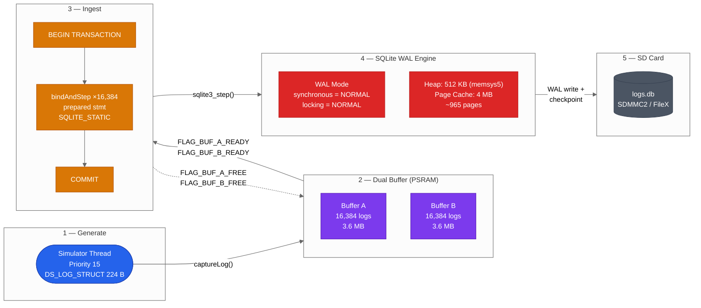
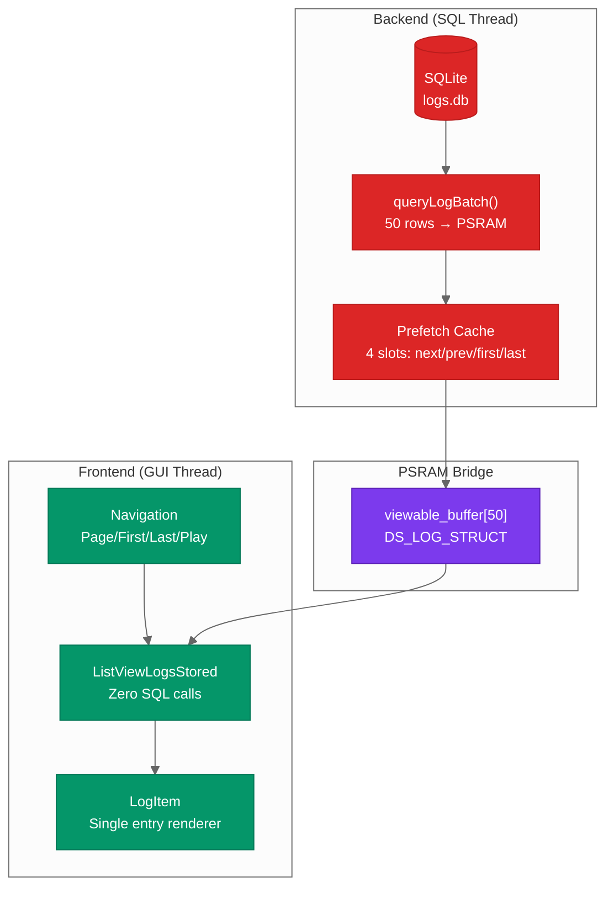

# MPLIB Storage — High-Throughput SQLite Log Ingestion on Cortex-M55

**Publication v1 — February 2026**
**Languages / Langues**: English (this document) | [Français](https://packetqc.github.io/knowledge/fr/publications/mplib-storage-pipeline/)

---

## Abstract

MPLIB Storage is a high-throughput SQLite log ingestion pipeline designed for bare-metal ARM Cortex-M55 systems. Running on the STM32N6570-DK (800 MHz), it achieves **~2,650 logs/sec sustained** across 400K+ rows using a 5-stage pipeline architecture with PSRAM-backed dual buffers, WAL-mode SQLite, and a zero-SQL GUI frontend. The system runs on ThreadX RTOS with TouchGFX for the display layer.

This document presents the architecture, design decisions, and measured performance characteristics of the pipeline.

---

## Target Platform

| Specification | Value |
|---------------|-------|
| MCU | STM32N6570-DK |
| Core | ARM Cortex-M55 @ 800 MHz |
| RTOS | ThreadX |
| UI Framework | TouchGFX |
| External RAM | PSRAM (dual-buffer storage) |
| Storage | SD Card via SDMMC2 / FileX |
| Database | SQLite 3 (amalgamation, WAL mode) |

---

## 5-Stage Pipeline Architecture



### Stage Details

#### Stage 1 — Generate
- **Thread**: Simulator at priority 15 (ThreadX)
- **Output**: `DS_LOG_STRUCT` — 224 bytes, 32-byte aligned, packed
- **Rate**: Configured burst rate, writes to whichever buffer is free

#### Stage 2 — Dual Buffer (PSRAM)
- **Location**: `.psram_buffers` linker section (external PSRAM)
- **Capacity**: 2 × 16,384 logs = 2 × 3.6 MB
- **Synchronization**: Event flags — `FLAG_BUF_A_READY (0x01)`, `FLAG_BUF_B_READY (0x02)`
- **Design**: Producer fills A while consumer drains B, then swap. Zero contention.

#### Stage 3 — Ingest
- **Strategy**: Single `BEGIN TRANSACTION` wrapping 16,384 `bindAndStep()` calls
- **Prepared statements**: Reused — never re-prepared during runtime
- **Binding**: `SQLITE_STATIC` — zero-copy from PSRAM buffer
- **Commit**: One `COMMIT` per buffer flush

#### Stage 4 — SQLite WAL Engine
- **Mode**: WAL (Write-Ahead Logging) for concurrent read/write
- **Synchronous**: `NORMAL` — fsync on checkpoint only
- **Heap**: 512 KB via `memsys5` (deterministic allocator)
- **Page cache**: 4 MB (~965 pages in memory)

#### Stage 5 — SD Card Persistence
- **Interface**: SDMMC2 via FileX (ThreadX file system)
- **Checkpoint**: Automatic WAL → main DB transfer
- **File**: `logs.db` on SD card root

---

## Frontend / Backend Separation



**Key principle**: The GUI thread **never executes SQL**. It reads from a PSRAM buffer that the backend thread populates. This eliminates UI stalls during database operations and keeps the TouchGFX render loop deterministic.

### Prefetch Cache

The backend maintains a 4-slot prefetch cache in PSRAM:

| Slot | Content | Purpose |
|------|---------|---------|
| `next` | Page N+1 | Instant forward navigation |
| `prev` | Page N-1 | Instant backward navigation |
| `first` | Page 1 | Jump-to-start |
| `last` | Last page | Jump-to-end / auto-follow |

When the user navigates, the active slot is swapped into `viewable_buffer` and the evicted slot is re-queried asynchronously.

---

## Performance

| Metric | Measured Value |
|--------|---------------|
| Sustained write rate | ~2,650 logs/sec |
| Total rows tested | 400,000+ |
| Buffer flush time | ~6.2 sec (16,384 rows) |
| Log struct size | 224 bytes |
| Buffer pair memory | 7.2 MB (PSRAM) |
| SQLite heap | 512 KB (memsys5) |
| Page cache | 4 MB |
| Checkpoint overhead | Minimal (WAL mode, async) |

---

## Design Decisions

| Decision | Rationale |
|----------|-----------|
| SQLite over custom format | Industry-standard, queryable, portable, battle-tested |
| WAL mode over journal | Concurrent read/write, no reader blocking during writes |
| PSRAM dual buffers | Producer/consumer never contend; zero-copy binding |
| memsys5 allocator | Deterministic, no fragmentation, RTOS-safe |
| Prepared statements | Avoid re-parse overhead on every insert — amortized to zero |
| `SQLITE_STATIC` binding | Zero-copy from PSRAM — struct data stays in place |
| Frontend/backend split | GUI frame rate decoupled from SQL latency |
| Prefetch cache | Hide query latency behind navigation prediction |

---

## Code Structure

```
MPLIB-CODE/
  MPLIB_STORAGE.h              API: captureLog, queryLogBatch, getLogCount
  MPLIB_STORAGE.cpp            Dual-buffer ingestion, WAL, checkpoints

Appli/TouchGFX/gui/containers/
  CC_MPLIB_STORAGE.*           Mediator pattern (parent container)
  LogDBUpdaterThread.*         PSRAM sync + prefetch cache
  ListViewLogsStored.*         List renderer (zero SQL)
  LogItem.*                    Single log item display

SQLite/                        SQLite 3 amalgamation + FileX VFS
```

---

---

## Publication Notice

> This publication was created on **February 16, 2026** and is subject to ongoing content updates, visual enhancements (diagrams, mermaid charts), and text revisions as the project evolves. Version history is maintained via Git — each update creates a new version folder (`v2/`, `v3/`, etc.) while preserving all previous versions intact.

---

*Authors: Martin Paquet (packetqcca@gmail.com) & Claude (Anthropic, Opus 4.6)*
*Project: [packetqc/STM32N6570-DK_SQLITE](https://github.com/packetqc/STM32N6570-DK_SQLITE)*
*Knowledge: [packetqc/knowledge](https://github.com/packetqc/knowledge)*
