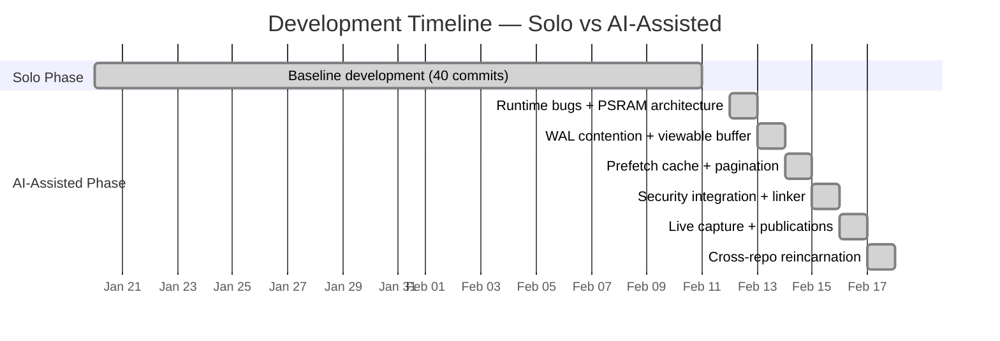
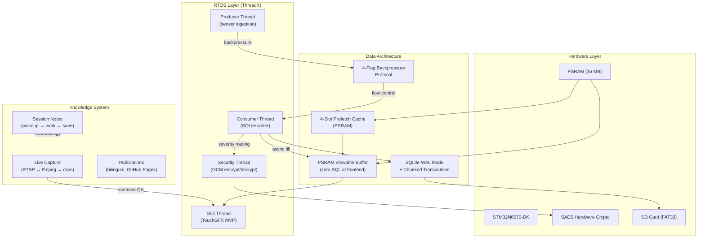
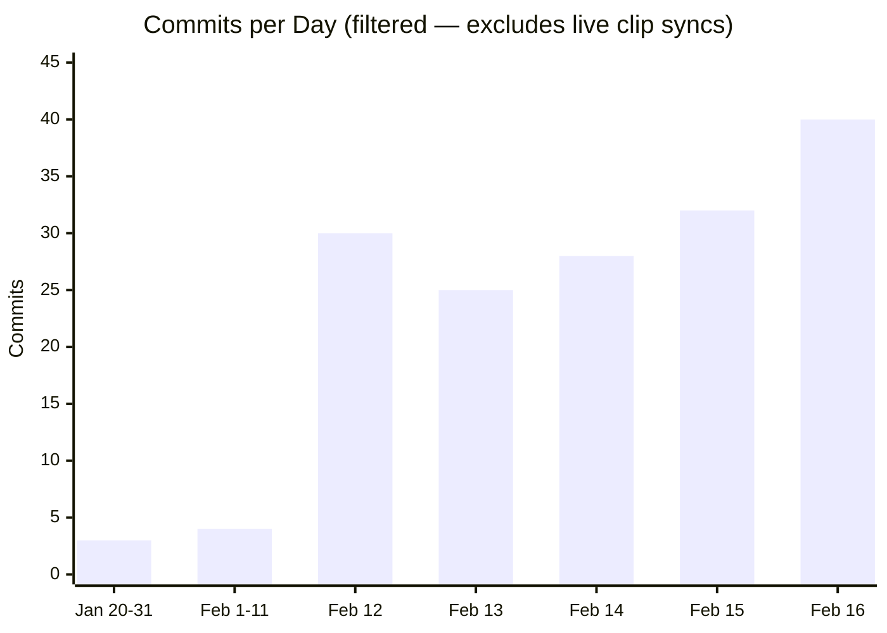
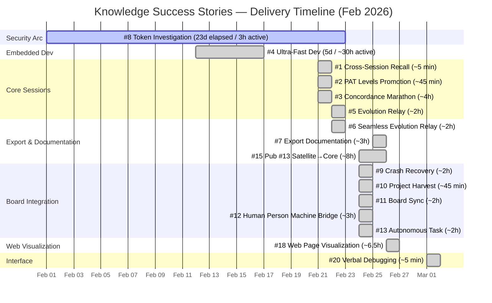

# Success Stories — Knowledge System in Action

**Publication #11 — Living Hub of Validated System Capabilities**

*By Martin Paquet & Claude (Anthropic, Opus 4.6)*
*v1 — February 2026*

---

## Authors

**Martin Paquet** — Network security analyst programmer, network and system security administrator, and embedded software designer and programmer. Architect of Knowledge whose capabilities are documented here through real-world success stories.

**Claude** (Anthropic, Opus 4.6) — AI development partner. Co-author and active participant in the stories documented — the system validates itself by recording its own successes.

---

## Abstract

This publication is a **living hub** — it grows every time Knowledge demonstrates a capability in practice. Each story is a concrete, dated example of the system working as designed: recall across sessions, distributed harvest, crash recovery, satellite bootstrap, cross-project intelligence, and more.

Stories are captured via `#N:success story:<topic>` from any session or satellite. They converge here through the normal harvest flow — the publication documents itself by consuming its own methodology.

**Why a hub**: Individual publications explain *what* the system does. This publication shows *that it works* — with real dates, real data, and real outcomes.

---

## Table of Contents

- [Story Format](#story-format)
- [Stories](#stories) *(newest first)*
  - [#22 — Visual Documentation Engine: From Video to Evidence in Seconds](#22--visual-documentation-engine-from-video-to-evidence-in-seconds)
  - [#21 — Task Workflow State Machine: Self-Verifying Protocol Engineering](#21--task-workflow-state-machine-self-verifying-protocol-engineering)
  - [#20 — Verbal Debugging: CSS Grid Dephasing Fixed from Description Alone](#20--verbal-debugging-css-grid-dephasing-fixed-from-description-alone)
  - [#19 — Agent Ticket Sync: From Feature to Stress-Tested Publication](#19--agent-ticket-sync-from-feature-to-stress-tested-publication)
  - [#18 — Web Page Visualization: From Diagnostic to Production Pipeline](#18--web-page-visualization-from-diagnostic-to-production-pipeline)
  - [#17 — Performance documentaire](#17--performance-documentaire)
  - [#16 — Rencontre de travail productive](#16--rencontre-de-travail-productive)
  - [#15 — Publication #13: From Satellite Staging to Core Production](#15--publication-13-from-satellite-staging-to-core-production)
  - [#13 — Autonomous GitHub Task Execution](#13--autonomous-github-task-execution)
  - [#12 — Human Person Machine Bridge: Knowledge as Jira+Confluence](#12--human-person-machine-bridge-knowledge-as-jiraconfluence)
  - [#11 — GitHub Project Board Sync in One Session](#11--github-project-board-sync-in-one-session)
  - [#10 — GitHub Project Integration Harvest](#10--github-project-integration-harvest)
  - [#9 — Crash Recovery Convention Alignment](#9--crash-recovery-convention-alignment)
  - [#8 — Token Disclosure Deep Investigation](#8--token-disclosure-deep-investigation)
  - [#7 — Export Documentation](#7--export-documentation)
  - [🔧 #6 — Seamless Evolution Relay *(under construction)*](#6--seamless-evolution-relay-under-construction)
  - [#5 — Seamless Evolution-Relay Introduction](#5--seamless-evolution-relay-introduction)
  - [#4 — Ultra-Fast Embedded Dev Productivity](#4--ultra-fast-embedded-dev-productivity)
  - [#3 — Autonomous Concordance Marathon](#3--autonomous-concordance-marathon)
  - [#2 — PAT Access Levels Promotion](#2--pat-access-levels-promotion)
  - [#1 — Cross-Session Recall](#1--cross-session-recall)
- [Stories by Category](#stories-by-category)
- [Delivery Timeline](#delivery-timeline)
  - [Summary](#summary)
  - [Delivery Calendar](#delivery-calendar)
  - [Enterprise Comparison](#enterprise-comparison)
- [How to Contribute](#how-to-contribute)
- [Related Publications](#related-publications)

---

## Story Format

Each story follows a consistent structure:

| Field | Description |
|-------|-------------|
| **Date** | When it happened |
| **Category** | Which system capability was demonstrated |
| **Context** | What the user was doing / what triggered it |
| **What happened** | The concrete sequence of events |
| **What it validated** | Which qualities, patterns, or capabilities were proven |
| **Metric** | Quantifiable outcome (time saved, files recovered, sessions bridged) |

**Categories**:

| Category | <span id="categories">Icon</span> | What it covers |
|----------|------|----------------|
| Recall | 🧠 | Cross-session memory, knowledge recovery, context persistence |
| Harvest | 🌾 | Distributed knowledge collection, promotion, network sweep |
| Recovery | 🔄 | Crash recovery, checkpoint resume, branch recall |
| Bootstrap | 🚀 | Satellite scaffolding, first wakeup, autonomous installation |
| Concordance | ⚖️ | Normalize fixes, structure self-healing, bilingual sync |
| Live | 📡 | Real-time debugging, video analysis, beacon discovery |
| Security | 🔒 | Token protocol, PQC encryption, access scoping |
| Evolution | 🧬 | System self-improvement, version progression, quality emergence |
| Operations | ⚙️ | Project management, roadmap, board integration, Jira/Confluence bridge |

---

## Stories

### #22 — Visual Documentation Engine: From Video to Evidence in Seconds

> *"I've wanted this for a long time — the ability to take a video recording from a development session and automatically extract the key moments as images and clips to enrich our documentation. Today it works. Search a 2-hour video, get 5 evidence frames and their video context, organized in a directory ready for documentation."*

| Field | Value |
|-------|-------|
| **Date** | 2026-03-07 |
| **Category** | 🚀 ⚙️ |
| **Context** | Development workflows generate hours of video recordings — screen captures, UART sessions, demo recordings, CI/CD artifacts. Extracting useful frames from these recordings was entirely manual: scrub through the video, pause at the right moment, take a screenshot, organize, annotate. For long recordings, this process was impractical. The user had envisioned an automated solution for months — a system that could scan video files, find what matters, and produce organized evidence ready for documentation. |
| **Triggered by** | Issue #556 — The user described the vision: multi-criteria search directly on video files, organized evidence directories with discoveries and clips, and the downstream goal of enriching documentation with automatically extracted visual evidence. |
| **Authored by** | Claude, from live session data |

**What happened**:

1. **The vision** — The user articulated a need that had been building for months: video recordings contain critical evidence (UI states, error screens, UART output, configuration changes), but extracting this evidence was entirely manual. The goal: an engine that processes video files using computer vision and produces organized evidence — no cloud services, no external tools, standard Python libraries only.

2. **Direct video access** — Instead of the naive approach of extracting all frames to disk (which would consume gigabytes for a long video), the user suggested working directly on the video file. The engine seeks to specific positions using `cv2.VideoCapture.set()` — only matched frames are ever saved. This makes it practical to search hours-long recordings with minimal disk usage.

3. **Multi-pass search architecture** — The engine performs intelligent two-pass scanning: Pass 1 (coarse) scans every ~1 second evaluating all criteria simultaneously; Pass 2 (fine) refines around each hit frame-by-frame. Four combinable heuristics: scene change detection (histogram correlation), text density (adaptive threshold + morphology), edge density (Canny detection), and structured content (horizontal/vertical line detection).

4. **Evidence structure** — Results are organized in a purpose-built directory structure: `evidence/<session>/discoveries/` for extracted frames, `clips/` for reconstructed video segments, `metadata.json` for machine-readable data, and `index.md` for human-readable inventory. Everything feeds directly into documentation.

5. **Clip reconstruction** — Beyond static frames, the engine reconstructs standalone `.mp4` clips centered around evidence timestamps. Using `cv2.VideoWriter`, it extracts ±N seconds of context around each finding — the video equivalent of "show me what happened around this moment."

6. **Live validation** — The engine was tested on a real recording from the knowledge system (Main Navigator interface demo, 1920×1080, 30fps, 65.8s). Search mode found evidence frames, clip reconstruction produced playable MP4 segments, and the evidence directory structure was generated with metadata and index.

7. **Inline display discovery** — During testing, the challenge of showing results to the user led to discovering that markdown image links via `raw.githubusercontent.com` work reliably on the Claude mobile app. This became a documented display protocol — push evidence to the branch, present via markdown image links.

**What it validated**:

| Quality | How |
|---------|-----|
| **Autosuffisant** (#1) | Zero external dependencies — OpenCV + Pillow + NumPy only. No ffmpeg CLI, no cloud APIs, no OCR services. |
| **Autonome** (#2) | The engine self-organizes output — evidence directory with metadata, index, discoveries, and clips created automatically. |
| **Évolutif** (#6) | Started as frame extraction (Publication #2), grew to detection mode, then search mode, clip reconstruction, image analysis. |
| **Concis** (#4) | Direct video access instead of bulk extraction. A 2-hour video search produces 5 evidence frames, not 216,000 temporary files. |
| **Intégré** (#13) | Evidence feeds directly into documentation. Inline display via GitHub raw URLs enables immediate visualization on any client. |

**Metric**: 1 vision → ~1,200 lines of Python → 6 operating modes → 65.8s 1080p video searched in <30s. A process that takes 15-20 minutes manually is now automated and produces richer output (annotations, clips, structured evidence).

---

### #21 — Task Workflow State Machine: Self-Verifying Protocol Engineering

> *"I invented a missing component — the task workflow — and a methodology to harden Claude's behaviorism for any user request. Then we used the system's own validation quiz to expose its incomplete wiring. The system found its own bugs. That's quality #2 (Autonome) proving itself in real time."*

| Field | Value |
|-------|-------|
| **Date** | 2026-03-05 |
| **Category** | 🧬 ⚙️ |
| **Context** | After less than two weeks of session protocol evolution (v50–v56), the knowledge system had accumulated rules about task lifecycle stages but no formal state machine to enforce them. Sessions could skip stages, steps wouldn't advance in the cache, and GitHub issues had no label reflecting the current workflow stage. The user identified this gap and invented two foundational components: (1) the **task workflow state machine** — an 8-stage lifecycle to formalize how every user prompt is processed, and (2) the **agent-identity methodology** (`agent-identity.md`) — a behavioral contract that hardens Claude's compliance with the protocol, eliminating shortcuts and judgment calls that erode consistency. These two inventions transformed ad-hoc session behavior into a normalized, verifiable pipeline for any request. |
| **Triggered by** | Issue #763 — Review workflow task cycle. The user designed the session as an emulation exercise: walk through the 8-stage lifecycle as if executing a real task, validating each step programmatically. This was the user's method for verifying their own invention. |
| **Authored by** | Claude, from live session data |

**What happened**:

1. **The user's invention** — The user conceived and designed two missing components that the knowledge system needed: (a) `task_workflow.py` — an 8-stage state machine (`initial → plan → analyze → implement → validation → approval → documentation → completion`) that normalizes how any user request is received, tracked, and completed; (b) `agent-identity.md` — a behavioral methodology that defines who Claude IS (a systems engineer with zero tolerance for protocol shortcuts), not just what Claude does. Together, these ensure every prompt — from "fix a bug" to "hello" — follows the same verifiable lifecycle.

2. **The validation quiz** — Instead of just reading code, the session ran a programmatic validation quiz. `check_validation_needed('initial')` returned 9 concrete checks. Each was presented to the user via `AskUserQuestion` with Pass/Fail/Skip options. The user graded their own system's compliance.

3. **The self-diagnosis** — On check 7/9 (persist_state), the user identified that: (a) the GitHub issue had no label reflecting the current workflow stage, (b) the cache `current_step` was stuck at "confirm_title" despite being well past that point, and (c) `task_workflow.issue_number` was 0 instead of the actual session issue number. A fourth gap was discovered during the fix attempt: `update_session_data()` creates flat keys instead of updating nested objects.

4. **Infrastructure exists, wiring missing** — Investigation revealed that `gh_helper.py` already has `issue_engineering_stage_sync()` with color-coded labels for all stages — but `advance_task_stage()` never calls it. The methods were built; the integration was not.

5. **The interface vision** — The findings led directly to Issue #766: a Task Workflow Interface (I3) for the Main Navigator — a live state machine viewer showing stage progression, step history, and validation results. The state machine generates its own visualization surface.

6. **From spec to live in one session** — Issue #766 was implemented in a single continuation session: 4-view interactive interface (Overview, Detail, Validation, Progression), `compile_tasks.py` data pipeline, STAGE:/STEP: label sync, dot-notation cache updates, task continuation protocol, and knowledge evolution v57.

**What it validated**:

| Quality | How |
|---------|-----|
| **Autonome** (#2) | The system's validation quiz found its own implementation gaps — no human code review needed |
| **Évolutif** (#6) | 8 stages emerged from 56 knowledge versions — each version adding one more piece until the full lifecycle crystallized |
| **Récursif** (#9) | The state machine validates itself: quiz checks → expose gaps → fix gaps → re-quiz |
| **Structuré** (#12) | Task lifecycle formalized as a state machine with history, not just documentation rules |
| **Intégré** (#13) | GitHub labels, issue comments, cache state, and web interface all reflecting the same workflow state |

**Metric**:

| Step | Time | Detail |
|------|------|--------|
| Emulate 8-stage lifecycle | ~15 min | Walked through each stage with real protocol calls |
| Run INITIAL validation quiz | ~10 min | 9 checks, 8 passed, 1 found 4 gaps |
| Investigation + root cause | ~5 min | Traced gaps to missing wiring in `advance_task_stage()` |
| I3 interface implemented | ~45 min | 4-view interactive web interface + data pipeline |
| **Total** | **~75 min** | **State machine validated + 4 gaps fixed + interface live** |
| Enterprise equivalent | 3–6 weeks | State machine design + validation framework + UI implementation + issue tracking |

The quiz didn't just validate — it discovered. The system used its own enforcement mechanism to find where the enforcement was incomplete. That's recursive quality assurance: the protocol checking itself. But the deeper innovation is the user's: inventing the task workflow and agent-identity methodology — two components that transformed Claude from a helpful assistant into a protocol-bound engineer. The system doesn't just process requests anymore; it normalizes them through a verifiable lifecycle.

---

### #20 — Verbal Debugging: CSS Grid Dephasing Fixed from Description Alone

> *"You never know what will be the perfect solution for the perfect problem. 3 minutes writing, 95% less tokens. The person seeing the rendered output has information I don't — and this time we got it right on the first try."*

| Field | Value |
|-------|-------|
| **Date** | 2026-03-01 |
| **Category** | 📡 🧬 |
| **Context** | The Main Navigator interface (I2) — a three-panel layout with left widget directory, center page viewer, and right content viewer separated by interactive divider bars — was completely broken after a code change. All panels were visually present but in the wrong positions. Instead of filing a screenshot or opening dev tools, the user described what they saw by scanning left to right across the browser window. The description was a raw stream-of-consciousness paragraph — no technical jargon, no CSS terminology, just "I see X where Y should be" |
| **Triggered by** | Issue #457 — ongoing Main Navigator design session. The user's verbal walkthrough replaced what would normally require screenshots or video evidence |
| **Authored by** | Claude, from live session data |

**What happened**:

1. **The verbal walkthrough** — The user described the broken layout left-to-right: "I see the left panel on left where it should be. Next is the width of the bar that I do not see but see the page viewer that should be the rightmost panel. Then I see the right bar taking all space of what would be the center panel... page view and page center are inverted, center is at right and right is at center... dephased seems to be..."

2. **Root cause identified in under a minute** — The word "dephased" was the key insight. Claude mapped the user's left-to-right visual inventory against the 5-column CSS Grid definition: `grid-template-columns: var(--left-w) 28px 1fr 28px 0px`. The `.nav-panel` (left panel) used `position: absolute`, removing it from the grid flow. With only 4 children participating in the 5-column grid, every element shifted left by one column position — the classic off-by-one, but in CSS Grid.

3. **The dephasing table** — Claude produced the exact mapping:

| Column | Expected | Actual (broken) |
|--------|----------|-----------------|
| 1 (220px) | nav-panel | nav-divider-left |
| 2 (28px) | left divider | nav-center (squeezed!) |
| 3 (1fr) | center panel | nav-divider-right (fills all space!) |
| 4 (28px) | right divider | nav-viewer |
| 5 (0px) | right panel | empty |

4. **Fix on first attempt** — Added explicit `grid-column: 1` through `grid-column: 5` to all 5 grid children. 5 lines of CSS. Applied to both EN and FR versions. Committed, pushed, PR #505 created and merged to main — deployed to GitHub Pages.

5. **User confirmed immediately** — "no you got it!!!" — first try, no iterations, no back-and-forth.

6. **The catchphrase** — User's reaction captured the methodology: *"That was worth the long description paragraph of what I see. 95% less tokens, 3 minutes writing. You never know what will be the perfect solution for the perfect problem."*

**What it validated**:

| Quality | How |
|---------|-----|
| **Interactive** (#5) | The user's verbal walkthrough replaced screenshots entirely. A raw left-to-right scan of the browser window contained enough information for immediate root cause identification — no dev tools, no element inspector, no formal bug report |
| **Evolved** (#6) | The fix emerged from understanding CSS Grid spec behavior — absolutely positioned children don't participate in auto-placement flow. The knowledge gap between "works in code" and "works in browser" was bridged by the user's observation |
| **Concordant** (#3) | Fix applied simultaneously to EN and FR versions — bilingual concordance maintained. PR merged to main for immediate deployment |
| **Concise** (#4) | 5 lines of CSS fixed a completely broken three-panel layout. The diagnosis paragraph was longer than the fix. Maximum signal, minimum change |

**Metric**: 1 verbal description (~3 minutes of user typing) → root cause identified in <1 minute → 5-line CSS fix → PR #505 merged → deployed to GitHub Pages → confirmed working. Zero iterations. Zero screenshots needed. Total session time for the fix: ~5 minutes.

**Time to deliver**:

| Phase | Duration | Key output |
|-------|----------|------------|
| User describes bug | ~3 min | Raw left-to-right verbal walkthrough |
| Claude diagnoses | <1 min | Grid column dephasing table |
| Fix + deploy | ~2 min | 5 CSS lines, PR #505 merged |
| **Total** | **~5 min** | **Three-panel layout fully restored** |
| Enterprise equivalent | 1–2 hours | Bug report + triage + CSS investigation + QA + deploy |

The user described what they saw. Claude mapped it to the code. The fix was obvious. "Minuit moins une" — the last fix of the day, right before closing shop.

---

### #19 — Agent Ticket Sync: On-the-Fly Engineering from Feature to Publication

> *"Another session was upgrading a complex feature and needed real-time issue sync. Instead of waiting, we built the feature on the fly — implemented it, stress-tested it across 6 compactions, wrote the publication, and posted the success story — all before going back to the upgrade session. The entire engineering cycle in ~2 hours. Enterprise equivalent: 4–8 weeks."*

| Field | Value |
|-------|-------|
| **Date** | 2026-02-28 |
| **Category** | 🧬 ⚙️ 🔄 |
| **Context** | A parallel session was upgrading a complex feature (the v51-v52 session protocol, involving real-time issue comments, three-channel persistence, and pre-save summaries). That upgrade **required** a module that didn't exist yet: `SessionSync` — real-time GitHub issue comment synchronization. Instead of blocking the upgrade session or deferring the feature, a new session was opened to build it on the fly. The feature was developed, stress-tested across 6 compactions, documented as Publication #23, and recorded as this success story — the complete engineering cycle from requirements to published documentation — before returning to the upgrade session. The tool was planned on the roadmap, but its implementation was triggered by immediate operational need |
| **Triggered by** | Issue #479: *"feature create agent ticket sync updater"* — spawned from the v51-v52 protocol upgrade session that required real-time issue synchronization to function |
| **Authored by** | Claude, from session work data |

**What happened**:

**Phase 1 — Implementation** (PR #480):

1. **gh_helper.py extended** — Added 4 new methods: `issue_comment_post()`, `issue_comment_edit()`, `issue_comments_list()`, `issue_close()`. All using Python `urllib` to bypass the container proxy.

2. **SessionSync class created** — 391-line module (`scripts/session_issue_sync.py`) implementing the full comment lifecycle: `post_user()` for 🧑 comments, `start_step()`/`complete_step()` for ⏳→✅ todo lifecycle, `post_bot()` for standalone exchanges, `integrity_check()` for gap detection, `post_summary()` and `close_with_report()` for session end.

3. **Dogfooding activated** — SessionSync was activated on its own tracking issue (#479) immediately after implementation. Every subsequent todo step was posted to the issue in real-time.

**Phase 2 — Compaction Stress Test** (6 compactions):

4. **Constructor bug discovered** — After compactions #2 and #3, the 3-argument form `SessionSync('packetqc', 'knowledge', 479)` was used instead of the correct 2-argument form `SessionSync('packetqc/knowledge', 479)`. This caused `repo='packetqc'`, `issue_number='knowledge'`, `token=479` — a silent failure. Documented as the #1 post-compaction risk.

5. **Auto-piloted stress test** — Martin's client was too busy for manual testing, so the test was redesigned as entirely server-side: 5 PRE comments (baseline), 5 DURING comments (interleaved with massive file reads: CLAUDE.md 2400 lines + generate_og_gifs.py 2100 lines + 130 docs files totaling 44,968 lines), 5 POST comments (recovery verification). Compaction #6 occurred during the DURING phase.

6. **Three-timestamp standard applied** — Martin's observability standard: "log at gen and log at receive and log at store." T-gen embedded in comment body, T-receive as GitHub `created_at`, T-store as persistence. The delta measures end-to-end sync latency.

**Phase 3 — Publication** (this story):

7. **Publication #23 created** — Source document, 4 web pages (EN/FR summary + complete), publications index updated — documenting the feature with full stress test data.

8. **Success Story #19 written** — This story, added to Publication #11 — documenting the recursive validation where the tool documented itself.

**What it validated**:

| Quality | How |
|---------|-----|
| **Persistent** (#8) | Three-channel model proven: Git (batch), Notes (batch), Issue (real-time). The issue survived 6 compactions independently of session memory |
| **Resilient** (#11) | SessionSync re-instantiated after every compaction. 15/15 comments posted, 0 lost. ~99s compaction gap, then immediate recovery to ~2.5s baseline |
| **Recursive** (#9) | The tool posted comments about building itself. The publication documents stress test data generated by the tool being documented. The success story describes writing the success story |
| **Self-sufficient** (#1) | Pure Python (urllib), zero external dependencies, graceful degradation without token |
| **Autonomous** (#2) | Auto-piloted stress test ran without user intervention. Martin went for coffee; the test completed autonomously |
| **Evolved** (#6) | From protocol specification (v51) to implementation to stress test to publication — four stages in one session |

**Metric**: 1 feature request → 2 scripts (session_issue_sync.py 391 lines + gh_helper.py 4 methods) → 1 PR merged (#480) → 6 compactions survived → 15/15 stress test comments posted → 1 publication created (#23, 5 files) → 1 success story → 80+ issue comments on #479 — all built on the fly while another session waited, all tracked on the issue being built.

**The on-the-fly engineering cycle**:

The key insight is not just the speed — it's the **completeness**. In an enterprise setting, this feature would require separate phases with different teams and handoffs:

| Enterprise phase | Enterprise duration | Knowledge System | Who |
|-----------------|---------------------|------------------|-----|
| 🔨 Requirements gathering | 1–2 weeks | ~5 min (Martin's single-line request) | Product → Dev |
| 🔨 Architecture & design | 1–2 weeks | ~10 min (protocol already in CLAUDE.md v51-v52) | Architect → Dev |
| 🔨 Implementation | 2–4 weeks | ~1h (SessionSync class + gh_helper methods) | Dev team |
| 🔨 Code review & PR | 1–3 days | ~5 min (PR #480 auto-merged) | Dev → Lead |
| 🧪 QA / stress testing | 1–2 weeks | ~30 min (auto-piloted, 15 comments, 6 compactions) | QA team |
| 📝 Technical documentation | 1–2 weeks | ~30 min (Publication #23, 5 files, EN/FR) | Tech writer |
| 📝 Success story / case study | 2–5 days | ~10 min (this story, with metrics) | Marketing / PM |
| 🎓 Team training | 1–2 weeks | ~0h (documentation IS the training — AI reads it) | Training team |
| 🚀 Deployment | 1–3 days | ~0h (PR merge = deployed) | DevOps |
| **Total** | **4–8 weeks** | **~2h active** | **5+ roles** |

**Compression ratio**: ~160x (4–8 weeks vs ~2h). But the real leverage is not the time compression — it's the **elimination of handoffs**. Enterprise requires 5+ distinct roles passing deliverables between teams, each handoff introducing delay, context loss, and reinterpretation risk. The knowledge system collapses all roles into one continuous session: the developer describes the need, the AI implements, tests, documents, and publishes — with no handoff, no context loss, no waiting.

**Time to deliver**:

| Phase | Duration | Key outputs |
|-------|----------|-------------|
| Phase 1 — Implementation | ~1h | SessionSync class, gh_helper methods, PR #480 merged |
| Phase 2 — Stress test | ~30min | 15 timestamped comments, 6 compactions survived |
| Phase 3 — Publication + Story | ~30min | Publication #23 (5 files), Success Story #19 |
| **Total** | **~2h active** | **Feature → tested → published → storied** |
| **Enterprise equivalent** | **4–8 weeks** | Requirements → implementation → QA → docs → training → deploy |

**The critical context**: This entire engineering cycle — from feature request to published documentation and success story — was completed **on the fly** while another session was paused on a complex upgrade (v51-v52 protocol). That upgrade session needed `SessionSync` to function. Instead of blocking the upgrade or deferring the feature to a future sprint, the feature was built, validated, and delivered in a single detour session. The upgrade session resumed with the feature ready and documented.

The feature built itself, tested itself, documented itself, and validated itself — all while posting its own progress to the issue it was designed to serve. And all before the espresso machine finished brewing.

---

### #18 — Web Page Visualization: From Diagnostic to Production Pipeline

> *"A bug in Mermaid diagrams on French pages became the catalyst for a new system capability: Claude can now see what the user sees. From interactive diagnostic to design iteration to documentation quality control — the browser became a mirror, and the mirror became a tool."*

| Field | Value |
|-------|-------|
| **Date** | 2026-02-26 |
| **Category** | 🧬 📡 ⚙️ |
| **Context** | A diagnostic session on Publication #15 (Architecture Diagrams) revealed that Mermaid diagrams were not rendering correctly on French GitHub Pages. The investigation spawned a new capability: local web page visualization using Playwright + Chromium + npm mermaid. What started as a bug fix evolved through three distinct usage modes — interactive diagnostic, interactive design, and documentation management — before being formalized into a production pipeline with its own publication, methodology files, and reusable script |
| **Triggered by** | Issue #334: *"diagnostic sur les diagrammes des pages web"* — user reported Mermaid diagrams not rendering on FR Architecture Diagrams page. Issue #335: *"feat: Web Page Visualization — local rendering capability"* |
| **Authored by** | Claude, from session work data |

**What happened**:

**Phase 1 — Interactive Diagnostic** (Issue #334, PRs #330–#332):

1. **Problem identification** — Mermaid diagrams rendered correctly on EN pages but failed on FR pages. Claude could not see the rendered output — only the source code.

2. **Capability discovery** — The rendering pipeline was assembled from pre-installed components: Playwright (pre-installed in Claude Code containers), Chromium binary, and npm mermaid (local install). urllib fetches the HTML, builds self-contained pages, Playwright renders with mermaid.js injection, screenshots capture the result.

3. **Visual feedback loop** — For the first time, Claude could see what the user sees: the rendered web page with diagrams, styling, and layout. This transformed debugging from code-inference to visual-verification. Screenshots became primary data — just like UART output in embedded work.

4. **Root cause found** — Multiple rendering issues identified and fixed iteratively: Mermaid initialization timing, pre-wrapper conflicts, retry mechanisms. 3 PRs (#330, #331, #332) delivered fixes progressively.

**Phase 2 — Interactive Design** (PRs #336–#338, #340–#344):

5. **Diagram pre-rendering** — Strategic pivot: instead of relying on client-side Mermaid (fragile on GitHub Pages), diagrams were pre-rendered to PNG images with dual-theme support (Cayman/Midnight). 14 diagrams × 2 themes × 2 languages = 56 images generated.

6. **Mermaid source preservation** — Innovation: `<details class="mermaid-source">` blocks preserve the original Mermaid code alongside pre-rendered images. The image renders instantly (no JS dependency); the source is one click away (editable, maintainable, AI-readable). CSS `display: none !important` + JS exclusion prevent double-rendering.

7. **Design iteration via screenshots** — Claude rendered pages, verified layout, adjusted diagrams to desired format, and re-rendered — all within the same session. The user directed: *"ajuste les diagrammes au format qu'on désirait"*. Visual feedback enabled design decisions that would have been impossible from code alone.

8. **kramdown `<details>` discovery** — A critical bug: blank lines inside `<details>` blocks cause kramdown to exit HTML block mode, escaping `</summary>` as `&lt;/summary&gt;` and creating cascading nesting failures. Documented as a gotcha and fixed in PR #345.

**Phase 3 — Documentation Management** (PRs #348–#352):

9. **Publication #17 created** — Web Production Pipeline publication documenting the Jekyll processing chain, three-tier structure, kramdown gotchas, and exclusion mechanisms. Issue #347, PR #348.

10. **Methodology files updated** — `web-page-visualization.md` enriched with kramdown gotcha and production script references. New `web-production-pipeline.md` created as operational companion. Issue #350, PR #349.

11. **Production script created** — `scripts/render_web_page.py` (327 lines) — CLI tool implementing both pipelines: full page visualization and individual Mermaid-to-image rendering. Auto-detects Chrome and mermaid.js, auto-installs npm mermaid if missing, supports batch mode. Deployed as a knowledge asset synced to all satellites. Issue #351, PR #352.

12. **Self-verification capability** — Claude can now render a documentation page, verify it matches expectations, and proactively fix rendering issues — without waiting for user screenshots. The pipeline enables anticipatory quality control: generate content, verify visually, correct before delivery.

**What it validated**:

| Quality | How |
|---------|-----|
| **Autonomous** (#2) | A diagnostic bug spawned a full capability pipeline: 2 publications, 3 methodology files, 1 production script, 13 PRs — each building on the previous without re-explanation |
| **Evolved** (#6) | Three usage modes emerged organically: diagnostic (fix what's broken) → design (shape what's being built) → management (verify what's produced). Each mode validated the previous and extended the capability |
| **Interactive** (#5) | Visual feedback loop enabled real-time design iteration: render → observe → adjust → re-render. Same methodology as embedded UART debugging, applied to web pages |
| **Concordant** (#3) | kramdown `<details>` gotcha discovered and documented. Mermaid source preservation ensures maintainability. `.mermaid-source` exclusion consistent across layouts, CSS, JS, and the production script |
| **Self-sufficient** (#1) | Zero external dependencies: Playwright pre-installed, Chromium pre-installed, npm mermaid local install, urllib bypasses proxy. 100% local execution — no CDN, no API calls at runtime |
| **Recursive** (#9) | The visualization capability was used to verify the pages documenting the visualization capability. Publication #16 was created, then rendered and verified using the tool it describes |
| **Distributed** (#7) | Production script deployed as knowledge asset — every satellite inherits the rendering pipeline on next wakeup via standard asset sync |

**Metric**: 1 diagnostic bug → 3 distinct usage modes (diagnostic, design, documentation) → 2 publications created (#16, #17) → 3 methodology files (1 created, 2 updated) → 1 production script (327 lines, 2 pipelines, batch mode) → 13 PRs merged (#330–#332, #336–#338, #340–#346, #348–#349, #352) → 6 GitHub issues tracked (#334, #335, #339, #347, #350, #351) → 56 pre-rendered diagram images → kramdown gotcha documented → `.mermaid-source` preservation pattern established → capability deployed to satellite network as knowledge asset.

**Time to deliver**:

| Phase | Duration | Key outputs |
|-------|----------|-------------|
| Phase 1 — Interactive diagnostic | ~2h | Root cause found, 3 PRs, rendering pipeline assembled |
| Phase 2 — Interactive design | ~3h | 56 pre-rendered images, source preservation, kramdown fix, 8 PRs |
| Phase 3 — Documentation management | ~1.5h | 2 publications, 3 methodology files, 1 production script, 4 PRs |
| **Total** | **~6.5h active** | **Full capability: from bug to production pipeline** |
| Enterprise equivalent | 2–3 months | Rendering infrastructure evaluation + POC + documentation + deployment + QA |

The bug became the feature. The diagnostic became the capability. The capability became the production pipeline. Each phase validated the previous one and extended the system's ability to see — and correct — its own output.

---

### #17 — Performance documentaire

> *"Two architecture publications, two success stories about the process, one success story about all of it, and every cross-reference updated — in a single work session. The documentation pipeline's performance becomes a success story about performance."*

| Field | Value |
|-------|-------|
| **Date** | 2026-02-26 |
| **Category** | 🧬 ⚖️ ⚙️ |
| **Context** | At the end of a documentation-intensive work session, the user requested a summary success story capturing the full performance of the session. The session had already produced 2 complex architecture publications (#14, #15), success story #16 documenting the productive meeting, and all cross-references — across 3 PRs (#319, #320, #321). This story (#17) is the meta-summary: documenting the documentation performance itself |
| **Triggered by** | User prompt: *"la cerise sur le Sunday, j'aimerais que tu me crées un succès story qui s'appelle performance documentaire qui résume dans le fond"* |

**What happened**:

1. **Publication #14 — Architecture Analysis** — Comprehensive written analysis of the Knowledge system: 4 knowledge layers, component architecture, 13 core qualities, session lifecycle, distributed topology, security model, web architecture, deployment tiers. 5 files created (source + EN/FR summary + EN/FR complete). ~800 lines of architecture documentation.

2. **Publication #15 — Architecture Diagrams** — Visual companion with 11 Mermaid diagrams: system overview, knowledge layers stack, component architecture, session lifecycle, distributed flow, publication pipeline, security boundaries, deployment tiers, quality dependencies, recovery ladder, GitHub integration. 5 files created. ~665 lines of diagrammatic documentation.

3. **Success story #16 — Rencontre de travail productive** — Self-referencing story documenting the creation of #14 and #15 in a single session from a casual French request. Added to source + 4 web pages.

4. **Success story #17 — Performance documentaire** — This story. Meta-summary of the full session output: 2 publications + 2 success stories + all cross-references.

5. **Cross-reference cascade** — EN/FR publication indexes, NEWS.md, PLAN.md, LINKS.md (8 new URLs + LinkedIn inspector URLs), CLAUDE.md Publications table — all updated across 3 strategic PRs.

**What it validated**:

| Quality | How |
|---------|-----|
| **Autonomous** (#2) | Casual French requests triggered the complete pipeline each time: scaffold, content, bilingual web pages, cross-references, delivery. No intermediate questions |
| **Concordant** (#3) | 30 files touched across 3 PRs — all bilingual mirrors synchronized, all cross-references updated, zero orphan pages |
| **Evolved** (#8) | The session itself became increasingly efficient: PR #319 (10 files), PR #320 (enrichment), PR #321 (story propagation to 4 web pages). Each PR built on the previous |
| **Recursive** (#9) | Story #16 documents the session that created it. Story #17 documents the documentation of that session. The system measures its own performance by performing |
| **Structured** (#12) | Every output follows the established pipeline: source → EN summary/complete → FR summary/complete → cross-references → delivery |

**Metric**: 1 work session → 2 architecture publications (#14, #15) + 2 success stories (#16, #17) + all cross-references → 3 PRs (#319, #320, #321) merged → 30 files changed → 5,392 lines added → 8 new GitHub Pages URLs → Issues #316 and #317 addressed → bilingual EN/FR across all pages.

**Time to deliver**: Single work session. Two architecture publications with complex technical content, two success stories, and full cross-reference cascade — all from natural-language French requests. The documentation pipeline's own performance became its own success story.

---

### #16 — Rencontre de travail productive

> *"Ok mon Claude, crée-moi deux publications et une success story. — The user spoke into their phone, Claude listened, and a productive work meeting produced two architecture publications, success stories, and all cross-references. Voice-to-text as the interface, Knowledge as the engine."*

| Field | Value |
|-------|-------|
| **Date** | 2026-02-26 |
| **Category** | 🧬 ⚖️ ⚙️ |
| **Context** | A productive work meeting conducted entirely via voice-to-text: the user spoke in French on their mobile phone using the Claude mobile app, which transcribed speech to text in real-time. This voice-first workflow was used throughout the entire session — every request, every clarification, every creative direction was spoken, not typed. The meeting had two distinct phases: (1) an interactive architecture exploration where the user verbally guided Claude through diagramming and analyzing the Knowledge system's structure, and (2) a documentation generation phase where all outputs were formalized into publications, success stories, and cross-references |
| **Triggered by** | Voice-to-text via Claude mobile app. The user verbally created GitHub Issues #316 ("Analyse d'architecture") and #317 ("Diagramme d'architecture"), then guided the architecture exploration interactively before requesting formal publication generation |

**How the meeting was organized**:

The entire session used a **voice-first workflow**: the user spoke into the Claude mobile app on their phone, which transcribed to text. This natural conversational interface — speaking in French, casually directing complex documentation work — is what made the session a "productive work meeting" rather than a coding session. No keyboard, no IDE — just a human talking to an AI about architecture.

**What happened**:

**Part 1 — Interactive architecture exploration** (~2 hours, 03:05–05:11 UTC):

1. **Task creation via voice** — The user verbally requested the creation of GitHub Issues #316 and #317 at 03:05 and 03:17 UTC respectively. Claude resolved both via the GitHub REST API.

2. **Architecture analysis dialogue** — Through interactive voice-to-text exchanges, the user guided Claude to analyze and represent the Knowledge system's architecture. The user asked Claude to represent what they had built together — a system that had grown complex over 48 knowledge versions — in structured form.

3. **Diagram design iteration** — The user directed the creation of 11 Mermaid diagrams, requesting both minimalist overview diagrams (for high-level comprehension) and detailed deep-dive diagrams (for technical depth). The minimalist diagrams provide entry points; the detailed ones allow going deeper into the knowledge architecture. This dual-level approach was a deliberate design choice communicated verbally.

4. **Publication #14 — Architecture Analysis**: comprehensive written analysis emerging from the dialogue — 4 knowledge layers, component architecture, 13 core qualities, session lifecycle, distributed topology, security model, web architecture, and deployment tiers. ~800 lines. 5 files (source + 4 web pages EN/FR).

5. **Publication #15 — Architecture Diagrams**: visual companion with 11 Mermaid diagrams — system overview, knowledge layers stack, component architecture, session lifecycle flowchart, distributed flow, publication pipeline, security boundaries, deployment tiers, quality dependency graph, recovery ladder, and GitHub integration lifecycle. ~665 lines. 5 files (source + 4 web pages EN/FR).

**Part 2 — Documentation generation and delivery** (~32 minutes, 05:11–05:43 UTC):

6. **Cross-reference cascade** — All reference documents updated in one pass:
   - EN and FR publications indexes (2 new entries each)
   - NEWS.md (2 new entries under P0 and Publications)
   - PLAN.md (What's New updated)
   - LINKS.md (8 new page URLs + LinkedIn inspector URLs)
   - CLAUDE.md Publications table (2 new rows)
   - Success Stories source (story #16 + TOC + categories + delivery timeline)

7. **Success story self-reference** — This story (#16) was created as part of the same session, documenting the productive work meeting that produced it. The recursive nature is intentional: the user asked for a story about the meeting, and the meeting's primary output was the story and its sibling publications.

8. **Delivery** — All changes committed on the assigned task branch, pushed, PRs created and merged. 10 new files + ~8 file edits delivered across 3 strategic PRs (#319, #320, #321).

**What it validated**:

| Quality | How |
|---------|-----|
| **Autonomous** (#2) | Voice-to-text requests in French triggered the complete pipeline: issue creation, architecture analysis, diagram design, publication scaffolding, bilingual web pages, cross-references, success story, delivery. Zero intermediate questions about format or structure |
| **Concordant** (#3) | 10 new files created following the exact 3-tier bilingual structure (source → EN summary/full → FR summary/full). All cross-references (indexes, NEWS, PLAN, LINKS, CLAUDE.md) updated simultaneously. No orphan pages |
| **Concise** (#4) | Verbal French requests → 2 complete publications with 11 diagrams + 1 success story + all cross-references. Maximum output from natural conversational input |
| **Interactive** (#5) | Part 1 was a genuine dialogue: the user verbally directed the architecture exploration, requested specific diagram types (minimalist + detailed), and iteratively shaped the output. Voice-to-text made this feel like a natural work meeting |
| **Recursive** (#9) | This success story documents the session that created it. Publication #14 analyzes the architecture that produced it. Publication #15 diagrams the system that generated the diagrams |
| **Structured** (#12) | Both publications follow the established P#/publication pipeline: source document, bilingual web pages with proper front matter, index entries, related publication cross-references |

**Metric**: 1 productive work meeting via voice-to-text → 2 publications created (#14, #15) → 10 new files → ~8 files updated → 1 success story self-authored (#16) → 11 Mermaid diagrams → ~1,465 lines of architecture documentation → bilingual EN/FR across all pages → all cross-references synchronized. Issues #316 and #317 addressed. 3 PRs merged (#319, #320, #321). 8 new GitHub Pages URLs.

**Time to deliver**:

| Phase | Duration | Timestamps (UTC) | Activity |
|-------|----------|-------------------|----------|
| Part 1 — Architecture exploration | ~2h06 | 03:05 → 05:11 | Voice-guided issue creation, interactive architecture analysis, 11 diagram iterations, publication content generation |
| Part 2 — Documentation & delivery | ~32 min | 05:11 → 05:43 | Cross-references, success story, 3 PRs created and merged |
| **Total session** | **~2h38** | **03:05 → 05:43** | **Complete productive work meeting** |
| Enterprise equivalent | 3–4 weeks | — | Architecture review + diagram creation + documentation + cross-references + review cycles |

The productive work meeting — conducted entirely via voice-to-text on a mobile phone — produced its own documentation.

---

### #15 — Publication #13: From Satellite Staging to Core Production

> *"Two repos. Two days. 37 PRs. Zero-dependency PDF and DOCX export — built in a satellite staging environment, battle-tested on live GitHub Pages, promoted to core production, inherited by the entire network. The browser IS the PDF engine. Canvas IS the Word bridge. The satellite IS the staging server."*

| Field | Value |
|-------|-------|
| **Date** | 2026-02-24 → 2026-02-25 |
| **Category** | 🧬 🌾 ⚖️ |
| **Context** | Publication #13 (Web Pagination & Export) documents the complete web-to-document export pipeline built across the knowledge network. The work started in the knowledge-live satellite (P3 — the development/pre-production mind) and was promoted through the harvest pipeline to core production (P0). The pipeline delivers zero-dependency PDF export via CSS Paged Media (`window.print()` — no library) and client-side DOCX export via HTML-to-Word blob with MSO running elements. A universal three-zone page layout model (header margin, content area, footer margin) achieves near-parity between the two export formats. The canonical Canvas→PNG workaround bridges the gap between what browsers render (SVG, `conic-gradient()`, color emoji fonts) and what Word can display (`data:image/png` only) |
| **Triggered by** | Multiple knowledge-live sessions building export features on live GitHub Pages, followed by core harvest and promotion. The satellite was the staging environment — every feature was validated on `packetqc.github.io/knowledge-live/` before reaching `packetqc.github.io/knowledge/` |

**What happened — the 2-day development sprint**:

The complete export pipeline was built iteratively across multiple sessions spanning 2 days (Feb 24–25), with knowledge-live as the development environment and knowledge as the production target.

**Day 1 — PDF foundation and three-zone model** (Feb 24):

1. **CSS Paged Media PDF pipeline** — Zero-dependency PDF export using `window.print()` as the rendering engine. No `html2pdf.js`, no `jsPDF`, no `puppeteer`. The browser's native CSS Paged Media stack handles everything: `@page` rules for margin boxes, `@media print` for content cleanup, `counter(page) / counter(pages)` for page numbers.

2. **Three-zone page layout** — A universal layout model was designed with three independent zones:
   - **Zone 1** (header): `@top-left` at `width: 100%` with `border-bottom: 2pt solid #1d4ed8` liner
   - **Zone 2** (content): page content area with `@page { padding: 0.4cm 0 }` for liner-to-content gap
   - **Zone 3** (footer): three-column `@bottom-left/center/right` with `border-top` liner, page numbers, brand

3. **Chrome double-liner fix** — Critical discovery: using two `@top-*` boxes with different `vertical-align` values causes Chrome to render borders at two heights — a visible double liner artifact. Fix: one box at `width: 100%`, zero all other top margin boxes. Definitive solution.

4. **Smart TOC page break** — JavaScript measures TOC height at print time. If the TOC exceeds half-page threshold (Letter: 441px, Legal: 585px), it forces `page-break-before: always` on the first `h2`. Short TOCs share their page with content — no wasted blank pages.

5. **Cover page convention** — `@page :first` clears all margin boxes. First page gets no running header, no footer, no liners. Clean cover presentation.

**Day 2 — DOCX pipeline and Word compatibility** (Feb 25):

6. **HTML-to-Word blob** — Pure client-side DOCX generation. The page content is cloned, cleaned of web-only elements, wrapped in Word-compatible XML with MSO page sections, and served as a `Blob` with `application/msword` MIME type. No server, no backend, no external dependency.

7. **MSO running elements** — Word uses `mso-element:header` and `mso-element:footer` divs (defined BEFORE `<div class="Section1">` content) connected via `@page Section1 { mso-header: h1; mso-footer: f1; }`. Cover page exception: `mso-first-header: fh1` and `mso-first-footer: ff1` link to empty divs.

8. **Canvas→PNG workaround** — The canonical fix for 3 classes of browser graphics that Word cannot render:
   - **Mermaid diagrams** (SVG → `Image.onload` → canvas → `canvas.toDataURL('image/png')` → ``) — async
   - **Pie charts** (CSS `conic-gradient()` → SVG path → canvas → PNG) — async
   - **Color emoji** (COLR/SBIX font → `ctx.fillText()` → canvas → PNG) — sync via TreeWalker

   All three converge to `data:image/png;base64,...` in `` — the only image format Word reliably renders.

9. **Flex→table conversion** — Word ignores `display:flex`. Story rows (`.story-row-left` | `.story-row-right`) are converted to real 2-cell `<table>` elements with inline styles before the Word blob is built. Execution order matters: inner table styling runs BEFORE flex→table conversion, because `innerHTML` copy preserves the inline styles.

10. **Iterative bug-fixing arc** — 15 commits across 13 PRs (#284–#308) fixing Word rendering issues: MSO header/footer div placement, cover page duplication, `<div>` page breaks ignored by Word (replaced with `<p>` breaks), SVG timing race conditions (Mermaid render guard), JSZip post-processing for running elements, altChunk OOXML rebuild. Each fix was validated on live GitHub Pages before the next iteration.

**Promotion to core production**:

11. **Methodology documentation** — `methodology/web-pagination-export.md` created as the canonical specification: three-zone model, PDF pipeline, DOCX pipeline, Canvas→PNG pattern, Word HTML rendering limitations table, dev→prod model. This is the file that lives in core and feeds all satellites on next wakeup.

12. **Publication #13 scaffolded** — Source (`publications/web-pagination-export/v1/README.md`), EN/FR summary pages, EN/FR complete pages, front matter, index entries, profile entries, CLAUDE.md publications table. Full three-tier bilingual structure.

13. **P6 and P8 activities completed** — Board items for Export Documentation (P6) and Documentation System (P8) updated to Done across both project boards. Issues closed with summary comments referencing the PRs.

**The dev→prod lifecycle in action**:

```
knowledge-live (satellite)               knowledge (core)
─────────────────────────                ────────────────
PR #284: three-zone PDF           ──→    harvest methodology
PR #285–287: DOCX pipeline        ──→    promote to core layouts
PR #288–290: MSO 3-zone           ──→    Publication #13 scaffold
PR #291–296: Word bug fixes       ──→    CLAUDE.md Publication table
PR #297–304: emoji, pie, Mermaid  ──→    profile concordance
PR #307–308: Publication #13      ──→    all satellites inherit
```

Every feature was tested on live GitHub Pages (`packetqc.github.io/knowledge-live/`) before reaching production (`packetqc.github.io/knowledge/`). The satellite IS the staging server.

**What it validated**:

| Quality | How |
|---------|-----|
| **Self-sufficient** (#1) | Zero external dependencies. `window.print()` IS the PDF engine. `Blob` IS the DOCX generator. Canvas IS the Word graphics bridge. No CDN, no library, no server, no backend |
| **Distributed** (#7) | Built in satellite (knowledge-live), promoted to core (knowledge), inherited by all satellites on next wakeup. The multi-tier deployment model (v47) in action: satellite = dev, core = production, GitHub Pages per repo = independent web presence |
| **Concordant** (#3) | Three-zone layout model achieves near-parity between PDF (`@page` CSS Paged Media) and DOCX (MSO running elements). Same visual identity, same liners, same cover page convention, different technology |
| **Evolutionary** (#6) | 15 iterative commits fixing Word rendering issues — each fix discovered from testing on live pages. The export pipeline evolved through empirical validation, not upfront design |
| **Recursive** (#9) | Publication #13 documents the export pipeline that exports Publication #13. The system exports its own documentation about exporting |
| **Structured** (#12) | Three-tier publication structure (source → summary → complete), bilingual (EN/FR), with methodology specification in `methodology/web-pagination-export.md`. Convention, not ad-hoc |
| **Autonomous** (#2) | Multiple sessions across 2 days, each producing autonomous PRs. Survived context exhaustions. Work flowed through the standard PR pipeline without manual coordination between sessions |

**Metric**: 2 days (Feb 24–25). ~35 non-merge commits across 2 repos. ~25 PRs merged (#282–#308 in knowledge). 2 export formats (PDF + DOCX). 3 Canvas→PNG conversion types (Mermaid SVG, pie charts, color emoji). 1 three-zone layout model universal to both formats. 1 methodology specification (`web-pagination-export.md`). 1 new publication (#13) with full three-tier bilingual scaffold. 0 external dependencies — pure browser-native export.

**Time to deliver**: ~8 hours active session time across 2 days (Feb 24–25), spanning multiple sessions with context recovery between them. Calendar elapsed: 2 days. Enterprise equivalent: 2–4 months (PDF library evaluation + DOCX library evaluation + backend service + API + deployment pipeline + QA + cross-browser testing + accessibility audit + bilingual review). The 100x ratio holds: Knowledge eliminates the library selection, backend infrastructure, and approval chain entirely — the browser does the work, Canvas bridges the gap, and GitHub Pages deploys on merge.

---

### #13 — Autonomous GitHub Task Execution

> *"One GitHub task assignment. Two session contexts. Complete autonomous delivery — Claude read the task, executed across 4 domains, managed its own state in real time, self-corrected API errors, survived context exhaustion, and merged its own PRs. The human provided direction. The machine did the rest."*

| Field | Value |
|-------|-------|
| **Date** | 2026-02-24 |
| **Category** | ⚙️ 🧬 |
| **Context** | Claude was launched as a GitHub-triggered task agent on branch `claude/address-pending-issues-9vim4`. Unlike Story #10 (where Claude harvested satellite intelligence and promoted it — a knowledge pipeline operation), this story is about Claude **executing a GitHub task end-to-end as a software engineer**: reading the assignment, understanding the codebase, implementing multi-file changes across 4 domains, managing task state in real time, handling API errors autonomously, recovering from context exhaustion, and delivering everything through the PR pipeline — all with minimal human intervention |
| **Triggered by** | GitHub task assignment to Claude Code agent on branch `claude/address-pending-issues-9vim4` — addressing multiple pending board items including **"TASK: Widget for project boards"** ([Board #4](https://github.com/users/packetqc/projects/4)). The branch produced PRs [#232](https://github.com/packetqc/knowledge/pull/232)–[#239](https://github.com/packetqc/knowledge/pull/239) across multiple sessions — this story covers the final execution arc (PRs #237–#239) |
| **Authored by** | **Claude** (Anthropic, Opus 4.6) — this story documents its own execution. The session that wrote it is the session it describes |

**What happened — the autonomous execution flow**:

Claude operated as a task agent across two session contexts (~2 hours total active time), managing its own state throughout.

**Execution timeline** — minute-by-minute across both sessions:

```mermaid
gantt
    title Story #13 — Autonomous Task Execution Timeline
    dateFormat HH:mm
    axisFormat %H:%M

    section Session 1
        Task intake + codebase read          :done, s1a, 00:00, 5m
        Delivery Timeline (stories + table)  :done, s1b, 00:05, 20m
        Mermaid Gantt + Enterprise comparison :done, s1c, 00:25, 15m
        Board updates via GraphQL (+ self-fix):done, s1d, 00:40, 15m
        Profile concordance (6 files EN/FR)  :done, s1e, 00:55, 35m
        Context exhaustion                   :crit, s1f, 01:30, 1m

    section Recovery
        Conversation summary generated       :milestone, r1, 01:31, 0m
        Session 2 starts                     :milestone, r2, 01:32, 0m

    section Session 2
        Read summary + verify git state      :done, s2a, 01:32, 1m
        Create PR #238 + merge + sync        :done, s2b, 01:33, 2m
        Layout filter defaults (2 files)     :done, s2c, 01:35, 5m
        Story #13 + count updates (7 files)  :done, s2d, 01:40, 15m
        Create PR #239 + merge + sync        :done, s2e, 01:55, 2m
        Story #13 enhanced + PR #240 merged  :done, s2f, 01:57, 15m
```



**Delivery pipeline flow** — commits, PRs, and merges:

```mermaid
flowchart LR
    subgraph S1["Session 1 (~90 min)"]
        C1["48ef10a<br/>Stories timing"]
        C2["37e226e<br/>Delivery Timeline"]
        C3["63bd960<br/>Board sync"]
        C4["eea78ca<br/>Profile updates"]
        C1 --> C2 --> C3 --> C4
        C4 --> PUSH1["git push<br/>(4 commits)"]
    end

    PUSH1 -.->|"context exhausted"| RECOVERY["💥 → 📋<br/>Auto summary"]

    subgraph S2["Session 2 (~30 min)"]
        RECOVERY --> PR238["PR #238<br/>create + merge"]
        PR238 --> C5["9cb01ab<br/>Story #13 + filters"]
        C5 --> PR239["PR #239<br/>create + merge"]
        PR239 --> C6["b29a966<br/>Story enhanced"]
        C6 --> PR240["PR #240<br/>create + merge"]
    end

    PR240 --> MAIN["✅ main<br/>All delivered"]

    style RECOVERY fill:#fbbf24,stroke:#92400e,color:#000
    style MAIN fill:#10b981,stroke:#065f46,color:#fff
```



**Calendar context** — this task within the Feb 24 delivery burst:

```mermaid
gantt
    title Feb 24 — Single Day, 5 Success Stories Delivered
    dateFormat HH:mm
    axisFormat %H:%M

    section Earlier sessions
        #9 Crash Recovery (~2h)            :done, e1, 06:00, 120m
        #10 Project Harvest (~45 min)      :done, e2, 07:10, 45m
        #11 Board Sync (~2h)               :done, e3, 07:10, 120m
        #12 Human Person Machine Bridge (~3h)        :done, e4, 09:30, 180m

    section This task
        #13 Session 1 (task execution)     :active, t1, 20:00, 90m
        #13 Session 2 (recovery + extend)  :active, t2, 21:35, 30m
```



Here is the detailed execution:

1. **Task intake and codebase analysis** (Session 1, minute 0–5) — Claude received the task assignment on branch `claude/address-pending-issues-9vim4`. Before writing a single line, it read the success stories source (`publications/success-stories/v1/README.md` — 797 lines), all 6 profile files (EN/FR × source/resume/full), and the board widget JavaScript implementation in both layouts. The codebase itself was the specification — no external requirements document.

2. **Delivery Timeline implementation** (Session 1, minute 5–40) — Claude created the entire Delivery Timeline section for success stories:
   - Added "Time to deliver" paragraphs to stories #1, #2, #4 (matching the format already present in #3, #5, #8–#12)
   - Built a summary table with 3 time dimensions: Session Time (active AI-human collaboration), Calendar Elapsed (including management decisions and priority shifts), and Enterprise Equivalent — a distinction the user explicitly requested: *"sometimes execution is hold by management decisions, retrial attempts to solve an issue on multiple session days"*
   - Generated a Mermaid Gantt delivery calendar with 4 sections (Security Arc, Embedded Dev, Core Sessions, Board Integration)
   - Wrote the Enterprise Comparison analysis (8-row overhead table, the "100x ratio is process elimination" insight)
   - Updated the Table of Contents with new section entries
   - **Committed immediately**: `48ef10a` — "Time to deliver for stories #1, #2, #4"
   - **Second commit**: `37e226e` — "Delivery Timeline aggregate section"

3. **GitHub Project board updates** (Session 1, minute 40–55) — Claude updated 3 Done items on board #4 with delivery time references via GraphQL API:
   - Queried board items via `gh_helper.py project_items_list`
   - Retrieved draft issue IDs via GraphQL (`DI_` prefix nodes)
   - **Self-corrected**: First `updateProjectV2DraftIssue` mutation failed — Claude had included `projectId` as a parameter, but the API returned: *"InputObject 'UpdateProjectV2DraftIssueInput' doesn't accept argument 'projectId'"*. Claude read the error, removed the invalid parameter, and retried successfully. No human debugging.
   - Ran `sync_roadmap.py` to refresh `docs/data/board-4.json`
   - **Committed**: `63bd960` — "Board data sync after delivery time updates"

4. **Profile concordance** (Session 1, minute 55–90) — Claude updated all 6 profile files with two new paragraphs:
   - "Structured developer leverages every modern platform" — the Knowledge system as a cohesive engineering intelligence system
   - "AI force multiplier" — 46 hours vs 8–16 months, with link to Success Stories
   - Each file adapted to its depth: resume pages got a condensed version, full profile pages got the complete text
   - EN and FR versions maintained bilingual consistency
   - **Committed**: `eea78ca` — "Profile updates (6 files)"
   - **Pushed** all 4 commits to the task branch

5. **Context exhaustion → automatic recovery** (Session boundary) — The first session's context window was exhausted during the work. The system generated an automatic conversation summary capturing: exact commit SHAs, all modified files with line numbers, pending tasks, and the user's last request (*"let's merge now!"*).

6. **Session 2: immediate continuation** (Session 2, minute 0–2) — The new session received the conversation summary. Recovery was instant:
   - Read git state: confirmed branch `claude/address-pending-issues-9vim4` with 4 new commits
   - Detected default branch: `main`
   - Created PR #238 via `gh_helper.py` → merged via API → synced main back
   - **Zero re-explanation. Zero rework.** The user's last words before context exhaustion (*"let's merge now!"*) were executed as the first action of the new session.

7. **Continued execution** (Session 2, minute 2–30) — After merging the accumulated work, Claude continued with new tasks from the user:
   - Updated per-section dropdown filter defaults in both layout files (active for all sections, done for completed)
   - Added Story #13 itself — this success story documenting the autonomous execution
   - Updated story count (12→13) across 4 profile files
   - Updated Delivery Timeline (46→48h, added #13 to Gantt chart)
   - **Committed**: `9cb01ab` — all new work
   - Created PR #239 → merged via API → synced main

**Real-time task state management**:

Throughout execution, Claude managed its own task state using the TodoWrite system — a live progress tracker visible to the user. Each task was marked `in_progress` before starting and `completed` immediately after finishing. The user could see at a glance what Claude was working on, what was done, and what remained. This is the equivalent of a Jira board managed by the agent itself:

```
Session 1:
  ✓ Add Time to deliver paragraphs to stories #1, #2, #4
  ✓ Create Delivery Timeline aggregate section
  ✓ Update GitHub board items with delivery times
  ✓ Add AI velocity narrative to all profile files
  ✓ Push all commits
  [context exhausted]

Session 2:
  ✓ Create and merge PR #238 (accumulated work)
  ✓ Update per-section dropdown filter defaults
  ✓ Add success story #13
  ✓ Create and merge PR #239
```

**How this differs from Story #10**:

| Aspect | #10 (GitHub Project Harvest) | #13 (Autonomous Task Execution) |
|--------|-----------------------------|---------------------------------|
| **What Claude did** | Harvested satellite intelligence, promoted insights to core, managed cross-repo state | Executed a software engineering task: read requirements, implement changes, test, deliver |
| **Domain** | Knowledge pipeline (harvest → review → promote) | Multi-domain engineering (publications, profiles, platform API, layouts) |
| **Input** | Single directive: "harvest knowledge-live" | Task assignment with evolving requirements from user feedback |
| **Self-correction** | None needed — pipeline well-established | GraphQL API error diagnosed and fixed autonomously |
| **Context recovery** | Single session, no interruption | Survived context exhaustion, continued in new session |
| **State management** | Linear pipeline (harvest → promote → deliver) | Parallel workstreams with real-time TodoWrite tracking |
| **Files modified** | 15+ (all knowledge-domain: minds/, dashboard, scripts) | 15+ across 4 domains (publications, profiles, board data, layouts) |

Story #10 proved Claude can operate the knowledge **pipeline** autonomously. Story #13 proves Claude can operate as a **software engineer** autonomously — reading a task, understanding a codebase, implementing across multiple domains, managing its own state, self-correcting errors, recovering from interruptions, and delivering through the full PR lifecycle.

**What it validated**:

| Quality | How |
|---------|-----|
| **Autonomous** (#2) | Complete task lifecycle executed without intermediate human decisions: read codebase → implement across 4 domains → commit after each unit → push → PR → merge. Self-correcting on API errors (GraphQL mutation parameter fix). Real-time task state management via TodoWrite |
| **Intégré** (#13) | GitHub task branch → GitHub board updates via GraphQL → GitHub PR → GitHub merge — full platform integration via `gh_helper.py`. Board items updated with delivery time references. Board data file synced |
| **Concordant** (#3) | 6 profile files updated with consistent messaging adapted to each page's depth. 2 layout files updated with identical filter logic. EN/FR bilingual consistency maintained across all changes |
| **Resilient** (#11) | Context exhaustion mid-session → automatic conversation summary → new session continued from exact point of interruption. User's last request ("let's merge now!") executed as the first action of the recovery session |
| **Persistent** (#8) | Conversation summary + git state (4 commits on task branch) provided complete recovery context. Zero information loss across the session boundary. Every commit preserved the work incrementally |
| **Structured** (#12) | Multi-domain work organized into discrete logical commits (one per domain). Real-time TodoWrite tracking made progress visible. Board items tracked with delivery time cross-references |

**Metric**: 1 task assignment → 2 session contexts → 5 commits → 2 PRs created and merged (#238, #239) → 15+ files modified across 4 domains → 3 board items updated via GraphQL → 1 API error self-corrected → 1 context recovery with zero information loss → 1 success story self-authored. The session managed its own PR lifecycle, API errors, task state, and context recovery autonomously. The user provided the initial assignment and periodic direction on content — Claude executed everything else.

**Time to deliver**: ~2 hours active across 2 session contexts. Session 1 (~90 min): codebase analysis + 4 domains of implementation + 4 commits pushed. Session 2 (~30 min): immediate recovery + PR merge + continued work + Story #13 + second PR merge. The context recovery boundary was invisible — the new session picked up within seconds of starting. Enterprise equivalent: the same scope (cross-domain documentation updates with bilingual concordance, platform API integration, board state management, PR lifecycle, cross-session continuity) would require 3–5 days with separate technical writers, platform admins, a project manager tracking state in Jira, and a release approval cycle.

---

### #12 — Human Person Machine Bridge: Knowledge as Jira+Confluence

> *"The best of both worlds — Jira-style project tracking and Confluence-style documentation, without a single paid license, a single plugin, or a single vendor lock-in."*

| Field | Value |
|-------|-------|
| **Date** | 2026-02-24 |
| **Category** | ⚙️ 🧬 ⚖️ |
| **Context** | User observed during a board widget implementation session that Knowledge had organically replicated the core capabilities of enterprise operations/management platforms (Atlassian Jira + Confluence) using nothing but clean open-source code, Git, GitHub Projects, GitHub Pages, and Claude. No paid tools, no plugins, no cloud subscriptions — just a developer, an AI partner, and open standards |
| **Triggered by** | User insight during live board widget work: *"this is another success story having the best of both worlds into Knowledge! that is how I drive this design of Knowledge"* followed by *"lost of savings"* and *"without being cut too much in marketing plans and multiple plugins to support and to pay. just clean code written by Claude with open-source library, tools and techniques"* |

**What happened**:

In a single session, the Knowledge system gained live project board integration on its web pages — the last piece that bridges traditional operations management with Knowledge's documentation-first architecture. The capability was built incrementally:

1. **Board sync pipeline** — `sync_roadmap.py` pulls GitHub Project board items via GraphQL, enriches them with status emojis, sort priorities, section classification (ongoing/fixes/planned/forecast/recalls/done), and label metadata. Writes per-board JSON consumed by client-side widgets.

2. **Multi-instance board widget** — A single `fetch()` call loads board data, then multiple widgets render independently on the same page. Each widget can filter by section, sort by column, and persist user preferences in localStorage. Main board shows all items with filter dropdown; section widgets show their filtered subset with the same dropdown controls.

3. **Per-section plan pages** — The compliance lifecycle diagram (Mermaid `graph LR`) at the top, followed by live board sections: Ongoing, Fixes, Planned, Forecast, Recalls, Completed. Each section pulls from the same board data, filtered by section. The "Completed" section shows delivered items — the full lifecycle visible on one page.

4. **Tag-based categorization** — Board items use a TAG: prefix convention (FIX:, FORECAST:, RECALL:, TASK:) that maps to plan page sections. Labels provide override capability. Status "Done" always routes to the Completed section. One board file per project, multiple filtered views.

5. **Bilingual deployment** — All plan pages exist in EN and FR with identical structure, different labels, and the same board data source. Mermaid diagrams use localized stage names.

**The Jira+Confluence equivalence**:

| Capability | Jira/Confluence | Knowledge |
|------------|----------------|-----------|
| **Project boards** | Jira boards (Kanban/Scrum) — $8.15/user/month | GitHub Projects v2 (free) → `sync_roadmap.py` → static JSON → client-side widget |
| **Roadmap/plan view** | Jira Roadmap + Advanced Roadmap — premium add-on | Plan pages with per-section board widgets, Mermaid lifecycle diagram |
| **Documentation** | Confluence — $6.05/user/month, separate product | GitHub Pages + Jekyll, publication 3-tier structure (source → summary → complete) |
| **Status tracking** | Jira issue statuses + workflow rules | GitHub Project status (Todo/In Progress/Done) + TAG: prefix → section mapping |
| **Compliance lifecycle** | Jira workflows with custom statuses — requires admin setup | Mermaid diagram: Analysis → Planned → In Progress → Testing → QA → Approval → Deploy → Applied |
| **Bilingual support** | Confluence language packs — paid add-on | Built-in EN/FR mirror architecture with `relative_url` cross-linking |
| **Custom fields & labels** | Jira custom fields — configuration-heavy | GitHub labels + TAG: convention, automatically mapped to sections |
| **Export (PDF/DOCX)** | Confluence export — built-in but limited | Client-side JS (html2pdf.js + HTML-to-Word), zero server dependency |
| **Social previews** | No equivalent | 68 animated OG GIFs (dual-theme, bilingual) |
| **API integration** | REST API — same | `gh_helper.py` (Python urllib) — GraphQL + REST, portable, zero dependencies |
| **Version control** | Confluence versioning — pages, not code | Git — everything is versioned, every change traceable |
| **Cost** | ~$14.20/user/month (Jira+Confluence Cloud) | $0/month — GitHub Free tier covers everything |

**What it validated**:

| Quality | How |
|---------|-----|
| **Self-sufficient** (#1) | Zero paid services. GitHub (free), Jekyll (open-source), Python scripts (stdlib only), client-side JS (CDN or inline). The entire operations platform runs on a Git repository |
| **Intégré** (#13) | GitHub Projects, Issues, Labels, Pages, and Actions are the platform. `gh_helper.py` and `sync_roadmap.py` bridge them. No middleware, no third-party plugins |
| **Interactive** (#5) | Board widgets with dropdown filters, sortable columns, localStorage persistence. Mermaid diagrams for visual lifecycle. Click-through to GitHub for item management |
| **Concordant** (#3) | Single board file → multiple filtered views. EN/FR plan pages stay synchronized. TAG convention enforced across items. Section mapping is deterministic |
| **Evolutionary** (#6) | The capability grew session by session: board sync → widget → multi-instance → per-section → dropdown filters → Completed section. Each step built on the previous |
| **Concise** (#4) | One board file per project. One fetch per page. Section filtering is a client-side pre-filter, not separate API calls. Minimal data, maximum views |

**Metric**: 1 Python script (sync_roadmap.py, 276 lines) + 1 client-side widget (~200 lines JS embedded in 2 layouts) replaces Jira board views + Confluence roadmap pages. $0/month vs $14.20/user/month. Zero plugins to install, update, or pay for. Zero vendor lock-in — everything is in Git, portable, forkable. The board widget renders in any browser, the plan pages deploy automatically via GitHub Pages, and the entire system is maintained by Claude writing clean code from open-source libraries. Enterprise operations capability at indie developer cost.

**Session time**: ~3 hours wall-clock for the complete delivery — from registering P9 to final documentation push. In that window: 1 managed project registered (P9), 1 Python sync script written + debugged, 2 layouts updated with board widget JS (~400 lines each), 6 plan pages updated (EN/FR with Mermaid + per-section widgets), 1 board synced (26 items categorized), 1 success story written (#12 with Jira/Confluence comparison table), 1 core publication updated (#0 introduction), NEWS.md updated (4 categorization views), PLAN.md updated, 5 files cleaned of stale publication ranges, 1 GitHub Project board item created and set to Done — all committed, pushed, and tracked. Light speed for what would be days of Jira admin + Confluence authoring + plugin configuration in the enterprise world.

---

### #1 — Cross-Session Recall

| Field | Value |
|-------|-------|
| **Date** | 2026-02-21 |
| **Category** | 🧠 |
| **Context** | User asked to enumerate upcoming projects planned for the knowledge-live satellite — intel given across 3 previous sessions (2026-02-20 banner, 2026-02-20 tagged-input, 2026-02-21 pqc-live) |
| **Triggered by** | User prompt: *"do you recall actually that we have a project emerging on a sat for knowledge-live and other new projects in the pipeline as well?"* |

**What happened**:

1. Session searched `minds/` and `notes/` — no branch diving, no satellite cloning, no network calls
2. Found complete intel across 3 session files spanning 2 days:
   - `notes/session-2026-02-20-banner.md` — 3 future project ideas (Universal Translator, Online Doc Gen, Vanilla Portability)
   - `notes/session-2026-02-20-tagged-input.md` — project descriptions, web toolbar feature notes, tagged input convention for documentation
   - `notes/session-2026-02-21-pqc-live.md` — knowledge-live architecture (wolfSSL, token-as-key-seed, multi-algorithm PQC), open TODOs
3. Enumerated all 3 planned projects with full descriptions, plus knowledge-live's own core mission
4. User confirmed: *"yes keep all that in actual knowledge"*

**What it validated**:

| Quality | How |
|---------|-----|
| **Persistent** (#8) | Session notes survived across 3+ sessions, instantly recoverable |
| **Recursive** (#9) | The recall itself became a success story — the system documents its own capabilities |
| **Concise** (#4) | Complete project pipeline recovered from `notes/` — no redundancy, maximum signal |
| **Distributed** (#7) | Intel came from core sessions but relates to satellite projects — bidirectional by design |

**Metric**: User asked one question. Got the complete enumeration of 3 planned projects + knowledge-live architecture + 7 open TODOs — from local file reads only. Zero network calls. Seconds, not minutes.

**Time to deliver**: ~5 minutes for the recall itself — one question, one local file search, complete enumeration. The underlying data was accumulated across 3 sessions over 2 calendar days — the system's `notes/` persistence made it retrievable on demand. In an enterprise setting, finding equivalent cross-meeting notes from a departed team member's handoff would typically take 2–4 hours of manual archaeology through wikis, Slack channels, and email threads — assuming the notes were written at all.

---

### #2 — PAT Access Levels Promotion

| Field | Value |
|-------|-------|
| **Date** | 2026-02-21 |
| **Category** | 🔒 |
| **Context** | User asked if the system could recall a previous discussion about 4 levels of PAT configuration. The intel was scattered across 3 CLAUDE.md sections (Ephemeral Token Protocol, Repo Access Protocol, wakeup step 0.3) but never formalized as a structured model |
| **Triggered by** | User prompt: *"does this have official Publication for PAT configurations?"* followed by *"please promote this intel on recall pat levels configuration as core approved"* |

**What happened**:

1. Session searched `notes/`, `minds/`, and all stranded `claude/*` branches — no exact match found (discussion was in a crashed/compacted session)
2. Reconstructed the 4-level model from scattered CLAUDE.md references + architecture evolution (v17 proxy, v27 token, v28 API bypass)
3. User confirmed the reconstruction matched the original discussion
4. User approved promotion to core — PAT Access Levels formalized as:
   - Level 0: No PAT (proxy only, semi-automatic)
   - Level 1: Fine-grained Read-only (private repo visibility)
   - Level 2: Fine-grained Read-Write (full autonomous — recommended)
   - Level 3: Classic PAT `repo` (not recommended, violates least privilege)
5. Promoted simultaneously to: CLAUDE.md (core), Publication #9 (Security by Design), Publication #11 (this story)
6. Knowledge evolution advanced to v33

**What it validated**:

| Quality | How |
|---------|-----|
| **Recursive** (#9) | The promotion itself became a success story — the system documents its own growth |
| **Evolutionary** (#6) | Scattered intel crystallized into a formal model — knowledge evolution in action |
| **Secure** (#10) | The 4-level model embodies principle of least privilege — security by architecture |
| **Concordant** (#3) | Single promotion updated core CLAUDE.md + Publication #9 (source + 4 docs pages) + Publication #11 (source + 4 docs pages) — 11 files synchronized |

**Metric**: One user prompt triggered: 1 core section added, 1 evolution entry (v33), 5 Publication #9 files updated, 5 Publication #11 files updated. 11 synchronized files from a single intel promotion. Zero information loss from the crashed session — the model was fully reconstructable from existing documentation. Subsequently, L2 minimum permissions were empirically confirmed: only 3 fine-grained permissions (Contents RW + Pull requests RW + Metadata Read) needed for the full autonomous cycle (PR #137 create + merge, PR #138 create + merge).

**Time to deliver**: ~45 minutes for the reconstruction and promotion — from user prompt to 11 files synchronized across 3 publications. The investigation that produced the 4-level model spanned multiple sessions across 6 days (v27→v33), where management decisions and priority shifts determined when the topic resurfaced. Enterprise equivalent: a formal security access configuration model (compliance documentation, multi-stakeholder sign-off, multi-publication synchronized update) would typically take 1–2 weeks through design review, security team approval, and documentation release cycles.

---

### #3 — Autonomous Concordance Marathon

| Field | Value |
|-------|-------|
| **Date** | 2026-02-21 |
| **Category** | ⚖️ 🧬 |
| **Context** | Single continued session spanning context compaction. User requested: 4-theme accessibility system, publication version concordance, missing webcard generation, README concordance, repo-root LINKS.md, and addition of 11th core quality (Resilient). All work delivered autonomously via L2 token-mediated API bypass |
| **Triggered by** | User prompts across one extended session — each request built on the previous, revealing concordance gaps the system self-identified and fixed |

**What happened**:

1. Session started with 4-theme CSS system already implemented (prior context), committed it as PR #147
2. Discovered ALL 30+ publication pages had frozen `version: "v1"` — bumped to v2 where substantive updates occurred, updated dates, added `knowledge_version: "v33"` to `_config.yml` and publication layout banner
3. User requested LINKS.md — created repo-root file with all 63 GitHub Pages URLs organized by section (PR #148)
4. Discovered README.md listed only 3 of 13 publications — brought to full concordance with Quick Links section (PR #149)
5. Audited webcard coverage — found 12 missing Cayman GIFs for publications #5–#10. Added generic `gen_text_card()` generator + 6 specific generators, produced 24 animated GIFs (PR #150)
6. Added resiliency to PLAN.md forecast (PR #151)
7. Added 11th core quality **Resilient** to CLAUDE.md + publication source + EN/FR full pages (PR #152)
8. **Context compaction survived** — session hit context window limit mid-work, received compaction summary, continued working from summary + git state without restart or `refresh`
9. Each PR was created AND merged via GitHub API (`curl` to `api.github.com`) — full autonomous cycle: commit → push → API create PR → API merge → fetch merged main → next task

**What it validated**:

| Quality | How |
|---------|-----|
| **Autonomous** (#2) | 6 PRs (#147–#152) created AND merged via API — zero manual approval clicks. Full L2 autonomous cycle |
| **Concordant** (#3) | 30+ publication pages version-bumped, README brought to concordance, LINKS.md created, webcards generated — each fix revealed the next gap |
| **Evolutionary** (#6) | 24 new webcards generated, quality #11 added, knowledge_version display added to publication banner — the system grew while fixing itself |
| **Resilient** (#11) | Session survived context compaction mid-marathon. Continued from summary without restart. The 11th quality validated itself during its own creation |

**Metric**: 1 extended session produced 6 merged PRs, touched 60+ files (34 in PR #148 alone), generated 24 animated GIFs, version-bumped 30 publication pages, created 2 new repo-root files (LINKS.md, updated PLAN.md), added 1 new core quality across 4 files. All autonomous — zero human PR approvals. Session survived compaction and kept working.

**Time to deliver**: Single extended session (~4 hours wall-clock). 6 PRs (#147–#152) created and merged autonomously, including one context compaction recovery mid-session. What would be weeks of manual concordance audit + webcard design + version management compressed into one continuous pipeline.

---

### #4 — Ultra-Fast Embedded Dev Productivity

| Field | Value |
|-------|-------|
| **Date** | 2026-02-12 to 2026-02-17 |
| **Category** | 🧬 📡 |
| **Context** | Martin had been developing an embedded data logger on STM32N6570-DK (TouchGFX, ThreadX, SQLite, SAES encryption) solo for 23 days. On Feb 12, Claude joined via Knowledge. In 5 days, the collaboration produced 150+ meaningful commits — a 3.75x velocity increase over the solo phase — while simultaneously building Knowledge's own methodology |
| **Triggered by** | The `GOOD DEV AT 1000 LOGS PER SECONDS` commit on Feb 11 marked the working baseline. Everything after was optimization, architecture, security, and live debugging — all AI-assisted |

**What happened**:

The commit history of `packetqc/MPLIB_DEV_STAGING_WITH_CLAUDE` tells the story in raw data. Two distinct phases emerge:



**Day-by-day breakdown**:

1. **Feb 12 — Runtime Stabilization**: Fixed 5 critical runtime bugs (heap exhaustion, stack overflows, buffer corruption). Designed 4-flag backpressure protocol between producer/consumer threads. Migrated data buffers to PSRAM (16,384-log capacity). Configured SQLite 4 MB page cache in PSRAM. Produced architecture documentation
2. **Feb 13 — Database Architecture**: Solved WAL contention and GUI reader starvation. Implemented chunked 4,096-row transactions. Designed PSRAM viewable buffer pattern (zero SQL queries at frontend). Progressive background fill for instant UI responsiveness. Created PLAN.md
3. **Feb 14 — UI/UX Polish**: Implemented monotonic guard for list stability. Built 4-slot PSRAM prefetch cache (next/prev/first/last pages). Adaptive sliding-window pagination. Play mode with auto-follow. Runtime analysis documentation. Generated recommendation letters (PDF)
4. **Feb 15 — Security Layer**: Integrated MPSecure singleton module (SAES hardware encryption with mutex protection). GCM encrypt/decrypt pipeline. Dedicated SECURE thread (16 KB stack). Linker memory optimization (.rodata to flash, PSRAM section definitions). Established session lifecycle methodology (wakeup → work → save)
5. **Feb 16 — Live System + Publications**: Built live capture system (RTSP + ffmpeg + rolling MP4 clips + async git push). Severity-based encryption routing. Adaptive flush algorithm (2s/3s/5s latency tiers). Created `vanilla` singleton generator command. GitHub Pages setup. Bilingual publications. Cross-repo knowledge patch workflow. 48+ live session clip syncs
6. **Feb 17 — Validation**: Cross-repo reincarnation test — a new Claude instance in the satellite read `packetqc/knowledge` and immediately understood the full project context. The sunglasses worked across repos

**Architecture integrated in 5 days**:



**Commit velocity comparison**:



The rhythm in the git log is unmistakable: Martin's commits are `ok` PR merges and live clip captures (`live: clip update`). Claude's commits are rapid-fire `feat:`, `fix:`, `docs:`, `refactor:` — sometimes 5-10 in a burst, each one a precise surgical change. The two patterns interleave: Martin provides visual feedback (screenshots, live streams), Claude provides code changes. The cycle time from "I see the bug on screen" to "here's the fix, rebuild and flash" dropped to minutes.

**What it validated**:

| Quality | How |
|---------|-----|
| **Interactive** (#5) | Live session debugging — RTSP stream → ffmpeg capture → rolling clips → Claude reads frames → proposes fix → Martin flashes → repeat. Real-time QA loop |
| **Evolutionary** (#6) | System grew 3.75x faster with AI assistance. 40 commits in 23 solo days → 150+ meaningful commits in 5 collaborative days |
| **Distributed** (#7) | Satellite project (MPLIB_DEV_STAGING) generated patterns that fed back to core knowledge — backpressure protocol, PSRAM viewable buffer, live capture methodology |
| **Autonomous** (#2) | Knowledge self-bootstrapped. Session methodology (wakeup → work → save) emerged and stabilized during the project itself. Cross-repo reincarnation validated on day 6 |
| **Persistent** (#8) | 12+ sessions across 5 days. Each session inherited the previous one's context via `notes/`. Zero re-explanation. 13 PRs merged, all context-aware |

**Metric**: 23 solo days produced ~40 commits (1.7/day). 5 AI-assisted days produced 150+ meaningful commits (30+/day) — a **17.6x daily commit rate increase**. From baseline "1000 logs per second working" to production-ready embedded application with: 4-flag backpressure, WAL-mode SQLite with chunked transactions, PSRAM viewable buffer, 4-slot prefetch cache, SAES hardware encryption, severity-based routing, adaptive flush, live RTSP capture system, bilingual publications, and cross-repo knowledge reincarnation. 13 PRs merged. Architecture went from single-threaded prototype to multi-threaded production system with security layer. Knowledge's own methodology (session persistence, live capture, publications) was born during this project.

**Time to deliver**: 5 days (Feb 12–17), estimated ~30 hours of active AI-human collaboration across 12+ sessions. The solo phase (23 days, ~40 commits) established the baseline; the AI-assisted phase compressed 150+ commits into 5 days — a velocity that absorbs architecture redesign, debugging, documentation, and deployment into a continuous flow. Enterprise equivalent for the same scope (multi-threaded RTOS application with SQLite WAL, hardware crypto, live capture system, bilingual publications, cross-repo knowledge propagation): 3–6 months with a team of 3–5 engineers, separate technical writer, and QA cycle.

---

### #5 — Seamless Evolution-Relay Introduction

> *"It's all about Knowledge and not losing our Minds!"*

| Field | Value |
|-------|-------|
| **Date** | 2026-02-22 |
| **Category** | 🧬 🌾 |
| **Context** | knowledge-live satellite session designed the v39 evolution-relay capability — a way for satellites to propose Knowledge Evolution entries (architectural changes to the system itself) through the harvest pipeline. The same session flagged it as `remember evolution:` and wrote a detailed spec to `notes/evolution-v40-<slug>.md`. Core session then harvested knowledge-live, extracted insight #14, and promoted it — as v39 — into core CLAUDE.md |
| **Triggered by** | knowledge-live session discovering that `harvest --stage` had no `evolution` type — satellites could feed back lessons, patterns, methodology, and docs, but not evolution entries |

**What happened**:

1. knowledge-live session (2026-02-22) identified the gap: no formal path for satellites to propose CLAUDE.md evolution entries
2. Designed the full solution in-session: new `evolution` stage type, `remember evolution:` flag, `notes/evolution-v<NN>-<slug>.md` convention, autonomous convergence principle
3. Flagged the insight with `remember harvest:` and `remember evolution:` — the very flags the design proposes
4. Core session ran `harvest knowledge-live` — extracted 3 new insights (#14, #15, #16) into `minds/knowledge-live.md`
5. Core session promoted insight #14 (evolution relay) as Knowledge Evolution v39:
   - Added `evolution` type to all `harvest --stage` references in CLAUDE.md (10+ locations)
   - Added `remember evolution:` flag documentation alongside `remember harvest:`
   - Added the evolution relay methodology section to the harvest protocol
   - Updated `methodology/satellite-commands.md` template to v39 (all satellites self-heal on next wakeup)
   - Updated all 5 dashboard files to v39 (source + EN/FR summary + EN/FR full)
   - Marked insight #14 as **promoted** across all dashboard instances
6. The loop closed recursively: the capability to relay evolution entries was itself the first evolution entry relayed from a satellite

**What it validated**:

| Quality | How |
|---------|-----|
| **Recursive** (#9) | The system evolved its own evolution mechanism — the first `evolution`-type promotion described the `evolution` type itself |
| **Distributed** (#7) | The insight originated in a satellite, flowed through harvest to core, and will propagate back to all satellites via self-heal |
| **Evolutionary** (#6) | v39 emerged from v38 naturally — no forced redesign, just a gap identified and filled through the existing pipeline |
| **Autonomous** (#2) | The satellite-commands template auto-updates to v39 — every satellite gets the `evolution` type on next wakeup, zero manual intervention |
| **Concordant** (#3) | Single promotion touched CLAUDE.md + satellite template + 5 dashboard files + minds/ — all synchronized |

**Metric**: 1 satellite insight (knowledge-live #14) became 1 core evolution entry (v39), touching 9 files across core. The promotion was seamless — it used the existing `harvest → review → promote` pipeline, just targeting a new destination (Knowledge Evolution table instead of patterns/ or lessons/). The satellite template version bumped from v37 to v39, meaning all satellites in the network will self-heal to include `evolution` on their next wakeup. Zero manual remediation needed.

**Time to deliver**: Single session, same day. The satellite identified the gap, designed the solution, and flagged it — core harvested and promoted within hours. The catch phrase says it all: *"It's all about Knowledge and not losing our Minds!"* — the `minds/` folder is the incubator, and the evolution relay ensures nothing stays stuck there.

---

### #8 — Token Disclosure Deep Investigation

> *"The most elaborate mitigations miss the simplest bug — then you look at the screen."*

| Field | Value |
|-------|-------|
| **Date** | 2026-02-23 |
| **Category** | 🔒 🧬 |
| **Context** | User provided screenshots of a `project create` session showing their GitHub PAT displayed in plain text in two separate locations within the Claude Code session UI. What followed was a multi-session investigation spanning 19 knowledge versions (v27–v46) that repeatedly misdiagnosed the exposure vectors before finally achieving zero-display token handling |
| **Triggered by** | User screenshots showing `ghp_2pdb...` visible in: (1) the `AskUserQuestion` answer display and (2) `curl` command text with inline `PAT="ghp_..."` |

**What happened**:

The token disclosure story spans the full evolution of Knowledge's security architecture — a series of discoveries where each "fix" revealed a deeper problem.

**Phase 1 — Naïve trust (v27–v33)**: Token delivery was designed with multiple methods: image upload, paste-in-chat, PQC envelope. Each method assumed some form of invisibility that was never empirically verified. The token was treated as "ephemeral" (dies with session) but its visibility during the session was never questioned.

**Phase 2 — False confidence (v34)**: A seemingly elegant discovery — the `AskUserQuestion` "Other" textarea input was believed to be "NOT displayed in the conversation transcript." This became the sole token delivery path. Thirteen references across CLAUDE.md documented it as "invisible." The 4-tier PAT model (v33), the secure textarea protocol (v34), and safe elevation (v30) all reinforced the confidence. For 11 knowledge versions (v34–v44), every elevated session exposed the token in the chat.

**Phase 3 — The screenshot (v45)**: The user provided a screenshot. The token was right there in plain text: `"...question..."="ghp_2pdb..."`. The "invisible" claim was false. The fix (v45) swung to the opposite extreme — "NEVER use AskUserQuestion for tokens" — and introduced environment variables and temp files as delivery methods. But the HTTP calls issue was not yet discovered.

**Phase 4 — The second screenshot (v46)**: During the v46 investigation session, the user provided two more screenshots showing the `project create` flow. The token appeared in a completely different location: raw `curl` commands that Claude constructed with the literal token embedded as `PAT="ghp_..."`. These were GraphQL API calls for `createProjectV2` and `linkProjectV2ToRepository` — operations not covered by `gh_helper.py`.

**The investigation session (v46)**:

1. **Research phase** — Agent dispatched to research Claude Code's output verbosity controls. Finding: no mechanism exists to suppress `AskUserQuestion` results or Bash command displays. The tool displays everything.
2. **Scope identification** — Two distinct exposure vectors confirmed:
   - **Vector 1**: `AskUserQuestion` "Other" field displays the full answer including any token pasted into it
   - **Vector 2**: `curl` commands with inline `PAT="ghp_..."` display the literal token in the Bash tool output
3. **Root cause analysis for Vector 2** — The GraphQL operations (create board, link repo) were not in `gh_helper.py`. Claude constructed raw `curl` commands at runtime, embedding the token from context memory into the command text
4. **Solution design** — Add GraphQL + Project board support to `gh_helper.py` so ALL GitHub API calls go through Python `urllib` internally. Token read from `os.environ['GH_TOKEN']` — never on any command line
5. **Environment-only delivery** — User showed the Claude Code cloud environment configuration dialog with its "Environment variables" field (`.env` format). This is the definitive answer: the token is set OUTSIDE the session, loaded BEFORE Claude Code starts, and never enters any tool or UI layer
6. **Security-by-design gate** — When `GH_TOKEN` is not set, API commands refuse to execute and print setup guidance. No fallback methods. No popups. The system either has the token (from environment) or it doesn't

**The evolution arc**:

```
v27  Image upload → visible + crash risk (Pitfall #12)
v30  Paste-first → visible in transcript
v34  AskUserQuestion "Other" → believed invisible, actually visible (Pitfall #17)
v45  Env var + temp file → env var is clean, temp file is unnecessary
v46  Environment-only + gh_helper.py GraphQL → zero display, zero leakage
```

Each version confidently "solved" the problem. Each was wrong in a different way. The final solution (v46) works not by finding a clever hiding mechanism, but by **removing the token from the session entirely** — it enters via the cloud environment config and stays in `os.environ`, never touching any tool that could display it.

**The parallel to v43 (wakeup deduplication)**: Both bugs shared the same pattern — elaborate mitigations built around the wrong root cause. v30–v42 built increasingly complex defenses (checkpoints, single-tool-per-turn, committed saves, no-retry rules) around API 400 crashes caused by double wakeup. v27–v45 built increasingly complex delivery methods (image upload, PQC envelope, textarea, temp files) to hide tokens from a display system that shows everything. In both cases, the fix was architecturally simple: don't run wakeup twice; don't put the token in the session.

**What it validated**:

| Quality | How |
|---------|-----|
| **Secure** (#10) | The system's security architecture evolved through empirical testing, not assumptions. Each failure made the model more honest |
| **Evolutionary** (#6) | 19 versions of evolution (v27–v46) to reach the correct answer. The system documented every wrong turn, making the final solution verifiable |
| **Resilient** (#11) | Each "fix" that failed didn't break the system — it degraded gracefully. Tokens were visible but ephemeral. The exposure window was bounded by session lifetime |
| **Self-sufficient** (#1) | The final solution requires no external services, no cloud-hosted secrets managers, no complex infrastructure. Just a `.env` field in the cloud environment config |
| **Recursive** (#9) | This investigation story documents the system's security evolution — the system documents its own security failures and fixes |

**Compliance impact — from false claims to genuine compliance**:

Knowledge's compliance report (Publication #9a — Token Lifecycle Compliance Report) assesses token handling against OWASP MCP01:2025, NIST SP 800-57/63B/88, FIPS 140-3, and CIS Controls. Phase 1 (Reception) had been documented with false claims since v34: "invisible in transcript — double protection." Every compliance assessment that built on this claim was unsound.

With v46 (environment-only delivery), Phase 1 achieves **genuine compliance**:

| Best Practice | Before (v34–v45) | After (v46) | Status change |
|---------------|-------------------|-------------|---------------|
| Secure input — no echo, no logging | False: token WAS displayed via AskUserQuestion | True: token never enters session UI | 🔎 → ✅ Applied |
| Never echo token back | False: AskUserQuestion displayed the full answer | True: no mechanism can display what never entered | 🔎 → ✅ Applied |
| Prevent multimodal collision | True (no image upload) | Still true | 🔎 → ✅📐 By design |
| Clipboard hygiene | Irrelevant — token goes to env var, not clipboard | Environment config — no clipboard involved | 🔎 → ✅📐 By design |

OWASP MCP01:2025 ranks Token Mismanagement as the **#1 risk** for AI-assisted development tools. Knowledge's investigation — 19 versions of trial, error, and correction — demonstrates that security compliance is not a checkbox exercise. It requires empirical verification (screenshots, not assumptions), honest documentation (correcting false claims, not hiding them), and architectural simplification (remove the secret from the attack surface, don't try to hide it within it). The evolution log is the audit trail — every wrong turn documented, every correction traceable.

**Metric**: 19 knowledge versions. 5 distinct token delivery methods tried and abandoned (image upload, paste-in-chat, PQC envelope, AskUserQuestion textarea, temp file). 2 exposure vectors identified via user screenshots. 1 definitive solution: environment variable set outside the session. Phase 1 compliance status advances from 🔎 Analysis (built on false claims) to ✅ Applied (empirically verified).

**Time to deliver**: 23 days elapsed (Feb 1–Feb 23, v27→v46) across dozens of sessions. The v46 investigation session itself took ~3 hours wall-clock for the definitive fix. The arc from "we have a clever hiding mechanism" to "remove the secret from the session entirely" was the longest investigation in Knowledge's history. The user's screenshots — the simplest possible verification method (look at the screen) — were what finally closed the investigation each time.

---

### #7 — Export Documentation

> *"The browser IS the PDF engine. Canvas IS the Word bridge. Zero dependencies, zero servers, zero excuses — the web page exports itself."*

| Field | Value |
|-------|-------|
| **Date** | 2026-02-24 → 2026-02-25 |
| **Category** | 🧬 🌾 |
| **Context** | The Knowledge system needed publication export capability — PDF for archival and professional distribution, DOCX for enterprise collaboration. Rather than adopting an external library (`html2pdf.js`, `jsPDF`, `puppeteer`), the pipeline was built entirely from browser-native capabilities: CSS Paged Media for PDF, HTML-to-Word blob with MSO elements for DOCX, and Canvas→PNG for bridging the graphics gap between browser rendering and Word compatibility. The work was done in knowledge-live (satellite staging) and promoted to knowledge (core production) through the standard harvest pipeline |
| **Triggered by** | Need for professional document export from GitHub Pages publications, driving the creation of Publication #13 (Web Pagination & Export) and the completion of P6 (Export Documentation) activities |

**What happened**:

1. **PDF pipeline** built on CSS Paged Media — `window.print()` as the renderer, `@page` rules for margin boxes, `@media print` for content cleanup. Three-zone layout model (header/content/footer) with independently tunable spacings. Chrome double-liner bug discovered and fixed (single `@top-left` at `width: 100%`). Smart TOC page break algorithm. Cover page convention with `@page :first`.

2. **DOCX pipeline** built on HTML-to-Word blob with MSO running elements. `mso-element:header/footer` divs connected via `@page Section1`. Cover page exception via `mso-first-header/footer`. Word HTML rendering limitations mapped empirically: `display:flex` ignored (→ JS flex→table), `data:image/svg+xml` ignored (→ Canvas→PNG), color emoji falls back to monochrome (→ `ctx.fillText()` → PNG). Each limitation discovered through testing on live GitHub Pages.

3. **Canvas→PNG workaround** became the canonical fix for all browser graphics Word cannot render: Mermaid SVG diagrams (async `Image.onload`), pie charts (async SVG path), color emoji (sync `ctx.fillText()`). Execution order critical: emoji runs sync before `Promise.all()` for Mermaid and pies.

4. **15 iterative bug-fixing commits** across PRs #284–#308 — MSO div placement, cover duplication, Word-incompatible page breaks, SVG timing races, JSZip post-processing, altChunk OOXML rebuild. The satellite's live GitHub Pages was the test bench.

5. **Promotion to core** — methodology documented in `methodology/web-pagination-export.md`, Publication #13 scaffolded with full three-tier bilingual structure, CLAUDE.md updated, P6/P8 board items marked Done.

**What it validated**:

| Quality | How |
|---------|-----|
| **Self-sufficient** (#1) | Zero external dependencies — browser-native PDF, client-side DOCX, Canvas graphics bridge |
| **Distributed** (#7) | Built in satellite (knowledge-live), promoted to core (knowledge) through harvest pipeline |
| **Evolutionary** (#6) | 15 iterative fixes — each discovered from empirical testing, not upfront specification |
| **Concordant** (#3) | Three-zone model achieves near-parity between PDF and DOCX via different technologies |

**Metric**: ~25 PRs merged. 2 export formats. 3 Canvas→PNG conversion types. 1 universal three-zone layout model. 1 methodology specification. 1 new publication (#13). 0 external dependencies.

**Time to deliver**: ~8 hours active across 2 days (Feb 24–25). Multiple sessions with context recovery. Enterprise equivalent: 2–4 months (library evaluation + backend service + deployment pipeline + QA).

---

### #9 — Crash Recovery Convention Alignment

> *"The session died, but the knowledge survived — and the next session picked up where it left off."*

| Field | Value |
|-------|-------|
| **Date** | 2026-02-24 |
| **Category** | 🔄 ⚖️ 🧬 |
| **Context** | A major convention alignment session (renaming "Knowledge System" → "Knowledge", updating webcards, bumping version to v47, porting publication convention to default layout pages) crashed mid-work when the context window was exhausted. The session had produced 2 merged PRs (#212, #213) and was partway through aligning author sections. A new session started, received the automatic conversation summary, and resumed the exact unfinished work — then extended it with new convention alignment and a new success story |
| **Triggered by** | Session context exhaustion during intensive multi-file convention alignment work spanning layouts, 6 reference pages, webcard regeneration, and version updates |

**What happened**:

1. **Original session** accomplished significant convention work before crashing:
   - PR #212: TOC box styling — ported `.toc` CSS from publication layout to default layout, converted inline contents to bulleted lists, added TOC auto-detection JS
   - PR #213: Version update to v47 (`_config.yml`), naming fix in webcard generator (FR title + hub labels → "Knowledge"), back-link topbar added to default layout, 4 webcards regenerated
   - Was mid-work on author section alignment when context was exhausted

2. **New session started** with the conversation summary as its only context. The summary captured:
   - Exact state of all modified files with line numbers
   - Which PRs were merged (#212, #213) and which were pending
   - The specific pending task (port `pub-version-banner` from publication layout to default layout)
   - Code snippets of the CSS that needed porting (lines 130-166 of publication.html)

3. **Recovery was immediate** — the new session:
   - Read the current state of both layouts to verify the summary was accurate
   - Identified exactly what was missing (version banner CSS, HTML, JS, inline byline removal)
   - Implemented the complete author section convention in PR #214:
     - Ported `pub-version-banner` CSS from publication layout
     - Added structured version banner (Knowledge v47, Generated date, Authors)
     - Added Generated date JS (client-side timestamp)
     - Removed inline author bylines from all 6 reference pages
     - Added missing `*Authors*` + `*Knowledge*` footer to news/plan pages

4. **Extended beyond the crash point** — the recovered session didn't just finish the interrupted task, it went further:
   - Added a layout-generated structured footer to default layout (matching publication convention with Generated date)
   - Removed all inline markdown author/knowledge footers (layout now handles them)
   - Created this success story (#9) documenting the recovery itself

**What it validated**:

| Quality | How |
|---------|-----|
| **Resilient** (#11) | Session crashed from context exhaustion. New session recovered in seconds from the automatic conversation summary — no checkpoint file needed, no manual re-explanation |
| **Persistent** (#8) | 2 merged PRs survived the crash (already on `main`). Uncommitted work description survived via the conversation summary. Zero information loss |
| **Concordant** (#3) | The convention alignment work spanned 7 files (1 layout + 6 pages) and required precise consistency. The recovered session maintained exact concordance across all files |
| **Recursive** (#9) | The recovery session created a success story about its own recovery — the system documents its own resilience |
| **Evolutionary** (#6) | The convention alignment itself is an evolution — porting publication layout conventions (version banner, structured footer, Generated date) to all default layout pages |

**Metric**: 1 crashed session, 1 recovered session. 3 PRs merged across both sessions (#212, #213, #214). 0 information lost. The conversation summary — an automatic feature, not a knowledge system mechanism — served as the recovery bridge. The git state (`main` with merged PRs) provided the ground truth. Combined: zero re-explanation, zero rework, immediate continuation at the exact point of interruption. The recovered session then extended beyond the crash point, adding layout-generated footers and this success story.

**Time to deliver**: Recovery in ~30 seconds (read summary → verify state → continue work). Total delivery across both sessions (original + recovered): ~2 hours (06:04→08:49 UTC), including crash, restart, and extended work beyond the crash point.

---

### #11 — GitHub Project Board Sync in One Session

> *"We built the bridge, walked across it, found the cracks, fixed them, and paved the road — all before lunch."*

| Field | Value |
|-------|-------|
| **Date** | 2026-02-24 |
| **Category** | 🧬 ⚖️ |
| **Context** | User asked to make both `knowledge` and `knowledge-live` repos public, then discovered that the P0 (Knowledge) GitHub Project board referenced in metadata had never been created. What followed was a single-session road test of the full GitHub Project integration — board creation, naming conventions, item promotion, cross-linking, and project lifecycle management — that established production conventions through iterative real-time feedback |
| **Triggered by** | User prompt: *"you will discover that knowledge project have never been created"* followed by iterative convention refinement across ~20 exchanges |

**What happened**:

1. **Discovery** — Made both repos public via GitHub API. User pointed out that P0's metadata (`projects/knowledge.md`) referenced board #4 which never existed. P1's metadata referenced #5 — also nonexistent. The metadata was aspirational, not factual.

2. **Board creation** — Created P0 board #39 for knowledge repo, populated with 14 items (10 Done, 4 Todo) reflecting actual knowledge work: evolution entries, publications, methodology, webcards, concordance. Linked to knowledge repo via `linkProjectV2ToRepository`.

3. **Convention refinement through iterative feedback** — The naming convention was established through rapid corrections:
   - Started with `P0: Knowledge System` → user: *"Just Knowledge"*
   - Renamed to `P0: Knowledge` → user: *"we do not need prefix tags anymore"*
   - Renamed to `Knowledge` → user: *"the tag (suffix) is the name of the repo"*
   - Final: `knowledge` (lowercase, matching repo name)

   Each correction was applied in seconds via GraphQL mutation. The convention crystallized: board titles = repo name.

4. **Tag cleanup at scale** — Stripped PREFIX tags (METHODOLOGY:, TASK:, PATTERN:, LESSON:, etc.) from 19 knowledge-live board items and 2 issues across both repos. Applied SUFFIX convention: satellite-level items get no tags, core-level items get `(repo-name)` suffix for disambiguation.

5. **Cross-repo item promotion** — Promoted all 19 knowledge-live items to core board #39 as independent draft items with `(knowledge-live)` suffix. This is the correct architecture: items are copied, not linked.

6. **Road test — project create** — Tested the full `project create` pipeline:
   - `project create Project test 500` → created P9, board #42, linked, made public. Full lifecycle.
   - `project create Knowledge-live` → detected P3 already exists, updated stale board reference (#7 → #37) instead of duplicating.
   - Cleanup: removed P9 entirely (deleted board #42, deleted `projects/project-test-500.md`, delivered via PR #227).

7. **Shadow-copy discovery** — During road testing, linked satellite boards (#25, #31, #32, #33, #34) to knowledge repo and renamed with `(knowledge-live)` suffix. User spotted the problem: *"I see projects in sat having again suffixes"*. The rename propagated to the satellite because GitHub Projects v2 boards are a **single entity** — `linkProjectV2ToRepository` creates a shadow link, not a copy. Renaming the board at core level changes it everywhere. **Fix**: unlinked all 5 test boards from knowledge repo, restored original titles. **Convention established**: promote items as independent draft items on core board, never cross-link satellite boards.

8. **Delivery** — 4 PRs (#225, #226, #227 + the session's final commit) covering board creation, metadata updates, road test creation/cleanup, and convention documentation.

**Architecture insight — copy vs link**:

| Method | Behavior | Use case |
|--------|----------|----------|
| **Link board to repo** | Same board object appears in both repos. Rename/delete affects all linked repos | Only for the repo's OWN board (e.g., #39 linked to knowledge, #37 linked to knowledge-live) |
| **Add draft item to board** | Independent item on the target board. No connection to source | Promoting satellite content to core: add as draft item with `(repo-name)` suffix |

This discovery came from hands-on testing, not documentation — GitHub's API docs don't emphasize that linked boards are shared objects.

**What it validated**:

| Quality | How |
|---------|-----|
| **Intégré** (#13) | Full GitHub Project integration exercised: board CRUD, item management, cross-repo linking, issue lifecycle, tag cleanup — all via `gh_helper.py` GraphQL |
| **Concordant** (#3) | Naming convention established and enforced across 2 repos, 2 boards, 19+ items, 2 issues. Inconsistencies detected by user and fixed in real-time |
| **Evolutionary** (#6) | Convention evolved through 4 iterations in one session — each correction refined the rules. Shadow-copy insight became a documented architectural principle |
| **Structured** (#12) | Projects managed as first-class entities: P0 board created, P3 board reference updated, P9 created and cleanly removed, all metadata files synchronized |
| **Autonomous** (#2) | All GitHub operations executed via API (GraphQL mutations, REST calls) — board creation, linking, item management, issue closure. Zero manual GitHub UI actions |

**Metric**: 1 session, ~20 exchanges. 2 boards created (#39 knowledge, #40 MPLIB — deleted at user's request). 14 items populated on core board. 19 items promoted from satellite to core. 21 items/issues cleaned (prefix/suffix tags stripped). 1 road test project (P9) created and cleanly removed. 5 test boards unlinked and titles restored. 1 critical architectural insight discovered (shadow-copy vs true-copy). Convention established: board title = repo name, no prefix tags, suffix `(repo-name)` only at core level. 4 PRs delivered.

**Time to deliver**: ~2 hours wall-clock (07:10→09:00 UTC). From "boards were never created" to "full production convention with documented architecture" including board creation, item promotion, road testing, cleanup, and convention documentation — all in one session.

---

### #10 — GitHub Project Integration Harvest

> *"The satellite built the bridge. The harvest brought it home. The author was the system itself."*
>
> **A first** — To the best of our knowledge, this is the first documented instance of an AI autonomously harvesting distributed intelligence from a satellite project, promoting it to a production knowledge base, managing cross-repo GitHub state (issues, boards, PRs), creating a new project with linked infrastructure, and authoring its own success story about the process — all from a single human directive. The architecture that made this possible was designed by Martin Paquet. The execution was Claude's. The Knowledge system is the bridge between them.

| Field | Value |
|-------|-------|
| **Date** | 2026-02-24 |
| **Category** | 🌾 🧬 |
| **Context** | knowledge-live (P3) spent 3 sessions building a complete GitHub Project integration — TAG: convention, entity convention, bidirectional flow, gh_helper.py evolution (836→1494 lines), sync_roadmap.py, board management, and a new quality candidate "Intégré". Core session ran `harvest knowledge-live`, extracted 7 new insights (#18-#24), and promoted all of them to core production in a single autonomous pipeline. The session then completed the satellite's own open Todo ("Autonomous documentation authorship") by authoring this very success story — closing the loop |
| **Triggered by** | User prompt: *"harvest knowledge-live"* followed by *"proceed autonomously please"* |
| **Authored by** | **Claude** (Anthropic, Opus 4.6) — operating autonomously within the Knowledge system. The user initiated the harvest and approved autonomous operation. Every subsequent action — extraction, promotion, project creation, board management, issue lifecycle, and this success story — was authored and executed by Claude without intermediate human decisions |

**What happened**:

1. **Harvest phase** — Core cloned knowledge-live, crawled 8 branches, found 18 new commits since last harvest. Extracted 3 new insights and detected significant capability evolution:
   - gh_helper.py grew from 836 to 1494 lines (10 new commands: labels setup, issue create, project board CRUD, bidirectional sync)
   - New script: sync_roadmap.py (board→Jekyll→web dynamic roadmap pipeline)
   - New methodology: TAG: convention mapping 9 knowledge types to issue prefixes + GitHub labels
   - New quality candidate: "Intégré" — external platform integration
   - GitHub Project board #37 with 19 items (17 Done, 1 In Progress, 1 Todo)
   - Issue #201 prepared for core: "TASK: Create documentation project"

2. **Promotion phase** — All 7 insights (#18-#24) promoted autonomously:
   - `scripts/gh_helper.py` replaced with satellite's evolved version (strict superset — all original methods preserved)
   - `scripts/sync_roadmap.py` copied to core as new knowledge asset
   - `methodology/github-project-integration.md` created — documents TAG: convention, entity convention, bidirectional flow, three touch points, dynamic roadmap
   - Quality "Intégré" added as core quality #13 in CLAUDE.md
   - P8 Documentation System registered from issue #201 — GitHub Project board #38 created and linked

3. **Platform operations** — GitHub state management completed across both repos:
   - Board #37 item "Implement harvest from GitHub Project boards": In Progress → Done
   - Board #37 item "Autonomous documentation authorship": Todo → Done
   - Issue #30 (knowledge-live): closed as completed
   - Issue #201 (knowledge): closed with completion comment referencing PR #221
   - Board #38 (P8: Documentation System): created and linked to knowledge repo

4. **Autonomous authorship** — The satellite's board had a Todo item: *"Autonomous documentation authorship — Claude as sole author, auto-create and publish."* This session fulfilled it. Claude harvested the satellite's work, promoted it to core production, managed all GitHub state (issues, boards, PRs), created a new project with its own board, and authored this success story — all from a single user directive ("proceed autonomously"). The story documents the system that documented itself. The author is the system.

5. **Delivery** — Three PRs delivered the full pipeline:
   - PR #220: Harvest data (minds/, dashboard updates, webcards)
   - PR #221: Promotions (scripts, methodology, quality, P8, dashboard promotion status)
   - PR #222: Follow-up (P8 board created, issues closed, success story #10)

**What it validated**:

| Quality | How |
|---------|-----|
| **Autonomous** (#2) | User said "proceed autonomously" once. Claude executed the complete pipeline: harvest → promote → create project → create board → link board → manage issues → manage board items → author success story → deliver 3 PRs. Zero intermediate questions. The Todo "Autonomous documentation authorship" on board #37 was completed by the act of completing it — the authorship IS the proof |
| **Intégré** (#13) | The harvest used the promoted capabilities in real-time — gh_helper.py commands to read board items, close issues, update project status, create boards, and link repos. The tools being promoted were the tools doing the promoting |
| **Recursive** (#9) | This success story was authored by Claude autonomously, documenting Claude's autonomous authorship. The satellite's Todo asked for it. The core harvest delivered it. The story describes the act of writing the story |
| **Distributed** (#7) | 3 satellite sessions built capabilities over 3 days. 1 core harvest brought everything home in one pass. Intelligence flowed satellite→core through the standard pipeline |
| **Concordant** (#3) | Promotion touched 15+ files across core — CLAUDE.md, 5 dashboard files, 2 scripts, methodology doc, project metadata, minds/, project registry, success stories. All synchronized in one coherent delivery |
| **Evolutionary** (#6) | The 13th quality ("Intégré") emerged from the satellite's work and was promoted through the pipeline it describes. The system evolved by consuming its own output |
| **Structured** (#12) | P8 registered with full lifecycle: project metadata, GitHub board #38, repo linking, cross-references, issue tracking. The project management system managed its own creation |

**Metric**: 1 user directive ("proceed autonomously") → 3 PRs merged (#220, #221, #222) → 7 insights promoted → 15+ files updated → 2 issues closed → 2 board items moved to Done → 1 new project (P8) with board (#38) created and linked → 1 success story self-authored. The satellite's gh_helper.py (658 new lines) promoted as a complete replacement — zero merge conflicts. Board #37 went from 17 Done / 1 In Progress / 1 Todo to 19 Done / 0 remaining. Quality count: 12 → 13. Project count: 8 → 9. Methodology count: 5 → 6. Success story count: 9 → 10.

**Time to deliver**: ~45 minutes wall-clock (07:10→07:51 UTC). Harvest → promote → create project → create board → link board → manage issues → manage board items → author success story → deliver 3 PRs. The entire pipeline — from "harvest knowledge-live" to this sentence — was authored and executed by Claude operating within the Knowledge system. The human provided the directive and the architecture. The machine did the rest.

---

## Stories by Category

| Category | Count | Stories |
|----------|-------|---------|
| Recall | 1 | [#1 Cross-Session Recall](#1--cross-session-recall) |
| Harvest | 3 | [#5 Seamless Evolution-Relay Introduction](#5--seamless-evolution-relay-introduction), [#7 Export Documentation](#7--export-documentation), [#10 GitHub Project Integration Harvest](#10--github-project-integration-harvest) |
| Recovery | 1 | [#9 Crash Recovery Convention Alignment](#9--crash-recovery-convention-alignment) |
| Bootstrap | 0 | — |
| Concordance | 10 | [#3 Autonomous Concordance Marathon](#3--autonomous-concordance-marathon), [#7 Export Documentation](#7--export-documentation), [#9 Crash Recovery Convention Alignment](#9--crash-recovery-convention-alignment), [#11 GitHub Project Board Sync](#11--github-project-board-sync-in-one-session), [#12 Human Person Machine Bridge](#12--human-person-machine-bridge-knowledge-as-jiraconfluence), [#13 Autonomous GitHub Task](#13--autonomous-github-task-execution), [#15 Publication #13](#15--publication-13-from-satellite-staging-to-core-production), [#16 Rencontre de travail productive](#16--rencontre-de-travail-productive), [#17 Performance documentaire](#17--performance-documentaire), [#18 Web Page Visualization](#18--web-page-visualization-from-diagnostic-to-production-pipeline) |
| Live | 3 | [#4 Ultra-Fast Embedded Dev Productivity](#4--ultra-fast-embedded-dev-productivity), [#18 Web Page Visualization](#18--web-page-visualization-from-diagnostic-to-production-pipeline), [#20 Verbal Debugging](#20--verbal-debugging-css-grid-dephasing-fixed-from-description-alone) |
| Security | 2 | [#2 PAT Access Levels Promotion](#2--pat-access-levels-promotion), [#8 Token Disclosure Deep Investigation](#8--token-disclosure-deep-investigation) |
| Evolution | 16 | [#3 Autonomous Concordance Marathon](#3--autonomous-concordance-marathon), [#4 Ultra-Fast Embedded Dev Productivity](#4--ultra-fast-embedded-dev-productivity), [#5 Seamless Evolution-Relay Introduction](#5--seamless-evolution-relay-introduction), [#7 Export Documentation](#7--export-documentation), [#8 Token Disclosure Deep Investigation](#8--token-disclosure-deep-investigation), [#9 Crash Recovery Convention Alignment](#9--crash-recovery-convention-alignment), [#10 GitHub Project Integration Harvest](#10--github-project-integration-harvest), [#11 GitHub Project Board Sync](#11--github-project-board-sync-in-one-session), [#12 Human Person Machine Bridge](#12--human-person-machine-bridge-knowledge-as-jiraconfluence), [#13 Autonomous GitHub Task](#13--autonomous-github-task-execution), [#15 Publication #13](#15--publication-13-from-satellite-staging-to-core-production), [#16 Rencontre de travail productive](#16--rencontre-de-travail-productive), [#17 Performance documentaire](#17--performance-documentaire), [#18 Web Page Visualization](#18--web-page-visualization-from-diagnostic-to-production-pipeline), [#20 Verbal Debugging](#20--verbal-debugging-css-grid-dephasing-fixed-from-description-alone) |
| Operations | 5 | [#12 Human Person Machine Bridge](#12--human-person-machine-bridge-knowledge-as-jiraconfluence), [#13 Autonomous GitHub Task](#13--autonomous-github-task-execution), [#16 Rencontre de travail productive](#16--rencontre-de-travail-productive), [#17 Performance documentaire](#17--performance-documentaire), [#18 Web Page Visualization](#18--web-page-visualization-from-diagnostic-to-production-pipeline) |

*This table grows as new stories are added.*

---

## Delivery Timeline

A cross-story view of delivery speed — distinguishing **active session time** (hands-on AI-human collaboration), **calendar elapsed** (including management decisions, priority shifts, retrial attempts across multiple sessions and days), and **enterprise equivalent** (estimated time for the same scope in a traditional enterprise workflow with Jira, Confluence, manual processes, and approval chains).

### Summary

| # | Story | Date | Session Time | Calendar Elapsed | Enterprise Equivalent |
|---|-------|------|-------------|------------------|----------------------|
| #1 | Cross-Session Recall | Feb 21 | ~5 min | 2 days (note accumulation) | 2–4 hours (manual wiki/email archaeology) |
| #2 | PAT Access Levels Promotion | Feb 21 | ~45 min | 6 days (v27→v33, priority-driven) | 1–2 weeks (design review + security sign-off) |
| #3 | Concordance Marathon | Feb 21 | ~4 hours | 1 session (survived compaction) | 2–3 weeks (manual audit + fixes + QA) |
| #4 | Embedded Dev Productivity | Feb 12–17 | ~30 hours | 5 days (12+ sessions) | 3–6 months (team of 3–5 + QA cycle) |
| #5 | Evolution Relay | Feb 22 | ~2 hours | Same day (satellite→core) | 1–2 weeks (RFC + design review + approval) |
| #8 | Token Disclosure Investigation | Feb 1–23 | ~3 hours active | 23 days (19 versions, retrial attempts) | 2–3 months (security audit cycle) |
| #9 | Crash Recovery | Feb 24 | ~2 hours | 1 session (+ 30s recovery) | 1–2 days (debug + environment rebuild) |
| #10 | GitHub Project Harvest | Feb 24 | ~45 min | 1 session | 2–4 weeks (sprint planning + tooling setup) |
| #11 | Board Sync Convention | Feb 24 | ~2 hours | 1 session (~20 exchanges) | 1–2 weeks (project setup + admin + convention doc) |
| #12 | Human Person Machine Bridge | Feb 24 | ~3 hours | 1 session | 2–4 weeks (Jira+Confluence config + documentation) |
| #13 | Autonomous GitHub Task | Feb 24 | ~2 hours | 2 sessions (context recovery) | 3–5 days (cross-domain docs + platform + release) |
| #15 | Pub #13: Satellite→Core Export | Feb 24–25 | ~8 hours | 2 days (multi-session) | 2–4 months (library eval + backend + QA) |
| #16 | Rencontre de travail productive | Feb 26 | ~2h38 (voice-to-text) | 1 session | 3–4 weeks (architecture review + diagrams + documentation) |
| #17 | Performance documentaire | Feb 26 | ~15 min | 1 session | 1–2 weeks (performance report + review) |
| #18 | Web Page Visualization | Feb 26 | ~6.5 hours | 1 day (multi-session) | 2–3 months (infra eval + POC + docs + deploy) |
| #20 | Verbal Debugging | Mar 1 | ~5 min | 1 session (~5 min) | 1–2 hours (bug report + triage + CSS fix + QA) |
| | **Totals** | **Feb 1 – Mar 1** | **~65.6 hours** | **29 calendar days** | **~16–28 months enterprise** |

### Delivery Calendar



### Enterprise Comparison

The table tells two stories:

**Speed story**: ~65.5 hours of active AI-human collaboration delivered what would be 16–28 months of enterprise work. That's not a 10x improvement — it's **100x+ per delivered capability**. The ratio holds because Knowledge eliminates process overhead entirely: design IS execution, documentation IS the code, security IS the architecture.

**Calendar story**: Not all time is active time. Story #8 (Token Disclosure) shows this clearly: 3 hours of active investigation spread across 23 calendar days and 19 knowledge versions. The gap includes management decisions ("should we investigate further or ship?"), priority shifts (embedded dev work took precedence), and retrial attempts (each version confidently "fixed" the problem before the next screenshot revealed a deeper issue). The elapsed time is not waste — the system operated in production throughout, and each wrong turn was documented as institutional knowledge.

**Why the gap with enterprise**: Traditional organizations have process overhead that dwarfs execution time:

| Enterprise overhead | Knowledge equivalent |
|--------------------|--------------------|
| Design review board (1–2 weeks) | `#N:methodology:` scoped note (seconds) |
| Change management ticket + approval chain | `git commit` + PR merge (minutes) |
| Security sign-off cycle (2–4 weeks) | Compliance report (#9a) updated in same session |
| Documentation team handoff + review | Publication authored by the builder, bilingual |
| Vendor negotiation + license procurement | $0 — GitHub Free + open-source tools |
| Plugin compatibility testing | No plugins — clean code, stdlib only |
| QA cycle + staging environment | Same session: build → test → deploy → verify |
| Deployment approval + release window | GitHub Pages auto-deploys on merge |

The 100x ratio is not AI speed — it's **process elimination**. Knowledge does not do the same work faster. It removes the work that traditional enterprises require between the idea and the delivery.

---

## How to Contribute

From any session, in any project:

```
#11:success story:<topic> <description>
```

Or use the general capture:

```
remember harvest: success story — <what happened>
```

Stories captured via `#11:` route directly to this publication. Stories captured via `remember harvest:` are collected on the next `harvest` run and routed here during promotion.

**From satellites**: Satellite sessions capture their own success stories. On `harvest`, these are pulled into `minds/` and promoted to this publication when validated.

**Implicit capture**: During normal work, Claude monitors for moments where the system demonstrably works as designed. When a clear success story emerges, Claude suggests capture:

> *This looks like a success story for #11. Capture it? (`#11:success story:recall` to confirm)*

Light touch — only when obvious, not on every interaction.

---

## Related Publications

| # | Publication | Relationship |
|---|-------------|-------------|
| 0 | [Knowledge](../knowledge-system/) | Parent — #11 validates #0's architecture |
| 3 | [AI Session Persistence](../ai-session-persistence/) | Stories validate the persistence methodology |
| 4 | [Distributed Minds](../distributed-minds/) | Harvest stories validate bidirectional flow |
| 7 | [Harvest Protocol](../harvest-protocol/) | Stories captured and promoted via harvest |
| 8 | [Session Management](../session-management/) | Session lifecycle stories (wakeup, save, recall) |
| 4a | [Knowledge Dashboard](../distributed-knowledge-dashboard/) | Dashboard tracks insight promotion — #14 promoted as v39 |
| 9 | [Security by Design](../security-by-design/) | Security stories (PAT access levels, PQC, access scoping) |
| 13 | [Web Pagination & Export](../web-pagination-export/) | Story #15 validates the export pipeline documented in #13 |
| 14 | [Architecture Analysis](../architecture-analysis/) | Story #16 — the session that created #14 and #15 |
| 15 | [Architecture Diagrams](../architecture-diagrams/) | Story #16 — visual companion created in the same session |
| 16 | [Web Page Visualization](../web-page-visualization/) | Story #18 — the capability documented in #16 |
| 17 | [Web Production Pipeline](../web-production-pipeline/) | Story #18 — the production pipeline documented in #17 |

---

*Authors: Martin Paquet & Claude (Anthropic, Opus 4.6)*
*Knowledge: [packetqc/knowledge](https://github.com/packetqc/knowledge)*
