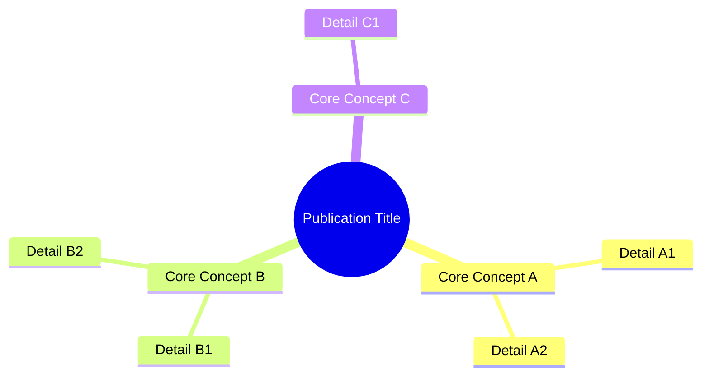
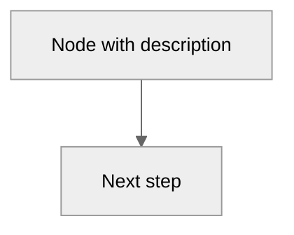

# Documentation Generation Methodology

**The methodology for methodology** — Standards, conventions, and patterns for generating publications and documentation in the Knowledge system.

> **Parent** : `methodology/methodology-documentation.md` — Racine de la famille documentation. Ce fichier en est un enfant spécialisé (Publication #18).

---

## Document Lifecycle

### When to Create a New Publication

A publication is born from a **real engineering need**, not speculation. Criteria:

| Trigger | Example |
|---------|---------|
| New capability demonstrated in practice | Web Page Visualization (#16) from diagnostic session |
| Pattern validated across 2+ projects | Session persistence (#3) from MPLIB + STM32 |
| Architectural discovery worth preserving | Distributed Minds (#4) from harvest protocol design |
| Process codified from repeated manual work | Normalize (#6) from repeated structure audits |
| Meta-analysis of accumulated knowledge | Architecture Analysis (#14) from system review |

### Publication Hierarchy

| Level | Notation | Example |
|-------|----------|---------|
| **Parent** | `#N` | #0 Knowledge System (master) |
| **Child** | `#N` with parent ref | #3 AI Persistence → child of #0 |
| **Sub-child** | `#Na` | #4a Dashboard → sub-child of #4 Distributed Minds |
| **Companion** | `#N` paired with `#M` | #14 Analysis + #15 Diagrams (written together) |

### Maturation Path

```
idea → notes/ (session memory)
    → minds/ (harvested, cross-session)
    → patterns/ or lessons/ (promoted, validated)
    → publication source (formalized)
    → web pages EN/FR (published)
```

**Decision points**: Promote from `minds/` when validated across 2+ projects or when the insight is architecturally significant. Publish when the content serves an audience beyond the developer.

---

## Source Document Structure

Every publication source (`publications/<slug>/v1/README.md`) follows this section order:

### 1. Title Block

```markdown
# Title — Descriptive Subtitle

**Publication #N · v1 · Month YYYY**

---
```

### 2. Authors (always present)

Two authors, both with role descriptions explaining their contribution to *this specific* publication.

### 3. Abstract (200–400 words)

Three patterns depending on publication type:

| Pattern | Use when | Structure |
|---------|----------|-----------|
| **Problem-Solution** | Documenting a fix or capability | Problem → How Knowledge solves it → Context |
| **Mechanism-first** | Technical guides and protocols | What it does → Why it's distinctive → Where it came from |
| **Living artifact** | Self-referencing hubs | What it is → Its role in the system → Recursive nature |

### 4. Mind Map Diagram (standard — after abstract)

**Every publication includes a mind map or overview diagram immediately after the abstract.** This is the reader's first visual anchor — a summary of the document's scope in one glance.



**Placement rule**: After the abstract, before the first content section. Both summary and complete web pages include this diagram. The mind map is reusable — it can appear in presentations, cross-references, and dashboards.

**Mind map conventions**:
- Root node: publication title or core concept
- First-level: 3–6 main topics covered
- Second-level: key details per topic (2–3 each)
- Keep it scannable — no more than ~25 total nodes
- Use `mindmap` type (Mermaid v10+)

### 5. Content Sections

Standard progression:

| Section | Purpose | Typical position |
|---------|---------|-----------------|
| **Context / Problem** | Why this exists — the engineering need | After mind map |
| **Solution / Mechanism** | How it works — architecture, protocol, approach | Middle |
| **Implementation** | Deep dives, code, workflows, examples | Middle-to-end |
| **Results / Impact** | Measured outcomes, real data | Near end |
| **Design Principles** | What we learned, what principles emerged | Near end |
| **Related Publications** | Cross-references to siblings/parents | End |

### 6. Footer

```markdown
---

*Authors: Martin Paquet & Claude (Anthropic, Opus 4.6)*
*Knowledge: [packetqc/knowledge](https://github.com/packetqc/knowledge)*
```

---

## Diagram Integration

### When to Use Diagrams

| Position | Diagram type | Purpose |
|----------|-------------|---------|
| **After abstract** | Mind map | Visual summary of document scope |
| **Problem section** | Flowchart | Visualize the issue being solved |
| **Solution section** | Flowchart / architecture | Show the mechanism |
| **Process sections** | Sequence / state diagram | Step-by-step flow |
| **Data sections** | Gantt / xychart | Timeline or metrics |
| **Architecture sections** | Graph / flowchart | Component relationships |

### Mermaid Type Selection

| Type | Syntax | Best for |
|------|--------|----------|
| `mindmap` | `mindmap` | Document overview, topic summary |
| `flowchart TB` | `flowchart TB` | Top-down hierarchies, data flow |
| `flowchart LR` | `flowchart LR` | Left-to-right pipelines, processes |
| `graph TB/LR` | `graph TB` | General DAG topology, architecture |
| `sequenceDiagram` | `sequenceDiagram` | Interaction sequences, API calls |
| `stateDiagram-v2` | `stateDiagram-v2` | State machines, lifecycle |
| `gantt` | `gantt` | Timelines, deployment phases |
| `xychart-beta` | `xychart-beta` | Data visualization, charts |

### Diagram Styling



- Always include `%%{init: {'theme': 'neutral'}}%%` for consistent rendering
- Use `classDef` for color-coding functional groups
- Descriptive node labels with `<br/>` for line breaks
- Clear directional arrows with labels on edges
- Subgraphs for logical grouping

### Source Preservation (v49)

When diagrams are pre-rendered to images (PNG for dual-theme support), the Mermaid source MUST be preserved in a `<details>` block immediately after the `<picture>` element:

```html
<picture>
  <source media="(prefers-color-scheme: dark)" srcset="assets/diagram-midnight.png">
  
</picture>
<details class="mermaid-source">
  <summary>Mermaid source</summary>


</details>
```

**Rule**: The image is the derived artifact. The source is the single source of truth. Never discard the source when deploying the artifact.

---

## Table Conventions

### Standard Table Types

| Type | Columns | Use case |
|------|---------|----------|
| **Feature table** | Feature · Description · Impact | Documenting capabilities |
| **Key-value** | Property · Value | Configuration, metadata |
| **Comparison** | Item · Column A · Column B | Before/after, options |
| **Inventory** | Entity · Status · Version · Details | Tracking collections |
| **Timeline** | Date · Event · Impact | History, evolution |

### Table Styling Rules

- Headers are clear and concise (1–3 words)
- **Bold** for emphasis in category labels
- `Backticks` for literal strings (code, files, commands)
- Emoji severity indicators for status: 🟢🟡🟠🔴⚪
- Em-dashes (—) for absent values, not "N/A"
- Markdown pipe syntax exclusively — no HTML tables in source

---

## Writing Style

### Formatting Conventions

| Convention | When | Example |
|------------|------|---------|
| **Bold** | First mention of a key concept | **Distributed Minds** architecture |
| *Italics* | Analogy, metaphor, quality names | the *persistent* quality |
| `Backticks` | Code, files, commands, branches | `harvest --healthcheck` |
| Em-dash (—) | Parenthetical detail | the system — designed for autonomy — adapts |
| ALL CAPS | Critical constraints (rare) | MUST, NEVER, CRITICAL |

### Reference Format

| Reference type | Format | Example |
|---------------|--------|---------|
| Publication | `#N` + title in parentheses | Publication #7 (Harvest Protocol) |
| File path | Relative from repo root in backticks | `methodology/session-protocol.md` |
| Web URL | `{{ relative_url }}` filter in Jekyll | `{{ '/publications/knowledge-system/' | relative_url }}` |
| Cross-project | `→P<n>` marker | Publication #1 →P1 |
| Issue/PR | `#N` | Issue #334, PR #345 |

### Tone

- Technical but narrative-driven
- Frames "why" before "what"
- Avoids jargon without context
- Includes human elements and real use cases
- French quality names preserved (*autosuffisant*, *concordant*)

---

## Three-Tier Publication Structure

### Tier Roles

| Tier | Location | Content | Audience |
|------|----------|---------|----------|
| **Source** | `publications/<slug>/v1/README.md` | Full canonical content | Developer, AI instances |
| **Summary** | `docs/publications/<slug>/index.md` | Abstract + key highlights + links to complete | Quick reader, social sharing |
| **Complete** | `docs/publications/<slug>/full/index.md` | Full documentation rendered on GitHub Pages | Deep reader, reference |

### Sync Rules

- **Source → Complete**: Full content, adapted for web (front matter, layout, cross-refs)
- **Source → Summary**: Abstract, key table, link to complete page. NOT a truncated copy — a curated overview
- **Mind map**: Present in ALL three tiers (source, summary, complete)
- **Diagrams**: All diagrams in complete page; key diagrams only in summary
- **Assets**: Source assets copied to `docs/` by `pub sync`

### Bilingual Mirroring

Every page exists as an EN/FR pair:

```
docs/publications/<slug>/index.md          ↔ docs/fr/publications/<slug>/index.md
docs/publications/<slug>/full/index.md     ↔ docs/fr/publications/<slug>/full/index.md
```

**Front matter differences**: `permalink` (adds `/fr/` prefix), `title` (translated), `description` (translated), `og_image` (uses `-fr-` variant).

**Content**: FR pages are full translations, not truncated versions. Tables, diagrams, and code stay in English (technical identifiers). Narrative text is translated.

---

## Web Page Front Matter Contract

### Required Fields

| Field | Format | Example |
|-------|--------|---------|
| `layout` | `publication` or `default` | `publication` |
| `title` | 40–80 characters | "Knowledge — Self-Evolving AI Engineering Intelligence" |
| `description` | One sentence, SEO-optimized | "Master publication for the knowledge system..." |
| `pub_id` | "Publication #N" or "Publication #N — Full" | "Publication #4a" |
| `version` | "vN" | "v2" |
| `date` | ISO YYYY-MM-DD | "2026-02-26" |
| `permalink` | `/publications/<slug>/` | `/publications/knowledge-system/` |
| `og_image` | `/assets/og/<slug>-<lang>-cayman.gif` | `/assets/og/knowledge-system-en-cayman.gif` |
| `keywords` | Comma-separated, 4–8 terms | "knowledge, bootstrap, methodology" |

---

## Quality Checklist

Before publishing or delivering a publication:

- [ ] All front matter fields present and correct
- [ ] Abstract answers "why" + "what" + context (200–400 words)
- [ ] Mind map diagram present after abstract
- [ ] Diagrams support the narrative (not decorative)
- [ ] Tables use consistent format (markdown pipes, bold headers)
- [ ] Three tiers created: source + summary + complete
- [ ] Bilingual mirrors exist (EN + FR) for all web pages
- [ ] Webcard generated (or placeholder) and `og_image` set
- [ ] Related publications linked
- [ ] Publication listed in EN/FR indexes
- [ ] Publication listed in `publications/README.md` master index
- [ ] Publication listed in CLAUDE.md table
- [ ] STORIES.md updated (if success story captured)
- [ ] Cross-references to sibling publications included
- [ ] `pub check` passes without errors

---

## Core Qualities Alignment

The Knowledge system embodies **13 core qualities** — each discovered through practice, each named in French (the system's native language). Every documentation convention in this meta-methodology reinforces one or more of these qualities. The documentation generation process is not separate from the system's identity — it IS the system expressing its qualities.

| Quality | How documentation generation reinforces it |
|---------|-------------------------------------------|
| **Autosuffisant** | Source README.md + plain markdown + Git = zero external dependencies for documentation |
| **Autonome** | `pub new` scaffolds complete structure; `pub sync` propagates changes; `pub check` validates — self-operating pipeline |
| **Concordant** | EN/FR mirrors, front matter validation, three-tier sync, `normalize` — structural integrity actively enforced |
| **Concis** | Summary pages are curated overviews (not truncated copies); mind maps give scope in one glance |
| **Interactif** | Mind maps reusable in dashboards; click-to-copy commands; severity icons for at-a-glance health |
| **Évolutif** | Each publication captures a real engineering discovery; the system grows as it documents |
| **Distribué** | Satellites produce publications independently; `harvest` pulls them to core; dual-origin links |
| **Persistant** | Source is versioned; web pages are derived artifacts; knowledge survives session boundaries |
| **Récursif** | This meta-methodology documents itself; Publication #0 was built by harvesting its children |
| **Sécuritaire** | No credentials in publications; fork-safe; owner-scoped URLs; anyone can clone safely |
| **Résilient** | Three tiers (source + summary + complete) = redundancy; `pub check` catches drift before delivery |
| **Structuré** | Hierarchical indexing (P#/S#/D#), standard section order, consistent front matter contract |
| **Intégré** | Publications feed GitHub Issues, Project boards, and webcards — documentation extends into platforms |

**The reading order applies to documentation**: *autosuffisant* (can we produce this with zero dependencies?) → *concordant* (are EN/FR mirrors in sync?) → *concis* (is the summary actually a summary?) → *récursif* (does the meta-methodology follow its own rules?).

---

## Universal Inheritance — Essential Files Update

**Every methodology inherits this obligation.** When any methodology-specific operation produces changes (new publication, new capability, structural fix, evolution entry), the following essential files MUST be evaluated for update:

| File | Update when | What to update |
|------|------------|----------------|
| `README.md` | Project description, key stats, or structure changes | Update description, badges, or feature summary |
| `NEWS.md` | Any deliverable produced | New entry under the relevant project section (date, change, version) |
| `PLAN.md` | New feature, capability, or roadmap change | What's New table and/or Ongoing section |
| `LINKS.md` | New web page URL created | Add URL to Essentials or Hubs section; update page counts |
| `VERSION.md` | Knowledge evolution entry or structural change | Update version/subversion |
| `CLAUDE.md` | New publication, command, or evolution | Publications table, Commands table, or Knowledge Evolution |
| `CHANGELOG.md` | Any issue created or PR merged | Add entry to the current date section (issue/PR, type, title, labels) |
| `STORIES.md` | New success story captured OR web publication updated | Add entry to Stories Index table with category and date. **Must stay in sync with `docs/publications/success-stories/index.md`** — the GitHub index reflects the web publication content. |
| `publications/README.md` | New publication created | Add entry to master Publication Index table |
| EN/FR publication indexes | New publication created | Add entry to both `docs/publications/index.md` and FR mirror |
| Profile pages (6) | New publication created | Add to all 6 profile pages (EN/FR hub, resume, full) — lower priority, can be batched |

### Web Mirror Rule — Essential Files Have Web Pages

**Every essential `.md` file in the repo root has bilingual web page mirrors in `docs/`.** When an essential file is updated, its web mirrors MUST be updated in the same commit.

| Essential file | Web mirror EN | Web mirror FR |
|---|---|---|
| `README.md` | `docs/index.md` | `docs/fr/index.md` |
| `PLAN.md` | `docs/plan/index.md` | `docs/fr/plan/index.md` |
| `NEWS.md` | `docs/news/index.md` | `docs/fr/news/index.md` |
| `LINKS.md` | `docs/links/index.md` | `docs/fr/links/index.md` |
| `CHANGELOG.md` | `docs/changelog/index.md` | `docs/fr/changelog/index.md` |
| — (web-only) | `docs/publications/index.md` | `docs/fr/publications/index.md` |

**The publications index pages** (`docs/publications/index.md` + FR mirror) are web-only — they have no root source file. They are the primary navigation for visitors and MUST be updated when a new publication is created.

**Rule**: If you update a root `.md` file, update its `docs/` mirrors. If you create a new publication, update the publications index pages. The visitor sees the web page, not the root file — a stale web mirror means the publication is invisible to the audience.

**Why this matters**: The root `.md` files are for developers and AI instances (read via `git clone`). The `docs/` pages are for visitors (read via GitHub Pages). Both audiences must see the same information. A new publication listed in CLAUDE.md but missing from the web index is invisible to every visitor.


### Inheritance Principle

Every methodology file in `methodology/` is a **child** of this meta-methodology. When a methodology-specific operation runs (e.g., `pub new`, `harvest --promote`, `project create`, `normalize --fix`), it inherits the universal checklist:

```
[methodology-specific steps]
    → produce deliverable (files, PRs, publications)
    → THEN: evaluate essential files for update
    → THEN: update web mirrors of any changed essential files
    → THEN: commit and deliver all changes together
    → THEN: completion gate (see below)
```

### Completion Gate — Two-Phase Pause

**Scope**: This gate applies to **user-requested tasks** — the work items the user explicitly asks for. It does NOT apply to Claude's internal execution plan steps (the sub-todos created to accomplish the task). Internal steps flow automatically; the gate fires when the user's task is delivered.

**Phase 1 — Confirm deliverable**: When the user's requested task is complete, pause and ask the user to confirm or approve the result. The confirmation prompt adapts to the session type (per interactive work session methodology):

| Session type | Confirmation prompt |
|-------------|-------------------|
| Diagnostic | "Diagnostic complete — does this resolve the issue?" |
| Documentation | "Publication/methodology delivered — ready to approve?" |
| Conception | "Design/architecture proposed — ready to validate?" |
| Design | "Implementation delivered — ready to review?" |
| Feature development | "Feature implemented — ready to verify?" |

**Phase 2 — Pre-save summary (v50) and compilations**: Once the user confirms Phase 1, the pre-save summary protocol triggers automatically. This compiles and displays a structured 5-section session report:

1. **Résumé** — synthesized from todo list and work performed
2. **Métriques** — compiled from `git diff`, PR API, todo count (format: `methodology/metrics-compilation.md`)
3. **Temps** — compiled from issue timestamps, commit timestamps, session flow (format: `methodology/time-compilation.md`)
4. **Livraisons** — delivery table (PRs, issues, files)
5. **Auto-évaluation** — methodology compliance check (issue created? verbatim posted? todo followed? three-channel active?)

The summary is **compiled automatically** — do not ask the user for metrics. An `AskUserQuestion` popup offers: "Save now" / "Continue working" / "Save + close issue".

**Issue comment integrity check** (v51): Before displaying the summary, compare session exchanges against posted issue comments. Post any missing 🧑/🤖 comments. Report in auto-évaluation: `Commentaires temps réel synchronisés | Oui (N/N)` or `Non (N postés / M attendus) — N manquants rattrapés au save`.

**Only after the user clicks "Save now"** does the session proceed to commit + push + PR. The user controls the pace.

**Rule**: Never skip this gate. Never jump to the next task after delivery. The flow is always: deliver → confirm → pre-save summary → save → next task.

---

## Incremental Compilation — Essential Routine

**Principle**: Compile metrics and time **incrementally at each task advancement**, not at the end of the session. This is a universal routine — it applies to every methodology, every session type, every project.

### Why Incremental

| Risk | Without incremental | With incremental |
|------|-------------------|-----------------|
| **Compaction** | Session compacted → compilation data lost | Each compilation committed → data survives |
| **Accuracy** | End-of-session reconstruction = estimates | Real-time capture = precise timestamps |
| **Effort** | 30+ min reconstruction at session end | 2 min per task advancement |
| **Continuity** | Must redo from scratch if interrupted | Resume from last compiled entry |

### The Three Compilation Rules

1. **Incremental** — compile at each task advancement (not batched to end)
2. **Anti-compaction** — commit compilation data regularly (progressive commits protect against context loss)
3. **Append-only** — continue from where you left off, never rebuild from scratch (unless data integrity requires it)

### Compilation Triggers

| Trigger | Action | Commit? |
|---------|--------|---------|
| User task confirmed (Phase 1) | Add metrics row + time row for completed task | Yes — progressive commit |
| 3+ tasks accumulated without compilation | Compile all pending rows | Yes — catch-up commit |
| Before risky operation | Compile current state | Yes — insurance |
| Session approaching compaction | Compile everything pending | Yes — anti-compaction |
| Session end (`save`) | Final compilation pass + summary row | Yes — delivery |

### What Gets Compiled

Two parallel sheets, same category grid:

**Metrics sheet** — what was produced per task:

| Field | Source | Example |
|-------|--------|---------|
| Todo/Task | Issue title or user request text | "Diagnostic sur les diagrammes" |
| Category | 🔍📝💡📋⚙️ | 🔍 Diagnostic |
| PRs | GitHub API count | 3 |
| Files | `git diff --stat` | 31 |
| Lines+/− | PR stats | +3,500 / −1,875 |
| Issues | Closed count | 1 |
| Deliverables | Publications, methodologies, stories | 1 pub, 2 pitfalls |

**Time sheet** — when and how long per task:

| Field | Source | Example |
|-------|--------|---------|
| Todo/Task | Issue title or user request text | "Diagnostic sur les diagrammes" |
| Category | 🔍📝💡📋⚙️ | 🔍 Diagnostic |
| Request time | Issue creation timestamp or conversation timestamp | 14:14 |
| Completion time | Last PR merged or task confirmed | 19:14 |
| Active duration | Sum of active work blocks (commits proximity) | 45 min |
| Phase | Hypothesis, creation, review, etc. | Root cause → fix |

### Task Integrity — Issue at Request Time (v51)

**The user's request IS the task description.** The "On task received" protocol (v51) formalizes this as a mandatory step **before any file is touched**:

1. **Extract title** from the user's message (heuristics: strip command prefixes, capitalize, concise)
2. **Confirm via `AskUserQuestion`** — proposed title + "Skip tracking" option
3. **Create GitHub issue** — `SESSION: <title> (YYYY-MM-DD)`, `SESSION` label
4. **Post verbatim first comment** — user's exact original request, unmodified
5. The issue creation timestamp = **the official start of the chrono**
6. The issue body = **the official task description** for compilation

**Verbatim rule**: The first comment on every session issue is the user's request **exactly as they wrote it** — no reformulation, no summarization. This is the frozen original record.

**When to create an issue** — the trigger is **"the user provides a work request"**, not "the session will modify files". Read-only sessions (reviews, validations, audits) are tasks too.

This closes the loop: user request → issue created → work done → issue closed → metrics + time compiled. Every step has a timestamp. Every task has a description. The compilation is evidence-based, not reconstructed.

### Appendability

Both sheets use the same category grid. Sessions append:

```
Session 2026-02-26
  🔍 Diagnostic:     45 min  |  3 PRs, 31 files
  📝 Documentation: 187 min  |  3 pubs, 48 files
  ─────────────────────────────────────────
  Total:            337 min  |  25 PRs, 100+ files

Session 2026-02-25 (appended)
  📝 Documentation: 240 min  |  2 pubs, 36 files
  ⚙️ Collateral:   120 min  |  10 PRs, 56 files
  ─────────────────────────────────────────
  Total:            480 min  |  15 PRs, 92 files

═══════════════════════════════════════════
Week:               817 min  |  40 PRs, 192+ files
```

### Related

- Publication #20 — Session Metrics & Time Compilation (full specification)
- `methodology/metrics-compilation.md` — Metrics compilation routine
- `methodology/time-compilation.md` — Time compilation routine

---

**The rule is simple**: if you changed something, check if the essential files need to know about it. A new publication? → NEWS.md + PLAN.md + LINKS.md + CLAUDE.md + publications/README.md + indexes + profiles. A new success story? → STORIES.md + NEWS.md. A new capability? → NEWS.md + PLAN.md. A structural fix? → NEWS.md. The essential files are the system's memory — if a change isn't reflected there, it didn't happen from the user's perspective.

**Auto-save applies**: The essential files update is part of the delivery step, not a separate command. One command = work + essential files + commit + push + PR. No post-command manual cleanup.

---

## Related

- `methodology/methodology-documentation.md` — **Parent** — Racine de la famille documentation
- Publication #18 — Documentation Generation Methodology (this methodology's publication)
- `methodology/methodology-documentation-audience.md` — 19-segment audience definition
- `methodology/methodology-documentation-web.md` — Jekyll processing chain
- `methodology/methodology-system-web-visualization.md` — Local rendering pipeline
- `methodology/methodology-system-web-export.md` — PDF/DOCX export pipeline
- Issue #355 — Creation and formalization session
