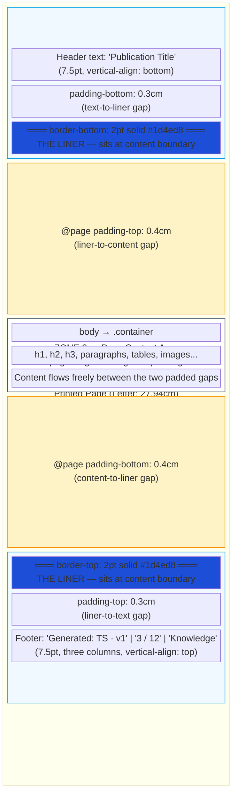

# Web Pagination & Export — Methodology

> Promoted from knowledge-live (P3) — T1 / P6 sessions 2026-02-25
> Source PRs: knowledge-live #42, #49, #52–#59

---

## CSS Paged Media Print Stack

Zero-dependency PDF export using browser-native capabilities:

| Layer | Technology | Role |
|-------|-----------|------|
| Trigger | `window.print()` | Opens browser print dialog |
| Layout | `@media print` | Hides non-content elements, adjusts typography |
| Pagination | `@page` CSS Paged Media | Margin boxes, page size, running headers/footers |
| Dynamic | JavaScript `beforeprint`/`afterprint` | Content injection, TOC analysis, filename control |

No external library (html2pdf.js, jsPDF, puppeteer). The browser IS the PDF renderer.

### Universal Three-Zone Page Layout

Every printed page is divided into exactly three zones. The `@page` margin defines zones 1 and 3 (where margin boxes live). `@page` padding creates the gap between the liners and the content. Zone 2 is the remaining space.



**Key architectural insight** — The margin box **fills the entire margin area**. The border (liner) always sits at the boundary between the margin area and the content area, regardless of `@page` margin size. The gap between the liner and page content is created by `@page { padding }`, not by remaining space in the margin area.

**Three independent spacings**:

| Spacing | Controlled by | Current value |
|---------|---------------|---------------|
| Text ↔ Liner | `padding` on margin box | 0.3cm |
| Liner ↔ Content | `@page { padding }` | 0.4cm |
| Liner position | `@page { margin }` | 1.8cm from page edge |

These are independent — tune them separately:
- `@page margin` controls how far the liner is from the page edge (and how much room the header/footer text has)
- `@page padding` controls the gap between the liner and the content (per page, on every page)
- Margin box `padding` controls the gap between the header/footer text and the liner

**Current values** (confirmed working):

```css
@page {
  margin: 1.8cm 1.5cm 1.8cm 1.5cm;  /* margin area = liner position */
  padding: 0.4cm 0;                   /* content inset from liner */
}
@top-left {
  padding-bottom: 0.3cm;              /* text-to-liner gap */
  border-bottom: 2pt solid #1d4ed8;   /* the liner */
}
@bottom-* {
  padding-top: 0.3cm;                 /* liner-to-text gap */
  border-top: 2pt solid #1d4ed8;      /* the liner */
}
```

**Cover page exception**: `@page :first` clears all margin boxes — no header, no footer, no liners on the first page.

### Running Header — Single-Box Liner

Use one `@top-left` box at `width: 100%` with `border-bottom`. Zero the other margin boxes:

```css
@top-left {
  content: "{{ page.title }}";
  width: 100%;
  border-bottom: 2pt solid #1d4ed8;
}
@top-center { content: ""; width: 0; }
@top-right  { content: ""; width: 0; }
```

**Why**: Two `@top-*` boxes with different `vertical-align` + `border-bottom` → Chrome renders borders at two heights → double liner. One box = guaranteed single liner.

### Three-Column Footer

JS-injected at print time via `printAs()`:

| Position | Content | Example |
|----------|---------|---------|
| `@bottom-left` | Generated timestamp + version | `Generated: 2026-02-25 14:30 · v1` |
| `@bottom-center` | Page numbers | `3 / 12` |
| `@bottom-right` | Brand | `Knowledge` |

### Cover Page — No Running Headers

`@page :first` clears all margin boxes:

```css
@page :first {
  @top-left    { content: ""; border: none; }
  @bottom-left { content: ""; }
  /* ... all others zeroed */
}
```

### Smart TOC Page Break

Not all publications have long TOCs. Forcing `page-break-before: always` on the first `h2` creates blank pages in short publications.

**Algorithm** (in `printAs()` JS):
1. Measure TOC element height
2. Compare against half-page threshold (Letter: 441px, Legal: 585px)
3. If TOC > half-page: force `page-break-before: always` on first `h2`
4. If TOC ≤ half-page: leave as `auto`
5. Restore on `afterprint`

### PDF Filename Control

`document.title` controls the browser's suggested PDF filename:

```javascript
// Before print
const cleanTitle = document.title
  .replace(/#/g, '')           // # → blank in some browsers
  .replace(/—/g, '-')          // em-dash → hyphen
  .replace(/[<>:"/\\|?*]/g, '') // filesystem-invalid chars
  .trim();
document.title = `${pubId} - ${cleanTitle} - ${version}.pdf`;

// After print — restore original
document.title = originalTitle;
```

### Letter/Legal Paper Size

Radio selector in export toolbar:

```html
<label><input type="radio" name="pubPageSize" value="letter" checked> Letter 8.5×11</label>
<label><input type="radio" name="pubPageSize" value="legal"> Legal 8.5×14</label>
```

The `printAs()` function injects `@page { size: letter; }` or `@page { size: legal; }` into a `<style>` tag before calling `window.print()`.

---

## Client-Side DOCX Export

### Convention Hierarchy

```
Universal Layout (design spec)
  └── Web Layout (live on GitHub Pages — source of truth)
        ├── PDF Export (derived — CSS Paged Media)
        └── DOCX Export (derived — HTML-to-Word blob)
```

Both PDF and DOCX are **sibling** derived export formats from the same source (web pages). Neither is the parent of the other. The universal/web layout `@media print` CSS is the reference for both.

### Universal Three-Zone Page Layout — DOCX

The DOCX export implements the same three-zone page layout as PDF, using **MSO elements** instead of CSS Paged Media margin boxes:

```
┌───────────────────────────────────────────────┐
│  ZONE 1 — Running Header (mso-element:header) │
│  Publication Title              Publication #N │
│  ═══ 2pt solid #1d4ed8 ═══════════════════════│
├───────────────────────────────────────────────┤
│                                               │
│  ZONE 2 — Page Content (div.Section1)         │
│  h2, h3, paragraphs, tables, images...        │
│  Content flows with automatic pagination      │
│                                               │
├───────────────────────────────────────────────┤
│  ═══ 2pt solid #1d4ed8 ═══════════════════════│
│  Generated: 2026-02-25 · v2   P/N   Knowledge │
│  ZONE 3 — Running Footer (mso-element:footer) │
└───────────────────────────────────────────────┘
```

**Cover page exception**: The first page (cover) uses `mso-first-header` and `mso-first-footer` which are empty — no header or footer on the cover page.

### HTML-to-Word Blob with MSO Page Sections

Pure client-side Word document generation with MSO elements for per-page running headers/footers:

```javascript
// MSO element definitions — placed before body content
var msoElements =
  // Running header (all pages except first)
  '<div style="mso-element:header" id="h1">' +
    '<table class="mso-hdr-table"><tr>' +
      '<td>Publication Title</td>' +
      '<td style="text-align:right;">Publication #N</td>' +
    '</tr></table>' +
  '</div>' +
  // Running footer (all pages except first)
  '<div style="mso-element:footer" id="f1">' +
    '<table class="mso-ftr-table"><tr>' +
      '<td>Generated: 2026-02-25 · v2</td>' +
      '<td style="text-align:center;">PAGE / NUMPAGES</td>' +
      '<td style="text-align:right;">Knowledge</td>' +
    '</tr></table>' +
  '</div>' +
  // Empty first-page header/footer (cover page)
  '<div style="mso-element:header" id="fh1"><p>&nbsp;</p></div>' +
  '<div style="mso-element:footer" id="ff1"><p>&nbsp;</p></div>';

// Document assembly
var html = '<html xmlns:o="urn:schemas-microsoft-com:office:office"' +
  ' xmlns:w="urn:schemas-microsoft-com:office:word"' +
  ' xmlns:v="urn:schemas-microsoft-com:vml"' +
  ' xmlns="http://www.w3.org/TR/REC-html40">' +
  '<head><meta charset="utf-8">' +
  '<xml><w:WordDocument><w:View>Print</w:View>' +
  '<w:Zoom>100</w:Zoom></w:WordDocument></xml>' +
  '<style>' + css + '</style></head>' +
  '<body>' + msoElements +
  '<div class="Section1">' + contentHTML + '</div>' +
  '</body></html>';
```

Key MSO page section CSS:

```css
@page Section1 {
  size: letter;
  margin: 1.8cm 1.5cm 1.8cm 1.5cm;
  mso-header-margin: 0.8cm;
  mso-footer-margin: 0.8cm;
  mso-header: h1;          /* running header for all pages */
  mso-footer: f1;          /* running footer for all pages */
  mso-first-header: fh1;   /* empty header for cover page */
  mso-first-footer: ff1;   /* empty footer for cover page */
}
div.Section1 { page: Section1; }
```

- MIME type `application/msword` → `.doc` extension
- Word, LibreOffice, Google Docs all open the HTML-in-Word format
- `<w:WordDocument>` XML sets print view and zoom level
- **No `<w:DoNotOptimizeForBrowser/>`** — this directive restricts MS365 online from renaming/editing
- MSO elements provide **per-page** running header/footer (not just once in content)
- Cover page gets empty header/footer via `mso-first-header`/`mso-first-footer`

### Element Cleanup

All web-only elements stripped from the cloned container before wrapping:

| Element | CSS class | Why removed |
|---------|-----------|-------------|
| Export toolbar | `.pub-export-toolbar` | UI control — not content |
| Back links | `.back-link` | Navigation — not content |
| Top bar | `.pub-topbar` | Navigation bar with status tag |
| Cross-references | `.pub-crossrefs` | Auto-generated keyword links |
| Language bar | `.pub-lang-bar` | Language switcher |
| Webcard header | `.webcard-header` | OG image banner |
| Board widgets | `.board-widget`, `.board-section-widget` | Live project board |
| Toast notification | `.copy-toast` | Ephemeral UI feedback |
| Status tag | `.page-status-tag` | Web-only version indicator |
| Version banner | `.pub-version-banner` | Publication/Generated/Authors metadata block |
| Mermaid source | `pre code.language-mermaid` | Raw mermaid code blocks |

This matches the `@media print` hide list in the PDF export — same elements hidden, same clean output.

### Cover Page

The cover page div (`#pub-cover-page`) exists in the DOM but is `display:none` on the web layout. At DOCX export time, it is cloned from the live DOM, made visible, and inserted at the top of the document:

```javascript
var coverPage = document.getElementById('pub-cover-page');
if (coverPage) {
  var coverClone = coverPage.cloneNode(true);
  coverClone.style.display = 'block';
  var coverGen = coverClone.querySelector('#coverGenDate');
  if (coverGen) coverGen.textContent = ts;
  clone.insertBefore(coverClone, clone.firstChild);
}
var origH1 = clone.querySelector('h1');
if (origH1) origH1.style.display = 'none';
```

Cover page CSS: min-height 680pt (fills page), `mso-break-after:section-break` for Word-compatible page break. The MSO `mso-first-header:fh1` and `mso-first-footer:ff1` ensure the cover page has NO header/footer — matching the PDF `@page :first` behavior.

### Header/Footer — MSO Per-Page Running Elements

The DOCX export uses **MSO elements** (`mso-element:header`, `mso-element:footer`) for true per-page running headers/footers. These appear on **every page** except the cover page:

| MSO Element | ID | Purpose |
|-------------|-----|---------|
| `mso-element:header` | `h1` | Running header — publication title + pub ID with blue liner |
| `mso-element:footer` | `f1` | Running footer — timestamp + page numbers + brand with blue liner |
| `mso-element:header` | `fh1` | First page header — empty (cover page has no header) |
| `mso-element:footer` | `ff1` | First page footer — empty (cover page has no footer) |

**Header structure**: Two-column table with blue bottom border (2pt solid #1d4ed8). Left: publication title. Right: publication ID.

**Footer structure**: Three-column table with blue top border (2pt solid #1d4ed8). Left: generated timestamp + version. Center: page number / total pages (via `mso-field-code: PAGE` / `mso-field-code: NUMPAGES`). Right: "Knowledge" brand.

This matches the PDF three-column footer layout: `@bottom-left` (timestamp), `@bottom-center` (page N/M), `@bottom-right` (brand).

**How MSO elements work**: The `mso-element:header/footer` divs are placed in the HTML body BEFORE the `<div class="Section1">` content. Word reads them as header/footer definitions and renders them in the page margin zones. The `@page Section1` CSS connects section content to its header/footer IDs via `mso-header`, `mso-footer`, `mso-first-header`, `mso-first-footer`.

### Page Content Layout — Print-Aligned Sizing

DOCX uses the same sizing as the print `@media print` CSS:

| Property | Web | Print / DOCX |
|----------|-----|-------------|
| Body font | 16px | 10pt |
| Line height | 1.5 | 1.6 |
| h2 size | 1.5em | 13pt |
| h3 size | 1.25em | 11pt |
| h2 color | Cayman teal | #111 (dark) |
| Table font | 0.82rem | 9pt |
| Code font | — | 8.5pt |

### Table Styles — Cayman Print Theme

DOCX tables match the universal print layout (not the web layout):

```css
/* Cayman print tables — blue headers, no side borders */
table { border-collapse: collapse; width: 100%; font-size: 9pt; line-height: 1.4; }
th, td { border: none; border-bottom: 1px solid #93c5fd; padding: 0.35rem 0.5rem; text-align: left; }
th { background: #dbeafe; font-weight: 600; white-space: nowrap;
     border-bottom: 2px solid #1d4ed8; color: #0f172a; }
```

### Pie Charts — SVG to PNG via Canvas (async)

Word does not support CSS `conic-gradient()` or inline `<svg>` elements, and also **cannot render `data:image/svg+xml` data URIs** in ``. The SVG data URI is silently ignored — the image is simply not shown. At DOCX export time, pie chart elements are converted to PNG images via the same canvas→PNG pattern used for Mermaid diagrams:

```javascript
var promises = [];
clone.querySelectorAll('[class*="pie-"]').forEach(function(el) {
  var m = el.className.match(/pie-(\d+)-(\d+)/);
  if (!m) return;
  var pct = parseInt(m[1], 10);
  // ... SVG path calculation (angle math unchanged) ...
  var svgXml = '<svg xmlns="http://www.w3.org/2000/svg" ...>...</svg>';
  var svgUrl = 'data:image/svg+xml;charset=utf-8,' + encodeURIComponent(svgXml);
  var p = new Promise(function(resolve) {
    var loader = new Image();
    loader.onload = function() {
      var canvas = document.createElement('canvas');
      canvas.width = 48; canvas.height = 48;
      var ctx = canvas.getContext('2d');
      ctx.fillStyle = '#ffffff';
      ctx.fillRect(0, 0, 48, 48);
      ctx.drawImage(loader, 0, 0, 48, 48);
      var img = document.createElement('img');
      img.src = canvas.toDataURL('image/png');  // ← PNG, not SVG data URI
      img.width = 48; img.height = 48;
      el.parentNode.replaceChild(img, el);
      resolve();
    };
    loader.onerror = resolve;
    loader.src = svgUrl;
  });
  promises.push(p);
});
// ... Mermaid also pushes to pngPromises ...
Promise.all(promises.concat(pngPromises)).then(function() { /* build blob */ });
```

**Why canvas instead of SVG data URI**: Word only renders `data:image/png` and `data:image/jpeg` in ``. SVG data URIs (`data:image/svg+xml`) are silently ignored. Using `Image.onload` with a canvas to convert SVG→PNG produces a Word-renderable image. Since `Image.onload` is async, each pie conversion is a Promise added to the same array as Mermaid promises — both complete before the HTML blob is built.

Colors match the web pie chart palette: teal (#0f766e) on light teal (#99f6e4).

### Mermaid Diagrams — SVG to PNG via Canvas (async)

Mermaid renders `<pre><code class="language-mermaid">` → `<div class="mermaid"><svg>...</svg></div>` on the web page. The DOCX export uses the same canvas→PNG pattern as pie charts:

1. Measures live SVG dimensions from the rendered page (clone elements have no layout)
2. Strips mermaid source blocks (`pre code.language-mermaid`)
3. Converts each rendered SVG to PNG via canvas: SVG→`` load→canvas→`toDataURL('image/png')`
4. Removes empty `.mermaid` divs (no rendered SVG = mermaid hadn't run yet)

```javascript
var liveMermaidSvgs = Array.from(document.querySelectorAll('.mermaid svg'));
var mermaidDims = liveMermaidSvgs.map(function(svgEl) {
  var rect = svgEl.getBoundingClientRect();
  // ... measure width/height from live DOM (clone has no layout) ...
  return { w: Math.round(w) || 700, h: Math.round(h) || 300 };
});

var pngPromises = cloneMermaidEls.map(function(el, idx) {
  return new Promise(function(resolve) {
    var svgStr = new XMLSerializer().serializeToString(svgEl);
    var svgUrl = 'data:image/svg+xml;charset=utf-8,' + encodeURIComponent(svgStr);
    var loader = new Image();
    loader.onload = function() {
      var canvas = document.createElement('canvas');
      canvas.width = dim.w; canvas.height = dim.h;
      var ctx = canvas.getContext('2d');
      ctx.fillStyle = '#ffffff';
      ctx.fillRect(0, 0, dim.w, dim.h);
      ctx.drawImage(loader, 0, 0, dim.w, dim.h);
      var img = document.createElement('img');
      img.src = canvas.toDataURL('image/png');  // ← PNG, not SVG data URI
      el.parentNode.replaceChild(img, el);
      resolve();
    };
    loader.src = svgUrl;
  });
});
Promise.all(promises.concat(pngPromises)).then(function() { /* build blob */ });
```

**Why canvas→PNG instead of SVG data URI**: Word only renders `data:image/png` and `data:image/jpeg` — SVG data URIs are silently ignored. The canvas approach also ensures correct dimensions (width/height captured from the live rendered SVG before cloning).

**Known limitation**: If mermaid hasn't rendered yet (CDN slow, page not fully loaded), diagrams will be missing. The user should wait for the page to fully load before exporting. This affects the **delivery calendar** (Gantt chart) which is rendered by mermaid.

### Emoji — Color Icons via Canvas PNG

Word's HTML renderer falls back to monochrome Unicode glyphs for emoji — it does not invoke system color emoji fonts (COLR/SBIX). PDF uses the browser's native renderer and shows full color. To match PDF fidelity in DOCX, emoji are converted to canvas-rendered PNG images at export time:

```javascript
function emojiToPng(ch) {
  var canvas = document.createElement('canvas');
  canvas.width = 32; canvas.height = 32;
  var ctx = canvas.getContext('2d');
  ctx.font = '26px "Segoe UI Emoji","Apple Color Emoji","Noto Color Emoji",serif';
  ctx.textAlign = 'center';
  ctx.textBaseline = 'middle';
  ctx.fillText(ch, 16, 16);          // Browser canvas renders with color emoji font
  return canvas.toDataURL('image/png');
}
// Walk all text nodes, split on emoji, replace each with 
var walker = document.createTreeWalker(clone, NodeFilter.SHOW_TEXT, null, false);
var textNodes = [];
while (walker.nextNode()) { textNodes.push(walker.currentNode); }
textNodes.forEach(function(tn) {
  if (!/\p{Emoji_Presentation}/u.test(tn.textContent)) return;
  var parts = tn.textContent.split(/(\p{Emoji_Presentation}\uFE0F?)/gu);
  if (parts.length <= 1) return;
  var frag = document.createDocumentFragment();
  parts.forEach(function(p) {
    if (!p) return;
    if (/\p{Emoji_Presentation}/u.test(p)) {
      var img = document.createElement('img');
      img.src = emojiToPng(p);
      img.width = 18; img.height = 18;
      img.setAttribute('style', 'vertical-align:middle;display:inline-block;margin:0 1pt;');
      frag.appendChild(img);
    } else {
      frag.appendChild(document.createTextNode(p));
    }
  });
  tn.parentNode.replaceChild(frag, tn);
});
```

**Why canvas**: `ctx.fillText()` uses the browser's own emoji renderer — the same system font that produces color glyphs in PDF. The resulting PNG is identical to what the browser/PDF shows. `canvas.fillText()` is synchronous so no Promises are needed (unlike pie charts and Mermaid which use async `Image.onload`).

**Regex**: `\p{Emoji_Presentation}` matches Unicode emoji that have a graphical presentation (includes 🧠🌾🔄🚀⚖️📡🔒🧬⚙️). The `\uFE0F?` variation selector is included to handle explicit emoji presentation sequences.

### Story Rows — flex→table Conversion (DOCX)

Word's HTML renderer **completely ignores `display:flex`**. Story rows use flex-based two-column layout (`.story-row-left` | `.story-row-right`), which are "virtual rows" — not real HTML tables, just flex divs that look like table rows. In DOCX these stack vertically instead of appearing side-by-side.

**Web/PDF CSS** (browser renders correctly):
```css
.story-row { display: flex; border-bottom: 1px solid #ddd; border-top: 1px solid #ddd; }
.story-row + .story-row { border-top: none; }   /* CSS adjacent sibling — ignored by Word */
.story-row:last-child { border: none; }          /* CSS pseudo-selector — ignored by Word */
.story-row-left { width: 110pt; font-weight: 600; color: #555; }
.story-row-right { flex: 1; }
```

**DOCX fix**: JS converts each `.story-row` div to a real 2-cell `<table>` before building the blob. Border logic is applied inline (no CSS pseudo-selectors needed):

```javascript
clone.querySelectorAll('.story-section').forEach(function(section) {
  var rows = Array.from(section.querySelectorAll('.story-row'));
  rows.forEach(function(row, i) {
    var left  = row.querySelector('.story-row-left');
    var right = row.querySelector('.story-row-right');
    if (!left || !right) return;
    var isFirst = (i === 0);
    var isLast  = (i === rows.length - 1);
    var bTop    = isLast ? 'none' : (isFirst ? '1px solid #ddd' : 'none');
    var bBottom = isLast ? 'none' : '1px solid #ddd';
    var tbl = document.createElement('table');
    tbl.setAttribute('style',
      'width:100%;border-collapse:collapse;font-size:9pt;line-height:1.4;' +
      'border-top:' + bTop + ';border-bottom:' + bBottom + ';page-break-inside:avoid;');
    var tr = document.createElement('tr');
    var tdL = document.createElement('td');
    tdL.setAttribute('style',
      'width:110pt;min-width:110pt;vertical-align:top;' +
      'padding:0.15cm 0.3cm;font-weight:600;color:#555;border:none;');
    tdL.innerHTML = left.innerHTML;       // ← includes Bug D inline styles
    var tdR = document.createElement('td');
    tdR.setAttribute('style', 'vertical-align:top;padding:0.15cm 0.3cm;border:none;');
    tdR.innerHTML = right.innerHTML;      // ← includes Bug D inline styles
    tr.appendChild(tdL); tr.appendChild(tdR);
    tbl.appendChild(tr);
    row.parentNode.replaceChild(tbl, row);
  });
});
```

**Execution order**: Inner table first-cell styles (Bug D) must be applied **before** this conversion, because the conversion uses `innerHTML` to copy content — the inline styles baked in by Bug D are preserved in the copy.

### Story Row Inner Tables — First-Cell Styling (DOCX)

Inside the right column, key-value pairs use a `<table>` whose `td:first-child` (the key cell) should be bold, narrow, and muted — matching the web layout. Word ignores CSS `:first-child` pseudo-selectors, so these styles must be applied as inline styles via JS before the flex→table conversion:

```javascript
// Apply BEFORE Bug C (flex→table) so styles are preserved in innerHTML copy
clone.querySelectorAll('.story-row-right table td:first-child').forEach(function(td) {
  td.style.whiteSpace = 'nowrap';
  td.style.fontWeight = '600';
  td.style.width = '140px';
  td.style.color = '#555';
  td.style.border = 'none';
});
// TOC: first-column links → blue + underline (Word ignores CSS :first-child)
clone.querySelectorAll('.toc table td:first-child a').forEach(function(a) {
  a.style.color = '#1d4ed8';
  a.style.textDecoration = 'underline';
});
```

### TOC Styling

TOC receives clean print formatting — no web background/border:

```css
.toc { background: none; border: none; border-radius: 0;
       padding: 0 0 0.5cm 0; margin: 0 0 0.8cm 0; page-break-inside: avoid; }
.toc-title { font-size: 11pt; font-weight: 700; color: #111; }
.toc li { font-size: 9.5pt; line-height: 1.8; }
.toc li a { color: #1d4ed8; text-decoration: underline; }
```

### Filename Convention

Same pattern as PDF: `PUB_ID - Title - VER.doc`

```javascript
// Characters stripped: # — – < > : " / \ | ? *
var safeId    = pubId.replace(/[\u2014\u2013<>:"/\\|?*#]/g, '').trim();
var safeTitle = pubTitle.replace(/[\u2014\u2013]/g, ' - ').replace(/[<>:"/\\|?*#]/g, '').trim();
var docTitle  = (safeId ? safeId + ' - ' : '') + safeTitle + (pubVer ? ' - ' + pubVer : '');
```

### Word HTML Rendering — Known Limitations

Word's HTML renderer ignores a specific set of CSS features that browsers support. This table is the authoritative reference for DOCX export workarounds:

| Browser CSS/feature | Word renders | Canonical fix |
|---------------------|-------------|---------------|
| `display:flex` | Ignored — blocks stack vertically | JS flex→table conversion |
| `padding-top` on div | Ignored | Use `margin-top` inline style |
| `border-top` on empty div | Ignored | Replace with `<p style="border-bottom:...">` |
| `:first-child`, `:last-child`, `:nth-child` | CSS pseudo-selectors ignored | JS `querySelectorAll` + inline styles |
| `data:image/svg+xml` in `` | Not rendered (silent) | Canvas→PNG data URI |
| Inline `<svg>` elements | Not rendered | Canvas→PNG data URI |
| Color emoji font (COLR/SBIX) | Monochrome Unicode glyph | Canvas `fillText`→PNG data URI |
| CSS adjacent sibling `.a + .a` | Ignored | JS index-based inline styles |

### Canvas → PNG — Canonical Pattern for Browser-Rendered Graphics

The canonical approach for any browser-rendered graphic that Word cannot display:

```
Browser-rendered graphic → SVG/text → <Image> load → canvas → toDataURL('image/png') → 
```

Applied to:
- **Mermaid diagrams** (SVG): `XMLSerializer` → `encodeURIComponent` → `Image.onload` → canvas → PNG (async)
- **Pie charts** (SVG): inline SVG XML → `encodeURIComponent` → `Image.onload` → canvas → PNG (async)
- **Color emoji** (text): `ctx.fillText()` using color emoji font → PNG (sync — `fillText` is not async)

All three use `canvas.toDataURL('image/png')` as the final step. The async variants (Mermaid, pie) return Promises collected in an array; `Promise.all(promises.concat(pngPromises)).then(...)` ensures all conversions complete before the HTML blob is built. The sync variant (emoji) runs before the Promise array is processed.

### Limitations — PDF vs DOCX

| Feature | PDF | DOCX |
|---------|-----|------|
| Running headers/footers | Per-page CSS Paged Media margin boxes | Per-page MSO elements (`mso-element:header/footer`) |
| Page numbers | `counter(page) / counter(pages)` | `mso-field-code: PAGE / NUMPAGES` |
| Smart TOC break | JS measures height, conditional page break | Fixed cover break only |
| Paper size selector | Letter/Legal radio in toolbar | Not applicable (Word handles this) |
| Liner-to-content gap | `@page { padding: 0.4cm 0 }` | `mso-header-margin` / `mso-footer-margin` |
| Pie charts | Browser renders conic-gradient natively | SVG→canvas→PNG at export (async Promise) |
| Mermaid diagrams | Browser renders SVGs natively | SVG→canvas→PNG at export (async Promise, if rendered before export) |
| Color emoji | Browser uses COLR/SBIX color font | Canvas `fillText`→PNG at export (sync) |
| Flex layout (story rows) | `display:flex` side-by-side columns | JS flex→table conversion at export |
| CSS `:first-child` | Pseudo-selectors resolved by browser | JS `querySelectorAll` + inline styles at export |
| Cover page | `@page :first` clears margin boxes | `mso-first-header/footer` set to empty elements |
| Color printing | `print-color-adjust: exact` | `print-color-adjust: exact` in CSS |

**PDF vs DOCX parity**: The MSO element approach achieves near-parity with PDF for the three-zone layout. Both formats now have per-page running headers (zone 1), flowing content (zone 2), and per-page running footers with page numbers (zone 3). The cover page has no header/footer in both formats.

---

## Language Bar — Template Injection

Auto-generated from `page.permalink` in the layout — no front matter flag needed:

```liquid

<div class="pub-lang-bar">
  <span><strong>Langues / Languages</strong> : Français (cette page)</span>
  <a href="{{ page.permalink | remove: '/fr' | relative_url }}">English</a>
</div>

<div class="pub-lang-bar">
  <span><strong>Languages / Langues</strong>: English (this page)</span>
  <a href="{{ '/fr' | append: page.permalink | relative_url }}">Français</a>
</div>

```

**Position**: First element of `.container`, above `pub-topbar`.
**Print**: Hidden via `display: none !important` + JS safety net.

---

## Satellite as Pre-Production Instance

The development model for layout features:

```
knowledge-live (dev/pre-prod)     →  validate live on GitHub Pages
    → harvest to core (this file)  →  promote to production
knowledge (production)             →  all satellites inherit on next wakeup
```

Features are tested on the satellite's live GitHub Pages instance before being promoted to core. The satellite IS the staging environment.

---

*Source: knowledge-live T1/P6 — Universal layout pagination for exportation and web pages*
*GitHub issue: packetqc/knowledge#268*
