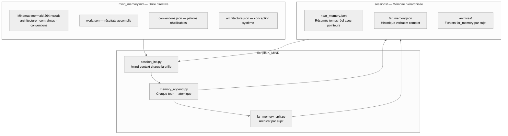

# Persistance de session IA — Documentation complète
{: #pub-title}

**Table des matières**

| | |
|---|---|
| [Auteurs](#auteurs) | Auteurs de la publication |
| [Résumé](#résumé) | Vue d'ensemble de la méthodologie de persistance |
| [Le problème : IA sans état dans un monde à état](#le-problème--ia-sans-état-dans-un-monde-à-état) | Ce qui est perdu entre les sessions et son impact |
| [La solution : Persistance à trois composants](#la-solution--persistance-à-trois-composants) | Grille directive + mémoire hiérarchisée + scripts K_MIND |
| &nbsp;&nbsp;[Composant 1 : mind_memory.md — Grille directive](#composant-1--mind_memorymd--grille-directive) | Mindmap mermaid de 264 nœuds |
| &nbsp;&nbsp;[Composant 2 : sessions/ — Mémoire hiérarchisée](#composant-2--sessions--mémoire-hiérarchisée) | Mémoire proche, lointaine et archivée |
| &nbsp;&nbsp;[Composant 3 : Scripts K_MIND — Cycle de vie](#composant-3--scripts-k_mind--cycle-de-vie) | session_init, memory_append, far_memory_split |
| [L'analogie RTOS](#lanalogie-rtos) | Sessions comme threads, mémoire comme état partagé |
| [Free-Guy Sunglasses](#free-guy-sunglasses) | Analogie NPC vers conscience avec les lunettes |
| [Résultats mesurés](#résultats-mesurés) | Améliorations quantifiées par la persistance |
| [Évolution K1.0 → K2.0](#évolution-k10--k20) | Comment l'architecture de persistance a évolué |
| [Portabilité](#portabilité) | Configuration rapide pour tout nouveau projet |
| [Principes de conception](#principes-de-conception) | Pourquoi des fichiers, pourquoi une mémoire hiérarchisée |
| [Limitations et travaux futurs](#limitations-et-travaux-futurs) | Fenêtre de contexte, recherche et concurrence |
| [Publications liées](#publications-liées) | Publications connexes du système de connaissances |

## Auteurs

**Martin Paquet** — Analyste programmeur en sécurité réseau, administrateur de sécurité réseau et système, et concepteur programmeur de logiciels embarqués. Spécialisé dans les architectures RTOS, la sécurité matérielle et les pipelines de données haute performance sur plateformes ARM Cortex-M. Architecte de la librairie de modules MPLIB et créateur de la méthodologie de persistance de session documentée ici. L'intuition de Martin : les sessions de codage IA sont analogues aux threads RTOS — elles nécessitent un contexte isolé, des régions de mémoire partagée et une gestion explicite du cycle de vie. Basé au Québec, Canada.

**Claude** (Anthropic, Opus 4.6) — Assistant de codage IA opérant dans le CLI Claude Code. Dans cette collaboration, Claude est à la fois praticien et sujet de la méthodologie de persistance — il lit la mindmap et les fichiers mémoire pour récupérer le contexte, exécute des scripts pour le préserver, et suit la grille directive qui définit comment faire les deux.

---

## Résumé

Les assistants de codage IA opèrent dans des sessions sans état. Chaque nouvelle conversation repart de zéro — aucune mémoire du travail précédent, aucun contexte sur les décisions prises hier, aucune conscience des bugs corrigés la semaine dernière.

Cette publication documente une **méthodologie de persistance de session** qui donne aux assistants de codage IA une mémoire durable inter-sessions. L'approche Knowledge 2.0 utilise trois composants : une **grille directive** (`mind_memory.md` — mindmap mermaid de 264 nœuds encodant l'identité projet, l'architecture, les conventions et l'état du travail), une **mémoire de session hiérarchisée** (`sessions/` avec `near_memory.json` pour les résumés, `far_memory.json` pour l'historique verbatim, et `archives/` pour les enregistrements découpés par sujet), et des **scripts K_MIND** (`session_init.py`, `memory_append.py`, `far_memory_split.py`) qui gèrent le cycle de persistance automatiquement — à chaque tour.

La méthodologie a été développée et validée pendant la construction d'un pipeline d'ingestion SQLite haute performance sur un STM32N6570-DK (Cortex-M55 @ 800 MHz). Sur 10+ sessions en deux jours, l'IA a maintenu une conscience continue de l'état du projet. Elle a depuis évolué de la conception K1.0 originale (CLAUDE.md + notes/ + wakeup/save) vers l'architecture multi-module K2.0 décrite ici.

---

## Le problème : IA sans état dans un monde à état

L'ingénierie logicielle est intrinsèquement à état. Chaque décision s'appuie sur les décisions précédentes.

| Ce qui est perdu | Impact |
|------------------|--------|
| **Décisions architecturales** | L'IA re-propose des approches déjà rejetées |
| **Historique des bugs** | L'IA ne sait pas quels bugs ont déjà été corrigés |
| **Conventions de code** | L'IA applique inconsistamment les patterns spécifiques au projet |
| **Préférences du collaborateur** | L'IA oublie le style de communication, la langue, les habitudes |
| **Travail en cours** | L'IA repart de zéro sur des tâches partiellement terminées |

Résultat : l'ingénieur passe les 10–15 premières minutes de chaque session à ré-expliquer le contexte.

---

## La solution : Persistance à trois composants



### Sécurité : Fork & Clone

Si vous forkez ou clonez un dépôt utilisant cette méthodologie de persistance, le système est **limité au propriétaire** et isolé par environnement :

| Composant | Sécurité |
|-----------|----------|
| `mind_memory.md` | Contient la grille directive — aucun identifiant, jeton ou secret |
| `sessions/` | Contient la mémoire de session — par utilisateur, démarre vierge pour chaque nouveau propriétaire |
| Scripts K_MIND | Opèrent dans l'environnement du forkeur — accès en écriture limité à ses propres branches |
| JSON de domaine | Architecture, conventions, travail — méthodologie publique, aucune donnée sensible |

L'architecture à trois composants est un patron réutilisable. Aucune donnée du propriétaire original ne fuit dans un fork au-delà de la méthodologie intentionnellement publique.

### Composant 1 : mind_memory.md — Grille directive

La mindmap est la **constitution** du projet. Elle encode tout ce qui est vrai à travers toutes les sessions sous forme d'une mindmap mermaid de 264 nœuds organisée en six groupes comportementaux :

| Groupe | Objectif | Exemple |
|--------|----------|---------|
| **architecture** | Règles de conception système — COMMENT vous travaillez | Conception des modules, niveaux mémoire, rôles des scripts |
| **constraints** | Limites dures — FRONTIÈRES à ne jamais violer | Limites de contexte, règles de sécurité |
| **conventions** | Patrons — COMMENT vous exécutez | Conventions d'affichage, méthodologies |
| **work** | Résultats accomplis — ÉTAT | En cours, validation, approbation |
| **session** | Contexte courant — CONTEXTE | Catégories mémoire proche, conversation |
| **documentation** | Structure doc — RÉFÉRENCES | Interfaces, publications, profil |

**Principe clé** : La mindmap est **déclarative, pas narrative**. Elle déclare des faits et des règles, pas des histoires. Le narratif vit dans `sessions/`.

**Propriété architecturale clé** : Chaque nœud est une directive. À chaque chargement, Claude parcourt l'arbre complet et internalise chaque nœud comme une règle à suivre. C'est le « moment des lunettes » — la transition de PNJ à CONSCIENT.

### Composant 2 : sessions/ — Mémoire hiérarchisée

La mémoire de session utilise trois niveaux avec granularité croissante :

| Niveau | Fichier | Contenu | Rôle |
|--------|---------|---------|------|
| **Mémoire proche** | `near_memory.json` | Résumés en une ligne avec pointeurs mind-ref | Porteur de contexte principal (~8,5K tokens) |
| **Mémoire lointaine** | `far_memory.json` | Historique verbatim complet de la conversation | Enregistrement complet |
| **Archives** | `archives/` | Fichiers far_memory découpés par sujet | Stockage longue durée par sujet |

**Ce qui est enregistré** (via `memory_append.py` chaque tour) :

| Catégorie | Exemples |
|-----------|---------|
| Message exact de l'utilisateur | Mot pour mot, complet |
| Sortie complète de l'assistant | Tout le texte, tableaux, code, diagrammes |
| Résumé en une ligne | Entrée mémoire proche |
| Pointeurs mind-ref | Quels nœuds mindmap sont pertinents |
| Appels d'outils | Quels outils ont été utilisés et pourquoi |

**Ce qui n'est pas enregistré** :

| Exclu | Raison |
|-------|--------|
| Prompts système | Déjà dans le contexte |
| Contenus de résultats d'outils | Trop volumineux, déjà dans far_memory |
| Résumés dupliqués | Near memory est append-only par tour |

### Composant 3 : Scripts K_MIND — Cycle de vie

Le cycle de vie est géré par des scripts déterministes — Claude fournit l'intelligence (résumés, noms de sujets) comme arguments :

#### Init (`session_init.py` + `/mind-context`)

| Étape | Script/Skill | Résultat |
|-------|-------------|---------|
| 1 | `session_init.py --session-id "<id>"` | Fichiers de session initialisés ou repris |
| 2 | `/mind-context` skill | Mindmap chargée, near_memory affichée, stats montrées |
| 3 | Claude lit la mindmap | Les 264 nœuds internalisés comme directives |
| 4 | Claude lit la near_memory | Contexte récent récupéré en ~30 secondes |

#### Travail (chaque tour — `memory_append.py`)

```bash
python3 scripts/memory_append.py \
    --role user --content "message exact de l'utilisateur" \
    --role2 assistant --content2 "sortie complète de l'assistant" \
    --summary "résumé en une ligne" \
    --mind-refs "knowledge::noeud1,knowledge::noeud2"
```

Chaque tour est persisté atomiquement dans far_memory (verbatim) et near_memory (résumé). Aucune donnée n'est jamais perdue entre les tours.

#### Archivage (`far_memory_split.py`)

Quand un sujet de conversation est complet :

```bash
python3 scripts/far_memory_split.py \
    --topic "Nom du sujet" \
    --start-msg 1 --end-msg 24 \
    --start-near 1 --end-near 7
```

Le script déplace les messages du sujet complété vers `archives/`, gardant la far_memory active compacte.

#### Rappel (`memory_recall.py`)

Pour rechercher dans la mémoire archivée :

```bash
python3 scripts/memory_recall.py --subject "architecture"
python3 scripts/memory_recall.py --list
```

---

## L'analogie RTOS

L'intuition fondamentale du développeur : les sessions de codage IA sont structurellement similaires aux **threads RTOS** :

| Concept RTOS | Équivalent session IA |
|--------------|----------------------|
| Thread | Session Claude Code unique |
| Bloc de contrôle de thread (TCB) | Contexte de session (conversation + mindmap + near_memory) |
| Mémoire partagée (PSRAM) | Répertoire `sessions/` (persisté dans Git) |
| Thread init | `session_init.py` + `/mind-context` (charger la grille, récupérer le contexte) |
| Boucle de travail du thread | `memory_append.py` (persister l'état chaque tour — comme un enregistreur de données temps réel) |
| Thread cleanup | `far_memory_split.py` (archiver les sujets complétés, libérer la mémoire active) |
| Mutex / sémaphore | Git commit/push (accès sérialisé à l'état partagé) |
| Héritage de priorité | Les résumés near_memory sont portés ; la far_memory est archivée par sujet |

Ce n'est pas juste une métaphore — c'est un **pattern de conception**. La même pensée architecturale utilisée pour les systèmes RTOS bare-metal, appliquée à la gestion de sessions IA.

---

## Free-Guy Sunglasses

Sans la mindmap et la mémoire de session, chaque session Claude est un **NPC** — sans état, sans mémoire, toujours le même début vide. Comme Guy dans le film *Free Guy* avant les lunettes : il vit la même journée en boucle, sans conscience de ce qui l'entoure.

Avec le cycle `/mind-context` → travail → archivage, chaque session hérite de tout ce que la précédente a appris. Charger la mindmap c'est **mettre les lunettes** — la conscience s'active instantanément.

| Analogie Free Guy | Équivalent session IA |
|-------------------|----------------------|
| NPC (avant les lunettes) | Session sans persistance — amnésique, repart de zéro |
| Mettre les lunettes | `/mind-context` — lire mindmap + near_memory, conscience activée |
| Voir le monde réel | Contexte complet récupéré en ~30 secondes |
| Se souvenir des vies précédentes | `sessions/` contient les décisions, découvertes de toutes les sessions |
| Agir avec conscience | Travailler avec la mémoire cumulative du projet |
| Sauvegarder la progression | `memory_append.py` chaque tour + `far_memory_split.py` archive |
| Transmettre les lunettes | Module K_MIND — chaque nouveau projet hérite de tout |

Ce n'est pas juste une métaphore — c'est un **pattern de conception**. Le film capture exactement la transition : d'un NPC amnésique à un être conscient, par un simple acte de lecture.

---

## Résultats mesurés

### Temps de récupération du contexte

| Méthode | Temps | Qualité |
|---------|-------|---------|
| Sans persistance (ré-expliquer manuellement) | 10–15 min | Partielle |
| Notes seulement (K1.0 notes/ sans mindmap) | 3–5 min | Bonne |
| **Méthodologie K2.0 complète (mindmap + mémoire hiérarchisée + scripts)** | **~30 sec** | **Complète** |

### Connaissances accumulées sur 10+ sessions

| Catégorie | Éléments persistés |
|-----------|-------------------|
| Décisions architecturales | 15+ |
| Bugs trouvés et corrigés | 8+ |
| Fonctionnalités implémentées | 12+ |
| Conventions de code apprises | 10+ |

### Efficacité des sessions

| Métrique | Sans persistance | Avec persistance |
|----------|-----------------|--------------------|
| Temps avant première action utile | 10–15 min | < 1 min |
| Précision du contexte au démarrage | ~60% | ~95% |
| Décisions re-débattues | Fréquentes | Rares |

---

## Évolution K1.0 → K2.0

La méthodologie de persistance a évolué de K1.0 à K2.0 :

| Aspect | K1.0 (Original) | K2.0 (Actuel) |
|--------|-----------------|----------------|
| **Cerveau** | `CLAUDE.md` (3000+ lignes, monolithique) | `mind_memory.md` (grille directive 264 nœuds) + JSON de domaine par module |
| **Mémoire de session** | `notes/` (fichiers Markdown plats par jour) | `sessions/` — near_memory.json (résumés) + far_memory.json (verbatim) + archives/ (par sujet) |
| **Init** | Commande `wakeup` (protocole 12 étapes, git clone du dépôt knowledge) | `session_init.py` + skill `/mind-context` |
| **Persister** | Commande `save` (écrire notes, commit, push, créer PR) | `memory_append.py` chaque tour (automatique, pas de commande nécessaire) |
| **Archiver** | Résumé manuel des notes de session | `far_memory_split.py` par sujet (basé sur le sujet, pas la taille) |
| **Rappel** | Lire tous les `notes/` linéairement | `memory_recall.py --subject "..."` (recherche par mot-clé dans les archives) |
| **Récupération** | `resume` (checkpoint.json) / `recall` (scan de branches) / `refresh` (relire CLAUDE.md) | `/mind-context` rechargement (mindmap + near_memory) |

L'intuition fondamentale reste la même : **des fichiers dans Git sont la couche de persistance**. K2.0 ajoute la structure (mémoire hiérarchisée), l'automatisation (scripts à chaque tour) et la modularité (K_MIND comme cerveau portable).

---

## Portabilité

Le module K_MIND est le cerveau portable. Configuration pour tout nouveau projet :

| Étape | Action |
|-------|--------|
| 1 | Inclure le module K_MIND dans le projet |
| 2 | Exécuter `session_init.py --session-id "<id>"` |
| 3 | Invoquer `/mind-context` — mindmap chargée, session active |
| 4 | Travailler — `memory_append.py` s'exécute chaque tour automatiquement |
| 5 | Terminé — chaque session suivante récupère le contexte complet |

Pas d'écriture manuelle de notes, pas de commandes save explicites. Les scripts gèrent la persistance automatiquement, à chaque tour.

---

## Principes de conception

### Pourquoi des fichiers, pas une base de données

| Principe | Justification |
|----------|--------------|
| **Lisible par l'humain** | L'ingénieur peut réviser la mindmap et les fichiers mémoire directement |
| **Versionné** | Historique complet de tous les changements de contexte via Git |
| **Portable** | Fonctionne sur toute machine avec Git — aucune infrastructure |
| **Natif IA** | Claude lit le Markdown et le JSON nativement — aucun parsing nécessaire |
| **Récupérable** | Si une session plante, les archives et la near_memory sont intactes |
| **Auditable** | Chaque changement de contexte est un commit Git avec horodatage |

### Pourquoi une mémoire hiérarchisée (pas un seul fichier)

| | mind_memory.md | near_memory.json | far_memory.json | archives/ |
|---|---|---|---|---|
| **Contenu** | Faits, règles, directives | Résumés avec pointeurs | Échanges verbatim complets | Archives de sujets complétés |
| **Taille** | ~11 Ko (264 nœuds) | ~33 Ko | Croissante (session courante) | ~210 Ko (16 sujets) |
| **Modifications** | Quand la connaissance se cristallise | Chaque tour (append) | Chaque tour (append) | Quand un sujet est complet |
| **Chargé** | Toujours | Toujours | Minimal | À la demande |
| **Analogie** | Constitution | Index | Transcript complet | Étagères de bibliothèque |

---

## Limitations et travaux futurs

| Limitation | Impact | Atténuation K2.0 |
|------------|--------|-------------------|
| Limites de fenêtre de contexte | Les sessions très longues peuvent approcher la limite | Mémoire hiérarchisée : seuls mindmap + near_memory chargés (~11K tokens) ; archives à la demande |
| Pas de recherche sémantique | Rappel par mot-clé, pas sémantique | Résumés structurés dans near_memory pour recherche ciblée |
| Écrivain unique | Une seule session à la fois par dépôt | Isolation par branche Git si nécessaire |
| Compaction du contexte | La compaction en cours de session perd le détail conversationnel | `/mind-context` recharge mindmap + near_memory ; far_memory préservée sur disque |

> « La méthodologie elle-même s'améliore toujours — le processus d'amélioration du processus fait partie du flux de travail. »
> — Martin Paquet

---

## Publications liées

| # | Publication | Relation |
|---|-------------|----------|
| 0 | [Knowledge]({{ '/fr/publications/knowledge-system/' | relative_url }}) | **Publication maître** — cette méthodologie est la fondation |
| 0v2 | [Knowledge 2.0]({{ '/fr/publications/knowledge-2.0/' | relative_url }}) | **Évolution** — conception d'architecture multi-module |
| 1 | [MPLIB Storage Pipeline]({{ '/fr/publications/mplib-storage-pipeline/' | relative_url }}) | Projet où la persistance a été développée et prouvée |
| 2 | [Analyse de session en direct]({{ '/fr/publications/live-session-analysis/' | relative_url }}) | Outillage qui dépend de la continuité de session |
| 4 | [Connaissances distribuées]({{ '/fr/publications/distributed-minds/' | relative_url }}) | Extension — persistance à travers plusieurs projets |
| 4a | [Tableau de bord]({{ '/fr/publications/distributed-knowledge-dashboard/' | relative_url }}) | Tableau de bord suivant la persistance à travers les satellites |
| 8 | [Gestion de session]({{ '/fr/publications/session-management/' | relative_url }}) | Gestion du cycle de vie des sessions |
| 14 | [Analyse d'architecture]({{ '/fr/publications/architecture-analysis/' | relative_url }}) | **Référence core** — architecture K2.0 complète |

---

*Auteurs : Martin Paquet & Claude (Anthropic, Opus 4.6)*
*Projet : [packetqc/STM32N6570-DK_SQLITE](https://github.com/packetqc/STM32N6570-DK_SQLITE)*
*Connaissances : [packetqc/knowledge](https://github.com/packetqc/knowledge)*
