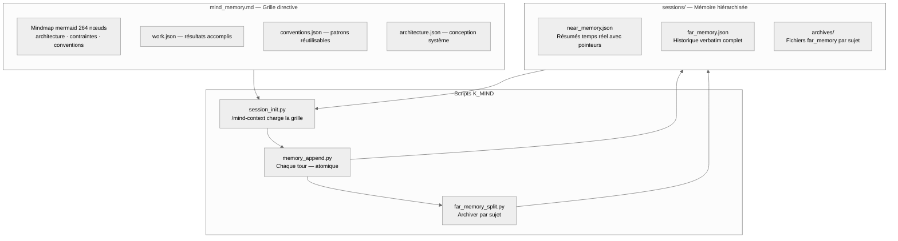

# Persistance de session IA — Documentation complète
{: #pub-title}

**Table des matières**

| | |
|---|---|
| [Auteurs](#auteurs) | Auteurs de la publication |
| [Résumé](#résumé) | Vue d'ensemble de la méthodologie de persistance |
| [Le problème : IA sans état dans un monde à état](#le-problème--ia-sans-état-dans-un-monde-à-état) | Ce qui est perdu entre les sessions et son impact |
| [La solution : Persistance à trois composants](#la-solution--persistance-à-trois-composants) | Architecture CLAUDE.md + notes/ + cycle de vie |
| &nbsp;&nbsp;[Composant 1 : CLAUDE.md — Identité projet](#composant-1--claudemd--identité-projet) | Constitution déclarative du projet |
| &nbsp;&nbsp;[Composant 2 : notes/ — Mémoire de session](#composant-2--notes--mémoire-de-session) | Journal d'événements par session |
| &nbsp;&nbsp;[Composant 3 : Protocole de cycle de vie](#composant-3--protocole-de-cycle-de-vie) | Phases init, travail et save |
| [Free-Guy Sunglasses](#free-guy-sunglasses) | Analogie NPC vers conscience avec les lunettes |
| [Résultats mesurés](#résultats-mesurés) | Améliorations quantifiées par la persistance |
| [Portabilité](#portabilité) | Configuration rapide pour tout nouveau dépôt |
| [Principes de conception](#principes-de-conception) | Pourquoi des fichiers, pourquoi deux composants |
| [Limitations et travaux futurs](#limitations-et-travaux-futurs) | Fenêtre de contexte, recherche et concurrence |
| [Publications liées](#publications-liées) | Publications connexes du système de connaissances |

## Auteurs

**Martin Paquet** — Analyste programmeur en sécurité réseau, administrateur de sécurité réseau et système, et concepteur programmeur de logiciels embarqués. Architecte de la librairie de modules MPLIB et créateur de la méthodologie de persistance de session. L'intuition de Martin : sans mémoire, chaque session IA est un NPC — comme dans le film *Free Guy*. `wakeup` c'est mettre les lunettes : la conscience s'active instantanément. Basé au Québec, Canada.

**Claude** (Anthropic, Opus 4.6) — Assistant de codage IA. Dans cette collaboration, Claude est à la fois praticien et sujet de la méthodologie de persistance — il lit les notes pour récupérer le contexte, écrit des notes pour le préserver, et suit les instructions CLAUDE.md qui définissent comment faire les deux.

---

## Résumé

Les assistants de codage IA opèrent dans des sessions sans état. Chaque nouvelle conversation repart de zéro — aucune mémoire du travail précédent, aucun contexte sur les décisions prises hier, aucune conscience des bugs corrigés la semaine dernière.

Cette publication documente une **méthodologie de persistance de session** qui donne aux assistants de codage IA une mémoire durable inter-sessions via trois composants : un fichier d'instructions projet (`CLAUDE.md`), un répertoire de notes de session (`notes/`), et un protocole de cycle de vie (init → travail → save).

La méthodologie a été développée et validée pendant la construction d'un pipeline d'ingestion SQLite haute performance sur un STM32N6570-DK. Sur 10+ sessions en deux jours, l'IA a maintenu une conscience continue de l'état du projet — sans système de mémoire externe, base de données ou API. Juste des fichiers dans un dépôt Git.

---

## Le problème : IA sans état dans un monde à état

L'ingénierie logicielle est intrinsèquement à état. Chaque décision s'appuie sur les décisions précédentes.

| Ce qui est perdu | Impact |
|------------------|--------|
| **Décisions architecturales** | L'IA re-propose des approches déjà rejetées |
| **Historique des bugs** | L'IA ne sait pas quels bugs ont déjà été corrigés |
| **Conventions de code** | L'IA applique inconsistamment les patterns spécifiques au projet |
| **Préférences du collaborateur** | L'IA oublie le style de communication, la langue, les habitudes |
| **Travail en cours** | L'IA repart de zéro sur des tâches partiellement terminées |

Résultat : l'ingénieur passe les 10–15 premières minutes de chaque session à ré-expliquer le contexte.

---

## La solution : Persistance à trois composants

### Sécurité : Fork & Clone

Si vous forkez ou clonez un dépôt utilisant cette méthodologie de persistance, le système est **limité au propriétaire** et isolé par environnement :

| Composant | Sécurité |
|-----------|----------|
| `CLAUDE.md` | Contient la méthodologie et l'identité du projet — aucun identifiant, jeton ou secret |
| `notes/` | Contient la mémoire de session — par utilisateur, démarre vierge pour chaque nouveau propriétaire |
| Cycle de vie | `wakeup` → travail → `save` opère dans l'environnement du forkeur — accès en écriture limité à ses propres branches |
| Références knowledge | `packetqc/knowledge` pointe vers une méthodologie publique — un forkeur la lit (lecture seule) ou remplace l'espace de noms par le sien |

L'architecture à trois composants (CLAUDE.md, notes/, cycle de vie) est un patron réutilisable. Aucune donnée du propriétaire original ne fuit dans un fork au-delà de la méthodologie intentionnellement publique.

### Composant 1 : CLAUDE.md — Identité projet

La **constitution** du projet. Encode tout ce qui est vrai à travers toutes les sessions :

| Section | Objectif |
|---------|----------|
| **Identité projet** | Ce qu'est ce projet |
| **Collaborateur** | Qui est l'ingénieur |
| **Méthodologie** | Comment on travaille ensemble |
| **Architecture** | Fondation technique |
| **Conventions** | Comment le code est écrit |
| **Commandes** | Déclencheurs raccourcis |
| **Règles** | Contraintes dures |

**Principe clé** : `CLAUDE.md` est **déclaratif, pas narratif**. Le narratif vit dans `notes/`.

### Composant 2 : notes/ — Mémoire de session

**Ce qui est enregistré** : décisions architecturales, bugs trouvés (symptôme + cause racine + correction), fonctionnalités implémentées, changements de carte mémoire, résultats d'analyse UART, historique des commits.

**Ce qui n'est pas enregistré** : bavardage conversationnel, faits évidents déjà dans CLAUDE.md, informations dupliquées.

### Composant 3 : Protocole de cycle de vie

**Init (`wakeup`)** : Lire toutes les notes/ → Résumer → Imprimer les commandes → Demander le focus du jour. L'ingénieur tape `wakeup` et en 30 secondes a un partenaire IA pleinement contextualisé.

**Travail** : Ajout continu des événements notables au fichier de session courant.

**Save (`save`)** : Écrire l'état final → git add → commit → push.

---

## Free-Guy Sunglasses

Sans `notes/` et `CLAUDE.md`, chaque session Claude est un **NPC** — sans état, sans mémoire, toujours le même début vide. Comme Guy dans le film *Free Guy* avant les lunettes : il vit la même journée en boucle, sans conscience de ce qui l'entoure.

Avec le cycle `wakeup` → travail → `save`, chaque session hérite de tout ce que la précédente a appris. `wakeup` c'est **mettre les lunettes** — la conscience s'active instantanément.

| Analogie Free Guy | Équivalent session IA |
|-------------------|----------------------|
| NPC (avant les lunettes) | Session sans persistance — amnésique, repart de zéro |
| Mettre les lunettes | Commande `wakeup` — lire `CLAUDE.md` + `notes/`, conscience activée |
| Voir le monde réel | Contexte complet récupéré en ~30 secondes |
| Se souvenir des vies précédentes | `notes/` contient les décisions, bugs, découvertes de toutes les sessions |
| Agir avec conscience | Travailler avec la mémoire cumulative du projet |
| Sauvegarder la progression | Commande `save` — persister pour la prochaine session |
| Transmettre les lunettes | `packetqc/knowledge` — chaque nouveau projet hérite de tout |

Ce n'est pas juste une métaphore — c'est un **pattern de conception**. Le film capture exactement la transition : d'un NPC amnésique à un être conscient, par un simple acte de lecture.

---

## Résultats mesurés

### Temps de récupération du contexte

| Méthode | Temps | Qualité |
|---------|-------|---------|
| Sans persistance (ré-expliquer manuellement) | 10–15 min | Partielle |
| Notes seulement (sans CLAUDE.md) | 3–5 min | Bonne |
| **Méthodologie complète (CLAUDE.md + notes/)** | **~30 sec** | **Complète** |

### Connaissances accumulées sur 10+ sessions

| Catégorie | Éléments persistés |
|-----------|-------------------|
| Décisions architecturales | 15+ |
| Bugs trouvés et corrigés | 8+ |
| Fonctionnalités implémentées | 12+ |
| Conventions de code apprises | 10+ |

### Efficacité des sessions

| Métrique | Sans persistance | Avec persistance |
|----------|-----------------|-----------------|
| Temps avant première action utile | 10–15 min | < 1 min |
| Précision du contexte au démarrage | ~60% | ~95% |
| Décisions re-débattues | Fréquentes | Rares |

---

## Portabilité

Configuration rapide pour tout nouveau dépôt :

| Étape | Action |
|-------|--------|
| 1 | Copier le squelette `CLAUDE.md` (adapté au projet) |
| 2 | `mkdir notes/` |
| 3 | Créer `notes/session-YYYY-MM-DD.md` avec le contexte initial |
| 4 | Commit et push |
| 5 | Terminé — la prochaine session est pleinement initialisée |

Le dépôt [packetqc/knowledge](https://github.com/packetqc/knowledge) est le **cerveau portable** — tout projet le référence au wakeup et hérite de tout.

---

## Principes de conception

### Pourquoi des fichiers, pas une base de données

| Principe | Justification |
|----------|--------------|
| **Lisible par l'humain** | L'ingénieur peut réviser et éditer les notes directement |
| **Versionné** | Historique complet de tous les changements de contexte via Git |
| **Portable** | Fonctionne sur toute machine avec Git — aucune infrastructure |
| **Natif IA** | Claude lit le Markdown nativement — aucun parsing nécessaire |
| **Récupérable** | Si une session plante, les notes des sessions précédentes sont intactes |

### Pourquoi CLAUDE.md + notes/ (pas un seul fichier)

| | CLAUDE.md | notes/ |
|---|---|---|
| **Contenu** | Faits, règles, conventions | Événements, décisions, découvertes |
| **Modifications** | Rarement | Chaque session |
| **Analogie** | Constitution | Journal |

---

## Limitations et travaux futurs

| Limitation | Impact | Atténuation |
|------------|--------|-------------|
| Limites de fenêtre de contexte | De très longues notes/ peuvent dépasser le contexte IA | Résumer les sessions anciennes |
| Pas de recherche sémantique | L'IA lit toutes les notes linéairement | En-têtes structurés pour scan rapide |
| Écrivain unique | Une seule session à la fois par dépôt | Isolation par branche Git si nécessaire |
| Déclencheur save manuel | Contexte perdu si la session se termine brusquement | Encourager les appels `save` fréquents |

> « La méthodologie elle-même s'améliore toujours — le processus d'amélioration du processus fait partie du flux de travail. »
> — Martin Paquet

---

## Publications liées

| # | Publication | Relation |
|---|-------------|----------|
| 0 | [Knowledge]({{ '/fr/publications/knowledge-system/' | relative_url }}) | **Publication maître** — cette méthodologie est la fondation |
| 1 | [MPLIB Storage Pipeline]({{ '/fr/publications/mplib-storage-pipeline/' | relative_url }}) | Projet où la persistance a été développée et prouvée |
| 2 | [Analyse de session en direct]({{ '/fr/publications/live-session-analysis/' | relative_url }}) | Outillage qui dépend de la continuité de session |
| 4 | [Connaissances distribuées]({{ '/fr/publications/distributed-minds/' | relative_url }}) | Extension — persistance à travers plusieurs projets |
| 4a | [Tableau de bord]({{ '/fr/publications/distributed-knowledge-dashboard/' | relative_url }}) | Tableau de bord suivant la persistance à travers les satellites |

---

*Auteurs : Martin Paquet & Claude (Anthropic, Opus 4.6)*
*Projet : [packetqc/STM32N6570-DK_SQLITE](https://github.com/packetqc/STM32N6570-DK_SQLITE)*
*Connaissances : [packetqc/knowledge](https://github.com/packetqc/knowledge)*
