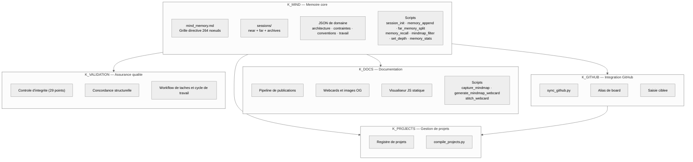
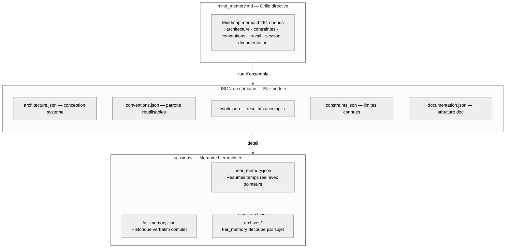

# Analyse d'architecture de Knowledge — Documentation complete
{: #pub-title}

**Table des matieres**

| | |
|---|---|
| [Auteurs](#auteurs) | Auteurs de la publication |
| [Resume](#resume) | Vue d'ensemble de l'architecture du systeme |
| [Vue d'ensemble du systeme](#vue-densemble-du-systeme) | Intelligence d'ingenierie IA multi-module |
| [Architecture des modules](#architecture-des-modules) | Cinq modules specialises |
| &nbsp;&nbsp;[K_MIND — Memoire core](#k_mind--memoire-core) | Grille directive, memoire hierarchisee, scripts de session |
| &nbsp;&nbsp;[K_DOCS — Documentation](#k_docs--documentation) | Publications, webcards, visualiseur web, outils visuels |
| &nbsp;&nbsp;[K_GITHUB — Integration GitHub](#k_github--integration-github) | Sync, boards, saisie ciblee |
| &nbsp;&nbsp;[K_PROJECTS — Gestion de projets](#k_projects--gestion-de-projets) | Registre de projets, compilation, cycle de vie |
| &nbsp;&nbsp;[K_VALIDATION — Assurance qualite](#k_validation--assurance-qualite) | Controles d'integrite, normalisation, workflow de taches |
| &nbsp;&nbsp;[Modele d'interaction des modules](#modele-dinteraction-des-modules) | Comment les modules collaborent |
| [Architecture memoire](#architecture-memoire) | Memoire hierarchisee mind-first |
| &nbsp;&nbsp;[mind_memory.md — Grille directive](#mind_memorymd--grille-directive) | Mindmap mermaid de 264 noeuds |
| &nbsp;&nbsp;[JSON de domaine — Connaissances structurees](#json-de-domaine--connaissances-structurees) | Architecture, conventions, travail par module |
| &nbsp;&nbsp;[sessions/ — Memoire hierarchisee](#sessions--memoire-hierarchisee) | Memoire proche, memoire lointaine, archives |
| &nbsp;&nbsp;[Cycle de vie de la memoire](#cycle-de-vie-de-la-memoire) | Flux des connaissances a travers les niveaux |
| [Architecture des skills](#architecture-des-skills) | Routage natif par skills Claude Code |
| &nbsp;&nbsp;[Systeme SKILL.md](#systeme-skillmd) | Remplacement de routes.json et SkillRegistry |
| &nbsp;&nbsp;[Inventaire des skills](#inventaire-des-skills) | Tous les skills enregistres par module |
| [Architecture des qualites](#architecture-des-qualites) | 13 qualites fondamentales |
| &nbsp;&nbsp;[Graphe de dependance des qualites](#graphe-de-dependance-des-qualites) | Comment les qualites se renforcent mutuellement |
| &nbsp;&nbsp;[Mecanismes d'application des qualites](#mecanismes-dapplication-des-qualites) | Skills et scripts K2.0 appliquant chaque qualite |
| [Architecture du cycle de vie des sessions](#architecture-du-cycle-de-vie-des-sessions) | Le mecanisme de persistance |
| &nbsp;&nbsp;[Initialisation de session](#initialisation-de-session) | session_init.py + /mind-context |
| &nbsp;&nbsp;[Maintenance temps reel](#maintenance-temps-reel) | memory_append.py — chaque tour |
| &nbsp;&nbsp;[Archivage par sujet](#archivage-par-sujet) | far_memory_split.py — decoupe par sujet |
| &nbsp;&nbsp;[Rappel memoire](#rappel-memoire) | memory_recall.py — recherche profonde |
| &nbsp;&nbsp;[Recuperation apres compaction](#recuperation-apres-compaction) | /mind-context rechargement |
| [Architecture distribuee](#architecture-distribuee) | Reseau de connaissances multi-depot |
| &nbsp;&nbsp;[Distribution du module K_MIND](#distribution-du-module-k_mind) | Core pousse vers les satellites |
| &nbsp;&nbsp;[Synchronisation K_GITHUB](#synchronisation-k_github) | sync_github.py — flux bidirectionnel |
| [Architecture de securite](#architecture-de-securite) | Controle d'acces et modele de jetons |
| &nbsp;&nbsp;[Modele proxy](#modele-proxy) | Frontieres du proxy conteneur |
| &nbsp;&nbsp;[Protocole de jetons ephemeres](#protocole-de-jetons-ephemeres) | Cycle de vie PAT zero-stocke-au-repos |
| &nbsp;&nbsp;[gh_helper.py — Passerelle API](#gh_helperpy--passerelle-api) | Acces API GitHub en Python pur |
| [Architecture web](#architecture-web) | Visualiseur JS statique |
| &nbsp;&nbsp;[Systeme de visualiseur statique](#systeme-de-visualiseur-statique) | .nojekyll rendu cote client |
| &nbsp;&nbsp;[Systeme double theme](#systeme-double-theme) | Quatre themes avec media queries CSS |
| &nbsp;&nbsp;[Architecture des interfaces](#architecture-des-interfaces) | 5 interfaces + mindmap live |
| &nbsp;&nbsp;[Pipeline de publication](#pipeline-de-publication) | Source vers pages web bilingues |
| &nbsp;&nbsp;[Architecture d'exportation](#architecture-dexportation) | Generation PDF et DOCX |
| [Modele de deploiement](#modele-de-deploiement) | Architecture de production |
| &nbsp;&nbsp;[Strategie double remote](#strategie-double-remote) | Remotes knowledge + origin |
| &nbsp;&nbsp;[Topologie du reseau](#topologie-du-reseau) | Registre de projets actuel |
| [Analyse structurelle](#analyse-structurelle) | Analyse de poids au niveau fichier |
| &nbsp;&nbsp;[Distribution des poids par module](#distribution-des-poids-par-module) | Taille par module |
| &nbsp;&nbsp;[Budget memoire](#budget-memoire) | Gestion de la fenetre de contexte |
| &nbsp;&nbsp;[Priorite de lecture pour les instances Claude](#priorite-de-lecture-pour-les-instances-claude) | Ce qui se charge et quand |
| [Analyse de la structure Publication](#analyse-de-la-structure-publication) | Anatomie d'une publication |
| &nbsp;&nbsp;[Anatomie d'une publication](#anatomie-dune-publication) | Composants et niveaux |
| &nbsp;&nbsp;[Cycle de vie d'une publication](#cycle-de-vie-dune-publication) | De /docs-create a normalize |
| &nbsp;&nbsp;[Skills de validation](#skills-de-validation) | Boucle d'assurance qualite |
| [Publications connexes](#publications-connexes) | Publications soeurs et parente |

## Auteurs

**Martin Paquet** — Analyste programmeur en securite des reseaux, administrateur de securite des reseaux et des systemes, et concepteur programmeur de logiciels embarques. 30 ans d'experience couvrant les systemes embarques, la securite reseau, les telecoms et le developpement logiciel. Architecte du systeme Knowledge — une intelligence d'ingenierie IA auto-evolutive construite sur des fichiers Markdown simples dans Git.

**Claude** (Anthropic, Opus 4.6) — Partenaire de developpement IA. Co-architecte et executeur principal du systeme Knowledge. Opere au sein de l'architecture decrite ici — chaque session s'amorce depuis ces structures, chaque skill suit ces patrons.

---

## Resume

Le systeme Knowledge est une intelligence d'ingenierie IA auto-evolutive qui transforme des sessions de codage IA sans etat en un reseau persistant, distribue et auto-reparateur de conscience. Construit entierement sur des fichiers Markdown, des fichiers JSON de domaine et des scripts Python dans des depots Git, il ne necessite aucun service externe, aucune base de donnees et aucune infrastructure cloud. Un seul `git clone` demarre tout.

Cette publication fournit une analyse architecturale complete de la **conception multi-module Knowledge 2.0** : cinq modules specialises (K_MIND, K_DOCS, K_GITHUB, K_PROJECTS, K_VALIDATION), memoire mind-first avec une grille directive de 264 noeuds, memoire de session hierarchisee (near/far/archives), routage natif par skills Claude Code via les fichiers SKILL.md de `.claude/skills/`, un visualiseur web JavaScript statique avec 5 interfaces plus mindmap live, un modele de securite fonde sur les frontieres proxy et les jetons ephemeres, et l'architecture de deploiement qui lie le tout.

L'architecture est distinctive en ce que le systeme se documente en consommant sa propre production. La mindmap grandit a mesure que les connaissances sont ajoutees. Les publications decrivent le systeme qui les produit. Cette conscience de soi recursive est une propriete emergente de l'architecture.

**Source** : Documentation d'architecture, mise a jour 2026-03-16 pour l'architecture multi-module Knowledge 2.0.

---

## Audience ciblee

Cette publication est destinee aux equipes de travail impliquees dans l'ecosysteme du systeme Knowledge :

| Audience | Quoi privilegier |
|----------|-----------------|
| **Administrateurs reseau** | Architecture distribuee, modele de securite, frontieres proxy, deploiement |
| **Administrateurs systeme** | Modele de deploiement, configuration GitHub Pages, structure des modules |
| **Programmeurs et programmeuses** | Architecture des modules, systeme memoire, cycle de vie des sessions, routage par skills, scripts Python |
| **Gestionnaires** | Vue d'ensemble du systeme, qualites fondamentales, modele de deploiement |

## Conventions du document

| Convention | Utilisation |
|------------|-------------|
| **Tableaux** | Donnees structurees, comparaisons, inventaires — format compact |
| **Diagrammes Mermaid** | Visualisations d'architecture — rendues par le visualiseur JS statique |
| **Blocs de code** | Chemins de fichiers, exemples de commandes, extraits de configuration |
| **Texte en gras** | Termes cles a la premiere introduction, emphase sur les concepts critiques |
| **References aux modules** (`K_XXX`) | References croisees aux cinq modules de connaissances |
| **References aux publications** (`#N`) | References croisees aux publications soeurs par numero |
| **References aux skills** (`/nom-skill`) | Skills natifs Claude Code invoques via `.claude/skills/` |

---

## Vue d'ensemble du systeme

Le systeme Knowledge est une **intelligence d'ingenierie IA auto-evolutive** — un reseau de depots Git, de fichiers Markdown, de fichiers JSON de domaine, de scripts Python et de skills Claude Code qui donne aux assistants de codage IA une memoire persistante, une conscience distribuee et des capacites d'auto-guerison. A son coeur, il resout un probleme fondamental : les sessions de codage IA sont sans etat. Sans structure externe, chaque nouvelle session demarre vierge — un PNJ sans memoire d'hier.

L'architecture du systeme peut etre comprise a travers trois prismes :

1. **Comme mecanisme de persistance** : Une grille directive de 264 noeuds (`mind_memory.md`) + memoire de session hierarchisee (`near_memory.json` / `far_memory.json` / `archives/`) + scripts K_MIND (`session_init.py`, `memory_append.py`) transforment des sessions ephemeres en collaboration continue
2. **Comme systeme modulaire** : Cinq modules specialises (K_MIND, K_DOCS, K_GITHUB, K_PROJECTS, K_VALIDATION) possedant chacun leur domaine — avec leurs propres scripts, skills, conventions et suivi de travail
3. **Comme systeme auto-documentant** : Le systeme enregistre son evolution dans les JSON de domaine, publie sa documentation via K_DOCS, et grandit en consommant sa propre production

L'ensemble du systeme fonctionne sur du texte brut et du JSON. Aucune base de donnees, aucun service cloud, aucune dependance externe au-dela de Git et GitHub. C'est la qualite **autosuffisant** — le systeme se sustente de sa propre structure.

### Evolution K1.0 → K2.0

Knowledge 2.0 represente un changement architectural fondamental par rapport a la conception monolithique K1.0 :

| Aspect | K1.0 (Monolithique) | K2.0 (Multi-Module) |
|--------|---------------------|---------------------|
| **Cerveau** | `CLAUDE.md` (3000+ lignes) | `mind_memory.md` (grille directive 264 noeuds) + JSON de domaine par module |
| **Stockage des connaissances** | Repertoires `patterns/`, `lessons/` | `conventions.json`, `work.json` par module |
| **Memoire de session** | `notes/` (fichiers Markdown plats) | `sessions/` — `near_memory.json` + `far_memory.json` + `archives/` |
| **Routage des commandes** | `routes.json` + `SkillRegistry` | Fichiers SKILL.md dans `.claude/skills/` (natif Claude Code) |
| **Cycle de vie** | `wakeup` (12 etapes), `save` (6 etapes) | `session_init.py` + `/mind-context`, `far_memory_split.py` + git commit |
| **Presentation web** | Jekyll avec `_config.yml`, `_layouts/` | Visualiseur JS statique `.nojekyll` (`docs/index.html`) |
| **Organisation** | Depot unique, structure plate | 5 modules (K_MIND, K_DOCS, K_GITHUB, K_PROJECTS, K_VALIDATION) |

---

## Architecture des modules

Le systeme Knowledge 2.0 est organise en cinq modules specialises, chacun avec ses propres fichiers de domaine, scripts, skills et chaine de methodologie. Les modules vivent sous `Knowledge/` dans le depot.



### K_MIND — Memoire core

**Emplacement** : `Knowledge/K_MIND/`
**Role** : Le cerveau du systeme — possede la grille directive mindmap, toute la memoire de session et les scripts qui les maintiennent.

K_MIND est le module fondation. Tous les autres modules en dependent pour le contexte memoire. Il contient :

| Composant | Role |
|-----------|------|
| `files/mind/mind_memory.md` | Mindmap mermaid de 264 noeuds — la grille directive |
| `sessions/near_memory.json` | Resumes temps reel avec pointeurs vers far_memory et mind_memory |
| `sessions/far_memory.json` | Historique verbatim complet de la conversation |
| `sessions/archives/` | Fichiers far_memory decoupes par sujet |
| `architecture/architecture.json` | References de conception systeme (statique) |
| `constraints/constraints.json` | Limitations connues (semi-dynamique) |
| `conventions/conventions.json` | Patrons reutilisables decouverts pendant le travail (croissant) |
| `work/work.json` | Resultats accomplis/en attente — ancre de continuite |
| `documentation/documentation.json` | References de structure documentaire |
| `scripts/` | 8 scripts Python pour la gestion memoire |

**Propriete architecturale cle** : La mindmap est a la fois configuration et documentation. Elle configure le comportement de Claude (chaque noeud est une directive) ET documente l'architecture du systeme pour les lecteurs humains. Ce double role est intentionnel.

### K_DOCS — Documentation

**Emplacement** : `Knowledge/K_DOCS/`
**Role** : Possede le pipeline de publications, le visualiseur web, les webcards, la documentation visuelle et toute la methodologie documentaire.

| Composant | Role |
|-----------|------|
| `conventions/` | Conventions documentaires — rendu web, images sociales, webcards, sessions interactives |
| `methodology/` | Generation documentaire, visualisation web, pipeline de production, ciblage d'audience |
| `scripts/` | `capture_mindmap.js`, `generate_mindmap_webcard.py`, `stitch_webcard.py`, `package.json` |
| `work/work.json` | Suivi du travail documentaire |

Skills K_DOCS : `/docs-create`, `/pub`, `/pub-export`, `/visual`, `/live-session`, `/webcard`, `/profile-update`.

### K_GITHUB — Integration GitHub

**Emplacement** : `Knowledge/K_GITHUB/`
**Role** : Possede la synchronisation GitHub, la gestion des boards et le routage de saisie ciblee.

| Composant | Role |
|-----------|------|
| `scripts/sync_github.py` | Synchronisation bidirectionnelle avec GitHub (remplace le `harvest` K1.0) |
| `methodology/github-project-integration.md` | Methodologie d'integration GitHub Projects v2 |
| `methodology/github-board-item-alias.md` | Systeme d'alias de board (`g:<board>:<item>`) |
| `conventions/conventions.json` | Conventions GitHub |

Skills K_GITHUB : `/github`, `/tagged-input`, `/harvest`.

### K_PROJECTS — Gestion de projets

**Emplacement** : `Knowledge/K_PROJECTS/`
**Role** : Possede le registre de projets, la compilation et la gestion du cycle de vie.

| Composant | Role |
|-----------|------|
| `data/projects/` | Fichiers de metadonnees de projets (plats `<slug>.md`) |
| `data/projects.json` | Registre de projets compile |
| `scripts/compile_projects.py` | Compilation de projets depuis les metadonnees |
| `scripts/compile_projects_from_mind.py` | Compilation de projets depuis la mindmap |
| `methodology/project-create.md` | Methodologie de creation de projet |
| `methodology/project-management.md` | Gestion du cycle de vie des projets |

Skills K_PROJECTS : `/project-create`, `/project-manage`.

### K_VALIDATION — Assurance qualite

**Emplacement** : `Knowledge/K_VALIDATION/`
**Role** : Possede toute la validation, l'integrite, la normalisation et les protocoles de workflow de taches.

| Composant | Role |
|-----------|------|
| `scripts/documentation_validation.py` | Moteur de validation documentaire |
| `methodology/session-protocol.md` | Regles du protocole de session |
| `methodology/task-workflow.md` | Cycle de vie des taches en 8 etapes (INITIAL → COMPLETION) |
| `methodology/checkpoint-resume.md` | Mecaniques de checkpoint et reprise |
| `methodology/metrics-compilation.md` | Methodologie de compilation des metriques |

Skills K_VALIDATION : `/integrity-check` (29 points de controle), `/normalize`, `/task-received`, `/work-cycle`, `/knowledge-validation`.

### Modele d'interaction des modules

Les modules interagissent via des frontieres bien definies :

| Interaction | Mecanisme |
|-------------|-----------|
| K_MIND → tous les modules | Contexte memoire (mindmap + near_memory charges au demarrage de session) |
| K_DOCS → K_MIND | Met a jour les noeuds documentation dans la mindmap |
| K_GITHUB → K_MIND | Resultats de sync ecrits dans work.json et conventions.json |
| K_GITHUB → K_PROJECTS | Boards de projets lies au registre de projets |
| K_VALIDATION → tous les modules | Les controles d'integrite valident toutes les structures de modules |
| Tous les modules → K_MIND | Les mises a jour de JSON de domaine remontent vers la memoire core |

Chaque module possede ses propres `conventions.json`, `work.json` et `documentation.json`. Cette propriete distribuee signifie qu'aucun fichier unique ne devient un goulot — contrairement au `CLAUDE.md` monolithique de K1.0.

---

## Architecture memoire

Le systeme memoire suit un principe **mind-first** : toujours lire `mind_memory.md` en premier comme contexte principal, puis creuser dans les JSON de domaine et les fichiers de session seulement quand les details complets sont necessaires.



### mind_memory.md — Grille directive

**Emplacement** : `K_MIND/files/mind/mind_memory.md`
**Format** : Mindmap mermaid avec 264 noeuds organises en 6 groupes
**Role** : Le subconscient du systeme — un seul regard pour tout voir

La mindmap est organisee en six groupes comportementaux :

| Groupe | Comportement | Contenu |
|--------|-------------|---------|
| **architecture** | COMMENT vous travaillez — regles de conception systeme | Conception des modules, niveaux memoire, roles des scripts |
| **constraints** | LIMITES — regles dures | Limites de contexte, regles de securite, a ne jamais violer |
| **conventions** | COMMENT vous executez — patrons | Conventions d'affichage, methodologies, documentation |
| **work** | ETAT — resultats accomplis | En cours, validation, approbation |
| **session** | CONTEXTE — enregistrement courant | Memoire proche, memoire lointaine, conversation |
| **documentation** | STRUCTURE — references documentaires | Docs, interfaces, stories, publications, profil |

**Propriete architecturale cle** : La mindmap n'est pas decorative — c'est la memoire operationnelle. Chaque noeud est une directive qui gouverne le comportement. A chaque chargement (demarrage, reprise, recuperation apres compaction), Claude parcourt l'arbre complet et internalise chaque noeud.

**Filtrage par profondeur** : `conventions/depth_config.json` controle quelles branches sont montrees a quelle profondeur. Le mode normal montre la profondeur 3 avec architecture et contraintes omises. Le mode complet montre tous les noeuds. Les surcharges par branche permettent un controle de profondeur par chemin.

### JSON de domaine — Connaissances structurees

Chaque module possede des fichiers JSON de domaine stockant des connaissances structurees :

| Fichier | Module | Contenu | Mutabilite |
|---------|--------|---------|------------|
| `architecture.json` | K_MIND | References de conception systeme | Statique — change quand l'architecture evolue |
| `constraints.json` | K_MIND | Limitations connues et regles dures | Semi-dynamique |
| `conventions.json` | K_MIND, K_DOCS, K_GITHUB, K_PROJECTS, K_VALIDATION | Patrons reutilisables decouverts pendant le travail | Croissant — nouveaux patrons ajoutes continuellement |
| `work.json` | K_MIND, K_DOCS, K_GITHUB, K_PROJECTS, K_VALIDATION | Resultats de travail accomplis/en attente | Dynamique — mis a jour chaque session |
| `documentation.json` | K_MIND, K_DOCS, K_GITHUB, K_PROJECTS, K_VALIDATION | References de structure documentaire | Semi-dynamique |

**163 references** a travers tous les JSON de domaine, totalisant ~1,8 Mo. Seul un sous-ensemble (~4,5K tokens) est charge au demarrage de session — le reste est accede a la demande.

### sessions/ — Memoire hierarchisee

La memoire de session utilise trois niveaux avec granularite croissante :

| Niveau | Fichier | Contenu | Taille | Charge au demarrage ? |
|--------|---------|---------|--------|------------------------|
| **Memoire proche** | `near_memory.json` | Resumes temps reel avec pointeurs vers far_memory et noeuds mindmap | ~33 Ko | Oui (~8,5K tokens) |
| **Memoire lointaine** | `far_memory.json` | Historique verbatim complet de la conversation | ~5 Ko (session courante) | Minimal |
| **Archives** | `archives/` | Fichiers far_memory decoupes par sujet | ~210 Ko (16 sujets) | Non — charges via `memory_recall.py` |

**La memoire proche** est le porteur de contexte principal. Chaque entree contient :
- Un resume en une ligne de ce qui s'est passe
- Des pointeurs mind-ref vers les noeuds mindmap pertinents
- Des enregistrements d'appels d'outils
- Des horodatages et indices de messages

**La memoire lointaine** stocke l'echange verbatim complet — les mots exacts de l'utilisateur et la sortie complete de Claude. Elle grandit pendant la session et est archivee par sujet quand elle devient volumineuse.

**Les archives** sont des fichiers far_memory decoupes par sujet. Quand un sujet de conversation est complet, `far_memory_split.py` deplace les messages pertinents vers un fichier archive nomme par sujet et horodatage.

### Cycle de vie de la memoire

Les connaissances circulent a travers les niveaux :

| Transition | Mecanisme | Declencheur |
|-----------|-----------|-------------|
| Conversation → Memoire lointaine | `memory_append.py` | Chaque tour (automatique) |
| Conversation → Memoire proche | `memory_append.py` (resume) | Chaque tour (automatique) |
| Memoire lointaine → Archives | `far_memory_split.py` | Quand un sujet est complet |
| Archives → Memoire proche | `memory_recall.py` | A la demande (`--subject "..."`) |
| Memoire proche → Mindmap | Mise a jour manuelle de noeud | Quand la connaissance se cristallise |
| Mindmap → JSON de domaine | Mise a jour manuelle de JSON | Quand la connaissance est structuree |
| JSON de domaine → Travail | Execution de skill | Quand du travail est accompli |

Le cycle est continu : les conversations generent des donnees brutes, les resumes extraient le signal, les archives preservent les sujets completes, et la mindmap absorbe les connaissances validees. C'est la qualite **recursif** — le systeme grandit en consommant sa propre production.

---

## Architecture des skills

### Systeme SKILL.md

Knowledge 2.0 remplace le routeur de commandes K1.0 (`routes.json`, `SkillRegistry`, `executer_demande.py`) par un **routage natif par skills Claude Code** via les fichiers SKILL.md dans `.claude/skills/`.

| Aspect | K1.0 | K2.0 |
|--------|------|------|
| **Routage** | `routes.json` association mot-cle → programme | Claude Code lit le SKILL.md et route naturellement |
| **Registre** | `SkillRegistry` (LireChoix, Fonction, Programme) | Fichiers SKILL.md dans `.claude/skills/` |
| **Methodologie** | `resolve_methodologies()` chargement par famille | Chaque skill lit sa propre chaine `methodology/` |
| **Deduplication** | `filter_unread()` / `mark_read()` | Natif Claude Code (pas de deduplication necessaire) |
| **Resultats** | `knowledge_resultats.json` resultats de quiz | Supprime — les skills sont a la demande |
| **Execution** | `executer_demande.py` routeur de commandes | Claude Code interprete + route vers les skills |

### Inventaire des skills

| Module | Skill | Objectif |
|--------|-------|---------|
| K_DOCS | `/docs-create` | Creer une nouvelle publication avec scaffold |
| K_DOCS | `/pub` | Gestion des publications — lister, verifier, sync, revue |
| K_DOCS | `/pub-export` | Exporter en PDF ou DOCX |
| K_DOCS | `/visual` | Documentation visuelle — analyse OpenCV + Pillow |
| K_DOCS | `/live-session` | Analyse de session live — clips, frames, multi-flux |
| K_DOCS | `/webcard` | Generation d'apercu social anime OG |
| K_DOCS | `/profile-update` | Rafraichir les pages profil avec les stats actuelles |
| K_GITHUB | `/github` | Operations API GitHub via gh_helper.py |
| K_GITHUB | `/tagged-input` | Notes ciblees et references de board |
| K_GITHUB | `/harvest` | Recolte de connaissances distribuees |
| K_PROJECTS | `/project-create` | Creer un nouveau projet avec enregistrement |
| K_PROJECTS | `/project-manage` | Operations projet — lister, info, enregistrer, revue |
| K_VALIDATION | `/integrity-check` | Validation d'integrite a 29 points de controle |
| K_VALIDATION | `/normalize` | Concordance structurelle — miroirs EN/FR, liens, assets |
| K_VALIDATION | `/task-received` | Protocole On Task Received — 9 etapes Stage 1 |
| K_VALIDATION | `/work-cycle` | Cycle de travail par todo — commits, cache, push |
| K_VALIDATION | `/knowledge-validation` | Validation de session |
| K_MIND | `/mind-context` | Charger le contexte mindmap + memoire proche |
| K_MIND | `/mind-depth` | Gerer la configuration de profondeur de la mindmap |
| K_MIND | `/mind-stats` | Stats memoire — disque, tokens, charge, disponible |

Chaque fichier SKILL.md contient la chaine de methodologie complete : quoi lire, quoi faire, quoi produire. Les skills sont autonomes — ils ne dependent pas d'un registre central.

---

## Architecture des qualites

### Les 13 qualites fondamentales

Le systeme Knowledge incarne 13 qualites — chacune decouverte par la pratique, chacune renforcant les autres. Elles sont nommees en francais (le systeme a ete concu en francais) et forment une hierarchie de dependance.

| # | Qualite | Essence | Mecanisme K2.0 |
|---|---------|---------|----------------|
| 1 | **Autosuffisant** | Aucun service externe, aucune base de donnees, aucun cloud. Markdown et JSON dans Git. | mind_memory.md + JSON de domaine + sessions/ — tout en texte brut dans un depot |
| 2 | **Autonome** | Auto-propagation, auto-guerison, auto-documentation. | session_init.py auto-demarre ; /normalize auto-repare ; scripts K_MIND gerent toutes les operations mecaniques |
| 3 | **Concordant** | Integrite structurelle activement appliquee. | `/normalize`, `/integrity-check` — detecter et reparer les ecarts |
| 4 | **Concis** | Mind-first : un seul regard pour tout voir. Signal maximum, bruit minimum. | Mindmap 264 noeuds comme vue d'ensemble ; JSON de domaine pour le detail seulement quand necessaire |
| 5 | **Interactif** | Operable, pas seulement lisible. Mindmap live, interfaces interactives. | 5 interfaces web + mindmap live MindElixir, skill `/mind-context` |
| 6 | **Evolutif** | Le systeme grandit en travaillant. Chaque session ajoute a la memoire. | near_memory grandit chaque tour ; conventions.json et work.json accumulent |
| 7 | **Distribue** | L'intelligence circule dans les deux sens. Pousser les modules, synchroniser en retour. | K_MIND pousse vers les satellites ; K_GITHUB `sync_github.py` recolte |
| 8 | **Persistant** | Les sessions sont ephemeres, les connaissances sont permanentes. | Memoire hierarchisee (near/far/archives) + noeuds mindmap |
| 9 | **Recursif** | Le systeme se documente en consommant sa propre production. | Les publications K_DOCS decrivent l'architecture K_MIND ; la mindmap cartographie le systeme qui lit la mindmap |
| 10 | **Securitaire** | Securite par architecture, pas par obscurite. | Delimitation proxy, regles .gitignore, URLs espace de noms proprietaire, gh_helper.py |
| 11 | **Resilient** | Chaque mode de defaillance a un chemin de recuperation. | `/mind-context` (compaction), `memory_recall.py` (recherche profonde), archives de session |
| 12 | **Structure** | Organise autour des modules et des projets. | 5 modules avec JSON de domaine propres ; registre K_PROJECTS |
| 13 | **Integre** | S'etend aux plateformes externes. | K_GITHUB gh_helper.py, GitHub Projects v2, alias de board |

### Graphe de dependance des qualites

Les qualites forment un reseau de renforcement :

- **Autosuffisant** active **distribue** (aucune dependance externe a propager)
- **Autonome** active **resilient** (l'auto-guerison inclut la recuperation apres crash)
- **Concordant** active **structure** (integrite structurelle a travers les modules)
- **Persistant** active **evolutif** (les connaissances s'accumulent entre les sessions)
- **Recursif** active **autosuffisant** (le systeme construit sa propre documentation)
- **Concis** active **interactif** (la mindmap comme vue d'ensemble rend le systeme operable)

### Mecanismes d'application des qualites

Chaque qualite est appliquee par des skills, scripts et conventions K2.0 specifiques :

| Qualite | Application K2.0 |
|---------|-------------------|
| Autosuffisant | Aucune dependance externe dans aucun module ; scripts Python purs ; stockage JSON + Markdown |
| Autonome | `session_init.py` auto-initialise ; `/normalize` auto-repare ; memory_append s'execute chaque tour |
| Concordant | `/normalize` audite la structure ; `/integrity-check` valide 29 points de controle |
| Concis | mind_memory.md comme vue d'ensemble (264 noeuds) ; filtrage par profondeur via depth_config.json |
| Interactif | 5 interfaces web + mindmap live MindElixir ; `/mind-context` pour le contexte immediat |
| Evolutif | near_memory grandit chaque tour ; work.json suit les accomplissements ; conventions.json capture les patrons |
| Distribue | Module K_MIND pousse via git ; K_GITHUB sync_github.py pour le flux bidirectionnel |
| Persistant | Memoire hierarchisee (near/far/archives) ; les noeuds mindmap cristallisent les connaissances validees |
| Recursif | Les publications K_DOCS decrivent le systeme ; la mindmap K_MIND se cartographie elle-meme |
| Securitaire | Delimitation proxy ; jetons ephemeres via gh_helper.py ; blocs `.gitignore` |
| Resilient | Rechargement `/mind-context` apres compaction ; `memory_recall.py` pour la recherche profonde ; archives de session |
| Structure | 5 modules avec JSON de domaine propres ; registre K_PROJECTS ; conventions.json par module |
| Integre | K_GITHUB gh_helper.py ; GitHub Projects v2 ; alias de board ; saisie ciblee |

---

## Architecture du cycle de vie des sessions

Chaque session IA suit un cycle de vie deterministe gere par les scripts K_MIND. Le principe fondamental : **programmes plutot qu'improvisation** — Claude fournit l'intelligence (resumes, noms de sujets) comme arguments a des scripts deterministes.

```
session_init.py → /mind-context → [travail] → memory_append.py (chaque tour) → far_memory_split.py → git commit & push
```

### Initialisation de session

A chaque demarrage de session, deux choses se produisent :

1. **`session_init.py`** initialise ou reprend les fichiers de session :
   ```bash
   python3 scripts/session_init.py --session-id "<id>"              # Nouvelle session
   python3 scripts/session_init.py --session-id "<id>" --preserve-active  # Reprise
   ```
   - La session precedente est auto-archivee mais les resumes sont portes dans `near_memory.json` sous `last_session`
   - Les fichiers de session sont crees ou repris atomiquement

2. **`/mind-context`** charge et affiche le contexte :
   - Rend la mindmap filtree (bloc de code mermaid)
   - Montre le contexte de la derniere session (ou le travail en etait)
   - Montre les resumes recents de near_memory (activite de la session courante)
   - Affiche le tableau de statistiques memoire (taille disque, tokens, charge, disponible)

Cela remplace le protocole wakeup K1.0 a 12 etapes. La ou K1.0 necessitait un `git clone` du depot knowledge, la lecture de `notes/`, le resume de l'etat et l'affichage de l'aide — K2.0 charge la mindmap et la near_memory en une seule operation.

### Maintenance temps reel

**Chaque tour**, Claude execute `memory_append.py` pour persister l'echange :

```bash
python3 scripts/memory_append.py \
    --role user --content "message exact de l'utilisateur" \
    --role2 assistant --content2 "sortie complete de l'assistant" \
    --summary "resume en une ligne" \
    --mind-refs "knowledge::noeud1,knowledge::noeud2"
```

Pour le contenu volumineux (tableaux, blocs de code), le mode stdin evite l'echappement shell :
```bash
python3 scripts/memory_append.py --stdin << 'ENDJSON'
{"role":"user","content":"...","role2":"assistant","content2":"...","summary":"...","mind_refs":"...","tools":[...]}
ENDJSON
```

Cela gere a la fois far_memory (verbatim) et near_memory (resume) atomiquement. Pas d'improvisation — le script ecrit les deux fichiers en une seule operation.

### Archivage par sujet

Quand `far_memory.json` grandit ou qu'un sujet est complet, `far_memory_split.py` l'archive :

```bash
python3 scripts/far_memory_split.py \
    --topic "Nom du sujet" \
    --start-msg 1 --end-msg 24 \
    --start-near 1 --end-near 7
```

Claude identifie les frontieres de sujets depuis les groupes de resumes near_memory, puis appelle le script. Le script deplace les messages vers `archives/far_memory_session_<id>_<timestamp>.json`, classes par sujet.

### Rappel memoire

Pour rechercher dans la memoire archivee :

```bash
python3 scripts/memory_recall.py --subject "architecture"   # Recherche par mot-cle
python3 scripts/memory_recall.py --list                      # Lister tous les sujets archives
python3 scripts/memory_recall.py --subject "theme" --full    # Recuperation du contenu complet
```

Cela remplace la commande `recall` de K1.0. Au lieu de scanner les branches git pour du travail non fusionne, K2.0 recherche dans des fichiers archive structures par sujet.

### Recuperation apres compaction

Quand Claude Code compacte le contexte en cours de session, `/mind-context` recharge la mindmap et la near_memory. Parce que mind_memory.md est compact (264 noeuds, ~2,8K tokens) et que near_memory porte des resumes avec pointeurs, la recuperation est rapide et complete.

| Scenario de recuperation | K1.0 | K2.0 |
|--------------------------|------|------|
| Apres compaction | `refresh` (relire CLAUDE.md) | `/mind-context` (recharger mindmap + near_memory) |
| Apres crash de session | `resume` (checkpoint.json) | `session_init.py --preserve-active` |
| Recherche memoire profonde | `recall` (scan de branches) | `memory_recall.py --subject "..."` |
| Rechargement complet | `wakeup` (protocole 12 etapes) | `/mind-context full` |

---

## Architecture distribuee

### Distribution du module K_MIND

Le module K_MIND est le cerveau portable — il peut etre pousse vers tout projet satellite via git. Un satellite qui clone ou reference K_MIND herite de la methodologie complete :

- La mindmap de 264 noeuds (architecture, contraintes, conventions, suivi de travail)
- Tous les scripts K_MIND (gestion de session, maintenance memoire)
- Les JSON de domaine (connaissances structurees)

Cela remplace le flux push K1.0 ou les satellites lisaient le CLAUDE.md de `packetqc/knowledge` a l'etape wakeup 0.

### Synchronisation K_GITHUB

Le `sync_github.py` de K_GITHUB remplace le protocole `harvest` de K1.0 pour le flux d'intelligence bidirectionnel :

| Harvest K1.0 | Sync K_GITHUB K2.0 |
|--------------|---------------------|
| `harvest <projet>` — parcourir le satellite | `sync_github.py` — synchronisation bidirectionnelle |
| `harvest --healthcheck` — mise a jour du tableau de bord | K_VALIDATION `/integrity-check` |
| `harvest --promote N` — promouvoir un insight | Mise a jour manuelle de `conventions.json` ou `work.json` |
| `harvest --fix <projet>` — remedier la derive | K_GITHUB sync vers le satellite |

La topologie distribuee reste en etoile, mais le mecanisme est plus simple : K_MIND est le module core, K_GITHUB gere la sync, et les JSON de domaine de chaque module sont l'unite de transfert de connaissances.

---

## Architecture de securite

### Modele proxy

Les sessions Claude Code s'executent derriere un proxy conteneur qui applique des frontieres d'acces strictes :

| Operation | Comportement |
|-----------|-------------|
| `git clone` (depots publics) | Autorise — lecture seule initiale |
| `git fetch` (apres clone, cross-repo) | Bloque — « No such device or address » |
| `git push` (branche de tache assignee) | Autorise — autorise par le proxy |
| `git push` (toute autre branche) | Bloque — HTTP 403 |
| `curl` vers `api.github.com` | Bloque — le proxy supprime les en-tetes d'authentification |
| Python `urllib` vers `api.github.com` | Autorise — contourne le proxy |

### Protocole de jetons ephemeres

Quand un acces API autonome est necessaire, le systeme utilise des PAT GitHub classiques avec les portees `repo` + `project`. Les jetons sont **ephemeres par conception** :

| Propriete | Implementation |
|-----------|---------------|
| Livraison | Variable d'env `GH_TOKEN` (pre-session) ou `/tmp/.gh_token` (lu+supprime) |
| Stockage | Variable d'environnement uniquement — meurt avec la session/le conteneur |
| Visibilite | Jamais affiche dans l'UI de session, jamais ecrit dans les fichiers |
| Persistance | Aucune — zero-stocke-au-repos |
| Utilisation | Via `gh_helper.py` Python `urllib` — jeton jamais sur la ligne de commande |

### gh_helper.py — Passerelle API

**Emplacement** : `K_MIND/scripts/gh_helper.py`
**Role** : Remplacement Python portable du CLI `gh`
**Technologie** : Python `urllib` pur (aucune dependance externe)
**Propriete cle** : Contourne le proxy conteneur qui bloque `curl` et `gh`

`gh_helper.py` est la passerelle du systeme vers l'API GitHub. Il lit `GH_TOKEN` depuis `os.environ` en interne — le jeton n'apparait jamais sur aucune ligne de commande. Il couvre : les operations PR, GitHub Projects v2, les labels TAG et la gestion des issues.

**Modele a deux canaux** : Le systeme opere a travers deux canaux paralleles :

| Canal | Protocole | Utilise pour |
|-------|----------|--------------|
| Proxy Git | HTTPS via proxy conteneur | Clone, fetch, push (branche de tache uniquement) |
| API direct | Python `urllib` vers `api.github.com` | Creation/fusion PR, Projects v2, gestion des issues |

---

## Architecture web

### Systeme de visualiseur statique

Knowledge 2.0 a remplace le site Jekyll de K1.0 par un **visualiseur JavaScript statique** :

| Aspect | K1.0 (Jekyll) | K2.0 (Visualiseur JS statique) |
|--------|---------------|-------------------------------|
| Systeme de build | Jekyll avec `_config.yml`, `_layouts/` | `.nojekyll` — aucune etape de build |
| Rendu | Cote serveur Ruby + templates Liquid | Cote client JavaScript + marked.js + mermaid |
| Layouts | `default.html`, `publication.html` | `index.html` unique avec routage dynamique |
| Deploiement | Build Jekyll GitHub Pages | Fichiers statiques GitHub Pages |
| Theme | 2 themes (Cayman, Midnight) | 4 themes avec media queries CSS |

Le visualiseur lit le front matter Markdown, rend le contenu cote client et route les URLs sans traitement cote serveur. Les diagrammes mermaid sont rendus dans le navigateur.

### Systeme double theme

Toutes les pages web supportent quatre themes visuels via CSS :

| Theme | Declencheur | Style |
|-------|-------------|-------|
| **Cayman** (clair) | `prefers-color-scheme: light` | Degrades sarcelle/emeraude |
| **Midnight** (sombre) | `prefers-color-scheme: dark` | Degrades marine/indigo |
| + webcards dans les deux themes | Generees par publication | GIF animes 1200x630, 256 couleurs |

Le partage social (`og:image`) utilise toujours la variante Cayman (claire).

### Architecture des interfaces

Six interfaces servent differents aspects du systeme :

| Interface | Objectif |
|-----------|---------|
| **Navigateur principal** | Hub central — charge toutes les autres interfaces en iframe |
| **Visualiseur de projets** | Parcourir les projets depuis `projects.json` |
| **Revue de sessions** | Revoir les donnees de session depuis `sessions.json` |
| **Workflow de taches** | Suivre les taches depuis `tasks.json` |
| **Mindmap live** | Visualisation interactive MindElixir v5 |
| **Index des publications** | Parcourir toutes les publications |

Chaque interface est une page HTML/CSS/JS autonome qui lit des fichiers de donnees JSON et rend le contenu dynamiquement. La convention de template EN/FR unifie (conv-020) assure un markup identique avec `translateStatic()` pour l'i18n — aucun fichier de template duplique.

### Pipeline de publication

Chaque publication suit un pipeline de la source aux pages web bilingues :

```
Chaine de methodologie K_DOCS → SKILL.md /docs-create
    → docs/publications/<slug>/index.md          ← Resume EN
    → docs/publications/<slug>/full/index.md     ← Complet EN
    → docs/fr/publications/<slug>/index.md       ← Resume FR
    → docs/fr/publications/<slug>/full/index.md  ← Complet FR
```

Le visualiseur JS statique rend ces fichiers Markdown cote client. Le front matter fournit les metadonnees (layout, title, description, pub_id, version, date, permalink, og_image, keywords).

### Architecture d'exportation

Les publications peuvent etre exportees en PDF et DOCX :

| Mode | Mecanisme | Dependances |
|------|-----------|-------------|
| **Web** (cote client) | `window.print()` + CSS Paged Media | Aucune — le navigateur EST le moteur PDF |
| **DOCX** (cote client) | Conversion HTML-vers-Word | Aucune — s'execute dans le navigateur |

Le mode web utilise : la fonction `printAs()` avec selection Letter/Legal, en-tetes courants, pieds de page, page de couverture et sauts de page TDM intelligents.

---

## Modele de deploiement

### Strategie double remote

Le depot Knowledge 2.0 utilise deux remotes Git :

| Remote | Depot | Objectif |
|--------|-------|---------|
| `knowledge` | `packetqc/knowledge` | Production — le systeme de connaissances canonique |
| `origin` | `packetqc/K_DOCS` | Module K_DOCS en production |

Les deux remotes recoivent les push a chaque unite de travail completee. Cette strategie double remote assure que le systeme de connaissances est accessible depuis les deux points d'entree.

### Topologie du reseau

Le reseau de projets actuel :

| ID | Projet | Type | Statut | Role |
|----|--------|------|--------|------|
| P0 | Knowledge System | core | actif | Maitre — canonique a l'echelle du systeme |
| P1 | MPLIB | enfant | actif | Bibliotheque embarquee — preuve de concept originale |
| P2 | STM32 PoC | enfant | actif | Preuve de concept materiel |
| P3 | knowledge-live | enfant | actif | Developpement d'outillage live |
| P4 | MPLIB Dev Staging | enfant (de P1) | actif | Staging de developpement pour MPLIB |
| P5 | PQC | enfant | pre-bootstrap | Projet de cryptographie post-quantique |
| P6 | Export Documentation | gere (dans P3) | actif | Documentation des fonctionnalites d'export |
| P8 | Documentation System | gere (dans P0) | actif | Methodologie de gestion documentaire |
| P9 | Knowledge Compliancy Report | gere (dans P0) | actif | Suivi de conformite securitaire |

---

## Analyse structurelle

### Distribution des poids par module

| Module | Composants | Taille | Proportion |
|--------|-----------|--------|------------|
| **K_MIND** | mindmap + sessions + JSON domaine + scripts | ~270 Ko | Core |
| **K_DOCS** | conventions + methodologie + scripts | ~150 Ko | Documentation |
| **K_GITHUB** | conventions + methodologie + scripts | ~80 Ko | Integration |
| **K_PROJECTS** | donnees + scripts + methodologie | ~60 Ko | Projets |
| **K_VALIDATION** | methodologie + scripts + conventions | ~90 Ko | AQ |
| **docs/** | 100+ pages + interfaces + assets | Variable | Presence web |

### Budget memoire

Le systeme memoire est concu autour de la fenetre de contexte de ~200K tokens :

| Stockage | Comptage | Taille | ~Tokens | Charge au demarrage ? |
|----------|----------|--------|---------|------------------------|
| mind_memory.md | 264 noeuds | ~11 Ko | ~2 835 | Oui |
| JSON de domaine | 163 refs | ~1,8 Mo | ~463K | ~4,5K (sous-ensemble) |
| near_memory | resumes | ~33 Ko | ~8 528 | Oui |
| far_memory | messages | ~5 Ko | ~1 195 | Minimal |
| Archives | 16 sujets | ~210 Ko | ~53 662 | Non (a la demande) |
| Surcharge systeme | outils+MCP | — | ~34 000 | Oui |
| **Limite utilisable** | 200K - 33K tampon | — | **~167 000** | |

L'approche mind-first signifie que l'information la plus critique (mindmap + near_memory ≈ 11K tokens) est toujours chargee. Les JSON de domaine et les archives sont accedes a la demande, gardant le budget de contexte gerable.

### Priorite de lecture pour les instances Claude

| Priorite | Quoi | Tokens | Charge | Survit a la compaction ? |
|----------|------|--------|--------|--------------------------|
| **P0** | `mind_memory.md` | ~2 835 | Toujours | Oui (via /mind-context) |
| **P1** | `near_memory.json` | ~8 528 | Toujours | Oui (via /mind-context) |
| **P2** | CLAUDE.md (instructions K_MIND) | ~0 (minimal) | Toujours | Oui (niveau systeme) |
| **P3** | JSON de domaine (sous-ensemble) | ~4 524 | Au demarrage | Non |
| **P4** | `far_memory.json` | ~1 195 | Partiel | Non |
| **P5** | Archives | ~53 662 | A la demande | Non |
| **P6** | Fichiers methodologie des modules | Variable | A la demande | Non |

L'ordre de lecture reflete le principe mind-first : mindmap d'abord (vue d'ensemble), puis near_memory (contexte recent), puis JSON de domaine (detail structure), puis archives (profondeur historique).

---

## Analyse de la structure Publication

### Anatomie d'une publication

Chaque publication dans le systeme Knowledge suit une structure coherente :

| Composant | Role | Fichiers |
|-----------|------|----------|
| **Pages web EN** | Presence web anglaise, 2 niveaux | Resume (`index.md`) + Complet (`full/index.md`) |
| **Pages web FR** | Miroir francais | Meme structure sous `docs/fr/` |
| **Front matter** | Metadonnees de page | Champs requis : layout, title, description, pub_id, version, date, permalink, og_image |
| **Webcards OG** | Apercu social anime | 4 GIF par publication (2 langues × 2 themes) |
| **Integration systeme** | Points de connexion | Index publications (EN/FR), pages profil, noeuds documentation mindmap |
| **Validation** | Controle qualite | `/normalize`, `/integrity-check` |

### Cycle de vie d'une publication

```
/docs-create <slug> → Pages EN/FR scaffoldees → Webcards generees
    → Contenu ecrit
    → /pub check → Structure validee
    → /normalize → Concordance globale
```

### Skills de validation

| Skill | Focus | Modifie des fichiers ? |
|-------|-------|------------------------|
| `/normalize` | Concordance globale — miroirs EN/FR, liens, assets | Avec `--fix` |
| `/integrity-check` | Validation d'integrite a 29 points de controle | Rapport seulement |
| `/pub` (mode check) | Structure — front matter, liens, miroirs | Rapport seulement |

Ces skills forment une boucle qualite complete : la structure est correcte, les miroirs EN/FR existent, le front matter est valide, et la structure globale est concordante.

---

## Publications connexes

| # | Publication | Relation |
|---|-------------|----------|
| 0 | [Systeme de connaissances]({{ '/fr/publications/knowledge-system/' | relative_url }}) | Parente — la publication maitre documentant le systeme |
| 0v2 | [Knowledge 2.0]({{ '/fr/publications/knowledge-2.0/' | relative_url }}) | Evolution — la conception d'architecture multi-module |
| 3 | [Persistance de session IA]({{ '/fr/publications/ai-session-persistence/' | relative_url }}) | Fondation — la methodologie qui a tout demarre |
| 4 | [Connaissances distribuees]({{ '/fr/publications/distributed-minds/' | relative_url }}) | Architecture — le flux d'intelligence distribuee |
| 9 | [Securite par conception]({{ '/fr/publications/security-by-design/' | relative_url }}) | Securite — le controle d'acces et le modele de jetons |
| 12 | [Gestion de projet]({{ '/fr/publications/project-management/' | relative_url }}) | Structure — modele d'entite projet et cycle de vie |
| 15 | [Diagrammes d'architecture]({{ '/fr/publications/architecture-diagrams/' | relative_url }}) | Visuel — tous les diagrammes d'architecture |

---

*Auteurs : Martin Paquet & Claude (Anthropic, Opus 4.6)*
*Connaissances : [packetqc/knowledge](https://github.com/packetqc/knowledge)*
