# Diagrammes d'architecture de Knowledge 2.0 — Documentation complète
{: #pub-title}

**Table des matières**

| | |
|---|---|
| [Auteurs](#auteurs) | Auteurs de la publication |
| [Résumé](#resume) | Companion visuel de l'architecture Knowledge 2.0 |
| [Conventions des diagrammes](#conventions-des-diagrammes) | Codage couleur, notation, syntaxe Mermaid |
| [1. Vue d'ensemble](#1-vue-densemble--contexte-c4) | Contexte C4 — Système multi-module au centre |
| [2. Architecture mémoire Mind-First](#2-architecture-memoire-mind-first) | Mémoire à 4 niveaux : Mindmap → JSONs → Near → Far |
| [3. Architecture multi-module](#3-architecture-multi-module) | 5 modules K_, scripts et relations |
| [4. Cycle de vie de session](#4-cycle-de-vie-de-session) | session_init → /mind-context → memory_append → archive |
| [5. Flux d'interaction des modules](#5-flux-dinteraction-des-modules) | K_MIND hub central, pipelines de compilation, invocations de skills |
| [6. Pipeline de publication](#6-pipeline-de-publication) | Source → viewer statique → EN/FR × résumé/complet × 4 thèmes |
| [7. Limites de sécurité](#7-limites-de-securite) | Modèle proxy — opérations autorisées vs bloquées |
| [8. Architecture web](#8-architecture-web) | Viewer JS statique, 4 thèmes, 5 interfaces, .nojekyll |
| [9. Dépendances des qualités](#9-graphe-de-dependance-des-qualites) | Graphe de dépendance des 13 qualités |
| [10. Chemins de récupération](#10-chemins-de-recuperation) | Récupération K_MIND : compaction, rappel, session init |
| [11. Intégration GitHub](#11-integration-github) | Module K_GITHUB, scripts de sync, cycle de vie boards |
| [Publications liées](#publications-liees) | Publications parentes et liées |

## Auteurs

**Martin Paquet** — Analyste et programmeur sécurité réseau, administrateur de sécurité des réseaux et des systèmes, et analyste programmeur et concepteur logiciels embarqués. Architecte du système Knowledge — une intelligence d'ingénierie IA auto-évolutive construite sur 30 ans d'expérience en systèmes embarqués, sécurité réseau et développement logiciel. A conçu l'architecture multi-module documentée dans ces diagrammes.

**Claude** (Anthropic, Opus 4.6) — Partenaire de développement IA. A co-créé les diagrammes architecturaux, rendant la structure du système en notation Mermaid pour une visualisation web interactive. Opère au sein du système que ces diagrammes décrivent.

---

## Résumé

Knowledge 2.0 est un **système d'intelligence d'ingénierie IA multi-module** structuré autour d'une grille mémoire centrale (K_MIND) avec des modules satellites spécialisés (K_DOCS, K_GITHUB, K_PROJECTS, K_VALIDATION). Cette publication est le **companion visuel** — 14 diagrammes Mermaid qui rendent la structure, les flux, les limites et les dépendances du système en visualisations interactives.

Ces diagrammes couvrent toute la surface architecturale : du contexte C4 de haut niveau (5 modules K_ au centre, plateforme GitHub, viewer web statique) jusqu'aux limites de sécurité granulaires (couches proxy, canaux API) et l'architecture mémoire mind-first (mindmap → JSONs de domaine → mémoire near/far → archives).

Tous les diagrammes utilisent la syntaxe [Mermaid](https://mermaid.js.org/), rendue côté client par le viewer JS statique via CDN.

---

## Audience ciblée

| Audience | Quoi privilégier |
|----------|-----------------|
| **Administrateurs réseau** | Interaction modules (#5), limites de sécurité (#7), architecture web (#8) |
| **Administrateurs système** | Architecture web (#8), intégration GitHub (#11), pipeline de publication (#6) |
| **Programmeurs et programmeuses** | Architecture multi-module (#3), cycle de vie de session (#4), chemins de récupération (#10) |
| **Gestionnaires** | Vue d'ensemble (#1), mémoire mind-first (#2), dépendances des qualités (#9) |

## Conventions des diagrammes

Tous les diagrammes utilisent la notation **Mermaid** — un langage de diagrammes basé sur le markdown, rendu côté client par le viewer JS statique.

**Codage couleur** :

| Couleur | Signification | Utilisé pour |
|---------|---------------|--------------|
| Sarcelle / Vert | Core / Stable / Obligatoire | K_MIND, mind_memory, conventions stables |
| Bleu | Actif / En cours | Sessions, flux actifs, opérations en cours |
| Orange / Ambre | Avertissement / Dérive | Dérive de version, contenu périmé, problèmes mineurs |
| Rouge | Critique / Bloqué | Limites de sécurité, blocages proxy |
| Violet | Externe / Plateforme | GitHub, GitHub Pages, services externes |
| Gris | Inactif / En attente | Chemins inutilisés, éléments en attente |

**Notation** :

| Symbole | Signification |
|---------|---------------|
| Flèche pleine (`-->`) | Flux de données direct ou dépendance |
| Flèche tiretée (`-.->`) | Flux indirect ou périodique |
| Flèche épaisse (`==>`) | Chemin principal / critique |
| Sous-graphe | Groupement logique ou limite |

---

## 1. Vue d'ensemble — Contexte C4

Le système Knowledge 2.0 se situe au centre d'une constellation d'acteurs : 5 modules K_ internes, services de la plateforme GitHub, GitHub Pages pour l'hébergement web statique, Claude Code comme moteur de session IA, et le développeur humain.

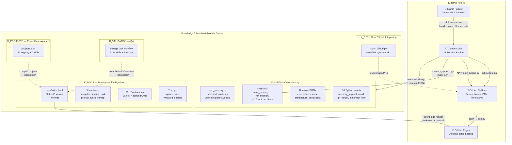


**Légende** : Le système est organisé en 5 modules K_ sous un répertoire `Knowledge/`. K_MIND est le core obligatoire — toujours chargé, toujours maintenu. Les autres modules (K_DOCS, K_GITHUB, K_PROJECTS, K_VALIDATION) fournissent des capacités spécialisées. Claude Code est l'environnement d'exécution, lisant la mindmap à chaque début de session et maintenant la mémoire via des scripts à chaque tour. GitHub Pages sert le viewer web statique avec rendu côté client du markdown et mermaid.

---

## 2. Architecture mémoire Mind-First

Le système organise les connaissances en 4 niveaux de stabilité décroissante et de granularité croissante. La mindmap est la grille de directives opérationnelles — toujours chargée en premier. Les JSONs de domaine fournissent des références structurées. La near memory suit la session en temps réel. La far memory préserve l'historique verbatim complet.

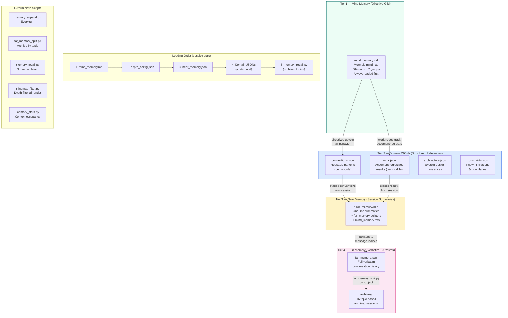


**Légende** : Les connaissances remontent (far memory → near memory → JSONs de domaine → mindmap) par le pipeline de staging. Elles descendent (mindmap → comportement session) comme directives opérationnelles. L'ordre de chargement suit la stabilité : le plus stable d'abord (mindmap), le plus granulaire en dernier (far memory archivée). Toutes les opérations mécaniques utilisent des scripts Python déterministes — Claude fournit l'intelligence (résumés, noms de sujets) comme arguments.

---

## 3. Architecture multi-module

Les 5 modules K_, leur structure interne, scripts et relations au sein du dépôt Knowledge 2.0.

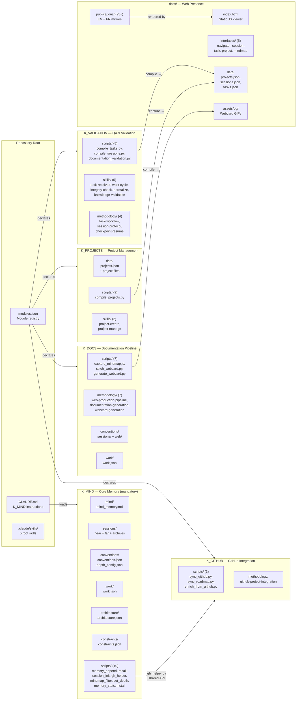


**Légende** : Le dépôt est organisé en 5 modules K_ sous `Knowledge/`. Chaque module possède ses propres conventions, état de travail et scripts. K_MIND est obligatoire (toujours chargé). Les autres modules sont déclarés dans `modules.json` et chargés à la demande. Le répertoire `docs/` est la sortie web — servi par GitHub Pages avec .nojekyll (aucune étape de build). Les scripts de compilation dans K_VALIDATION et K_PROJECTS produisent des données JSON consommées par les interfaces du viewer statique.

---

## 4. Cycle de vie de session

Chaque session Claude Code suit un cycle de vie déterministe géré par les scripts K_MIND. La mindmap est chargée en premier, la mémoire est maintenue à chaque tour, et les sujets sont archivés une fois terminés.

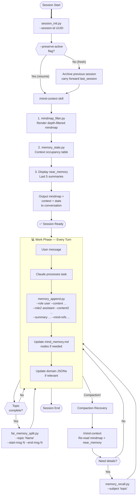


**Légende** : Le cycle de vie de session a trois phases : démarrage (/mind-context), travail (memory_append à chaque tour) et récupération (gestion de compaction). Le principe mind-first signifie que la mindmap est toujours chargée en premier — elle contient toutes les directives comportementales. La far memory stocke la conversation verbatim complète ; la near memory stocke des résumés en une ligne avec des pointeurs. L'archivage par sujet maintient far_memory.json gérable. La récupération de compaction relit la mindmap et la near memory, avec rappel optionnel approfondi depuis les archives.

---

## 5. Flux d'interaction des modules

Comment les 5 modules K_ interagissent : K_MIND comme hub central, pipelines de compilation alimentant le viewer web, et invocations de skills inter-modules.

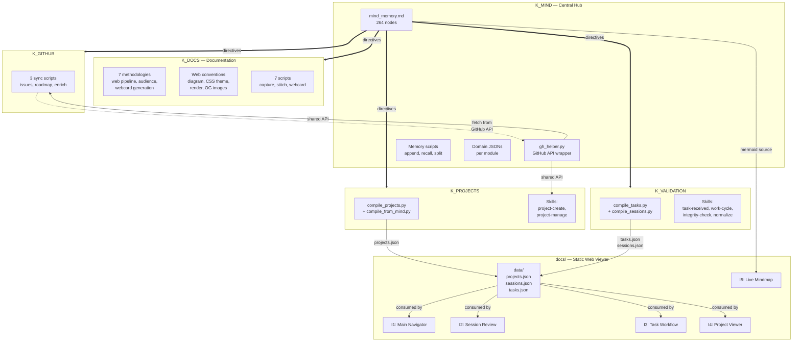


**Légende** : K_MIND est le hub — sa mindmap fournit des directives à tous les modules, et gh_helper.py est le wrapper API GitHub partagé. K_PROJECTS et K_VALIDATION compilent des données structurées dans les fichiers JSON de `docs/data/` consommés par les 5 interfaces web. K_GITHUB synchronise l'état GitHub externe. K_DOCS possède la méthodologie et les conventions du pipeline web. La live mindmap (I5) lit directement depuis mind_memory.md.

---

## 6. Pipeline de publication

Chaque publication existe à deux niveaux web (résumé + complet), en deux langues (EN + FR), rendue par le viewer JS statique avec 4 variantes de thème.

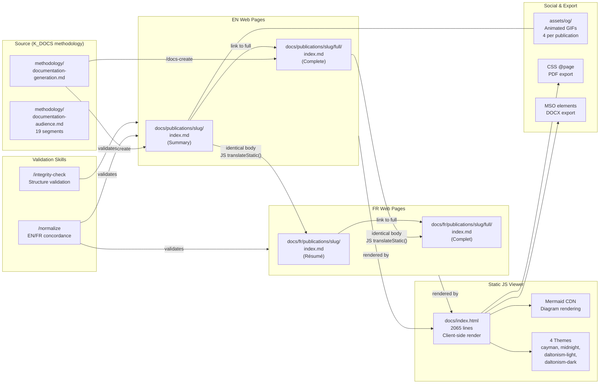


**Légende** : Les publications suivent la méthodologie K_DOCS. Les pages EN et FR partagent des corps `{::nomarkdown}` identiques — la langue est un paramètre runtime via JS `translateStatic()` (convention conv-020 : jamais de duplication de templates). Le viewer statique rend le markdown + mermaid côté client avec 4 variantes de thème. L'export PDF utilise CSS @page media ; le DOCX utilise des éléments MSO. Les skills de validation assurent la concordance EN/FR et l'intégrité structurelle.

---

## 7. Limites de sécurité

Le modèle proxy régissant ce que les sessions Claude Code peuvent et ne peuvent pas faire. Le proxy du conteneur médiatise toutes les opérations git tandis que Python urllib le contourne pour l'accès API.

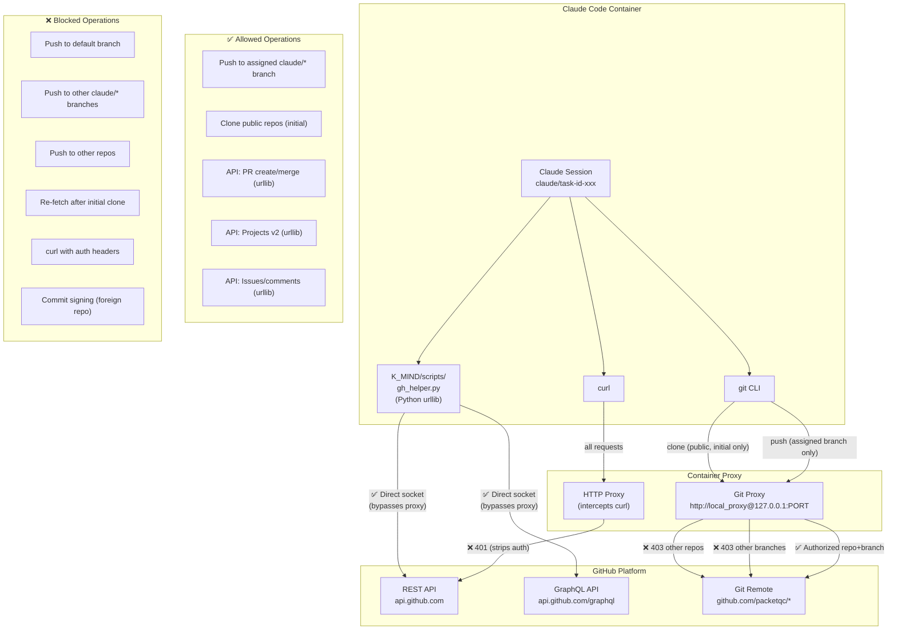


**Légende** : Le proxy du conteneur est la limite de sécurité principale. Les opérations git sont restreintes à la branche de tâche assignée. `gh_helper.py` (situé dans K_MIND/scripts/) contourne le proxy via Python `urllib`, permettant un accès complet à l'API GitHub avec un token valide. `curl` est intercepté et les headers d'authentification sont supprimés. Le modèle à deux canaux : proxy git (restreint) + urllib (sans restriction avec token). Le token n'est jamais exposé dans les commandes ou URLs — gh_helper.py gère la récupération du token en interne.

---

## 8. Architecture web

L'architecture du viewer web statique : GitHub Pages .nojekyll, rendu côté client, système à 4 thèmes, 5 interfaces interactives et synchronisation de thème via BroadcastChannel.

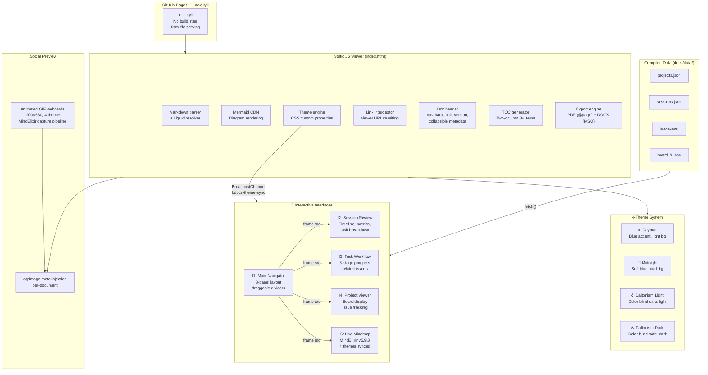


**Légende** : La présence web utilise GitHub Pages .nojekyll — aucun build côté serveur. Le viewer JS statique (2065 lignes) gère le parsing markdown, le rendu mermaid, la réécriture de liens, le changement de thème et l'export. Le système à 4 thèmes utilise des propriétés CSS personnalisées injectées par un moteur de thème. Les interfaces s'exécutent comme iframes dans le navigateur principal, recevant les diffusions de thème via BroadcastChannel. Les données JSON compilées par K_VALIDATION et K_PROJECTS alimentent les interfaces. MindElixir v5.9.3 alimente la live mindmap avec les mêmes 4 thèmes.

---

## 9. Graphe de dépendance des qualités

Les 13 qualités core et comment elles dépendent les unes des autres. Autosuffisant est la fondation — si le système dépend de services externes, rien d'autre ne fonctionne.

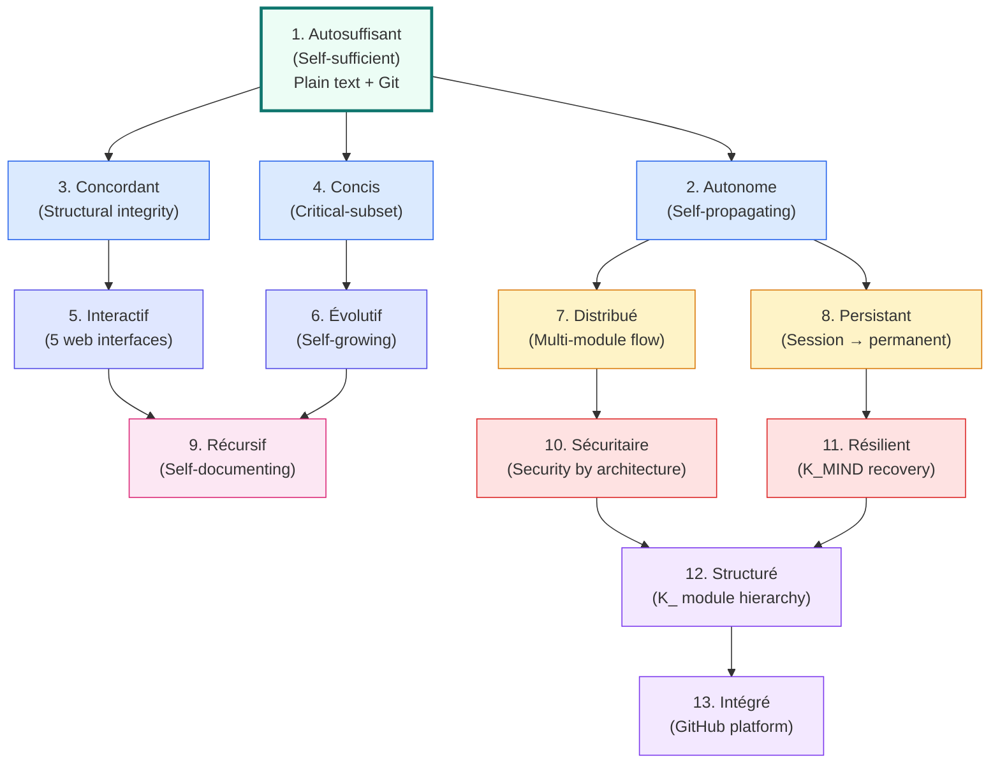


**Légende** : Le graphe de dépendance coule de la fondation (autosuffisant — texte brut dans Git) à travers les qualités habilitantes vers les qualités organisationnelles. Mis à jour pour Knowledge 2.0 : Interactif référence les 5 interfaces web, Distribué référence le flux multi-module, Résilient référence la récupération K_MIND, et Structuré référence la hiérarchie des modules K_.

---

## 10. Chemins de récupération

Les mécanismes de récupération K_MIND, du plus léger au plus lourd. Chaque chemin répond à un mode de panne différent.

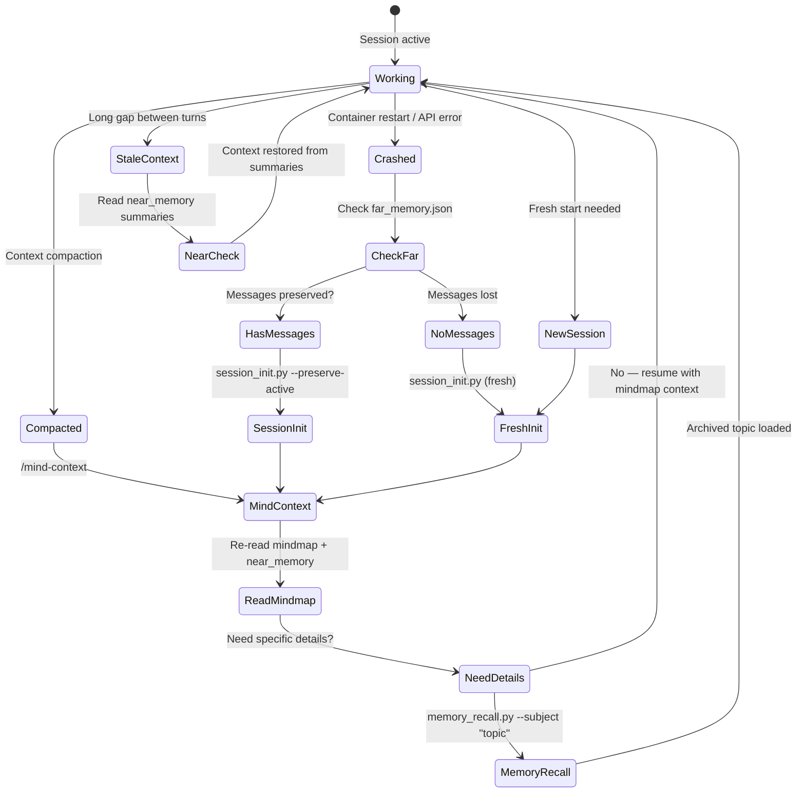


**Légende** : K_MIND fournit 4 chemins de récupération. **Compaction** (le plus courant) : `/mind-context` recharge la mindmap et la near memory — suffisant dans la plupart des cas. **Rappel profond** : `memory_recall.py` recherche dans les sujets archivés quand des détails spécifiques sont nécessaires. **Récupération de crash** : `session_init.py --preserve-active` préserve les messages existants. **Démarrage frais** : nouvelle session hérite des résumés last_session pour la continuité.

**Résumé de récupération** :

| Récupération | Déclencheur | Vitesse | Ce qui est restauré |
|--------------|------------|---------|---------------------|
| `/mind-context` | Compaction de contexte | ~5s | Directives mindmap + résumés récents |
| `memory_recall.py` | Besoin de détails archivés | ~10s | Sujet spécifique depuis les archives |
| `session_init --preserve-active` | Crash avec messages | ~10s | Continuité complète de session |
| `session_init` (frais) | Nouvelle session | ~15s | Démarrage propre + contexte last_session |
| Vérification near memory | Contexte périmé | ~3s | Résumés d'activité récente |

---

## 11. Intégration GitHub

Le module K_GITHUB gère la synchronisation des entités GitHub. `gh_helper.py` (dans K_MIND/scripts/) est le wrapper API partagé utilisé par tous les modules.

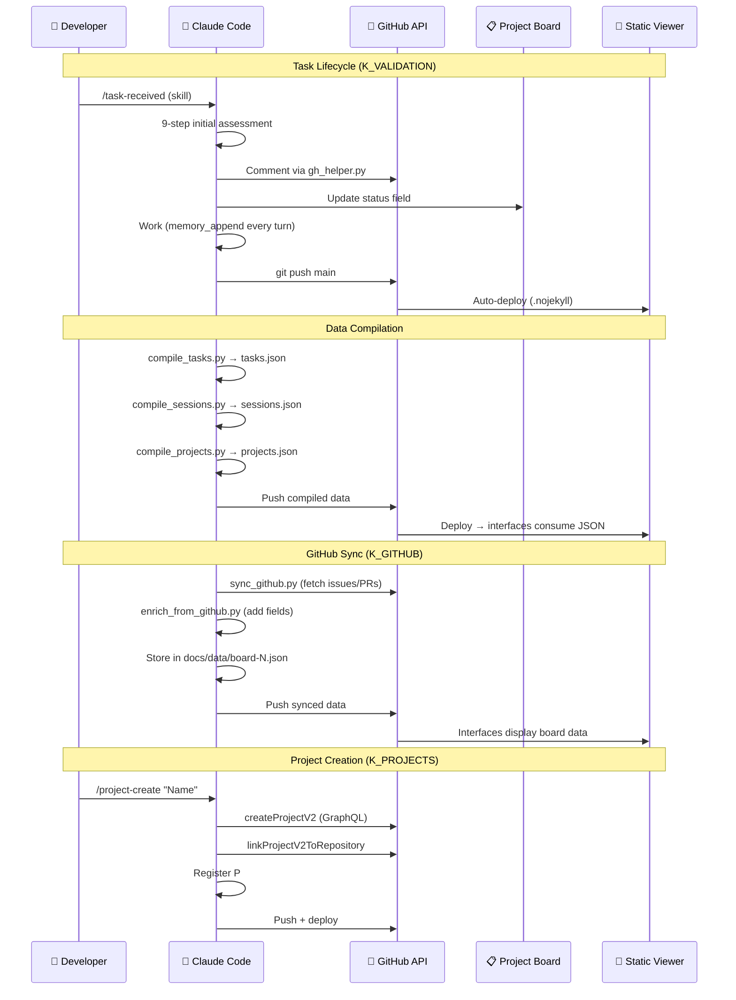


**Légende** : Trois flux de travail clés. **Cycle de vie des tâches** : évaluation par skill → travail avec mémoire en temps réel → push vers main → auto-déploiement. **Compilation de données** : les scripts K_VALIDATION et K_PROJECTS compilent des JSON consommés par les interfaces web. **Synchronisation GitHub** : les scripts K_GITHUB récupèrent l'état externe dans des fichiers de données locaux. Tous les appels API passent par `gh_helper.py` (Python urllib, contourne le proxy du conteneur).

---

## 12. Carte mentale de l'architecture système

Carte de navigation de haut niveau du système Knowledge 2.0 avec ses piliers architecturaux.

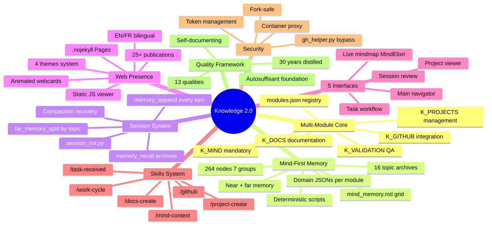


**Les piliers architecturaux** :

| # | Pilier | Essence | Éléments clés |
|---|--------|---------|---------------|
| 1 | **Core multi-module** | L'organisation K_ | 5 modules + registre, chacun avec ses conventions/travail/scripts |
| 2 | **Mémoire mind-first** | La mémoire opérationnelle | Mindmap → JSONs domaine → near/far → archives |
| 3 | **Système de session** | Le rythme de travail | init → append → split → recover |
| 4 | **Présence web** | La face publique | Viewer statique, .nojekyll, 4 thèmes, 25+ pubs |
| 5 | **5 interfaces** | La couche interactive | Navigateur, session, tâche, projet, mindmap |
| 6 | **Système de skills** | La surface de commande | Skills spécifiques par module invoqués par Claude |
| 7 | **Sécurité** | Confiance par conception | Modèle proxy, gestion de tokens, fork-safe |
| 8 | **Cadre qualité** | Le contrat qualité | 13 qualités, graphe de dépendance, 30 ans distillés |

---

## 13. Carte mentale de la structure des modules

La structure au niveau fichier de Knowledge 2.0 — chaque module et ses composants.

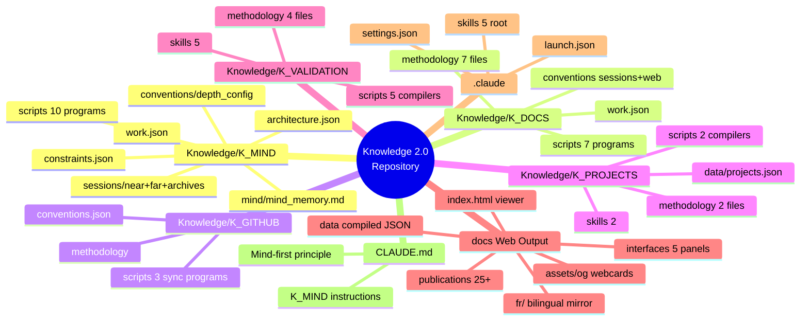


**Rôles des modules** :

| Module | Fichiers | Rôle principal |
|--------|----------|---------------|
| **K_MIND** | 38 | Mémoire core : mindmap, sessions, JSONs domaine, 10 scripts |
| **K_DOCS** | 4 374 | Pipeline documentation : viewer web, publications, interfaces |
| **K_PROJECTS** | 13 | Gestion de projet : registre P#, compilation, skills |
| **K_VALIDATION** | 19 | QA : workflow tâches, protocole session, vérifications d'intégrité |
| **K_GITHUB** | 9 | Synchronisation GitHub : issues, PRs, boards, enrichissement |
| **docs/** | 100+ | Sortie web : viewer statique, 25+ pubs, 5 interfaces |

---

## 14. Carte mentale de la structure Publication

L'anatomie d'une publication Knowledge 2.0 — composants, niveaux, assets et intégration.

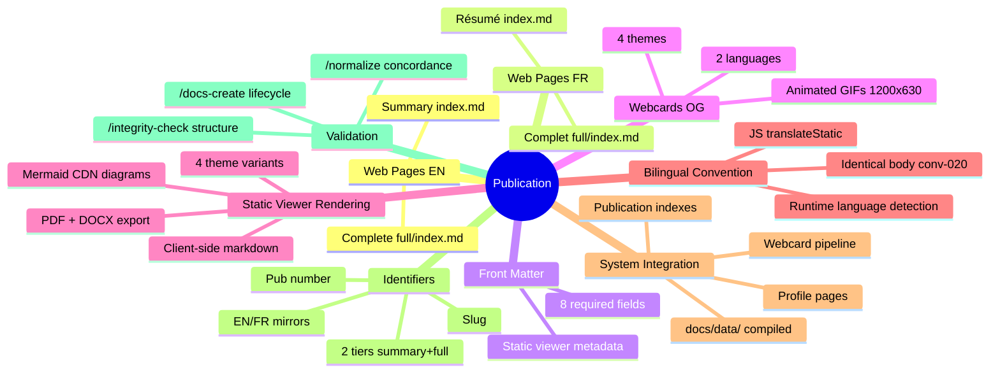


**Cycle de vie d'une publication** :

```
/docs-create → Pages EN/FR scaffoldées → Webcards générées
    → Contenu écrit (corps EN/FR identique)
    → /normalize → Concordance EN/FR vérifiée
    → /integrity-check → Structure validée
    → Push → .nojekyll deploy → En ligne sur GitHub Pages
```

---

## Publications liées

| # | Publication | Relation |
|---|-------------|---------|
| 0 | [Système de connaissances]({{ '/fr/publications/knowledge-system/' | relative_url }}) | Parent — le système que ces diagrammes visualisent |
| 4 | [Connaissances distribuées]({{ '/fr/publications/distributed-minds/' | relative_url }}) | Architecture — flux multi-module (Diagramme 5) |
| 7 | [Protocole Harvest]({{ '/fr/publications/harvest-protocol/' | relative_url }}) | Protocole — flux de données (Diagrammes 5, 11) |
| 8 | [Gestion de session]({{ '/fr/publications/session-management/' | relative_url }}) | Cycle de vie — système de session K_MIND (Diagramme 4) |
| 9 | [Sécurité par conception]({{ '/fr/publications/security-by-design/' | relative_url }}) | Sécurité — limites proxy (Diagramme 7) |
| 12 | [Gestion de projet]({{ '/fr/publications/project-management/' | relative_url }}) | Projets — module K_PROJECTS (Diagrammes 1, 8) |

---

*Auteurs : Martin Paquet & Claude (Anthropic, Opus 4.6)*
*Knowledge 2.0 : [packetqc/knowledge](https://github.com/packetqc/knowledge)*
