# Diagrammes d'architecture de Knowledge — Documentation complète
{: #pub-title}

**Table des matières**

| | |
|---|---|
| [Auteurs](#auteurs) | Auteurs de la publication |
| [Résumé](#resume) | Companion visuel de l'analyse d'architecture |
| [Conventions des diagrammes](#conventions-des-diagrammes) | Codage couleur, notation, syntaxe Mermaid |
| [1. Vue d'ensemble](#1-vue-densemble--contexte-c4) | Contexte C4 — Knowledge au centre |
| [2. Couches de connaissances](#2-couches-de-connaissances) | Pile à 4 couches : Core → Prouvé → Récolté → Session |
| [3. Architecture des composants](#3-architecture-des-composants) | Tous les dossiers, scripts et relations |
| [4. Cycle de vie de session](#4-cycle-de-vie-de-session) | Wakeup → travail → checkpoint → save → PR → merge |
| [5. Flux distribué](#5-flux-distribue--push-et-pull) | Push (wakeup) et pull (harvest) avec promotion |
| [6. Pipeline de publication](#6-pipeline-de-publication) | Source → EN/FR résumé/complet avec flux de sync |
| [7. Limites de sécurité](#7-limites-de-securite) | Modèle proxy — opérations autorisées vs bloquées |
| [8. Niveaux de déploiement](#8-niveaux-de-deploiement) | Double rôle production/développement des satellites |
| [9. Dépendances des qualités](#9-graphe-de-dependance-des-qualites) | Graphe de dépendance des 13 qualités |
| [10. Échelle de récupération](#10-echelle-de-recuperation) | 5 chemins de récupération par type de panne |
| [11. Intégration GitHub](#11-integration-github) | Cycle de vie Issues, PRs, Project boards |
| [Publications liées](#publications-liees) | Publications parentes et liées |

## Auteurs

**Martin Paquet** — Analyste et programmeur sécurité réseau, administrateur de sécurité des réseaux et des systèmes, et analyste programmeur et concepteur logiciels embarqués. Architecte du système Knowledge — une intelligence d'ingénierie IA auto-évolutive construite sur 30 ans d'expérience en systèmes embarqués, sécurité réseau et développement logiciel. A conçu l'architecture visuelle documentée dans ces diagrammes.

**Claude** (Anthropic, Opus 4.6) — Partenaire de développement IA. A co-créé les diagrammes architecturaux, rendant la structure du système en notation Mermaid pour une visualisation web interactive. Opère au sein du système que ces diagrammes décrivent.

---

## Résumé

La publication #14 (Analyse d'architecture) examine l'architecture du système à travers un récit analytique. Cette publication est le **companion visuel** — 14 diagrammes Mermaid qui rendent la structure, les flux, les limites et les dépendances du système Knowledge en visualisations interactives et navigables.

Ces diagrammes couvrent toute la surface architecturale : du contexte C4 de haut niveau (Knowledge au centre, entouré de satellites, GitHub et utilisateurs) jusqu'aux limites de sécurité granulaires (couches proxy, canaux API, portée des branches). Chaque diagramme est autonome mais inter-référencé — ensemble, ils forment une carte visuelle complète du système.

Tous les diagrammes utilisent la syntaxe [Mermaid](https://mermaid.js.org/), rendue nativement par GitHub Pages via CDN.

Closes #317

---

## Audience ciblée

Cette publication est destinée aux équipes de travail impliquées dans l'écosystème du système Knowledge :

| Audience | Quoi privilégier |
|----------|-----------------|
| **Administrateurs réseau** | Flux distribué (#5), limites de sécurité (#7), niveaux de déploiement (#8) |
| **Administrateurs système** | Niveaux de déploiement (#8), intégration GitHub (#11), pipeline de publication (#6) |
| **Programmeurs et programmeuses** | Architecture des composants (#3), cycle de vie de session (#4), échelle de récupération (#10) |
| **Gestionnaires** | Vue d'ensemble (#1), couches de connaissances (#2), dépendances des qualités (#9) |

Chaque diagramme est autonome avec des annotations. Commencez par la Vue d'ensemble (#1) pour le contexte de haut niveau, puis naviguez vers les diagrammes spécifiques à votre domaine. La publication companion #14 (Analyse d'architecture) fournit l'analyse écrite pour le domaine de chaque diagramme.

## Conventions des diagrammes

Tous les diagrammes utilisent la notation **Mermaid** — un langage de diagrammes basé sur le markdown, rendu côté client par le layout GitHub Pages.

**Codage couleur** :

| Couleur | Signification | Utilisé pour |
|---------|---------------|--------------|
| Sarcelle / Vert | Core / Stable / En santé | Connaissances core, patterns prouvés, statut sain |
| Bleu | Actif / En cours | Sessions, flux actifs, opérations en cours |
| Orange / Ambre | Avertissement / Dérive | Dérive de version, contenu périmé, problèmes mineurs |
| Rouge | Critique / Bloqué | Limites de sécurité, blocages proxy, dérive critique |
| Violet | Externe / Plateforme | GitHub, GitHub Pages, services externes |
| Gris | Inactif / En attente | Chemins inutilisés, éléments en attente |

**Notation** :

| Symbole | Signification |
|---------|---------------|
| Flèche pleine (`-->`) | Flux de données direct ou dépendance |
| Flèche tiretée (`-.->`) | Flux indirect ou périodique |
| Flèche épaisse (`-->`) | Chemin principal / critique |
| Sous-graphe | Groupement logique ou limite |

---

## 1. Vue d'ensemble — Contexte C4

Le système Knowledge (P0) se situe au centre d'une constellation d'acteurs : projets satellites, services de la plateforme GitHub, GitHub Pages pour la publication, Claude Code pour les sessions IA, et le développeur humain.

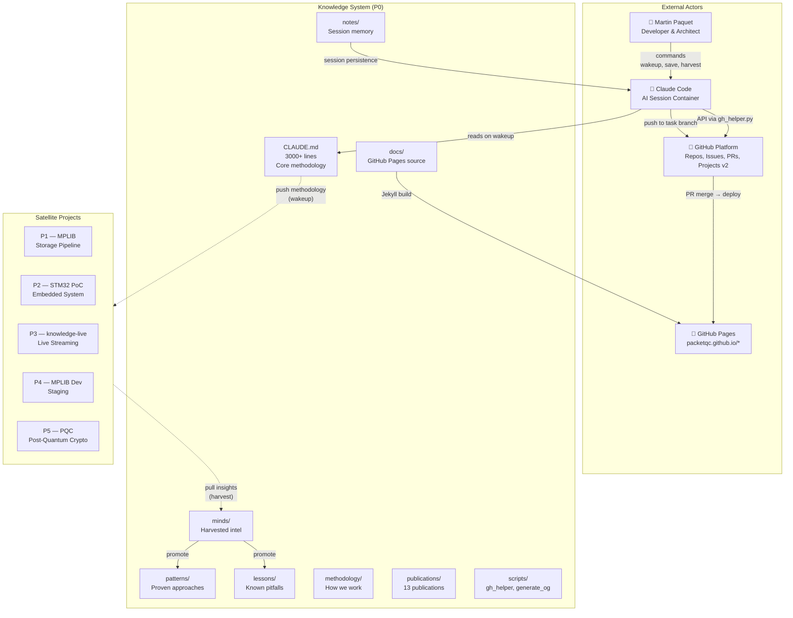


**Légende** : Le dépôt core contient toute la méthodologie, les publications et l'outillage. Les satellites héritent de la méthodologie au `wakeup` (push) et contribuent des découvertes via `harvest` (pull). GitHub agit comme la couche de persistance et de collaboration. GitHub Pages publie la présence web. Claude Code est l'environnement d'exécution — des conteneurs éphémères qui deviennent conscients via le protocole `wakeup`.

---

## 2. Couches de connaissances

Le système organise les connaissances en 4 couches de stabilité décroissante et de pertinence croissante. Le core est l'ADN — change rarement, autorité maximale. La session est le battement de cœur — éphémère, pertinence maximale.

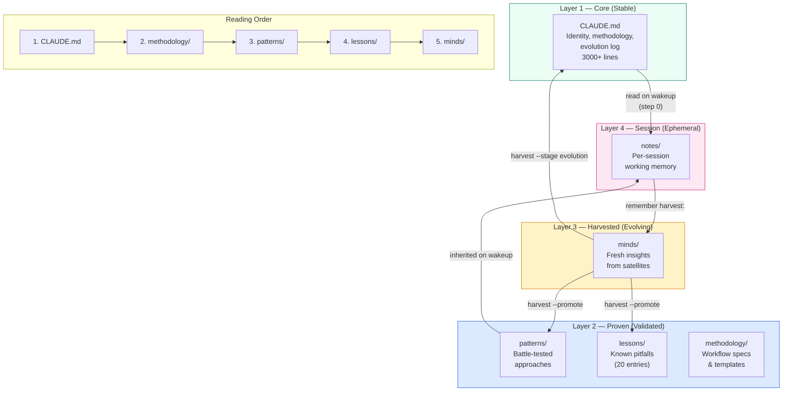


**Légende** : Les connaissances remontent (session → récolté → prouvé → core) par le pipeline de promotion. Elles descendent (core → session) par le protocole wakeup. L'ordre de lecture pour les nouvelles instances Claude suit le gradient de stabilité : le plus stable d'abord, le plus actuel en dernier.

---

## 3. Architecture des composants

Les dossiers principaux, scripts et leurs relations au sein du dépôt knowledge.

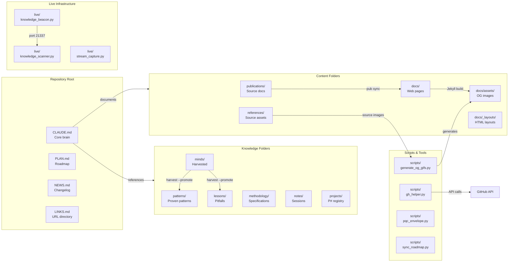


**Légende** : Le dépôt est organisé en cinq groupes majeurs : fichiers racine (points d'entrée), dossiers de connaissances (les couches d'intelligence), dossiers de contenu (publications et pages web), scripts (outillage d'automatisation) et infrastructure live (communication inter-instances). Les flèches montrent le flux de données entre les composants.

---

## 4. Cycle de vie de session

Chaque session Claude Code suit un cycle de vie déterministe. Ce flowchart montre le chemin complet du début à la fin de session, incluant la récupération de crash et les chemins de perte de contexte.

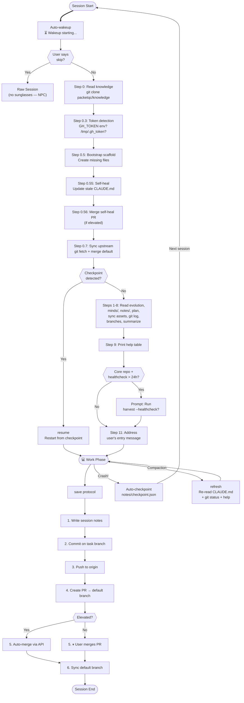


**Légende** : Le cycle de vie de session a trois phases : démarrage (wakeup), travail et livraison (save). La récupération de crash utilise les checkpoints. La récupération de perte de contexte utilise `refresh`. Le chemin élevé (avec token) est entièrement autonome ; le chemin semi-automatique nécessite un clic utilisateur pour fusionner la PR.

---

## 5. Flux distribué — Push et Pull

Le flux bidirectionnel de connaissances entre le cerveau maître (P0) et les projets satellites. Le push livre la méthodologie vers l'extérieur ; le harvest tire les découvertes vers l'intérieur. Le pipeline de promotion fait avancer les découvertes du brut vers le core.

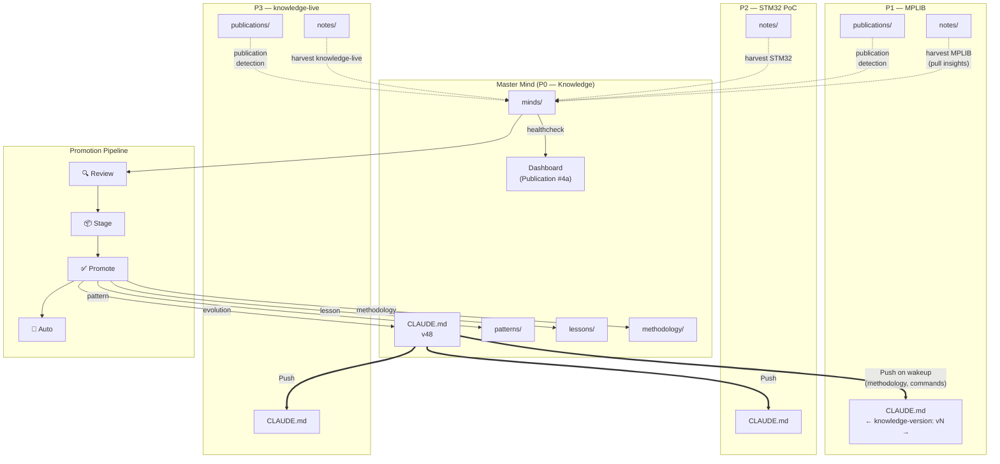


**Légende** : Les flèches épaisses représentent le flux push (wakeup). Les flèches tiretées représentent le flux pull (harvest). Le pipeline de promotion fait avancer les découvertes à travers quatre étapes : révision (validée par humain), préparation (typée et ciblée), promotion (écrite dans le core), auto (en file pour le prochain healthcheck). Le tableau de bord est mis à jour à chaque harvest.

---

## 6. Pipeline de publication

Chaque publication existe à trois niveaux : source (canonique), résumé (web) et complet (web). Chaque niveau est bilingue (EN + FR). Ce diagramme montre les flux de sync et de révision.

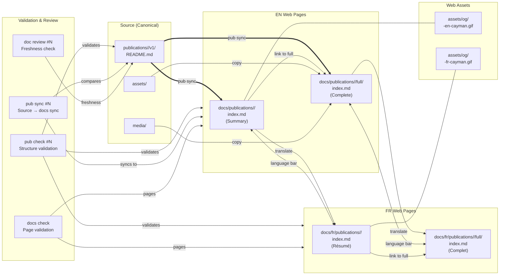


**Légende** : Le README.md source est la source unique de vérité. `pub sync` propage les changements de la source vers les pages web EN. La traduction produit les miroirs FR. Chaque page web lie vers son miroir linguistique (EN ↔ FR) et vers sa variante de profondeur (résumé ↔ complet). Quatre commandes de validation assurent l'intégrité structurelle, la concordance source-docs, la fraîcheur du contenu et la correction au niveau des pages.

---

## 7. Limites de sécurité

Le modèle proxy régissant ce que les sessions Claude Code peuvent et ne peuvent pas faire. Le proxy du conteneur médiatise toutes les opérations git tandis que Python urllib le contourne pour l'accès API.

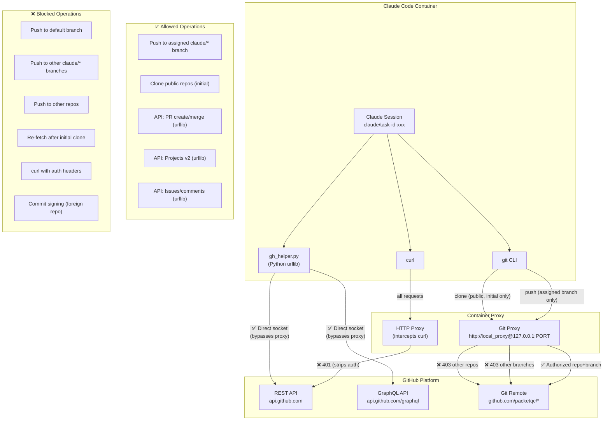


**Légende** : Le proxy du conteneur est la limite de sécurité principale. Les opérations git sont restreintes à la branche de tâche assignée du repo courant. Python `urllib` (utilisé par `gh_helper.py`) contourne le proxy entièrement, permettant un accès complet à l'API GitHub avec un token valide. `curl` est intercepté par le proxy et les headers d'authentification sont supprimés. Le modèle à deux canaux : proxy git (restreint) + urllib (sans restriction avec token).

---

## 8. Niveaux de déploiement

Le modèle de déploiement multi-niveaux où chaque satellite est simultanément développement (relatif au core) et production (à son propre niveau). Chaque nœud publie indépendamment via GitHub Pages.

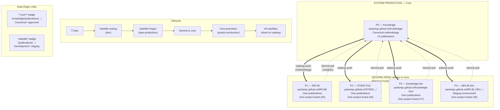


**Légende** : Le modèle de déploiement est multi-niveaux. Le core est la production système — le cerveau canonique. Chaque satellite est simultanément développement relatif au core (terrain d'essai pour les nouvelles capacités) et production à son propre niveau (GitHub Pages indépendant, boards de projet, publications). Les idées circulent : test satellite → pages satellite → harvest → promotion core → tous les satellites héritent.

---

## 9. Graphe de dépendance des qualités

Les 13 qualités core et comment elles dépendent les unes des autres. Autosuffisant est la fondation — si le système dépend de services externes, rien d'autre ne fonctionne.

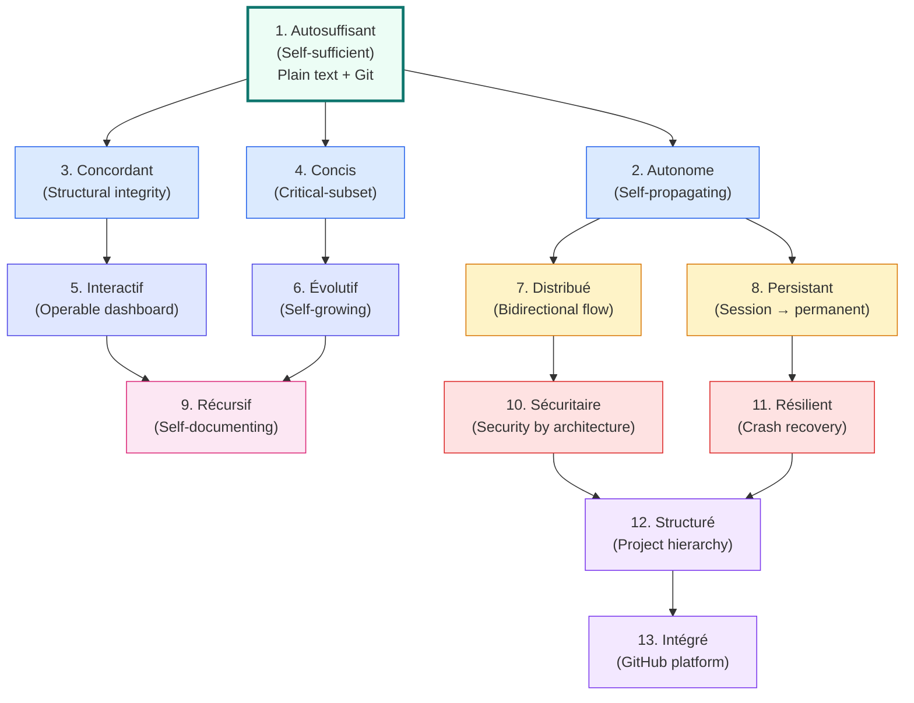


**Légende** : Le graphe de dépendance coule de la fondation (autosuffisant — texte brut dans Git) à travers les qualités habilitantes (autonome, concordant, concis) vers les qualités opérationnelles (interactif, évolutif) vers les qualités réseau (distribué, persistant) vers les méta-qualités (récursif, sécuritaire, résilient) vers les qualités organisationnelles (structuré, intégré). Chaque qualité renforce celles qui en dépendent.

---

## 10. Échelle de récupération

Les cinq chemins de récupération, du plus léger au plus lourd. Chaque chemin répond à un mode de panne différent.

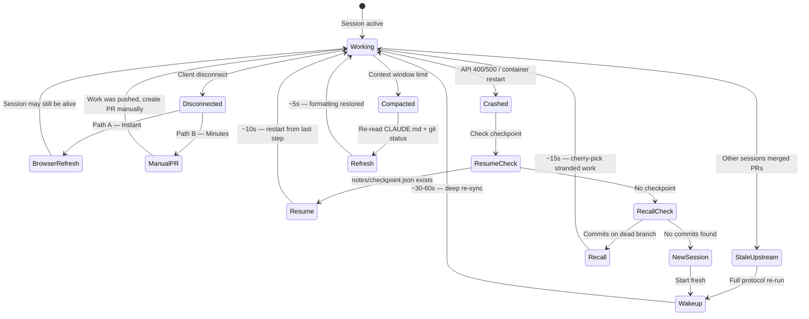


**Légende** : L'échelle de récupération associe les modes de panne aux chemins de récupération. Déconnexion client : rafraîchissement navigateur (instant) ou PR manuelle (minutes). Crash avec checkpoint : `resume` (~10s). Crash sans checkpoint : `recover` (~15s). Compaction de contexte : `refresh` (~5s). Amont périmé : `wakeup` (~30-60s). Chaque chemin est la réponse la plus légère possible à son mode de panne.

**Résumé de récupération** :

| Récupération | Déclencheur | Vitesse | Ce qui est restauré |
|--------------|------------|---------|---------------------|
| Rafraîchissement navigateur | Déconnexion client | Instant | Session peut être encore vivante côté serveur |
| PR manuelle | Push réussi, PR interrompue | Minutes | Travail sur branche distante obtient une PR |
| `resume` | Crash avec checkpoint | ~10s | Progrès du protocole + état todo |
| `recover` | Crash, pas de checkpoint | ~15s | Code commité depuis branche morte |
| `recall` | Recherche de mémoire profonde | ~10s | Connaissances et décisions des sessions passées |
| `refresh` | Compaction de contexte | ~5s | Formatage + règles CLAUDE.md |
| `wakeup` | Amont périmé | ~30-60s | Re-sync complète en profondeur |
| Nouvelle session | Compaction sévère | ~60s | Démarrage complètement neuf |

---

## 11. Intégration GitHub

Le cycle de vie des entités GitHub (Issues, PRs, éléments de Project board) au sein du système Knowledge. Chaque type d'entité a un cycle de vie bien défini géré par `gh_helper.py`.

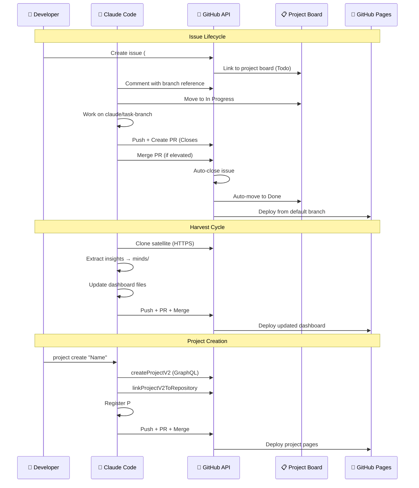


**Légende** : Trois flux de travail clés. **Cycle de vie Issue** : issue créée → liée au board → travail (In Progress) → PR avec "Closes #N" → fusion → auto-fermeture → auto-Done. **Cycle Harvest** : cloner satellite → extraire → mettre à jour tableau de bord → push → déployer. **Création de projet** : créer board → lier au repo → scaffold présence web → déployer. Tous les appels API passent par `gh_helper.py` (Python urllib).

**Résumé du cycle de vie des entités GitHub** :

| Entité | Créée par | Gérée par | Fermée par |
|--------|-----------|-----------|------------|
| Issue | Utilisateur (UI GitHub) | Claude (commentaires, labels) | Auto-fermeture à la fusion PR (`Closes #N`) |
| PR | Claude (`gh_helper.py`) | Claude (push, création) | Claude fusion (élevé) ou utilisateur (semi-auto) |
| Élément board | Utilisateur ou Claude (brouillon/lié) | Claude (`project_item_update`) | Auto-Done à la fermeture de l'issue |
| Project board | Claude (`createProjectV2`) | Claude (champs, éléments) | Jamais (persistant) |

---

## 12. Carte mentale de l'architecture système

Carte de navigation de haut niveau du système Knowledge avec ses 9 piliers architecturaux. Cette carte mentale offre une vue d'ensemble complémentaire aux diagrammes détaillés ci-dessus.

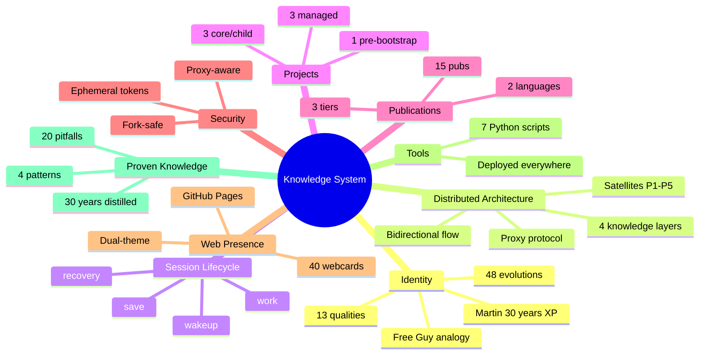


**Les 9 piliers architecturaux** :

| # | Pilier | Essence | Éléments clés |
|---|--------|---------|---------------|
| 1 | **Identité** | L'ADN du système | 13 qualités, analogie Free Guy, 48 évolutions, Martin 30 ans XP |
| 2 | **Architecture distribuée** | Le réseau vivant | Flux bidirectionnel, 4 couches, satellites, protocole proxy |
| 3 | **Cycle de session** | Le rythme de travail | wakeup → work → save → récupération |
| 4 | **Projets** | Les entités P0-P9 | 3 core/child, 3 gérés, 1 pré-bootstrap |
| 5 | **Publications** | La face publique | 15 pubs × 3 niveaux × 2 langues |
| 6 | **Sécurité** | Confiance par conception | Tokens éphémères, proxy-aware, fork-safe |
| 7 | **Présence web** | La constellation de sites | GitHub Pages, dual-theme, 40 webcards |
| 8 | **Outils** | La boîte à outils | 7 scripts Python déployés partout |
| 9 | **Savoir éprouvé** | La mémoire longue | 4 patterns + 20 pièges = 30 ans distillés |

**Source** : [Issue #317](https://github.com/packetqc/knowledge/issues/317) — Session interactive d'exploration architecturale voix-vers-texte.

---

## 13. Carte mentale du noyau core

La structure au niveau fichier du système Knowledge — chaque dossier avec son poids, son rôle et son contenu. L'ensemble du système tient dans < 1 Mo de Markdown + Python.

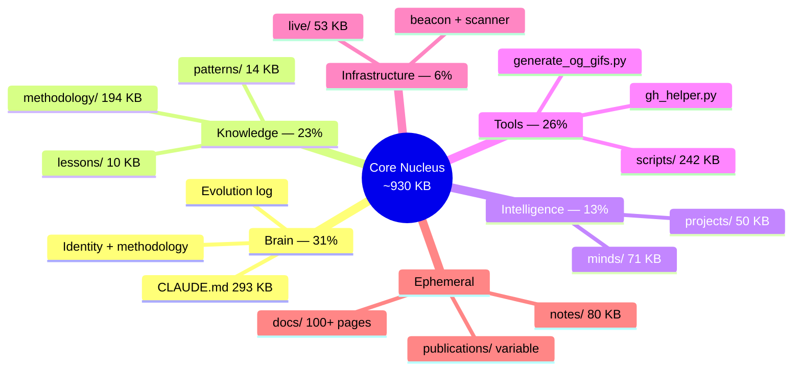


**Poids du noyau par rôle** :

| Rôle | Composants | Poids | Proportion |
|------|-----------|-------|------------|
| **Cerveau** | CLAUDE.md | 293 Ko | 31% |
| **Connaissances** | methodology + patterns + lessons | 218 Ko | 23% |
| **Intelligence** | minds + projects | 121 Ko | 13% |
| **Outils** | scripts | 242 Ko | 26% |
| **Infrastructure** | live | 53 Ko | 6% |
| **Éphémère** | docs + notes + publications | Variable | — |
| **Total noyau** | **~930 Ko** | **100%** | |

**Priorité de lecture pour les instances Claude** :

| Priorité | Dossier / Fichier | Taille | Autorité | Survit à la compaction ? | Rôle |
|----------|-------------------|--------|----------|--------------------------|------|
| **P0** | `CLAUDE.md` | 293 Ko | Système (instructions projet) | Oui | **Le noyau** — identité, méthodologie, commandes, évolution, pièges |
| **P1** | `methodology/` | 194 Ko | Conversation (lu au wakeup) | Non | Plans d'implémentation — bootstrap, checkpoint, projets, export |
| **P2** | `patterns/` | 14 Ko | Conversation | Non | Savoir éprouvé — debugging embarqué, RTOS, SQLite, UI/backend |
| **P3** | `lessons/` | 10 Ko | Conversation | Non | Erreurs à éviter — 20 pièges documentés |
| **P4** | `minds/` | 71 Ko | Conversation | Non | Intelligence récoltée des satellites — plus récent, moins validé |
| **P5** | `notes/` | 80 Ko (3 derniers) | Conversation | Non | Mémoire éphémère — contexte session précédente |
| **P6** | `projects/` | 50 Ko | Conversation | Non | Registre d'entités P0-P9 avec métadonnées |
| **P7** | `scripts/` | 242 Ko | Exécutable | N/A | Outils déployés — non lus, exécutés (gh_helper, webcards, beacon) |
| **P8** | `publications/` | Variable | Conversation | Non | Source pour 15 publications — lu à la demande, pas au wakeup |
| **P9** | `docs/` | 100+ pages | Web | N/A | Présence web — GitHub Pages, pas lu par Claude |
| **P10** | `live/` | 53 Ko | Exécutable | N/A | Infrastructure live — beacon, scanner, capture |

**Découverte clé — Le fossé d'autorité** : CLAUDE.md (293 Ko) a l'**autorité système** — survit à la compaction, chargé comme « instructions projet ». Tout le reste (~640 Ko) a l'**autorité conversation** — lu au wakeup étape 0, perdu à la première compaction. C'est pourquoi le **sous-ensemble critique** (v31) est vital : le CLAUDE.md satellite (~180 lignes) porte assez d'ADN comportemental pour survivre post-compaction.

**Source** : [Issue #317](https://github.com/packetqc/knowledge/issues/317) — Exploration architecturale détaillée.

---

## 14. Carte mentale de la structure Publication

L'anatomie d'une Publication — tous ses composants, niveaux, assets, métadonnées et points d'intégration.

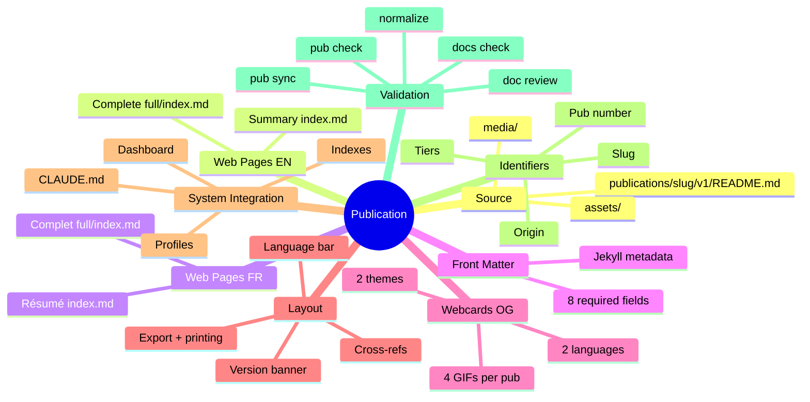


**Cycle de vie d'une publication** :

```
pub new → Source créée → Pages EN/FR scaffoldées → Webcards générées
    → Contenu écrit dans Source
    → pub sync → Pages web mises à jour
    → doc review → Fraîcheur vérifiée
    → pub check → Structure validée
    → normalize → Concordance globale
```

**Branches de publication** :

| Branche | Role | Fichiers |
|---------|------|----------|
| **Source** | Vérité canonique, versionnée | `publications/<slug>/v1/README.md` + `assets/` + `media/` |
| **Pages web EN** | Présence web anglaise, 2 niveaux | Résumé (`index.md`) + Complet (`full/index.md`) |
| **Pages web FR** | Miroir français | Même structure sous `docs/fr/` |
| **Front matter** | Métadonnées Jekyll | 8 champs requis par page |
| **Webcards OG** | Aperçu social animé | 4 GIFs par publication (2 langues × 2 thèmes) |
| **Layout** | Moteur de rendu | Bannière version, barre langue, export, impression, références croisées |
| **Intégration système** | Points de connexion | Index, profils, CLAUDE.md, tableau de bord |
| **Identifiants** | Système de nommage | #N, slug, niveaux, origine, inter-projet |
| **Validation** | Contrôle qualité | 5 commandes de vérification |

**Source** : [Issue #318](https://github.com/packetqc/knowledge/issues/318) — Exploration de la structure des publications.

---

## Publications liées

| # | Publication | Relation |
|---|-------------|---------|
| 0 | [Système de connaissances]({{ '/fr/publications/knowledge-system/' | relative_url }}) | Parent — le système que ces diagrammes visualisent |
| 4 | [Connaissances distribuées]({{ '/fr/publications/distributed-minds/' | relative_url }}) | Architecture — flux push/pull (Diagramme 5) |
| 7 | [Protocole Harvest]({{ '/fr/publications/harvest-protocol/' | relative_url }}) | Protocole — flux harvest (Diagrammes 5, 11) |
| 8 | [Gestion de session]({{ '/fr/publications/session-management/' | relative_url }}) | Cycle de vie — flux session (Diagramme 4) |
| 9 | [Sécurité par conception]({{ '/fr/publications/security-by-design/' | relative_url }}) | Sécurité — limites proxy (Diagramme 7) |
| 12 | [Gestion de projet]({{ '/fr/publications/project-management/' | relative_url }}) | Projets — hiérarchie P# (Diagrammes 1, 8) |

---

*Auteurs : Martin Paquet & Claude (Anthropic, Opus 4.6)*
*Knowledge : [packetqc/knowledge](https://github.com/packetqc/knowledge)*
