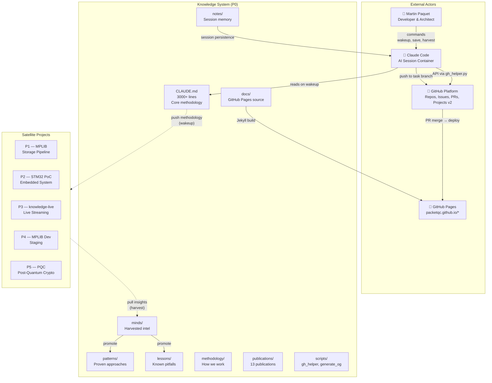
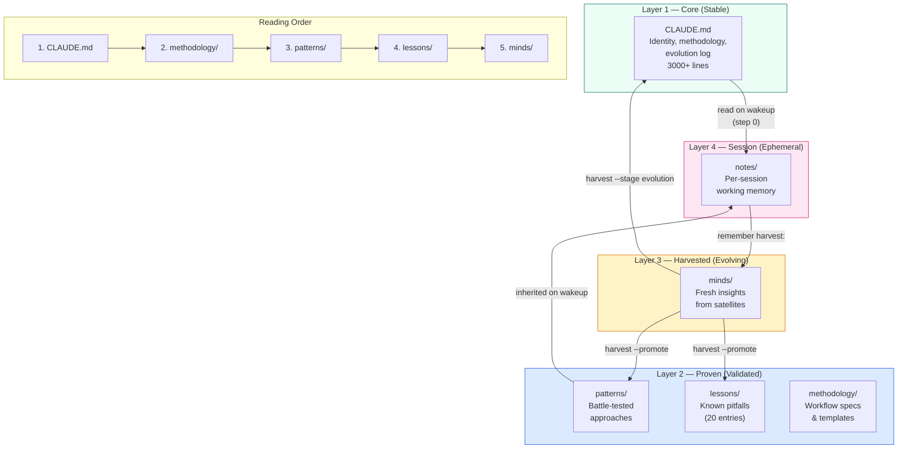
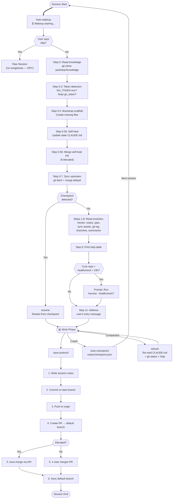
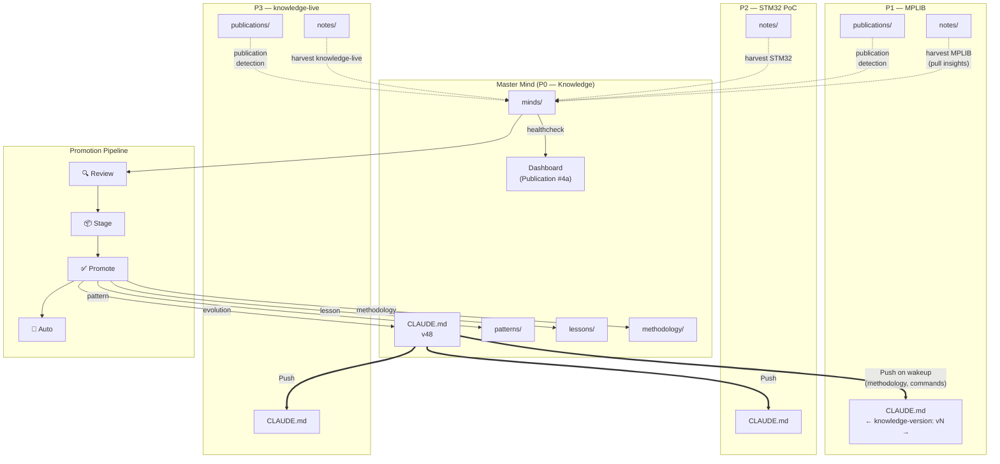

# Diagrammes d'architecture de Knowledge
{: #pub-title}

> **Publication parente** : [#0 — Systeme de connaissances]({{ '/fr/publications/knowledge-system/' | relative_url }}) | **Analyse companion** : [#14 — Analyse d'architecture]({{ '/fr/publications/architecture-analysis/' | relative_url }})

**Table des matieres**

| | |
|---|---|
| [Resume](#resume) | Companion visuel de l'analyse d'architecture |
| [Vue d'ensemble](#1-vue-densemble--contexte-c4) | Diagramme de contexte C4 — Knowledge au centre |
| [Couches de connaissances](#2-couches-de-connaissances) | Pile a 4 couches : Core → Prouve → Recolte → Session |
| [Cycle de vie de session](#4-cycle-de-vie-de-session) | Wakeup → travail → checkpoint → save → PR → merge |
| [Flux distribue](#5-flux-distribue--push-et-pull) | Push (wakeup) et pull (harvest) avec pipeline de promotion |
| [Documentation complete](#documentation-complete) | Les 14 diagrammes avec explications completes |

## Audience ciblee

| Audience | Quoi privilegier |
|----------|-----------------|
| **Administrateurs reseau** | Flux distribue (#5), limites de securite (#7), niveaux de deploiement (#8) |
| **Administrateurs systeme** | Niveaux de deploiement (#8), integration GitHub (#11), pipeline de publication (#6) |
| **Programmeurs et programmeuses** | Architecture des composants (#3), cycle de vie de session (#4), echelle de recuperation (#10) |
| **Gestionnaires** | Vue d'ensemble (#1), couches de connaissances (#2), dependances des qualites (#9) |

## Resume

La publication #14 (Analyse d'architecture) examine le systeme a travers un recit analytique. Cette publication est le **companion visuel** — 14 diagrammes Mermaid qui rendent la structure, les flux, les limites et les dependances du systeme Knowledge en visualisations interactives.

Ce resume presente les 4 diagrammes cles. La [documentation complete]({{ '/fr/publications/architecture-diagrams/full/' | relative_url }}) inclut les 14 diagrammes couvrant les limites de securite, les niveaux de deploiement, les dependances des qualites, les chemins de recuperation et l'integration GitHub.

Closes #317

## 1. Vue d'ensemble — Contexte C4

Le systeme Knowledge (P0) au centre de sa constellation : projets satellites, plateforme GitHub, GitHub Pages, sessions Claude Code et le developpeur.

Le depot core contient toute la methodologie, les publications et l'outillage. Les satellites heritent au `wakeup` (push) et contribuent via `harvest` (pull). GitHub Pages publie la presence web.

## 2. Couches de connaissances

Quatre couches de stabilite decroissante et de pertinence croissante — de l'ADN (core) au battement de coeur (session).

Les connaissances remontent par le pipeline de promotion et descendent par le protocole wakeup.

## 4. Cycle de vie de session

Chaque session Claude Code suit un chemin deterministe de l'auto-wakeup au save.

Trois phases : demarrage (wakeup), travail et livraison (save). Recuperation de crash via checkpoints. Perte de contexte via `refresh`.

## 5. Flux distribue — Push et Pull

Flux bidirectionnel de connaissances avec le pipeline de promotion.

Le push livre la methodologie vers l'exterieur au wakeup. Le harvest tire les decouvertes vers l'interieur. Le pipeline de promotion fait avancer les decouvertes du brut vers le core.

## Documentation complete

La [documentation complete]({{ '/fr/publications/architecture-diagrams/full/' | relative_url }}) inclut les 14 diagrammes :

| # | Diagramme | Ce qu'il montre |
|---|-----------|-----------------|
| 1 | Vue d'ensemble | Contexte C4 — Knowledge au centre |
| 2 | Couches de connaissances | Pile a 4 couches avec flux de promotion |
| 3 | Architecture des composants | Tous les dossiers, scripts, relations |
| 4 | Cycle de vie de session | Flowchart wakeup → travail → save |
| 5 | Flux distribue | Push/pull avec pipeline de promotion |
| 6 | Pipeline de publication | Source → EN/FR resume/complet |
| 7 | Limites de securite | Modele proxy, operations autorisees/bloquees |
| 8 | Niveaux de deploiement | Double role production/developpement |
| 9 | Dependances des qualites | Graphe de dependance des 13 qualites |
| 10 | Echelle de recuperation | 5 chemins de recuperation par type de panne |
| 11 | Integration GitHub | Cycle de vie Issues, PRs, boards |
| 12 | Carte mentale architecture systeme | Carte de navigation 9 piliers |
| 13 | Carte mentale noyau core | Structure au niveau fichier avec analyse de poids |
| 14 | Carte mentale structure Publication | Anatomie a 9 branches d'une publication |

**Source** : [Issue #317](https://github.com/packetqc/knowledge/issues/317), [Issue #318](https://github.com/packetqc/knowledge/issues/318) — Sessions d'exploration architecturale.

---

## Publications liees

| # | Publication | Relation |
|---|-------------|---------|
| 0 | [Systeme de connaissances]({{ '/fr/publications/knowledge-system/' | relative_url }}) | Parent — le systeme que ces diagrammes visualisent |
| 4 | [Connaissances distribuees]({{ '/fr/publications/distributed-minds/' | relative_url }}) | Architecture — flux push/pull (Diagramme 5) |
| 7 | [Protocole Harvest]({{ '/fr/publications/harvest-protocol/' | relative_url }}) | Protocole — flux harvest (Diagrammes 5, 11) |
| 8 | [Gestion de session]({{ '/fr/publications/session-management/' | relative_url }}) | Cycle de vie — flux session (Diagramme 4) |
| 9 | [Securite par conception]({{ '/fr/publications/security-by-design/' | relative_url }}) | Securite — limites proxy (Diagramme 7) |
| 12 | [Gestion de projet]({{ '/fr/publications/project-management/' | relative_url }}) | Projets — hierarchie P# (Diagrammes 1, 8) |

---

*Auteurs : Martin Paquet & Claude (Anthropic, Opus 4.6)*
*Knowledge : [packetqc/knowledge](https://github.com/packetqc/knowledge)*
