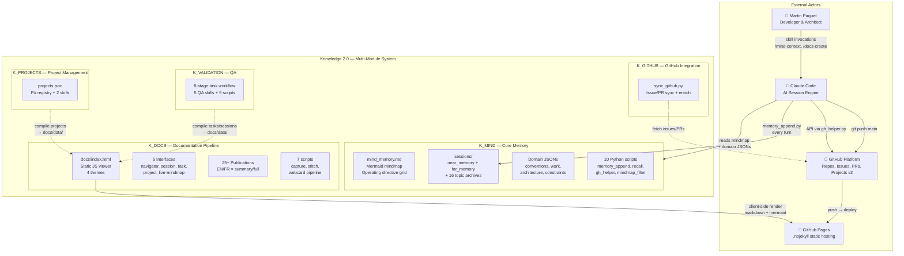
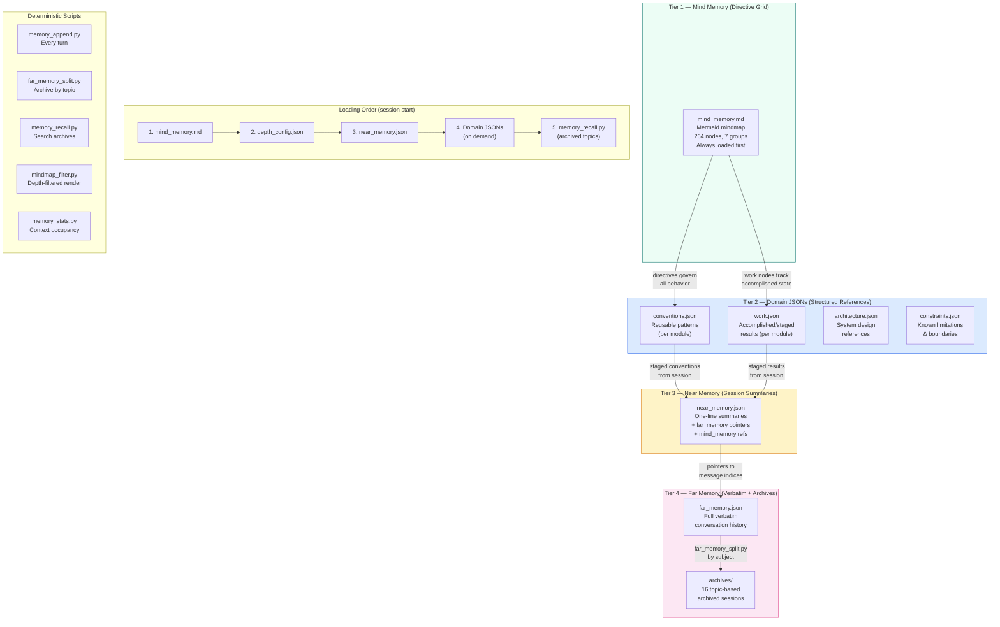
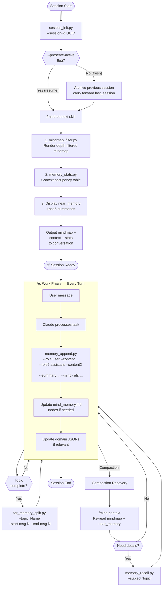
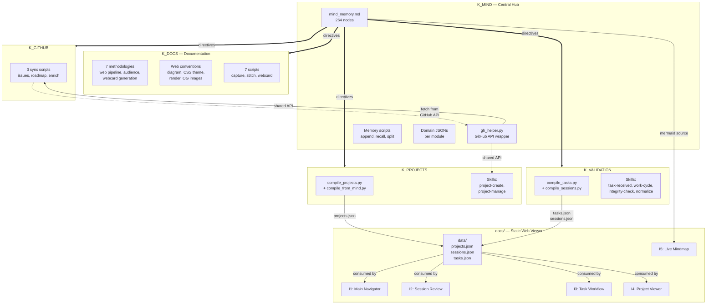

# Diagrammes d'architecture de Knowledge 2.0
{: #pub-title}

> **Publication parente** : [#0 — Système de connaissances]({{ '/fr/publications/knowledge-system/' | relative_url }}) | **Analyse companion** : [#14 — Analyse d'architecture]({{ '/fr/publications/architecture-analysis/' | relative_url }})

**Table des matières**

| | |
|---|---|
| [Résumé](#resume) | Companion visuel de l'architecture Knowledge 2.0 |
| [Vue d'ensemble](#1-vue-densemble--contexte-c4) | Contexte C4 — Système multi-module au centre |
| [Mémoire Mind-First](#2-architecture-memoire-mind-first) | Mémoire à 4 niveaux : Mindmap → JSONs → Near → Far |
| [Cycle de vie de session](#4-cycle-de-vie-de-session) | session_init → /mind-context → memory_append → archive |
| [Interaction des modules](#5-flux-dinteraction-des-modules) | K_MIND hub central, pipelines de compilation, invocations de skills |
| [Documentation complète](#documentation-complete) | Les 14 diagrammes avec explications complètes |

## Audience ciblée

| Audience | Quoi privilégier |
|----------|-----------------|
| **Administrateurs réseau** | Interaction modules (#5), limites de sécurité (#7), architecture web (#8) |
| **Administrateurs système** | Architecture web (#8), intégration GitHub (#11), pipeline de publication (#6) |
| **Programmeurs et programmeuses** | Architecture multi-module (#3), cycle de vie de session (#4), chemins de récupération (#10) |
| **Gestionnaires** | Vue d'ensemble (#1), mémoire mind-first (#2), dépendances des qualités (#9) |

## Résumé

La publication #14 (Analyse d'architecture) examine le système à travers un récit analytique. Cette publication est le **companion visuel** — 14 diagrammes Mermaid qui rendent la structure, les flux, les limites et les dépendances du système multi-module Knowledge 2.0 en visualisations interactives.

Ce résumé présente les 4 diagrammes clés. La [documentation complète]({{ '/fr/publications/architecture-diagrams/full/' | relative_url }}) inclut les 14 diagrammes couvrant les limites de sécurité, l'architecture web, les dépendances des qualités, les chemins de récupération et l'intégration GitHub.

## 1. Vue d'ensemble — Contexte C4

Le système Knowledge 2.0 au centre de sa constellation : 5 modules K_, plateforme GitHub, GitHub Pages (.nojekyll hébergement statique), sessions Claude Code et le développeur.

Le système est organisé en 5 modules K_ sous `Knowledge/`. K_MIND est le core obligatoire. Les autres modules fournissent des capacités spécialisées. GitHub Pages sert le viewer web statique avec rendu côté client.

## 2. Architecture mémoire Mind-First

Quatre niveaux de stabilité décroissante et de granularité croissante — de la grille de directives (mindmap) à l'archive verbatim complète.

Les connaissances remontent par le pipeline de staging et descendent comme directives opérationnelles. Toutes les opérations mécaniques utilisent des scripts Python déterministes.

## 4. Cycle de vie de session

Chaque session Claude Code suit un cycle de vie déterministe géré par les scripts K_MIND.

Trois phases : démarrage (/mind-context), travail (memory_append à chaque tour) et récupération (gestion de compaction). La mindmap est toujours chargée en premier car elle contient toutes les directives comportementales.

## 5. Flux d'interaction des modules

Comment les 5 modules K_ interagissent : K_MIND comme hub central, pipelines de compilation alimentant le viewer web.

K_MIND est le hub — sa mindmap fournit des directives à tous les modules, et gh_helper.py est le wrapper API GitHub partagé. Les scripts de compilation produisent des données JSON consommées par les 5 interfaces web.

## Documentation complète

La [documentation complète]({{ '/fr/publications/architecture-diagrams/full/' | relative_url }}) inclut les 14 diagrammes :

| # | Diagramme | Ce qu'il montre |
|---|-----------|-----------------|
| 1 | Vue d'ensemble | Contexte C4 — Système multi-module au centre |
| 2 | Mémoire Mind-First | Architecture mémoire à 4 niveaux avec scripts |
| 3 | Architecture multi-module | 5 modules K_, scripts, relations |
| 4 | Cycle de vie de session | session_init → travail → archive flowchart |
| 5 | Interaction des modules | K_MIND hub, pipelines de compilation |
| 6 | Pipeline de publication | Source → viewer statique → EN/FR × 4 thèmes |
| 7 | Limites de sécurité | Modèle proxy, opérations autorisées/bloquées |
| 8 | Architecture web | Viewer statique, 4 thèmes, 5 interfaces |
| 9 | Dépendances des qualités | Graphe de dépendance des 13 qualités |
| 10 | Chemins de récupération | Récupération K_MIND : compaction, rappel, init |
| 11 | Intégration GitHub | Sync K_GITHUB, compilation, cycle boards |
| 12 | Carte mentale architecture | Piliers architecturaux K2.0 |
| 13 | Carte mentale structure modules | Structure multi-module au niveau fichier |
| 14 | Carte mentale structure publication | Anatomie publication avec viewer statique |

---

## Publications liées

| # | Publication | Relation |
|---|-------------|---------|
| 0 | [Système de connaissances]({{ '/fr/publications/knowledge-system/' | relative_url }}) | Parent — le système que ces diagrammes visualisent |
| 4 | [Connaissances distribuées]({{ '/fr/publications/distributed-minds/' | relative_url }}) | Architecture — flux multi-module (Diagramme 5) |
| 7 | [Protocole Harvest]({{ '/fr/publications/harvest-protocol/' | relative_url }}) | Protocole — flux de données (Diagrammes 5, 11) |
| 8 | [Gestion de session]({{ '/fr/publications/session-management/' | relative_url }}) | Cycle de vie — système de session K_MIND (Diagramme 4) |
| 9 | [Sécurité par conception]({{ '/fr/publications/security-by-design/' | relative_url }}) | Sécurité — limites proxy (Diagramme 7) |
| 12 | [Gestion de projet]({{ '/fr/publications/project-management/' | relative_url }}) | Projets — module K_PROJECTS (Diagrammes 1, 8) |

---

*Auteurs : Martin Paquet & Claude (Anthropic, Opus 4.6)*
*Knowledge 2.0 : [packetqc/knowledge](https://github.com/packetqc/knowledge)*
