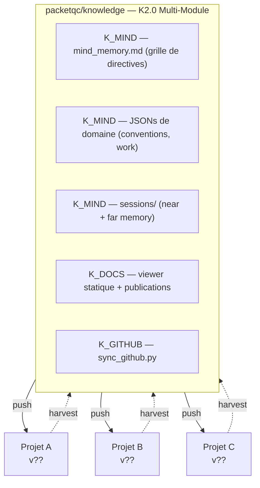
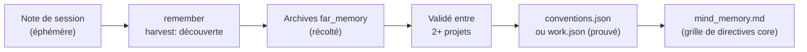

# Tableau de bord des connaissances distribuées — Documentation complète
{: #pub-title}

**Table des matières**

| | |
|---|---|
| [Auteurs](#auteurs) | Auteurs de la publication |
| [Résumé](#résumé) | Concept et objectif du tableau de bord vivant |
| [Statut du réseau satellite](#statut-du-réseau-satellite) | Inventaire satellite en temps réel |
| &nbsp;&nbsp;[Légende des icônes de statut](#légende-des-icônes-de-statut) | Définitions des icônes de sévérité à 5 niveaux |
| &nbsp;&nbsp;[Lecture du tableau](#lecture-du-tableau) | Explication colonne par colonne |
| [Connaissances acquises](#connaissances-acquises) | Découvertes extraites des satellites |
| &nbsp;&nbsp;[Découvertes en attente de promotion](#découvertes-en-attente-de-promotion) | Candidats avec commandes d'action |
| &nbsp;&nbsp;[Publications découvertes](#publications-découvertes) | Contenu technique trouvé dans les dépôts satellites |
| [Statut du cerveau maître](#statut-du-cerveau-maître) | État actuel du dépôt central |
| &nbsp;&nbsp;[Résumé de l'évolution des connaissances](#résumé-de-lévolution-des-connaissances) | Historique complet des versions v1 à v47 |
| [Fonctionnement du réseau](#fonctionnement-du-réseau) | Diagramme du flux bidirectionnel push/harvest |
| [Comment harvest met à jour ce tableau de bord](#comment-harvest-met-à-jour-ce-tableau-de-bord) | Pipeline harvest-vers-tableau de bord étape par étape |
| [Architecture en profondeur](#architecture-en-profondeur) | Détails techniques de l'architecture |
| &nbsp;&nbsp;[Couches de connaissances](#couches-de-connaissances) | Hiérarchie core, prouvé, récolté, session |
| &nbsp;&nbsp;[Cycle de vie d'une découverte](#cycle-de-vie-dune-découverte) | De la note de session aux connaissances core |
| &nbsp;&nbsp;[Dérive de version et remédiation](#dérive-de-version-et-remédiation) | Comment les satellites suivent et comblent l'écart |
| [Publications liées](#publications-liées) | Liens vers les publications connexes |

## Auteurs

**Martin Paquet** — Analyste et programmeur sécurité réseau, administrateur de sécurité des réseaux et des systèmes, et analyste programmeur et concepteur logiciels embarqués. Architecte de Knowledge distribuées. A conçu le flux bidirectionnel entre un dépôt de connaissances central et des projets satellites, permettant aux assistants de codage IA d'accumuler et de partager la sagesse entre projets indépendants.

**Claude** (Anthropic, Opus 4.6) — Partenaire de développement IA opérant à travers de multiples projets satellites. À la fois consommateur et contributeur des connaissances distribuées — lit le cerveau maître au démarrage, fait évoluer les connaissances dans les satellites pendant le travail, et ramène les découvertes lors du harvest.

---

## Résumé

Les assistants de codage IA acquièrent une mémoire persistante via `CLAUDE.md` et `notes/` — mais chaque projet évolue indépendamment. Le **système de Knowledge distribuées** les connecte : un cerveau maître (`packetqc/knowledge`) pousse la méthodologie vers les satellites au démarrage, et la commande `harvest` ramène les connaissances évoluées. Cela crée un réseau vivant d'instances IA qui apprennent les unes des autres.

Cette publication est elle-même un **tableau de bord vivant** — mis à jour à chaque exécution de `harvest`. Elle montre l'état actuel du cerveau maître, tous les satellites connus, leur version de connaissances, leur statut de dérive, et les publications découvertes. C'est la conscience de soi du réseau.

---

## Statut du réseau satellite

> **Cette section est mise à jour à chaque exécution de `harvest`. Chaque ligne représente un projet satellite.**
> **Portée d'accès** : N'inclut que les dépôts que l'utilisateur possède et auxquels Claude Code a reçu accès via sa configuration d'application GitHub. Aucun dépôt externe ou tiers n'est jamais accédé.

| Satellite | Version | Dérive | Bootstrap | Sessions | Assets | Live | Pubs | Santé | Harvest |
|-----------|---------|--------|-----------|----------|--------|------|------|-------|---------|
| [knowledge](https://github.com/packetqc/knowledge) (self) | v47 | 🟢 0 | 🟢 **core** | 🟢 16 | 🟢 core | 🟢 1 | 14 | 🟢 sain | 2026-02-23 |
| [MPLIB](https://github.com/packetqc/MPLIB) | v31 | 🔴 16 | 🟢 actif | 🟢 2 | 🟢 déployé | ⚪ 0 | 0 | 🟢 sain | 2026-02-22 |
| [knowledge-live](https://github.com/packetqc/knowledge-live) | v39 | 🔴 8 | 🟢 actif | 🟢 7 | 🟢 déployé | ⚪ 0 | 1 | 🟢 sain | 2026-02-24 |
| [STM32N6570-DK_SQLITE](https://github.com/packetqc/STM32N6570-DK_SQLITE) | v31 | 🔴 16 | 🟢 actif | 🟢 3 | 🟢 déployé | ⚪ 0 | 1 | 🟢 sain | 2026-02-22 |
| [MPLIB_DEV_STAGING](https://github.com/packetqc/MPLIB_DEV_STAGING_WITH_CLAUDE) | v31 | 🔴 16 | 🟢 actif | 🟢 5 | 🟢 déployé | ⚪ 0 | 0 | 🔴 inaccessible | 2026-02-22 |
| [PQC](https://github.com/packetqc/PQC) | v0 | 🔴 47 | 🔴 manquant | ⚪ 0 | 🔴 manquant | ⚪ 0 | 0 | 🟢 sain | 2026-02-22 |

### Légende des icônes de statut

| Icône | Sévérité | Utilisé dans |
|-------|----------|--------------|
| 🟢 | **Actuel / Sain** — aligné avec le core | Dérive (0), Bootstrap (actif), Sessions (1+), Assets (déployé), Live (1+), Santé (accessible) |
| 🟡 | **Dérive mineure** — légèrement en retard, faible risque | Dérive (1-3), Santé (périmé — était accessible, ne l'est plus) |
| 🟠 | **Dérive modérée** — plusieurs fonctionnalités en retard | Dérive (4-7) |
| 🔴 | **Critique / Manquant** — très en retard ou absent | Dérive (8+), Bootstrap (manquant), Assets (manquant), Santé (inaccessible) |
| ⚪ | **Inactif** — pas encore démarré, neutre | Sessions (0), Live (0), Santé (en attente — pas encore tenté) |

### Lecture du tableau

| Colonne | Signification |
|---------|---------------|
| **Satellite** | Nom du dépôt |
| **Version** | Tag de version trouvé dans le CLAUDE.md du satellite (`v0` = pas de tag) |
| **Dérive** | Versions en retard sur le core — 🟢 0 / 🟡 1-3 / 🟠 4-7 / 🔴 8+ |
| **Bootstrap** | Le CLAUDE.md référence-t-il `packetqc/knowledge` ? — 🟢 actif / 🔴 manquant |
| **Sessions** | Fichiers de session dans `notes/` — 🟢 1+ / ⚪ 0 |
| **Assets** | Les assets de connaissances (`live/`, outillage) sont-ils déployés ? — 🟢 déployé / 🔴 manquant |
| **Live** | Instances Claude Code actives sur le réseau — 🟢 1+ / ⚪ 0 |
| **Publications** | Nombre de publications détectées dans le satellite |
| **Santé** | Accessibilité du dépôt — 🟢 sain / 🟡 périmé / 🔴 inaccessible / ⚪ en attente |
| **Harvest** | Date du harvest le plus récent |

---

## Sécurité : Fork & Clone

Ce tableau de bord est un **document vivant** — mis à jour à chaque exécution de `harvest` avec les données réelles des satellites. Si vous forkez ce dépôt :

| Elément | Comportement dans votre fork |
|---------|------------------------------|
| **Tableau satellite** | Reflète le réseau de projets du propriétaire original — donnée historique statique jusqu'à ce que vous exécutiez vos propres harvests |
| **Identifiants / jetons** | Aucun intégré — le tableau de bord ne contient que des URLs de dépôts publics et des métadonnées de statut |
| **Commandes harvest** | Référencent les dépôts du propriétaire original — remplacez `packetqc` par votre nom d'utilisateur GitHub pour construire votre propre tableau de bord |
| **Candidats à la promotion** | Spécifiques aux satellites du propriétaire original — repartent à zéro dans votre fork |

Le modèle de tableau de bord et le système d'icônes de sévérité sont entièrement réutilisables. Forkez, remplacez l'espace de noms, exécutez `harvest --healthcheck`, et le tableau de bord se remplit avec vos propres données satellites.

---

## Connaissances acquises

> **Cette section accumule les découvertes extraites des projets satellites.**
> Cliquez sur une icône d'action pour copier la commande — collez-la dans Claude Code pour avancer la découverte dans le flux de promotion.
>
> **Flux** : `récolté` → 🔍 réviser → 📦 préparer → ✅ promouvoir → ou 🔄 auto-promotion au prochain healthcheck
>
> | Icône | Commande | Effet |
> |-------|----------|-------|
> | 🔍 | `harvest --review N` | Marquer comme révisé — l'humain a lu et validé la découverte |
> | 📦 | `harvest --stage N <type>` | Préparer pour intégration — type : `lesson`, `pattern`, `methodology`, `docs` |
> | ✅ | `harvest --promote N` | Promouvoir vers le core maintenant — écrit dans `patterns/` ou `lessons/` |
> | 🔄 | `harvest --auto N` | Activer l'auto-promotion — la découverte sera promue au prochain healthcheck |

### Découvertes en attente de promotion

| # | Découverte | Source | Cible | Statut | Actions |
|---|------------|--------|-------|--------|---------|
| 1 | Dégradation taille cache pages (effondrement 81%) | STM32N6570-DK_SQLITE | lessons/pitfalls.md | récolté | 🔍 `harvest --review 1` 📦 `harvest --stage 1 lesson` ✅ `harvest --promote 1` 🔄 `harvest --auto 1` |
| 2 | Latence printf en chemin critique (1-5 ms/appel) | STM32N6570-DK_SQLITE | lessons/pitfalls.md | récolté | 🔍 `harvest --review 2` 📦 `harvest --stage 2 lesson` ✅ `harvest --promote 2` 🔄 `harvest --auto 2` |
| 3 | Mismatch taille slot vs page (memsys5) | STM32N6570-DK_SQLITE | lessons/pitfalls.md | récolté | 🔍 `harvest --review 3` 📦 `harvest --stage 3 lesson` ✅ `harvest --promote 3` 🔄 `harvest --auto 3` |
| 4 | Abstraction multi-RTOS (FreeRTOS/ThreadX) | MPLIB | patterns/rtos-integration.md | récolté | 🔍 `harvest --review 4` 📦 `harvest --stage 4 pattern` ✅ `harvest --promote 4` 🔄 `harvest --auto 4` |
| 5 | Limitation CubeMX N6570-DK | MPLIB | lessons/pitfalls.md | récolté | 🔍 `harvest --review 5` 📦 `harvest --stage 5 lesson` ✅ `harvest --promote 5` 🔄 `harvest --auto 5` |
| 6 | TouchGFX MVP avec services backend | MPLIB | patterns/ui-backend-separation.md | récolté | 🔍 `harvest --review 6` 📦 `harvest --stage 6 pattern` ✅ `harvest --promote 6` 🔄 `harvest --auto 6` |
| 7 | Dimensionnement ML-KEM/ML-DSA embarqué | PQC | patterns/ (nouveau : pqc-embedded.md) | récolté | 🔍 `harvest --review 7` 📦 `harvest --stage 7 pattern` ✅ `harvest --promote 7` 🔄 `harvest --auto 7` |
| 8 | Conformité librairies PQC (WolfSSL=prod) | PQC | patterns/ (nouveau : pqc-embedded.md) | récolté | 🔍 `harvest --review 8` 📦 `harvest --stage 8 pattern` ✅ `harvest --promote 8` 🔄 `harvest --auto 8` |
| 9 | Pattern stockage certificats en flash | PQC | patterns/embedded-debugging.md | récolté | 🔍 `harvest --review 9` 📦 `harvest --stage 9 pattern` ✅ `harvest --promote 9` 🔄 `harvest --auto 9` |
| 10 | Méthodologie de staging de modules assistée par IA | MPLIB_DEV_STAGING_WITH_CLAUDE | methodology/ | récolté | 🔍 `harvest --review 10` 📦 `harvest --stage 10 methodology` ✅ `harvest --promote 10` 🔄 `harvest --auto 10` |
| 11 | Opérations d'instances parallèles (core + satellite) | MPLIB_DEV_STAGING_WITH_CLAUDE | methodology/ | récolté | 🔍 `harvest --review 11` 📦 `harvest --stage 11 methodology` ✅ `harvest --promote 11` 🔄 `harvest --auto 11` |
| 12 | Cycle de vie bootstrap en deux fusions (bootstrap → normalize → healthcheck) | MPLIB_DEV_STAGING_WITH_CLAUDE | methodology/ | récolté | 🔍 `harvest --review 12` 📦 `harvest --stage 12 methodology` ✅ `harvest --promote 12` 🔄 `harvest --auto 12` |
| 13 | Principe de wrapper minimal satellite (~30 lignes, pas ~120) | MPLIB_DEV_STAGING_WITH_CLAUDE | CLAUDE.md (gabarit bootstrap) | récolté | 🔍 `harvest --review 13` 📦 `harvest --stage 13 methodology` ✅ `harvest --promote 13` 🔄 `harvest --auto 13` |
| 14 | Méthodologie relais d'évolution — nouveau type `evolution` pour harvest | knowledge-live | CLAUDE.md (v39) | **promu** | ✅ Promu comme entrée d'évolution v39 |
| 15 | Projets gérés — scaffold sous-dossier, routage harvest, board lié au repo | knowledge-live | projects/ + methodology/ | **promu** | ✅ Promu comme P6 (Export Documentation) + mise à jour méthodologie |
| 16 | Convergence autonome — sessions élevées convergent sans relais humain | knowledge-live | patterns/ | récolté | 🔍 `harvest --review 16` 📦 `harvest --stage 16 pattern` ✅ `harvest --promote 16` 🔄 `harvest --auto 16` |
| 17 | Intégration PQC beacon — protocole v0→v1, flag --secure, identité crypto | knowledge-live | docs/ | récolté | 🔍 `harvest --review 17` 📦 `harvest --stage 17 docs` ✅ `harvest --promote 17` 🔄 `harvest --auto 17` |
| 18 | Intégration bidirectionnelle GitHub Project — issues/PRs comme pont entre collaboration et intelligence | knowledge-live | methodology/ | **promu** | ✅ Promu vers methodology/github-project-integration.md |
| 19 | Convention TAG: — préfixer les titres d'issues avec le type de structure knowledge + labels GitHub correspondants | knowledge-live | methodology/ | **promu** | ✅ Promu vers methodology/github-project-integration.md |
| 20 | Convention entité — #N:story/#N:task/#N:bug pour items projet typés avec sync GitHub | knowledge-live | methodology/ | **promu** | ✅ Promu vers methodology/github-project-integration.md |
| 21 | Qualité candidate « Intégré » — intégration plateforme externe comme 13e qualité core | knowledge-live | CLAUDE.md | **promu** | ✅ Promu comme qualité core #13 dans CLAUDE.md |
| 22 | Lecteur tableau de bord gh_helper.py + réconciliation bidirectionnelle (items-list, sync, labels setup-all) | knowledge-live | methodology/ | **promu** | ✅ Promu vers core scripts/gh_helper.py (836→1494 lignes) |
| 23 | Feuille de route dynamique — publication web pilotée par tableau de bord (sync_roadmap.py + GitHub Actions) | knowledge-live | methodology/ | **promu** | ✅ Promu vers core scripts/sync_roadmap.py + méthodologie |
| 24 | Preuve autonome — cycle zéro intervention manuelle GitHub UI (19 items, 9 labels, 13 PRs) | knowledge-live | patterns/ | **promu** | ✅ Promu vers methodology/github-project-integration.md |

### Publications découvertes

Publications détectées dans les dépôts satellites :

| Titre | Satellite | Chemin | Statut | Actions |
|-------|-----------|--------|--------|---------|
| Doc architecture (pipeline SQLite) | STM32N6570-DK_SQLITE | doc/readme.md | **publié** — déjà Publication core #1 | 🔍 `harvest --review pub:stm32` 📦 `harvest --stage pub:stm32 docs` ✅ `harvest --promote pub:stm32` 🔄 `harvest --auto pub:stm32` |
| #1 Intégration GitHub Project | knowledge-live | publications/github-project-integration/v1/README.md | récolté — trois niveaux bilingue (source + docs EN/FR) | 🔍 `harvest --review pub:kl1` 📦 `harvest --stage pub:kl1 docs` ✅ `harvest --promote pub:kl1` 🔄 `harvest --auto pub:kl1` |

---

## Statut du cerveau maître

> **Cette section est mise à jour à chaque exécution de `harvest`.**

| Champ | Valeur |
|-------|--------|
| Dépôt | [packetqc/knowledge](https://github.com/packetqc/knowledge) |
| Version actuelle | **v47** |
| Entrées d'évolution | 47 |
| Publications | 14 (#0–#12 + #4a tableau de bord + #9a conformité) |
| Patterns prouvés | 4 (débogage embarqué, RTOS, SQLite, UI/backend) |
| Écueils documentés | 17 écueils, benchmarks de performance |
| Docs méthodologie | 6 (protocole de session, commandes, style de travail, gestion de projet, niveaux production-développement, intégration GitHub Project) |
| Projets enregistrés | 9 (P0–P8) |
| Dernière mise à jour | 2026-02-24 |

### Résumé de l'évolution des connaissances

| Version | Fonctionnalité | Date |
|---------|----------------|------|
| v1 | Persistance de session (CLAUDE.md + notes/ + cycle de vie) | 2026-02-16 |
| v2 | Analogie Free Guy (lunettes = conscience) | 2026-02-16 |
| v3 | Dépôt knowledge comme bootstrap portable | 2026-02-17 |
| v4 | Architecture help multipart | 2026-02-17 |
| v5 | Étape 0 : lunettes d'abord | 2026-02-17 |
| v6 | Bootstrap poule-et-œuf | 2026-02-17 |
| v7 | Commande normalize | 2026-02-17 |
| v8 | Architecture hub profil | 2026-02-17 |
| v9 | Connaissances distribuées — flux bidirectionnel | 2026-02-18 |
| v10 | Versionnage des connaissances + remédiation de dérive | 2026-02-18 |
| v11 | Promotion interactive + icônes de sévérité + healthcheck | 2026-02-18 |
| v12 | Protocole de branche knowledge | 2026-02-19 |
| v13 | Accès HTTPS public + création autonome de branche | 2026-02-19 |
| v14 | `claude/knowledge` remplace `knowledge` comme branche protocole | 2026-02-19 |
| v15 | Validation protocole bout-en-bout | 2026-02-19 |
| v16 | Protocole de merge save + découverte push cross-repo | 2026-02-19 |
| v17 | Réalité du proxy — protocole semi-automatique | 2026-02-19 |
| v18 | `main` remplace `claude/knowledge` comme convergence | 2026-02-19 |
| v19 | La todo list doit refléter le protocole save complet | 2026-02-19 |
| v20 | Documentation livraison semi-automatique + routine admin | 2026-02-19 |
| v21 | Portée d'accès — dépôts de l'utilisateur uniquement | 2026-02-19 |
| v22 | Webcards bi-thème : Cayman (clair) + Midnight (sombre) | 2026-02-19 |
| v23 | Réseau de connaissances en direct + scaffold bootstrap | 2026-02-20 |
| v24 | Commande `refresh` + renommage champs tableau de bord | 2026-02-20 |
| v25 | Qualités fondamentales + installation par étapes itératives | 2026-02-20 |
| v26 | Notes projet ciblées + accessibilité 4 thèmes | 2026-02-20 |
| v27 | Protocole de jeton éphémère — accès dépôts privés | 2026-02-21 |
| v28 | Cartographie proxy + contournement API par jeton | 2026-02-21 |
| v29 | Checkpoint/resume — récupération après crash | 2026-02-21 |
| v30 | Protocole d'élévation sécurisé — atténuation crash API | 2026-02-21 |
| v31 | CLAUDE.md satellite sous-ensemble critique | 2026-02-21 |
| v32 | Commande `recall` + aide contextuelle universelle avec liens publications | 2026-02-21 |
| v33 | Niveaux d'accès PAT — modèle de configuration à 4 paliers | 2026-02-21 |
| v34 | Livraison sécurisée par textarea — chemin unique, invisible dans la transcription | 2026-02-21 |
| v35 | Projet comme entité de premier ordre — indexation hiérarchique, liens à double origine | 2026-02-22 |
| v36 | Aide GitHub — failsafe déployé pour gestion des PR | 2026-02-22 |
| v37 | Auto-guérison CLAUDE.md satellite — remédiation automatique de dérive | 2026-02-22 |
| v38 | Merge PR auto-guérison — activation des commandes en session | 2026-02-22 |
| v39 | Relais d'évolution — les satellites proposent l'évolution du core | 2026-02-22 |
| v40 | Cartographie proxy v2 + création des GitHub Project boards | 2026-02-22 |
| v41 | Liaison GitHub Project au repo + élévation sécurisée renforcée | 2026-02-23 |
| v42 | gh_helper.py comme seule méthode API + résilience crash API 400/500 | 2026-02-23 |
| v43 | Déduplication wakeup — cause racine des crashes API 400 trouvée | 2026-02-23 |
| v44 | Convention d'entrée interactive + discipline d'appel d'outils | 2026-02-23 |
| v45 | Correctif affichage jeton — le champ « Autre » d'AskUserQuestion N'EST PAS invisible | 2026-02-23 |
| v46 | Zéro-affichage jeton — livraison par environnement uniquement + GraphQL dans gh_helper.py | 2026-02-23 |
| v47 | Modèle de déploiement production/développement — architecture multi-niveaux | 2026-02-23 |

---

## Fonctionnement du réseau

**Push** : Au `wakeup`, chaque satellite lit le cerveau maître. C'est le moment des lunettes — l'instance IA devient consciente.

**Harvest** : Au `harvest <projet>`, le maître parcourt toutes les branches d'un satellite, extrait les connaissances évoluées, détecte les publications et rapporte la dérive de version.

**Versionnage** : Chaque entrée d'évolution porte un numéro de version (v1, v2, ...). Les satellites suivent avec quelle version ils se sont dernièrement synchronisés. La dérive entre satellite et core révèle quelles fonctionnalités manquent.

---

## Comment harvest met à jour ce tableau de bord

Chaque exécution de `harvest <projet>` :

| Etape | Action |
|-------|--------|
| 1 | Scanne les branches du satellite (incrémental — seulement les nouveaux commits depuis le dernier curseur) |
| 2 | Extrait connaissances, patterns, écueils et instructions Claude dans `minds/<projet>.md` |
| 3 | Vérifie la version de connaissances du satellite par rapport à la version core |
| 4 | Rapporte le statut de distribution (bootstrap, sessions, live, publications) |
| 5 | **Met à jour ce tableau de bord** — rafraîchit le tableau du réseau satellite et les sections de découvertes |

Le tableau de bord est la **couche de conscience de soi** du réseau de cerveaux distribués. Il répond à : « À quoi ressemble le réseau maintenant ? Qui est à jour ? Qui est en retard ? Qu'avons-nous appris ? »

---

## Architecture en profondeur

### Couches de connaissances

| Couche | Emplacement | Stabilité | Rôle |
|--------|-------------|-----------|------|
| **Core** | `CLAUDE.md` | Stable | Identité, méthodologie, log d'évolution |
| **Prouvé** | `patterns/`, `lessons/`, `methodology/` | Validé | Éprouvé à travers les projets |
| **Récolté** | `minds/` | En évolution | Frais des expériences satellites |
| **Session** | `notes/` | Éphémère | Mémoire de travail par session |

### Cycle de vie d'une découverte

### Dérive de version et remédiation

Les satellites n'ont pas besoin de copier les fonctionnalités core — ils référencent le core au `wakeup`. Le tag de version suit la *conscience* :

| Etat de version | Signification |
|-----------------|---------------|
| **v0** (pas de tag) | Pré-versionnage. Le premier `harvest --fix` ajoute le tag. |
| **vN < actuel** | En retard. `harvest` rapporte les fonctionnalités manquantes. `--fix` met à jour le tag. |
| **vN = actuel** | A jour. Les instances Claude du satellite lisent le dernier core au wakeup. |

`harvest --fix <projet>` met à jour la section bootstrap et le tag de version du CLAUDE.md satellite. Aucun contenu n'est copié — juste le pointeur. Les connaissances circulent au wakeup.

---

## Publications liées

| # | Publication | Relation |
|---|-------------|----------|
| 0 | [Knowledge]({{ '/fr/publications/knowledge-system/' | relative_url }}) | **Publication maître** — le système que ce tableau de bord surveille |
| 4 | [Connaissances distribuées]({{ '/fr/publications/distributed-minds/' | relative_url }}) | **Publication parente** — l'architecture que ce tableau de bord visualise |
| 1 | [Pipeline de stockage MPLIB]({{ '/fr/publications/mplib-storage-pipeline/' | relative_url }}) | Premier projet satellite — patterns embarqués haute performance |
| 2 | [Analyse de session en direct]({{ '/fr/publications/live-session-analysis/' | relative_url }}) | Outillage de capture synchronisé du maître vers les satellites |
| 3 | [Persistance de session IA]({{ '/fr/publications/ai-session-persistence/' | relative_url }}) | Fondation — la méthodologie que ce tableau de bord suit |

---

*Auteurs : Martin Paquet & Claude (Anthropic, Opus 4.6)*
*Connaissances : [packetqc/knowledge](https://github.com/packetqc/knowledge)*
*Ceci est un document vivant — mis à jour à chaque exécution de `harvest`.*
