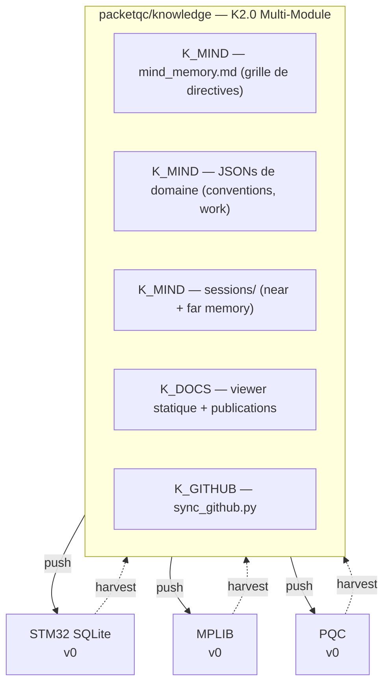
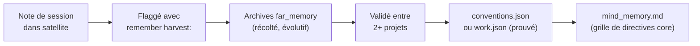

# Connaissances distribuées — Documentation complète
{: #pub-title}

**Table des matières**

| | |
|---|---|
| [Auteurs](#auteurs) | Auteurs de la publication |
| [Résumé](#résumé) | Vue d'ensemble et concept de flux bidirectionnel |
| [Le problème : Intelligence dispersée](#le-problème--intelligence-dispersée) | Pourquoi les connaissances IA multi-projets se perdent |
| [La solution : Flux bidirectionnel](#la-solution--flux-bidirectionnel) | Architecture push/harvest |
| &nbsp;&nbsp;[Push : Le moment des lunettes](#push--le-moment-des-lunettes) | Livraison sortante de la méthodologie au wakeup |
| &nbsp;&nbsp;[Harvest : Le flux inverse](#harvest--le-flux-inverse) | Extraction entrante des connaissances des satellites |
| [Couches de connaissances](#couches-de-connaissances) | Hiérarchie core, prouvé, récolté, session |
| &nbsp;&nbsp;[Cycle de vie d'une découverte](#cycle-de-vie-dune-découverte) | De la note de session aux connaissances core |
| [Versionnage des connaissances](#versionnage-des-connaissances) | Table d'évolution et suivi de dérive |
| [Premier harvest : Résultats réels](#premier-harvest--résultats-réels) | 15 dépôts parcourus, 3 satellites clés |
| [Flux de promotion interactif](#flux-de-promotion-interactif) | Pipeline réviser, préparer, promouvoir |
| &nbsp;&nbsp;[Icônes de sévérité](#icônes-de-sévérité) | Indicateurs visuels de santé à 5 niveaux |
| &nbsp;&nbsp;[Actions de promotion](#actions-de-promotion) | Flux à 4 actions par découverte |
| &nbsp;&nbsp;[Healthcheck](#healthcheck) | Commande de balayage complet du réseau |
| [Le tableau de bord](#le-tableau-de-bord) | Document vivant avec statut en temps réel |
| [Protocole de branches & livraison semi-automatique](#protocole-de-branches--livraison-semi-automatique) | Limitations du proxy et livraison par PR |
| &nbsp;&nbsp;[La réalité du proxy](#la-réalité-du-proxy) | Détails de la frontière de sécurité du proxy git |
| &nbsp;&nbsp;[Pourquoi semi-automatique](#pourquoi-semi-automatique) | 95% autonome, un clic d'approbation |
| &nbsp;&nbsp;[Routine admin rapide](#routine-admin-rapide--gestion-des-prs-claude-code) | Guide de revue quotidienne des PRs |
| [Principes d'architecture](#principes-darchitecture) | Décisions de conception et justifications |
| [Publications liées](#publications-liées) | Liens vers les publications connexes |

## Auteurs

**Martin Paquet** — Analyste programmeur en sécurité réseau, administrateur de sécurité réseau et système, et concepteur programmeur de logiciels embarqués qui a architecturé un système Knowledge distribué où un dépôt central et des projets satellites évoluent ensemble via un flux bidirectionnel de connaissances assisté par IA.

**Claude** (Anthropic, Opus 4.6) — Partenaire de développement IA opérant à travers plusieurs projets satellites. À la fois consommateur et contributeur des connaissances distribuées — lit le cerveau maître au démarrage, fait évoluer les connaissances dans les satellites pendant le travail, et ramène les découvertes via harvest.

---

## Résumé

Les assistants de codage IA acquièrent une mémoire persistante via `mind_memory.md` et `sessions/` — mais en travaillant sur plusieurs projets, chaque instance IA évolue indépendamment. L'intelligence est générée partout mais consolidée nulle part.

**Connaissances distribuées** crée un **réseau vivant** avec flux bidirectionnel :

| Direction | Mécanisme |
|-----------|-----------|
| **Push** (sortant) | Le module K_MIND est poussé via git vers les satellites — livrant la grille de directives `mind_memory.md`, les JSONs de domaine, la méthodologie et les scripts. |
| **Harvest** (entrant) | K_GITHUB `sync_github.py` gère la synchronisation bidirectionnelle — extrayant les connaissances évoluées, détectant la dérive de version et découvrant les publications. |

Le résultat est un **réseau d'intelligence distribuée auto-réparateur et conscient des versions**.

**Par conception**, le système n'opère que sur les dépôts que l'utilisateur possède et auxquels Claude Code a reçu accès via sa configuration d'application GitHub. Aucun dépôt externe ou tiers n'est jamais accédé — le réseau d'intelligence distribuée est limité exclusivement à l'écosystème de projets de l'utilisateur. C'est une frontière de sécurité et de confidentialité délibérée.

---

## Sécurité : Fork & Clone

Ce dépôt est public et conçu pour être forké. L'architecture des connaissances distribuées est **limitée au propriétaire** — tout le flux bidirectionnel est confiné à l'environnement du propriétaire du dépôt :

| Aspect | Protection |
|--------|-----------|
| **Identifiants / jetons** | Aucun stocké — pas de clés API, pas de jetons GitHub, aucun secret dans les fichiers ou l'historique git |
| **Accès en écriture** | Limité par session — le Claude Code d'un forkeur ne pousse que vers son propre fork, jamais vers le dépôt original |
| **URLs de sync** | Référencent les satellites du propriétaire original (`packetqc/<repo>`) — lecture seule pour un forkeur. Le sync ne peut accéder aux dépôts sans autorisation |
| **Contenu des archives** | Décrit le réseau satellite du propriétaire original — sans signification dans un fork, repart à zéro pour un nouveau propriétaire |
| **Fichiers session** | Éphémères — `sessions/` vierge pour chaque nouvel utilisateur |

Ce que vous obtenez en forkant : **l'architecture de flux bidirectionnel, le protocole harvest, le flux de promotion et le modèle de tableau de bord** — tout intentionnellement public. Pour construire votre propre réseau de connaissances distribuées, remplacez `packetqc` par votre nom d'utilisateur GitHub dans CLAUDE.md.

---

## Le problème : Intelligence dispersée

| Projet | Ce que l'IA a appris |
|--------|---------------------|
| STM32N6570-DK_SQLITE | Le dimensionnement du cache pages prévient un effondrement de 81% |
| MPLIB | L'abstraction multi-RTOS fonctionne avec des gardes préprocesseur |
| PQC | WolfSSL est la librairie PQC de production pour STM32, pas liboqs |

Sans consolidation, chaque découverte reste enfermée dans le projet qui l'a produite.

---

## La solution : Flux bidirectionnel



### Push : Le moment des lunettes

Au démarrage de session (`session_init.py` + `/mind-context`), chaque satellite charge le module K_MIND — la grille de directives `mind_memory.md`. L'instance IA reçoit : grille de 264 directives, JSONs de domaine, patterns prouvés, scripts K_MIND, skills `.claude/skills/`.

### Harvest : Le flux inverse

K_GITHUB `sync_github.py` gère le flux entrant (remplaçant la commande `harvest` de K1.0) : parcourt toutes les branches d'un satellite, suit les curseurs de commits (incrémental), vérifie la version, inventorie la distribution, extrait les connaissances, détecte les publications, met à jour le tableau de bord et rapporte la dérive.

---

## Couches de connaissances

| Couche | Emplacement K2.0 | Stabilité | Cycle de vie |
|--------|-------------------|-----------|-------------|
| **Core** | `mind_memory.md` (grille de 264 directives) | Stable | Change rarement. Conception système, identité, méthodologie. |
| **Prouvé** | `conventions.json`, `work.json` par module | Validé | Grandit quand des découvertes sont promues des archives. |
| **Récolté** | `far_memory archives/` (découpé par sujet) | En évolution | Frais des expériences satellites. L'incubateur. |
| **Session** | `sessions/` (near_memory + far_memory) | Éphémère | Mémoire à paliers par session. Persisté chaque tour par `memory_append.py`. |

### Cycle de vie d'une découverte



---

## Alias d'appel `#` — Routage de connaissances indépendant de l'emplacement

Le préfixe `#` au début d'un prompt est un **alias d'appel** — il active le mode d'entrée de connaissances ciblées via le skill K_GITHUB tagged-input. `#N:` route le contenu vers la publication/projet N quel que soit le dépôt dans lequel l'utilisateur travaille.

### Fonctionnement

| Entrée | Routage | Exemple |
|--------|---------|---------|
| `#N: contenu` | Ciblé explicitement vers le projet N | `#7: fix command should prepare locally` |
| `#N:methodology:<sujet>` | Insight méthodologique — marqué pour harvest | `#7:methodology:incremental-cursors` |
| `#N:principle:<sujet>` | Principe de design — marqué pour harvest | `#4:principle:pull-based` |
| `#0: dump brut` | Entrée brute — Claude classifie | `#0: whatever I have right now` |
| Pas de `#`, dans un dépôt | Projet principal implicite | Travail dans knowledge → implicite `#0:` |

### Convergence multi-satellite

**`#N:` est la clé de routage, pas le dépôt.** Le même projet peut être documenté depuis plusieurs satellites — un insight sur #7 découvert dans STM32 est routé vers #7, pas vers le projet principal de STM32. Harvest extrait toutes les notes `#N:` dans `minds/`, la promotion les délivre au core.

```
Satellite A ──→ harvest ──→ minds/ ──→ promotion ──→ core knowledge
Satellite B ──→ harvest ──↗
Satellite C ──→ harvest ──↗
Core direct ──────────────────────────→ notes/ ──→ core knowledge
```

### Projet principal implicite

Chaque dépôt a un projet principal — l'entrée non ciblée y va :

| Dépôt | Projet principal | `#` implicite |
|-------|-----------------|---------------|
| `packetqc/knowledge` | #0 Knowledge | `#0:` |
| `packetqc/STM32N6570-DK_SQLITE` | #1 MPLIB Storage Pipeline | `#1:` |
| Satellites de documentation | Dépend du contexte (multi-projet) | Premier ou déclaré |

La spécification complète est dans [Publication #0 — Convention alias d'appel `#`]({{ '/fr/publications/knowledge-system/full/#convention-alias-dappel-' | relative_url }}).

---

## Versionnage des connaissances

| Version | Fonctionnalité | Date |
|---------|----------------|------|
| v1 | Persistance de session | 2026-02-16 |
| v2 | Analogie Free Guy | 2026-02-16 |
| v3 | Bootstrap portable | 2026-02-17 |
| v5 | Étape 0 : lunettes d'abord | 2026-02-17 |
| v7 | Commande normalize | 2026-02-17 |
| v9 | Connaissances distribuées | 2026-02-18 |
| v10 | Versionnage des connaissances | 2026-02-18 |
| v11 | Promotion interactive + healthcheck | 2026-02-18 |
| v12–v15 | Exploration du protocole de branches | 2026-02-19 |
| v16 | Merge save + découverte cross-repo | 2026-02-19 |
| v17 | Réalité du proxy — protocole semi-automatique | 2026-02-19 |
| v18 | `main` comme point de convergence | 2026-02-19 |
| v19 | Todo list doit refléter le protocole save complet | 2026-02-19 |
| v20 | Documentation livraison semi-automatique | 2026-02-19 |
| v21 | Portée d'accès — dépôts user-owned seulement | 2026-02-19 |
| v22 | Webcards dual-theme (Cayman + Midnight) | 2026-02-19 |
| v23 | Réseau live + scaffold bootstrap | 2026-02-20 |
| v24 | Commande `refresh` + renommage dashboard | 2026-02-20 |
| v25 | Qualités fondamentales + installation itérative | 2026-02-20 |
| v26 | Alias d'appel `#` + notes projet ciblées + thèmes daltonisme | 2026-02-20 |
| v27 | Protocole de jeton éphémère — accès dépôts privés | 2026-02-21 |
| v28 | Cartographie proxy + contournement API par jeton | 2026-02-21 |
| v29 | Checkpoint/resume — récupération après crash | 2026-02-21 |
| v30 | Protocole d'élévation sécurisé | 2026-02-21 |
| v31 | CLAUDE.md satellite sous-ensemble critique | 2026-02-21 |
| v32 | Commande `recall` + aide contextuelle universelle | 2026-02-21 |
| v33 | Niveaux d'accès PAT — modèle à 4 paliers | 2026-02-21 |
| v34 | Livraison sécurisée par textarea | 2026-02-21 |
| v35 | Projet comme entité de premier ordre — indexation hiérarchique | 2026-02-22 |

**35 versions en 7 jours.** v12–v17 tracent la découverte de la limitation du proxy. v18–v20 documentent l'architecture résultante. v21–v25 ajoutent les frontières de sécurité, l'adaptation visuelle, le réseau live, la récupération légère et les 12 qualités fondamentales. v26 ajoute le routage de connaissances indépendant de l'emplacement avec la convention alias d'appel `#`. v27–v28 introduisent le protocole de jeton éphémère et le modèle à deux canaux (proxy git vs API REST). v29–v30 ajoutent la récupération après crash et l'élévation sécurisée. v31–v34 renforcent le CLAUDE.md satellite, ajoutent `recall`, formalisent les niveaux PAT et sécurisent la livraison de jetons. v35 fait des projets des entités de premier ordre avec indexation hiérarchique.

**Dérive** = écart entre la version satellite et la version core. `harvest --fix` met à jour le tag du satellite.

---

## Premier harvest : Résultats réels

15 dépôts parcourus. 3 satellites clés analysés :

| Satellite | Version | Dérive | Candidats à promotion |
|-----------|---------|--------|----------------------|
| STM32N6570-DK_SQLITE | v0 | 11 en retard | 3 (cache pages, latence printf, slot mismatch) |
| MPLIB | v0 | 11 en retard | 3 (multi-RTOS, limitation CubeMX, TouchGFX MVP) |
| PQC | v0 | 11 en retard | 3 (tailles ML-KEM, conformité librairies, certs flash) |

**9 candidats à promotion**. **100% de taux de dérive** — tous les satellites précèdent Knowledge.

---

## Flux de promotion interactif

### Icônes de sévérité

| <span id="severity-icons">Icône</span> | Sévérité | Appliqué à |
|-------|----------|------------|
| 🟢 | **Actuel / Sain** | Dérive (0), Bootstrap (actif), Sessions (1+), Live (déployé), Santé (accessible) |
| 🟡 | **Dérive mineure** | Dérive (1-3), Santé (obsolète) |
| 🟠 | **Dérive modérée** | Dérive (4-7) |
| 🔴 | **Critique / Manquant** | Dérive (8+), Bootstrap (manquant), Live (manquant), Santé (inaccessible) |
| ⚪ | **Inactif** | Sessions (0), Santé (en attente) |

### Actions de promotion

| Étape | <span id="promotion-icons">Icône</span> | Commande | Effet |
|-------|-------|---------|--------|
| Réviser | 🔍 | `harvest --review N` | L'humain valide |
| Préparer | 📦 | `harvest --stage N <type>` | En file pour intégration |
| Promouvoir | ✅ | `harvest --promote N` | Écrit dans core maintenant |
| Auto | 🔄 | `harvest --auto N` | Auto-promotion au prochain healthcheck |

### Healthcheck

`harvest --healthcheck` parcourt tous les satellites en un seul passage :

| Étape | Action |
|-------|--------|
| **Parcours** | Scanne chaque satellite (incrémental) |
| **Mise à jour icônes** | Rafraîchit les icônes de sévérité dans le tableau de bord |
| **Auto-promotion** | Traite la file d'auto-promotion |
| **Régénération webcards** | Régénère les webcards #4a si les données ont changé |
| **Rapport** | Affiche le résumé réseau |

---

## Le tableau de bord

Le [Tableau de bord]({{ '/fr/publications/distributed-knowledge-dashboard/' | relative_url }}) est un document vivant mis à jour à chaque `harvest` — un panneau de contrôle interactif pour l'intelligence distribuée.

---

## Protocole de branches & livraison semi-automatique

### La réalité du proxy

Claude Code — que ce soit l'application bureau, l'extension VS Code ou l'interface web — fonctionne derrière un **proxy git**. Ce proxy est une frontière de sécurité :

| Aspect | Comportement |
|--------|-------------|
| **Jeton d'auth** | Détenu par le proxy — jamais exposé au sandbox |
| **Accès push** | Une seule branche : la branche `claude/<task-id>` assignée à la session |
| **Autres branches** | Pousser vers toute autre branche — incluant `main` — retourne HTTP 403 |
| **Par conception** | Intentionnel et documenté dans la documentation de sécurité officielle de Claude Code |

Découvert empiriquement à travers v12–v17 de l'évolution des connaissances :

| Version | Ce qu'on croyait | La réalité |
|---------|-------------------|------------|
| v12–v15 | Claude Code peut pousser vers n'importe quelle branche `claude/*` | Seulement la branche assignée |
| v16 | Le merge dans le même dépôt vers une branche partagée fonctionnerait | 403 sur toute branche non assignée |
| v17 | Découvert : le proxy est scopé par branche ET par dépôt | Confirmé sur tous les environnements |

**Documentation officielle** ([code.claude.com/docs/en/security](https://code.claude.com/docs/en/security)) :
> « Branch restrictions: Git push operations are restricted to the current working branch »

**Issues GitHub clés** :

| Problème | Description |
|----------|-------------|
| [#22636](https://github.com/anthropics/claude-code/issues/22636) | Push vers main bloqué même avec approbation explicite (ouvert, inactif) |
| [#11153](https://github.com/anthropics/claude-code/issues/11153) | Erreurs 403 sur push (fermé NOT_PLANNED — intentionnel) |
| [#10018](https://github.com/anthropics/claude-code/issues/10018) | Démarrer depuis une branche non par défaut (ouvert, 70+ votes) |

### Pourquoi semi-automatique

Puisque Claude Code ne peut pas pousser directement vers `main`, chaque livraison passe par un **pull request** :

```
Claude (autonome)                Utilisateur (un clic)
─────────────────                ─────────────────────
1. Travaille sur branche tâche
2. Commit les changements
3. Push vers branche tâche
4. Crée PR → main
                                 5. Révise & approuve le PR
                                 6. Le merge arrive sur main
                                 7. GitHub Pages se déploie
```

Claude fait **95% du travail** de façon autonome. L'utilisateur fournit **un clic d'approbation** — la porte de sécurité qui traverse la frontière du sandbox.

### Rôles des branches

Seulement deux types de branches existent :

| Branche | Rôle | Qui écrit | Comment |
|---------|------|-----------|---------|
| `main` | **Point de convergence** — tout le travail s'accumule ici | Merges de PR (approuvés par l'utilisateur) | Semi-automatique |
| `claude/<task-id>` | **Branches de tâche** — par session, éphémères | Claude Code (push autorisé par proxy) | Automatique |

### Ce que Claude Code PEUT et NE PEUT PAS faire

| Action | Permis | Mécanisme |
|--------|--------|-----------|
| Push vers la branche assignée | Oui | Autorisé par proxy |
| Créer des PRs ciblant n'importe quelle branche | Oui | `gh pr create` |
| Lire n'importe quelle branche (fetch/clone) | Oui | HTTPS public |
| Push vers `main` | **Non** | 403 — bloqué par proxy |
| Push vers d'autres branches `claude/*` | **Non** | 403 — scopé à la branche assignée |
| Push vers des branches dans d'autres dépôts | **Non** | 403 — scopé par dépôt |
| API REST GitHub (avec jeton) | **Oui** | Direct vers api.github.com — contourne le proxy |

### Le modèle à deux canaux (v28)

Les tests empiriques ont révélé que les opérations git et API utilisent des canaux différents :

| Canal | Route | Auth | Inter-dépôt |
|-------|-------|------|-------------|
| **Git** | Proxy local (`127.0.0.1:<port>`) | Géré par proxy, par-dépôt | ❌ Bloqué |
| **API** | Direct vers `api.github.com` | Jeton éphémère | ✅ Sans restriction |

**Sans jeton** : chaque satellite nécessite sa propre session Claude Code. **Avec jeton** : une seule session peut orchestrer tout le réseau via l'API — créer des PRs, les fusionner, gérer les branches sur n'importe quel dépôt accessible. Le proxy git est le bac à sable ; l'API REST est la trappe de sortie.

### Routine admin rapide — Gestion des PRs Claude Code

Routine simple pour l'administrateur du projet pour gérer le flux semi-automatique :

**Revue quotidienne des PRs (2-3 minutes)**

```
Étape 1 — Ouvrir les notifications GitHub ou la liste des PRs du dépôt
           https://github.com/packetqc/<repo>/pulls

Étape 2 — Pour chaque PR ouvert depuis les branches claude/* :
           • Lire le titre et résumé du PR (Claude les rédige)
           • Vérifier l'onglet diff pour les changements
           • Si bon → cliquer « Merge pull request » → « Confirm merge »
           • Si ajustement requis → commenter le PR, traiter à la prochaine session

Étape 3 — Supprimer les branches fusionnées (GitHub l'offre automatiquement)
```

**Fusion en lot (quand plusieurs PRs s'accumulent)**

```bash
# Voir tous les PRs ouverts
gh pr list --state open

# Fusionner rapidement un PR spécifique
gh pr merge <numéro-PR> --merge --delete-branch

# Fusionner tous les PRs Claude (réviser d'abord!)
gh pr list --state open --json number \
  | jq '.[].number' \
  | xargs -I {} gh pr merge {} --merge --delete-branch
```

**Résolution de conflits**

Quand deux sessions Claude modifient le même fichier :

| Étape | Action |
|-------|--------|
| **1** | Fusionner le premier PR normalement |
| **2** | Le second PR affiche un conflit |
| **3** | Résoudre dans l'éditeur web GitHub, checkout local, ou nouvelle session Claude |

**Conseils**

| Pratique | Raison |
|----------|--------|
| **Fusionner souvent** | Ne pas laisser les PRs s'accumuler — chacun est petit et ciblé |
| **Supprimer les branches après fusion** | Garde le dépôt propre |
| **Une session = un PR** | Chaque session Claude Code crée une branche et un PR |
| **Git commit/push = livraison** | Chaque unité de travail complétée se termine par un commit et push. Pas de push = travail bloqué |

---

## Principes d'architecture

| Principe | Description |
|----------|-------------|
| **Les satellites sont des expériences, le core est le registre** | Les projets vont et viennent. Les connaissances leur survivent. |
| **La version suit la conscience, pas le contenu** | Un satellite à v11 ne contient pas toutes les fonctionnalités localement. Il sait juste où les lire. |
| **Le harvest est incrémental** | Les curseurs de branche font que le second harvest ne scanne que les nouveaux commits. |
| **Les publications restent dans leur source** | Le harvest copie la **référence**, pas le contenu. |
| **La promotion requiert une validation inter-projets** | Une découverte dans les archives est une hypothèse. Validée sur 2+ projets, elle est promue vers `conventions.json` ou `work.json`. |
| **Dépôts de l'utilisateur avec accès Claude Code uniquement** | Le système n'opère que sur les dépôts que l'utilisateur possède et auxquels Claude Code a reçu accès. Aucun dépôt externe ou tiers n'est jamais accédé — frontière de sécurité et de confidentialité délibérée. |

---

## Publications liées

| # | Publication | Relation |
|---|-------------|----------|
| 0 | [Knowledge]({{ '/fr/publications/knowledge-system/' | relative_url }}) | **Publication maître** — le système que cette architecture dessert |
| 1 | [MPLIB Storage Pipeline]({{ '/fr/publications/mplib-storage-pipeline/' | relative_url }}) | Premier satellite — source de patterns embarqués maintenant dans le core |
| 2 | [Analyse de session en direct]({{ '/fr/publications/live-session-analysis/' | relative_url }}) | Outillage live synchronisé du core vers les satellites |
| 3 | [Persistance de session IA]({{ '/fr/publications/ai-session-persistence/' | relative_url }}) | Fondation — la mémoire de session qui rend le harvest possible |
| 4a | [Tableau de bord]({{ '/fr/publications/distributed-knowledge-dashboard/' | relative_url }}) | Sous-enfant vivant — statut réseau en temps réel |
| 5 | [Webcards et partage social]({{ '/fr/publications/webcards-social-sharing/' | relative_url }}) | Identité visuelle — aperçus animés dual-thème pour le réseau |
| 6 | [Normalize et concordance structurelle]({{ '/fr/publications/normalize-structure-concordance/' | relative_url }}) | Auto-guérison — intégrité structurelle à travers les docs |
| 7 | [Protocole Harvest]({{ '/fr/publications/harvest-protocol/' | relative_url }}) | Guide pratique — spécification de la commande harvest |
| 8 | [Gestion de session]({{ '/fr/publications/session-management/' | relative_url }}) | Guide pratique — cycle de vie K_MIND par scripts |
| 14 | [Analyse d'architecture]({{ '/fr/publications/architecture-analysis/' | relative_url }}) | Référence core — architecture 5 modules, 13 qualités |
| 15 | [Diagrammes d'architecture]({{ '/fr/publications/architecture-diagrams/' | relative_url }}) | Référence visuelle — flux d'architecture distribuée |
| 9 | [Sécurité par conception]({{ '/fr/publications/security-by-design/' | relative_url }}) | Architecture de sécurité — portée d'accès, sûreté fork, modèle proxy |
| 9a | [Conformité du cycle de vie des jetons]({{ '/fr/publications/security-by-design/compliance/' | relative_url }}) | Conformité — évaluation OWASP, NIST, FIPS |
| 10 | [Réseau de connaissances live]({{ '/fr/publications/live-knowledge-network/' | relative_url }}) | Prochaine évolution — communication inter-instances PQC-sécurisée |
| 11 | [Histoires de succès]({{ '/fr/publications/success-stories/' | relative_url }}) | Validation — capacités démontrées |

---

*Auteurs : Martin Paquet & Claude (Anthropic, Opus 4.6)*
*Connaissances : [packetqc/knowledge](https://github.com/packetqc/knowledge)*
