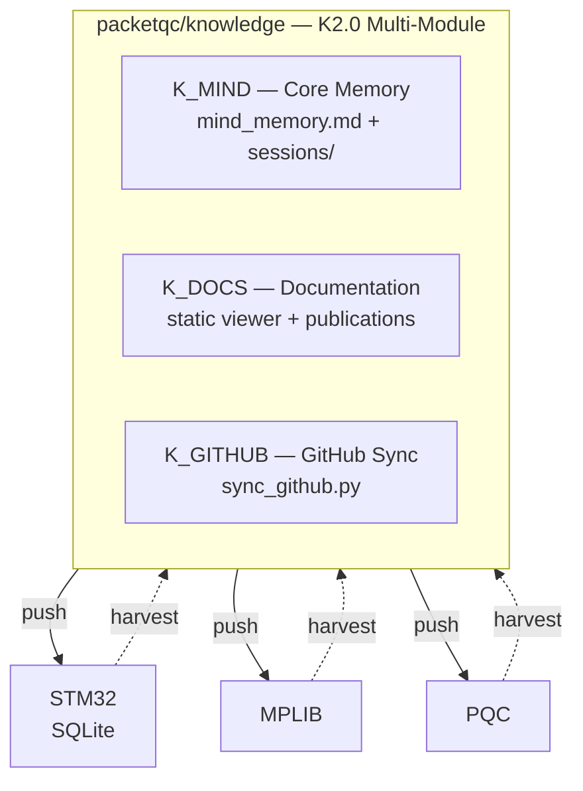

# Connaissances distribuées — Flux bidirectionnel de connaissances pour l'ingénierie multi-projets assistée par IA
{: #pub-title}

**Table des matières**

| | |
|---|---|
| [Résumé](#résumé) | Vue d'ensemble du réseau d'intelligence distribuée |
| [Le flux bidirectionnel](#le-flux-bidirectionnel) | Pousser la méthodologie, récolter les connaissances |
| [Couches de connaissances](#couches-de-connaissances) | Hiérarchie core, prouvé, récolté, session |
| [Résultats du premier harvest](#résultats-du-premier-harvest) | 3 satellites clés, 9 candidats à promotion |
| [Flux de promotion interactif](#flux-de-promotion-interactif) | Pipeline réviser, préparer, promouvoir |
| [Protocole de branches & livraison semi-automatique](#protocole-de-branches--livraison-semi-automatique) | Réalité du proxy et modèle à deux canaux |
| [Sous-enfant : Tableau de bord vivant](#sous-enfant--tableau-de-bord-vivant) | Document de statut réseau en temps réel |

## Résumé

Les assistants de codage IA acquièrent une mémoire persistante via `CLAUDE.md` et `notes/` — mais en travaillant sur plusieurs projets, chaque instance évolue indépendamment. L'intelligence est générée partout mais consolidée nulle part.

**Connaissances distribuées** crée un réseau vivant : un cerveau maître pousse la méthodologie vers les satellites au démarrage, et `harvest` ramène les connaissances évoluées. Le résultat est une intelligence distribuée auto-réparatrice et consciente des versions.

**Par conception**, le système n'opère que sur les dépôts que l'utilisateur possède et auxquels Claude Code a reçu accès via sa configuration d'application GitHub. Aucun dépôt externe ou tiers n'est jamais accédé.

## Le flux bidirectionnel

| Direction | Mécanisme | Contenu |
|-----------|-----------|---------|
| **Push** (sortant) | `wakeup` lit le CLAUDE.md core | Méthodologie, patterns, écueils, commandes |
| **Harvest** (entrant) | `harvest <projet>` parcourt les branches | Patterns évolués, nouveaux écueils, publications |

## Couches de connaissances

| Couche | Stabilité | Rôle |
|--------|-----------|------|
| **Core** (CLAUDE.md) | Stable | Identité, méthodologie, log d'évolution |
| **Prouvé** (patterns/, lessons/) | Validé | Éprouvé sur 2+ projets |
| **Récolté** (minds/) | En évolution | Frais des expériences satellites |
| **Session** (notes/) | Éphémère | Mémoire de travail par session |

## Résultats du premier harvest

15 dépôts parcourus. 3 satellites clés analysés :

| Satellite | Version | Dérive | Candidats à promotion |
|-----------|---------|--------|----------------------|
| STM32N6570-DK_SQLITE | v0 | 10 en retard | 3 (taille cache, latence printf, slot mismatch) |
| MPLIB | v0 | 10 en retard | 3 (multi-RTOS, limitation CubeMX, TouchGFX MVP) |
| PQC | v0 | 10 en retard | 3 (tailles ML-KEM, conformité librairies, certs flash) |

**9 candidats à promotion** récoltés. **100% de taux de dérive** — tous les satellites précèdent Knowledge.

## Flux de promotion interactif

Les découvertes récoltées avancent à travers 4 étapes, pilotées depuis le tableau de bord :

| Étape | Icône | Action |
|-------|-------|--------|
| Réviser | 🔍 | `harvest --review N` — l'humain valide |
| Préparer | 📦 | `harvest --stage N <type>` — en file pour intégration |
| Promouvoir | ✅ | `harvest --promote N` — écrit dans le core maintenant |
| Auto | 🔄 | `harvest --auto N` — auto-promotion au prochain healthcheck |

Icônes de sévérité : 🟢 actuel — 🟡 dérive mineure — 🟠 modérée — 🔴 critique — ⚪ inactif

`harvest --healthcheck` parcourt tous les satellites, met à jour le tableau de bord et traite les auto-promotions.

## Protocole de branches & livraison semi-automatique

Claude Code fonctionne derrière un **proxy git** qui restreint le push à la branche `claude/<task-id>` assignée uniquement. Pousser vers `main` ou toute autre branche retourne HTTP 403. C'est intentionnel — documenté dans la doc de sécurité officielle de Claude Code.

Le résultat est un protocole de livraison **semi-automatique** :

| Étape | Qui | Action |
|-------|-----|--------|
| 1–4 | Claude (autonome) | Travail, commit, push vers branche tâche, création PR |
| 5 | Utilisateur (un clic) | Révise et approuve le PR → merge arrive sur `main` |

**Deux types de branches seulement** : `main` (convergence, contrôlé par PR) et `claude/<task-id>` (éphémère, par session).

**Modèle à deux canaux (v28)** : Les opérations git passent par le proxy (restreint). L'API REST GitHub va directement (sans restriction avec jeton). Avec un jeton éphémère valide, une seule session peut orchestrer tout le réseau via l'API — créer des PRs, les fusionner, gérer les branches sur tous les dépôts.

**Routine admin** : Réviser les PRs ouverts quotidiennement (2-3 min), fusionner en un clic, supprimer les branches. Utiliser `gh pr merge` pour les opérations en lot. Voir la [documentation complète]({{ '/fr/publications/distributed-minds/full/' | relative_url }}) pour le guide admin complet.

## Alias d'appel `#` — Routage de connaissances

L'alias d'appel `#` (v26) ajoute un **routage indépendant de l'emplacement** à l'intelligence distribuée. `#N:` cible toute note vers une publication/projet quel que soit le dépôt dans lequel l'utilisateur travaille.

| Entrée | Routage |
|--------|---------|
| `#N: contenu` | Ciblé vers le projet N |
| `#0: dump brut` | Entrée brute — Claude classifie |
| Pas de `#`, dans un dépôt | Projet principal implicite |
| `#N:info` | Afficher les connaissances accumulées |
| `#N:done` | Compiler les notes en résumé |

**Convergence multi-satellite** : Même projet documenté depuis plusieurs satellites — `#N:` est la clé de routage, pas le dépôt. Harvest extrait toutes les notes `#N:` dans `minds/`, la promotion converge vers le core. Voir [Publication #0 — Convention alias d'appel `#`]({{ '/fr/publications/knowledge-system/full/#convention-alias-dappel-' | relative_url }}).

## Sous-enfant : Tableau de bord vivant

Le [Tableau de bord]({{ '/fr/publications/distributed-knowledge-dashboard/' | relative_url }}) est un document vivant mis à jour à chaque exécution de `harvest` — un panneau de contrôle interactif pour l'intelligence distribuée.

---

[**Lire la documentation complète →**]({{ '/fr/publications/distributed-minds/full/' | relative_url }})

---

*Auteurs : Martin Paquet & Claude (Anthropic, Opus 4.6)*
*Connaissances : [packetqc/knowledge](https://github.com/packetqc/knowledge)*
