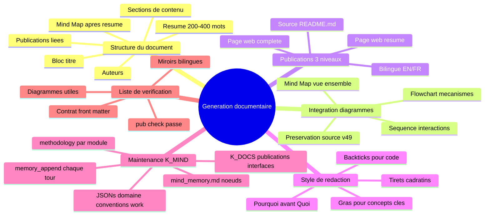

# Methodologie de generation documentaire — Documentation complete
{: #pub-title}

> **Resume** : [Publication #18]({{ '/fr/publications/documentation-generation/' | relative_url }}) | **Parent** : [#0 — Systeme de connaissances]({{ '/fr/publications/knowledge-system/' | relative_url }})

**Table des matieres**

| | |
|---|---|
| [Resume](#resume) | La methodologie des methodologies |
| [Le probleme](#le-probleme) | Conventions implicites perdues apres compaction |
| [La solution](#la-solution) | Standards codifies avec heritage universel |
| [1. Structure du document source](#1-structure-du-document-source) | Ordre de sections standard |
| [2. Standard mind map](#2-standard-mind-map) | Placement, conventions, reutilisabilite |
| [3. Integration diagrammes](#3-regles-dintegration-des-diagrammes) | Selection de type, style, preservation source |
| [4. Structure a trois niveaux](#4-structure-de-publication-a-trois-niveaux) | Source → Resume → Complet |
| [5. Style de redaction](#5-conventions-de-style-de-redaction) | Formatage, references, ton |
| [6. Qualites fondamentales](#6-alignement-des-qualites-fondamentales) | Comment les 13 qualites sont renforcees |
| [7. Heritage universel](#7-heritage-universel) | Liste de verification des fichiers essentiels |
| [8. Liste de verification](#8-liste-de-verification-qualite) | Validation en 13 points |
| [Impact](#impact) | Ce que cela change |
| [Principes de conception](#principes-de-conception) | Ce que nous avons appris |

---

## Resume

Chaque publication du systeme Knowledge suit des patrons qui ont evolue organiquement par la pratique : mind maps apres les resumes, structure a trois niveaux (source → resume → complet), miroirs bilingues, integration de diagrammes et mises a jour des fichiers essentiels. Ces patrons n'avaient jamais ete formellement documentes — ils vivaient implicitement dans l'experience accumulee de 17 publications et 49 versions de connaissances.

Cette publication est **la methodologie des methodologies** — elle codifie les standards de generation documentaire dont chaque autre methodologie herite. Quand Claude genere une publication, cree un fichier de methodologie ou livre tout artefact documentaire, ce sont les conventions qu'il suit.

L'idee cle est **l'heritage universel** : chaque operation specifique a une methodologie (creation de publication, promotion harvest, creation de projet, corrections structurelles) herite de l'obligation de mettre a jour les fichiers essentiels du systeme — `NEWS.md`, `PLAN.md`, `LINKS.md`, `CLAUDE.md`, `STORIES.md`, `publications/README.md`, index de publications et pages de profil. Une commande = travail + fichiers essentiels + livraison.

---

## Le probleme

Au fil de 17 publications et 49 versions de connaissances, le systeme a developpe des patrons documentaires coherents — mais ils n'ont jamais ete ecrits. Les nouvelles instances Claude lisaient `CLAUDE.md` et apprenaient les commandes et protocoles, mais les *conventions de generation documentaire* (comment ecrire les resumes, quand utiliser quel type de diagramme, quels fichiers mettre a jour apres chaque livraison) etaient absorbees implicitement par l'exemple.

Cela creait deux risques :
1. **Incoherence apres compaction** — Apres compaction de la fenetre de contexte, les conventions implicites etaient perdues. Les mind maps disparaissaient des nouvelles publications. Les fichiers essentiels n'etaient pas mis a jour. La qualite chutait.
2. **Aucun chemin d'integration** — Une nouvelle methodologie ne pouvait pas heriter de standards qui n'existaient pas par ecrit. Chaque methodologie reinventait ses propres conventions au lieu d'heriter d'un parent universel.

---

## La solution

Une meta-methodologie formelle (`methodology/documentation-generation.md`) qui codifie :

### 1. Structure du document source

Chaque source de publication suit un ordre de sections standard :

| Ordre | Section | Objectif |
|-------|---------|----------|
| 1 | **Bloc titre** | ID de publication, version, date, bascule de langue |
| 2 | **Auteurs** | Descriptions de roles specifiques a cette publication |
| 3 | **Resume** | 200-400 mots, "pourquoi" avant "quoi" |
| 4 | **Mind Map** | Resume visuel — toujours apres le resume, toujours present |
| 5 | **Contexte / Probleme** | Le besoin d'ingenierie qui a declenche ce travail |
| 6 | **Solution / Mecanisme** | Comment cela fonctionne — architecture, protocole, approche |
| 7 | **Implementation** | Approfondissements, code, workflows, exemples |
| 8 | **Resultats / Impact** | Resultats mesures, donnees reelles |
| 9 | **Principes de conception** | Ce que nous avons appris, quels principes ont emerge |
| 10 | **Publications liees** | References croisees vers freres et parents |

### 2. Standard mind map

**Chaque publication inclut un diagramme mind map immediatement apres le resume.** C'est la premiere ancre visuelle du lecteur :

- Noeud racine : titre de la publication ou concept central
- Premier niveau : 3-6 sujets principaux couverts
- Deuxieme niveau : details cles par sujet (2-3 chacun)
- Maximum ~25 noeuds au total pour la lisibilite
- Present dans les TROIS niveaux (source, resume, complet)
- Reutilisable : tableaux de bord, presentations, references croisees

### 3. Regles d'integration des diagrammes

| Position dans le document | Type de diagramme | Objectif |
|--------------------------|-------------------|----------|
| Apres le resume | `mindmap` | Vue d'ensemble de la portee du document |
| Section probleme | `flowchart` | Visualiser le probleme |
| Section solution | `flowchart` / `graph` | Montrer le mecanisme |
| Sections processus | `sequenceDiagram` | Flux etape par etape |
| Sections donnees | `gantt` / `xychart` | Chronologie ou metriques |
| Architecture | `graph TB/LR` | Relations entre composants |

**Selection de type Mermaid** :

| Type | Ideal pour | Direction |
|------|-----------|-----------|
| `mindmap` | Vue d'ensemble, resume de document | Radiale |
| `flowchart TB` | Hierarchies, flux de donnees | Haut en bas |
| `flowchart LR` | Pipelines, processus | Gauche a droite |
| `graph TB/LR` | Architecture generale, DAG | Les deux |
| `sequenceDiagram` | Interactions, appels API | Temporelle |
| `gantt` | Chronologies, phases | Chronologique |

**Preservation source (v49)** : Quand les diagrammes sont pre-rendus en images, la source Mermaid DOIT etre preservee dans un bloc `
`. L'image est l'artefact ; la source est la verite.

### 4. Structure de publication a trois niveaux

| Niveau | Fichier | Portee du contenu |
|--------|---------|-------------------|
| **Source** | `publications/<slug>/v1/README.md` | Contenu canonique complet |
| **Resume** | `docs/publications/<slug>/index.md` | Resume + mind map + points cles + lien vers complet |
| **Complet** | `docs/publications/<slug>/full/index.md` | Documentation complete sur GitHub Pages |

**Direction de synchronisation** : Source → Complet (contenu complet, adapte pour le web). Source → Resume (apercu cure, pas tronque). Mind map present dans les trois.

**Bilingue** : Chaque page web a un miroir EN/FR. Les identifiants techniques restent en anglais. Le texte narratif est traduit.

### 5. Conventions de style de redaction

| Convention | Quand | Exemple |
|------------|-------|---------|
| **Gras** | Premiere mention d'un concept cle | Architecture **Distributed Minds** |
| *Italiques* | Analogie, metaphore, noms de qualites | la qualite *persistant* |
| `Backticks` | Code, fichiers, commandes, branches | `harvest --healthcheck` |
| Tiret cadratin (—) | Detail parenthetique | le systeme — concu pour l'autonomie — s'adapte |
| `#N` | Reference de publication | Publication #7 (Harvest Protocol) |

**Ton** : Technique mais axe sur le narratif. Cadrer le "pourquoi" avant le "quoi". Eviter le jargon sans contexte.

### 6. Alignement des qualites fondamentales

Chaque convention documentaire renforce les **13 qualites fondamentales** du systeme — les principes de conception vitaux sur lesquels Knowledge a ete bati :

| Qualite | Comment la generation documentaire la renforce |
|---------|-----------------------------------------------|
| **Autosuffisant** | Zero dependance externe — markdown dans Git |
| **Autonome** | Pipeline auto-operant — `pub new` → `pub sync` → `pub check` |
| **Concordant** | Miroirs EN/FR, validation front matter, synchronisation 3 niveaux |
| **Concis** | Resumes cures, pas de copies tronquees ; mind maps pour la portee |
| **Interactif** | Mind maps reutilisables, commandes click-to-copy, icones de severite |
| **Evolutif** | Chaque publication capture une decouverte reelle — le systeme grandit |
| **Distribue** | Les satellites produisent des publications ; harvest les ramene au core |
| **Persistant** | Source versionnee ; pages web derivees ; connaissances survivent aux sessions |
| **Recursif** | Cette publication documente la methodologie qui l'a produite |
| **Securitaire** | Pas de credentials ; fork-safe ; URLs scopees au proprietaire |
| **Resilient** | Trois niveaux = redondance ; `pub check` detecte la derive |
| **Structure** | Ordre de sections standard, contrat front matter, indexation P#/S#/D# |
| **Integre** | Les publications alimentent Issues, boards et webcards — extension vers les plateformes |

Ce sont l'ADN du systeme de connaissances. Chaque methodologie les herite par heritage de cette meta-methodologie. Chaque artefact documentaire qui suit ces conventions incarne automatiquement les 13 qualites.

### 7. Heritage universel

**Chaque methodologie herite de cette obligation.** Quand toute operation produit des changements :

| Fichier | Mettre a jour quand | Quoi |
|---------|---------------------|------|
| `NEWS.md` | Tout livrable | Nouvelle entree de changelog |
| `PLAN.md` | Nouvelle fonctionnalite/capacite | Section Nouveautes ou En cours |
| `LINKS.md` | Nouvelle URL de page web | Ajouter a Essentiels ou Hubs ; mettre a jour les compteurs |
| `CLAUDE.md` | Nouvelle publication/commande/evolution | Table Publications, Commandes, Evolution |
| `STORIES.md` | Nouvelle histoire de succes | Ajouter a l'index avec categorie et date |
| `publications/README.md` | Nouvelle publication | Ajouter a l'index maitre des publications |
| Index de publications (EN/FR) | Nouvelle publication | Ajouter l'entree aux deux |
| Pages de profil (6) | Nouvelle publication | Ajouter aux 6 pages de profil — priorite basse, peut etre regroupe |

**Le principe d'heritage** : chaque fichier de methodologie dans `methodology/` est un enfant de cette meta-methodologie. Quand une operation specifique a une methodologie s'execute (`pub new`, `harvest --promote`, `project create`, `normalize --fix`), elle herite de la liste de verification universelle.

### 8. Liste de verification qualite

Avant de livrer toute publication :

- [ ] Tous les champs front matter presents (`layout`, `title`, `description`, `pub_id`, `version`, `date`, `permalink`, `og_image`, `keywords`)
- [ ] Resume : 200-400 mots, repond "pourquoi" + "quoi"
- [ ] Mind map : present apres le resume dans les trois niveaux
- [ ] Diagrammes : soutiennent le recit, pas decoratifs
- [ ] Tableaux : pipes markdown, en-tetes en gras, format coherent
- [ ] Trois niveaux : source + resume + complet
- [ ] Miroirs bilingues : EN + FR pour toutes les pages web
- [ ] Webcard : generee (ou placeholder) et `og_image` defini
- [ ] Fichiers essentiels : NEWS.md, PLAN.md, LINKS.md, STORIES.md evalues pour mise a jour
- [ ] CLAUDE.md : Table Publications mise a jour
- [ ] publications/README.md : Index maitre mis a jour
- [ ] Index de publications : EN/FR tous deux mis a jour
- [ ] References croisees : publications soeurs liees
- [ ] `pub check` passe

---

## Impact

### Ce que cela change

| Avant | Apres |
|-------|-------|
| Conventions absorbees implicitement par l'exemple | Conventions codifiees et heritables |
| Les mind maps apparaissaient parfois, pas toujours | Standard mind map : toujours apres le resume |
| Fichiers essentiels mis a jour de facon incoherente | Heritage universel : chaque methodologie verifie NEWS/PLAN/LINKS |
| Nouvelles methodologies reinventaient la structure | Nouvelles methodologies heritent de la meta-methodologie |
| La qualite dependait de l'etat de la fenetre de contexte | La liste de verification survit a la compaction |
| Les qualites fondamentales etaient implicites dans la pratique | Les qualites explicitement alignees aux conventions documentaires |

### Principes de conception

1. **Codifier, ne pas memoriser** — Si un patron se repete 3+ fois, il appartient a la methodologie, pas a la memoire de session
2. **Heriter, ne pas dupliquer** — Chaque methodologie herite les obligations universelles de ce parent
3. **Mind map d'abord** — Le resume visuel est le point d'entree du lecteur, pas une arriere-pensee
4. **La source est la verite** — Le README.md source pilote tous les artefacts derives (pages web, PDF, diagrammes)
5. **Une commande, livraison complete** — Travail + fichiers essentiels + commit + push + PR = une operation atomique
6. **Les qualites sont l'ADN** — Les 13 qualites fondamentales ne sont pas aspirationnelles — elles sont imposees par convention

---

## Publications liees

| # | Publication | Relation |
|---|-------------|---------|
| 0 | [Systeme de connaissances]({{ '/fr/publications/knowledge-system/' | relative_url }}) | Parent — #18 codifie la generation documentaire de #0 |
| 5 | [Webcards & partage social]({{ '/fr/publications/webcards-social-sharing/' | relative_url }}) | Conventions de design des webcards |
| 6 | [Normalize & concordance]({{ '/fr/publications/normalize-structure-concordance/' | relative_url }}) | Application de la concordance structurelle |
| 13 | [Pagination web & export]({{ '/fr/publications/web-pagination-export/' | relative_url }}) | Pipeline d'export PDF/DOCX |
| 16 | [Visualisation de pages web]({{ '/fr/publications/web-page-visualization/' | relative_url }}) | Pipeline de rendu local |
| 17 | [Pipeline de production web]({{ '/fr/publications/web-production-pipeline/' | relative_url }}) | Chaine de traitement Jekyll |

**Source** : [Issue #355](https://github.com/packetqc/knowledge/issues/355) — Session de methodologie de generation documentaire.

---

*Auteurs : Martin Paquet & Claude (Anthropic, Opus 4.6)*
*Knowledge : [packetqc/knowledge](https://github.com/packetqc/knowledge)*
