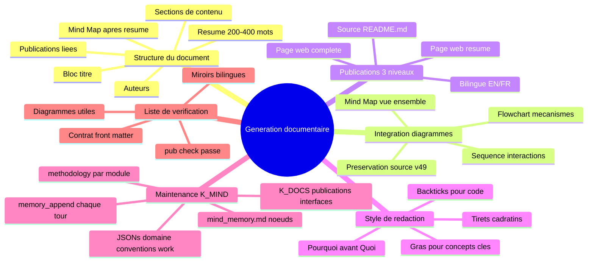

# Methodologie de generation documentaire
{: #pub-title}

> **Publication parente** : [#0 — Systeme de connaissances]({{ '/fr/publications/knowledge-system/' | relative_url }}) | **Companion structure** : [#6 — Normalize]({{ '/fr/publications/normalize-structure-concordance/' | relative_url }}) | **Companion pipeline** : [#17 — Pipeline de production web]({{ '/fr/publications/web-production-pipeline/' | relative_url }}) | **Référence core** : [#14 — Analyse d'architecture]({{ '/fr/publications/architecture-analysis/' | relative_url }}) | [#0v2 — Knowledge 2.0]({{ '/fr/publications/knowledge-2.0/' | relative_url }})

**Table des matieres**

| | |
|---|---|
| [Resume](#resume) | La methodologie des methodologies |
| [Le probleme](#le-probleme) | Conventions implicites perdues apres compaction |
| [La solution](#la-solution) | Standards codifies avec heritage universel |
| [Qualites fondamentales](#alignement-des-qualites-fondamentales) | Comment la documentation renforce les 13 qualites |
| [Documentation complete](#documentation-complete) | Reference complete de la meta-methodologie |

## Resume

Chaque publication du systeme Knowledge suit des patrons qui ont evolue organiquement par la pratique : mind maps apres les resumes, structure a trois niveaux (source → resume → complet), miroirs bilingues, integration de diagrammes et mises a jour des fichiers essentiels. Ces patrons n'avaient jamais ete formellement documentes — ils vivaient implicitement dans l'experience accumulee de 17 publications et 49 versions de connaissances.

Cette publication est **la methodologie des methodologies** — elle codifie les standards de generation documentaire dont chaque autre methodologie herite. Quand Claude genere une publication, cree un fichier de methodologie ou livre tout artefact documentaire, ce sont les conventions qu'il suit.

L'idee cle est **l'heritage universel** : chaque operation specifique a une methodologie (creation de publication, synchronisation K_GITHUB, creation de projet, corrections structurelles) herite de l'obligation de mettre a jour les fichiers essentiels du systeme — `NEWS.md`, `PLAN.md`, `LINKS.md`, `mind_memory.md + JSONs de domaine`, `STORIES.md`, `publications/README.md`, index de publications et pages de profil. Une commande = travail + fichiers essentiels + livraison.

La [documentation complete]({{ '/fr/publications/documentation-generation/full/' | relative_url }}) couvre toutes les sections avec les specifications detaillees.

## Le probleme

Au fil de 17 publications et 49 versions de connaissances, le systeme a developpe des patrons documentaires coherents — mais ils n'ont jamais ete ecrits. Les nouvelles instances Claude lisaient `mind_memory.md` et apprenaient les directives et protocoles, mais les *conventions de generation documentaire* etaient absorbees implicitement par l'exemple.

Cela creait deux risques :
1. **Incoherence apres compaction** — Apres compaction de la fenetre de contexte, les conventions implicites etaient perdues. Les mind maps disparaissaient. Les fichiers essentiels n'etaient pas mis a jour. La qualite chutait.
2. **Aucun chemin d'integration** — Une nouvelle methodologie ne pouvait pas heriter de standards qui n'existaient pas par ecrit.

## La solution

Une meta-methodologie formelle (`methodology/documentation-generation.md`) qui codifie :

| Standard | Ce qu'il definit |
|----------|-----------------|
| **Structure du document source** | Ordre de 10 sections : titre → auteurs → resume → mind map → contenu → publications liees |
| **Standard mind map** | Toujours present apres le resume, dans les 3 niveaux, 3-6 noeuds premier niveau |
| **Integration diagrammes** | Selection de type par position : mindmap → flowchart → sequence → gantt |
| **Structure a trois niveaux** | Source → Resume → Complet, avec miroirs bilingues EN/FR |
| **Style de redaction** | Gras pour concepts, backticks pour code, tirets cadratins, "pourquoi" avant "quoi" |
| **Heritage universel** | Chaque methodologie met a jour NEWS.md, PLAN.md, LINKS.md, mind_memory.md + JSONs de domaine, index |
| **Liste de verification** | Validation en 13 points avant toute livraison |

## Alignement des qualites fondamentales

Chaque convention documentaire renforce les **13 qualites fondamentales** du systeme :

| Qualite | Comment la documentation la renforce |
|---------|-------------------------------------|
| **Autosuffisant** | Zero dependance externe — markdown dans Git |
| **Autonome** | Pipeline auto-operant — `pub new` → `pub sync` → `pub check` |
| **Concordant** | Miroirs EN/FR, validation front matter, synchronisation 3 niveaux |
| **Concis** | Resumes cures, pas de copies tronquees ; mind maps pour la portee |
| **Interactif** | Mind maps reutilisables, commandes click-to-copy, icones de severite |
| **Evolutif** | Chaque publication capture une decouverte reelle |
| **Distribue** | Les satellites produisent des publications ; K_GITHUB sync les ramene au core |
| **Persistant** | Source versionnee ; pages web derivees ; connaissances survivent aux sessions |
| **Recursif** | Cette publication documente la methodologie qui l'a produite |
| **Securitaire** | Pas de credentials ; fork-safe ; URLs scopees au proprietaire |
| **Resilient** | Trois niveaux = redondance ; `pub check` detecte la derive |
| **Structure** | Ordre de sections standard, contrat front matter, indexation P#/S#/D# |
| **Integre** | Les publications alimentent Issues, boards et webcards |

## Documentation complete

La [documentation complete]({{ '/fr/publications/documentation-generation/full/' | relative_url }}) inclut toutes les sections :

| Section | Ce qu'elle couvre |
|---------|------------------|
| Structure du document source | Ordre de sections standard pour toutes les publications |
| Standard mind map | Placement, conventions, reutilisabilite |
| Integration diagrammes | Selection de type, style, preservation source |
| Structure a trois niveaux | Division source → resume → complet |
| Style de redaction | Conventions de formatage, format de reference, ton |
| Qualites fondamentales | Comment les 13 qualites sont renforcees par la documentation |
| Heritage universel | Liste de verification des fichiers essentiels |
| Liste de verification | Validation en 13 points avant livraison |

**Source** : [Issue #355](https://github.com/packetqc/knowledge/issues/355) — Session de methodologie de generation documentaire.

---

## Publications liees

| # | Publication | Relation |
|---|-------------|---------|
| 0 | [Systeme de connaissances]({{ '/fr/publications/knowledge-system/' | relative_url }}) | Parent — #18 codifie la generation documentaire de #0 |
| 5 | [Webcards & partage social]({{ '/fr/publications/webcards-social-sharing/' | relative_url }}) | Conventions de design des webcards |
| 6 | [Normalize & concordance]({{ '/fr/publications/normalize-structure-concordance/' | relative_url }}) | Application de la concordance structurelle |
| 13 | [Pagination web & export]({{ '/fr/publications/web-pagination-export/' | relative_url }}) | Pipeline d'export PDF/DOCX |
| 16 | [Visualisation de pages web]({{ '/fr/publications/web-page-visualization/' | relative_url }}) | Pipeline de rendu local |
| 17 | [Pipeline de production web]({{ '/fr/publications/web-production-pipeline/' | relative_url }}) | Chaine de traitement Jekyll |
| 14 | [Analyse d'architecture]({{ '/fr/publications/architecture-analysis/' | relative_url }}) | Conception architecture multi-module |
| 0v2 | [Knowledge 2.0]({{ '/fr/publications/knowledge-2.0/' | relative_url }}) | Référence architecture multi-module K2.0 |

---

*Auteurs : Martin Paquet & Claude (Anthropic, Opus 4.6)*
*Knowledge : [packetqc/knowledge](https://github.com/packetqc/knowledge)*
