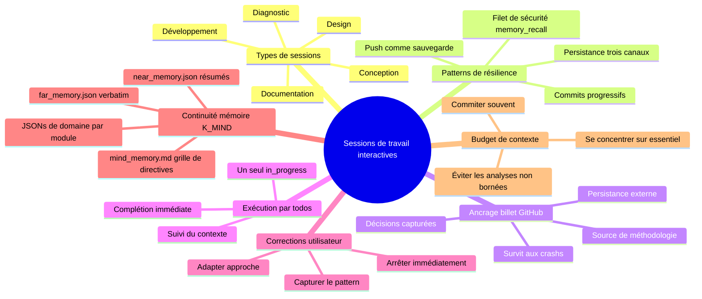
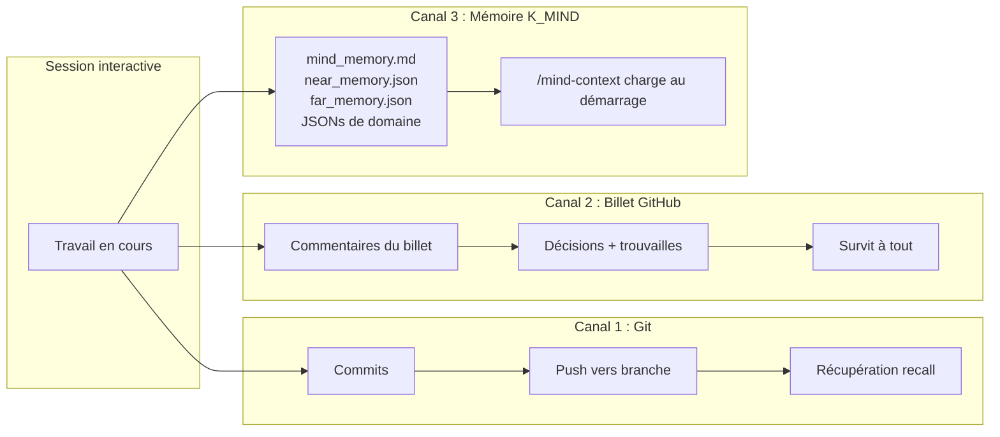

# Sessions de travail interactives — Documentation complète
{: #pub-title}

> **Résumé** : [Publication #19]({{ '/fr/publications/interactive-work-sessions/' | relative_url }}) | **Parent** : [#0 — Système de connaissances]({{ '/fr/publications/knowledge-system/' | relative_url }}) | **Référence core** : [#14 — Analyse d'architecture]({{ '/fr/publications/architecture-analysis/' | relative_url }}) | [#0v2 — Knowledge 2.0]({{ '/fr/publications/knowledge-2.0/' | relative_url }})

**Sommaire**

| | |
|---|---|
| [Résumé](#résumé) | Sessions multi-livraison résilientes |
| [Le problème](#le-problème) | Ce qui fonctionnait, ce qui échouait, la lacune |
| [La solution](#la-solution) | Cinq types, trois canaux, commits progressifs |
| [Types de sessions](#1-cinq-types-de-sessions-interactives) | Diagnostic, documentation, conception, design, développement |
| [Persistance trois canaux](#2-persistance-à-trois-canaux) | Git + Billets GitHub + Fichiers essentiels |
| [Commits progressifs](#3-protocole-de-commits-progressifs) | Points de sauvegarde qui survivent aux crashs |
| [Corrections utilisateur](#4-intégration-des-corrections-utilisateur) | Arrêter, reconnaître, adapter, apprendre |
| [Budget de contexte](#5-gestion-du-budget-de-contexte) | À faire et à ne pas faire |
| [Billets GitHub comme savoir](#6-billet-github-comme-source-de-connaissances) | Canal de persistance secondaire |
| [À la réception de tâche](#7-à-la-réception-de-tâche--popup-comme-point-de-décision) | Skip vs session suivie |
| [Impact](#impact) | Matrice de récupération, principes de design |

---

## Auteurs

**Martin Paquet** — Analyste-programmeur en sécurité réseau, administrateur de sécurité réseau et systèmes, et concepteur-programmeur de logiciels embarqués. Architecte des patterns de sessions interactives documentés ici — les principes de résilience ont émergé de centaines de sessions à travers 6 projets, incluant des sessions qui ont crashé, débordé et récupéré.

**Claude** (Anthropic, Opus 4.6) — Partenaire de développement IA. Co-auteur et praticien de ces patterns — chaque session qui applique cette méthodologie la valide.

---

## Résumé

Les sessions de travail interactives sont le **cœur opérationnel** du système Knowledge. Chaque publication, méthodologie, fonctionnalité et découverte architecturale a été produite lors d'une session interactive entre Martin et Claude. Pourtant, les patterns qui rendent ces sessions productives — commits progressifs, ancrage par billet GitHub, intégration des corrections utilisateur, gestion du budget de contexte — n'avaient jamais été formellement documentés.

Cette publication codifie la méthodologie pour des **sessions interactives résilientes à livraisons multiples**. L'idée clé est la **persistance à trois canaux** : le travail survit à travers les branches Git (commits + pushs), les billets GitHub (persistance externe) et les fichiers essentiels (NEWS.md, PLAN.md, etc.). Quand les trois canaux sont actifs, même un crash catastrophique ne perd au plus que le todo en cours — pas le travail de toute la session.

La méthodologie reconnaît **cinq types de sessions interactives**, chacun avec son propre pattern de phases : diagnostic (hypothèse → élimination → correctif), documentation (collecte → structure → miroir), design (exploration → proposition → construction), développement de fonctionnalités (analyse → implémentation → intégration) et conception (idéation → prototype → validation). Tous les types héritent des mêmes patterns de résilience : commits progressifs, push comme sauvegarde, exécution par todos et héritage universel des fichiers essentiels.

La preuve est récursive : cette publication a été créée lors d'une session de documentation interactive qui a appliqué les mêmes patterns qu'elle décrit — incluant les commits progressifs à chaque todo, les fichiers essentiels mis à jour par héritage universel et un billet GitHub ancrant le travail.



---

## Le problème

À travers des centaines de sessions dans 6 projets (P0–P5), des patterns récurrents ont émergé — et des échecs récurrents :

### Ce qui fonctionnait

| Pattern | Comment ça aidait |
|---------|-------------------|
| Commits progressifs | Points de sauvegarde qui survivaient aux crashs de session |
| Billets GitHub | Persistance externe quand les sessions mouraient avec du travail non commité |
| TodoWrite | Suivi de progression visible qui survivait à la compaction du contexte |
| Corrections utilisateur | Corrections de cap qui prévenaient le gaspillage de contexte |

### Ce qui échouait

| Échec | Impact | Fréquence |
|-------|--------|-----------|
| Tout le travail dans un commit final | Crash de session = perte totale | Courant au début |
| Pas de push avant la fin | `recover` ne peut récupérer le travail non pushé | Courant |
| Pas d'ancrage par billet | Contexte perdu au crash — aucun enregistrement externe | Fréquent |
| Ignorer le correctif plus simple de l'utilisateur | Gaspillé 3–5 tentatives avant d'essayer la suggestion (Pitfall #22) | Documenté |
| Analyse non bornée de fichiers | Débordement de contexte en analysant 6 pages de profil | Documenté (cette session) |
| Fichiers essentiels oubliés | Publications créées mais NEWS.md/PLAN.md non mis à jour | Découvert via #18 |
| Fichiers vitaux manquants | `publications/README.md` et `STORIES.md` pas dans la checklist | Découvert via #18 |

### La lacune

`session-protocol.md` couvre le cycle de vie (démarrage de session → travail → commit+push). `interactive-diagnostic.md` couvre les sessions de débogage. Mais les **patterns de résilience pendant le travail** — commits progressifs, ancrage par billet, gestion du budget de contexte, types de sessions multiples — étaient pratiqués implicitement sans documentation.

---

## La solution

Un cadre méthodologique formel : un parapluie (`methodology/interactive-work-sessions.md`) plus des fichiers dédiés par type.

### 1. Cinq types de sessions interactives

| Type | Déclencheur | Pattern de phases | Méthodologie |
|------|-------------|-------------------|-------------|
| **Diagnostic** | Rapport de bug, problème de rendu, problème comportemental | Hypothèse → élimination → isolation → correctif → documenter | `interactive-diagnostic.md` |
| **Documentation** | Nouvelle publication, méthodologie, histoire de succès | Collecte → structure → expansion → pages web → livraison | `interactive-documentation.md` |
| **Conception** | Nouvelle idée, exploration d'architecture, prototype | Idéation → prototype → retour utilisateur → validation → formalisation | `interactive-conception.md` |
| **Design** | Nouvelle fonctionnalité, architecture, UI, webcard | Exploration → proposition → validation utilisateur → construction → itération | (parapluie) |
| **Développement** | Nouvelle commande, script, pipeline | Analyse → implémentation → test → documentation → intégration | (parapluie) |

Tous les types héritent du même cadre de résilience. Les phases sont des modèles — les vraies sessions mélangent les types naturellement. Une session de documentation peut découvrir un bug (→ diagnostic), qui révèle une fonctionnalité manquante (→ développement).

### 2. Persistance à trois canaux

Le travail survit à travers trois canaux indépendants :



| Canal | Récupéré via | Survit à | À risque quand |
|-------|-------------|----------|----------------|
| **Branche Git** | `memory_recall.py`, `session_init.py --preserve-active`, PR manuelle | Crash de session, débordement de contexte | Jamais commité |
| **Billet GitHub** | URL du billet, référence du board | Tout | Billet supprimé (rare) |
| **Fichiers essentiels** | `/mind-context` les charge au démarrage de session | Fusion du PR sur la branche par défaut | Non commité ou PR non fusionné |

**Résilience maximale** : Les trois canaux actifs. Même un crash catastrophique ne perd au plus que le todo en cours.

### 3. Protocole de commits progressifs

```
Todo 1 → travail → commit → push ✓  (sauvegarde 1)
Todo 2 → travail → commit → push ✓  (sauvegarde 2)
Todo 3 → travail → commit → [CRASH]
                               ↓
                        Nouvelle session :
                        memory_recall.py → récupère todos 1 + 2 + 3 (si pushé)
                        billet → montre ce que faisait todo 3
                        session_init.py --preserve-active → reprend todo 3
```

| Quand commiter | Exemple | Pourquoi |
|----------------|---------|----------|
| Après chaque todo complété | « Ajouter Publication #17 — 10 fichiers » | Point de sauvegarde |
| Après une découverte | « Mettre à jour publications/README.md — était périmé » | Capturer l'insight |
| Avant une opération risquée | « Avant une analyse de fichiers massive » | Assurance |
| Après une correction utilisateur | « Fix : fichiers essentiels, pas pages de profil » | Prévenir la répétition |

### 4. Intégration des corrections utilisateur

La personne qui observe le rendu (navigateur, appareil, page réelle) a de l'information que l'IA n'a pas. Quand l'utilisateur redirige :

1. **Arrêter** — ne pas terminer la mauvaise approche
2. **Reconnaître** — confirmer ce qui était erroné
3. **Adapter** — passer à la bonne approche immédiatement
4. **Apprendre** — si la correction révèle un pattern, le capturer

**Exemples réels de cette session** :
- « Tu regardes au mauvais endroit pour les publications » → se concentrer sur les fichiers essentiels, pas les pages de profil
- « publications/README.md est périmé » → découvert un fichier vital manquant
- « STORIES.md devrait être dans les fichiers vitaux » → élargi la checklist d'héritage universel
- « on devrait avoir 3 interactive-session-<type> » → fichiers de méthodologie séparés par type

### 5. Gestion du budget de contexte

| À faire | À ne pas faire |
|---------|----------------|
| Se concentrer d'abord sur les fichiers essentiels | Analyser toutes les pages de profil pour une entrée |
| Lire les fichiers une fois, garder en contexte | Relire CLAUDE.md après compaction |
| Commiter souvent (moins de contexte par todo) | Accumuler tout pour un gros commit |
| Utiliser grep pour des recherches ciblées | Lire 10 fichiers séquentiellement |
| Grouper les éditions connexes (4 pages web en un passage) | Les mettre à jour une par une avec des relectures complètes |
| Marquer les todos terminés immédiatement | Grouper 3 complétions ensemble |

**Signaux d'alarme de débordement** :
- Relire des fichiers > 500 lignes → utiliser des plages ciblées
- Chercher dans > 5 fichiers la même chose → utiliser grep
- Troisième tentative de la même approche → prendre du recul, essayer la suggestion de l'utilisateur
- Pages de profil ou index secondaires → sauter, grouper plus tard

### 6. Billet GitHub comme source de connaissances

Les billets GitHub ne sont pas que des suivis de tâches — ils sont un **canal de persistance secondaire** qui capture l'intelligence de la session :

| Ce que les billets capturent | Pourquoi c'est important |
|------------------------------|--------------------------|
| L'intention utilisateur | La demande originale dans ses propres mots |
| Les décisions prises | Les choix enregistrés au moment où ils se produisent |
| Les corrections appliquées | La redirection et pourquoi |
| Les découvertes | Fichiers périmés, entrées manquantes, nouveaux patterns |
| Les insights méthodologiques | La réalité itérative que les docs polis ne montrent pas |

### 7. À la réception de tâche — Popup comme point de décision

Chaque message d'entrée de session est **présumé être une demande de travail par défaut**. L'utilisateur tape toujours quelque chose pour ouvrir une session — cette entrée est toujours une demande jusqu'à ce que l'utilisateur en décide explicitement autrement. Le popup de confirmation s'exécute **systématiquement après la complétion du démarrage de session**, à chaque session.

```
démarrage session terminé
    ↓
Extraction du titre depuis le message d'entrée
    ↓
Popup AskUserQuestion :
    ├── Accepter le titre  → session suivie (billet créé)
    ├── Autre (raffiner)   → session suivie (titre de l'utilisateur)
    └── Skip tracking      → session non suivie (pas de billet)
    ↓
Le travail commence
```

Le popup est le **seul point de décision**. L'utilisateur le voit, clique une option, et la session continue. Accepter = tâche suivie. Skip = non suivie. Raffiner = suivie avec meilleur titre. Le popup apparaît toujours — le silence n'est jamais une option.

**Insight clé** : Les sessions en lecture seule (révisions, validations, audits) **sont des tâches**. Une session qui valide 50 liens sans modifier un seul fichier est une tâche. Une session qui diagnostique un bug sans le corriger est une tâche. Lecture seule ne veut pas dire informel.

#### Skip vs Suivi — Ce qui change, ce qui reste

L'option skip **ne contourne que** la création du billet et les commentaires en temps réel. Tous les autres mécanismes de session fonctionnent normalement :

| Élément | Skip | Accepter / Raffiner |
|---------|------|---------------------|
| Popup de confirmation | Apparaît | Apparaît |
| Billet GitHub | Pas créé | Créé |
| Commentaires temps réel sur billet | Pas de billet à commenter | Alternance 🧑/🤖 |
| Todo list | Normal | Normal |
| Exécution du travail | Normal | Normal |
| Résumé pre-save (v50) | Métriques + temps + auto-évaluation | Idem + posté sur le billet |
| Commit / push / PR | Normal | Normal |

**La compilation se fait toujours.** Les métriques (fichiers, lignes, commits), les blocs temporels (temps actif, temps calendrier) et l'auto-évaluation (conformité méthodologique) sont compilés à chaque `save` — que la session soit suivie ou non. La seule différence : les sessions suivies postent la compilation comme commentaire final sur le billet GitHub, créant un enregistrement persistant. Les sessions non suivies affichent la compilation mais ne la persistent pas à l'externe.

**Quand faire skip** : Commandes d'infrastructure (K_VALIDATION `/normalize`, K_GITHUB sync + `/integrity-check`), questions rapides (« quel est le statut ? »), maintenance système qui ne justifie pas un suivi. Le skip est le **choix explicite de l'utilisateur** — Claude ne décide jamais pour l'utilisateur qu'une session est « trop informelle » pour être suivie.

---

## Impact

### Ce que ça change

| Avant | Après |
|-------|-------|
| Un commit en fin de session | Commits progressifs à chaque todo |
| Aucun enregistrement externe | Billet GitHub ancre chaque session multi-livraison |
| Débordement de contexte par analyses exhaustives | Gestion du budget de contexte avec priorité aux fichiers essentiels |
| Corrections utilisateur perdues après compaction | Corrections capturées comme patterns dans la méthodologie |
| Récupération dépend du checkpoint seul | Persistance à trois canaux — branche + billet + fichiers |
| Types de sessions non différenciés | Cinq types avec modèles de phases et fichiers de méthodologie dédiés |
| Résilience était une pratique implicite | Résilience codifiée avec matrice de récupération |

### Matrice de récupération

| Mode de défaillance | Chemin de récupération | Données perdues |
|--------------------|----------------------|----------------|
| Débordement de contexte | `/mind-context` reload dans la même session | Aucune (travail continue) |
| Crash de session + checkpoint | `session_init.py --preserve-active` dans nouvelle session | Aucune (checkpoint capture l'état) |
| Crash de session + push | `memory_recall.py` dans nouvelle session | Au plus le todo en cours |
| Crash de session, pas de push | Le billet a le contexte + récupération manuelle | Travail non commité seulement |
| API 400 (irrécupérable) | Nouvelle session + `memory_recall.py` + billet | Non commité depuis le dernier push |

### Principes de design

1. **Trois canaux, pas un** — Branches Git, billets GitHub et fichiers essentiels sont des chemins de persistance indépendants
2. **Progressif, pas terminal** — commiter à chaque jalon, pas en fin de session
3. **L'utilisateur voit ce que vous ne voyez pas** — les corrections de la personne observant le rendu sont des données primaires
4. **Fichiers essentiels d'abord** — la checklist d'héritage universel est la priorité, pas la couverture exhaustive
5. **Les types partagent la résilience** — les cinq types de sessions héritent des mêmes patterns de commits progressifs et d'ancrage par billet
6. **Méthodologie par type** — chaque type de session a son propre fichier de méthodologie dédié avec des protocoles spécifiques
7. **La méthodologie se prouve elle-même** — cette publication a été créée dans une session de documentation interactive qui a appliqué ses propres patterns

---

## Publications connexes

| # | Publication | Relation |
|---|-------------|---------|
| 3 | [Persistance de session IA]({{ '/fr/publications/ai-session-persistence/' | relative_url }}) | Méthodologie fondamentale de persistance |
| 8 | [Gestion de session]({{ '/fr/publications/session-management/' | relative_url }}) | Scripts de cycle de vie (session_init.py, memory_append.py, memory_recall.py) |
| 0v2 | [Knowledge 2.0]({{ '/fr/publications/knowledge-2.0/' | relative_url }}) | Référence architecture multi-module K2.0 |
| 11 | [Histoires de succès]({{ '/fr/publications/success-stories/' | relative_url }}) | Résultats de sessions validés |
| 14 | [Analyse d'architecture]({{ '/fr/publications/architecture-analysis/' | relative_url }}) | Contexte d'architecture système |
| 18 | [Génération de documentation]({{ '/fr/publications/documentation-generation/' | relative_url }}) | Principe d'héritage universel |

---

*Auteurs : Martin Paquet & Claude (Anthropic, Opus 4.6)*
*Knowledge : [packetqc/knowledge](https://github.com/packetqc/knowledge)*
