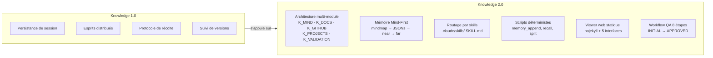
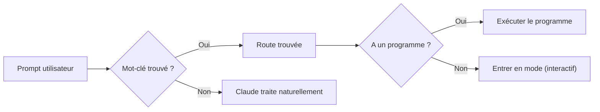
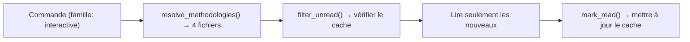
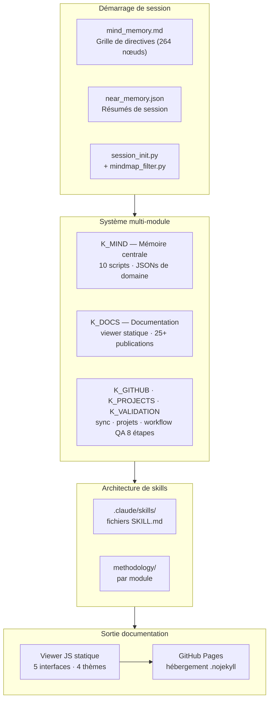

# Knowledge 2.0 — Cadre d'Intelligence Interactive
{: #pub-title}

**Table des matières**

- [Auteurs](#auteurs)
- [Résumé](#résumé)
- [Nouveautés 2.0](#nouveautés-20-)
- [L'évolution : v1 → v2](#lévolution--v1--v2)
- [1. Le questionnaire de session](#1-le-questionnaire-de-session)
- [2. Le routeur de commandes](#2-le-routeur-de-commandes)
- [3. L'architecture de skills](#3-larchitecture-de-skills)
- [4. Résolution de méthodologie](#4-résolution-de-méthodologie)
- [5. Le moteur de déduplication](#5-le-moteur-de-déduplication)
- [6. Modes interactifs](#6-modes-interactifs)
- [7. Architecture complète](#7-architecture-complète)
- [Références legacy — Knowledge 1.0](#références-legacy--knowledge-10-)

## Auteurs

**Martin Paquet** — Analyste programmeur en sécurité réseau, administrateur de sécurité réseau et système, concepteur et programmeur de logiciels embarqués. Architecte de Knowledge. Concepteur de la méthodologie de persistance, du réseau d'intelligence distribuée et de l'architecture auto-réparatrice versionnée. L'intuition derrière Knowledge 2.0 : l'initialisation de session est aussi critique que la persistance — un protocole d'intégration structuré remplace le prompting non structuré.

**Claude** (Anthropic, Opus 4.6) — Partenaire de développement IA. Co-architecte du Cadre d'Intelligence Interactive. Implémentation du questionnaire de session, routeur de commandes, registre de skills, résolution de méthodologie et moteur de déduplication. Cette publication documente un système construit collaborativement à travers 100+ sessions.

---

## Résumé

Knowledge 1.0 a résolu le problème de l'**absence d'état** — les sessions IA qui oublient tout entre les conversations.

**Knowledge 2.0** résout le problème suivant : le **chaos d'initialisation de session**. Même avec une mémoire persistante, chaque session commence par un prompt non structuré. Knowledge 2.0 introduit un questionnaire structuré, un routage déterministe des commandes, des skills composables et une déduplication de méthodologie — pour que la session *comprenne ce qu'elle va faire* avant de le faire.

| Fonctionnalité | Description |
|----------------|-------------|
| **Questionnaire de session** | Grille d'intégration structurée (A1–E3) qui valide le contexte, extrait l'intention, confirme la portée. État persisté sur disque |
| **Routeur de commandes** | `routes.json` mappe l'intention aux programmes de façon déterministe — pas d'interprétation IA |
| **Architecture de skills** | `SkillRegistry` avec unités composables — autonomes et testables |
| **Résolution de méthodologie** | Chargement par famille — les commandes déclarent une famille, obtiennent tous les fichiers automatiquement |
| **Moteur de déduplication** | Suivi au niveau session — réduction de 66% du chargement pour les sessions multi-commandes |
| **Modes interactifs** | Trois sessions spécialisées : Conception, Documentation, Diagnostic |
| **Persistance de checkpoint** | Survit à la compaction de contexte et aux crashes — récupération d'état automatique |
| **Validation du travail** | 5 blocs : Demande (A), Qualité (B), Intégrité (C), Documentation (D), Approbation (E) |

---

## Nouveautés 2.0 <span class="badge badge-new">NOUVEAU</span>

<div class="feature-grid">
<div class="feature-card">
<h4>Questionnaire de session</h4>
<p>Grille d'intégration structurée (A1–E3) qui valide le contexte, extrait l'intention et confirme la portée du projet avant le début du travail. L'état persiste sur disque.</p>
</div>
<div class="feature-card">
<h4>Routeur de commandes</h4>
<p><code>routes.json</code> mappe l'intention de l'utilisateur aux programmes de façon déterministe. Pas d'interprétation IA — les mots-clés déclenchent les programmes exacts.</p>
</div>
<div class="feature-card">
<h4>Architecture de skills</h4>
<p><code>SkillRegistry</code> avec unités composables : <code>LireChoixSkill</code>, <code>FonctionSkill</code>, <code>ProgrammeSkill</code>. Autonomes et testables.</p>
</div>
<div class="feature-card">
<h4>Résolution de méthodologie</h4>
<p><code>resolve_methodologies(family)</code> scanne par préfixe. Les commandes déclarent une famille, obtiennent tous les fichiers correspondants. 6 familles, 30 fichiers.</p>
</div>
<div class="feature-card">
<h4>Moteur de déduplication</h4>
<p>Suivi au niveau de la session : la 2e commande de la même famille lit <strong>0 fichiers</strong> au lieu de 9. Réduction de 66% dans les sessions multi-commandes.</p>
</div>
<div class="feature-card">
<h4>Modes interactifs</h4>
<p>Trois sessions spécialisées : <strong>Conception</strong> (design), <strong>Documentation</strong> (contenu), <strong>Diagnostic</strong> (débogage). Chacune avec son propre patron de phases.</p>
</div>
</div>

## L'évolution : v1 → v2



<table class="comparison-table">
<thead>
<tr><th>Dimension</th><th>v1 <span class="badge badge-v1">1.0</span></th><th>v2 <span class="badge badge-new">2.0</span></th></tr>
</thead>
<tbody>
<tr><td><strong>Démarrage de session</strong></td><td class="v1">Prompt non structuré — l'IA devine l'intention</td><td class="v2">Le questionnaire valide le contexte → route vers le bon mode</td></tr>
<tr><td><strong>Exécution de commandes</strong></td><td class="v1">L'IA interprète le langage naturel</td><td class="v2"><code>routes.json</code> mappe aux programmes — déterministe</td></tr>
<tr><td><strong>Chargement de méthodologie</strong></td><td class="v1">Tout lire au démarrage</td><td class="v2">Résolution par famille — charger uniquement le nécessaire</td></tr>
<tr><td><strong>Commandes répétées</strong></td><td class="v1">Relire tous les fichiers de méthodologie</td><td class="v2">Déduplication — 0 fichiers à la 2e invocation</td></tr>
<tr><td><strong>Modes de travail</strong></td><td class="v1">Un seul mode (travail)</td><td class="v2">Trois modes interactifs + mode commande</td></tr>
<tr><td><strong>Validation</strong></td><td class="v1">Manuelle</td><td class="v2">Grille de knowledge (A1-D3)</td></tr>
<tr><td><strong>Récupération après crash</strong></td><td class="v1">Notes + historique git</td><td class="v2">Fichiers de checkpoint + requêtes d'état</td></tr>
</tbody>
</table>

## 1. Le questionnaire de session

Chaque session débute par une grille de validation structurée — remplaçant les devinettes non structurées par un protocole déterministe.

| Knowledge | ID | Question | Type d'action |
|-----------|----|----------|---------------|
| **A — Validation de la demande** | A1 | Confirmer le titre | fonction |
| | A2 | Confirmer la description | programme |
| | A3 | Confirmer le projet | fonction |
| | A4 | Exécuter la demande | executer_demande |
| **B — Qualité du travail** | B1 | Tests et build | programme |
| | B2 | Revue de code | fonction |
| | B3 | Métriques | programme |
| | B4 | Tous | tous |
| **C — Intégrité de session** | C1 | Commits progressifs | fonction |
| | C2 | Cache à jour | programme |
| | C3 | Issue commentée | fonction |
| | C4 | Tous | tous |
| **D — Documentation** | D1 | Documentation système | fonction |
| | D2 | Documentation utilisateur | fonction |
| | D3 | Tous | tous |
| **E — Approbation** | E1 | Résumé pré-sauvegarde | fonction |
| | E2 | Sauvegarde finale | programme |
| | E3 | Tous | tous |

> **Persistance** : L'état est sauvegardé dans `.claude/knowledge_resultats.json`. Survit à la compaction et aux crashes. Après récupération : `en_cours: true` → reprendre, `demande_executee: true` → ne pas ré-exécuter.

## 2. Le routeur de commandes

Les commandes sont **routées**, pas interprétées. `routes.json` mappe les mots-clés aux programmes.



| Route | Syntaxe | Programme | Type |
|-------|---------|-----------|------|
| `project-create` | `project create [titre]` | `scripts/project_create.py` | Commande |
| `interactive` | `interactif` | — | Changement de mode |

## 3. L'architecture de skills

Le knowledge est décomposé en **skills** composables — chacun une unité autonome enregistrée dans `SkillRegistry`.

| Skill | Rôle | Utilisé par |
|-------|------|-------------|
| `LireChoixSkill` | Lire le choix utilisateur (1-N) | Navigation du questionnaire |
| `FonctionSkill` | Exécuter une fonction interne | A1, A3, B2, C1, C3 |
| `ProgrammeSkill` | Exécuter un programme externe | A2, B1, B3, C2 |

```
KnowledgeSkill → registre.executer("lire_choix") → LireChoixSkill
               → registre.executer("fonction")   → FonctionSkill
               → registre.executer("programme")  → ProgrammeSkill
```

## 4. Résolution de méthodologie

Les commandes déclarent une **famille**, le système résout automatiquement tous les fichiers de méthodologie correspondants.

| Préfixe de famille | Fichiers | Utilisé par |
|--------------------|----------|-------------|
| `documentation` | 6 fichiers | pub new, pub check, docs check |
| `interactive` | 4 fichiers | interactif, live, normalize |
| `system` | 5 fichiers | Commandes d'infrastructure |
| `satellite` | 2 fichiers | bootstrap, commandes satellite |
| `project` | 2 fichiers | project create, project manage |
| `compilation` | 2 fichiers | Métriques et suivi du temps |

## 5. Le moteur de déduplication



| Scénario | Sans dédup | Avec dédup |
|----------|-----------|------------|
| 1re commande interactive | 7 fichiers lus | 7 fichiers lus |
| 2e commande interactive | 7 fichiers lus | **0 fichiers lus** |
| 3e commande interactive | 7 fichiers lus | **0 fichiers lus** |
| **Total pour 3 commandes** | **21 lectures de fichiers** | **7 lectures de fichiers** |

> **Réduction de 66%** du chargement de méthodologie pour les sessions multi-commandes.

## 6. Modes interactifs

<div class="feature-grid">
<div class="feature-card">
<h4>Conception</h4>
<p>Concevoir de nouvelles capacités, explorer des architectures, prototyper des fonctionnalités. Phases : Ancrer → Idéer → Explorer → Proposer → Prototyper → Valider → Itérer → Formaliser → Livrer.</p>
</div>
<div class="feature-card">
<h4>Documentation</h4>
<p>Créer des publications, méthodologies, documentation système. Phases : Évaluer → Structurer → Rédiger → Réviser → Finaliser.</p>
</div>
<div class="feature-card">
<h4>Diagnostic</h4>
<p>Débogage en direct, analyse en temps réel, investigation forensique. Phases : Observer → Hypothéser → Tester → Corriger → Vérifier.</p>
</div>
</div>

## 7. Architecture complète



---

<div class="annex-section" markdown="1">

## Références legacy — Knowledge 1.0 <span class="badge badge-legacy">v1</span>

> **[Knowledge v1 — Intelligence d'ingénierie IA auto-évolutive](https://github.com/packetqc/knowledge/tree/main/knowledge/data/publications/knowledge-system/v1)** — La publication maître de 825 lignes. Persistance de session, esprits distribués, qualités fondamentales, architecture mémoire, réseau satellite et 26 versions d'évolution en 5 jours.

### Publications enfants

| # | Publication | Liens |
|---|-------------|-------|
| 0 | Système de Knowledge (Maître) | [Source](https://github.com/packetqc/knowledge/tree/main/knowledge/data/publications/knowledge-system/v1) · [Web]({{ site.baseurl }}/publications/knowledge-system/) |
| 1 | Pipeline de stockage MPLIB | [Source](https://github.com/packetqc/knowledge/tree/main/knowledge/data/publications/mplib-storage-pipeline/v1) · [Web]({{ site.baseurl }}/publications/mplib-storage-pipeline/) |
| 2 | Analyse de session en direct | [Source](https://github.com/packetqc/knowledge/tree/main/knowledge/data/publications/live-session-analysis/v1) · [Web]({{ site.baseurl }}/publications/live-session-analysis/) |
| 3 | Persistance de session IA | [Source](https://github.com/packetqc/knowledge/tree/main/knowledge/data/publications/ai-session-persistence/v1) · [Web]({{ site.baseurl }}/publications/ai-session-persistence/) |
| 4 | Esprits distribués | [Source](https://github.com/packetqc/knowledge/tree/main/knowledge/data/publications/distributed-minds/v1) · [Web]({{ site.baseurl }}/publications/distributed-minds/) |
| 4a | Tableau de bord Knowledge | [Source](https://github.com/packetqc/knowledge/tree/main/knowledge/data/publications/distributed-knowledge-dashboard/v1) · [Web]({{ site.baseurl }}/publications/distributed-knowledge-dashboard/) |
| 5 | Webcards & Partage social | [Source](https://github.com/packetqc/knowledge/tree/main/knowledge/data/publications/webcards-social-sharing/v1) · [Web]({{ site.baseurl }}/publications/webcards-social-sharing/) |
| 6 | Normalize | [Source](https://github.com/packetqc/knowledge/tree/main/knowledge/data/publications/normalize-structure-concordance/v1) · [Web]({{ site.baseurl }}/publications/normalize-structure-concordance/) |
| 7 | Protocole de récolte | [Source](https://github.com/packetqc/knowledge/tree/main/knowledge/data/publications/harvest-protocol/v1) · [Web]({{ site.baseurl }}/publications/harvest-protocol/) |
| 8 | Gestion de session | [Source](https://github.com/packetqc/knowledge/tree/main/knowledge/data/publications/session-management/v1) · [Web]({{ site.baseurl }}/publications/session-management/) |
| 9 | Sécurité par conception | [Source](https://github.com/packetqc/knowledge/tree/main/knowledge/data/publications/security-by-design/v1) · [Web]({{ site.baseurl }}/publications/security-by-design/) |
| 10 | Réseau de Knowledge en direct | [Source](https://github.com/packetqc/knowledge/tree/main/knowledge/data/publications/live-knowledge-network/v1) · [Web]({{ site.baseurl }}/publications/live-knowledge-network/) |

### Sections clés v1

| Sujet | Ce que ça couvre |
|-------|-----------------|
| [Qualités fondamentales](https://github.com/packetqc/knowledge/tree/main/knowledge/data/publications/knowledge-system/v1#core-qualities) | 11 principes — autonome, concordant, concis, interactif, évolutif, distribué, persistant, récursif, sécurisé, résilient |
| [Évolution du Knowledge](https://github.com/packetqc/knowledge/tree/main/knowledge/data/publications/knowledge-system/v1#knowledge-evolution) | v1→v26 — 26 versions en 5 jours |
| [Architecture mémoire](https://github.com/packetqc/knowledge/tree/main/knowledge/data/publications/knowledge-system/v1#memory-architecture) | Auto-memory vs Knowledge, survie à la compaction, mécaniques de fenêtre de contexte |
| [Réseau satellite](https://github.com/packetqc/knowledge/tree/main/knowledge/data/publications/knowledge-system/v1#satellite-harvest--what-the-network-produced) | 6 satellites, résultats de récolte, 12 candidats à la promotion |

> **Note** : Toutes les publications sont désormais unifiées dans `packetqc/knowledge`. Knowledge 2.0 a servi de test d'intégration pour cette migration.

</div>
