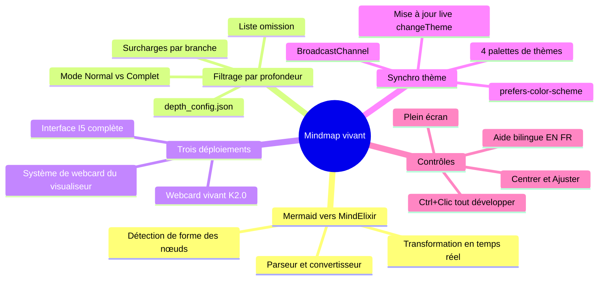

# Mindmap vivant — Graphe de connaissances interactif
{: #pub-title}

> **Parent** : [Publication #24 — Résumé]({{ '/fr/publications/live-mindmap/' | relative_url }})

---

## Résumé

Le système mémoire K_MIND stocke son graphe de connaissances sous forme de mindmap mermaid dans `mind_memory.md`. Mermaid le rend en SVG statique — pas d'expansion/réduction, pas de zoom, pas de contrôle de profondeur. Le Mindmap vivant le transforme en graphe de connaissances MindElixir interactif à l'exécution.

Un convertisseur JavaScript parse la syntaxe mermaid et construit un arbre compatible MindElixir. Le système de filtrage par profondeur — un portage de `mindmap_filter.py` — applique les règles de `depth_config.json` dans le navigateur, assurant la cohérence entre les vues CLI et web. Trois points de déploiement servent différents contextes : interface I5 plein écran avec barre d'outils, webcard vivant K2.0, et webcard du visualiseur pour toute page avec `live_webcard: mindmap`.

La synchronisation de thème fait correspondre les quatre thèmes CSS du visualiseur aux palettes MindElixir — les mises à jour se propagent instantanément via `changeTheme()`, sans ré-initialisation. Le système récupère directement depuis l'API brute de GitHub, reflétant toujours le dernier état commité.



---

<div class="story-section">

## 1. Problème

Le graphe de connaissances K_MIND vit dans `mind_memory.md` sous forme de mindmap mermaid. Mermaid le rend en SVG statique — utile pour la documentation, mais limité :

| Limitation | Impact |
|---|---|
| Pas d'expansion/réduction | Tous les nœuds visibles s'affichent en même temps — surcharge visuelle pour les arbres profonds |
| Pas de zoom/panoramique | Le diagramme s'adapte à la page, pas de navigation indépendante |
| Pas de contrôle de profondeur | Tous les nœuds s'affichent ou aucun — pas de filtrage |
| Pas de réactivité thématique | Les thèmes Mermaid sont déconnectés des 4 thèmes CSS du visualiseur |
| Pas d'interaction par glissement | Les nœuds sont figés dans la disposition radiale automatique de Mermaid |

Le script de filtrage par profondeur (`mindmap_filter.py`) contrôle la sortie CLI, mais n'avait pas d'équivalent navigateur.

## 2. Convertisseur Mermaid vers MindElixir

La fonction `mermaidToMindElixir()` parse la syntaxe mindmap mermaid à l'exécution :

```
Entrée :  mindmap\n  root((knowledge))\n    session\n      near memory
Sortie :  { nodeData: { topic: 'knowledge', id: 'root', children: [...] }, direction: 2 }
```

**Étapes du parseur :**
1. Supprimer les lignes d'en-tête (`%%{init}`, `mindmap`, `root((...))`)
2. Calculer le niveau d'indentation (2 espaces par niveau)
3. Supprimer les décorateurs de nœuds mermaid (`((...))`, `(...)`, `[...]`, `{...}`)
4. Construire un arbre récursif avec les champs `topic`, `id` et `children`

## 3. Filtrage par profondeur

Portage JavaScript de `mindmap_filter.py` appliquant `depth_config.json` :

| Champ de config | Fonction | Défaut |
|---|---|---|
| `default_depth` | Profondeur maximale pour toutes les branches | 3 |
| `omit` | Branches cachées en mode Normal | architecture, constraints |
| `overrides` | Surcharges de profondeur par branche | session/near memory: 4 |

**Règle de correspondance la plus longue** : `session/near memory` à profondeur 4 a priorité sur `session` à profondeur 3.

**Mode Normal** : Applique la config de profondeur — omet architecture/constraints, limite la profondeur par branche.

**Mode Complet** : Affiche tous les nœuds à profondeur maximale, sans omissions.

Après filtrage, `collapseDeep()` met `node.expanded = false` au-delà de la profondeur par défaut — l'arbre démarre réduit mais peut être développé interactivement.

## 4. Trois points de déploiement

### I5 — Interface plein écran

| Contrôle | Fonction |
|---|---|
| Bascule Normal/Complet | Basculer entre les vues filtrée et complète |
| Sélecteur de thème | Cayman, Midnight, Daltonism Clair/Foncé, Auto |
| Recharger | Re-récupérer depuis l'API brute GitHub |
| Centrer | Centrer la carte sans mise à l'échelle |
| Ajuster | Mettre à l'échelle la carte pour remplir la fenêtre |
| Plein écran | Basculer le plein écran du navigateur |
| `Ctrl+Clic` sur `+` | Développer tous les descendants d'un coup |

- Panneau d'aide bilingue avec raccourcis clavier (EN/FR)
- La version FR code en dur `LANG='fr'` (l'iframe srcdoc a `about:srcdoc` comme pathname)
- Récupère depuis `https://raw.githubusercontent.com/packetqc/K_DOCS/main/Knowledge/K_MIND/`

### Webcard vivant K2.0

- Remplace le GIF d'image OG statique en haut de page
- Hauteur compacte de 300px, `scaleFit()` au chargement
- Même filtrage par profondeur et synchronisation de thème
- `live_webcard: mindmap` dans le front matter déclenche le rendu
- Instance stockée dans `window._webcardMind` pour les mises à jour de thème en direct

### Système de webcard du visualiseur

- Toute page avec `live_webcard: mindmap` obtient un en-tête mindmap vivant
- `buildLiveMindmapWebcard()` crée une instance MindElixir autonome
- Repli vers le GIF `og_image` statique si MindElixir échoue au chargement

## 5. Synchronisation de thème

Quatre palettes MindElixir correspondent aux thèmes CSS du visualiseur :

| Thème du visualiseur | Arrière-plan | Nœud racine | Palette |
|---|---|---|---|
| Daltonism Clair | `#faf6f1` | `#0055b3` | Chaud, accessible |
| Daltonism Foncé | `#1a1a2e` | `#2a4a7a` | Chaud foncé |
| Cayman | `#eff6ff` | `#1d4ed8` | Bleu froid |
| Midnight | `#0f172a` | `#1e40af` | Froid foncé |

**Chemins de propagation :**
1. Même document → appel direct `changeTheme()` sur l'instance MindElixir
2. Iframes de même origine → `BroadcastChannel('kdocs-theme-sync')`
3. Iframes srcdoc → propagation récursive de l'attribut `data-theme`

## 6. Les chiffres

| Métrique | Valeur |
|---|---|
| Version MindElixir | 5.9.3 |
| Points de déploiement | 3 (I5, webcard K2.0, webcard visualiseur) |
| Palettes de thèmes | 4 |
| Champs de config de profondeur | 3 (default_depth, omit, overrides) |
| Étape de build | Aucune — conversion à l'exécution |
| Source de données | API brute GitHub (toujours le dernier commit) |
| Langues | 2 (EN, FR) |

</div>

---

*Martin Paquet & Claude (Opus 4.6) | [packetqc/K_DOCS](https://github.com/packetqc/K_DOCS)*
