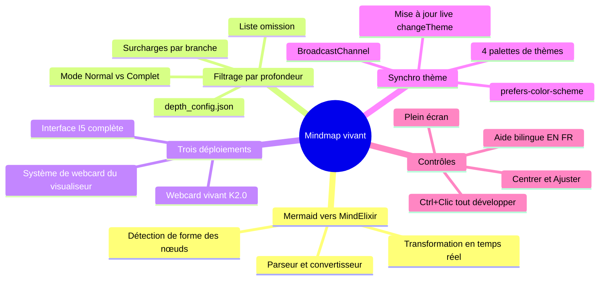

## Résumé

Le système mémoire K_MIND stocke son graphe de connaissances sous forme de mindmap mermaid dans `mind_memory.md`. Mermaid le rend en SVG statique — pas d'expansion/réduction, pas de zoom, pas de contrôle de profondeur. Le Mindmap vivant le transforme en graphe de connaissances MindElixir interactif à l'exécution.

Un convertisseur JavaScript parse la syntaxe mermaid et construit un arbre compatible MindElixir. Le système de filtrage par profondeur — un portage de `mindmap_filter.py` — applique les règles de `depth_config.json` dans le navigateur, assurant la cohérence entre les vues CLI et web. Trois points de déploiement servent différents contextes : interface I5 plein écran avec barre d'outils, webcard vivant K2.0, et webcard du visualiseur pour toute page avec `live_webcard: mindmap`.

La synchronisation de thème fait correspondre les quatre thèmes CSS du visualiseur aux palettes MindElixir — les mises à jour se propagent instantanément via `changeTheme()`, sans ré-initialisation. Le système récupère directement depuis l'API brute de GitHub, reflétant toujours le dernier état commité.

### Fonctionnalités clés

| Fonctionnalité | Description |
|---------|-------------|
| **Convertisseur Mermaid** | Parse la syntaxe mindmap mermaid → arbre MindElixir à l'exécution |
| **Filtrage par profondeur** | Portage JS de `mindmap_filter.py` avec `depth_config.json` |
| **3 points de déploiement** | Interface I5, webcard K2.0, système de webcard du visualiseur |
| **Synchro 4 thèmes** | Daltonism Clair/Foncé, Cayman, Midnight — `changeTheme()` instantané |
| **Contrôles interactifs** | Expansion/réduction, zoom/panoramique, Ctrl+Clic tout développer |
| **Bilingue** | Libellés EN/FR dans la barre d'outils, panneau d'aide, messages d'état |

---

## En savoir plus

- **[Documentation complète]({{ '/fr/publications/live-mindmap/full/' | relative_url }})** — Publication complète avec détails du convertisseur, filtrage par profondeur et architecture des thèmes
- **[Success Story #25]({{ '/fr/publications/success-stories/story-25/' | relative_url }})** — L'histoire derrière cette réalisation

---

*Martin Paquet & Claude (Opus 4.6) | [packetqc/K_DOCS](https://github.com/packetqc/K_DOCS)*
