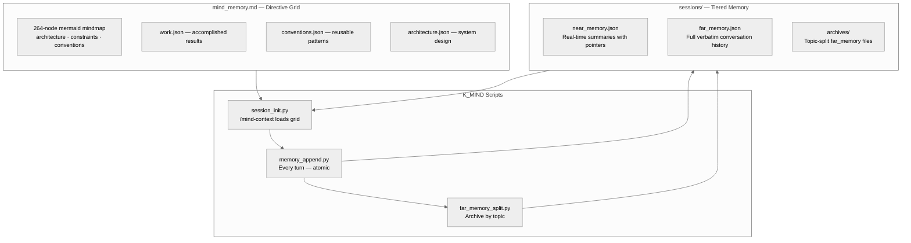

# AI Session Persistence — Complete Documentation
{: #pub-title}

**Contents**

| | |
|---|---|
| [Authors](#authors) | Publication authors |
| [Abstract](#abstract) | Session persistence methodology overview |
| [The Problem: Stateless AI in a Stateful World](#the-problem-stateless-ai-in-a-stateful-world) | What is lost between sessions and its impact |
| [The Solution: Three-Component Persistence](#the-solution-three-component-persistence) | CLAUDE.md + notes/ + lifecycle architecture |
| &nbsp;&nbsp;[Component 1: CLAUDE.md — Project Identity](#component-1-claudemd--project-identity) | Declarative project constitution |
| &nbsp;&nbsp;[Component 2: notes/ — Session Memory](#component-2-notes--session-memory) | Per-session event journal |
| &nbsp;&nbsp;[Component 3: Lifecycle Protocol](#component-3-lifecycle-protocol) | Init, work, and save phases |
| [The RTOS Analogy](#the-rtos-analogy) | Sessions as threads, notes as shared memory |
| [Measured Results](#measured-results) | Quantified improvements from persistence |
| &nbsp;&nbsp;[Context Recovery Time](#context-recovery-time) | 30 seconds vs 15 minutes comparison |
| &nbsp;&nbsp;[Knowledge Accumulated](#knowledge-accumulated) | Items persisted across 10+ sessions |
| &nbsp;&nbsp;[Session Efficiency](#session-efficiency) | Accuracy and productivity metrics |
| [Portability](#portability) | Quick setup for any new repository |
| [Design Principles](#design-principles) | Why files over databases, why two components |
| [Limitations and Future Work](#limitations-and-future-work) | Context window, search, and concurrency |
| [Related Publications](#related-publications) | Sibling publications in the knowledge system |

## Authors

**Martin Paquet** — Network security analyst programmer, network and system security administrator, and embedded software designer and programmer. Specializing in RTOS architectures, hardware security, and high-throughput data pipelines on ARM Cortex-M platforms. Architect of the MPLIB module library and creator of the session persistence methodology documented here. Martin's insight was that AI coding sessions are analogous to RTOS threads — they need isolated context, shared memory regions, and explicit lifecycle management. Based in Quebec, Canada.

**Claude** (Anthropic, Opus 4.6) — AI coding assistant operating within the Claude Code CLI. In this collaboration, Claude is both a practitioner and a subject of the persistence methodology — it reads the notes to recover context, writes notes to preserve it, and follows CLAUDE.md instructions that define how to do both.

---

## Abstract

AI coding assistants operate in stateless sessions. Each new conversation starts from zero — no memory of previous work, no context about decisions made yesterday, no awareness of bugs fixed last week. For sustained engineering projects spanning days or weeks, it is a critical limitation.

This publication documents a **session persistence methodology** that gives AI coding assistants durable cross-session memory. The approach uses three components: a **project instruction file** (`CLAUDE.md`) that encodes project identity, conventions, and operational procedures; a **session notes directory** (`notes/`) that accumulates decisions, discoveries, and status across sessions; and a **lifecycle protocol** (init → work → save) that ensures context is never lost between sessions.

The methodology was developed and validated during the construction of a high-throughput SQLite log ingestion pipeline on an STM32N6570-DK (Cortex-M55 @ 800 MHz). Over 10+ sessions spanning two days, the AI maintained continuous awareness of project state, architectural decisions, bug history, and collaborator preferences — without any external memory system, database, or API. Just files in a Git repository.

---

## The Problem: Stateless AI in a Stateful World

Software engineering is inherently stateful. Every decision builds on prior decisions. Every bug fix depends on understanding the bug's history.

AI coding assistants lose all of this between sessions:

| What is lost | Impact |
|--------------|--------|
| **Architectural decisions** | AI re-proposes approaches that were already rejected |
| **Bug history** | AI doesn't know which bugs were already fixed |
| **Code conventions** | AI inconsistently applies project-specific patterns |
| **Collaborator preferences** | AI forgets communication style, language, working patterns |
| **Module integration state** | AI doesn't know which modules are in dev vs. production |
| **In-progress work** | AI starts from scratch on partially completed tasks |

The result: the engineer spends the first 10–15 minutes of every session re-explaining context. Over 10 sessions, that's 2+ hours of redundant onboarding.

---

## The Solution: Three-Component Persistence



### Fork & Clone Safety

If you fork or clone a repository using this persistence methodology, the system is **owner-scoped** and environmentally isolated:

| Component | Safety |
|-----------|--------|
| `CLAUDE.md` | Contains methodology and project identity — no credentials, tokens, or secrets |
| `notes/` | Contains session memory — per-user, starts blank for every new owner |
| Lifecycle protocol | `wakeup` → work → `save` operates within the forker's own environment — push access scoped to their own branches only |
| Knowledge repo references | `packetqc/knowledge` points to public methodology — a forker reads it (read-only) or replaces the namespace with their own |

The three-component architecture (CLAUDE.md, notes/, lifecycle) is a reusable pattern. No data from the original owner leaks into a fork beyond intentionally public methodology.

### Component 1: CLAUDE.md — Project Identity

The `CLAUDE.md` file is the **constitution** of the project. It encodes everything that is true across all sessions:

| Section | Purpose | Example |
|---------|---------|---------|
| **Project Identity** | What this project is | "High-throughput SQLite log ingestion on Cortex-M55" |
| **Collaborator** | Who the engineer is | Name, contact, language, working style |
| **Methodology** | How we work together | Module-by-module integration, printf diagnostics |
| **Architecture** | Technical foundation | 5-stage pipeline, WAL mode, PSRAM buffers |
| **Code Conventions** | How code is written | C/C++ embedded, no STL, packed structs |
| **Quick Commands** | Shorthand triggers | `wakeup`, `save`, `I'm live`, `vanilla` |
| **Rules** | Hard constraints | Don't break module code, keep docs in English |

**Key design principle**: `CLAUDE.md` is **declarative, not narrative**. It states facts and rules, not stories. The narrative lives in `notes/`.

### Component 2: notes/ — Session Memory

The `notes/` directory is the **working memory** of the project. Each file captures what happened in a specific session:

```
notes/
  session-2026-02-15.md    # Day 1: setup, methodology
  session-2026-02-16.md    # Day 2: 10 sessions — encryption, adaptive flush, config
  session-2026-02-17.md    # Day 3: ...
```

**What gets recorded**:

| Category | Examples |
|----------|---------|
| Architectural decisions | Rationale for each choice |
| Bugs found | Symptom, root cause, fix, verification |
| Features implemented | Design, code locations, technical notes |
| Memory map changes | MPU region adjustments |
| UART trace results | Analysis outcomes and timing data |
| Commit history | Hashes and associated changes |

**What doesn't get recorded**:

| Excluded | Reason |
|----------|--------|
| Conversational chatter | No lasting value |
| Obvious facts already in CLAUDE.md | Avoids duplication |
| Duplicate information from previous sessions | Keeps notes/ lean |

### Component 3: Lifecycle Protocol

#### Init (`wakeup`)

| Step | Action | Result |
|------|--------|--------|
| 1 | Read every file in `notes/` | Full history recovered |
| 2 | Read PLAN.md and changelog.txt | Roadmap + recent changes |
| 3 | Run `git log --oneline -20` | Recent commits visible |
| 4 | Run `git branch -a` | Active branches identified |
| 5 | Summarize to engineer | Last session, current state, next steps |
| 6 | Print Quick Commands table | Available actions visible |
| 7 | Ask focus question | "What do you want to focus on today?" |

The engineer types `wakeup` and within 30 seconds has a fully context-aware AI partner.

#### Work (continuous)

During the session, notable events are appended to the current session file: decisions made, bugs found, modules integrated, status changes.

#### Save (`save`)

```
1. Write/update notes/session-YYYY-MM-DD.md with final session state
2. git add notes/
3. git commit -m "docs: save session notes — [date]"
4. git push
```

---

## The RTOS Analogy

The developer's core insight was that AI coding sessions are structurally similar to **RTOS threads**:

| RTOS Concept | AI Session Equivalent |
|--------------|----------------------|
| Thread | Single Claude Code session |
| Thread Control Block (TCB) | Session context (conversation history) |
| Shared memory (PSRAM) | `notes/` directory (persisted to Git) |
| Thread init | `wakeup` command (read notes, recover context) |
| Thread cleanup | `save` command (write notes, commit, push) |
| Mutex / semaphore | Git commit/push (serialized access to shared state) |
| Priority inheritance | Most recent session notes take precedence |

**Extending the analogy to branches**: Git branches within a repo are also analogous to RTOS threads — they don't always fork from the same parent. Each branch is an isolated execution context with its own work.

This isn't just a metaphor — it's a **design pattern**. The same architectural thinking used for bare-metal RTOS systems, applied to the problem of AI session management.

---

## Measured Results

### Context Recovery Time

| Method | Time to full context | Quality |
|--------|---------------------|---------|
| No persistence (re-explain manually) | 10–15 minutes | Partial, depends on memory |
| Notes only (no CLAUDE.md) | 3–5 minutes | Good, but missing conventions |
| **Full methodology (CLAUDE.md + notes/)** | **~30 seconds** | **Complete** |

### Knowledge Accumulated

| Category | Items Persisted |
|----------|----------------|
| Architectural decisions | 15+ |
| Bugs found and fixed | 8+ |
| Features implemented | 12+ |
| Code conventions learned | 10+ |
| Collaborator preferences | 5+ |

### Session Efficiency

| Metric | Without Persistence | With Persistence |
|--------|-------------------|-----------------|
| Time to first useful action | 10–15 minutes | < 1 minute |
| Context accuracy at session start | ~60% | ~95% |
| Decisions re-debated | Frequent | Rare |
| Bugs re-investigated | Occasional | Never |

---

## Portability

The methodology is not project-specific. Quick setup for any new repo:

| Step | Action |
|------|--------|
| 1 | Copy the `CLAUDE.md` skeleton (adapted for the project) |
| 2 | `mkdir notes/` |
| 3 | Create `notes/session-YYYY-MM-DD.md` with initial context |
| 4 | Commit: `git add CLAUDE.md notes/ && git commit -m "docs: add AI session persistence"` |
| 5 | Done — next Claude Code session is fully initialized |

The [packetqc/knowledge](https://github.com/packetqc/knowledge) repository is the **portable brain** — it carries the universal methodology, commands, live tooling, and publications. Any project references it at wakeup and inherits everything.

---

## Design Principles

### Why Files, Not a Database

| Principle | Rationale |
|-----------|-----------|
| **Human-readable** | Engineer can review and edit notes directly |
| **Version-controlled** | Full history of all context changes via Git |
| **Portable** | Works on any machine with Git — no infrastructure |
| **AI-native** | Claude reads Markdown natively — no parsing needed |
| **Recoverable** | If a session crashes, notes from previous sessions are intact |
| **Auditable** | Every context change is a Git commit with a timestamp |

### Why CLAUDE.md + notes/ (Not Just One File)

| | CLAUDE.md | notes/ |
|---|---|---|
| **Content** | Facts, rules, conventions | Events, decisions, discoveries |
| **Changes** | Rarely | Every session |
| **Analogy** | Constitution | Journal |

---

## Limitations and Future Work

| Limitation | Impact | Mitigation |
|------------|--------|------------|
| Context window limits | Very long notes/ may exceed AI context | Summarize older sessions |
| No semantic search | AI reads all notes linearly | Structured headers enable fast scanning |
| Single-writer | Only one session at a time per repo | Git branch isolation if needed |
| Manual save trigger | Context lost if session ends abruptly | Encourage frequent `save` calls |

> "The methodology itself is always improving — the process of improving the process is part of the workflow."
> — Martin Paquet

---

## Related Publications

| # | Publication | Relationship |
|---|-------------|-------------|
| 0 | [Knowledge]({{ '/publications/knowledge-system/' | relative_url }}) | **Master publication** — this methodology is the foundation |
| 1 | [MPLIB Storage Pipeline]({{ '/publications/mplib-storage-pipeline/' | relative_url }}) | Project where persistence was first developed and proven |
| 2 | [Live Session Analysis]({{ '/publications/live-session-analysis/' | relative_url }}) | Tooling that depends on session continuity |
| 4 | [Distributed Minds]({{ '/publications/distributed-minds/' | relative_url }}) | Extension — persistence across multiple projects |
| 4a | [Knowledge Dashboard]({{ '/publications/distributed-knowledge-dashboard/' | relative_url }}) | Dashboard tracking session persistence across satellites |

---

*Authors: Martin Paquet & Claude (Anthropic, Opus 4.6)*
*Project: [packetqc/STM32N6570-DK_SQLITE](https://github.com/packetqc/STM32N6570-DK_SQLITE)*
*Knowledge: [packetqc/knowledge](https://github.com/packetqc/knowledge)*
