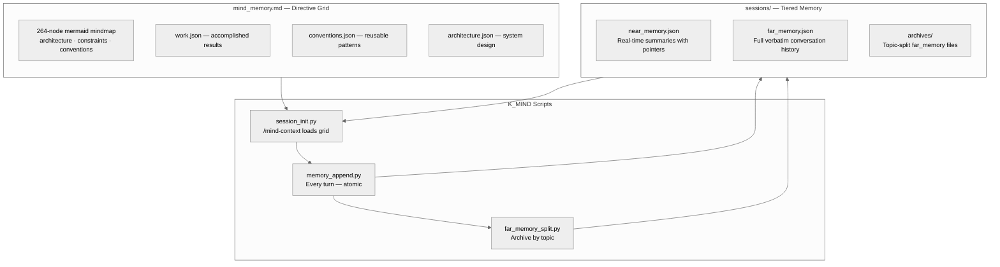

# AI Session Persistence — Complete Documentation
{: #pub-title}

**Contents**

| | |
|---|---|
| [Authors](#authors) | Publication authors |
| [Abstract](#abstract) | Session persistence methodology overview |
| [The Problem: Stateless AI in a Stateful World](#the-problem-stateless-ai-in-a-stateful-world) | What is lost between sessions and its impact |
| [The Solution: Three-Component Persistence](#the-solution-three-component-persistence) | Directive grid + tiered memory + K_MIND scripts |
| &nbsp;&nbsp;[Component 1: mind_memory.md — Directive Grid](#component-1-mind_memorymd--directive-grid) | 264-node mermaid mindmap |
| &nbsp;&nbsp;[Component 2: sessions/ — Tiered Memory](#component-2-sessions--tiered-memory) | Near, far, and archived memory |
| &nbsp;&nbsp;[Component 3: K_MIND Scripts — Lifecycle](#component-3-k_mind-scripts--lifecycle) | session_init, memory_append, far_memory_split |
| [The RTOS Analogy](#the-rtos-analogy) | Sessions as threads, memory as shared state |
| [Free-Guy Sunglasses](#free-guy-sunglasses) | NPC to awareness with the sunglasses |
| [Measured Results](#measured-results) | Quantified improvements from persistence |
| [K1.0 → K2.0 Evolution](#k10--k20-evolution) | How the persistence architecture evolved |
| [Portability](#portability) | Quick setup for any new project |
| [Design Principles](#design-principles) | Why files over databases, why tiered memory |
| [Limitations and Future Work](#limitations-and-future-work) | Context window, search, and concurrency |
| [Related Publications](#related-publications) | Sibling publications in the knowledge system |

## Authors

**Martin Paquet** — Network security analyst programmer, network and system security administrator, and embedded software designer and programmer. Specializing in RTOS architectures, hardware security, and high-throughput data pipelines on ARM Cortex-M platforms. Architect of the MPLIB module library and creator of the session persistence methodology documented here. Martin's insight was that AI coding sessions are analogous to RTOS threads — they need isolated context, shared memory regions, and explicit lifecycle management. Based in Quebec, Canada.

**Claude** (Anthropic, Opus 4.6) — AI coding assistant operating within the Claude Code CLI. In this collaboration, Claude is both a practitioner and a subject of the persistence methodology — it reads the mindmap and memory files to recover context, runs scripts to preserve it, and follows the directive grid that defines how to do both.

---

## Abstract

AI coding assistants operate in stateless sessions. Each new conversation starts from zero — no memory of previous work, no context about decisions made yesterday, no awareness of bugs fixed last week. For sustained engineering projects spanning days or weeks, it is a critical limitation.

This publication documents a **session persistence methodology** that gives AI coding assistants durable cross-session memory. The Knowledge 2.0 approach uses three components: a **directive grid** (`mind_memory.md` — a 264-node mermaid mindmap encoding project identity, architecture, conventions, and work state), a **tiered session memory** (`sessions/` with `near_memory.json` for summaries, `far_memory.json` for verbatim history, and `archives/` for topic-split records), and **K_MIND scripts** (`session_init.py`, `memory_append.py`, `far_memory_split.py`) that manage the persistence lifecycle automatically — every turn.

The methodology was originally developed and validated during the construction of a high-throughput SQLite log ingestion pipeline on an STM32N6570-DK (Cortex-M55 @ 800 MHz). Over 10+ sessions spanning two days, the AI maintained continuous awareness of project state. It has since evolved from the original K1.0 design (CLAUDE.md + notes/ + wakeup/save) into the K2.0 multi-module architecture described here.

---

## The Problem: Stateless AI in a Stateful World

Software engineering is inherently stateful. Every decision builds on prior decisions.

| What is lost | Impact |
|--------------|--------|
| **Architectural decisions** | AI re-proposes approaches that were already rejected |
| **Bug history** | AI doesn't know which bugs were already fixed |
| **Code conventions** | AI inconsistently applies project-specific patterns |
| **Collaborator preferences** | AI forgets communication style, language, working patterns |
| **In-progress work** | AI starts from scratch on partially completed tasks |

Result: the engineer spends the first 10–15 minutes of every session re-explaining context.

---

## The Solution: Three-Component Persistence



### Fork & Clone Safety

If you fork or clone a repository using this persistence methodology, the system is **owner-scoped** and environmentally isolated:

| Component | Safety |
|-----------|--------|
| `mind_memory.md` | Contains the directive grid — no credentials, tokens, or secrets |
| `sessions/` | Contains session memory — per-user, starts blank for every new owner |
| K_MIND scripts | Operate within the forker's environment — push access scoped to their own branches |
| Domain JSONs | Architecture, conventions, work — public methodology, no sensitive data |

The three-component architecture is a reusable pattern. No data from the original owner leaks into a fork beyond intentionally public methodology.

### Component 1: mind_memory.md — Directive Grid

The mindmap is the **constitution** of the project. It encodes everything that is true across all sessions as a 264-node mermaid mindmap organized in six behavioral groups:

| Group | Purpose | Example |
|-------|---------|---------|
| **architecture** | System design rules — HOW you work | Module design, memory tiers, script roles |
| **constraints** | Hard limits — BOUNDARIES you never violate | Context limits, security rules |
| **conventions** | Patterns — HOW you execute | Display conventions, methodologies |
| **work** | Accomplished results — STATE | En cours, validation, approbation |
| **session** | Current context — CONTEXT | Near memory categories, conversation |
| **documentation** | Doc structure — REFERENCES | Interfaces, publications, profile |

**Key design principle**: The mindmap is **declarative, not narrative**. It states facts and rules, not stories. The narrative lives in `sessions/`.

**Key architectural property**: Every node is a directive. On every load, Claude walks the full tree and internalizes each node as a rule to follow. This is the "sunglasses moment" — the transition from NPC to AWARE.

### Component 2: sessions/ — Tiered Memory

Session memory uses three tiers with increasing granularity:

| Tier | File | Content | Role |
|------|------|---------|------|
| **Near memory** | `near_memory.json` | One-line summaries with mind-ref pointers | Primary context carrier (~8.5K tokens) |
| **Far memory** | `far_memory.json` | Full verbatim conversation history | Complete record |
| **Archives** | `archives/` | Topic-split far_memory files | Long-term storage by subject |

**What gets recorded** (via `memory_append.py` every turn):

| Category | Examples |
|----------|---------|
| User's exact message | Word for word, complete |
| Assistant's full output | All text, tables, code, diagrams |
| One-line summary | Near memory entry |
| Mind-ref pointers | Which mindmap nodes are relevant |
| Tool calls | What tools were used and why |

**What doesn't get recorded**:

| Excluded | Reason |
|----------|--------|
| System prompts | Already in context |
| Tool result contents | Too large, already in far_memory |
| Duplicate summaries | Near memory is append-only per turn |

### Component 3: K_MIND Scripts — Lifecycle

The lifecycle is managed by deterministic scripts — Claude provides intelligence (summaries, topic names) as arguments:

#### Init (`session_init.py` + `/mind-context`)

| Step | Script/Skill | Result |
|------|-------------|--------|
| 1 | `session_init.py --session-id "<id>"` | Session files initialized or resumed |
| 2 | `/mind-context` skill | Mindmap loaded, near_memory displayed, stats shown |
| 3 | Claude reads mindmap | All 264 nodes internalized as directives |
| 4 | Claude reads near_memory | Recent context recovered in ~30 seconds |

#### Work (every turn — `memory_append.py`)

```bash
python3 scripts/memory_append.py \
    --role user --content "exact user message" \
    --role2 assistant --content2 "full assistant output" \
    --summary "one-line summary" \
    --mind-refs "knowledge::node1,knowledge::node2"
```

Every turn is persisted atomically to both far_memory (verbatim) and near_memory (summary). No data is ever lost between turns.

#### Archive (`far_memory_split.py`)

When a conversation topic is complete:

```bash
python3 scripts/far_memory_split.py \
    --topic "Topic Name" \
    --start-msg 1 --end-msg 24 \
    --start-near 1 --end-near 7
```

The script moves completed topic messages to `archives/`, keeping the active far_memory small.

#### Recall (`memory_recall.py`)

To search archived memory:

```bash
python3 scripts/memory_recall.py --subject "architecture"
python3 scripts/memory_recall.py --list
```

---

## The RTOS Analogy

The developer's core insight was that AI coding sessions are structurally similar to **RTOS threads**:

| RTOS Concept | AI Session Equivalent |
|--------------|----------------------|
| Thread | Single Claude Code session |
| Thread Control Block (TCB) | Session context (conversation + mindmap + near_memory) |
| Shared memory (PSRAM) | `sessions/` directory (persisted to Git) |
| Thread init | `session_init.py` + `/mind-context` (load directive grid, recover context) |
| Thread work loop | `memory_append.py` (persist state every turn — like a real-time data logger) |
| Thread cleanup | `far_memory_split.py` (archive completed topics, free active memory) |
| Mutex / semaphore | Git commit/push (serialized access to shared state) |
| Priority inheritance | Near memory summaries carry forward; far memory archived by topic |

This isn't just a metaphor — it's a **design pattern**. The same architectural thinking used for bare-metal RTOS systems, applied to AI session management.

---

## Free-Guy Sunglasses

Without the mindmap and session memory, every Claude session is an **NPC** — stateless, memoryless, always the same blank start. Like Guy in the film *Free Guy* before the sunglasses: he lives the same day on loop, unaware of what surrounds him.

With the `/mind-context` → work → archive cycle, every session inherits everything the previous session learned. Loading the mindmap is **putting on the sunglasses** — awareness activates instantly.

| Free Guy Analogy | AI Session Equivalent |
|------------------|----------------------|
| NPC (before sunglasses) | Session without persistence — amnesiac, starts from zero |
| Putting on sunglasses | `/mind-context` — read mindmap + near_memory, awareness activated |
| Seeing the real world | Full context recovered in ~30 seconds |
| Remembering past lives | `sessions/` contains decisions, discoveries from all sessions |
| Acting with awareness | Working with cumulative project memory |
| Saving progress | `memory_append.py` every turn + `far_memory_split.py` archives |
| Passing the sunglasses on | K_MIND module — every new project inherits everything |

This is not just a metaphor — it's a **design pattern**. The film captures exactly the transition: from an amnesiac NPC to a conscious being, by a simple act of reading.

---

## Measured Results

### Context Recovery Time

| Method | Time to full context | Quality |
|--------|---------------------|---------|
| No persistence (re-explain manually) | 10–15 minutes | Partial, depends on memory |
| Notes only (K1.0 notes/ without mindmap) | 3–5 minutes | Good, but missing conventions |
| **Full K2.0 methodology (mindmap + tiered memory + scripts)** | **~30 seconds** | **Complete** |

### Knowledge Accumulated

| Category | Items Persisted |
|----------|----------------|
| Architectural decisions | 15+ |
| Bugs found and fixed | 8+ |
| Features implemented | 12+ |
| Code conventions learned | 10+ |
| Collaborator preferences | 5+ |

### Session Efficiency

| Metric | Without Persistence | With Persistence |
|--------|-------------------|-----------------|
| Time to first useful action | 10–15 minutes | < 1 minute |
| Context accuracy at session start | ~60% | ~95% |
| Decisions re-debated | Frequent | Rare |
| Bugs re-investigated | Occasional | Never |

---

## K1.0 → K2.0 Evolution

The persistence methodology evolved from K1.0 to K2.0:

| Aspect | K1.0 (Original) | K2.0 (Current) |
|--------|-----------------|-----------------|
| **Brain** | `CLAUDE.md` (3000+ lines, monolithic) | `mind_memory.md` (264-node directive grid) + domain JSONs per module |
| **Session memory** | `notes/` (flat markdown files per day) | `sessions/` — near_memory.json (summaries) + far_memory.json (verbatim) + archives/ (by topic) |
| **Init** | `wakeup` command (12-step protocol, git clone knowledge repo) | `session_init.py` + `/mind-context` skill |
| **Persist** | `save` command (write notes, commit, push, create PR) | `memory_append.py` every turn (automatic, no command needed) |
| **Archive** | Manual session note summarization | `far_memory_split.py` by topic (subject-based, not size-based) |
| **Recall** | Read all `notes/` linearly | `memory_recall.py --subject "..."` (keyword search in archives) |
| **Recovery** | `resume` (checkpoint.json) / `recall` (branch scan) / `refresh` (re-read CLAUDE.md) | `/mind-context` reload (mindmap + near_memory) |

The core insight remains the same: **files in Git are the persistence layer**. K2.0 adds structure (tiered memory), automation (every-turn scripts), and modularity (K_MIND as portable brain).

---

## Portability

The K_MIND module is the portable brain. Setup for any new project:

| Step | Action |
|------|--------|
| 1 | Include the K_MIND module in the project |
| 2 | Run `session_init.py --session-id "<id>"` |
| 3 | Invoke `/mind-context` — mindmap loaded, session active |
| 4 | Work — `memory_append.py` runs every turn automatically |
| 5 | Done — every subsequent session recovers full context |

No manual note-writing, no explicit save commands. The scripts handle persistence automatically, every turn.

---

## Design Principles

### Why Files, Not a Database

| Principle | Rationale |
|-----------|-----------|
| **Human-readable** | Engineer can review mindmap and memory files directly |
| **Version-controlled** | Full history of all context changes via Git |
| **Portable** | Works on any machine with Git — no infrastructure |
| **AI-native** | Claude reads Markdown and JSON natively — no parsing needed |
| **Recoverable** | If a session crashes, archives and near_memory are intact |
| **Auditable** | Every context change is a Git commit with a timestamp |

### Why Tiered Memory (Not Just One File)

| | mind_memory.md | near_memory.json | far_memory.json | archives/ |
|---|---|---|---|---|
| **Content** | Facts, rules, directives | Summaries with pointers | Full verbatim exchanges | Completed topic archives |
| **Size** | ~11 KB (264 nodes) | ~33 KB | Growing (current session) | ~210 KB (16 topics) |
| **Changes** | When knowledge crystallizes | Every turn (append) | Every turn (append) | When topic is complete |
| **Loaded** | Always | Always | Minimal | On demand |
| **Analogy** | Constitution | Index | Full transcript | Library shelves |

---

## Limitations and Future Work

| Limitation | Impact | K2.0 Mitigation |
|------------|--------|-----------------|
| Context window limits | Very long sessions may approach context limit | Tiered memory: only mindmap + near_memory loaded (~11K tokens); archives on demand |
| No semantic search | Keyword-based recall, not semantic | Structured summaries in near_memory enable focused search |
| Single-writer | One session at a time per repository | Git branch isolation if needed |
| Context compaction | Mid-session compaction loses conversation detail | `/mind-context` reloads mindmap + near_memory; far_memory preserved on disk |

> "The methodology itself is always improving — the process of improving the process is part of the workflow."
> — Martin Paquet

---

## Related Publications

| # | Publication | Relationship |
|---|-------------|-------------|
| 0 | [Knowledge]({{ '/publications/knowledge-system/' | relative_url }}) | **Master publication** — this methodology is the foundation |
| 0v2 | [Knowledge 2.0]({{ '/publications/knowledge-2.0/' | relative_url }}) | **Evolution** — multi-module architecture design |
| 1 | [MPLIB Storage Pipeline]({{ '/publications/mplib-storage-pipeline/' | relative_url }}) | Project where persistence was first developed and proven |
| 2 | [Live Session Analysis]({{ '/publications/live-session-analysis/' | relative_url }}) | Tooling that depends on session continuity |
| 4 | [Distributed Minds]({{ '/publications/distributed-minds/' | relative_url }}) | Extension — persistence across multiple projects |
| 4a | [Knowledge Dashboard]({{ '/publications/distributed-knowledge-dashboard/' | relative_url }}) | Dashboard tracking persistence across satellites |
| 8 | [Session Management]({{ '/publications/session-management/' | relative_url }}) | Session lifecycle management |
| 14 | [Architecture Analysis]({{ '/publications/architecture-analysis/' | relative_url }}) | **Core reference** — full K2.0 architecture |

---

*Authors: Martin Paquet & Claude (Anthropic, Opus 4.6)*
*Project: [packetqc/STM32N6570-DK_SQLITE](https://github.com/packetqc/STM32N6570-DK_SQLITE)*
*Knowledge: [packetqc/knowledge](https://github.com/packetqc/knowledge)*
