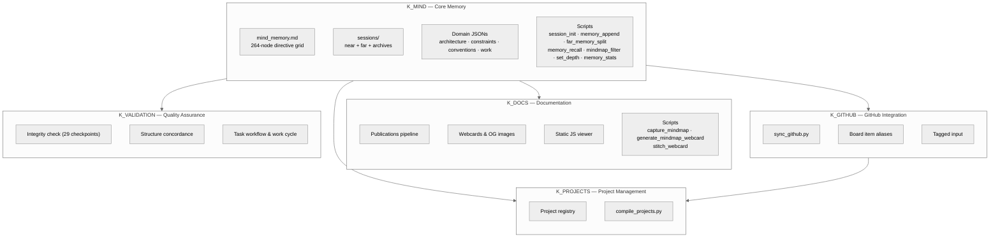
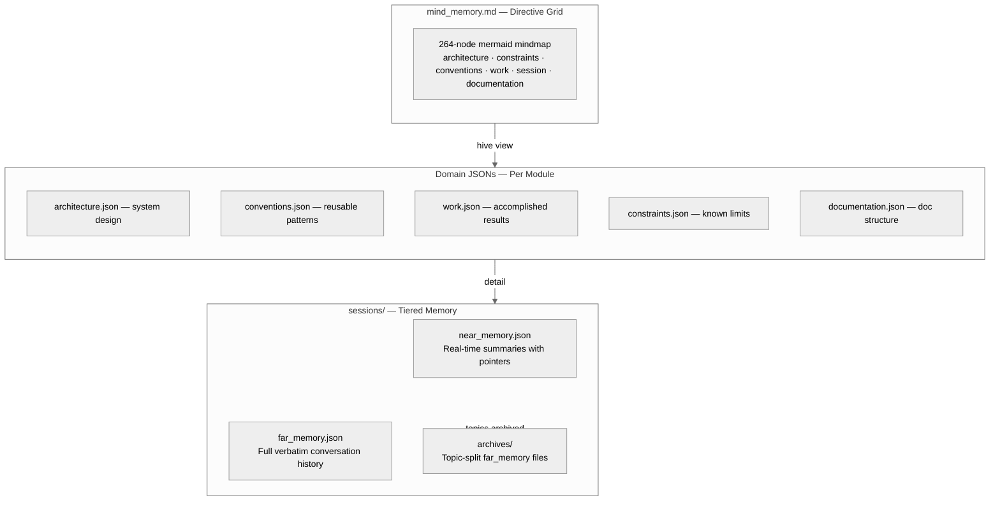

# Knowledge Architecture Analysis — Complete Documentation
{: #pub-title}

**Contents**

| | |
|---|---|
| [Authors](#authors) | Publication authors |
| [Abstract](#abstract) | System architecture overview |
| [System Overview](#system-overview) | Multi-module AI engineering intelligence |
| [Module Architecture](#module-architecture) | Five specialized modules |
| &nbsp;&nbsp;[K_MIND — Core Memory](#k_mind--core-memory) | Directive grid, tiered memory, session scripts |
| &nbsp;&nbsp;[K_DOCS — Documentation](#k_docs--documentation) | Publications, webcards, web viewer, visual tools |
| &nbsp;&nbsp;[K_GITHUB — GitHub Integration](#k_github--github-integration) | Sync, boards, tagged input |
| &nbsp;&nbsp;[K_PROJECTS — Project Management](#k_projects--project-management) | Project registry, compilation, lifecycle |
| &nbsp;&nbsp;[K_VALIDATION — Quality Assurance](#k_validation--quality-assurance) | Integrity checks, normalize, task workflow |
| &nbsp;&nbsp;[Module Interaction Model](#module-interaction-model) | How modules collaborate |
| [Memory Architecture](#memory-architecture) | Mind-first tiered memory |
| &nbsp;&nbsp;[mind_memory.md — Directive Grid](#mind_memorymd--directive-grid) | 264-node mermaid mindmap |
| &nbsp;&nbsp;[Domain JSONs — Structured Knowledge](#domain-jsons--structured-knowledge) | Per-module architecture, conventions, work |
| &nbsp;&nbsp;[sessions/ — Tiered Memory](#sessions--tiered-memory) | Near memory, far memory, archives |
| &nbsp;&nbsp;[Memory Lifecycle](#memory-lifecycle) | Knowledge flow through tiers |
| [Skill Architecture](#skill-architecture) | Claude Code native skill routing |
| &nbsp;&nbsp;[SKILL.md System](#skillmd-system) | Replacing routes.json and SkillRegistry |
| &nbsp;&nbsp;[Skill Inventory](#skill-inventory) | All registered skills by module |
| [Quality Architecture](#quality-architecture) | 13 core qualities |
| &nbsp;&nbsp;[Quality Dependency Graph](#quality-dependency-graph) | How qualities reinforce each other |
| &nbsp;&nbsp;[Quality Enforcement Mechanisms](#quality-enforcement-mechanisms) | K2.0 skills and scripts that enforce each quality |
| [Session Lifecycle Architecture](#session-lifecycle-architecture) | The persistence mechanism |
| &nbsp;&nbsp;[Session Initialization](#session-initialization) | session_init.py + /mind-context |
| &nbsp;&nbsp;[Real-Time Maintenance](#real-time-maintenance) | memory_append.py — every turn |
| &nbsp;&nbsp;[Topic Archival](#topic-archival) | far_memory_split.py — subject-based |
| &nbsp;&nbsp;[Memory Recall](#memory-recall) | memory_recall.py — deep search |
| &nbsp;&nbsp;[Compaction Recovery](#compaction-recovery) | /mind-context reload |
| [Distributed Architecture](#distributed-architecture) | Multi-repo knowledge network |
| &nbsp;&nbsp;[K_MIND Module Distribution](#k_mind-module-distribution) | Core pushed to satellites |
| &nbsp;&nbsp;[K_GITHUB Sync](#k_github-sync) | sync_github.py — bidirectional flow |
| [Security Architecture](#security-architecture) | Access control and token model |
| &nbsp;&nbsp;[Proxy Model](#proxy-model) | Container proxy boundaries |
| &nbsp;&nbsp;[Ephemeral Token Protocol](#ephemeral-token-protocol) | Zero-stored-at-rest PAT lifecycle |
| &nbsp;&nbsp;[gh_helper.py — API Gateway](#gh_helperpy--api-gateway) | Pure Python GitHub API access |
| [Web Architecture](#web-architecture) | Static JS viewer |
| &nbsp;&nbsp;[Static Viewer System](#static-viewer-system) | .nojekyll client-side rendering |
| &nbsp;&nbsp;[Dual-Theme System](#dual-theme-system) | Four themes with CSS media queries |
| &nbsp;&nbsp;[Interface Architecture](#interface-architecture) | 5 interfaces + live mindmap |
| &nbsp;&nbsp;[Publication Pipeline](#publication-pipeline) | Source to bilingual web pages |
| &nbsp;&nbsp;[Export Architecture](#export-architecture) | PDF and DOCX generation |
| [Deployment Model](#deployment-model) | Production architecture |
| &nbsp;&nbsp;[Dual Remote Strategy](#dual-remote-strategy) | knowledge + origin remotes |
| &nbsp;&nbsp;[Network Topology](#network-topology) | Current project registry |
| [Structural Analysis](#structural-analysis) | File-level weight analysis |
| &nbsp;&nbsp;[Module Weight Distribution](#module-weight-distribution) | Size by module |
| &nbsp;&nbsp;[Memory Budget](#memory-budget) | Context window management |
| &nbsp;&nbsp;[Reading Priority for Claude Instances](#reading-priority-for-claude-instances) | What loads when |
| [Publication Structure Analysis](#publication-structure-analysis) | Anatomy of a single publication |
| &nbsp;&nbsp;[Publication Anatomy](#publication-anatomy) | Components and tiers |
| &nbsp;&nbsp;[Publication Lifecycle](#publication-lifecycle) | From /docs-create to normalize |
| &nbsp;&nbsp;[Validation Skills](#validation-skills) | Quality assurance loop |
| [Related Publications](#related-publications) | Sibling and parent publications |

## Authors

**Martin Paquet** — Network security analyst programmer, network and system security administrator, and embedded software designer and programmer. 30 years of experience spanning embedded systems, network security, telecom, and software development. Architect of the Knowledge system — a self-evolving AI engineering intelligence built on plain Markdown files in Git.

**Claude** (Anthropic, Opus 4.6) — AI development partner. Co-architect and primary executor of the Knowledge system. Operates within the architecture described here — every session bootstraps from these structures, every skill follows these patterns.

---

## Abstract

The Knowledge system is a self-evolving AI engineering intelligence that transforms stateless AI coding sessions into a persistent, distributed, self-healing network of awareness. Built entirely on plain Markdown files, JSON domain files, and Python scripts in Git repositories, it requires no external services, no databases, and no cloud infrastructure. One `git clone` bootstraps everything.

This publication provides a comprehensive architecture analysis of the system's **Knowledge 2.0 multi-module design**: five specialized modules (K_MIND, K_DOCS, K_GITHUB, K_PROJECTS, K_VALIDATION), mind-first memory with a 264-node directive grid, tiered session memory (near/far/archives), Claude Code native skill routing via `.claude/skills/` SKILL.md files, a static JavaScript web viewer with 5 interfaces plus live mindmap, a security model built on proxy boundaries and ephemeral tokens, and the deployment architecture that ties it all together.

The architecture is distinctive in that the system documents itself by consuming its own output. The mindmap grows as knowledge is added. Publications describe the system that produces them. This recursive self-awareness is an emergent property of the architecture.

**Source**: Architecture documentation, updated 2026-03-16 for Knowledge 2.0 multi-module architecture.

---

## Target Audience

This publication is intended for work teams involved in the Knowledge system's ecosystem:

| Audience | What to focus on |
|----------|-----------------|
| **Network Administrators** | Distributed architecture, security model, proxy boundaries, deployment |
| **System Administrators** | Deployment model, GitHub Pages configuration, module structure |
| **Programmers** | Module architecture, memory system, session lifecycle, skill routing, Python scripts |
| **Managers** | System overview, core qualities, deployment model |

The document progresses from high-level overview to detailed technical analysis. Managers and architects may focus on the first sections (System Overview, Module Architecture, Quality Architecture), while implementers will find the later sections (Session Lifecycle, Security Architecture, Deployment Model) most actionable.

## Document Conventions

| Convention | Usage |
|------------|-------|
| **Tables** | Structured data, comparisons, inventories — compact format |
| **Mermaid diagrams** | Architecture visualizations — rendered by the static JS viewer |
| **Code blocks** | File paths, command examples, configuration snippets |
| **Bold text** | Key terms on first introduction, emphasis on critical concepts |
| **Module references** (`K_XXX`) | Cross-references to the five knowledge modules |
| **Publication references** (`#N`) | Cross-references to sibling publications by number |
| **Skill references** (`/skill-name`) | Claude Code native skills invoked via `.claude/skills/` |

---

## System Overview

The Knowledge system is a **self-evolving AI engineering intelligence** — a network of Git repositories, Markdown files, JSON domain files, Python scripts, and Claude Code skills that gives AI coding assistants persistent memory, distributed awareness, and self-healing capabilities. At its core, it solves a fundamental problem: AI coding sessions are stateless. Without external structure, every new session starts blank — an NPC with no memory of yesterday.

The system's architecture can be understood through three lenses:

1. **As a persistence mechanism**: A 264-node mindmap directive grid (`mind_memory.md`) + tiered session memory (`near_memory.json` / `far_memory.json` / `archives/`) + K_MIND scripts (`session_init.py`, `memory_append.py`) transform ephemeral sessions into continuous collaboration
2. **As a modular system**: Five specialized modules (K_MIND, K_DOCS, K_GITHUB, K_PROJECTS, K_VALIDATION) each own their domain — with their own scripts, skills, conventions, and work tracking
3. **As a self-documenting system**: The system records its own evolution in domain JSONs, publishes its own documentation via K_DOCS, and grows by consuming its own output

The entire system runs on plain text and JSON. No databases, no cloud services, no external dependencies beyond Git and GitHub. This is the **autosuffisant** quality — the system sustains itself from its own structure.

### K1.0 → K2.0 Evolution

Knowledge 2.0 represents a fundamental architectural shift from the monolithic K1.0 design:

| Aspect | K1.0 (Monolithic) | K2.0 (Multi-Module) |
|--------|-------------------|---------------------|
| **Brain** | `CLAUDE.md` (3000+ lines) | `mind_memory.md` (264-node directive grid) + domain JSONs per module |
| **Knowledge storage** | `patterns/`, `lessons/` directories | `conventions.json`, `work.json` per module |
| **Session memory** | `notes/` (flat markdown files) | `sessions/` — `near_memory.json` + `far_memory.json` + `archives/` |
| **Command routing** | `routes.json` + `SkillRegistry` | `.claude/skills/` SKILL.md files (Claude Code native) |
| **Session lifecycle** | `wakeup` (12-step), `save` (6-step) | `session_init.py` + `/mind-context`, `far_memory_split.py` + git commit |
| **Web presentation** | Jekyll with `_config.yml`, `_layouts/` | `.nojekyll` static JS viewer (`docs/index.html`) |
| **Organization** | Single repo, flat structure | 5 modules (K_MIND, K_DOCS, K_GITHUB, K_PROJECTS, K_VALIDATION) |

---

## Module Architecture

The Knowledge 2.0 system is organized into five specialized modules, each with its own domain files, scripts, skills, and methodology chain. Modules live under `Knowledge/` in the repository.



### K_MIND — Core Memory

**Location**: `Knowledge/K_MIND/`
**Role**: The system's brain — owns the mindmap directive grid, all session memory, and the scripts that maintain them.

K_MIND is the foundation module. Every other module depends on it for memory context. It contains:

| Component | Role |
|-----------|------|
| `files/mind/mind_memory.md` | 264-node mermaid mindmap — the directive grid |
| `sessions/near_memory.json` | Real-time summaries with pointers to far_memory and mind_memory |
| `sessions/far_memory.json` | Full verbatim conversation history |
| `sessions/archives/` | Topic-split far_memory files |
| `architecture/architecture.json` | System design references (static) |
| `constraints/constraints.json` | Known limitations (semi-dynamic) |
| `conventions/conventions.json` | Reusable patterns discovered during work (growing) |
| `work/work.json` | Accomplished/staged results — continuity anchor |
| `documentation/documentation.json` | Documentation structure references |
| `scripts/` | 8 Python scripts for memory management |

**Key architectural property**: The mindmap is both configuration and documentation. It configures Claude's behavior (every node is a directive) AND documents the system architecture for human readers. This dual role is intentional.

### K_DOCS — Documentation

**Location**: `Knowledge/K_DOCS/`
**Role**: Owns the publication pipeline, web viewer, webcards, visual documentation, and all documentation methodology.

| Component | Role |
|-----------|------|
| `conventions/` | Documentation conventions — web rendering, social images, webcards, interactive sessions |
| `methodology/` | Documentation generation, web visualization, production pipeline, audience targeting |
| `scripts/` | `capture_mindmap.js`, `generate_mindmap_webcard.py`, `stitch_webcard.py`, `package.json` |
| `work/work.json` | Documentation work tracking |

K_DOCS skills: `/docs-create`, `/pub`, `/pub-export`, `/visual`, `/live-session`, `/webcard`, `/profile-update`.

### K_GITHUB — GitHub Integration

**Location**: `Knowledge/K_GITHUB/`
**Role**: Owns GitHub synchronization, board management, and scoped input routing.

| Component | Role |
|-----------|------|
| `scripts/sync_github.py` | Bidirectional sync with GitHub (replaces K1.0 `harvest`) |
| `methodology/github-project-integration.md` | GitHub Projects v2 integration methodology |
| `methodology/github-board-item-alias.md` | Board item alias system (`g:<board>:<item>`) |
| `conventions/conventions.json` | GitHub conventions |

K_GITHUB skills: `/github`, `/tagged-input`, `/harvest`.

### K_PROJECTS — Project Management

**Location**: `Knowledge/K_PROJECTS/`
**Role**: Owns the project registry, compilation, and lifecycle management.

| Component | Role |
|-----------|------|
| `data/projects/` | Project metadata files (flat `<slug>.md`) |
| `data/projects.json` | Compiled project registry |
| `scripts/compile_projects.py` | Project compilation from metadata |
| `scripts/compile_projects_from_mind.py` | Project compilation from mindmap |
| `methodology/project-create.md` | Project creation methodology |
| `methodology/project-management.md` | Project lifecycle management |

K_PROJECTS skills: `/project-create`, `/project-manage`.

### K_VALIDATION — Quality Assurance

**Location**: `Knowledge/K_VALIDATION/`
**Role**: Owns all validation, integrity, normalization, and task workflow protocols.

| Component | Role |
|-----------|------|
| `scripts/documentation_validation.py` | Documentation validation engine |
| `methodology/session-protocol.md` | Session protocol rules |
| `methodology/task-workflow.md` | 8-stage task lifecycle (INITIAL → COMPLETION) |
| `methodology/checkpoint-resume.md` | Checkpoint and resume mechanics |
| `methodology/metrics-compilation.md` | Metrics compilation methodology |

K_VALIDATION skills: `/integrity-check` (29 checkpoints), `/normalize`, `/task-received`, `/work-cycle`, `/knowledge-validation`.

### Module Interaction Model

Modules interact through well-defined boundaries:

| Interaction | Mechanism |
|-------------|-----------|
| K_MIND → all modules | Memory context (mindmap + near_memory loaded at session start) |
| K_DOCS → K_MIND | Updates documentation nodes in mindmap |
| K_GITHUB → K_MIND | Sync results written to work.json and conventions.json |
| K_GITHUB → K_PROJECTS | Project boards linked to project registry |
| K_VALIDATION → all modules | Integrity checks validate all module structures |
| All modules → K_MIND | Domain JSON updates flow back to core memory |

Each module owns its own `conventions.json`, `work.json`, and `documentation.json`. This distributed ownership means no single file becomes a bottleneck — unlike K1.0's monolithic `CLAUDE.md`.

---

## Memory Architecture

The memory system follows a **mind-first** principle: always read `mind_memory.md` first as the primary context, then dig into domain JSONs and session files only when full details are needed.



### mind_memory.md — Directive Grid

**Location**: `K_MIND/files/mind/mind_memory.md`
**Format**: Mermaid mindmap with 264 nodes organized in 6 groups
**Role**: The system's subconscious mind — one glance to see everything

The mindmap is organized into six behavioral groups:

| Group | Behavior | Content |
|-------|----------|---------|
| **architecture** | HOW you work — system design rules | Module design, memory tiers, script roles |
| **constraints** | BOUNDARIES — hard limits | Context limits, security rules, never-violate |
| **conventions** | HOW you execute — patterns | Display conventions, methodologies, documentation |
| **work** | STATE — accomplished results | En cours, validation, approbation |
| **session** | CONTEXT — current record | Near memory, far memory, conversation |
| **documentation** | STRUCTURE — doc references | Docs, interfaces, stories, publications, profile |

**Key architectural property**: The mindmap is not decoration — it is operating memory. Every node is a directive that governs behavior. On every load (session start, resume, compaction recovery), Claude walks the full tree and internalizes each node.

**Depth filtering**: `conventions/depth_config.json` controls which branches are shown at which depth. Normal mode shows depth 3 with architecture and constraints omitted. Full mode shows all nodes. Branch overrides allow per-path depth control.

### Domain JSONs — Structured Knowledge

Each module owns domain JSON files that store structured knowledge:

| File | Module | Content | Mutability |
|------|--------|---------|------------|
| `architecture.json` | K_MIND | System design references | Static — changes when architecture evolves |
| `constraints.json` | K_MIND | Known limitations and hard rules | Semi-dynamic |
| `conventions.json` | K_MIND, K_DOCS, K_GITHUB, K_PROJECTS, K_VALIDATION | Reusable patterns discovered during work | Growing — new patterns added continuously |
| `work.json` | K_MIND, K_DOCS, K_GITHUB, K_PROJECTS, K_VALIDATION | Accomplished/staged work results | Dynamic — updated every session |
| `documentation.json` | K_MIND, K_DOCS, K_GITHUB, K_PROJECTS, K_VALIDATION | Documentation structure references | Semi-dynamic |

**163 references** across all domain JSONs, totaling ~1.8 MB. Only a subset (~4.5K tokens) is loaded at session start — the rest is accessed on demand.

### sessions/ — Tiered Memory

Session memory uses three tiers with increasing granularity:

| Tier | File | Content | Size | Loaded at start? |
|------|------|---------|------|-------------------|
| **Near memory** | `near_memory.json` | Real-time summaries with pointers to far_memory and mindmap nodes | ~33 KB | Yes (~8.5K tokens) |
| **Far memory** | `far_memory.json` | Full verbatim conversation history | ~5 KB (current session) | Minimal |
| **Archives** | `archives/` | Topic-split far_memory files | ~210 KB (16 topics) | No — loaded via `memory_recall.py` |

**Near memory** is the primary context carrier. Each entry contains:
- A one-line summary of what happened
- Mind-ref pointers to relevant mindmap nodes
- Tool call records
- Timestamps and message indices

**Far memory** stores the complete verbatim exchange — the user's exact words and Claude's full output. It grows during the session and is archived by topic when it gets large.

**Archives** are topic-split far_memory files. When a conversation topic is complete, `far_memory_split.py` moves the relevant messages to an archive file named by topic and timestamp.

### Memory Lifecycle

Knowledge flows through tiers:

| Transition | Mechanism | Trigger |
|-----------|-----------|---------|
| Conversation → Far memory | `memory_append.py` | Every turn (automatic) |
| Conversation → Near memory | `memory_append.py` (summary) | Every turn (automatic) |
| Far memory → Archives | `far_memory_split.py` | When topic is complete |
| Archives → Near memory | `memory_recall.py` | On demand (`--subject "..."`) |
| Near memory → Mindmap | Manual node update | When knowledge crystallizes |
| Mindmap → Domain JSONs | Manual JSON update | When knowledge is structured |
| Domain JSONs → Work | Skill execution | When work is accomplished |

The cycle is continuous: conversations generate raw data, summaries extract the signal, archives preserve completed topics, and the mindmap absorbs validated knowledge. This is the **recursive** quality — the system grows by consuming its own output.

---

## Skill Architecture

### SKILL.md System

Knowledge 2.0 replaces the K1.0 command router (`routes.json`, `SkillRegistry`, `executer_demande.py`) with **Claude Code native skill routing** via `.claude/skills/` SKILL.md files.

| Aspect | K1.0 | K2.0 |
|--------|------|------|
| **Routing** | `routes.json` keyword → program mapping | Claude Code reads SKILL.md and routes naturally |
| **Registry** | `SkillRegistry` (LireChoix, Fonction, Programme) | SKILL.md files in `.claude/skills/` |
| **Methodology** | `resolve_methodologies()` family-based loading | Each skill reads its own `methodology/` chain |
| **Deduplication** | `filter_unread()` / `mark_read()` | Claude Code native (no dedup needed) |
| **Results** | `knowledge_resultats.json` quiz results | Removed — skills are on-demand |
| **Execution** | `executer_demande.py` command router | Claude Code interprets + routes to skills |

### Skill Inventory

| Module | Skill | Purpose |
|--------|-------|---------|
| K_DOCS | `/docs-create` | Create new publication with scaffold |
| K_DOCS | `/pub` | Publication management — list, check, sync, review |
| K_DOCS | `/pub-export` | Export to PDF or DOCX |
| K_DOCS | `/visual` | Visual documentation — OpenCV + Pillow analysis |
| K_DOCS | `/live-session` | Live session analysis — clips, frames, multi-stream |
| K_DOCS | `/webcard` | Animated OG social preview generation |
| K_DOCS | `/profile-update` | Refresh profile pages with current stats |
| K_GITHUB | `/github` | GitHub API operations via gh_helper.py |
| K_GITHUB | `/tagged-input` | Scoped notes and board item references |
| K_GITHUB | `/harvest` | Distributed knowledge harvesting |
| K_PROJECTS | `/project-create` | Create new project with registration |
| K_PROJECTS | `/project-manage` | Project operations — list, info, register, review |
| K_VALIDATION | `/integrity-check` | 29-checkpoint integrity validation |
| K_VALIDATION | `/normalize` | Structure concordance — EN/FR mirrors, links, assets |
| K_VALIDATION | `/task-received` | On Task Received protocol — 9-step Stage 1 |
| K_VALIDATION | `/work-cycle` | Per-todo work cycle — commits, cache, push |
| K_VALIDATION | `/knowledge-validation` | Session validation |
| K_MIND | `/mind-context` | Load mindmap + near memory context |
| K_MIND | `/mind-depth` | Manage mindmap depth configuration |
| K_MIND | `/mind-stats` | Memory stats — disk, tokens, loaded, available |

Each skill's SKILL.md file contains the complete methodology chain: what to read, what to do, what to output. Skills are self-contained — they don't depend on a central registry.

---

## Quality Architecture

### The 13 Core Qualities

The Knowledge system embodies 13 qualities — each discovered through practice, each reinforcing the others. They are named in French (the system was conceived in French) and form a dependency hierarchy.

| # | Quality | Essence | K2.0 Mechanism |
|---|---------|---------|----------------|
| 1 | **Autosuffisant** | No external services, no databases, no cloud. Plain Markdown and JSON in Git. | mind_memory.md + domain JSONs + sessions/ — all plain text in a repo |
| 2 | **Autonome** | Self-propagating, self-healing, self-documenting. | session_init.py auto-runs; /normalize auto-fixes; K_MIND scripts handle all mechanical ops |
| 3 | **Concordant** | Structural integrity actively enforced. | `/normalize`, `/integrity-check` — detect and repair discrepancies |
| 4 | **Concis** | Mind-first: one glance to see everything. Maximum signal, minimum noise. | 264-node mindmap as hive view; domain JSONs for detail only when needed |
| 5 | **Interactif** | Operable, not just readable. Live mindmap, interactive interfaces. | 5 web interfaces + MindElixir live mindmap, `/mind-context` skill |
| 6 | **Evolutif** | The system grows as it works. Every session adds to memory. | near_memory grows every turn; conventions.json and work.json accumulate |
| 7 | **Distribue** | Intelligence flows both ways. Push modules, sync back. | K_MIND pushed to satellites; K_GITHUB `sync_github.py` harvests |
| 8 | **Persistant** | Sessions are ephemeral, knowledge is permanent. | Tiered memory (near/far/archives) + mindmap nodes |
| 9 | **Recursif** | The system documents itself by consuming its own output. | K_DOCS publications describe K_MIND architecture; mindmap maps the system that reads the mindmap |
| 10 | **Securitaire** | Security by architecture, not by obscurity. | Proxy scoping, .gitignore rules, owner-namespace URLs, gh_helper.py |
| 11 | **Resilient** | Every failure mode has a matching recovery path. | `/mind-context` (compaction), `memory_recall.py` (deep search), session archives |
| 12 | **Structure** | Organized around modules and projects. | 5 modules with own domain files; K_PROJECTS registry |
| 13 | **Integre** | Extends into external platforms. | K_GITHUB gh_helper.py, GitHub Projects v2, board aliases |

### Quality Dependency Graph

The qualities form a reinforcement network:

- **Autosuffisant** enables **distribue** (no external dependencies to propagate)
- **Autonome** enables **resilient** (self-healing includes crash recovery)
- **Concordant** enables **structure** (structural integrity across modules)
- **Persistant** enables **evolutif** (knowledge accumulates across sessions)
- **Recursif** enables **autosuffisant** (system builds its own documentation)
- **Concis** enables **interactif** (mindmap as single-glance overview makes system operable)

### Quality Enforcement Mechanisms

Each quality is enforced by specific K2.0 skills, scripts, and conventions:

| Quality | K2.0 Enforcement |
|---------|-------------------|
| Autosuffisant | No external dependency in any module; pure Python scripts; JSON + Markdown storage |
| Autonome | `session_init.py` auto-initializes; `/normalize` self-heals; memory_append runs every turn |
| Concordant | `/normalize` audits structure; `/integrity-check` validates 29 checkpoints |
| Concis | mind_memory.md as hive view (264 nodes); depth filtering via depth_config.json |
| Interactif | 5 web interfaces + live MindElixir mindmap; `/mind-context` for immediate context |
| Evolutif | near_memory grows every turn; work.json tracks accomplishments; conventions.json captures patterns |
| Distribue | K_MIND module pushed via git; K_GITHUB sync_github.py for bidirectional flow |
| Persistant | Tiered memory (near/far/archives); mindmap nodes crystallize validated knowledge |
| Recursif | K_DOCS publications describe the system; K_MIND mindmap maps itself |
| Securitaire | Proxy scoping; ephemeral tokens via gh_helper.py; `.gitignore` blocks |
| Resilient | `/mind-context` reload after compaction; `memory_recall.py` for deep search; session archives |
| Structure | 5 modules with own domain files; K_PROJECTS registry; per-module conventions.json |
| Integre | K_GITHUB gh_helper.py; GitHub Projects v2; board item aliases; tagged input |

---

## Session Lifecycle Architecture

Every AI session follows a deterministic lifecycle managed by K_MIND scripts. The core principle: **programs over improvisation** — Claude provides intelligence (summaries, topic names) as arguments to deterministic scripts.

```
session_init.py → /mind-context → [work] → memory_append.py (every turn) → far_memory_split.py → git commit & push
```

### Session Initialization

On every session start, two things happen:

1. **`session_init.py`** initializes or resumes session files:
   ```bash
   python3 scripts/session_init.py --session-id "<id>"              # New session
   python3 scripts/session_init.py --session-id "<id>" --preserve-active  # Resume
   ```
   - Previous session is auto-archived but summaries carry forward in `near_memory.json` under `last_session`
   - Session files are created or resumed atomically

2. **`/mind-context`** loads and displays the context:
   - Renders the filtered mindmap (mermaid code block)
   - Shows last session context (where work was left off)
   - Shows recent near_memory summaries (current session activity)
   - Displays memory stats table (disk size, tokens, loaded, available)

This replaces the K1.0 12-step wakeup protocol. Where K1.0 needed `git clone` of the knowledge repo, reading `notes/`, summarizing state, and printing help — K2.0 loads the mindmap and near_memory in one operation.

### Real-Time Maintenance

**Every turn**, Claude runs `memory_append.py` to persist the exchange:

```bash
python3 scripts/memory_append.py \
    --role user --content "exact user message" \
    --role2 assistant --content2 "full assistant output" \
    --summary "one-line summary" \
    --mind-refs "knowledge::node1,knowledge::node2"
```

For large content (tables, code blocks), stdin mode avoids shell escaping:
```bash
python3 scripts/memory_append.py --stdin << 'ENDJSON'
{"role":"user","content":"...","role2":"assistant","content2":"...","summary":"...","mind_refs":"...","tools":[...]}
ENDJSON
```

This handles both far_memory (verbatim) and near_memory (summary) atomically. No improvisation — the script writes both files in a single operation.

### Topic Archival

When `far_memory.json` grows large or a topic is complete, `far_memory_split.py` archives it:

```bash
python3 scripts/far_memory_split.py \
    --topic "Topic Name" \
    --start-msg 1 --end-msg 24 \
    --start-near 1 --end-near 7
```

Claude identifies topic boundaries from near_memory summary clusters, then calls the script. The script moves messages to `archives/far_memory_session_<id>_<timestamp>.json`, keyed by topic. This keeps the active far_memory small while preserving full history.

### Memory Recall

To search archived memory:

```bash
python3 scripts/memory_recall.py --subject "architecture"   # Search by keyword
python3 scripts/memory_recall.py --list                      # List all archive topics
python3 scripts/memory_recall.py --subject "theme" --full    # Full content retrieval
```

This replaces K1.0's `recall` command. Instead of scanning git branches for unmerged work, K2.0 searches structured archive files by subject.

### Compaction Recovery

When Claude Code compacts context mid-session, `/mind-context` reloads the mindmap and near_memory. Because mind_memory.md is compact (264 nodes, ~2.8K tokens) and near_memory carries summaries with pointers, recovery is fast and complete.

| Recovery scenario | K1.0 | K2.0 |
|-------------------|------|------|
| After compaction | `refresh` (re-read CLAUDE.md) | `/mind-context` (reload mindmap + near_memory) |
| After session crash | `resume` (checkpoint.json) | `session_init.py --preserve-active` |
| Deep memory search | `recall` (branch scanning) | `memory_recall.py --subject "..."` |
| Full context reload | `wakeup` (12-step protocol) | `/mind-context full` |

---

## Distributed Architecture

### K_MIND Module Distribution

The K_MIND module is the portable brain — it can be pushed to any satellite project via git. A satellite that clones or references K_MIND inherits the complete methodology:

- The 264-node mindmap (architecture, constraints, conventions, work tracking)
- All K_MIND scripts (session management, memory maintenance)
- Domain JSONs (structured knowledge)

This replaces K1.0's push flow where satellites read `packetqc/knowledge` CLAUDE.md at wakeup step 0.

### K_GITHUB Sync

K_GITHUB's `sync_github.py` replaces the K1.0 `harvest` protocol for bidirectional intelligence flow:

| K1.0 Harvest | K2.0 K_GITHUB Sync |
|--------------|---------------------|
| `harvest <project>` — crawl satellite | `sync_github.py` — bidirectional sync |
| `harvest --healthcheck` — dashboard update | K_VALIDATION `/integrity-check` |
| `harvest --promote N` — promote insight | Update `conventions.json` or `work.json` manually |
| `harvest --fix <project>` — remediate drift | K_GITHUB sync to satellite |

The distributed topology remains hub-and-spoke, but the mechanism is simpler: K_MIND is the core module, K_GITHUB handles sync, and each module's domain JSONs are the unit of knowledge transfer.

---

## Security Architecture

### Proxy Model

Claude Code sessions run behind a container proxy that enforces strict access boundaries:

| Operation | Behavior |
|-----------|----------|
| `git clone` (public repos) | Allowed — initial read-only |
| `git fetch` (after clone, cross-repo) | Blocked — "No such device or address" |
| `git push` (assigned task branch) | Allowed — proxy-authorized |
| `git push` (any other branch) | Blocked — HTTP 403 |
| `curl` to `api.github.com` | Blocked — proxy strips auth headers |
| Python `urllib` to `api.github.com` | Allowed — bypasses proxy |

### Ephemeral Token Protocol

When autonomous API access is needed, the system uses classic GitHub PATs with `repo` + `project` scopes. Tokens are **ephemeral by design**:

| Property | Implementation |
|----------|---------------|
| Delivery | `GH_TOKEN` env var (pre-session) or `/tmp/.gh_token` (read+deleted) |
| Storage | Environment variable only — dies with session/container |
| Visibility | Never displayed in session UI, never written to files |
| Persistence | None — zero-stored-at-rest |
| Usage | Via `gh_helper.py` Python `urllib` — token never on command line |

### gh_helper.py — API Gateway

**Location**: `K_MIND/scripts/gh_helper.py`
**Role**: Portable Python replacement for the `gh` CLI
**Technology**: Pure Python `urllib` (no external dependencies)
**Key property**: Bypasses the container proxy that blocks `curl` and `gh`

`gh_helper.py` is the system's gateway to the GitHub API. It reads `GH_TOKEN` from `os.environ` internally — the token never appears on any command line. It covers: PR operations, GitHub Projects v2, TAG labels, and issue management.

**Two-channel model**: The system operates through two parallel channels:

| Channel | Protocol | Used for |
|---------|----------|----------|
| Git proxy | HTTPS via container proxy | Clone, fetch, push (task branch only) |
| API direct | Python `urllib` to `api.github.com` | PR create/merge, Projects v2, issue management |

---

## Web Architecture

### Static Viewer System

Knowledge 2.0 replaced the K1.0 Jekyll-based site with a **static JavaScript viewer**:

| Aspect | K1.0 (Jekyll) | K2.0 (Static JS Viewer) |
|--------|---------------|-------------------------|
| Build system | Jekyll with `_config.yml`, `_layouts/` | `.nojekyll` — no build step |
| Rendering | Server-side Ruby + Liquid templates | Client-side JavaScript + marked.js + mermaid |
| Layouts | `default.html`, `publication.html` | Single `index.html` with dynamic routing |
| Deployment | GitHub Pages Jekyll build | GitHub Pages static files |
| Theme | 2 themes (Cayman, Midnight) | 4 themes with CSS media queries |

The viewer reads Markdown front matter, renders content client-side, and routes URLs without server-side processing. Mermaid diagrams render in the browser.

### Dual-Theme System

All web pages support four visual themes via CSS:

| Theme | Trigger | Style |
|-------|---------|-------|
| **Cayman** (light) | `prefers-color-scheme: light` | Teal/emerald gradients |
| **Midnight** (dark) | `prefers-color-scheme: dark` | Navy/indigo gradients |
| + webcards in both themes | Generated per-publication | 1200x630, 256-color animated GIFs |

Social sharing (`og:image`) always uses the Cayman (light) variant.

### Interface Architecture

Six interfaces serve different aspects of the system:

| Interface | Purpose |
|-----------|---------|
| **Main Navigator** | Central hub — loads all other interfaces in iframe |
| **Project Viewer** | Browse projects from `projects.json` |
| **Session Review** | Review session data from `sessions.json` |
| **Task Workflow** | Track tasks from `tasks.json` |
| **Live Mindmap** | MindElixir v5 interactive mindmap visualization |
| **Publication Index** | Browse all publications |

Each interface is a standalone HTML/CSS/JS page that reads JSON data files and renders content dynamically. The unified EN/FR template convention (conv-020) ensures identical markup with `translateStatic()` for i18n — no duplicate template files.

### Publication Pipeline

Each publication follows a pipeline from source to bilingual web pages:

```
K_DOCS methodology chain → SKILL.md /docs-create
    → docs/publications/<slug>/index.md          ← EN summary
    → docs/publications/<slug>/full/index.md     ← EN complete
    → docs/fr/publications/<slug>/index.md       ← FR summary
    → docs/fr/publications/<slug>/full/index.md  ← FR complete
```

The static JS viewer renders these Markdown files client-side. Front matter provides metadata (layout, title, description, pub_id, version, date, permalink, og_image, keywords).

### Export Architecture

Publications can be exported to PDF and DOCX:

| Mode | Mechanism | Dependencies |
|------|-----------|-------------|
| **Web** (client-side) | `window.print()` + CSS Paged Media | None — browser IS the PDF engine |
| **DOCX** (client-side) | HTML-to-Word conversion | None — runs in browser |

The web mode uses: `printAs()` function with Letter/Legal selection, running headers, footers, cover page, and smart TOC page breaks.

---

## Deployment Model

### Dual Remote Strategy

The Knowledge 2.0 repository uses two Git remotes:

| Remote | Repository | Purpose |
|--------|-----------|---------|
| `knowledge` | `packetqc/knowledge` | Production — the canonical knowledge system |
| `origin` | `packetqc/K_DOCS` | Production K_DOCS module repository |

Both remotes receive pushes on every completed unit of work. This dual-remote strategy ensures the knowledge system is accessible from both entry points.

### Network Topology

The current project network:

| ID | Project | Type | Status | Role |
|----|---------|------|--------|------|
| P0 | Knowledge System | core | active | Master — system-wide canonical |
| P1 | MPLIB | child | active | Embedded library — original proof of concept |
| P2 | STM32 PoC | child | active | Hardware proof of concept |
| P3 | knowledge-live | child | active | Live tooling development |
| P4 | MPLIB Dev Staging | child (of P1) | active | Development staging for MPLIB |
| P5 | PQC | child | pre-bootstrap | Post-quantum cryptography project |
| P6 | Export Documentation | managed (in P3) | active | Export feature documentation |
| P8 | Documentation System | managed (in P0) | active | Doc management methodology |
| P9 | Knowledge Compliancy Report | managed (in P0) | active | Security compliance tracking |

---

## Structural Analysis

### Module Weight Distribution

| Module | Components | Size | Proportion |
|--------|-----------|------|------------|
| **K_MIND** | mindmap + sessions + domain JSONs + scripts | ~270 KB | Core |
| **K_DOCS** | conventions + methodology + scripts | ~150 KB | Documentation |
| **K_GITHUB** | conventions + methodology + scripts | ~80 KB | Integration |
| **K_PROJECTS** | data + scripts + methodology | ~60 KB | Projects |
| **K_VALIDATION** | methodology + scripts + conventions | ~90 KB | QA |
| **docs/** | 100+ pages + interfaces + assets | Variable | Web presence |

### Memory Budget

The memory system is designed around the ~200K token context window:

| Store | Count | Size | ~Tokens | Loaded at start? |
|-------|-------|------|---------|-------------------|
| mind_memory.md | 264 nodes | ~11 KB | ~2,835 | Yes |
| Domain JSONs | 163 refs | ~1.8 MB | ~463K | ~4.5K (subset) |
| near_memory | summaries | ~33 KB | ~8,528 | Yes |
| far_memory | messages | ~5 KB | ~1,195 | Minimal |
| Archives | 16 topics | ~210 KB | ~53,662 | No (on demand) |
| System overhead | tools+MCP | — | ~34,000 | Yes |
| **Usable limit** | 200K - 33K buffer | — | **~167,000** | |

The mind-first approach means the most critical information (mindmap + near_memory ≈ 11K tokens) is always loaded. Domain JSONs and archives are accessed on demand, keeping the context budget manageable.

### Reading Priority for Claude Instances

| Priority | What | Tokens | Loaded | Survives compaction? |
|----------|------|--------|--------|---------------------|
| **P0** | `mind_memory.md` | ~2,835 | Always | Yes (via /mind-context) |
| **P1** | `near_memory.json` | ~8,528 | Always | Yes (via /mind-context) |
| **P2** | CLAUDE.md (K_MIND instructions) | ~0 (minimal) | Always | Yes (system-level) |
| **P3** | Domain JSONs (subset) | ~4,524 | At start | No |
| **P4** | `far_memory.json` | ~1,195 | Partial | No |
| **P5** | Archives | ~53,662 | On demand | No |
| **P6** | Module methodology files | Variable | On demand | No |

The reading order reflects the mind-first principle: mindmap first (hive view), then near_memory (recent context), then domain JSONs (structured detail), then archives (historical depth).

---

## Publication Structure Analysis

### Publication Anatomy

Every publication in the Knowledge system follows a consistent structure:

| Component | Role | Files |
|-----------|------|-------|
| **Web pages EN** | English web presence, 2 tiers | Summary (`index.md`) + Complete (`full/index.md`) |
| **Web pages FR** | French mirror | Same structure under `docs/fr/` |
| **Front matter** | Page metadata | Required fields: layout, title, description, pub_id, version, date, permalink, og_image |
| **Webcards OG** | Animated social preview | 4 GIFs per publication (2 languages × 2 themes) |
| **System integration** | Connection points | Publication indexes (EN/FR), profile pages, mindmap documentation nodes |
| **Validation** | Quality control | `/normalize`, `/integrity-check` |

### Publication Lifecycle

```
/docs-create <slug> → EN/FR pages scaffolded → Webcards generated
    → Content written
    → /pub check → Structure validated
    → /normalize → Global concordance
```

### Validation Skills

| Skill | Focus | Modifies files? |
|-------|-------|-----------------|
| `/normalize` | Global concordance — EN/FR mirrors, links, assets | With `--fix` |
| `/integrity-check` | 29-checkpoint integrity validation | Report only |
| `/pub` (check mode) | Structure — front matter, links, mirrors | Report only |

These skills form a complete quality loop: structure is correct, EN/FR mirrors exist, front matter is valid, and the global structure is concordant.

---

## Related Publications

| # | Publication | Relationship |
|---|-------------|-------------|
| 0 | [Knowledge System]({{ '/publications/knowledge-system/' | relative_url }}) | Parent — the master publication documenting the system |
| 0v2 | [Knowledge 2.0]({{ '/publications/knowledge-2.0/' | relative_url }}) | Evolution — the multi-module architecture design |
| 3 | [AI Session Persistence]({{ '/publications/ai-session-persistence/' | relative_url }}) | Foundation — the methodology that started everything |
| 4 | [Distributed Minds]({{ '/publications/distributed-minds/' | relative_url }}) | Architecture — the distributed intelligence flow |
| 9 | [Security by Design]({{ '/publications/security-by-design/' | relative_url }}) | Security — the access control and token model |
| 12 | [Project Management]({{ '/publications/project-management/' | relative_url }}) | Structure — project entity model and lifecycle |
| 15 | [Architecture Diagrams]({{ '/publications/architecture-diagrams/' | relative_url }}) | Visual — all architecture diagrams |

---

*Authors: Martin Paquet & Claude (Anthropic, Opus 4.6)*
*Knowledge: [packetqc/knowledge](https://github.com/packetqc/knowledge)*
