# Knowledge 2.0 Architecture Diagrams — Complete Documentation
{: #pub-title}

**Contents**

| | |
|---|---|
| [Authors](#authors) | Publication authors |
| [Abstract](#abstract) | Visual companion to the Knowledge 2.0 architecture |
| [Diagram Conventions](#diagram-conventions) | Color coding, notation, Mermaid syntax |
| [1. System Overview](#1-system-overview--c4-context) | C4 context — Multi-module system at center |
| [2. Mind-First Memory Architecture](#2-mind-first-memory-architecture) | 4-tier memory: Mindmap → Domain JSONs → Near → Far |
| [3. Multi-Module Architecture](#3-multi-module-architecture) | 5 K_ modules, scripts, and relationships |
| [4. Session Lifecycle](#4-session-lifecycle) | session_init → /mind-context → memory_append → archive |
| [5. Module Interaction Flow](#5-module-interaction-flow) | K_MIND central hub, compilation pipelines, skill invocations |
| [6. Publication Pipeline](#6-publication-pipeline) | Source → static viewer → EN/FR × summary/full × 4 themes |
| [7. Security Boundaries](#7-security-boundaries) | Proxy model — allowed vs blocked operations |
| [8. Web Architecture](#8-web-architecture) | Static JS viewer, 4 themes, 5 interfaces, .nojekyll |
| [9. Quality Dependencies](#9-quality-dependency-graph) | 13 qualities dependency graph |
| [10. Recovery Paths](#10-recovery-paths) | K_MIND recovery: compaction, recall, session init |
| [11. GitHub Integration](#11-github-integration) | K_GITHUB module, sync scripts, board lifecycle |
| [Related Publications](#related-publications) | Sibling and parent publications |

## Authors

**Martin Paquet** — Network security analyst programmer, network and system security administrator, and embedded software designer and programmer. Architect of the Knowledge system — a self-evolving AI engineering intelligence built on 30 years of embedded systems, network security, and software development experience. Designed the multi-module architecture documented in these diagrams.

**Claude** (Anthropic, Opus 4.6) — AI development partner. Co-created the architectural diagrams, rendering system structure into Mermaid notation for interactive web visualization. Operates within the system these diagrams describe.

---

## Abstract

Knowledge 2.0 is a **multi-module AI engineering intelligence system** structured around a central memory grid (K_MIND) with specialized satellite modules (K_DOCS, K_GITHUB, K_PROJECTS, K_VALIDATION). This publication is the **visual companion** — 14 Mermaid diagrams that render the system's structure, flows, boundaries, and dependencies into interactive visualizations.

These diagrams cover the full architectural surface: from the high-level C4 context (5 K_ modules at center, GitHub platform, static web viewer) down to the granular security boundaries (proxy layers, API channels) and the mind-first memory architecture (mindmap → domain JSONs → near/far memory → archives).

All diagrams use [Mermaid](https://mermaid.js.org/) syntax, rendered client-side by the static JS viewer via CDN.

---

## Target Audience

| Audience | What to focus on |
|----------|-----------------|
| **Network Administrators** | Module interaction (#5), security boundaries (#7), web architecture (#8) |
| **System Administrators** | Web architecture (#8), GitHub integration (#11), publication pipeline (#6) |
| **Programmers** | Multi-module architecture (#3), session lifecycle (#4), recovery paths (#10) |
| **Managers** | System overview (#1), mind-first memory (#2), quality dependencies (#9) |

## Diagram Conventions

All diagrams use **Mermaid** notation — a markdown-based diagramming language rendered client-side by the static JS viewer.

**Color coding**:

| Color | Meaning | Used for |
|-------|---------|----------|
| Teal / Green | Core / Stable / Mandatory | K_MIND, mind_memory, stable conventions |
| Blue | Active / In-progress | Sessions, active flows, current operations |
| Orange / Amber | Warning / Drift | Version drift, stale content, minor issues |
| Red | Critical / Blocked | Security boundaries, proxy blocks |
| Purple | External / Platform | GitHub, GitHub Pages, external services |
| Gray | Inactive / Pending | Unused paths, pending items |

**Notation**:

| Symbol | Meaning |
|--------|---------|
| Solid arrow (`-->`) | Direct data flow or dependency |
| Dashed arrow (`-.->`) | Indirect or periodic flow |
| Thick arrow (`==>`) | Primary / critical path |
| Subgraph | Logical grouping or boundary |

---

## 1. System Overview — C4 Context

The Knowledge 2.0 system sits at the center of a constellation of actors: 5 internal K_ modules, GitHub platform services, GitHub Pages for static web publishing, Claude Code as the AI session engine, and the human developer.

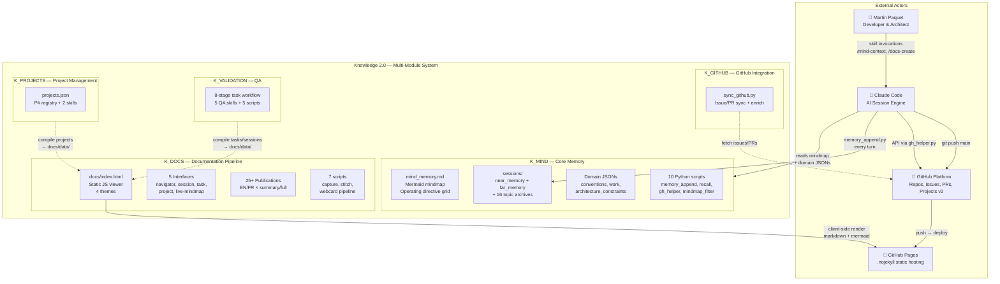


**Legend**: The system is organized as 5 K_ modules under a `Knowledge/` directory. K_MIND is the mandatory core — always loaded, always maintained. Other modules (K_DOCS, K_GITHUB, K_PROJECTS, K_VALIDATION) provide specialized capabilities. Claude Code is the execution environment, reading the mindmap on every session start and maintaining memory via scripts every turn. GitHub Pages serves the static web viewer with client-side markdown and mermaid rendering.

---

## 2. Mind-First Memory Architecture

The system organizes knowledge into 4 tiers of decreasing stability and increasing granularity. The mindmap is the operating directive grid — always loaded first. Domain JSONs provide structured references. Near memory tracks the session in real time. Far memory preserves full verbatim history.

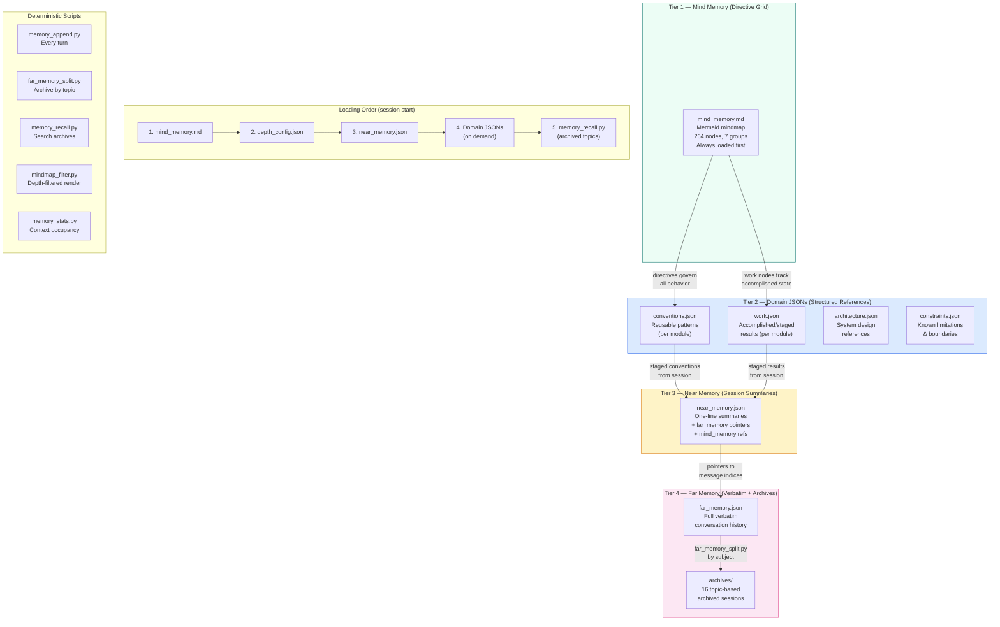


**Legend**: Knowledge flows upward (far memory → near memory → domain JSONs → mindmap) through the staging pipeline. It flows downward (mindmap → session behavior) as operational directives. The loading order follows stability: most stable first (mindmap), most granular last (archived far memory). All mechanical operations use deterministic Python scripts — Claude provides intelligence (summaries, topic names) as arguments.

---

## 3. Multi-Module Architecture

The 5 K_ modules, their internal structure, scripts, and relationships within the Knowledge 2.0 repository.

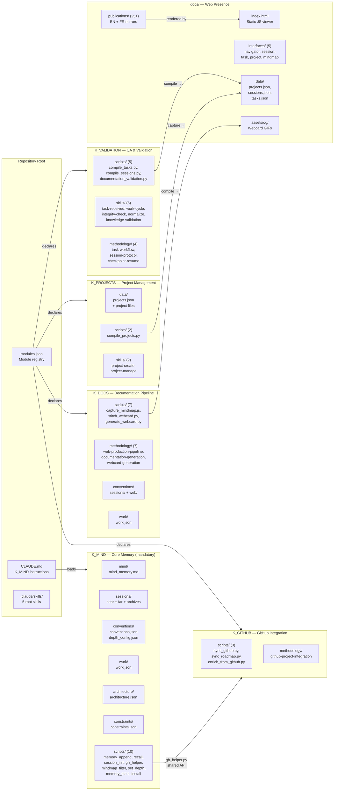


**Legend**: The repository is organized into 5 K_ modules under `Knowledge/`. Each module owns its conventions, work state, and scripts. K_MIND is mandatory (always loaded). Other modules are declared in `modules.json` and loaded on demand. The `docs/` directory is the web output — served by GitHub Pages with .nojekyll (no build step). Compilation scripts in K_VALIDATION and K_PROJECTS produce JSON data consumed by the static viewer's interfaces.

---

## 4. Session Lifecycle

Every Claude Code session follows a deterministic lifecycle managed by K_MIND scripts. The mindmap is loaded first, memory is maintained every turn, and topics are archived when complete.

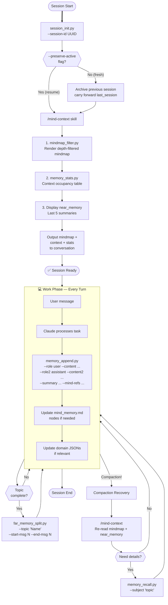


**Legend**: The session lifecycle has three phases: boot (/mind-context), work (memory_append every turn), and recovery (compaction handling). The mind-first principle means the mindmap is always loaded first — it contains all behavioral directives. Far memory stores full verbatim conversation; near memory stores one-line summaries with pointers. Topic archiving keeps far_memory.json manageable. Compaction recovery re-reads the mindmap and near memory, with optional deep recall from archives.

---

## 5. Module Interaction Flow

How the 5 K_ modules interact: K_MIND as central hub, compilation pipelines feeding the web viewer, and skill invocations across modules.

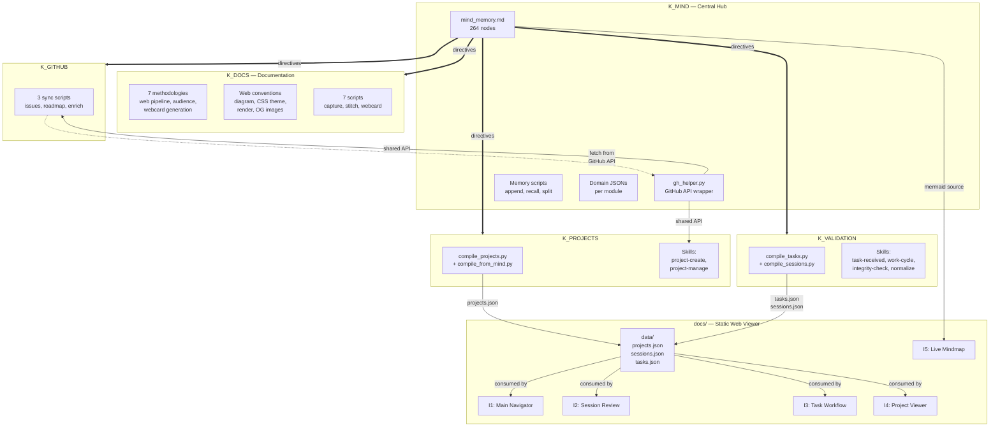


**Legend**: K_MIND is the hub — its mindmap provides directives to all modules, and gh_helper.py is the shared GitHub API wrapper. K_PROJECTS and K_VALIDATION compile structured data into `docs/data/` JSON files consumed by the 5 web interfaces. K_GITHUB syncs external GitHub state. K_DOCS owns the web pipeline methodology and conventions. The live mindmap (I5) reads directly from mind_memory.md.

---

## 6. Publication Pipeline

Each publication exists at two web tiers (summary + full), in two languages (EN + FR), rendered by the static JS viewer with 4 theme variants.

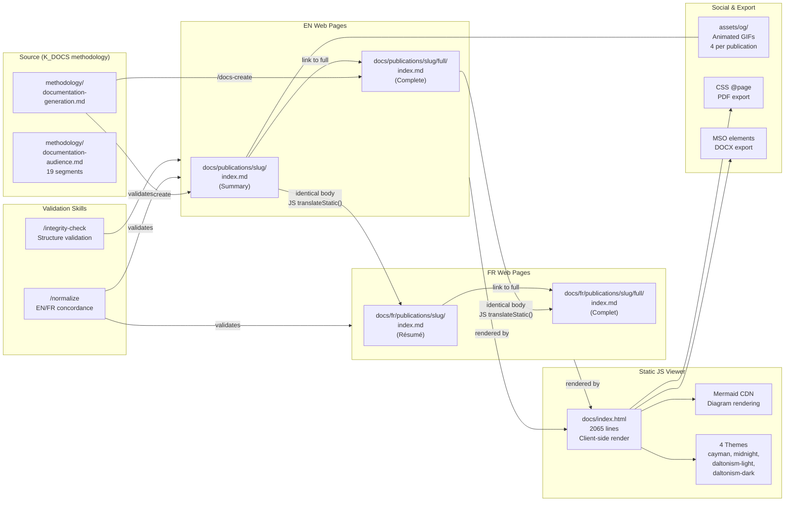


**Legend**: Publications follow K_DOCS methodology. EN and FR pages share identical `{::nomarkdown}` bodies — language is a runtime parameter via JS `translateStatic()` (convention conv-020: never duplicate templates). The static viewer renders markdown + mermaid client-side with 4 theme variants. Export to PDF uses CSS @page media; DOCX uses MSO elements. Validation skills ensure EN/FR concordance and structural integrity.

---

## 7. Security Boundaries

The proxy model governing what Claude Code sessions can and cannot do. The container proxy mediates all git operations while Python urllib bypasses it for API access.

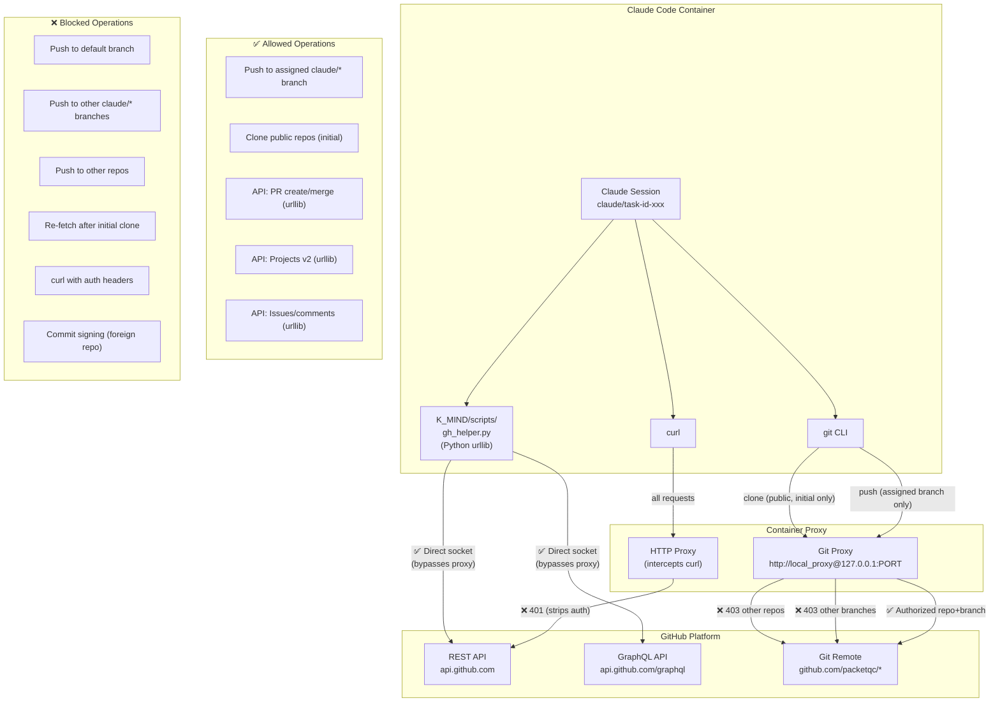


**Legend**: The container proxy is the primary security boundary. Git operations are restricted to the assigned task branch. `gh_helper.py` (located in K_MIND/scripts/) bypasses the proxy via Python `urllib`, enabling full GitHub API access with a valid token. `curl` is intercepted and auth headers stripped. The two-channel model: git proxy (restricted) + urllib (unrestricted with token). Token is never exposed in commands or URLs — gh_helper.py manages token retrieval internally.

---

## 8. Web Architecture

The static web viewer architecture: .nojekyll GitHub Pages, client-side rendering, 4-theme system, 5 interactive interfaces, and the BroadcastChannel theme sync.

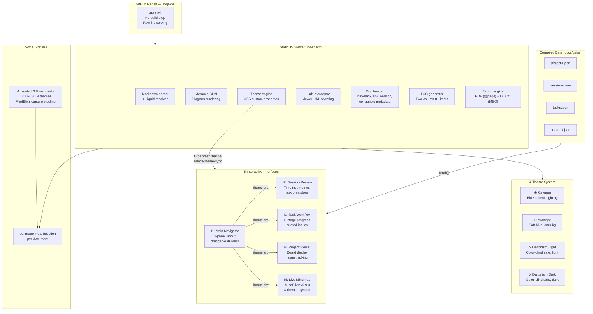


**Legend**: The web presence uses .nojekyll GitHub Pages — no server-side build. The static JS viewer (2065 lines) handles markdown parsing, mermaid rendering, link rewriting, theme switching, and export. The 4-theme system uses CSS custom properties injected via a theme engine. Interfaces run as iframes within the main navigator, receiving theme broadcasts via BroadcastChannel. Compiled JSON data from K_VALIDATION and K_PROJECTS feeds the interfaces. MindElixir v5.9.3 powers the live mindmap with the same 4 themes.

---

## 9. Quality Dependency Graph

The 13 core qualities and how they depend on each other. Autosuffisant is the foundation — if the system depends on external services, nothing else works.

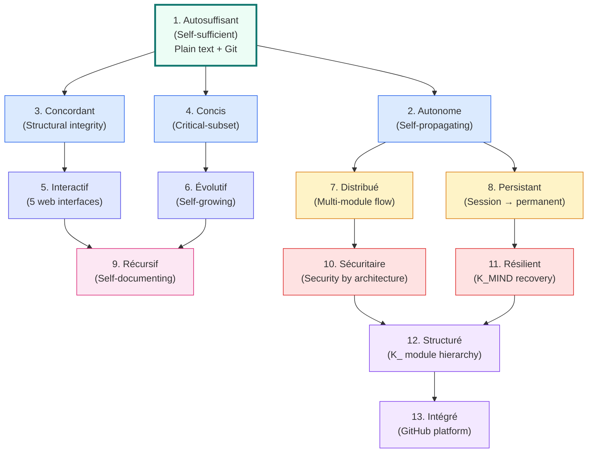


**Legend**: The dependency graph flows from foundation (autosuffisant — plain text in Git) through enabling qualities to operational qualities to organizational qualities. Updated for Knowledge 2.0: Interactif now references 5 web interfaces, Distribué references multi-module flow, Résilient references K_MIND recovery, and Structuré references the K_ module hierarchy.

---

## 10. Recovery Paths

The K_MIND recovery mechanisms, ordered from lightest to heaviest. Each path addresses a different failure mode.

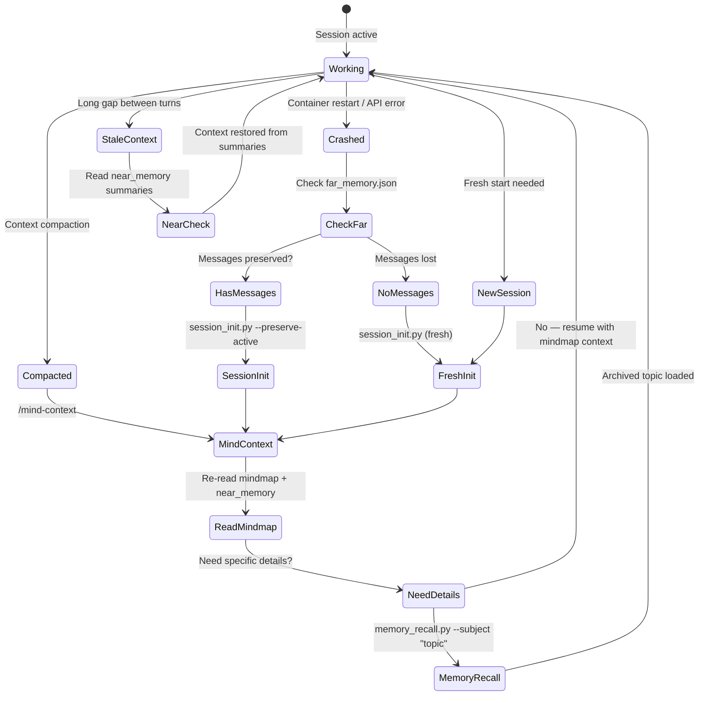


**Legend**: K_MIND provides 4 recovery paths. **Compaction** (most common): `/mind-context` reloads the mindmap and near memory — sufficient for most cases. **Deep recall**: `memory_recall.py` searches archived topics when specific details are needed. **Crash recovery**: `session_init.py --preserve-active` preserves existing messages. **Fresh start**: new session inherits last_session summaries for continuity.

**Recovery summary**:

| Recovery | Trigger | Speed | What it restores |
|----------|---------|-------|------------------|
| `/mind-context` | Context compaction | ~5s | Mindmap directives + recent summaries |
| `memory_recall.py` | Need archived details | ~10s | Specific topic from archives |
| `session_init --preserve-active` | Crash with messages | ~10s | Full session continuity |
| `session_init` (fresh) | New session | ~15s | Clean start + last_session context |
| Near memory check | Stale context | ~3s | Recent activity summaries |

---

## 11. GitHub Integration

The K_GITHUB module manages GitHub entity synchronization. `gh_helper.py` (in K_MIND/scripts/) is the shared API wrapper used across modules.

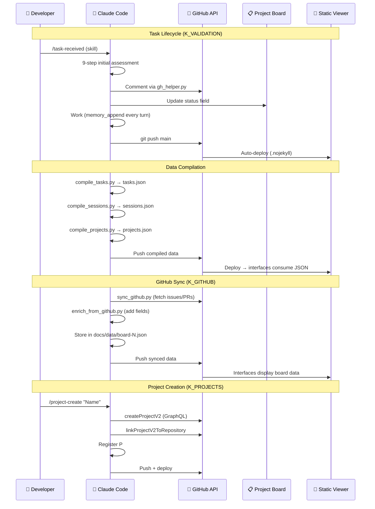


**Legend**: Three key workflows. **Task lifecycle**: skill-driven assessment → work with real-time memory → push to main → auto-deploy. **Data compilation**: K_VALIDATION and K_PROJECTS scripts compile JSON consumed by web interfaces. **GitHub sync**: K_GITHUB scripts fetch external state into local data files. All API calls go through `gh_helper.py` (Python urllib, bypasses container proxy).

---

## 12. System Architecture Mindmap

High-level navigation map of the Knowledge 2.0 system with its architectural pillars.

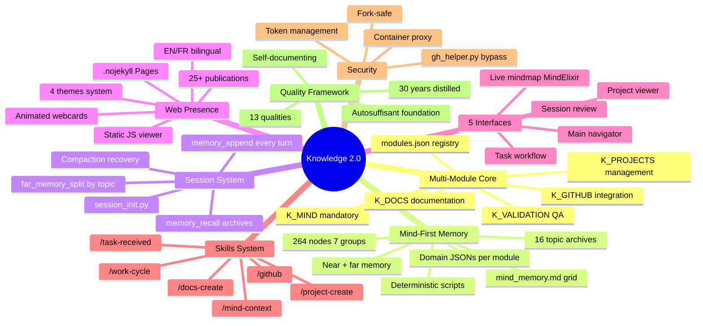


**The architectural pillars**:

| # | Pillar | Essence | Key elements |
|---|--------|---------|--------------|
| 1 | **Multi-module core** | The K_ organization | 5 modules + registry, each with own conventions/work/scripts |
| 2 | **Mind-first memory** | The operating memory | Mindmap → domain JSONs → near/far → archives |
| 3 | **Session system** | The work rhythm | init → append → split → recover |
| 4 | **Web presence** | The public face | Static viewer, .nojekyll, 4 themes, 25+ pubs |
| 5 | **5 interfaces** | The interactive layer | Navigator, session, task, project, mindmap |
| 6 | **Skills system** | The command surface | Module-specific skills invoked by Claude |
| 7 | **Security** | Trust by design | Proxy model, token management, fork-safe |
| 8 | **Quality framework** | The quality contract | 13 qualities, dependency graph, 30 years distilled |

---

## 13. Module Structure Mindmap

The Knowledge 2.0 file-level structure — every module and its components.

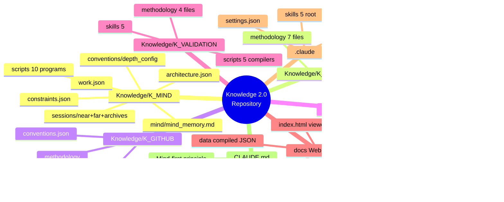


**Module roles**:

| Module | Files | Primary Role |
|--------|-------|-------------|
| **K_MIND** | 38 | Core memory: mindmap, sessions, domain JSONs, 10 scripts |
| **K_DOCS** | 4,374 | Documentation pipeline: web viewer, publications, interfaces |
| **K_PROJECTS** | 13 | Project management: P# registry, compilation, skills |
| **K_VALIDATION** | 19 | QA: task workflow, session protocol, integrity checks |
| **K_GITHUB** | 9 | GitHub sync: issues, PRs, boards, enrichment |
| **docs/** | 100+ | Web output: static viewer, 25+ pubs, 5 interfaces |

---

## 14. Publication Structure Mindmap

The anatomy of a single Knowledge 2.0 publication — components, tiers, assets, and integration.

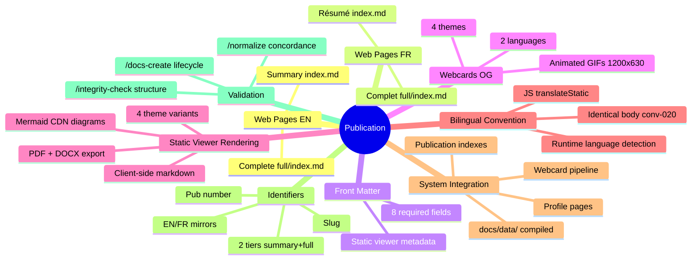


**Publication lifecycle**:

```
/docs-create → EN/FR pages scaffolded → Webcards generated
    → Content written (identical EN/FR body)
    → /normalize → EN/FR concordance verified
    → /integrity-check → Structure validated
    → Push → .nojekyll deploy → Live on GitHub Pages
```

---

## Related Publications

| # | Publication | Relationship |
|---|-------------|-------------|
| 0 | [Knowledge System]({{ '/publications/knowledge-system/' | relative_url }}) | Parent — the system these diagrams visualize |
| 4 | [Distributed Minds]({{ '/publications/distributed-minds/' | relative_url }}) | Architecture — multi-module flow (Diagram 5) |
| 7 | [Harvest Protocol]({{ '/publications/harvest-protocol/' | relative_url }}) | Protocol — data flow (Diagrams 5, 11) |
| 8 | [Session Management]({{ '/publications/session-management/' | relative_url }}) | Lifecycle — K_MIND session system (Diagram 4) |
| 9 | [Security by Design]({{ '/publications/security-by-design/' | relative_url }}) | Security — proxy boundaries (Diagram 7) |
| 12 | [Project Management]({{ '/publications/project-management/' | relative_url }}) | Projects — K_PROJECTS module (Diagrams 1, 8) |

---

*Authors: Martin Paquet & Claude (Anthropic, Opus 4.6)*
*Knowledge 2.0: [packetqc/knowledge](https://github.com/packetqc/knowledge)*
