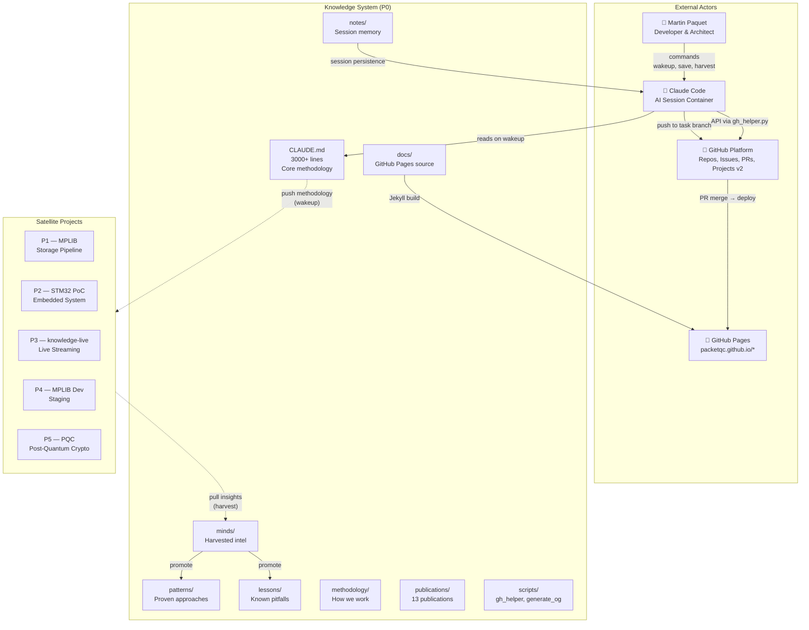
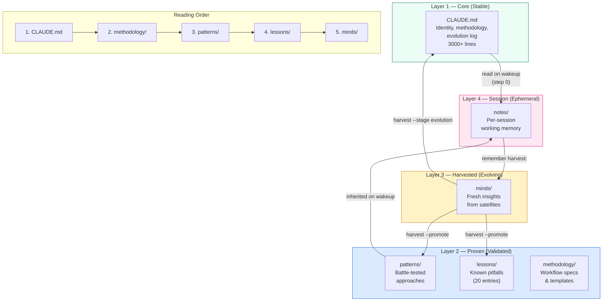
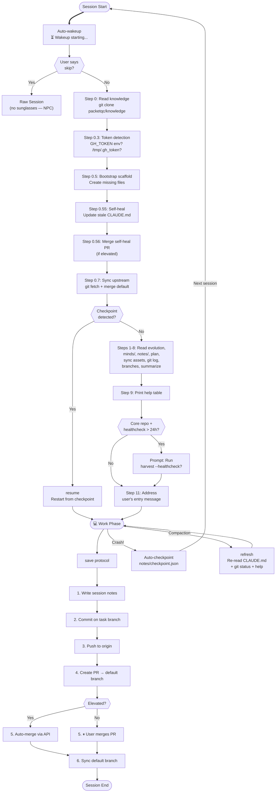
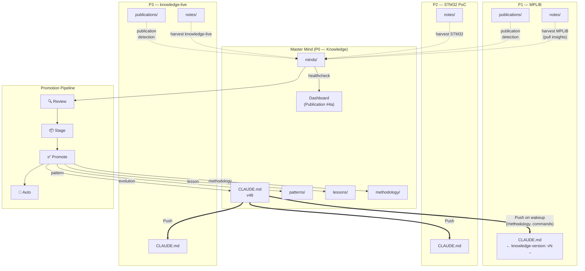

# Knowledge Architecture Diagrams
{: #pub-title}

> **Parent publication**: [#0 — Knowledge System]({{ '/publications/knowledge-system/' | relative_url }}) | **Analysis companion**: [#14 — Architecture Analysis]({{ '/publications/architecture-analysis/' | relative_url }})

**Contents**

| | |
|---|---|
| [Abstract](#abstract) | Visual companion to the architecture analysis |
| [System Overview](#1-system-overview--c4-context) | C4 context diagram — Knowledge at center |
| [Knowledge Layers](#2-knowledge-layers) | 4-layer stack: Core → Proven → Harvested → Session |
| [Session Lifecycle](#4-session-lifecycle) | Wakeup → work → checkpoint → save → PR → merge |
| [Distributed Flow](#5-distributed-flow--push-and-pull) | Push (wakeup) and pull (harvest) with promotion pipeline |
| [Full Documentation](#full-documentation) | All 14 diagrams with complete explanations |

## Target Audience

| Audience | Focus |
|----------|-------|
| **Network Administrators** | Distributed flow (#5), security boundaries (#7), deployment tiers (#8) |
| **System Administrators** | Deployment tiers (#8), GitHub integration (#11), publication pipeline (#6) |
| **Programmers** | Component architecture (#3), session lifecycle (#4), recovery ladder (#10) |
| **Managers** | System overview (#1), knowledge layers (#2), quality dependencies (#9) |

## Abstract

Publication #14 (Architecture Analysis) examines the system through analytical narrative. This publication is the **visual companion** — 14 Mermaid diagrams that render the Knowledge system's structure, flows, boundaries, and dependencies into interactive visualizations.

This summary presents the 4 key diagrams. The [complete documentation]({{ '/publications/architecture-diagrams/full/' | relative_url }}) includes all 14 diagrams covering security boundaries, deployment tiers, quality dependencies, recovery paths, and GitHub integration.

Closes #317

## 1. System Overview — C4 Context

The Knowledge system (P0) at the center of its constellation: satellite projects, GitHub platform, GitHub Pages, Claude Code sessions, and the developer.

The core repo contains all methodology, publications, and tooling. Satellites inherit on `wakeup` (push) and contribute back via `harvest` (pull). GitHub Pages publishes the web presence.

## 2. Knowledge Layers

Four layers of decreasing stability and increasing currency — from DNA (core) to heartbeat (session).

Knowledge flows upward through the promotion pipeline and downward through the wakeup protocol.

## 4. Session Lifecycle

Every Claude Code session follows a deterministic path from auto-wakeup to save.

Three phases: boot (wakeup), work, and delivery (save). Crash recovery via checkpoints. Context loss via `refresh`.

## 5. Distributed Flow — Push and Pull

Bidirectional knowledge flow with the promotion pipeline.

Push delivers methodology outward on wakeup. Harvest pulls insights inward. The promotion pipeline advances insights from raw to core.

## Full Documentation

The [complete documentation]({{ '/publications/architecture-diagrams/full/' | relative_url }}) includes all 14 diagrams:

| # | Diagram | What it shows |
|---|---------|---------------|
| 1 | System Overview | C4 context — Knowledge at center |
| 2 | Knowledge Layers | 4-layer stack with promotion flow |
| 3 | Component Architecture | All folders, scripts, relationships |
| 4 | Session Lifecycle | Wakeup → work → save flowchart |
| 5 | Distributed Flow | Push/pull with promotion pipeline |
| 6 | Publication Pipeline | Source → EN/FR summary/complete |
| 7 | Security Boundaries | Proxy model, allowed/blocked ops |
| 8 | Deployment Tiers | Production/development dual-role |
| 9 | Quality Dependencies | 13 qualities dependency graph |
| 10 | Recovery Ladder | 5 recovery paths by failure mode |
| 11 | GitHub Integration | Issues, PRs, boards lifecycle |
| 12 | System Architecture Mindmap | 9-pillar bird's-eye navigation map |
| 13 | Core Nucleus Mindmap | File-level structure with weight analysis |
| 14 | Publication Structure Mindmap | 9-branch publication anatomy |

**Source**: [Issue #317](https://github.com/packetqc/knowledge/issues/317), [Issue #318](https://github.com/packetqc/knowledge/issues/318) — Architecture exploration sessions.

---

## Related Publications

| # | Publication | Relationship |
|---|-------------|-------------|
| 0 | [Knowledge System]({{ '/publications/knowledge-system/' | relative_url }}) | Parent — the system these diagrams visualize |
| 4 | [Distributed Minds]({{ '/publications/distributed-minds/' | relative_url }}) | Architecture — push/pull flow (Diagram 5) |
| 7 | [Harvest Protocol]({{ '/publications/harvest-protocol/' | relative_url }}) | Protocol — harvest flow (Diagrams 5, 11) |
| 8 | [Session Management]({{ '/publications/session-management/' | relative_url }}) | Lifecycle — session flow (Diagram 4) |
| 9 | [Security by Design]({{ '/publications/security-by-design/' | relative_url }}) | Security — proxy boundaries (Diagram 7) |
| 12 | [Project Management]({{ '/publications/project-management/' | relative_url }}) | Projects — P# hierarchy (Diagrams 1, 8) |

---

*Authors: Martin Paquet & Claude (Anthropic, Opus 4.6)*
*Knowledge: [packetqc/knowledge](https://github.com/packetqc/knowledge)*
