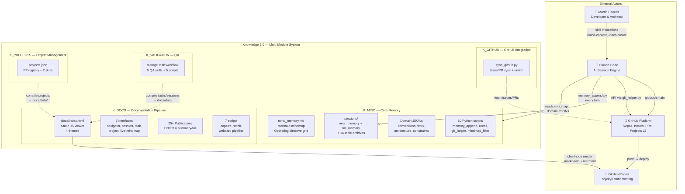
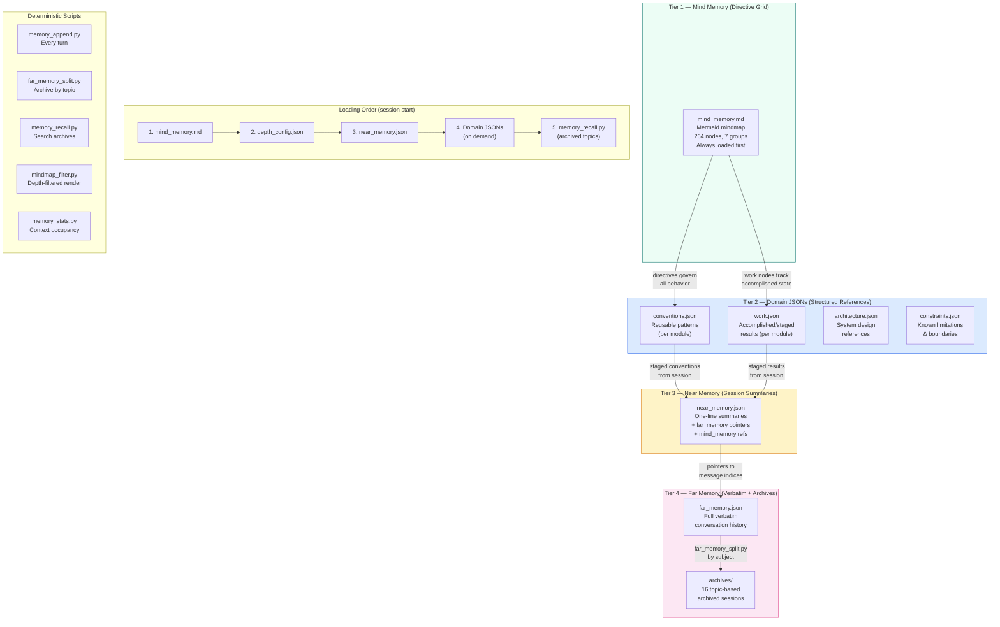
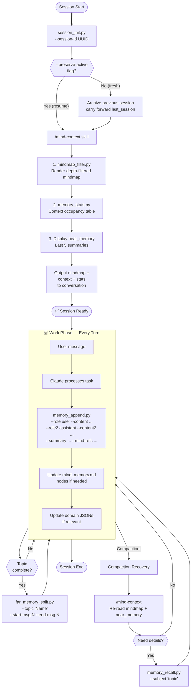
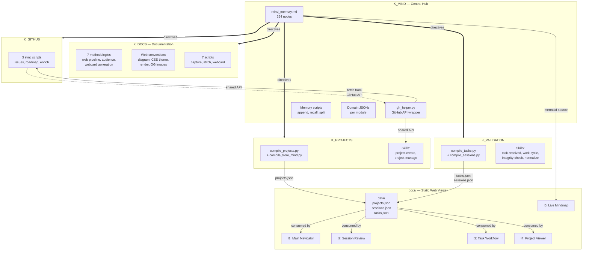

# Knowledge 2.0 Architecture Diagrams
{: #pub-title}

> **Parent publication**: [#0 — Knowledge System]({{ '/publications/knowledge-system/' | relative_url }}) | **Analysis companion**: [#14 — Architecture Analysis]({{ '/publications/architecture-analysis/' | relative_url }})

**Contents**

| | |
|---|---|
| [Abstract](#abstract) | Visual companion to the Knowledge 2.0 architecture |
| [System Overview](#1-system-overview--c4-context) | C4 context — Multi-module system at center |
| [Mind-First Memory](#2-mind-first-memory-architecture) | 4-tier memory: Mindmap → Domain JSONs → Near → Far |
| [Session Lifecycle](#4-session-lifecycle) | session_init → /mind-context → memory_append → archive |
| [Module Interaction](#5-module-interaction-flow) | K_MIND central hub, compilation pipelines, skill invocations |
| [Full Documentation](#full-documentation) | All 14 diagrams with complete explanations |

## Target Audience

| Audience | Focus |
|----------|-------|
| **Network Administrators** | Module interaction (#5), security boundaries (#7), web architecture (#8) |
| **System Administrators** | Web architecture (#8), GitHub integration (#11), publication pipeline (#6) |
| **Programmers** | Multi-module architecture (#3), session lifecycle (#4), recovery paths (#10) |
| **Managers** | System overview (#1), mind-first memory (#2), quality dependencies (#9) |

## Abstract

Publication #14 (Architecture Analysis) examines the system through analytical narrative. This publication is the **visual companion** — 14 Mermaid diagrams that render the Knowledge 2.0 multi-module system's structure, flows, boundaries, and dependencies into interactive visualizations.

This summary presents the 4 key diagrams. The [complete documentation]({{ '/publications/architecture-diagrams/full/' | relative_url }}) includes all 14 diagrams covering security boundaries, web architecture, quality dependencies, recovery paths, and GitHub integration.

## 1. System Overview — C4 Context

The Knowledge 2.0 system at the center of its constellation: 5 K_ modules, GitHub platform, GitHub Pages (.nojekyll static hosting), Claude Code sessions, and the developer.

The system is organized as 5 K_ modules under `Knowledge/`. K_MIND is the mandatory core. Other modules provide specialized capabilities. GitHub Pages serves the static web viewer with client-side rendering.

## 2. Mind-First Memory Architecture

Four tiers of decreasing stability and increasing granularity — from the directive grid (mindmap) to the full verbatim archive.

Knowledge flows upward through the staging pipeline and downward as operational directives. All mechanical operations use deterministic Python scripts.

## 4. Session Lifecycle

Every Claude Code session follows a deterministic lifecycle managed by K_MIND scripts.

Three phases: boot (/mind-context), work (memory_append every turn), and recovery (compaction handling). The mindmap is always loaded first as it contains all behavioral directives.

## 5. Module Interaction Flow

How the 5 K_ modules interact: K_MIND as central hub, compilation pipelines feeding the web viewer.

K_MIND is the hub — its mindmap provides directives to all modules, and gh_helper.py is the shared GitHub API wrapper. Compilation scripts produce JSON data consumed by the 5 web interfaces.

## Full Documentation

The [complete documentation]({{ '/publications/architecture-diagrams/full/' | relative_url }}) includes all 14 diagrams:

| # | Diagram | What it shows |
|---|---------|---------------|
| 1 | System Overview | C4 context — Multi-module system at center |
| 2 | Mind-First Memory | 4-tier memory architecture with scripts |
| 3 | Multi-Module Architecture | 5 K_ modules, scripts, relationships |
| 4 | Session Lifecycle | session_init → work → archive flowchart |
| 5 | Module Interaction | K_MIND hub, compilation pipelines |
| 6 | Publication Pipeline | Source → static viewer → EN/FR × 4 themes |
| 7 | Security Boundaries | Proxy model, allowed/blocked ops |
| 8 | Web Architecture | Static viewer, 4 themes, 5 interfaces |
| 9 | Quality Dependencies | 13 qualities dependency graph |
| 10 | Recovery Paths | K_MIND recovery: compaction, recall, init |
| 11 | GitHub Integration | K_GITHUB sync, compilation, board lifecycle |
| 12 | System Architecture Mindmap | K2.0 architectural pillars |
| 13 | Module Structure Mindmap | File-level multi-module structure |
| 14 | Publication Structure Mindmap | Publication anatomy with static viewer |

---

## Related Publications

| # | Publication | Relationship |
|---|-------------|-------------|
| 0 | [Knowledge System]({{ '/publications/knowledge-system/' | relative_url }}) | Parent — the system these diagrams visualize |
| 4 | [Distributed Minds]({{ '/publications/distributed-minds/' | relative_url }}) | Architecture — multi-module flow (Diagram 5) |
| 7 | [Harvest Protocol]({{ '/publications/harvest-protocol/' | relative_url }}) | Protocol — data flow (Diagrams 5, 11) |
| 8 | [Session Management]({{ '/publications/session-management/' | relative_url }}) | Lifecycle — K_MIND session system (Diagram 4) |
| 9 | [Security by Design]({{ '/publications/security-by-design/' | relative_url }}) | Security — proxy boundaries (Diagram 7) |
| 12 | [Project Management]({{ '/publications/project-management/' | relative_url }}) | Projects — K_PROJECTS module (Diagrams 1, 8) |

---

*Authors: Martin Paquet & Claude (Anthropic, Opus 4.6)*
*Knowledge 2.0: [packetqc/knowledge](https://github.com/packetqc/knowledge)*
