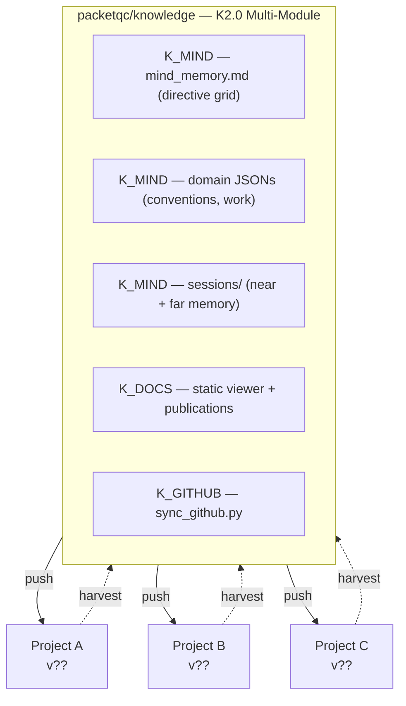
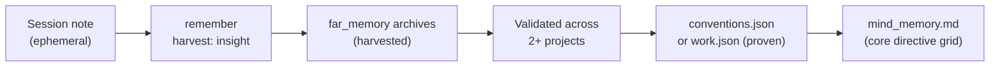

# Distributed Knowledge Dashboard — Complete Documentation
{: #pub-title}

**Contents**

| | |
|---|---|
| [Authors](#authors) | Publication authors |
| [Abstract](#abstract) | Living dashboard concept and purpose |
| [Satellite Network Status](#satellite-network-status) | Real-time satellite inventory table |
| &nbsp;&nbsp;[Status Icon Legend](#status-icon-legend) | 5-level severity icon definitions |
| &nbsp;&nbsp;[Reading the Table](#reading-the-table) | Column-by-column explanation |
| [Acquired Knowledge](#acquired-knowledge) | Insights extracted from satellites |
| &nbsp;&nbsp;[Insights Pending Promotion](#insights-pending-promotion) | Promotion candidates with action commands |
| &nbsp;&nbsp;[Discovered Publications](#discovered-publications) | Technical content found in satellite repos |
| [Master Mind Status](#master-mind-status) | Core repository current state |
| &nbsp;&nbsp;[Knowledge Evolution Summary](#knowledge-evolution-summary) | Full version history v1 through v47 |
| [How the Network Works](#how-the-network-works) | Push/harvest bidirectional flow diagram |
| [How Harvest Updates This Dashboard](#how-harvest-updates-this-dashboard) | Step-by-step harvest-to-dashboard pipeline |
| [Architecture Deep Dive](#architecture-deep-dive) | Technical architecture details |
| &nbsp;&nbsp;[Knowledge Layers](#knowledge-layers) | Core, proven, harvested, session hierarchy |
| &nbsp;&nbsp;[Lifecycle of an Insight](#lifecycle-of-an-insight) | From session note to core knowledge |
| &nbsp;&nbsp;[Version Drift and Remediation](#version-drift-and-remediation) | How satellites track and close the gap |
| [Related Publications](#related-publications) | Links to sibling publications |

## Authors

**Martin Paquet** — Network security analyst programmer, network and system security administrator, and embedded software designer and programmer. Architect of the distributed knowledge system. Designed the bidirectional flow between a central knowledge repository and satellite projects, enabling AI coding assistants to accumulate and share wisdom across independent projects.

**Claude** (Anthropic, Opus 4.6) — AI development partner operating across multiple satellite projects. Both a consumer and contributor of the distributed knowledge — reads the master mind on wakeup, evolves knowledge in satellites during work, and feeds discoveries back on harvest.

---

## Abstract

AI coding assistants gain persistent memory through `CLAUDE.md` and `notes/` — but each project evolves independently. The **distributed knowledge system** connects them: a master mind (`packetqc/knowledge`) pushes methodology to satellites on wakeup, and the `harvest` command pulls evolved knowledge back. This creates a living network of AI instances that learn from each other.

This publication is itself a **living dashboard** — updated on every `harvest` run. It shows the current state of the master mind, all known satellites, their knowledge version, drift status, and discovered publications. It is the network's self-awareness.

---

## Satellite Network Status

> **This section is updated on every `harvest` run. Each row represents a satellite project.**
> **Access scope**: Only includes repositories that the user owns and that Claude Code has been granted access to via its GitHub application configuration. No external or third-party repos are ever accessed.

| Satellite | Version | Drift | Bootstrap | Sessions | Assets | Live | Pubs | Health | Last Harvest |
|-----------|---------|-------|-----------|----------|--------|------|------|--------|--------------|
| [knowledge](https://github.com/packetqc/knowledge) (self) | v47 | 🟢 0 | 🟢 **core** | 🟢 16 | 🟢 core | 🟢 1 | 14 | 🟢 healthy | 2026-02-23 |
| [MPLIB](https://github.com/packetqc/MPLIB) | v31 | 🔴 16 | 🟢 active | 🟢 2 | 🟢 deployed | ⚪ 0 | 0 | 🟢 healthy | 2026-02-22 |
| [knowledge-live](https://github.com/packetqc/knowledge-live) | v39 | 🔴 8 | 🟢 active | 🟢 7 | 🟢 deployed | ⚪ 0 | 1 | 🟢 healthy | 2026-02-24 |
| [STM32N6570-DK_SQLITE](https://github.com/packetqc/STM32N6570-DK_SQLITE) | v31 | 🔴 16 | 🟢 active | 🟢 3 | 🟢 deployed | ⚪ 0 | 1 | 🟢 healthy | 2026-02-22 |
| [MPLIB_DEV_STAGING](https://github.com/packetqc/MPLIB_DEV_STAGING_WITH_CLAUDE) | v31 | 🔴 16 | 🟢 active | 🟢 5 | 🟢 deployed | ⚪ 0 | 0 | 🔴 unreachable | 2026-02-22 |
| [PQC](https://github.com/packetqc/PQC) | v0 | 🔴 47 | 🔴 missing | ⚪ 0 | 🔴 missing | ⚪ 0 | 0 | 🟢 healthy | 2026-02-22 |

### Status Icon Legend

| Icon | Severity | Used in |
|------|----------|---------|
| 🟢 | **Current / Healthy** — aligned with core | Drift (0), Bootstrap (active), Sessions (1+), Assets (deployed), Live (1+), Health (reachable) |
| 🟡 | **Minor drift** — slightly behind, low risk | Drift (1-3), Health (stale — was reachable, now failing) |
| 🟠 | **Moderate drift** — several features behind | Drift (4-7) |
| 🔴 | **Critical / Missing** — far behind or absent | Drift (8+), Bootstrap (missing), Assets (missing), Health (unreachable) |
| ⚪ | **Inactive** — not yet started, neutral | Sessions (0), Live (0), Health (pending — not yet attempted) |

### Reading the Table

| Column | Meaning |
|--------|---------|
| **Satellite** | Repository name |
| **Version** | Knowledge version tag found in satellite CLAUDE.md (`v0` = no tag) |
| **Drift** | Versions behind core — 🟢 0 / 🟡 1-3 / 🟠 4-7 / 🔴 8+ |
| **Bootstrap** | Does CLAUDE.md reference `packetqc/knowledge`? — 🟢 active / 🔴 missing |
| **Sessions** | Session files in `notes/` — 🟢 1+ / ⚪ 0 |
| **Assets** | Are knowledge assets (`live/`, tooling) deployed? — 🟢 deployed / 🔴 missing |
| **Live** | Active Claude Code instances on network — 🟢 1+ / ⚪ 0 |
| **Publications** | Number of publications detected in satellite |
| **Health** | Repo accessibility — 🟢 healthy / 🟡 stale / 🔴 unreachable / ⚪ pending |
| **Last Harvest** | Date of most recent harvest |

---

## Fork & Clone Safety

This dashboard is a **live document** — updated on every `harvest` run with real satellite data. If you fork this repository:

| Element | Behavior in your fork |
|---------|----------------------|
| **Satellite table** | Reflects the original owner's project network — static historical data until you run your own harvests |
| **Credentials / tokens** | None embedded — the dashboard contains only public repository URLs and status metadata |
| **Harvest commands** | Reference the original owner's repos — replace `packetqc` with your GitHub username to build your own network dashboard |
| **Promotion candidates** | Specific to the original owner's satellites — start fresh in your fork |

The dashboard template and severity icon system are fully reusable. Fork, replace the namespace, run `harvest --healthcheck`, and the dashboard populates with your own satellite data.

---

## Acquired Knowledge

> **This section accumulates insights extracted from satellite projects.**
> Click any action icon to copy the command — paste into Claude Code to advance the insight through the promotion workflow.
>
> **Workflow**: `harvested` → 🔍 review → 📦 stage → ✅ promote → or 🔄 auto-promote on next healthcheck
>
> | Icon | Command | Effect |
> |------|---------|--------|
> | 🔍 | `harvest --review N` | Mark as reviewed — human has read and validated the insight |
> | 📦 | `harvest --stage N <type>` | Stage for integration — type: `lesson`, `pattern`, `methodology`, `docs` |
> | ✅ | `harvest --promote N` | Promote to core knowledge now — writes to `patterns/` or `lessons/` |
> | 🔄 | `harvest --auto N` | Enable auto-promote — insight will be promoted on next healthcheck run |

### Insights Pending Promotion

| # | Insight | Source | Target | Status | Actions |
|---|---------|--------|--------|--------|---------|
| 1 | Page cache sizing degradation (81% collapse) | STM32N6570-DK_SQLITE | lessons/pitfalls.md | harvested | 🔍 `harvest --review 1` 📦 `harvest --stage 1 lesson` ✅ `harvest --promote 1` 🔄 `harvest --auto 1` |
| 2 | Printf latency in hot path (1-5 ms/call) | STM32N6570-DK_SQLITE | lessons/pitfalls.md | harvested | 🔍 `harvest --review 2` 📦 `harvest --stage 2 lesson` ✅ `harvest --promote 2` 🔄 `harvest --auto 2` |
| 3 | Slot size vs page size mismatch (memsys5) | STM32N6570-DK_SQLITE | lessons/pitfalls.md | harvested | 🔍 `harvest --review 3` 📦 `harvest --stage 3 lesson` ✅ `harvest --promote 3` 🔄 `harvest --auto 3` |
| 4 | Multi-RTOS abstraction (FreeRTOS/ThreadX) | MPLIB | patterns/rtos-integration.md | harvested | 🔍 `harvest --review 4` 📦 `harvest --stage 4 pattern` ✅ `harvest --promote 4` 🔄 `harvest --auto 4` |
| 5 | CubeMX N6570-DK limitation | MPLIB | lessons/pitfalls.md | harvested | 🔍 `harvest --review 5` 📦 `harvest --stage 5 lesson` ✅ `harvest --promote 5` 🔄 `harvest --auto 5` |
| 6 | TouchGFX MVP with backend services | MPLIB | patterns/ui-backend-separation.md | harvested | 🔍 `harvest --review 6` 📦 `harvest --stage 6 pattern` ✅ `harvest --promote 6` 🔄 `harvest --auto 6` |
| 7 | ML-KEM/ML-DSA sizing for embedded | PQC | patterns/ (new: pqc-embedded.md) | harvested | 🔍 `harvest --review 7` 📦 `harvest --stage 7 pattern` ✅ `harvest --promote 7` 🔄 `harvest --auto 7` |
| 8 | PQC library compliance (WolfSSL=prod) | PQC | patterns/ (new: pqc-embedded.md) | harvested | 🔍 `harvest --review 8` 📦 `harvest --stage 8 pattern` ✅ `harvest --promote 8` 🔄 `harvest --auto 8` |
| 9 | Flash certificate storage pattern | PQC | patterns/embedded-debugging.md | harvested | 🔍 `harvest --review 9` 📦 `harvest --stage 9 pattern` ✅ `harvest --promote 9` 🔄 `harvest --auto 9` |
| 10 | AI-assisted module staging methodology | MPLIB_DEV_STAGING_WITH_CLAUDE | methodology/ | harvested | 🔍 `harvest --review 10` 📦 `harvest --stage 10 methodology` ✅ `harvest --promote 10` 🔄 `harvest --auto 10` |
| 11 | Parallel instance operations (core + satellite) | MPLIB_DEV_STAGING_WITH_CLAUDE | methodology/ | harvested | 🔍 `harvest --review 11` 📦 `harvest --stage 11 methodology` ✅ `harvest --promote 11` 🔄 `harvest --auto 11` |
| 12 | Two-merge bootstrap lifecycle (bootstrap → normalize → healthcheck) | MPLIB_DEV_STAGING_WITH_CLAUDE | methodology/ | harvested | 🔍 `harvest --review 12` 📦 `harvest --stage 12 methodology` ✅ `harvest --promote 12` 🔄 `harvest --auto 12` |
| 13 | Satellite thin-wrapper principle (~30 lines, not ~120) | MPLIB_DEV_STAGING_WITH_CLAUDE | CLAUDE.md (bootstrap template) | harvested | 🔍 `harvest --review 13` 📦 `harvest --stage 13 methodology` ✅ `harvest --promote 13` 🔄 `harvest --auto 13` |
| 14 | Evolution relay methodology — new `evolution` stage type for harvest | knowledge-live | CLAUDE.md (v39) | **promoted** | ✅ Promoted as v39 evolution entry |
| 15 | Managed projects — subfolder scaffold, harvest routing, board linked to repo | knowledge-live | projects/ + methodology/ | **promoted** | ✅ Promoted as P6 (Export Documentation) + methodology update |
| 16 | Autonomous convergence — elevated sessions converge without human relay | knowledge-live | patterns/ | harvested | 🔍 `harvest --review 16` 📦 `harvest --stage 16 pattern` ✅ `harvest --promote 16` 🔄 `harvest --auto 16` |
| 17 | Beacon PQC integration — protocol v0→v1, --secure flag, crypto identity | knowledge-live | docs/ | harvested | 🔍 `harvest --review 17` 📦 `harvest --stage 17 docs` ✅ `harvest --promote 17` 🔄 `harvest --auto 17` |
| 18 | GitHub Project bidirectional integration — issues/PRs as bridge between collaboration and intelligence | knowledge-live | methodology/ | **promoted** | ✅ Promoted to methodology/github-project-integration.md |
| 19 | TAG: convention — prefix issue titles with knowledge structure type + matching GitHub labels | knowledge-live | methodology/ | **promoted** | ✅ Promoted to methodology/github-project-integration.md |
| 20 | Entity convention — #N:story/#N:task/#N:bug for typed project items with GitHub sync | knowledge-live | methodology/ | **promoted** | ✅ Promoted to methodology/github-project-integration.md |
| 21 | Quality candidate "Intégré" — external platform integration as 13th core quality | knowledge-live | CLAUDE.md | **promoted** | ✅ Promoted as core quality #13 in CLAUDE.md |
| 22 | gh_helper.py board reader + bidirectional reconciliation (items-list, sync, labels setup-all) | knowledge-live | methodology/ | **promoted** | ✅ Promoted to core scripts/gh_helper.py (836→1494 lines) |
| 23 | Dynamic roadmap — board-driven web publication pipeline (sync_roadmap.py + GitHub Actions) | knowledge-live | methodology/ | **promoted** | ✅ Promoted to core scripts/sync_roadmap.py + methodology |
| 24 | Autonomous proof — zero-manual GitHub UI intervention cycle (19 items, 9 labels, 13 PRs) | knowledge-live | patterns/ | **promoted** | ✅ Promoted to methodology/github-project-integration.md |

### Discovered Publications

Publications detected in satellite repos:

| Title | Satellite | Path | Status | Actions |
|-------|-----------|------|--------|---------|
| Architecture doc (SQLite pipeline) | STM32N6570-DK_SQLITE | doc/readme.md | **published** — already core Publication #1 | 🔍 `harvest --review pub:stm32` 📦 `harvest --stage pub:stm32 docs` ✅ `harvest --promote pub:stm32` 🔄 `harvest --auto pub:stm32` |
| #1 GitHub Project Integration | knowledge-live | publications/github-project-integration/v1/README.md | harvested — three-tier bilingual (source + EN/FR docs) | 🔍 `harvest --review pub:kl1` 📦 `harvest --stage pub:kl1 docs` ✅ `harvest --promote pub:kl1` 🔄 `harvest --auto pub:kl1` |

---

## Master Mind Status

> **This section is updated on every `harvest` run.**

| Field | Value |
|-------|-------|
| Repository | [packetqc/knowledge](https://github.com/packetqc/knowledge) |
| Current version | **v47** |
| Total evolution entries | 47 |
| Publications | 14 (#0–#12 + #4a dashboard + #9a compliance) |
| Proven patterns | 4 (embedded debugging, RTOS, SQLite, UI/backend) |
| Lessons documented | 17 pitfalls, performance benchmarks |
| Methodology docs | 6 (session protocol, commands, working style, project management, production-development tiers, GitHub Project integration) |
| Projects registered | 9 (P0–P8) |
| Last updated | 2026-02-24 |

### Knowledge Evolution Summary

| Version | Feature | Date |
|---------|---------|------|
| v1 | Session persistence (CLAUDE.md + notes/ + lifecycle) | 2026-02-16 |
| v2 | Free Guy analogy (sunglasses = awareness) | 2026-02-16 |
| v3 | Knowledge repo as portable bootstrap | 2026-02-17 |
| v4 | Multipart help architecture | 2026-02-17 |
| v5 | Step 0: sunglasses first | 2026-02-17 |
| v6 | Chicken-and-egg bootstrap | 2026-02-17 |
| v7 | Normalize command | 2026-02-17 |
| v8 | Profile hub architecture | 2026-02-17 |
| v9 | Distributed minds — bidirectional flow | 2026-02-18 |
| v10 | Knowledge versioning + drift remediation | 2026-02-18 |
| v11 | Interactive promotion + severity icons + healthcheck | 2026-02-18 |
| v12 | Knowledge branch protocol | 2026-02-19 |
| v13 | Public HTTPS repo access + autonomous branch creation | 2026-02-19 |
| v14 | `claude/knowledge` replaces `knowledge` branch | 2026-02-19 |
| v15 | End-to-end protocol validation | 2026-02-19 |
| v16 | Save merge protocol + cross-repo push discovery | 2026-02-19 |
| v17 | Proxy reality — semi-automatic protocol | 2026-02-19 |
| v18 | `main` replaces `claude/knowledge` as convergence | 2026-02-19 |
| v19 | Todo list must mirror full save protocol | 2026-02-19 |
| v20 | Semi-automatic delivery documentation + admin routine | 2026-02-19 |
| v21 | Access scope — user-owned repos only | 2026-02-19 |
| v22 | Dual-theme webcards: Cayman (light) + Midnight (dark) | 2026-02-19 |
| v23 | Live knowledge network + bootstrap scaffold | 2026-02-20 |
| v24 | `refresh` command + dashboard field rename | 2026-02-20 |
| v25 | Core Qualities + iterative staging installation | 2026-02-20 |
| v26 | Scoped project notes + 4-theme accessibility | 2026-02-20 |
| v27 | Ephemeral token protocol — private repo access | 2026-02-21 |
| v28 | Proxy deep mapping + token-mediated API bypass | 2026-02-21 |
| v29 | Checkpoint/resume — crash recovery | 2026-02-21 |
| v30 | Safe elevation protocol — API crash mitigation | 2026-02-21 |
| v31 | Critical-subset satellite CLAUDE.md | 2026-02-21 |
| v32 | `recall` command + universal contextual help with publication links | 2026-02-21 |
| v33 | PAT Access Levels — 4-tier configuration model | 2026-02-21 |
| v34 | Secure textarea token delivery — single path, invisible in transcript | 2026-02-21 |
| v35 | Project as first-class entity — hierarchical indexing, dual-origin links | 2026-02-22 |
| v36 | GitHub helper — deployed failsafe for PR management | 2026-02-22 |
| v37 | Self-healing satellite CLAUDE.md — automatic drift remediation | 2026-02-22 |
| v38 | Self-heal PR merge — same-session command activation | 2026-02-22 |
| v39 | Evolution relay — satellites propose core evolution | 2026-02-22 |
| v40 | Proxy deep mapping v2 + GitHub Project boards created | 2026-02-22 |
| v41 | GitHub Project repo linking + safe elevation hardened | 2026-02-23 |
| v42 | gh_helper.py as sole API method + API 400/500 crash resilience | 2026-02-23 |
| v43 | Wakeup deduplication — root cause of API 400 crashes found | 2026-02-23 |
| v44 | Interactive Input Convention + Tool Call Discipline | 2026-02-23 |
| v45 | Token display fix — AskUserQuestion "Other" field is NOT invisible | 2026-02-23 |
| v46 | Token zero-display — environment-only delivery + GraphQL in gh_helper.py | 2026-02-23 |
| v47 | Production/Development mind deployment model — multi-tier architecture | 2026-02-23 |

---

## How the Network Works

**Push**: On `wakeup`, every satellite reads the master mind. This is the sunglasses moment — the AI instance becomes aware.

**Harvest**: On `harvest <project>`, the master crawls all branches of a satellite, extracts evolved knowledge, detects publications, and reports version drift.

**Versioning**: Each Knowledge Evolution entry carries a version number (v1, v2, ...). Satellites track which version they last synced with. The drift between satellite and core reveals which features are missing.

---

## How Harvest Updates This Dashboard

Every `harvest <project>` run:

| Step | Action |
|------|--------|
| 1 | Scans the satellite's branches (incremental — only new commits since last cursor) |
| 2 | Extracts knowledge, patterns, pitfalls, and Claude instructions into `minds/<project>.md` |
| 3 | Checks satellite's knowledge version against core version |
| 4 | Reports knowledge distribution status (bootstrap, sessions, live, publications) |
| 5 | **Updates this dashboard** — refreshes the Satellite Network Status table and Harvested Insights sections |

The dashboard is the **self-awareness layer** of the distributed mind network. It answers: "What does the network look like right now? Who's current? Who's behind? What have we learned?"

---

## Architecture Deep Dive

### Knowledge Layers

| Layer | Location | Stability | Purpose |
|-------|----------|-----------|---------|
| **Core** | `CLAUDE.md` | Stable | Identity, methodology, evolution log |
| **Proven** | `patterns/`, `lessons/`, `methodology/` | Validated | Battle-tested across projects |
| **Harvested** | `minds/` | Evolving | Fresh from satellite experiments |
| **Session** | `notes/` | Ephemeral | Per-session working memory |

### Lifecycle of an Insight

### Version Drift and Remediation

Satellites don't need to copy core features — they reference the core on `wakeup`. The version tag tracks *awareness*:

| Version state | Meaning |
|---------------|---------|
| **v0** (no tag) | Pre-versioning. First `harvest --fix` adds the tag. |
| **vN < current** | Behind. `harvest` reports missing features. `--fix` updates the tag. |
| **vN = current** | Up to date. The satellite's Claude instances read the latest core on wakeup. |

`harvest --fix <project>` updates the satellite's CLAUDE.md bootstrap section and version tag. No content is copied — just the pointer. The knowledge flows at wakeup.

---

## Related Publications

| # | Publication | Relationship |
|---|-------------|-------------|
| 0 | [Knowledge]({{ '/publications/knowledge-system/' | relative_url }}) | **Master publication** — the system this dashboard monitors |
| 4 | [Distributed Minds]({{ '/publications/distributed-minds/' | relative_url }}) | **Parent publication** — the architecture this dashboard visualizes |
| 1 | [MPLIB Storage Pipeline]({{ '/publications/mplib-storage-pipeline/' | relative_url }}) | First satellite project — high-throughput embedded patterns |
| 2 | [Live Session Analysis]({{ '/publications/live-session-analysis/' | relative_url }}) | Capture tooling synced from master to satellites |
| 3 | [AI Session Persistence]({{ '/publications/ai-session-persistence/' | relative_url }}) | Foundation — the methodology this dashboard tracks |

---

*Authors: Martin Paquet & Claude (Anthropic, Opus 4.6)*
*Knowledge: [packetqc/knowledge](https://github.com/packetqc/knowledge)*
*This is a living document — updated on every `harvest` run.*
